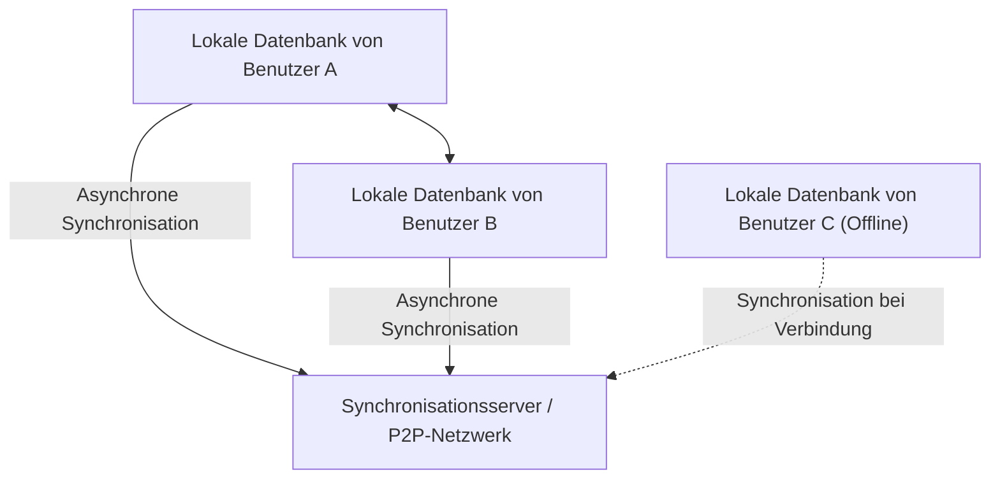
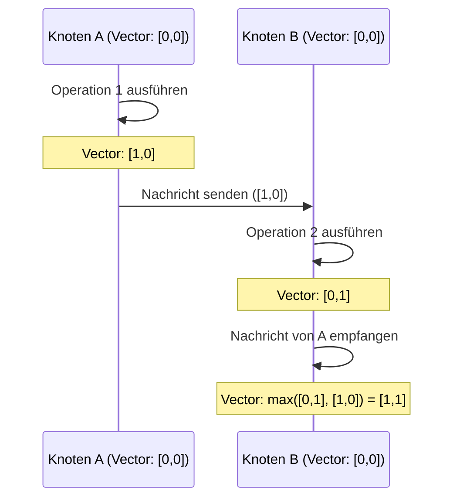

# CRDT und Local-First: Wie Offline-Zusammenarbeit funktioniert

In der modernen Softwareentwicklung hat das Paradigma "Local-First" große Aufmerksamkeit erregt. Herkömmliche Cloud-First-Anwendungen setzten eine ständige Internetverbindung voraus, was zu einer erheblich beeinträchtigten Benutzererfahrung in Offline-Zuständen oder bei instabilen Netzwerken führte. Der Ansatz zur Lösung dieses Problems ist Local-First-Software, deren technische Grundlage durch **CRDT (Conflict-free Replicated Data Type: konfliktfreier replizierter Datentyp)** gestützt wird.

In diesem Artikel werden wir tief eintauchen und von den theoretischen Grundlagen von CRDT über den Vergleich mit OT (Operational Transformation), mathematischen Beweisen, der Rolle logischer Uhren in verteilten Systemen bis hin zu konkreten Implementierungsbeispielen mit JavaScript (Yjs, Automerge) erklären.

## 1. Die Ära der Local-First-Software

Local-First-Software ist eine Architektur, bei der primäre Daten und Anwendungslogik auf dem Gerät des Benutzers gespeichert werden und die Synchronisation nahtlos im Hintergrund erfolgt, wenn eine Netzwerkverbindung verfügbar ist. Dieser Ansatz bietet folgende Vorteile:

*   **Vollständiger Offline-Betrieb**: Sie können Ihre Arbeit jederzeit und überall fortsetzen, unabhängig von einer Netzwerkverbindung.
*   **Niedrige Latenz**: Da das Lesen und Schreiben von Daten lokal abgeschlossen wird, gibt es keine Verzögerungen durch die Kommunikation mit der Cloud.
*   **Datenschutz und Sicherheit**: Da die Daten lokal gespeichert werden, haben die Benutzer die volle Kontrolle über ihre eigenen Daten.
*   **Nahtlose gemeinsame Bearbeitung**: Änderungen, die offline vorgenommen wurden, werden automatisch und ohne Konflikte mit den Änderungen anderer Benutzer zusammengeführt, wenn Sie wieder online sind.



Es ist CRDT, das diese "automatische Zusammenführung ohne Konflikte" realisiert. Bei herkömmlichen Methoden war die Konfliktlösung bei der gleichzeitigen Bearbeitung extrem schwierig, aber CRDT löst dieses Problem elegant auf der Grundlage eines mathematischen Fundaments.

## 2. Unterschiede und Grenzen im Vergleich zu OT (Operational Transformation)

Bevor CRDT aufkam, war der De-facto-Standard für die gemeinsame Bearbeitung (Zusammenarbeit in Echtzeit) **OT (Operational Transformation)**. Frühe Systeme für die gemeinsame Bearbeitung wie Google Docs und Etherpad verwendeten dieses OT.

### Wie OT funktioniert
OT ist eine Methode, bei der die von jedem Benutzer durchgeführten "Operationen" (Operations) an den Server gesendet werden und der Server diese Operationen transformiert, um einen konsistenten Zustand bei allen Clients aufrechtzuerhalten.
Wenn zum Beispiel Benutzer A "X" an Index 1 einfügt und gleichzeitig Benutzer B "Y" an Index 1 einfügt, entsteht ein Widerspruch im Zustand, wenn sie direkt angewendet werden. Der Server verhindert diesen Widerspruch, indem er die Reihenfolge dieser Operationen bestimmt und den Index der später angewendeten Operation verschiebt (transformiert).

### Grenzen von OT
OT ist eine leistungsstarke Technologie, hat aber die fatale Schwäche einer extrem hohen Komplexität als verteiltes System.
*   **Notwendigkeit eines zentralisierten Servers**: Ein zentraler Server (Single Point of Truth) zur Anordnung und Transformation von Operationen ist unerlässlich. Es ist nicht geeignet für reine P2P-Kommunikation (Peer-to-Peer) oder für Local-First-Anwendungsfälle, wie das nachträgliche Zusammenführen von Änderungen von Geräten, die mehrere Tage lang offline waren.
*   **Zustandsexplosion und Algorithmuskomplexität**: Mit der Zunahme der Arten von Operationen (Einfügen, Löschen, Formatierungsänderungen usw.) nehmen die Kombinationen von Operationen untereinander (Transformationsmatrix) explosionsartig zu. Es ist extrem schwierig, Transformationsfunktionen für alle Kombinationen korrekt zu implementieren und zu beweisen.

Im Gegensatz dazu erfordert CRDT keinen zentralen Server und hat die Eigenschaft, dass es letztendlich immer zum gleichen Zustand konvergiert (Strong Eventual Consistency), selbst wenn Operationen in einer beliebigen Reihenfolge angewendet werden.

## 3. Grundlagentheorie von CRDT: Mathematische Beweise und Halbordnungen

CRDT ist nicht "eine Datenstruktur, bei der keine Konflikte auftreten". Es ist "eine Datenstruktur, die auch bei Auftreten von Konflikten automatisch und deterministisch ohne vorherige Zustimmung gelöst werden kann". Um dies zu erreichen, nutzt CRDT mathematische Eigenschaften.

Es gibt grob zwei Arten von CRDTs: **CvRDT (Convergent Replicated Data Type: zustandsbasiert)** und **CmRDT (Commutative Replicated Data Type: operationsbasiert)**.

### CvRDT (Zustandsbasiertes CRDT)

CvRDT sendet und empfängt den "Zustand selbst" der Datenstruktur über das Netzwerk und integriert den lokalen Zustand und den empfangenen Zustand mithilfe einer Zusammenführungsfunktion (Merge Function).
Damit diese Zusammenführungsfunktion korrekt funktioniert, muss die Menge der Zustände der Datenstruktur eine **Halbordnung (Partially Ordered Set / Join Semilattice)** bilden, und die Zusammenführungsfunktion muss die folgenden drei mathematischen Eigenschaften erfüllen.

1.  **Kommutativgesetz (Commutativity)**: `merge(A, B) = merge(B, A)`
    *   Das Ergebnis ist dasselbe, unabhängig davon, in welcher Reihenfolge Zustand A und Zustand B zusammengeführt werden.
2.  **Assoziativgesetz (Associativity)**: `merge(merge(A, B), C) = merge(A, merge(B, C))`
    *   Wenn drei oder mehr Zustände zusammengeführt werden, ist das Ergebnis dasselbe, unabhängig davon, aus welcher Kombination zuerst zusammengeführt wird.
3.  **Idempotenz (Idempotence)**: `merge(A, A) = A`
    *   Das Ergebnis ändert sich nicht, egal wie oft derselbe Zustand zusammengeführt wird (es hält wiederholten Netzwerkübertragungen stand).

**Beispiel: Grow-Only Counter (G-Counter)**
Eines der einfachsten CvRDTs ist ein Zähler, der nur inkrementiert. Jeder Knoten hält ein Paar (Vektor) aus seiner eigenen ID und dem Zählwert.
Zustand A: `[Node1: 2, Node2: 1]`
Zustand B: `[Node1: 2, Node2: 3, Node3: 1]`
Die Zusammenführungsfunktion übernimmt den Maximalwert für jede Knoten-ID (die Funktion `max()` erfüllt Kommutativität, Assoziativität und Idempotenz).
Ergebnis: `[Node1: 2, Node2: 3, Node3: 1]`

### CmRDT (Operationsbasiertes CRDT)

CmRDT überträgt "Operationen" (Operations) anstelle von Zuständen über das Netzwerk (Broadcast). Die Synchronisation erfolgt durch die Anwendung der empfangenen Operationen auf den lokalen Zustand.
Damit CmRDT funktioniert, muss die Netzwerkschicht die folgenden Bedingungen erfüllen, oder sie müssen auf Seiten der Datenstruktur gewährleistet sein.

1.  **Kommutativität von Operationen (Commutativity)**: Für alle zwei nebenläufigen Operationen `op1`, `op2` muss das Anwendungsergebnis unabhängig von der Reihenfolge dasselbe sein.
2.  **Exactly-Once-Garantie**: Alle Operationen müssen genau einmal zugestellt werden. Wenn den Operationen jedoch Idempotenz verliehen wird, können sie auch mit At-Least-Once-Zustellung (mit Duplikaten) funktionieren.
3.  **Garantie der kausalen Reihenfolge (Causal Ordering)**: Wenn Operation A die Ursache für Operation B ist, muss A bei allen Replikaten vor B angewendet werden.

CmRDT hat den Vorteil, dass das Kommunikationsvolumen gering ist (da nur die Differenz der Operationen gesendet wird), aber es hängt von der Messaging-Infrastruktur (wie der unten beschriebenen Vector Clock) ab, um die kausale Reihenfolge zu gewährleisten.

## 4. Uhren in verteilten Systemen: Die Bedeutung logischer Uhren

Bei CRDTs, insbesondere bei der Anordnung von Texten in der gemeinsamen Bearbeitung und der Gewährleistung der kausalen Reihenfolge in CmRDT, ist es extrem wichtig, genau zu wissen, "wann und welche Operation durchgeführt wurde".
In einem verteilten System ist es jedoch unmöglich, die physischen Uhren (Wall-clock time) jedes Geräts vollständig zu synchronisieren (selbst bei Verwendung von NTP kann es zu Abweichungen von einigen Millisekunden bis zu einigen Sekunden kommen).

Um dieses Problem zu lösen, wird eine **logische Uhr (Logical Clock)** verwendet, die nicht die physische Zeit, sondern die "zeitliche Abfolge (Kausalität) von Ereignissen" aufzeichnet.

### Lamport Clock (Lamport-Uhr)
Dies ist die grundlegendste logische Uhr, die von Leslie Lamport erfunden wurde.
Jeder Knoten hält einen einzelnen ganzzahligen Wert (Zähler) und aktualisiert ihn nach den folgenden Regeln:
1.  Jedes Mal, wenn lokal ein Ereignis auftritt, wird der Zähler um 1 erhöht.
2.  Beim Senden einer Nachricht wird der aktuelle Wert des Zählers in die Nachricht aufgenommen.
3.  Beim Empfang einer Nachricht wird der eigene Zähler auf `max(eigener Zähler, empfangener Zähler) + 1` aktualisiert.

Dadurch kann die kausale Beziehung "Wenn Ereignis A die Ursache von Ereignis B ist, dann ist der Uhrwert von A < Uhrwert von B" garantiert werden. Es ist jedoch nicht möglich, die Kausalität rückwärts aus dem Uhrwert zu berechnen (die Größe der Uhrwerte zwischen Ereignissen, die parallel aufgetreten sind, ist bedeutungslos).

### Vector Clock (Vektor-Uhr)
Die Vector Clock gleicht die Schwächen der Lamport-Uhr aus und ermöglicht die Bestimmung der vollständigen kausalen Beziehung (oder Nebenläufigkeit) zwischen Ereignissen.
Anstelle eines einzelnen Zählers wird ein Array (Vektor) von Zählern aller Knoten im System verwaltet.

Sie hat den Nachteil, dass die Datengröße mit zunehmender Anzahl von Knoten ansteigt, aber sie wird häufig in Versionskontrollsystemen (wie der Konflikterkennung von DynamoDB) verwendet. In jüngeren CRDT-Algorithmen wird die Reihenfolge effizient bestimmt, indem Varianten von Vector Clocks verwendet werden oder kausale Beziehungen in die Datenstruktur selbst eingebettet werden (wie Zeiger zwischen Knoten im CRDT).



## 5. Praxis mit JavaScript: Yjs und Automerge

Nicht nur in der Theorie, sondern auch in der Praxis ist die Entwicklung mit CRDT in den letzten Jahren sehr einfach geworden. Im JavaScript-Ökosystem sind die beiden Bibliotheken **Yjs** und **Automerge** zum De-facto-Standard für CRDTs geworden.

### Yjs: Schnelle Text- und Rich-Text-Synchronisation

Yjs zeichnet sich durch eine extrem hohe Leistung aus, und offizielle Bindings für zahlreiche Editoren wie ProseMirror, Quill und Monaco Editor werden bereitgestellt. Wenn Sie eine gemeinsame Textbearbeitung (wie einen Google Docs-Klon) aufbauen möchten, ist Yjs die erste Wahl.

Intern werden Daten in Yjs als flache doppelt verkettete Liste dargestellt, wobei jedes Element eine eindeutige ID (ein Paar aus Client-ID und logischer Uhr) besitzt. Dadurch erfolgen das Einfügen und Löschen von Elementen extrem schnell.

**Einfaches Implementierungsbeispiel mit Yjs (Node.js/Browser)**

```javascript
import * as Y from 'yjs'

// Dokumenteninitialisierung
const doc1 = new Y.Doc()
const doc2 = new Y.Doc()

// Erstellen des gemeinsam genutzten Texttyps
const text1 = doc1.getText('myText')
const text2 = doc2.getText('myText')

// Benutzer 1 fügt Text ein
text1.insert(0, 'Hello ')
console.log('User 1 text:', text1.toString()) // "Hello "

// Zustandssynchronisation (wird normalerweise über WebRTC oder WebSocket durchgeführt)
// Änderungsdifferenz (Update) von doc1 abrufen
const updateFromDoc1 = Y.encodeStateAsUpdate(doc1)

// Änderungen auf das Dokument von Benutzer 2 anwenden (Zusammenführen)
Y.applyUpdate(doc2, updateFromDoc1)
console.log('User 2 text:', text2.toString()) // "Hello "

// Auftreten und automatische Lösung von Konflikten durch gleichzeitige Bearbeitung
// Benutzer 1 und Benutzer 2 bearbeiten gleichzeitig im Offline-Zustand
text1.insert(6, 'World')
text2.insert(6, 'CRDT')

// Synchronisation ausführen
const update1 = Y.encodeStateAsUpdate(doc1)
const update2 = Y.encodeStateAsUpdate(doc2)
Y.applyUpdate(doc2, update1)
Y.applyUpdate(doc1, update2)

// Beide Knoten konvergieren zu exakt demselben Endzustand (Strong Eventual Consistency)
console.log('Merged User 1 text:', text1.toString()) // "Hello WorldCRDT" oder "Hello CRDTWorld"
console.log('Merged User 2 text:', text2.toString()) // "Hello WorldCRDT" oder "Hello CRDTWorld" (Exakt übereinstimmend mit User 1)
```

Die Stärke von Yjs liegt darin, dass mathematisch garantiert ist, dass der Endzustand immer übereinstimmt, selbst wenn dieser Unterschied (Update) persistent gemacht wird (z. B. in IndexedDB gespeichert) oder über ein P2P-Netzwerk in beliebiger Reihenfolge und zu einem beliebigen Zeitpunkt an andere Clients gesendet wird.

### Automerge: JSON-basierte generische Zustandssynchronisation

Automerge ist eine CRDT-Bibliothek, die sich auf die Synchronisation JSON-ähnlicher Objektstrukturen (verschachtelte Objekte, Arrays, Text) spezialisiert hat. Sie lässt sich gut mit Frontend-Frameworks wie React kombinieren und eignet sich zur Local-First-Umstellung des gesamten Anwendungszustands (State).

Automerge bietet ein unveränderliches (immutable) Zustandsmanagement und speichert wie Redux den gesamten Zustandsverlauf, sodass auch erweiterte Funktionen wie "Zeitreisen im Änderungsverlauf" oder "Verzweigung und Zusammenführung von Branches" ähnlich wie bei Git implementiert werden können.

**Beispiel für die Synchronisation von JSON-Objekten mit Automerge**

```javascript
import * as Automerge from '@automerge/automerge'

// Dokumenteninitialisierung
let doc1 = Automerge.init()

// Änderungen am Dokument (gibt unveränderlich ein neues Dokument zurück)
doc1 = Automerge.change(doc1, 'Initialize todo list', doc => {
  doc.todos = []
  doc.todos.push({ title: 'Buy milk', done: false })
})

// Klon des Dokuments (Angenommen, es wurde auf ein anderes Gerät kopiert)
let doc2 = Automerge.clone(doc1)

// Gleichzeitige Bearbeitung im Offline-Zustand
doc1 = Automerge.change(doc1, 'Mark as done', doc => {
  doc.todos[0].done = true
})

doc2 = Automerge.change(doc2, 'Add another task', doc => {
  doc.todos.push({ title: 'Read a book', done: false })
})

// Zusammenführen bei Wiederherstellung der Online-Verbindung
let finalDoc = Automerge.merge(doc1, doc2)

console.log(JSON.stringify(finalDoc.todos, null, 2))
/* Ausgabeergebnis (beide Änderungen werden ohne Konflikte integriert):
[
  {
    "title": "Buy milk",
    "done": true
  },
  {
    "title": "Read a book",
    "done": false
  }
]
*/
```

## 6. Zusammenfassung und zukünftige Aussichten

CRDT ist eine fast magische Technologie zur Verwirklichung von Local-First-Software. Sie befreit uns von der komplexen Konfliktlösung durch zentralisierte Server (OT) und bietet eine Architektur mit sehr hoher Affinität zu P2P- und Edge-Computing.

Andererseits hat CRDT auch Herausforderungen.
*   **Aufblähen von Speicher und Speicherkapazität**: Da der Änderungsverlauf und gelöschte Elemente (Tombstones) beibehalten werden müssen, bläht sich die Größe des Dokuments im Laufe der Zeit auf (die Forschung an Garbage-Collection-Technologien schreitet voran).
*   **Unbeabsichtigte Zusammenführungsergebnisse**: Selbst wenn es mathematisch korrekt konvergiert, kann es Fälle geben, in denen für Menschen unverständliche Zeichenfolgen generiert werden, wie z. B. das Ineinandergreifen von Zeichenfolgen (Interleaving).

Durch die Reife von Bibliotheken wie Yjs und Automerge werden jedoch auch praktische Workarounds für diese Herausforderungen bereitgestellt. Moderne Anwendungen wie Figma, Linear und Notion, die das Benutzererlebnis auf die Spitze treiben, haben bereits Local-First-Architekturen und CRDT-Konzepte integriert.

Da sich "Local-First" in Zukunft als Standardarchitektur für Webanwendungen etabliert, wird CRDT ein unverzichtbares Paradigma werden, das jeder Entwickler lernen sollte.
