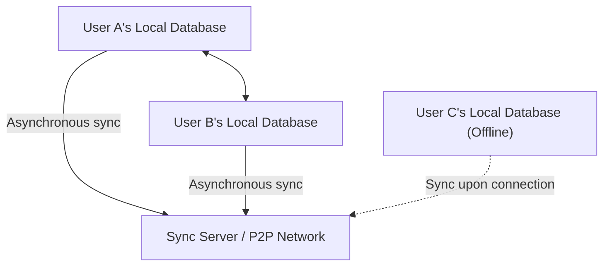
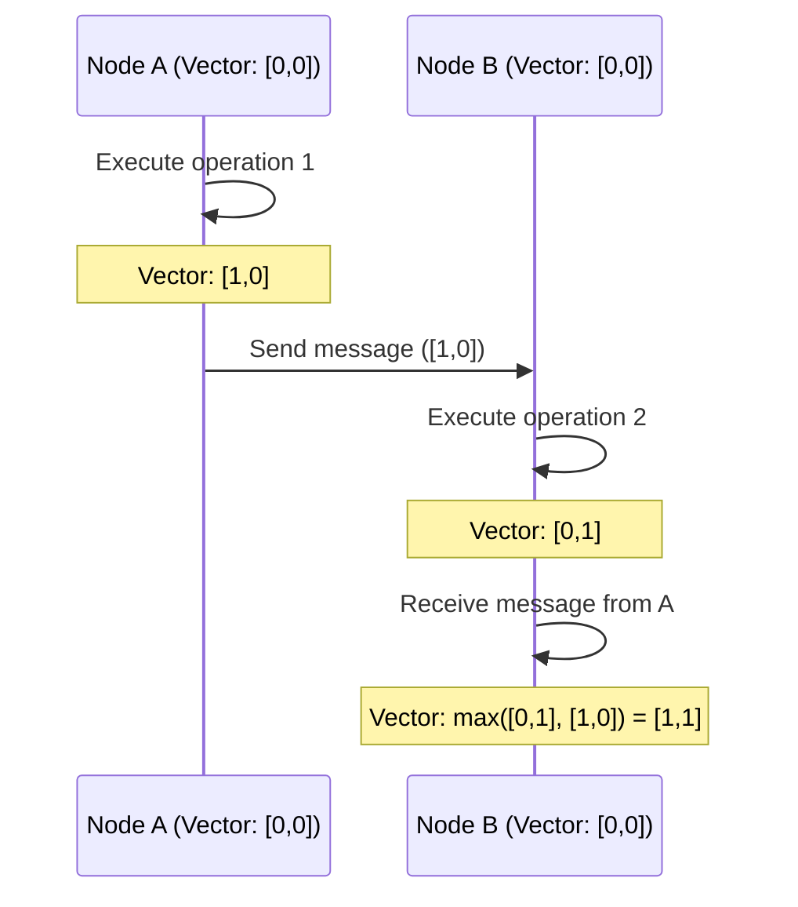

# CRDT and Local-First: How Collaborative Editing Works Even Offline

In modern software development, the "local-first" paradigm has been garnering significant attention. Traditional cloud-first applications assumed an always-on internet connection, resulting in a significantly compromised user experience during offline states or under unstable network conditions. The approach to solve this is local-first software, and the technological foundation supporting this is **CRDT (Conflict-free Replicated Data Type)**.

In this article, we will delve deeply into the theoretical background of CRDT, a comparison with OT (Operational Transformation), mathematical proofs, the role of logical clocks in distributed systems, and concrete implementation examples using JavaScript (Yjs, Automerge).

## 1. The Era of Local-First Software

Local-First Software is an architecture that retains the primary data and application logic on the user's device, performing seamless synchronization in the background when a network connection is available. This approach has the following advantages:

*   **Full offline operation**: You can continue working anytime, anywhere, without depending on a network connection.
*   **Low latency**: Since data read/write operations are completed locally, there is no delay caused by communication with the cloud.
*   **Privacy and security**: Because data is stored locally, users have complete control over their own data.
*   **Seamless collaborative editing**: Changes made offline are automatically merged without conflicting with other users' changes when back online.



What makes this "conflict-free automatic merging" possible is CRDT. With traditional methods, resolving concurrent editing conflicts was extremely difficult, but CRDT solves this problem elegantly based on mathematical foundations.

## 2. Differences from and Limitations of OT (Operational Transformation)

Before the advent of CRDT, the de facto standard for collaborative editing (real-time collaboration) was **OT (Operational Transformation)**. Early collaborative editing systems like Google Docs and Etherpad adopted this OT.

### How OT Works
OT is a method where the "operations" performed by each user are sent to a server, and the server transforms those operations to maintain a consistent state across all clients.
For example, if User A inserts an "X" at index 1 and User B simultaneously inserts a "Y" at index 1, applying them as-is would result in an inconsistent state. The server determines the order of these operations and shifts (transforms) the index of the operation applied later to prevent conflicts.

### Limitations of OT
While OT is a powerful technology, it has a fatal weakness in that its complexity as a distributed system is extremely high.
*   **Necessity of a centralized server**: A central server (Single Point of Truth) is essential for ordering and transforming operations. It is not suitable for purely P2P (peer-to-peer) communication or local-first use cases, such as merging changes from a device that has been offline for several days.
*   **State explosion and algorithm complexity**: As the types of operations (insertion, deletion, formatting, etc.) increase, the combinations between operations (transformation matrices) explode. It is extremely difficult to correctly implement and prove transformation functions for all combinations.

In contrast, CRDT does not require a central server and has the property of eventually converging to the same state regardless of the order in which operations are applied (Strong Eventual Consistency).

## 3. Basic Theory of CRDT: Mathematical Proofs and Partially Ordered Sets

CRDT is not a "data structure where conflicts do not occur." It is a "data structure where, even if conflicts occur, they can be resolved automatically and deterministically without prior agreement." To achieve this, CRDT utilizes mathematical properties.

CRDTs are broadly divided into two types: **CvRDT (Convergent Replicated Data Type: state-based)** and **CmRDT (Commutative Replicated Data Type: operation-based)**.

### CvRDT (State-based CRDT)

CvRDT sends and receives the "state itself" of the data structure over the network, integrating the local state and the received state using a merge function.
For this merge function to work correctly, the set of states of the data structure must form a **Partially Ordered Set / Join Semilattice**, and the merge function must satisfy the following three mathematical properties:

1.  **Commutativity**: `merge(A, B) = merge(B, A)`
    *   The result is the same regardless of the order in which state A and state B are merged.
2.  **Associativity**: `merge(merge(A, B), C) = merge(A, merge(B, C))`
    *   When merging three or more states, the result is the same regardless of which combination is merged first.
3.  **Idempotence**: `merge(A, A) = A`
    *   Merging the same state any number of times does not change the result (resilient to duplicate network transmissions).

**Example: Grow-Only Counter (G-Counter)**
One of the simplest CvRDTs is an increment-only counter. Each node holds a pair (vector) of its own ID and count value.
State A: `[Node1: 2, Node2: 1]`
State B: `[Node1: 2, Node2: 3, Node3: 1]`
The merge function adopts the maximum value for each node ID (the `max()` function satisfies commutativity, associativity, and idempotence).
Result: `[Node1: 2, Node2: 3, Node3: 1]`

### CmRDT (Operation-based CRDT)

CmRDT broadcasts "operations" instead of state to the network. Synchronization is performed by applying the received operations to the local state.
For CmRDT to hold, the network layer must satisfy the following conditions, or they must be guaranteed on the data structure side:

1.  **Commutativity of operations**: For any two concurrent operations `op1` and `op2`, the application result must be the same regardless of the order.
2.  **Exactly-Once guarantee**: All operations must be delivered exactly once. However, by making the operations idempotent, it can operate even with At-Least-Once delivery (with duplicates).
3.  **Causal Ordering guarantee**: If operation A is the cause of operation B, A must be applied before B on all replicas.

CmRDT has the advantage of low communication volume (since it only sends operational diffs), but it relies on a messaging infrastructure (like Vector Clocks, described later) to guarantee causal ordering.

## 4. The Clocks of Distributed Systems: The Importance of Logical Clocks

In CRDTs, especially for ordering text in collaborative editing and guaranteeing causal order in CmRDT, it is extremely important to accurately grasp "when and which operation was performed."
However, in a distributed system, it is impossible to perfectly synchronize the physical clocks (Wall-clock time) of each device (even using NTP, deviations of several milliseconds to several seconds can occur).

To solve this problem, a **Logical Clock** is used, which records the "sequential relationship (causality) of events" rather than physical time.

### Lamport Clock
The most basic logical clock devised by Leslie Lamport.
Each node holds a single integer value (counter) and updates it according to the following rules:
1.  Every time a local event occurs, increment the counter by 1.
2.  When sending a message, include the current counter value in the message.
3.  When receiving a message, update its own counter to `max(own counter, received counter) + 1`.

This guarantees the causal relationship that "if event A is the cause of event B, then A's clock value < B's clock value." However, causality cannot be reverse-calculated from the clock values (the magnitude of clock values between concurrent events is meaningless).

### Vector Clock
Vector Clock compensates for the weaknesses of the Lamport Clock, making it possible to determine complete causality (or concurrency) between events.
Instead of a single counter, it holds an array (vector) of counters for all nodes in the system.

While it has the disadvantage of data size blooming as the number of nodes increases, it is widely used in version control systems (such as DynamoDB's conflict detection). In recent CRDT algorithms, variants of Vector Clocks or embedding causal relationships into the data structure itself (such as pointers between CRDT nodes) are used to efficiently determine the order.



## 5. Practice in JavaScript: Yjs and Automerge

Beyond theory, developing with CRDTs has become very easy in recent years. In the JavaScript ecosystem, the two de facto standard CRDT libraries are **Yjs** and **Automerge**.

### Yjs: Fast Text and Rich-Text Synchronization

Yjs has exceptionally high performance, and official bindings are provided for numerous editors such as ProseMirror, Quill, and Monaco Editor. If you are building text collaborative editing (like a Google Docs clone), Yjs is the first choice.

Internally in Yjs, data is represented as a flat doubly-linked list, with each element having a unique ID (a pair of client ID and logical clock). This allows for extremely fast insertion and deletion of elements.

**Simple implementation example using Yjs (Node.js/Browser)**

```javascript
import * as Y from 'yjs'

// Initialize documents
const doc1 = new Y.Doc()
const doc2 = new Y.Doc()

// Create shared text types
const text1 = doc1.getText('myText')
const text2 = doc2.getText('myText')

// User 1 inserts text
text1.insert(0, 'Hello ')
console.log('User 1 text:', text1.toString()) // "Hello "

// State synchronization (usually done via WebRTC or WebSocket)
// Get the change diff (Update) of doc1
const updateFromDoc1 = Y.encodeStateAsUpdate(doc1)

// Apply (merge) the changes to User 2's document
Y.applyUpdate(doc2, updateFromDoc1)
console.log('User 2 text:', text2.toString()) // "Hello "

// Conflict occurrence and automatic resolution through simultaneous editing
// User 1 and User 2 simultaneously edit while offline
text1.insert(6, 'World')
text2.insert(6, 'CRDT')

// Execute synchronization
const update1 = Y.encodeStateAsUpdate(doc1)
const update2 = Y.encodeStateAsUpdate(doc2)
Y.applyUpdate(doc2, update1)
Y.applyUpdate(doc1, update2)

// Both nodes converge to exactly the same final state (Strong Eventual Consistency)
console.log('Merged User 1 text:', text1.toString()) // "Hello WorldCRDT" or "Hello CRDTWorld"
console.log('Merged User 2 text:', text2.toString()) // "Hello WorldCRDT" or "Hello CRDTWorld" (Matches User 1 completely)
```

The powerful aspect of Yjs is that even if this diff (Update) is persisted (e.g., saved to IndexedDB) or sent to another client via a P2P network in any order and at any time, it is mathematically guaranteed that the final state will always match.

### Automerge: JSON-based General Purpose State Sync

Automerge is a CRDT library specialized in synchronizing JSON-like object structures (nested objects, arrays, and text). It pairs well with frontend frameworks like React and is suitable for making the entire application state local-first.

Automerge provides immutable state management and retains the entire history of state like Redux, so it is also possible to implement advanced features like Git-style "time-traveling change history" and "branching and merging."

**Example of synchronizing JSON objects using Automerge**

```javascript
import * as Automerge from '@automerge/automerge'

// Initialize document
let doc1 = Automerge.init()

// Make changes to the document (an immutable new document is returned)
doc1 = Automerge.change(doc1, 'Initialize todo list', doc => {
  doc.todos = []
  doc.todos.push({ title: 'Buy milk', done: false })
})

// Clone document (assuming it was copied to another device)
let doc2 = Automerge.clone(doc1)

// Simultaneous editing in offline state
doc1 = Automerge.change(doc1, 'Mark as done', doc => {
  doc.todos[0].done = true
})

doc2 = Automerge.change(doc2, 'Add another task', doc => {
  doc.todos.push({ title: 'Read a book', done: false })
})

// Merge upon returning online
let finalDoc = Automerge.merge(doc1, doc2)

console.log(JSON.stringify(finalDoc.todos, null, 2))
/* Output result (both changes are integrated without conflict):
[
  {
    "title": "Buy milk",
    "done": true
  },
  {
    "title": "Read a book",
    "done": false
  }
]
*/
```

## 6. Conclusion and Future Prospects

CRDT is a magical technology for realizing local-first software. It frees us from complex conflict resolution by centralized servers (OT) and provides an architecture that is highly compatible with P2P and edge computing.

On the other hand, CRDTs also have challenges:
*   **Memory and storage bloating**: Because it is necessary to keep the change history and deleted elements (Tombstones), the size of the document inflates over time (research into garbage collection techniques is ongoing).
*   **Unintended merge results**: Even if it mathematically converges correctly, there are cases where strings unintelligible to humans are generated, such as string interleaving.

However, with the maturation of libraries like Yjs and Automerge, practical workarounds for these challenges are also being developed. Modern applications that pursue the user experience to the utmost, such as Figma, Linear, and Notion, have already incorporated the concepts of local-first architectures and CRDTs.

In the future, as "local-first" becomes established as a standard architecture for web applications, CRDT will likely become an essential paradigm that all developers should learn.
