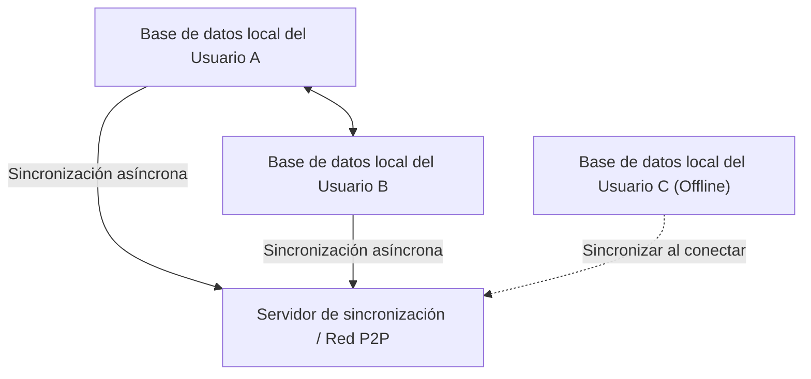
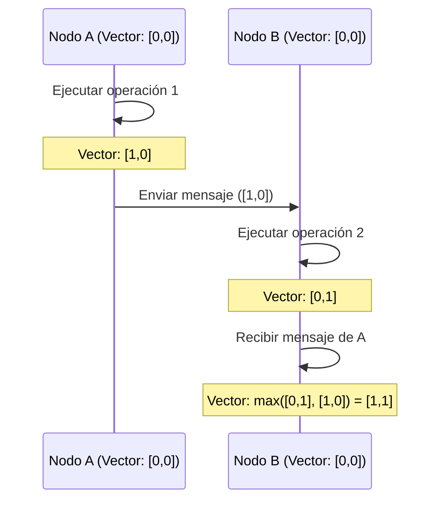

# CRDT y Local-First: Cómo funciona la edición colaborativa incluso sin conexión

En el desarrollo de software moderno, el paradigma "Local-First" está atrayendo gran atención. Las aplicaciones tradicionales centradas en la nube (Cloud-First) asumen una conexión a internet constante, y tenían el problema de que la experiencia del usuario se degradaba significativamente cuando el estado era offline o la red era inestable. El enfoque para resolver esto es el software Local-First, y la base tecnológica que lo soporta es **CRDT (Conflict-free Replicated Data Type: Tipo de dato replicado libre de conflictos)**.

En este artículo, profundizaremos desde los antecedentes teóricos de CRDT, su comparación con OT (Operational Transformation), demostraciones matemáticas, el rol de los relojes lógicos en sistemas distribuidos, hasta ejemplos prácticos de implementación usando JavaScript (Yjs, Automerge).

## 1. La era del software Local-First

El software Local-First es una arquitectura que mantiene los datos principales y la lógica de la aplicación en el dispositivo del usuario, y realiza la sincronización en segundo plano de forma transparente cuando hay conexión a la red disponible. Este enfoque tiene las siguientes ventajas:

*   **Funcionamiento completo sin conexión**: No depende de la conexión a la red, permitiendo continuar el trabajo en cualquier momento y lugar.
*   **Baja latencia**: Como la lectura y escritura de datos se completan localmente, no hay retrasos debido a la comunicación con la nube.
*   **Privacidad y seguridad**: Dado que los datos se almacenan localmente, el usuario tiene control total sobre ellos.
*   **Edición colaborativa transparente**: Los cambios realizados sin conexión se fusionan automáticamente y sin conflictos con los cambios de otros usuarios al conectarse.



Lo que hace posible esta "fusión automática sin conflictos" es CRDT. En los métodos tradicionales, resolver conflictos de edición simultánea era extremadamente difícil, pero CRDT resuelve este problema de manera elegante basándose en fundamentos matemáticos.

## 2. Diferencias y limitaciones respecto a OT (Operational Transformation)

Antes de la aparición de CRDT, el estándar de facto para la edición colaborativa (colaboración en tiempo real) era **OT (Operational Transformation: Transformación Operacional)**. Los primeros sistemas de edición colaborativa como Google Docs o Etherpad adoptaron este OT.

### Cómo funciona OT
OT es una técnica en la que cada "operación" (Operation) realizada por un usuario se envía al servidor, y el servidor transforma (Transform) esas operaciones para mantener un estado consistente en todos los clientes.
Por ejemplo, si el Usuario A inserta "X" en el índice 1, y simultáneamente el Usuario B inserta "Y" en el índice 1, si se aplican tal cual el estado será inconsistente. El servidor determina el orden de estas operaciones, desplazando (transformando) el índice de la operación que se aplica más tarde para evitar inconsistencias.

### Limitaciones de OT
OT es una tecnología poderosa, pero tiene la debilidad fatal de que su complejidad como sistema distribuido es extremadamente alta.
*   **Necesidad de un servidor centralizado**: Un servidor central (Single Point of Truth) es indispensable para ordenar y transformar las operaciones. No es adecuado para casos de uso Local-First como comunicación P2P pura, o fusionar cambios de dispositivos que han estado desconectados por varios días.
*   **Explosión de estados y complejidad del algoritmo**: A medida que aumentan los tipos de operaciones (inserción, eliminación, cambio de formato, etc.), las combinaciones de operaciones entre sí (matriz de transformación) crecen explosivamente. Implementar y demostrar correctamente las funciones de transformación para todas las combinaciones es extremadamente difícil.

En contraste, CRDT no requiere un servidor central, y tiene la propiedad de que incluso si las operaciones se aplican en cualquier orden, el estado final convergerá en el mismo (Strong Eventual Consistency).

## 3. Teoría básica de CRDT: Demostración matemática y conjuntos parcialmente ordenados

CRDT no es una "estructura de datos donde no ocurren conflictos". Es una "estructura de datos donde, incluso si ocurren conflictos, pueden resolverse de manera automática y determinista sin acuerdo previo". Para lograr esto, CRDT utiliza propiedades matemáticas.

Existen principalmente dos tipos de CRDT: **CvRDT (Convergent Replicated Data Type: Basado en estado)** y **CmRDT (Commutative Replicated Data Type: Basado en operaciones)**.

### CvRDT (CRDT basado en estado)

CvRDT envía y recibe el "estado en sí" de la estructura de datos a través de la red, e integra el estado local con el estado recibido usando una función de fusión (Merge Function).
Para que esta función de fusión funcione correctamente, el conjunto de estados de la estructura de datos debe formar un **conjunto parcialmente ordenado (Partially Ordered Set / Join Semilattice)**, y la función de fusión debe cumplir las siguientes tres propiedades matemáticas:

1.  **Conmutatividad (Commutativity)**: `merge(A, B) = merge(B, A)`
    *   No importa en qué orden se fusionen el estado A y el estado B, el resultado es el mismo.
2.  **Asociatividad (Associativity)**: `merge(merge(A, B), C) = merge(A, merge(B, C))`
    *   Al fusionar tres o más estados, el resultado es el mismo independientemente de qué combinación se fusione primero.
3.  **Idempotencia (Idempotence)**: `merge(A, A) = A`
    *   El resultado no cambia sin importar cuántas veces se fusione el mismo estado (resiste envíos duplicados de la red).

**Ejemplo: Contador solo de incremento (Grow-Only Counter / G-Counter)**
Uno de los CvRDT más simples es un contador que solo aumenta. Cada nodo mantiene un par (vector) de su propio ID y valor de cuenta.
Estado A: `[Node1: 2, Node2: 1]`
Estado B: `[Node1: 2, Node2: 3, Node3: 1]`
La función de fusión adopta el valor máximo para cada ID de nodo (la función `max()` cumple con la conmutatividad, asociatividad e idempotencia).
Resultado: `[Node1: 2, Node2: 3, Node3: 1]`

### CmRDT (CRDT basado en operaciones)

CmRDT transmite (broadcast) "operaciones" (Operations) a la red en lugar del estado. La sincronización se realiza aplicando las operaciones recibidas al estado local.
Para que CmRDT funcione, la capa de red debe cumplir las siguientes condiciones, o la estructura de datos debe garantizarlo:

1.  **Conmutatividad de operaciones (Commutativity)**: Para cualquier par de operaciones concurrentes `op1`, `op2`, el resultado de aplicarlas es el mismo independientemente del orden.
2.  **Garantía de exactamente una vez (Exactly-Once)**: Todas las operaciones se entregan exactamente una vez. Sin embargo, si las operaciones son idempotentes, también puede funcionar con entrega de al menos una vez (At-Least-Once, permitiendo duplicados).
3.  **Garantía de orden causal (Causal Ordering)**: Si la operación A es la causa de la operación B, en todas las réplicas A debe aplicarse antes que B.

CmRDT tiene la ventaja de un bajo volumen de tráfico (porque solo envía las diferencias de operaciones), pero depende de una infraestructura de mensajería (como Vector Clock, descrito más adelante) para garantizar el orden causal.

## 4. Relojes en sistemas distribuidos: La importancia de los relojes lógicos

En CRDT, especialmente para ordenar texto en la edición colaborativa o garantizar el orden causal en CmRDT, es extremadamente importante entender con precisión "cuándo y qué operación se realizó".
Sin embargo, en sistemas distribuidos es imposible sincronizar perfectamente los relojes físicos (Wall-clock time) de cada dispositivo (incluso usando NTP puede haber un desfase de milisegundos a segundos).

Para resolver este problema, en lugar del tiempo físico se utiliza un **reloj lógico (Logical Clock)** que registra la "relación temporal (causalidad) entre eventos".

### Reloj de Lamport (Lamport Clock)
Es el reloj lógico más básico ideado por Leslie Lamport.
Cada nodo mantiene un único número entero (contador) y lo actualiza con las siguientes reglas:
1.  Cada vez que ocurre un evento localmente, se incrementa el contador en 1.
2.  Al enviar un mensaje, se incluye el valor actual del contador en el mensaje.
3.  Al recibir un mensaje, actualiza su propio contador a `max(contador propio, contador recibido) + 1`.

Con esto, se puede garantizar la relación causal de que "si el evento A es la causa del evento B, el valor del reloj de A < el valor del reloj de B". Sin embargo, no se puede deducir la causalidad a partir de los valores del reloj (el tamaño de los valores del reloj entre eventos que ocurrieron de forma concurrente no tiene significado).

### Reloj Vectorial (Vector Clock)
El Reloj Vectorial compensa las debilidades del Reloj de Lamport y permite determinar relaciones causales completas (o relaciones concurrentes) entre eventos.
En lugar de un solo contador, mantiene un arreglo (vector) de contadores para todos los nodos en el sistema.

Tiene la desventaja de que el tamaño de los datos crece a medida que aumenta el número de nodos, pero se utiliza ampliamente en sistemas de control de versiones (como la detección de conflictos de DynamoDB). En algoritmos CRDT recientes, se decide el orden de forma eficiente usando variantes de Vector Clock, o integrando la causalidad en la propia estructura de datos (como punteros entre nodos de CRDT).



## 5. Práctica con JavaScript: Yjs y Automerge

Más allá de la teoría, el desarrollo real utilizando CRDT se ha vuelto muy fácil en los últimos años. En el ecosistema de JavaScript, las dos bibliotecas que son el estándar de facto para CRDT son **Yjs** y **Automerge**.

### Yjs: Sincronización rápida de texto y texto enriquecido

Yjs tiene un rendimiento excepcional y proporciona integraciones (bindings) oficiales con varios editores como ProseMirror, Quill y Monaco Editor. Si se construye edición colaborativa de texto (como un clon de Google Docs), Yjs es la primera opción.

Internamente en Yjs, los datos se representan como una lista doblemente enlazada plana, y cada elemento tiene un ID único (un par del ID de cliente y reloj lógico). Esto hace que la inserción y eliminación de elementos sea extremadamente rápida.

**Ejemplo de implementación sencilla usando Yjs (Node.js/Navegador)**

```javascript
import * as Y from 'yjs'

// Inicializar documento
const doc1 = new Y.Doc()
const doc2 = new Y.Doc()

// Crear el tipo de texto compartido
const text1 = doc1.getText('myText')
const text2 = doc2.getText('myText')

// Usuario 1 inserta texto
text1.insert(0, 'Hello ')
console.log('User 1 text:', text1.toString()) // "Hello "

// Sincronización del estado (normalmente se realiza a través de WebRTC o WebSocket)
// Obtener la diferencia (Update) de doc1
const updateFromDoc1 = Y.encodeStateAsUpdate(doc1)

// Aplicar (fusionar) los cambios al documento del Usuario 2
Y.applyUpdate(doc2, updateFromDoc1)
console.log('User 2 text:', text2.toString()) // "Hello "

// Ocurrencia de conflicto por edición simultánea y resolución automática
// El Usuario 1 y el Usuario 2 editan simultáneamente estando desconectados
text1.insert(6, 'World')
text2.insert(6, 'CRDT')

// Ejecutar sincronización
const update1 = Y.encodeStateAsUpdate(doc1)
const update2 = Y.encodeStateAsUpdate(doc2)
Y.applyUpdate(doc2, update1)
Y.applyUpdate(doc1, update2)

// Ambos nodos convergen exactamente al mismo estado final (Strong Eventual Consistency)
console.log('Merged User 1 text:', text1.toString()) // "Hello WorldCRDT" o "Hello CRDTWorld"
console.log('Merged User 2 text:', text2.toString()) // "Hello WorldCRDT" o "Hello CRDTWorld" (Coincide completamente con User 1)
```

La fortaleza de Yjs radica en que está matemáticamente garantizado que el estado final siempre coincidirá, incluso si estas diferencias (Update) se persisten (guardan en IndexedDB, etc.) o se envían a otros clientes en cualquier orden y en cualquier momento a través de una red P2P.

### Automerge: Sincronización de estado universal basada en JSON

Automerge es una biblioteca CRDT especializada en la sincronización de estructuras de objetos similares a JSON (objetos anidados, arreglos, texto). Tiene buena compatibilidad con frameworks de frontend como React, y es adecuado para convertir todo el estado de la aplicación a Local-First.

Automerge proporciona una gestión de estado inmutable y, al igual que Redux, mantiene todo el historial de estado, por lo que también permite implementar funciones avanzadas como el "viaje en el tiempo a través del historial de cambios" o "ramificación y fusión de ramas (branches)" similares a Git.

**Ejemplo de sincronización de un objeto JSON usando Automerge**

```javascript
import * as Automerge from '@automerge/automerge'

// Inicializar documento
let doc1 = Automerge.init()

// Modificar documento (devuelve un nuevo documento inmutable)
doc1 = Automerge.change(doc1, 'Initialize todo list', doc => {
  doc.todos = []
  doc.todos.push({ title: 'Buy milk', done: false })
})

// Clonar documento (asumiendo que se copió a otro dispositivo)
let doc2 = Automerge.clone(doc1)

// Edición simultánea en estado offline
doc1 = Automerge.change(doc1, 'Mark as done', doc => {
  doc.todos[0].done = true
})

doc2 = Automerge.change(doc2, 'Add another task', doc => {
  doc.todos.push({ title: 'Read a book', done: false })
})

// Fusionar al volver a estar online
let finalDoc = Automerge.merge(doc1, doc2)

console.log(JSON.stringify(finalDoc.todos, null, 2))
/* Resultado de salida (ambos cambios se integran sin conflictos):
[
  {
    "title": "Buy milk",
    "done": true
  },
  {
    "title": "Read a book",
    "done": false
  }
]
*/
```

## 6. Conclusión y perspectivas futuras

CRDT es una tecnología casi mágica para hacer realidad el software Local-First. Nos libera de la compleja resolución de conflictos en servidores centralizados (OT) y proporciona una arquitectura con gran afinidad hacia P2P y edge computing.

Por otro lado, CRDT también presenta desafíos:
*   **Aumento de memoria y almacenamiento**: Como debe mantener el historial de cambios y los elementos eliminados (Tombstone), el tamaño del documento crece con el tiempo (se está investigando en tecnologías de recolección de basura).
*   **Resultados de fusión no deseados**: Como intercalación de cadenas, hay casos en los que, aunque converge correctamente a nivel matemático, se generan cadenas sin sentido para los humanos.

Sin embargo, con la madurez de bibliotecas como Yjs y Automerge, se están estableciendo soluciones prácticas a estos desafíos. Aplicaciones modernas que buscan la mejor experiencia de usuario, como Figma, Linear y Notion, ya están adoptando arquitecturas Local-First y conceptos de CRDT.

En el futuro, a medida que "Local-First" se consolide como la arquitectura estándar para aplicaciones web, CRDT se convertirá en un paradigma esencial que todo desarrollador deberá aprender.
