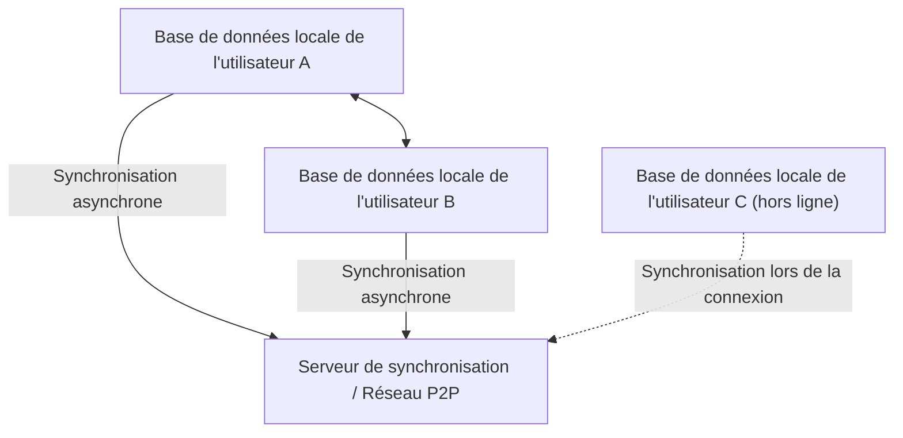
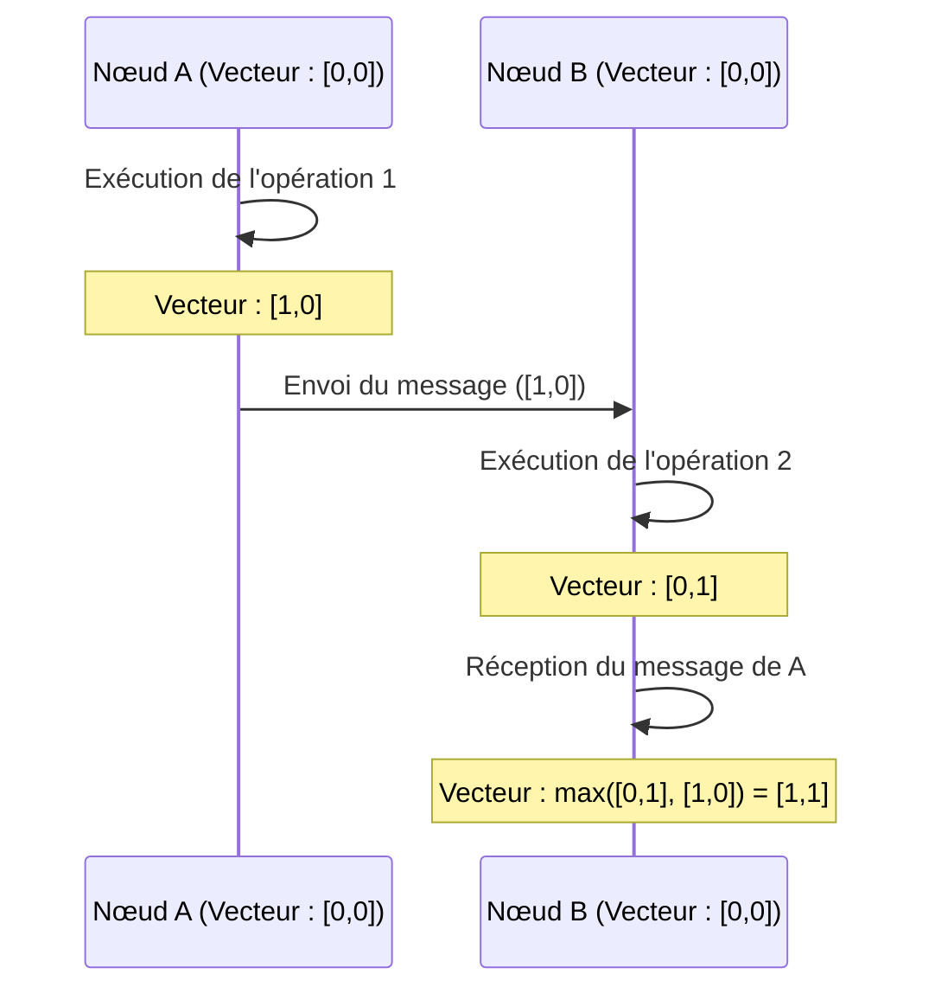

# CRDT et Local-First : comment collaborer même hors ligne

Dans le développement de logiciels modernes, le paradigme du "local-first" attire beaucoup d'attention. Les applications traditionnelles orientées cloud ("cloud-first") supposent une connexion Internet constante, ce qui entraîne une dégradation significative de l'expérience utilisateur hors ligne ou dans des environnements où le réseau est instable. L'approche pour résoudre ce problème est le logiciel "local-first", dont le fondement technologique repose sur les **CRDT (Conflict-free Replicated Data Type : type de données répliqué sans conflit)**.

Dans cet article, nous explorerons en profondeur les CRDT, depuis leur contexte théorique, leur comparaison avec les OT (Operational Transformation), leurs preuves mathématiques, le rôle des horloges logiques dans les systèmes distribués, jusqu'à des exemples d'implémentation concrets en JavaScript (Yjs, Automerge).

## 1. L'ère des logiciels Local-First

Le logiciel Local-First (Local-First Software) est une architecture qui conserve les données principales et la logique de l'application sur l'appareil de l'utilisateur, et effectue une synchronisation transparente en arrière-plan lorsqu'une connexion réseau est disponible. Cette approche présente les avantages suivants :

*   **Fonctionnement complet hors ligne** : Vous pouvez continuer à travailler n'importe quand, n'importe où, sans dépendre d'une connexion réseau.
*   **Faible latence** : Étant donné que la lecture et l'écriture des données s'effectuent localement, il n'y a pas de retard dû aux communications vers le cloud.
*   **Confidentialité et sécurité** : Les données étant stockées localement, les utilisateurs ont un contrôle total sur leurs propres données.
*   **Co-édition transparente** : Les modifications effectuées hors ligne sont automatiquement fusionnées sans conflit avec les modifications d'autres utilisateurs une fois en ligne.



Ce "fusionnement automatique sans conflit" est rendu possible par les CRDT. Avec les méthodes traditionnelles, la résolution des conflits lors de l'édition simultanée était extrêmement difficile, mais les CRDT résolvent ce problème de manière élégante grâce à des fondations mathématiques.

## 2. Différences et limites par rapport aux OT (Operational Transformation)

Avant l'apparition des CRDT, le standard de fait pour la co-édition (collaboration en temps réel) était les **OT (Operational Transformation : transformation opérationnelle)**. Les premiers systèmes de co-édition comme Google Docs et Etherpad utilisent cette méthode OT.

### Fonctionnement des OT
Les OT fonctionnent en envoyant les "opérations" (Operations) effectuées par chaque utilisateur à un serveur, qui transforme (Transform) ensuite ces opérations pour maintenir un état cohérent sur tous les clients.
Par exemple, si l'utilisateur A insère "X" à l'index 1 et que l'utilisateur B insère "Y" à l'index 1 en même temps, les appliquer tels quels entraînerait une incohérence de l'état. Le serveur détermine l'ordre de ces opérations et décale (transforme) l'index des opérations appliquées ultérieurement pour éviter les incohérences.

### Limites des OT
Bien que les OT soient une technologie puissante, elles présentent un point faible fatal : la complexité en tant que système distribué est extrêmement élevée.
*   **Nécessité absolue d'un serveur centralisé** : Un serveur central (Single Point of Truth) est indispensable pour ordonner et transformer les opérations. Ce n'est pas adapté aux communications P2P (pair à pair) pures, ni aux cas d'utilisation "local-first" tels que la fusion a posteriori des modifications d'appareils restés hors ligne pendant plusieurs jours.
*   **Explosion des états et complexité des algorithmes** : À mesure que les types d'opérations (insertion, suppression, changement de format, etc.) augmentent, les combinaisons entre les opérations (matrice de transformation) explosent. Il est extrêmement difficile d'implémenter et de prouver correctement la fonction de transformation pour toutes les combinaisons.

En revanche, les CRDT ne nécessitent pas de serveur central et ont la propriété de converger vers le même état final (Strong Eventual Consistency) même si les opérations sont appliquées dans un ordre arbitraire.

## 3. Théorie fondamentale des CRDT : preuves mathématiques et ensembles partiellement ordonnés

Les CRDT ne sont pas "des structures de données où les conflits ne se produisent pas". Ce sont "des structures de données capables de résoudre automatiquement et de manière déterministe les conflits lorsqu'ils surviennent, sans accord préalable". Pour y parvenir, les CRDT exploitent des propriétés mathématiques.

Il existe deux grandes catégories de CRDT : **CvRDT (Convergent Replicated Data Type : basé sur l'état)** et **CmRDT (Commutative Replicated Data Type : basé sur les opérations)**.

### CvRDT (CRDT basés sur l'état)

Les CvRDT transmettent "l'état lui-même" de la structure de données sur le réseau et intègrent l'état local avec l'état reçu à l'aide d'une fonction de fusion (Merge Function).
Pour que cette fonction de fusion fonctionne correctement, l'ensemble des états de la structure de données doit former un **ensemble partiellement ordonné (Partially Ordered Set / Join Semilattice)**, et la fonction de fusion doit satisfaire aux trois propriétés mathématiques suivantes :

1.  **Commutativité (Commutativity)** : `merge(A, B) = merge(B, A)`
    *   L'ordre dans lequel l'état A et l'état B sont fusionnés ne change pas le résultat.
2.  **Associativité (Associativity)** : `merge(merge(A, B), C) = merge(A, merge(B, C))`
    *   Lors de la fusion de trois états ou plus, l'ordre de combinaison n'a pas d'importance.
3.  **Idempotence (Idempotence)** : `merge(A, A) = A`
    *   Fusionner le même état plusieurs fois ne change pas le résultat (résiste aux envois dupliqués sur le réseau).

**Exemple : Grow-Only Counter (G-Counter)**
L'un des CvRDT les plus simples est un compteur qui ne fait qu'augmenter. Chaque nœud conserve une paire (vecteur) de son propre ID et de la valeur de comptage.
État A : `[Node1: 2, Node2: 1]`
État B : `[Node1: 2, Node2: 3, Node3: 1]`
La fonction de fusion adopte la valeur maximale pour chaque ID de nœud (la fonction `max()` satisfait la commutativité, l'associativité et l'idempotence).
Résultat : `[Node1: 2, Node2: 3, Node3: 1]`

### CmRDT (CRDT basés sur les opérations)

Les CmRDT diffusent des "opérations" (Operations) sur le réseau plutôt que des états. La synchronisation se fait en appliquant les opérations reçues à l'état local.
Pour que les CmRDT soient viables, la couche réseau doit remplir les conditions suivantes ou la structure de données doit les garantir :

1.  **Commutativité des opérations (Commutativity)** : Pour toute paire d'opérations concurrentes `op1` et `op2`, le résultat de leur application doit être le même quel que soit l'ordre.
2.  **Garantie Exactly-Once** : Toutes les opérations doivent être délivrées exactement une fois. Cependant, en rendant les opérations idempotentes, il est possible de les faire fonctionner même avec une livraison At-Least-Once (avec doublons).
3.  **Garantie de l'ordre causal (Causal Ordering)** : Si l'opération A est la cause de l'opération B, A doit être appliquée avant B sur toutes les répliques.

Les CmRDT ont l'avantage de générer un faible volume de communication (car seuls les deltas d'opérations sont envoyés), mais dépendent d'une infrastructure de messagerie (comme les Vector Clocks décrits ci-dessous) pour garantir l'ordre causal.

## 4. Les horloges des systèmes distribués : l'importance des horloges logiques

Pour les CRDT, en particulier pour l'ordonnancement du texte dans la co-édition et la garantie de l'ordre causal dans les CmRDT, il est extrêmement important de savoir précisément "quand et quelle opération a été effectuée".
Cependant, dans un système distribué, il est impossible de synchroniser parfaitement les horloges physiques (Wall-clock time) de chaque appareil (même avec NTP, un décalage de quelques millisecondes à quelques secondes peut survenir).

Pour résoudre ce problème, on utilise non pas le temps physique, mais une **horloge logique (Logical Clock)** qui enregistre la "relation de succession (relation causale)" des événements.

### Horloge de Lamport (Lamport Clock)
Il s'agit de l'horloge logique la plus basique inventée par Leslie Lamport.
Chaque nœud conserve une valeur entière unique (un compteur) et la met à jour selon les règles suivantes :
1.  Chaque fois qu'un événement se produit localement, augmenter le compteur de 1.
2.  Lors de l'envoi d'un message, inclure la valeur actuelle du compteur dans le message.
3.  Lors de la réception d'un message, mettre à jour son propre compteur à `max(propre compteur, compteur reçu) + 1`.

Cela permet de garantir la relation causale : "Si l'événement A est la cause de l'événement B, alors la valeur de l'horloge de A < valeur de l'horloge de B". Cependant, on ne peut pas déduire la causalité à partir des valeurs d'horloge (la comparaison des valeurs d'horloge d'événements survenus simultanément n'a pas de sens).

### Horloge vectorielle (Vector Clock)
L'horloge vectorielle compense les faiblesses de l'horloge de Lamport et permet de déterminer une relation causale complète (ou une relation de concurrence) entre les événements.
Au lieu d'un seul compteur, elle conserve un tableau (vecteur) des compteurs de tous les nœuds du système.

Bien que la taille des données gonfle lorsque le nombre de nœuds augmente, cette méthode est largement utilisée dans les systèmes de contrôle de version (comme la détection de conflits de DynamoDB). Dans les algorithmes CRDT récents, l'ordre est déterminé efficacement en utilisant des variantes des horloges vectorielles ou en intégrant les relations causales directement dans la structure de données (comme des pointeurs entre les nœuds CRDT).



## 5. Pratique en JavaScript : Yjs et Automerge

Au-delà de la théorie, le développement utilisant des CRDT est devenu très facile ces dernières années. Dans l'écosystème JavaScript, les standards de fait pour les CRDT sont les deux bibliothèques **Yjs** et **Automerge**.

### Yjs : Synchronisation rapide de texte et de texte enrichi

Yjs offre des performances extrêmement élevées et des liaisons (bindings) officielles sont disponibles pour de nombreux éditeurs tels que ProseMirror, Quill et Monaco Editor. Si vous construisez un outil de co-édition de texte (comme un clone de Google Docs), Yjs sera votre premier choix.

En interne, Yjs représente les données comme une liste doublement chaînée plate, où chaque élément possède un ID unique (une paire de l'ID du client et de l'horloge logique). Cela permet des insertions et des suppressions d'éléments extrêmement rapides.

**Exemple d'implémentation simple avec Yjs (Node.js/Navigateur)**

```javascript
import * as Y from 'yjs'

// Initialisation du document
const doc1 = new Y.Doc()
const doc2 = new Y.Doc()

// Création d'un type de texte partagé
const text1 = doc1.getText('myText')
const text2 = doc2.getText('myText')

// L'utilisateur 1 insère du texte
text1.insert(0, 'Hello ')
console.log('User 1 text:', text1.toString()) // "Hello "

// Synchronisation de l'état (généralement effectuée via WebRTC ou WebSocket)
// Obtenir le delta des modifications (Update) de doc1
const updateFromDoc1 = Y.encodeStateAsUpdate(doc1)

// Appliquer (fusionner) les modifications au document de l'utilisateur 2
Y.applyUpdate(doc2, updateFromDoc1)
console.log('User 2 text:', text2.toString()) // "Hello "

// Occurrence et résolution automatique d'un conflit dû à une édition simultanée
// L'utilisateur 1 et l'utilisateur 2 éditent en même temps hors ligne
text1.insert(6, 'World')
text2.insert(6, 'CRDT')

// Exécuter la synchronisation
const update1 = Y.encodeStateAsUpdate(doc1)
const update2 = Y.encodeStateAsUpdate(doc2)
Y.applyUpdate(doc2, update1)
Y.applyUpdate(doc1, update2)

// Les deux nœuds convergent vers exactement le même état final (Strong Eventual Consistency)
console.log('Merged User 1 text:', text1.toString()) // "Hello WorldCRDT" ou "Hello CRDTWorld"
console.log('Merged User 2 text:', text2.toString()) // "Hello WorldCRDT" ou "Hello CRDTWorld" (correspond exactement à User 1)
```

Le point fort de Yjs est que même si ces deltas (Updates) sont persistés (par exemple dans IndexedDB) ou envoyés à un autre client via un réseau P2P dans n'importe quel ordre et à n'importe quel moment, il est mathématiquement garanti que l'état final correspondra toujours.

### Automerge : Synchronisation d'état polyvalente basée sur JSON

Automerge est une bibliothèque CRDT spécialisée dans la synchronisation de structures d'objets de type JSON (objets imbriqués, tableaux, textes). Elle fonctionne très bien avec des frameworks frontend comme React, et convient pour rendre l'état complet (State) de l'application "local-first".

Automerge fournit une gestion d'état immuable et conserve tout l'historique des états à la manière de Redux, ce qui permet d'implémenter des fonctionnalités avancées comme le "voyage dans le temps de l'historique des modifications" ou la "ramification et fusion de branches" similaires à Git.

**Exemple de synchronisation d'objets JSON avec Automerge**

```javascript
import * as Automerge from '@automerge/automerge'

// Initialisation du document
let doc1 = Automerge.init()

// Modification du document (un nouveau document est retourné de manière immuable)
doc1 = Automerge.change(doc1, 'Initialize todo list', doc => {
  doc.todos = []
  doc.todos.push({ title: 'Buy milk', done: false })
})

// Clonage du document (en supposant qu'il soit copié sur un autre appareil)
let doc2 = Automerge.clone(doc1)

// Édition simultanée hors ligne
doc1 = Automerge.change(doc1, 'Mark as done', doc => {
  doc.todos[0].done = true
})

doc2 = Automerge.change(doc2, 'Add another task', doc => {
  doc.todos.push({ title: 'Read a book', done: false })
})

// Fusion lors de la reconnexion en ligne
let finalDoc = Automerge.merge(doc1, doc2)

console.log(JSON.stringify(finalDoc.todos, null, 2))
/* Résultat affiché (les deux modifications sont intégrées sans conflit) :
[
  {
    "title": "Buy milk",
    "done": true
  },
  {
    "title": "Read a book",
    "done": false
  }
]
*/
```

## 6. Résumé et perspectives

Les CRDT sont une technologie magique pour la réalisation de logiciels "local-first". Ils nous libèrent de la résolution complexe des conflits basée sur un serveur centralisé (OT) et offrent une architecture qui s'accorde très bien avec le P2P et l'edge computing.

Cependant, les CRDT présentent également des défis :
*   **Gonflement de la mémoire et du stockage** : La nécessité de conserver l'historique des modifications et les éléments supprimés (Tombstone) entraîne une augmentation de la taille du document au fil du temps (des recherches sur les techniques de ramasse-miettes - garbage collection - sont en cours).
*   **Résultats de fusion inattendus** : Même si la convergence mathématique est correcte, comme dans le cas de l'entrelacement de chaînes de caractères, des chaînes de caractères incompréhensibles pour un humain peuvent être générées.

Toutefois, avec la maturation de bibliothèques telles que Yjs et Automerge, des solutions pratiques pour contourner ces problèmes se mettent en place. Des applications modernes recherchant l'expérience utilisateur ultime, comme Figma, Linear ou Notion, ont déjà adopté l'architecture "local-first" et les concepts des CRDT.

À l'avenir, alors que le paradigme du "local-first" s'imposera comme une architecture standard pour les applications Web, les CRDT deviendront un concept indispensable que tous les développeurs devront maîtriser.
