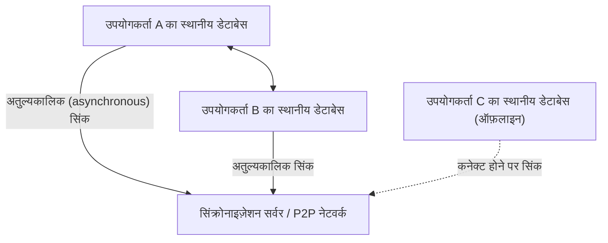
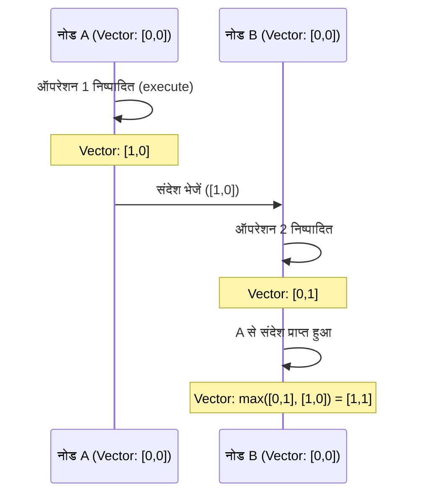

# CRDT और लोकल-फर्स्ट: ऑफलाइन होने पर भी सह-संपादन (collaborative editing) कैसे काम करता है

आधुनिक सॉफ्टवेयर विकास में, 'लोकल-फर्स्ट' पैराडाइम (paradigm) बहुत ध्यान आकर्षित कर रहा है। पारंपरिक क्लाउड-फर्स्ट एप्लिकेशन हमेशा जुड़े हुए इंटरनेट वातावरण की अपेक्षा करते हैं, जिससे ऑफ़लाइन या अस्थिर नेटवर्क वातावरण में उपयोगकर्ता का अनुभव काफी खराब हो जाता है। लोकल-फर्स्ट सॉफ्टवेयर इस समस्या को हल करने का एक दृष्टिकोण है, और इसके तकनीकी आधार को **CRDT (Conflict-free Replicated Data Type: टकराव-मुक्त प्रतिकृति डेटा प्रकार)** द्वारा समर्थित किया जाता है।

इस लेख में, हम CRDT की सैद्धांतिक पृष्ठभूमि, OT (Operational Transformation) के साथ इसकी तुलना, गणितीय प्रमाण, वितरित प्रणालियों (distributed systems) में तार्किक घड़ियों (logical clocks) की भूमिका और जावास्क्रिप्ट (Yjs, Automerge) का उपयोग करते हुए ठोस कार्यान्वयन उदाहरणों पर गहराई से चर्चा करेंगे।

## 1. लोकल-फर्स्ट सॉफ्टवेयर का युग

लोकल-फर्स्ट सॉफ्टवेयर एक ऐसा आर्किटेक्चर है जो मुख्य डेटा और एप्लिकेशन लॉजिक को उपयोगकर्ता के डिवाइस पर रखता है, और नेटवर्क कनेक्शन उपलब्ध होने पर बैकग्राउंड में निर्बाध रूप से सिंक्रोनाइज़ करता है। इस दृष्टिकोण के निम्नलिखित लाभ हैं:

*   **ऑफ़लाइन में पूर्ण कार्यक्षमता**: आप नेटवर्क कनेक्शन पर निर्भर हुए बिना कभी भी, कहीं भी अपना काम जारी रख सकते हैं।
*   **कम विलंबता (Low latency)**: चूँकि डेटा को पढ़ना और लिखना स्थानीय रूप से पूरा हो जाता है, क्लाउड के साथ संचार के कारण कोई देरी नहीं होती है।
*   **गोपनीयता और सुरक्षा**: चूँकि डेटा स्थानीय रूप से सहेजा जाता है, इसलिए उपयोगकर्ता अपने डेटा को पूरी तरह से नियंत्रित कर सकते हैं।
*   **निर्बाध सह-संपादन**: ऑफ़लाइन किए गए परिवर्तन ऑनलाइन होने पर अन्य उपयोगकर्ताओं के परिवर्तनों के साथ बिना किसी टकराव के स्वचालित रूप से मर्ज हो जाते हैं।



CRDT इस 'बिना टकराव के स्वचालित विलय (merge)' को संभव बनाता है। पारंपरिक तरीकों में, एक साथ संपादन के दौरान होने वाले टकराव को हल करना बेहद मुश्किल था, लेकिन CRDT इस समस्या को गणितीय नींव के आधार पर शानदार ढंग से हल करता है।

## 2. OT (Operational Transformation) से अंतर और उसकी सीमाएं

CRDT के आने से पहले, सह-संपादन (real-time collaboration) के लिए वास्तविक मानक **OT (Operational Transformation: परिचालन परिवर्तन)** था। Google Docs और Etherpad जैसे शुरुआती सह-संपादन सिस्टम इसी OT का उपयोग करते हैं।

### OT कैसे काम करता है
OT एक ऐसी तकनीक है जहाँ प्रत्येक उपयोगकर्ता द्वारा किए गए 'ऑपरेशन (Operation)' को सर्वर पर भेजा जाता है, और सर्वर सभी क्लाइंट्स में सुसंगत स्थिति बनाए रखने के लिए उन ऑपरेशनों को रूपांतरित (Transform) करता है।
उदाहरण के लिए, यदि उपयोगकर्ता A इंडेक्स 1 पर 'X' डालता है, और उसी समय उपयोगकर्ता B इंडेक्स 1 पर 'Y' डालता है, तो इसे सीधे लागू करने पर स्थिति में विरोधाभास होगा। सर्वर इन ऑपरेशनों का क्रम निर्धारित करता है और बाद में लागू होने वाले ऑपरेशन के इंडेक्स को स्थानांतरित (बदलकर) करके विरोधाभास को रोकता है।

### OT की सीमाएं
हालाँकि OT एक शक्तिशाली तकनीक है, लेकिन इसकी एक बड़ी कमजोरी यह है कि एक वितरित प्रणाली के रूप में इसकी जटिलता बहुत अधिक है।
*   **केंद्रीकृत सर्वर की आवश्यकता**: ऑपरेशनों को क्रमबद्ध करने और बदलने के लिए एक केंद्रीय सर्वर (Single Point of Truth) आवश्यक है। यह पूर्ण P2P (पीयर-टू-पीयर) संचार या लोकल-फर्स्ट उपयोग के मामलों के लिए उपयुक्त नहीं है जहाँ कई दिनों तक ऑफ़लाइन रहने वाले उपकरणों के परिवर्तनों को बाद में मर्ज किया जाता है।
*   **स्टेट एक्सप्लोज़न (State explosion) और एल्गोरिथम की जटिलता**: जैसे-जैसे ऑपरेशनों के प्रकार (इन्सर्ट, डिलीट, फॉर्मेटिंग परिवर्तन आदि) बढ़ते हैं, ऑपरेशनों का संयोजन (ट्रांसफॉर्मेशन मैट्रिक्स) तेजी से बढ़ता है। सभी संयोजनों के लिए ट्रांसफॉर्मेशन फ़ंक्शंस को सही ढंग से लागू करना और सिद्ध करना अत्यंत कठिन है।

इसके विपरीत, CRDT को किसी केंद्रीय सर्वर की आवश्यकता नहीं होती है, और इसकी यह विशेषता है कि ऑपरेशनों को किसी भी क्रम में लागू करने पर भी वे अंततः एक ही स्थिति में आ जाते हैं (Strong Eventual Consistency)।

## 3. CRDT का मूल सिद्धांत: गणितीय प्रमाण और आंशिक रूप से क्रमित सेट (Partially Ordered Set)

CRDT कोई 'ऐसा डेटा स्ट्रक्चर नहीं है जहाँ टकराव होता ही नहीं है।' यह 'एक ऐसा डेटा स्ट्रक्चर है जहाँ टकराव होने पर भी पूर्व सहमति के बिना इसे स्वचालित और नियतात्मक रूप से (deterministically) हल किया जा सकता है।' इसे प्राप्त करने के लिए, CRDT गणितीय गुणों का उपयोग करता है।

CRDT मुख्य रूप से दो प्रकार के होते हैं: **CvRDT (Convergent Replicated Data Type: स्टेट-आधारित)** और **CmRDT (Commutative Replicated Data Type: ऑपरेशन-आधारित)**।

### CvRDT (स्टेट-आधारित CRDT)

CvRDT नेटवर्क पर डेटा संरचना की 'स्थिति (state)' को ही भेजता और प्राप्त करता है, और एक मर्ज फ़ंक्शन (Merge Function) का उपयोग करके स्थानीय स्थिति और प्राप्त स्थिति को एकीकृत करता है।
इस मर्ज फ़ंक्शन के सही ढंग से काम करने के लिए, डेटा संरचना के स्टेट्स के सेट को एक **आंशिक रूप से क्रमित सेट (Partially Ordered Set / Join Semilattice)** बनाना चाहिए, और मर्ज फ़ंक्शन को निम्नलिखित तीन गणितीय गुणों को पूरा करना चाहिए।

1.  **विनिमेयता (Commutativity)**: `merge(A, B) = merge(B, A)`
    *   स्थिति A और स्थिति B को किसी भी क्रम में मर्ज करने पर परिणाम समान रहता है।
2.  **साहचर्य (Associativity)**: `merge(merge(A, B), C) = merge(A, merge(B, C))`
    *   3 या अधिक स्थितियों को मर्ज करते समय, किसी भी संयोजन से शुरू करने पर परिणाम समान रहता है।
3.  **वर्गसम (Idempotence)**: `merge(A, A) = A`
    *   एक ही स्थिति को कितनी भी बार मर्ज करने पर परिणाम नहीं बदलता (नेटवर्क पर डुप्लिकेट ट्रांसमिशन को सहने की क्षमता)।

**उदाहरण: Grow-Only Counter (G-Counter)**
सबसे सरल CvRDT में से एक ऐसा काउंटर है जो केवल बढ़ता है। प्रत्येक नोड अपनी आईडी और काउंट वैल्यू (वेक्टर) की एक जोड़ी (pair) रखता है।
स्थिति A: `[Node1: 2, Node2: 1]`
स्थिति B: `[Node1: 2, Node2: 3, Node3: 1]`
मर्ज फ़ंक्शन प्रत्येक नोड आईडी के लिए अधिकतम मान को अपनाता है (`max()` फ़ंक्शन विनिमेयता, साहचर्य और वर्गसम गुणों को पूरा करता है)।
परिणाम: `[Node1: 2, Node2: 3, Node3: 1]`

### CmRDT (ऑपरेशन-आधारित CRDT)

CmRDT स्थिति के बजाय नेटवर्क पर 'ऑपरेशन (Operation)' को प्रसारित (broadcast) करता है। सिंक्रोनाइज़ेशन प्राप्त ऑपरेशनों को स्थानीय स्थिति में लागू करके किया जाता है।
CmRDT के काम करने के लिए, नेटवर्क परत को निम्नलिखित शर्तों को पूरा करना होगा या डेटा संरचना द्वारा इसे सुनिश्चित किया जाना चाहिए।

1.  **ऑपरेशनों की विनिमेयता (Commutativity)**: किन्हीं दो समानांतर (concurrent) ऑपरेशनों `op1`, `op2` के लिए, उन्हें किसी भी क्रम में लागू करने पर परिणाम समान होना चाहिए।
2.  **Exactly-Once की गारंटी**: सभी ऑपरेशनों को बिल्कुल एक बार डिलीवर किया जाना चाहिए। हालाँकि, ऑपरेशनों को वर्गसम (idempotent) बनाकर इसे At-Least-Once डिलीवरी (डुप्लिकेट के साथ) पर भी काम करने योग्य बनाया जा सकता है।
3.  **कारण क्रम (Causal Ordering) की गारंटी**: यदि ऑपरेशन A, ऑपरेशन B का कारण है, तो सभी रेप्लिका में A को B से पहले लागू किया जाना चाहिए।

CmRDT का फायदा यह है कि इसमें कम संचार (कम्यूनिकेशन) होता है (क्योंकि केवल ऑपरेशनों का अंतर भेजा जाता है), लेकिन यह कारण क्रम (causal order) सुनिश्चित करने के लिए मैसेजिंग इन्फ्रास्ट्रक्चर (जैसे Vector Clock, जिसे बाद में बताया गया है) पर निर्भर करता है।

## 4. वितरित प्रणालियों की घड़ी: तार्किक घड़ी (Logical Clock) का महत्व

CRDT में, विशेष रूप से सह-संपादन में टेक्स्ट के अनुक्रमण (ordering) और CmRDT में कारण क्रम (causal order) सुनिश्चित करने में, यह जानना बेहद जरूरी है कि 'कौन सा ऑपरेशन कब हुआ'।
हालाँकि, वितरित प्रणालियों में प्रत्येक डिवाइस की भौतिक घड़ियों (Wall-clock time) को पूरी तरह से सिंक्रोनाइज़ करना असंभव है (NTP का उपयोग करने पर भी कुछ मिलीसेकंड से लेकर कुछ सेकंड तक का अंतर हो सकता है)।

इस समस्या को हल करने के लिए भौतिक समय के बजाय, **तार्किक घड़ी (Logical Clock)** का उपयोग किया जाता है, जो 'घटनाओं के अनुक्रम (कारण और प्रभाव)' को रिकॉर्ड करती है।

### Lamport Clock (लैमपोर्ट क्लॉक)
यह लेस्ली लैमपोर्ट द्वारा खोजी गई सबसे बुनियादी तार्किक घड़ी है।
प्रत्येक नोड एक एकल पूर्णांक मान (सिंगल इंटीजर वैल्यू / काउंटर) रखता है, और इसे निम्नलिखित नियमों के अनुसार अपडेट करता है।
1.  जब भी स्थानीय स्तर पर कोई घटना (इवेंट) होती है, तो काउंटर में 1 जोड़ा जाता है।
2.  संदेश भेजते समय, वर्तमान काउंटर का मान संदेश में शामिल किया जाता है।
3.  संदेश प्राप्त होने पर, यह अपने काउंटर को `max(अपना काउंटर, प्राप्त काउंटर) + 1` से अपडेट करता है।

इससे यह गारंटी मिलती है कि "यदि घटना A, घटना B का कारण है, तो A का क्लॉक मान < B का क्लॉक मान।" हालांकि, क्लॉक मानों से कारण संबंध का उल्टा अनुमान लगाना संभव नहीं है (समानांतर रूप से होने वाली घटनाओं के क्लॉक मानों के आकार का कोई मतलब नहीं होता है)।

### Vector Clock (वेक्टर क्लॉक)
वेक्टर क्लॉक Lamport क्लॉक की कमजोरियों को दूर करता है और घटनाओं के बीच सटीक कारण संबंध (या समानांतर संबंध) का निर्धारण करने की अनुमति देता है।
यह एकल काउंटर के बजाय, सिस्टम में मौजूद सभी नोड्स के काउंटरों की एक सरणी (vector/array) रखता है।

इसका एक नुकसान यह है कि नोड्स की संख्या बढ़ने पर डेटा का आकार बहुत बड़ा हो जाता है, लेकिन इसका उपयोग वर्जन कंट्रोल सिस्टम (जैसे DynamoDB में कॉन्फ्लिक्ट डिटेक्शन) में व्यापक रूप से किया जाता है। हालिया CRDT एल्गोरिदम अनुक्रम (order) को कुशलतापूर्वक निर्धारित करने के लिए वेक्टर क्लॉक के प्रकारों का उपयोग करते हैं, या कारण संबंधों को सीधे डेटा संरचनाओं में शामिल करते हैं (जैसे CRDT नोड्स के बीच पॉइंटर्स)।



## 5. जावास्क्रिप्ट में अभ्यास: Yjs और Automerge

सिद्धांत ही नहीं, बल्कि CRDT का उपयोग करके वास्तविक विकास हाल के वर्षों में बहुत आसान हो गया है। जावास्क्रिप्ट इकोसिस्टम में, CRDT के वास्तविक मानक दो लाइब्रेरीज़ हैं: **Yjs** और **Automerge**।

### Yjs: तेज़ टेक्स्ट और रिच-टेक्स्ट सिंक्रोनाइज़ेशन

Yjs के पास उत्कृष्ट प्रदर्शन (performance) है, और यह ProseMirror, Quill और Monaco Editor जैसे कई एडिटर्स के लिए आधिकारिक बाइंडिंग (bindings) प्रदान करता है। यदि आप टेक्स्ट के लिए सह-संपादन (जैसे Google Docs का क्लोन) बनाना चाहते हैं, तो Yjs आपकी पहली पसंद होनी चाहिए।

Yjs के अंदर, डेटा को एक फ्लैट द्विदिश लिंक्ड लिस्ट (doubly linked list) के रूप में दर्शाया जाता है, जिसमें प्रत्येक तत्व (element) की एक विशिष्ट आईडी (क्लाइंट आईडी और तार्किक घड़ी की एक जोड़ी) होती है। इससे तत्वों को सम्मिलित करना (insert) और हटाना (delete) बेहद तेज़ हो जाता है।

**Yjs का उपयोग करके एक सरल कार्यान्वयन उदाहरण (Node.js/ब्राउज़र)**

```javascript
import * as Y from 'yjs'

// दस्तावेज़ का आरंभीकरण (Initialization)
const doc1 = new Y.Doc()
const doc2 = new Y.Doc()

// साझा करने के लिए टेक्स्ट प्रकार बनाना
const text1 = doc1.getText('myText')
const text2 = doc2.getText('myText')

// उपयोगकर्ता 1 ने टेक्स्ट डाला
text1.insert(0, 'Hello ')
console.log('User 1 text:', text1.toString()) // "Hello "

// स्थिति को सिंक्रोनाइज़ करना (आमतौर पर WebRTC या WebSocket के माध्यम से किया जाता है)
// doc1 से परिवर्तन अंतर (Update) प्राप्त करें
const updateFromDoc1 = Y.encodeStateAsUpdate(doc1)

// उपयोगकर्ता 2 के दस्तावेज़ में परिवर्तनों को लागू करें (मर्ज करें)
Y.applyUpdate(doc2, updateFromDoc1)
console.log('User 2 text:', text2.toString()) // "Hello "

// एक साथ संपादन के कारण टकराव और स्वचालित समाधान
// उपयोगकर्ता 1 और उपयोगकर्ता 2 ऑफ़लाइन होने पर एक ही समय में संपादन करते हैं
text1.insert(6, 'World')
text2.insert(6, 'CRDT')

// सिंक निष्पादित (execute) करें
const update1 = Y.encodeStateAsUpdate(doc1)
const update2 = Y.encodeStateAsUpdate(doc2)
Y.applyUpdate(doc2, update1)
Y.applyUpdate(doc1, update2)

// दोनों नोड्स बिल्कुल उसी अंतिम स्थिति में परिवर्तित हो जाते हैं (Strong Eventual Consistency)
console.log('Merged User 1 text:', text1.toString()) // "Hello WorldCRDT" या "Hello CRDTWorld"
console.log('Merged User 2 text:', text2.toString()) // "Hello WorldCRDT" या "Hello CRDTWorld" (User 1 के बिल्कुल समान)
```

Yjs की मजबूती इस तथ्य में निहित है कि गणितीय रूप से यह गारंटी दी जाती है कि अंतिम स्थिति हमेशा सुसंगत होगी, भले ही यह अंतर (Update) बरकरार रहे (जैसे IndexedDB में सहेजा गया हो) या P2P नेटवर्क के माध्यम से किसी भी क्रम या समय में अन्य क्लाइंट्स को भेजा गया हो।

### Automerge: JSON-आधारित सामान्य स्थिति (state) सिंक्रोनाइज़ेशन

Automerge एक CRDT लाइब्रेरी है जो JSON-जैसी ऑब्जेक्ट संरचनाओं (नेस्टेड ऑब्जेक्ट्स, एरे और टेक्स्ट) को सिंक्रोनाइज़ करने में माहिर है। यह रिएक्ट जैसे फ्रंट-एंड फ्रेमवर्क के साथ अच्छी तरह से काम करता है, और पूरे एप्लिकेशन स्टेट को लोकल-फर्स्ट बनाने के लिए उपयुक्त है।

Automerge अपरिवर्तनीय (immutable) स्थिति प्रबंधन प्रदान करता है, और Redux की तरह स्टेट के सभी इतिहास को सहेज कर रखता है, इसलिए गिट (Git) की तरह "परिवर्तन इतिहास में टाइम ट्रैवल" या "ब्रांचिंग और मर्जिंग" जैसी उन्नत सुविधाएँ लागू करना संभव है।

**Automerge का उपयोग करके JSON ऑब्जेक्ट के सिंक्रोनाइज़ेशन का उदाहरण**

```javascript
import * as Automerge from '@automerge/automerge'

// दस्तावेज़ का आरंभीकरण (Initialization)
let doc1 = Automerge.init()

// दस्तावेज़ में परिवर्तन (एक नया अपरिवर्तनीय दस्तावेज़ लौटाया जाता है)
doc1 = Automerge.change(doc1, 'Initialize todo list', doc => {
  doc.todos = []
  doc.todos.push({ title: 'Buy milk', done: false })
})

// दस्तावेज़ का क्लोन (मान लें कि इसे दूसरे डिवाइस में कॉपी किया गया है)
let doc2 = Automerge.clone(doc1)

// ऑफ़लाइन स्थिति में सह-संपादन
doc1 = Automerge.change(doc1, 'Mark as done', doc => {
  doc.todos[0].done = true
})

doc2 = Automerge.change(doc2, 'Add another task', doc => {
  doc.todos.push({ title: 'Read a book', done: false })
})

// ऑनलाइन वापस आने पर मर्ज करें
let finalDoc = Automerge.merge(doc1, doc2)

console.log(JSON.stringify(finalDoc.todos, null, 2))
/* आउटपुट परिणाम (बिना किसी टकराव के दोनों परिवर्तन एकीकृत होते हैं):
[
  {
    "title": "Buy milk",
    "done": true
  },
  {
    "title": "Read a book",
    "done": false
  }
]
*/
```

## 6. सारांश और भविष्य की संभावनाएं

CRDT लोकल-फर्स्ट सॉफ्टवेयर को साकार करने वाली एक जादुई तकनीक है। यह हमें केंद्रीकृत सर्वरों द्वारा जटिल कॉन्फ्लिक्ट रिज़ॉल्यूशन (OT) से मुक्त करता है और एक ऐसा आर्किटेक्चर प्रदान करता है जो P2P और एज कंप्यूटिंग (edge computing) के साथ अत्यधिक अनुकूल है।

वहीं दूसरी ओर, CRDT में कुछ चुनौतियाँ भी मौजूद हैं:
*   **मेमोरी और स्टोरेज का बढ़ना (Bloat)**: चूंकि परिवर्तन के इतिहास और हटाए गए तत्वों (Tombstones) को बनाए रखना आवश्यक है, इसलिए समय के साथ दस्तावेज़ का आकार बढ़ता जाता है (गार्बेज कलेक्शन तकनीकों पर शोध जारी है)।
*   **अनपेक्षित मर्ज परिणाम**: स्ट्रिंग्स के इंटरलीविंग (interleaving) जैसे मामलों में, भले ही यह गणितीय रूप से सही ढंग से मर्ज हो जाए, फिर भी यह ऐसी स्ट्रिंग उत्पन्न कर सकता है जिसका इंसानों के लिए कोई मतलब न हो।

हालाँकि, Yjs और Automerge जैसी लाइब्रेरीज़ के परिपक्व होने के साथ, इन चुनौतियों के लिए व्यावहारिक समाधान (workarounds) भी विकसित किए जा रहे हैं। Figma, Linear और Notion जैसे आधुनिक एप्लिकेशन जो उपयोगकर्ता के अनुभव को अत्यधिक महत्व देते हैं, उन्होंने पहले ही लोकल-फर्स्ट आर्किटेक्चर और CRDT अवधारणाओं को अपना लिया है।

भविष्य में, जैसे-जैसे "लोकल-फर्स्ट" वेब एप्लिकेशन के लिए एक मानक आर्किटेक्चर के रूप में स्थापित होता जाएगा, CRDT सभी डेवलपर्स के लिए सीखने हेतु एक अनिवार्य पैराडाइम बन जाएगा。
