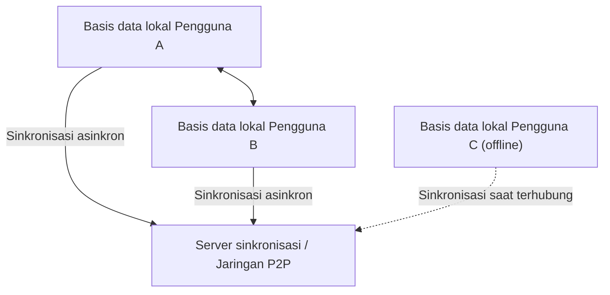
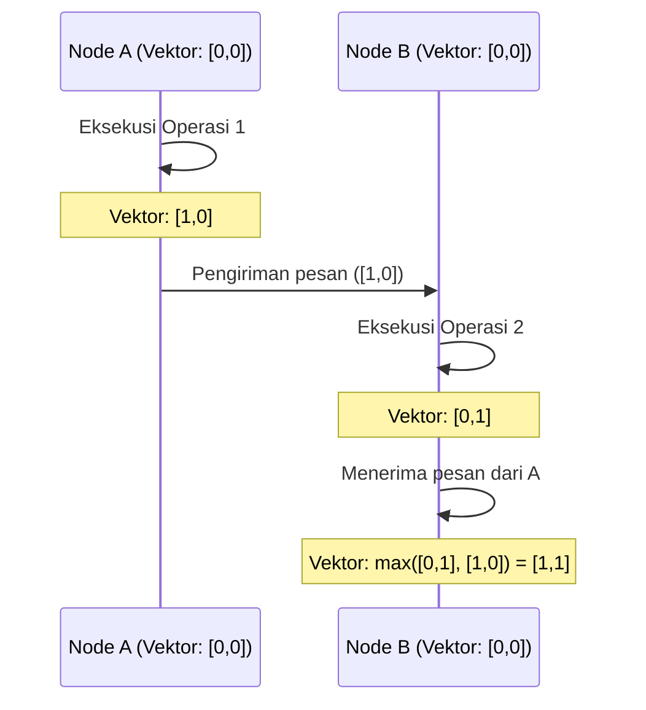

# CRDT dan Local-First: Mekanisme Kolaborasi Offline

Dalam pengembangan perangkat lunak modern, paradigma "local-first" telah menarik perhatian besar. Aplikasi cloud-first tradisional mengasumsikan koneksi internet yang konstan, dan menghadapi masalah di mana pengalaman pengguna sangat terganggu ketika offline atau dalam kondisi jaringan yang tidak stabil. Pendekatan untuk menyelesaikan masalah ini adalah perangkat lunak local-first, yang landasan teknisnya didukung oleh **CRDT (Conflict-free Replicated Data Type / Tipe Data Replikasi Bebas Konflik)**.

Artikel ini akan menggali dan menjelaskan dari latar belakang teoritis CRDT, perbandingan dengan OT (Operational Transformation), pembuktian matematis, peran jam logis (logical clock) dalam sistem terdistribusi, hingga contoh implementasi spesifik menggunakan JavaScript (Yjs, Automerge).

## 1. Era Perangkat Lunak Local-First

Perangkat Lunak Local-First adalah arsitektur yang menyimpan data utama dan logika aplikasi di perangkat pengguna, serta melakukan sinkronisasi secara mulus di latar belakang ketika koneksi jaringan tersedia. Pendekatan ini memiliki beberapa keuntungan berikut:

*   **Operasi offline penuh**: Anda dapat melanjutkan pekerjaan kapan saja dan di mana saja tanpa bergantung pada koneksi jaringan.
*   **Latensi rendah**: Membaca dan menulis data diselesaikan secara lokal, sehingga tidak ada penundaan akibat komunikasi ke cloud.
*   **Privasi dan keamanan**: Karena data disimpan secara lokal, pengguna dapat mengontrol data mereka sepenuhnya.
*   **Kolaborasi yang mulus**: Perubahan yang dilakukan secara offline akan digabungkan (di-merge) secara otomatis tanpa konflik dengan perubahan dari pengguna lain saat kembali online.



CRDT lah yang mewujudkan "penggabungan otomatis tanpa konflik" ini. Pada metode konvensional, penyelesaian konflik dalam pengeditan bersama sangatlah sulit, namun CRDT menyelesaikan masalah ini secara elegan berdasarkan dasar matematis.

## 2. Perbedaan dan Keterbatasan dibandingkan OT (Operational Transformation)

Sebelum kemunculan CRDT, standar de-facto untuk kolaborasi (pengeditan bersama secara real-time) adalah **OT (Operational Transformation / Transformasi Operasional)**. Sistem kolaborasi awal seperti Google Docs dan Etherpad mengadopsi OT.

### Cara Kerja OT
OT adalah teknik di mana "operasi" yang dilakukan oleh setiap pengguna dikirim ke server, dan server "mengubah" (transform) operasi tersebut untuk mempertahankan keadaan yang konsisten di semua klien.
Misalnya, jika Pengguna A menyisipkan "X" pada indeks 1, dan di saat yang sama Pengguna B menyisipkan "Y" pada indeks 1, menerapkannya secara langsung akan menyebabkan inkonsistensi. Server menyelesaikan ini dengan menentukan urutan operasi dan menggeser (mengubah) indeks operasi yang diterapkan belakangan.

### Keterbatasan OT
Meskipun OT merupakan teknologi yang kuat, ia memiliki kelemahan fatal berupa kompleksitas sistem terdistribusi yang sangat tinggi.
*   **Kebutuhan mutlak akan server terpusat**: Diperlukan server pusat (Single Point of Truth) untuk mengurutkan dan mengubah operasi. Ini tidak cocok untuk kasus penggunaan local-first seperti komunikasi P2P penuh atau menggabungkan perubahan secara susulan dari perangkat yang telah offline selama beberapa hari.
*   **Ledakan status dan kompleksitas algoritma**: Setiap kali jenis operasi (sisip, hapus, ubah format, dll) bertambah, kombinasi antar operasi (matriks transformasi) meningkat secara eksplosif. Sangat sulit untuk mengimplementasikan dan membuktikan kebenaran fungsi transformasi untuk semua kombinasi.

Sebaliknya, CRDT tidak memerlukan server pusat dan memiliki karakteristik di mana operasi dapat diterapkan dalam urutan apa pun namun pada akhirnya akan konvergen ke status yang sama (Strong Eventual Consistency).

## 3. Teori Dasar CRDT: Bukti Matematis dan Himpunan Terurut Parsial

CRDT bukanlah "struktur data tanpa konflik". Melainkan "struktur data yang dapat menyelesaikan konflik secara otomatis dan deterministik tanpa kesepakatan sebelumnya". Untuk mencapai hal ini, CRDT memanfaatkan sifat-sifat matematis.

Secara garis besar, terdapat dua jenis CRDT: **CvRDT (Convergent Replicated Data Type: berbasis state)** dan **CmRDT (Commutative Replicated Data Type: berbasis operasi)**.

### CvRDT (CRDT Berbasis State)

CvRDT mengirim dan menerima "state (status/keadaan) itu sendiri" dari struktur data melalui jaringan, dan mengintegrasikan state lokal dengan state yang diterima menggunakan fungsi penggabungan (Merge Function).
Agar fungsi merge ini bekerja dengan benar, himpunan state dari struktur data harus membentuk **himpunan terurut parsial (Partially Ordered Set / Join Semilattice)**, dan fungsi merge harus memenuhi 3 sifat matematis berikut:

1.  **Hukum Komutatif (Commutativity)**: `merge(A, B) = merge(B, A)`
    *   Apapun urutan penggabungan state A dan state B, hasilnya tetap sama.
2.  **Hukum Asosiatif (Associativity)**: `merge(merge(A, B), C) = merge(A, merge(B, C))`
    *   Saat menggabungkan tiga state atau lebih, hasil tidak berubah terlepas dari kombinasi mana yang digabung lebih dulu.
3.  **Idempotensi (Idempotence)**: `merge(A, A) = A`
    *   Menggabungkan state yang sama berulang kali tidak mengubah hasil (tahan terhadap pengiriman berulang di jaringan).

**Contoh: Grow-Only Counter (G-Counter)**
Salah satu CvRDT paling sederhana adalah penghitung yang hanya bisa bertambah. Setiap node menyimpan pasangan (vektor) dari ID-nya sendiri dan nilai hitungan.
State A: `[Node1: 2, Node2: 1]`
State B: `[Node1: 2, Node2: 3, Node3: 1]`
Fungsi merge akan mengambil nilai maksimal untuk setiap ID node (fungsi `max()` memenuhi hukum komutatif, asosiatif, dan idempotensi).
Hasil: `[Node1: 2, Node2: 3, Node3: 1]`

### CmRDT (CRDT Berbasis Operasi)

CmRDT tidak menyiarkan state, melainkan "operasi (Operation)" ke dalam jaringan. Sinkronisasi dilakukan dengan menerapkan operasi yang diterima ke state lokal.
Agar CmRDT berhasil, lapisan jaringan harus memenuhi syarat berikut, atau dijamin oleh struktur data itu sendiri:

1.  **Komutativitas Operasi (Commutativity)**: Untuk setiap dua operasi konkuren `op1` dan `op2`, hasil penerapannya harus sama tanpa memandang urutannya.
2.  **Jaminan Exactly-Once**: Semua operasi harus dikirimkan tepat satu kali. Namun, dengan memberikan sifat idempotensi pada operasi, ia juga bisa beroperasi dengan pengiriman At-Least-Once (dengan duplikasi).
3.  **Jaminan Urutan Kausal (Causal Ordering)**: Jika operasi A adalah penyebab operasi B, maka di semua replika, A harus diterapkan sebelum B.

Keuntungan CmRDT adalah volume komunikasi yang kecil (hanya mengirimkan selisih operasi), namun ia bergantung pada infrastruktur perpesanan (seperti Vector Clock yang dijelaskan di bawah) untuk menjamin urutan kausal.

## 4. Jam Sistem Terdistribusi: Pentingnya Jam Logis

Dalam CRDT, terutama pengurutan teks pada kolaborasi, dan jaminan urutan kausal di CmRDT, mengetahui dengan pasti "kapan dan operasi apa yang dilakukan" adalah hal yang sangat penting.
Namun, dalam sistem terdistribusi, sinkronisasi penuh pada jam fisik perangkat (Wall-clock time) adalah hal yang mustahil (meskipun menggunakan NTP, masih bisa terjadi pergeseran beberapa milidetik hingga detik).

Untuk mengatasi masalah ini, digunakan **Jam Logis (Logical Clock)** yang tidak merekam waktu fisik, melainkan "urutan kejadian (hubungan kausalitas)".

### Jam Lamport (Lamport Clock)
Ini adalah jam logis paling dasar yang ditemukan oleh Leslie Lamport.
Setiap node menyimpan satu nilai integer (counter) dan memperbaruinya dengan aturan berikut:
1.  Setiap kali sebuah kejadian terjadi secara lokal, tambahkan counter dengan 1.
2.  Saat mengirim pesan, sertakan nilai counter saat ini di dalam pesan.
3.  Saat menerima pesan, perbarui counter sendiri menjadi `max(counter sendiri, counter yang diterima) + 1`.

Hal ini menjamin kausalitas: "jika kejadian A adalah penyebab kejadian B, maka nilai jam A < nilai jam B". Namun, kita tidak bisa menyimpulkan kausalitas dari nilai jamnya secara terbalik (perbandingan nilai jam antara kejadian yang terjadi bersamaan/konkuren tidak memiliki arti).

### Jam Vektor (Vector Clock)
Jam Vektor mengatasi kelemahan Jam Lamport dan memungkinkan penentuan hubungan kausal (atau hubungan konkuren) yang sempurna antar kejadian.
Daripada satu counter tunggal, ini menyimpan array (vektor) counter untuk seluruh node di dalam sistem.

Meskipun kekurangannya adalah ukuran data akan membengkak seiring bertambahnya jumlah node, ia digunakan secara luas pada sistem kontrol versi (seperti deteksi konflik di DynamoDB). Pada algoritma CRDT terbaru, pengurutan ditentukan secara efisien melalui variasi Vector Clock atau dengan menanamkan hubungan kausal secara langsung ke dalam struktur data (misal pointer antar node pada CRDT).



## 5. Praktik di JavaScript: Yjs dan Automerge

Di luar teori semata, pengembangan menggunakan CRDT akhir-akhir ini menjadi sangat mudah. Dalam ekosistem JavaScript, pustaka standar de-facto untuk CRDT adalah **Yjs** dan **Automerge**.

### Yjs: Sinkronisasi Teks dan Rich-Text yang Cepat

Yjs memiliki performa yang sangat luar biasa, dan binding resminya tersedia untuk berbagai editor seperti ProseMirror, Quill, dan Monaco Editor. Jika ingin membangun fitur kolaborasi teks (seperti klon Google Docs), Yjs adalah pilihan utama.

Di dalam Yjs, data direpresentasikan sebagai doubly linked list yang datar (flat), dan setiap elemen memiliki ID unik (pasangan ID klien dan jam logis). Ini membuat penyisipan dan penghapusan elemen berlangsung dengan sangat cepat.

**Contoh Implementasi Sederhana dengan Yjs (Node.js/Browser)**

```javascript
import * as Y from 'yjs'

// Inisialisasi dokumen
const doc1 = new Y.Doc()
const doc2 = new Y.Doc()

// Pembuatan tipe teks bersama
const text1 = doc1.getText('myText')
const text2 = doc2.getText('myText')

// Pengguna 1 menyisipkan teks
text1.insert(0, 'Hello ')
console.log('Teks Pengguna 1:', text1.toString()) // "Hello "

// Sinkronisasi state (Biasanya dilakukan via WebRTC atau WebSocket)
// Dapatkan selisih perubahan (Update) dari doc1
const updateFromDoc1 = Y.encodeStateAsUpdate(doc1)

// Terapkan (merge) perubahan ke dokumen pengguna 2
Y.applyUpdate(doc2, updateFromDoc1)
console.log('Teks Pengguna 2:', text2.toString()) // "Hello "

// Terjadinya konflik akibat pengeditan bersama dan resolusi otomatis
// Pengguna 1 dan 2 mengedit pada saat yang sama dalam keadaan offline
text1.insert(6, 'World')
text2.insert(6, 'CRDT')

// Eksekusi sinkronisasi
const update1 = Y.encodeStateAsUpdate(doc1)
const update2 = Y.encodeStateAsUpdate(doc2)
Y.applyUpdate(doc2, update1)
Y.applyUpdate(doc1, update2)

// Kedua node akan konvergen pada keadaan akhir yang sama persis (Strong Eventual Consistency)
console.log('Teks Pengguna 1 Digabung:', text1.toString()) // "Hello WorldCRDT" atau "Hello CRDTWorld"
console.log('Teks Pengguna 2 Digabung:', text2.toString()) // "Hello WorldCRDT" atau "Hello CRDTWorld" (Sama persis dengan Pengguna 1)
```

Kekuatan Yjs adalah jaminan matematis bahwa kondisi akhir akan selalu sama, terlepas dari menyimpan selisih ini (Update) secara persisten (misal pada IndexedDB) atau mengirimkannya ke klien lain melalui jaringan P2P dengan urutan dan waktu yang bebas.

### Automerge: Sinkronisasi State Serbaguna Berbasis JSON

Automerge adalah pustaka CRDT yang difokuskan pada sinkronisasi struktur objek bergaya JSON (objek bersarang, array, teks). Pustaka ini sangat cocok dengan framework front-end seperti React, dan ideal untuk menjadikan keseluruhan state aplikasi menjadi local-first.

Automerge menyediakan manajemen state yang tidak dapat diubah (immutable), dan menjaga seluruh riwayat state seperti Redux. Ini memungkinkan pengimplementasian fitur tingkat lanjut seperti "penjelajahan waktu riwayat perubahan" atau "percabangan dan penggabungan branch" selayaknya Git.

**Contoh Sinkronisasi Objek JSON dengan Automerge**

```javascript
import * as Automerge from '@automerge/automerge'

// Inisialisasi dokumen
let doc1 = Automerge.init()

// Perubahan pada dokumen (Secara immutable mengembalikan dokumen baru)
doc1 = Automerge.change(doc1, 'Inisialisasi daftar todo', doc => {
  doc.todos = []
  doc.todos.push({ title: 'Beli susu', done: false })
})

// Kloning dokumen (Diasumsikan disalin ke perangkat lain)
let doc2 = Automerge.clone(doc1)

// Pengeditan bersama saat offline
doc1 = Automerge.change(doc1, 'Tandai selesai', doc => {
  doc.todos[0].done = true
})

doc2 = Automerge.change(doc2, 'Tambah tugas lain', doc => {
  doc.todos.push({ title: 'Baca buku', done: false })
})

// Penggabungan saat kembali online
let finalDoc = Automerge.merge(doc1, doc2)

console.log(JSON.stringify(finalDoc.todos, null, 2))
/* Hasil output (Kedua perubahan terintegrasi tanpa konflik):
[
  {
    "title": "Beli susu",
    "done": true
  },
  {
    "title": "Baca buku",
    "done": false
  }
]
*/
```

## 6. Kesimpulan dan Prospek ke Depan

CRDT adalah teknologi ajaib yang mewujudkan perangkat lunak local-first. Teknologi ini membebaskan kita dari penyelesaian konflik yang rumit menggunakan server terpusat (OT), dan memberikan arsitektur yang sangat kompatibel dengan P2P dan Edge Computing.

Di sisi lain, CRDT juga masih memiliki tantangan.
*   **Pembengkakan memori dan penyimpanan**: Karena riwayat perubahan dan elemen terhapus (Tombstone) harus tetap disimpan, ukuran dokumen dapat membengkak seiring waktu (penelitian tentang teknik garbage collection sedang berlangsung).
*   **Hasil penggabungan yang tidak diharapkan**: Terkadang, meskipun konvergen secara matematis, teks yang tidak bermakna bagi manusia dapat dihasilkan, seperti string yang saling menyilang (interleaving).

Namun, dengan kematangan pustaka seperti Yjs dan Automerge, solusi praktis untuk tantangan-tantangan ini mulai tersedia. Aplikasi modern yang mengejar pengalaman pengguna maksimal seperti Figma, Linear, dan Notion telah mengadopsi arsitektur local-first dan konsep CRDT.

Di masa depan, seiring dengan ditetapkannya "local-first" sebagai arsitektur standar untuk aplikasi Web, CRDT akan menjadi paradigma krusial yang wajib dipelajari oleh setiap pengembang.
