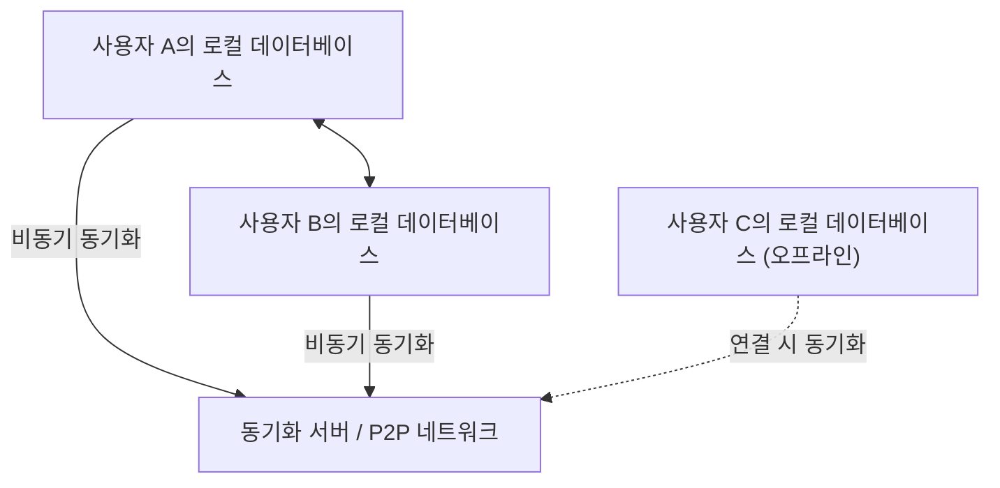
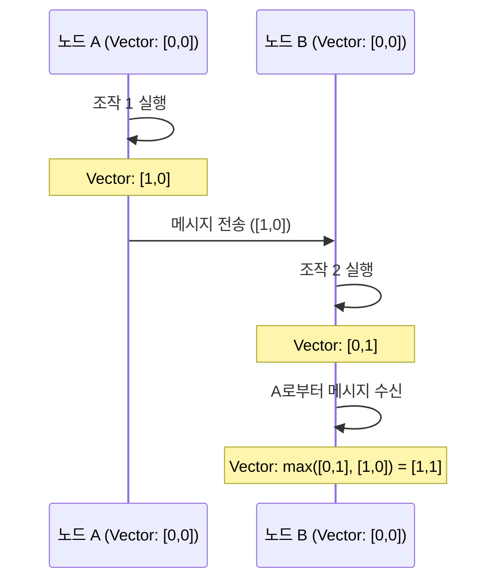

# CRDT와 로컬 퍼스트: 오프라인에서도 공동 편집할 수 있는 원리

현대의 소프트웨어 개발에 있어서 '로컬 퍼스트(Local-First)'라는 패러다임이 큰 주목을 받고 있습니다. 기존의 클라우드 퍼스트 애플리케이션은 항상 연결된 인터넷 환경을 전제로 하고 있어, 오프라인 상태나 네트워크가 불안정한 환경에서는 사용자 경험이 현저히 손상되는 과제를 안고 있었습니다. 이를 해결하기 위한 접근 방식이 로컬 퍼스트 소프트웨어이며, 그 기술적 근간을 뒷받침하는 것이 <strong>CRDT(Conflict-free Replicated Data Type: 충돌 없는 복제 데이터 타입)</strong>입니다.

본 기사에서는 CRDT의 이론적 배경부터 OT(Operational Transformation)와의 비교, 수학적인 증명, 분산 시스템에서 논리적 클록(Logical Clock)의 역할, 그리고 JavaScript를 사용한 구체적인 구현 예시(Yjs, Automerge)까지 깊이 있게 파헤쳐 설명합니다.

## 1. 로컬 퍼스트 소프트웨어의 시대

로컬 퍼스트 소프트웨어(Local-First Software)는 사용자의 디바이스 상에 주요 데이터와 애플리케이션 로직을 유지하고, 네트워크 연결이 가능할 때 백그라운드에서 원활하게 동기화를 수행하는 아키텍처입니다. 이 접근 방식에는 다음과 같은 장점이 있습니다.

*   **오프라인에서의 완벽한 동작**: 네트워크 연결에 의존하지 않고, 언제 어디서나 작업을 계속할 수 있습니다.
*   **낮은 지연 시간(Low Latency)**: 데이터 읽기 및 쓰기가 로컬에서 완료되므로 클라우드 통신으로 인한 지연이 발생하지 않습니다.
*   **개인정보 보호 및 보안**: 데이터가 로컬에 저장되므로 사용자가 스스로 데이터를 완전히 제어할 수 있습니다.
*   **원활한 공동 편집**: 오프라인에서 수행한 변경 사항이 온라인 상태가 되었을 때 다른 사용자의 변경 사항과 충돌하지 않고 자동으로 병합됩니다.



이러한 '충돌 없는 자동 병합'을 실현하는 것이 CRDT입니다. 기존 방식에서는 동시 편집의 충돌 해결이 매우 어려웠지만, CRDT는 이 문제를 수학적 기반에 근거하여 우아하게 해결합니다.

## 2. OT (Operational Transformation) 와의 차이점과 한계

CRDT가 등장하기 이전, 공동 편집(실시간 협업)의 사실상 표준은 <strong>OT(Operational Transformation: 연산 변환)</strong>였습니다. Google Docs나 Etherpad 등 초기의 공동 편집 시스템은 이 OT를 채택하고 있습니다.

### OT의 원리
OT는 각 사용자가 수행한 '조작(Operation)'을 서버로 전송하고, 서버가 그 조작들을 변환(Transform)하여 모든 클라이언트에서 일관성 있는 상태를 유지하는 기법입니다.
예를 들어, 사용자 A가 인덱스 1에 'X'를 삽입하고, 동시에 사용자 B가 인덱스 1에 'Y'를 삽입한 경우, 그대로 적용하면 상태가 모순됩니다. 서버는 이러한 조작의 순서를 결정하고, 나중에 적용되는 조작의 인덱스를 이동(변환)시킴으로써 모순을 방지합니다.

### OT의 한계
OT는 강력한 기술이지만, 분산 시스템으로서의 복잡성이 매우 높다는 치명적인 약점이 있습니다.
*   **중앙집중형 서버의 필수성**: 조작의 순서 지정 및 변환을 수행하기 위한 중앙 서버(Single Point of Truth)가 필수적입니다. 완전한 P2P(피어 투 피어) 통신이나, 며칠 동안 오프라인이었던 디바이스의 변경 사항을 나중에 병합하는 것과 같은 로컬 퍼스트 유스케이스에는 적합하지 않습니다.
*   **상태 폭발과 알고리즘의 복잡성**: 조작의 종류(삽입, 삭제, 서식 변경 등)가 늘어날 때마다, 조작 간의 조합(변환 매트릭스)이 폭발적으로 증가합니다. 모든 조합에 대해 변환 함수를 올바르게 구현하고 증명하는 것은 매우 어렵습니다.

이에 반해 CRDT는 중앙 서버를 필요로 하지 않고, 임의의 순서로 조작을 적용해도 최종적으로 동일한 상태로 수렴하는(Strong Eventual Consistency) 특성을 가지고 있습니다.

## 3. CRDT의 기초 이론: 수학적 증명과 부분 순서 집합

CRDT는 '충돌이 발생하지 않는 데이터 구조'가 아닙니다. '충돌이 발생해도 사전 합의 없이 자동적이고 결정론적으로 해결할 수 있는 데이터 구조'입니다. 이를 실현하기 위해 CRDT는 수학적인 특성을 이용하고 있습니다.

CRDT에는 크게 나누어 <strong>CvRDT(Convergent Replicated Data Type: 상태 기반)</strong>와 <strong>CmRDT(Commutative Replicated Data Type: 조작 기반)</strong>의 2종류가 존재합니다.

### CvRDT (상태 기반 CRDT)

CvRDT는 데이터 구조의 '상태 자체'를 네트워크를 통해 송수신하고, 로컬의 상태와 수신한 상태를 병합 함수(Merge Function)를 사용하여 통합합니다.
이 병합 함수가 올바르게 작동하기 위해서는 데이터 구조의 상태 집합이 <strong>부분 순서 집합(Partially Ordered Set / Join Semilattice)</strong>을 형성하고, 병합 함수가 다음의 세 가지 수학적 특성을 만족해야 합니다.

1.  **교환 법칙(Commutativity)**: `merge(A, B) = merge(B, A)`
    *   상태 A와 상태 B를 어떤 순서로 병합해도 결과는 동일하다.
2.  **결합 법칙(Associativity)**: `merge(merge(A, B), C) = merge(A, merge(B, C))`
    *   3개 이상의 상태를 병합할 때, 어떤 조합부터 먼저 병합해도 결과는 동일하다.
3.  **멱등성(Idempotence)**: `merge(A, A) = A`
    *   같은 상태를 몇 번 병합해도 결과는 변하지 않는다(네트워크의 중복 전송에 견딘다).

**예: Grow-Only Counter (G-Counter)**
가장 단순한 CvRDT 중 하나가 증가하기만 하는 카운터입니다. 각 노드는 자신의 ID와 카운트 값의 쌍(벡터)을 유지합니다.
상태 A: `[Node1: 2, Node2: 1]`
상태 B: `[Node1: 2, Node2: 3, Node3: 1]`
병합 함수는 각 노드의 ID마다 최대값을 채택합니다(`max()` 함수는 교환 법칙, 결합 법칙, 멱등성을 만족합니다).
결과: `[Node1: 2, Node2: 3, Node3: 1]`

### CmRDT (조작 기반 CRDT)

CmRDT는 상태가 아닌 '조작(Operation)'을 네트워크에 브로드캐스트합니다. 수신한 조작을 로컬 상태에 적용함으로써 동기화를 수행합니다.
CmRDT가 성립하기 위해서는 네트워크 계층이 다음 조건을 만족하거나, 데이터 구조 측에서 보장해야 합니다.

1.  **조작의 교환 가능성(Commutativity)**: 임의의 병행하는 2개의 조작 `op1`, `op2`에 대해 순서에 상관없이 적용 결과가 동일할 것.
2.  **Exactly-Once 보장**: 모든 조작이 정확히 1번씩 전달될 것. 단, 조작에 멱등성을 부여함으로써 At-Least-Once 전달(중복 있음)로도 작동시킬 수 있습니다.
3.  **인과적 순서(Causal Ordering) 보장**: 조작 A가 조작 B의 원인인 경우, 모든 레플리카에서 A가 B보다 먼저 적용될 것.

CmRDT는 통신량이 적다(조작의 차이점만 전송하므로)는 장점이 있지만, 인과적 순서를 보장하기 위한 메시징 인프라(후술할 Vector Clock 등)에 의존합니다.

## 4. 분산 시스템의 시계: 논리적 클록의 중요성

CRDT, 특히 공동 편집에서의 텍스트 순서 지정이나 CmRDT에서의 인과적 순서 보장에 있어서, '언제, 어떤 조작이 이루어졌는가'를 정확히 파악하는 것은 매우 중요합니다.
그러나 분산 시스템에서는 각 디바이스의 물리적인 시계(Wall-clock time)를 완전히 동기화하는 것은 불가능합니다(NTP를 사용해도 수 밀리초~수 초의 오차가 발생할 수 있습니다).

이 문제를 해결하기 위해 물리적인 시간이 아니라, '이벤트의 전후 관계(인과 관계)'를 기록하는 <strong>논리적 클록(Logical Clock)</strong>이 사용됩니다.

### Lamport Clock (램포트 클록)
Leslie Lamport가 고안한 가장 기본적인 논리적 클록입니다.
각 노드는 단일 정수값(카운터)을 유지하며, 다음 규칙에 따라 업데이트합니다.
1.  로컬에서 이벤트가 발생할 때마다 카운터를 1 증가시킨다.
2.  메시지를 전송할 때 현재 카운터 값을 메시지에 포함한다.
3.  메시지를 수신할 때 자신의 카운터를 `max(자신의 카운터, 수신한 카운터) + 1`로 업데이트한다.

이를 통해 '이벤트 A가 이벤트 B의 원인이라면, A의 클록 값 < B의 클록 값이다'라는 인과 관계를 보장할 수 있습니다. 단, 클록 값으로부터 인과 관계를 역산할 수는 없습니다(병행하여 발생한 이벤트 간의 클록 값 대소는 무의미합니다).

### Vector Clock (벡터 클록)
Lamport Clock의 약점을 보완하여 이벤트 간의 완전한 인과 관계(또는 병행 관계)를 판정할 수 있도록 한 것이 Vector Clock입니다.
단일 카운터가 아니라, 시스템 내의 모든 노드의 카운터 배열(벡터)을 유지합니다.

노드 수가 늘어나면 데이터 크기가 비대해진다는 단점이 있지만, 버전 관리 시스템(DynamoDB의 충돌 감지 등)에서 널리 사용되고 있습니다. 최근의 CRDT 알고리즘에서는 Vector Clock의 변종이나, 데이터 구조 자체에 인과 관계를 내장(CRDT 노드 간의 포인터 등)함으로써 효율적으로 순서를 결정하고 있습니다.



## 5. JavaScript에서의 실전: Yjs와 Automerge

이론뿐만 아니라 실제로 CRDT를 활용한 개발은 최근 매우 쉬워졌습니다. JavaScript 생태계에서 CRDT의 사실상 표준으로 자리 잡은 것이 **Yjs**와 **Automerge** 두 라이브러리입니다.

### Yjs: 고속 텍스트 및 리치 텍스트 동기화

Yjs는 성능이 매우 뛰어나며, ProseMirror, Quill, Monaco Editor와 같은 수많은 에디터와의 바인딩이 공식적으로 제공됩니다. 텍스트 공동 편집(Google Docs 클론 등)을 구축한다면 Yjs가 최우선 선택지가 됩니다.

Yjs 내부에서 데이터는 평면적인 이중 연결 리스트로 표현되며, 각 요소는 고유 ID(클라이언트 ID와 논리적 클록의 쌍)를 가집니다. 이를 통해 요소의 삽입 및 삭제가 매우 빠르게 이루어집니다.

**Yjs를 사용한 간단한 구현 예시 (Node.js/브라우저)**

```javascript
import * as Y from 'yjs'

// 문서 초기화
const doc1 = new Y.Doc()
const doc2 = new Y.Doc()

// 공유할 텍스트 타입 생성
const text1 = doc1.getText('myText')
const text2 = doc2.getText('myText')

// 사용자 1이 텍스트 삽입
text1.insert(0, 'Hello ')
console.log('User 1 text:', text1.toString()) // "Hello "

// 상태 동기화 (일반적으로 WebRTC나 WebSocket을 통해 이루어집니다)
// doc1의 변경 사항(Update)을 가져옴
const updateFromDoc1 = Y.encodeStateAsUpdate(doc1)

// 사용자 2의 문서에 변경 사항 적용(병합)
Y.applyUpdate(doc2, updateFromDoc1)
console.log('User 2 text:', text2.toString()) // "Hello "

// 동시 편집으로 인한 충돌 발생 및 자동 해결
// 사용자 1과 사용자 2가 오프라인 상태에서 동시에 편집
text1.insert(6, 'World')
text2.insert(6, 'CRDT')

// 동기화 실행
const update1 = Y.encodeStateAsUpdate(doc1)
const update2 = Y.encodeStateAsUpdate(doc2)
Y.applyUpdate(doc2, update1)
Y.applyUpdate(doc1, update2)

// 두 노드 모두 완전히 동일한 최종 상태(Strong Eventual Consistency)로 수렴함
console.log('Merged User 1 text:', text1.toString()) // "Hello WorldCRDT" 또는 "Hello CRDTWorld"
console.log('Merged User 2 text:', text2.toString()) // "Hello WorldCRDT" 또는 "Hello CRDTWorld" (User 1과 완전히 일치)
```

Yjs의 강력한 점은 이 변경 사항(Update)을 영속화(IndexedDB 등에 저장)하거나, P2P 네트워크를 통해 임의의 순서 및 타이밍에 다른 클라이언트로 전송하더라도 최종 상태가 항상 일치한다는 것이 수학적으로 보장된다는 점입니다.

### Automerge: JSON 기반 범용 상태 동기화

Automerge는 JSON 형태의 객체 구조(중첩된 객체, 배열, 텍스트) 동기화에 특화된 CRDT 라이브러리입니다. React와 같은 프론트엔드 프레임워크와의 호환성이 좋으며, 애플리케이션의 상태(State) 전체를 로컬 퍼스트화하는 데 적합합니다.

Automerge는 불변(Immutable) 상태 관리를 제공하며, Redux처럼 상태의 이력을 모두 유지하기 때문에 Git과 같은 '변경 이력의 타임 트래블'이나 '브랜치의 분기 및 병합' 같은 고급 기능도 구현할 수 있습니다.

**Automerge를 사용한 JSON 객체 동기화 예시**

```javascript
import * as Automerge from '@automerge/automerge'

// 문서 초기화
let doc1 = Automerge.init()

// 문서 변경 (불변 방식으로 새로운 문서가 반환됨)
doc1 = Automerge.change(doc1, 'Initialize todo list', doc => {
  doc.todos = []
  doc.todos.push({ title: 'Buy milk', done: false })
})

// 문서 클제 (다른 디바이스로 복사했다고 가정)
let doc2 = Automerge.clone(doc1)

// 오프라인 상태에서의 동시 편집
doc1 = Automerge.change(doc1, 'Mark as done', doc => {
  doc.todos[0].done = true
})

doc2 = Automerge.change(doc2, 'Add another task', doc => {
  doc.todos.push({ title: 'Read a book', done: false })
})

// 온라인 복귀 시 병합
let finalDoc = Automerge.merge(doc1, doc2)

console.log(JSON.stringify(finalDoc.todos, null, 2))
/* 출력 결과 (양쪽의 변경 사항이 충돌 없이 통합됨):
[
  {
    "title": "Buy milk",
    "done": true
  },
  {
    "title": "Read a book",
    "done": false
  }
]
*/
```

## 6. 요약 및 향후 전망

CRDT는 로컬 퍼스트 소프트웨어를 실현하기 위한 마법과도 같은 기술입니다. 중앙집중형 서버에 의한 복잡한 충돌 해결(OT)로부터 우리를 해방시키고, P2P나 엣지 컴퓨팅과의 친화성도 매우 높은 아키텍처를 제공합니다.

한편으로 CRDT에도 과제는 존재합니다.
*   **메모리 및 스토리지의 비대화**: 변경 이력이나 삭제된 요소(Tombstone)를 계속 유지해야 하므로 시간이 지남에 따라 문서의 크기가 비대해집니다(가비지 컬렉션 기술에 대한 연구가 진행 중입니다).
*   **의도하지 않은 병합 결과**: 문자열의 인터리빙 등, 수학적으로는 올바르게 수렴하더라도 사람에게는 의미를 알 수 없는 문자열이 생성되는 경우가 있습니다.

하지만 Yjs나 Automerge 같은 라이브러리의 성숙으로 이러한 과제에 대한 실용적인 해결책도 마련되고 있습니다. Figma, Linear, Notion 등 사용자 경험을 극한까지 추구하는 모던 애플리케이션은 이미 로컬 퍼스트 아키텍처나 CRDT의 개념을 도입하고 있습니다.

앞으로 웹 애플리케이션의 표준 아키텍처로서 '로컬 퍼스트'가 정착해 나가는 가운데, CRDT는 모든 개발자가 배워야 할 필수 패러다임이 될 것입니다.
