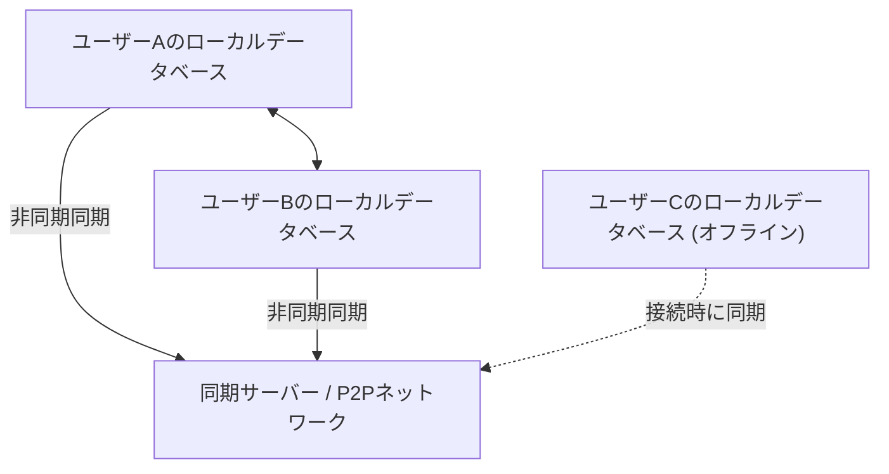
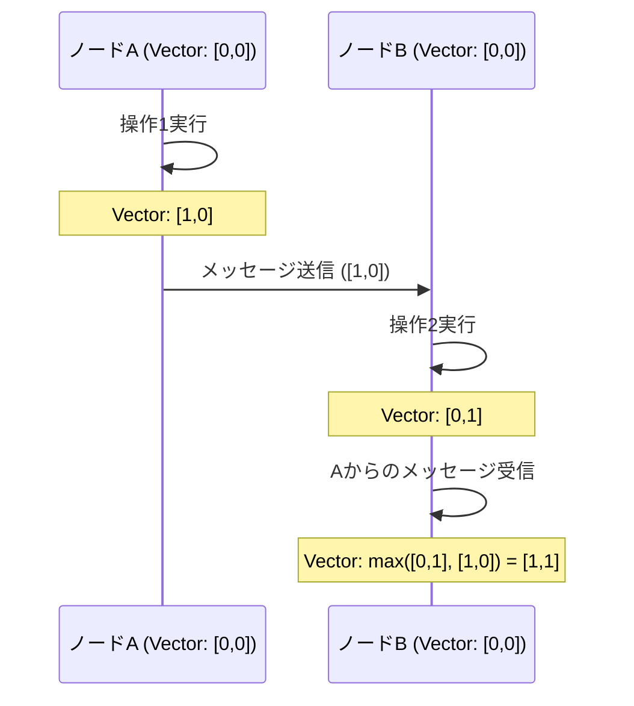

# CRDTとローカルファースト：オフラインでも共同編集できる仕組み

現代のソフトウェア開発において、「ローカルファースト」というパラダイムが大きな注目を集めています。従来のクラウドファーストなアプリケーションは、常時接続のインターネット環境を前提としており、オフライン状態やネットワークが不安定な環境下ではユーザー体験が著しく損なわれるという課題を抱えていました。これを解決するためのアプローチがローカルファーストソフトウェアであり、その技術的根幹を支えるのが<strong>CRDT（Conflict-free Replicated Data Type：競合なし複製データ型）</strong>です。

本記事では、CRDTの理論的背景から、OT（Operational Transformation）との比較、数学的な証明、分散システムにおける論理クロックの役割、そしてJavaScriptを用いた具体的な実装例（Yjs、Automerge）まで、深く掘り下げて解説します。

## 1. ローカルファーストソフトウェアの時代

ローカルファーストソフトウェア（Local-First Software）は、ユーザーのデバイス上に主要なデータとアプリケーションロジックを保持し、ネットワーク接続が利用可能な時にバックグラウンドでシームレスに同期を行うアーキテクチャです。このアプローチには以下の利点があります。

*   **オフラインでの完全な動作**: ネットワーク接続に依存せず、いつでもどこでも作業を継続できます。
*   **低レイテンシ**: データ読み書きがローカルで完結するため、クラウドへの通信による遅延が発生しません。
*   **プライバシーとセキュリティ**: データがローカルに保存されるため、ユーザー自身がデータを完全にコントロールできます。
*   **シームレスな共同編集**: オフラインで行った変更が、オンラインになった際に他のユーザーの変更と競合することなく自動的にマージされます。



この「競合なき自動マージ」を実現するのがCRDTです。従来の手法では、同時編集の競合解決は極めて困難でしたが、CRDTはこの問題を数学的基盤に基づいてエレガントに解決します。

## 2. OT (Operational Transformation) との違いと限界

CRDTが登場する以前、共同編集（リアルタイムコラボレーション）のデファクトスタンダードは<strong>OT（Operational Transformation：操作変換）</strong>でした。Google DocsやEtherpadなどの初期の共同編集システムは、このOTを採用しています。

### OTの仕組み
OTは、各ユーザーが行った「操作（Operation）」をサーバーに送信し、サーバーがそれらの操作を変換（Transform）してすべてのクライアントで一貫性のある状態を保つ手法です。
例えば、ユーザーAがインデックス1に「X」を挿入し、同時にユーザーBがインデックス1に「Y」を挿入した場合、そのまま適用すると状態が矛盾します。サーバーはこれらの操作の順序を決定し、後から適用される操作のインデックスをずらす（変換する）ことで矛盾を防ぎます。

### OTの限界
OTは強力な技術ですが、分散システムとしての複雑さが極めて高いという致命的な弱点があります。
*   **中央集権的なサーバーの必須性**: 操作の順序付けと変換を行うための中央サーバー（Single Point of Truth）が不可欠です。完全なP2P（ピアツーピア）通信や、数日間オフラインだったデバイスの変更を後からマージするようなローカルファーストなユースケースには適していません。
*   **状態爆発とアルゴリズムの複雑さ**: 操作の種類（挿入、削除、書式変更など）が増えるごとに、操作同士の組み合わせ（変換マトリックス）が爆発的に増加します。すべての組み合わせで変換関数を正しく実装・証明することは極めて困難です。

これに対してCRDTは、中央サーバーを必要とせず、任意の順序で操作を適用しても最終的に同じ状態に収束する（Strong Eventual Consistency）特性を持っています。

## 3. CRDTの基礎理論：数学的証明と半順序集合

CRDTは、「競合が発生しないデータ構造」ではありません。「競合が発生しても、事前の合意なしに自動的かつ決定論的に解決できるデータ構造」です。これを実現するために、CRDTは数学的な特性を利用しています。

CRDTには大きく分けて**CvRDT（Convergent Replicated Data Type：状態ベース）**と**CmRDT（Commutative Replicated Data Type：操作ベース）**の2種類が存在します。

### CvRDT（状態ベースのCRDT）

CvRDTは、データ構造の「状態そのもの」をネットワーク越しに送受信し、ローカルの状態と受信した状態をマージ関数（Merge Function）を使って統合します。
このマージ関数が正しく動作するためには、データ構造の状態の集合が<strong>半順序集合（Partially Ordered Set / Join Semilattice）</strong>を形成し、マージ関数が以下の3つの数学的特性を満たす必要があります。

1.  **交換法則（Commutativity）**: `merge(A, B) = merge(B, A)`
    *   状態Aと状態Bをどの順序でマージしても結果は同じ。
2.  **結合法則（Associativity）**: `merge(merge(A, B), C) = merge(A, merge(B, C))`
    *   3つ以上の状態をマージする際、どの組み合わせから先にマージしても結果は同じ。
3.  **冪等性（Idempotence）**: `merge(A, A) = A`
    *   同じ状態を何度マージしても結果は変わらない（ネットワークの重複送信に耐える）。

**例：Grow-Only Counter (G-Counter)**
最も単純なCvRDTの一つが、増加しかしないカウンターです。各ノードは自身のIDとカウント値のペア（ベクトル）を保持します。
状態A: `[Node1: 2, Node2: 1]`
状態B: `[Node1: 2, Node2: 3, Node3: 1]`
マージ関数は、各ノードのIDごとに最大の値を採用します（`max()`関数は交換法則、結合法則、冪等性を満たします）。
結果: `[Node1: 2, Node2: 3, Node3: 1]`

### CmRDT（操作ベースのCRDT）

CmRDTは、状態ではなく「操作（Operation）」をネットワークにブロードキャストします。受信した操作をローカルの状態に適用することで同期を行います。
CmRDTが成立するためには、ネットワーク層が以下の条件を満たすか、データ構造側で担保する必要があります。

1.  **操作の可換性（Commutativity）**: 任意の2つの並行な操作 `op1`, `op2` について、順序を問わず適用結果が同じになること。
2.  **Exactly-Onceの保証**: すべての操作が正確に1回ずつ配送されること。ただし、操作に冪等性を持たせることでAt-Least-Onceの配送（重複あり）でも動作させることができます。
3.  **因果順序（Causal Ordering）の保証**: 操作Aが操作Bの原因となっている場合、すべてのレプリカでAがBより先に適用されること。

CmRDTは通信量が少ない（操作の差分のみを送るため）というメリットがありますが、因果順序を保証するためのメッセージングインフラ（後述のVector Clockなど）に依存します。

## 4. 分散システムの時計：論理クロックの重要性

CRDT、特に共同編集におけるテキストの順序付けや、CmRDTでの因果順序の保証において、「いつ、どの操作が行われたか」を正確に把握することは極めて重要です。
しかし、分散システムにおいては、各デバイスの物理的な時計（Wall-clock time）を完全に同期させることは不可能です（NTPを使っても数ミリ秒〜数秒のズレが生じる可能性があります）。

この問題を解決するために、物理的な時間ではなく、「イベントの前後関係（因果関係）」を記録する<strong>論理クロック（Logical Clock）</strong>が使用されます。

### Lamport Clock (ランポートクロック)
Leslie Lamportによって考案された最も基本的な論理クロックです。
各ノードは単一の整数値（カウンター）を保持し、以下のルールで更新します。
1.  ローカルでイベントが発生するたびに、カウンターを1増やす。
2.  メッセージを送信する際、現在のカウンターの値をメッセージに含める。
3.  メッセージを受信した際、自身のカウンターを `max(自身のカウンター, 受信したカウンター) + 1` に更新する。

これにより、「イベントAがイベントBの原因であるならば、Aのクロック値 < Bのクロック値である」という因果関係を保証できます。ただし、クロック値から因果関係を逆算することはできません（並行して発生したイベント同士のクロック値の大小は無意味です）。

### Vector Clock (ベクタークロック)
Lamport Clockの弱点を補い、イベント間の完全な因果関係（または並行関係）を判定できるようにしたのがVector Clockです。
単一のカウンターではなく、システム内のすべてのノードのカウンターの配列（ベクトル）を保持します。

ノード数が増えるとデータサイズが肥大化するという欠点がありますが、バージョン管理システム（DynamoDBのコンフリクト検知など）で広く使われています。最近のCRDTアルゴリズムでは、Vector Clockの変種や、データ構造自身に因果関係を埋め込む（CRDTのノード間のポインタなど）ことで、効率的に順序を決定しています。



## 5. JavaScriptでの実践：YjsとAutomerge

理論だけでなく、実際にCRDTを利用した開発は近年非常に容易になっています。JavaScriptエコシステムにおいて、CRDTのデファクトスタンダードとなっているのが**Yjs**と**Automerge**の2つのライブラリです。

### Yjs: 高速なテキスト・リッチテキスト同期

Yjsは、パフォーマンスに極めて優れており、ProseMirror、Quill、Monaco Editorといった数々のエディタとのバインディングが公式に提供されています。テキストの共同編集（Google Docsクローンなど）を構築するなら、Yjsが最初の選択肢となります。

Yjsの内部では、データはフラットな双方向リンクリストとして表現され、各要素は一意のID（クライアントIDと論理クロックのペア）を持ちます。これにより、要素の挿入・削除が極めて高速に行われます。

**Yjsを使った簡単な実装例 (Node.js/ブラウザ)**

```javascript
import * as Y from 'yjs'

// ドキュメントの初期化
const doc1 = new Y.Doc()
const doc2 = new Y.Doc()

// 共有するテキストタイプの作成
const text1 = doc1.getText('myText')
const text2 = doc2.getText('myText')

// ユーザー1がテキストを挿入
text1.insert(0, 'Hello ')
console.log('User 1 text:', text1.toString()) // "Hello "

// 状態の同期（通常はWebRTCやWebSocket経由で行われます）
// doc1の変更差分（Update）を取得
const updateFromDoc1 = Y.encodeStateAsUpdate(doc1)

// ユーザー2のドキュメントに変更を適用（マージ）
Y.applyUpdate(doc2, updateFromDoc1)
console.log('User 2 text:', text2.toString()) // "Hello "

// 同時編集による競合の発生と自動解決
// ユーザー1とユーザー2がオフライン状態で同時に編集
text1.insert(6, 'World')
text2.insert(6, 'CRDT')

// 同期を実行
const update1 = Y.encodeStateAsUpdate(doc1)
const update2 = Y.encodeStateAsUpdate(doc2)
Y.applyUpdate(doc2, update1)
Y.applyUpdate(doc1, update2)

// どちらのノードも全く同じ最終状態（Strong Eventual Consistency）に収束する
console.log('Merged User 1 text:', text1.toString()) // "Hello WorldCRDT" または "Hello CRDTWorld"
console.log('Merged User 2 text:', text2.toString()) // "Hello WorldCRDT" または "Hello CRDTWorld" (User 1と完全に一致)
```

Yjsの強力な点は、この差分（Update）を永続化（IndexedDBなどへ保存）したり、P2Pネットワークを通じて任意の順番・任意のタイミングで別のクライアントへ送信しても、最終状態が常に一致することが数学的に保証されている点です。

### Automerge: JSONベースの汎用状態同期

Automergeは、JSONライクなオブジェクト構造（ネストされたオブジェクト、配列、テキスト）の同期に特化したCRDTライブラリです。Reactなどのフロントエンドフレームワークとの相性が良く、アプリケーションの状態（State）全体をローカルファースト化するのに適しています。

Automergeはイミュータブルな状態管理を提供し、Reduxのように状態の履歴をすべて保持するため、Gitのような「変更履歴のタイムトラベル」や「ブランチの分岐・マージ」といった高度な機能も実装可能です。

**Automergeを使ったJSONオブジェクトの同期例**

```javascript
import * as Automerge from '@automerge/automerge'

// ドキュメントの初期化
let doc1 = Automerge.init()

// ドキュメントへの変更（イミュータブルに新しいドキュメントが返る）
doc1 = Automerge.change(doc1, 'Initialize todo list', doc => {
  doc.todos = []
  doc.todos.push({ title: 'Buy milk', done: false })
})

// ドキュメントのクローン（別のデバイスへコピーしたと仮定）
let doc2 = Automerge.clone(doc1)

// オフライン状態での同時編集
doc1 = Automerge.change(doc1, 'Mark as done', doc => {
  doc.todos[0].done = true
})

doc2 = Automerge.change(doc2, 'Add another task', doc => {
  doc.todos.push({ title: 'Read a book', done: false })
})

// オンライン復帰時のマージ
let finalDoc = Automerge.merge(doc1, doc2)

console.log(JSON.stringify(finalDoc.todos, null, 2))
/* 出力結果（両方の変更が競合なく統合される）:
[
  {
    "title": "Buy milk",
    "done": true
  },
  {
    "title": "Read a book",
    "done": false
  }
]
*/
```

## 6. まとめと今後の展望

CRDTは、ローカルファーストソフトウェアを実現するための魔法のような技術です。中央集権的なサーバーによる複雑な競合解決（OT）から私たちを解放し、P2Pやエッジコンピューティングとの親和性も非常に高いアーキテクチャを提供します。

一方で、CRDTにも課題は存在します。
*   **メモリとストレージの肥大化**: 変更履歴や削除された要素（Tombstone）を保持し続ける必要があるため、ドキュメントのサイズが時間とともに肥大化します（ガベージコレクション技術の研究が進んでいます）。
*   **意図しないマージ結果**: 文字列のインターリーブなど、数学的には正しく収束しても、人間にとって意味不明な文字列が生成されるケースがあります。

しかし、YjsやAutomergeといったライブラリの成熟により、これらの課題に対する実用的な回避策も整備されつつあります。Figma、Linear、Notionなど、ユーザー体験を極限まで追求するモダンなアプリケーションは、すでにローカルファーストなアーキテクチャやCRDTの概念を取り入れています。

今後、Webアプリケーションの標準的なアーキテクチャとして「ローカルファースト」が定着していく中で、CRDTはすべての開発者が学ぶべき必須のパラダイムとなるでしょう。
