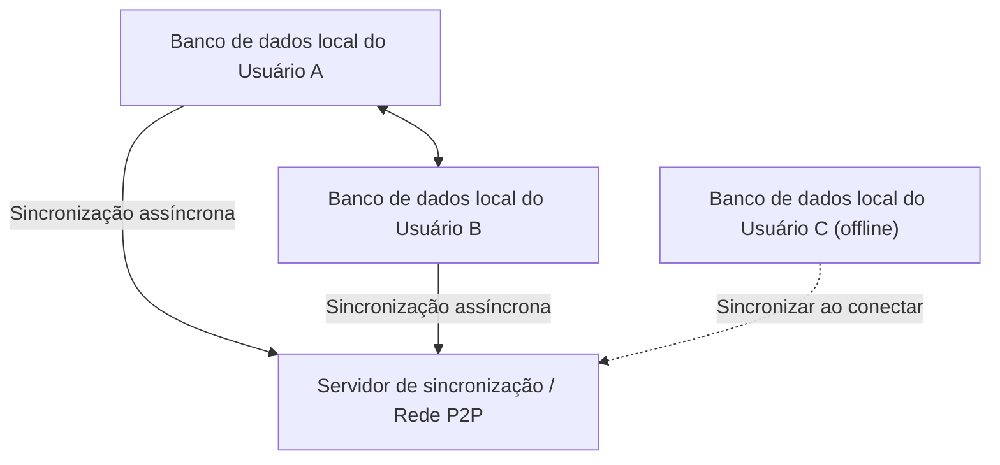
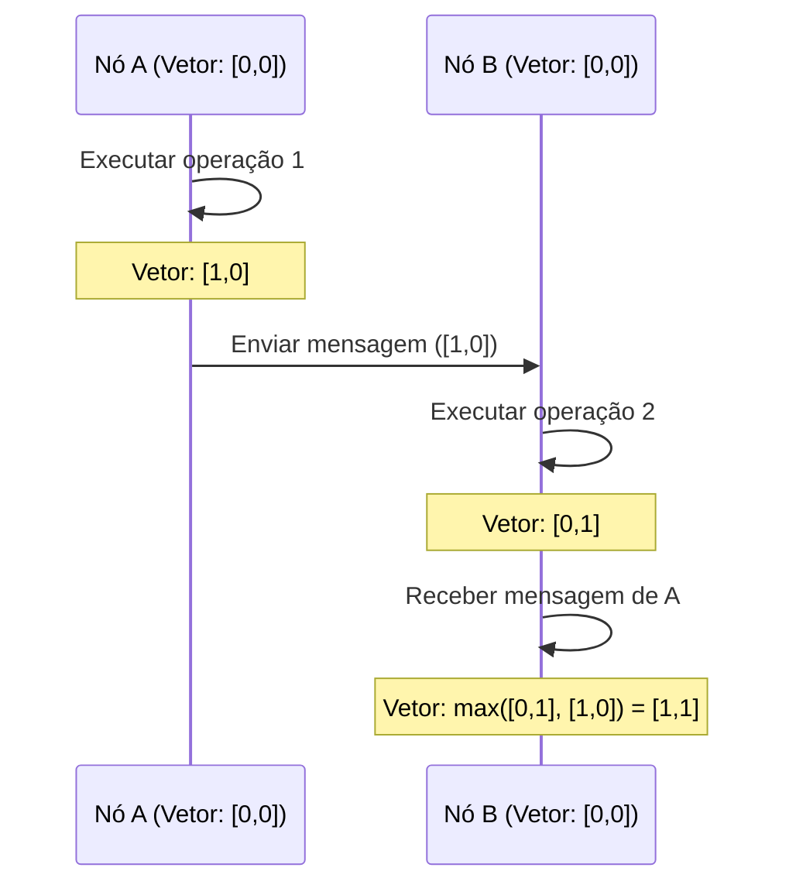

# CRDT e Local-First: O Mecanismo que Permite a Edição Colaborativa Mesmo Offline

No desenvolvimento de software moderno, o paradigma "local-first" tem atraído grande atenção. Os aplicativos tradicionais "cloud-first" pressupõem uma conexão constante com a internet, enfrentando o problema de que a experiência do usuário é severamente prejudicada offline ou sob ambientes de rede instáveis. A abordagem para resolver isso é o software local-first, cujo fundamento técnico é suportado por **CRDT (Conflict-free Replicated Data Type - Tipo de Dados Replicados Livres de Conflitos)**.

Neste artigo, nos aprofundaremos na base teórica dos CRDTs, em comparação com OT (Operational Transformation), provas matemáticas, o papel dos relógios lógicos em sistemas distribuídos e exemplos práticos de implementação usando JavaScript (Yjs, Automerge).

## 1. A Era do Software Local-First

O Software Local-First é uma arquitetura onde os dados principais e a lógica do aplicativo são mantidos no dispositivo do usuário, realizando a sincronização perfeitamente em segundo plano quando a conexão de rede está disponível. Esta abordagem tem as seguintes vantagens:

*   **Funcionamento completo offline**: Independente de conexão com a rede, você pode continuar trabalhando a qualquer hora e em qualquer lugar.
*   **Baixa latência**: Como a leitura e escrita de dados são concluídas localmente, não há atrasos causados pela comunicação com a nuvem.
*   **Privacidade e segurança**: Como os dados são armazenados localmente, os próprios usuários têm controle total sobre eles.
*   **Edição colaborativa perfeita**: As alterações feitas offline são mescladas automaticamente sem entrar em conflito com as alterações de outros usuários quando ficam online.



É o CRDT que permite essa "mesclagem automática sem conflitos". Com métodos tradicionais, a resolução de conflitos de edição simultânea era extremamente difícil, mas o CRDT resolve esse problema de forma elegante com base em fundamentos matemáticos.

## 2. Diferenças e Limitações do OT (Operational Transformation)

Antes do advento do CRDT, o padrão de fato para a edição colaborativa (colaboração em tempo real) era a **OT (Operational Transformation - Transformação Operacional)**. Os primeiros sistemas de edição colaborativa, como Google Docs e Etherpad, adotaram essa OT.

### Como a OT funciona
A OT é um método em que cada usuário envia "Operações" (Operations) realizadas por ele para um servidor, e o servidor transforma (Transform) essas operações para manter um estado consistente em todos os clientes.
Por exemplo, se o Usuário A inserir "X" no índice 1 e, simultaneamente, o Usuário B inserir "Y" no índice 1, aplicá-las como estão resultaria em um estado inconsistente. O servidor determina a ordem dessas operações e desloca (transforma) o índice da operação aplicada posteriormente para evitar inconsistências.

### Limitações da OT
Embora a OT seja uma tecnologia poderosa, ela tem uma fraqueza fatal: sua complexidade como um sistema distribuído é extremamente alta.
*   **Necessidade de um servidor centralizado**: É indispensável um servidor central (Single Point of Truth - Ponto Único de Verdade) para ordenar e transformar as operações. Não é adequado para casos de uso local-first, como comunicação P2P completa ou a mesclagem posterior de alterações de dispositivos que estiveram offline por dias.
*   **Explosão de estados e complexidade do algoritmo**: À medida que os tipos de operações (inserção, exclusão, mudança de formatação, etc.) aumentam, as combinações entre operações (matriz de transformação) explodem enormemente. Implementar e provar corretamente as funções de transformação para todas as combinações é extremamente difícil.

Em contrapartida, os CRDTs não necessitam de um servidor centralizado e têm a propriedade de convergir para o mesmo estado final independentemente da ordem em que as operações são aplicadas (Strong Eventual Consistency - Forte Consistência Eventual).

## 3. Teoria Básica do CRDT: Prova Matemática e Conjunto Parcialmente Ordenado

Os CRDTs não são "estruturas de dados onde os conflitos não ocorrem". Eles são "estruturas de dados onde, mesmo que os conflitos ocorram, eles podem ser resolvidos automaticamente e de forma determinística sem acordo prévio". Para alcançar isso, os CRDTs utilizam propriedades matemáticas.

Os CRDTs são amplamente divididos em dois tipos: **CvRDT (Convergent Replicated Data Type - Baseado em Estado)** e **CmRDT (Commutative Replicated Data Type - Baseado em Operação)**.

### CvRDT (CRDT Baseado em Estado)

O CvRDT envia e recebe "o próprio estado" da estrutura de dados pela rede, e integra o estado local com o estado recebido usando uma função de mesclagem (Merge Function).
Para que essa função de mesclagem funcione corretamente, o conjunto de estados da estrutura de dados deve formar um **Conjunto Parcialmente Ordenado (Partially Ordered Set / Join Semilattice)** e a função de mesclagem deve satisfazer as três seguintes propriedades matemáticas:

1.  **Comutatividade (Commutativity)**: `merge(A, B) = merge(B, A)`
    *   Independentemente da ordem em que os estados A e B são mesclados, o resultado é o mesmo.
2.  **Associatividade (Associativity)**: `merge(merge(A, B), C) = merge(A, merge(B, C))`
    *   Ao mesclar três ou mais estados, não importa qual combinação é mesclada primeiro, o resultado é o mesmo.
3.  **Idempotência (Idempotence)**: `merge(A, A) = A`
    *   O resultado não muda, não importa quantas vezes o mesmo estado seja mesclado (suporta transmissões duplicadas na rede).

**Exemplo: Grow-Only Counter (G-Counter)**
Um dos CvRDTs mais simples é um contador que apenas aumenta. Cada nó mantém um par (vetor) de seu próprio ID e valor de contagem.
Estado A: `[Node1: 2, Node2: 1]`
Estado B: `[Node1: 2, Node2: 3, Node3: 1]`
A função de mesclagem adota o valor máximo para cada ID de nó (a função `max()` satisfaz a comutatividade, associatividade e idempotência).
Resultado: `[Node1: 2, Node2: 3, Node3: 1]`

### CmRDT (CRDT Baseado em Operação)

O CmRDT transmite "Operações" em vez de estados para a rede. A sincronização é feita aplicando as operações recebidas ao estado local.
Para que o CmRDT funcione, a camada de rede deve satisfazer as seguintes condições, ou a estrutura de dados deve garantir:

1.  **Comutatividade de Operações (Commutativity)**: Para quaisquer duas operações concorrentes `op1` e `op2`, o resultado da aplicação será o mesmo independentemente da ordem.
2.  **Garantia de Exactly-Once**: Que todas as operações sejam entregues exatamente uma vez. No entanto, ao dotar as operações de idempotência, elas podem funcionar mesmo com a entrega At-Least-Once (com duplicações).
3.  **Garantia de Ordem Causal (Causal Ordering)**: Se a Operação A for a causa da Operação B, A deve ser aplicada antes de B em todas as réplicas.

Os CmRDTs têm a vantagem do baixo volume de comunicação (já que enviam apenas as diferenças das operações), mas dependem de infraestrutura de mensagens para garantir a ordem causal (como Vector Clocks, descritos abaixo).

## 4. O Relógio dos Sistemas Distribuídos: A Importância dos Relógios Lógicos

Nos CRDTs, especialmente no ordenamento de texto em edições colaborativas e na garantia de ordem causal nos CmRDTs, é extremamente importante entender exatamente "quando e qual operação foi realizada".
No entanto, em sistemas distribuídos, é impossível sincronizar perfeitamente os relógios físicos (Wall-clock time) de cada dispositivo (mesmo usando NTP, podem ocorrer desvios de milissegundos a segundos).

Para resolver esse problema, são usados os **Relógios Lógicos (Logical Clock)**, que não registram o tempo físico, mas o "relacionamento de antes e depois (relação de causalidade) dos eventos".

### Lamport Clock (Relógio de Lamport)
É o relógio lógico mais básico, inventado por Leslie Lamport.
Cada nó mantém um único valor inteiro (contador) e o atualiza conforme as seguintes regras:
1.  Toda vez que ocorre um evento localmente, incrementa o contador em 1.
2.  Ao enviar uma mensagem, inclui o valor do contador atual na mensagem.
3.  Ao receber uma mensagem, atualiza o próprio contador para `max(próprio contador, contador recebido) + 1`.

Desta forma, pode-se garantir a relação de causalidade que "se o evento A é a causa do evento B, então o valor do relógio de A < o valor do relógio de B". No entanto, não se pode deduzir retroativamente as relações causais a partir dos valores dos relógios (a magnitude dos valores de relógio entre eventos simultâneos não tem sentido).

### Vector Clock (Relógio Vetorial)
O Vector Clock compensa as fraquezas do Lamport Clock, permitindo determinar a relação de causalidade completa (ou relação paralela) entre os eventos.
Em vez de um único contador, ele mantém uma matriz (vetor) de contadores de todos os nós no sistema.

Embora tenha a desvantagem de inchar o tamanho dos dados à medida que o número de nós aumenta, ele é amplamente utilizado em sistemas de controle de versão (como detecção de conflito do DynamoDB). Algoritmos recentes de CRDT usam variantes do Vector Clock ou embutem relações causais diretamente nas próprias estruturas de dados (como ponteiros entre nós do CRDT) para determinar a ordem com eficiência.



## 5. Prática em JavaScript: Yjs e Automerge

Além da teoria, o desenvolvimento real usando CRDTs tornou-se muito mais fácil nos últimos anos. No ecossistema JavaScript, as bibliotecas padrão de fato para CRDTs são o **Yjs** e o **Automerge**.

### Yjs: Sincronização rápida de texto e rich text

Yjs é excelente em desempenho e fornece conexões oficiais a vários editores, como ProseMirror, Quill e Monaco Editor. Se você estiver construindo edição colaborativa de texto (como um clone do Google Docs), o Yjs será a sua primeira escolha.

Internamente, os dados no Yjs são representados como uma lista duplamente encadeada plana, onde cada elemento tem um ID único (um par do ID do cliente e o relógio lógico). Isso permite que a inserção e exclusão de elementos sejam extremamente rápidas.

**Exemplo simples usando Yjs (Node.js/Navegador)**

```javascript
import * as Y from 'yjs'

// Inicialização do documento
const doc1 = new Y.Doc()
const doc2 = new Y.Doc()

// Criação do tipo de texto compartilhado
const text1 = doc1.getText('myText')
const text2 = doc2.getText('myText')

// O usuário 1 insere o texto
text1.insert(0, 'Hello ')
console.log('User 1 text:', text1.toString()) // "Hello "

// Sincronização de estado (geralmente feita via WebRTC ou WebSocket)
// Obter diferença de modificação (Update) do doc1
const updateFromDoc1 = Y.encodeStateAsUpdate(doc1)

// Aplicar (mesclar) a alteração ao documento do usuário 2
Y.applyUpdate(doc2, updateFromDoc1)
console.log('User 2 text:', text2.toString()) // "Hello "

// Ocorrência e resolução automática de conflitos devido à edição simultânea
// O usuário 1 e o usuário 2 editam simultaneamente enquanto offline
text1.insert(6, 'World')
text2.insert(6, 'CRDT')

// Executar sincronização
const update1 = Y.encodeStateAsUpdate(doc1)
const update2 = Y.encodeStateAsUpdate(doc2)
Y.applyUpdate(doc2, update1)
Y.applyUpdate(doc1, update2)

// Ambos os nós convergirão para exatamente o mesmo estado final (Forte Consistência Eventual)
console.log('Merged User 1 text:', text1.toString()) // "Hello WorldCRDT" ou "Hello CRDTWorld"
console.log('Merged User 2 text:', text2.toString()) // "Hello WorldCRDT" ou "Hello CRDTWorld" (Corresponde completamente ao Usuário 1)
```

O ponto forte do Yjs é que, mesmo se você persistir essa diferença (Update) (como salvando-a no IndexedDB) ou enviá-la para outro cliente em qualquer ordem e momento por meio da rede P2P, é matematicamente garantido que o estado final sempre corresponderá.

### Automerge: Sincronização geral de estado baseada em JSON

O Automerge é uma biblioteca CRDT especializada na sincronização de estruturas de objetos no estilo JSON (objetos aninhados, matrizes, texto). Ele funciona bem com frameworks front-end como o React, tornando-o adequado para transformar todo o estado (State) de um aplicativo em local-first.

Como o Automerge fornece gerenciamento de estado imutável e mantém todo o histórico do estado como o Redux, recursos avançados como "viagem no tempo no histórico de alterações" no estilo Git ou "ramificação de ramificações/mesclagens" podem ser implementados.

**Exemplo de sincronização de um objeto JSON usando Automerge**

```javascript
import * as Automerge from '@automerge/automerge'

// Inicialização do documento
let doc1 = Automerge.init()

// Modificação do documento (um novo documento é retornado de forma imutável)
doc1 = Automerge.change(doc1, 'Initialize todo list', doc => {
  doc.todos = []
  doc.todos.push({ title: 'Buy milk', done: false })
})

// Clonagem de documento (assumindo que copiado para outro dispositivo)
let doc2 = Automerge.clone(doc1)

// Edição simultânea em estado offline
doc1 = Automerge.change(doc1, 'Mark as done', doc => {
  doc.todos[0].done = true
})

doc2 = Automerge.change(doc2, 'Add another task', doc => {
  doc.todos.push({ title: 'Read a book', done: false })
})

// Mesclagem ao retornar online
let finalDoc = Automerge.merge(doc1, doc2)

console.log(JSON.stringify(finalDoc.todos, null, 2))
/* Resultado de saída (ambas as mudanças são integradas sem conflitos):
[
  {
    "title": "Buy milk",
    "done": true
  },
  {
    "title": "Read a book",
    "done": false
  }
]
*/
```

## 6. Conclusão e Perspectivas Futuras

O CRDT é uma tecnologia quase mágica para o alcance do software local-first. Ele nos livra da resolução complexa de conflitos (OT) de servidores centralizados e fornece uma arquitetura que também é altamente compatível com computação P2P e de borda.

Por outro lado, o CRDT também tem seus desafios.
*   **Inchaço da memória e do armazenamento**: À medida que é necessário reter o histórico de alterações ou elementos excluídos (Tombstones), o tamanho do documento infla com o tempo (a pesquisa de tecnologia de coleta de lixo está em andamento).
*   **Resultados inesperados de mesclagem**: Mesmo que matematicamente a convergência esteja correta, podem haver casos em que cadeias de caracteres geradas são incompreensíveis para os humanos, como no entrelaçamento de strings.

No entanto, com a maturidade de bibliotecas como Yjs e Automerge, soluções práticas para esses problemas estão sendo desenvolvidas. Aplicações modernas que buscam as melhores experiências para o usuário, como Figma, Linear e Notion, já incorporaram arquiteturas local-first e o conceito CRDT.

No futuro, à medida que o modelo "local-first" se tornar uma arquitetura padrão para aplicações web, o CRDT sem dúvida se tornará um paradigma essencial que todos os desenvolvedores devem aprender.
