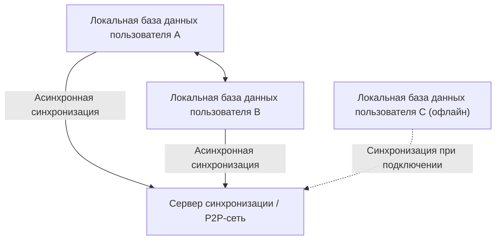
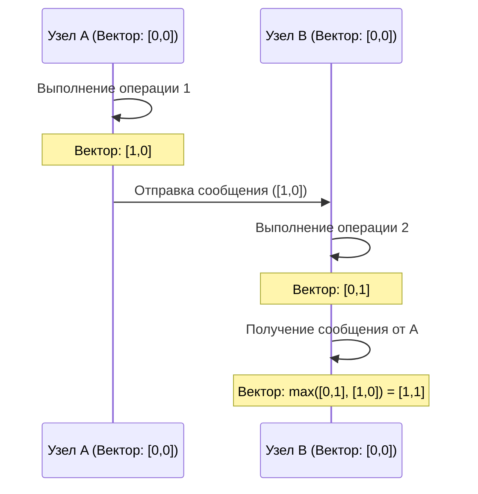

# CRDT и Local-First: Механизм совместного редактирования в автономном режиме

В современной разработке программного обеспечения парадигма "local-first" (сначала локально) привлекает огромное внимание. Традиционные облачные (cloud-first) приложения предполагают постоянное подключение к Интернету, и их пользовательский опыт значительно ухудшается в автономном режиме или при нестабильном сетевом окружении. Подход, решающий эту проблему — это программное обеспечение local-first, а его техническую основу поддерживает **CRDT (Conflict-free Replicated Data Type - Бесконфликтный реплицируемый тип данных)**.

В этой статье мы глубоко погрузимся в теоретические основы CRDT, сравним его с OT (Operational Transformation), рассмотрим математические доказательства, роль логических часов в распределенных системах, а также конкретные примеры реализации с использованием JavaScript (Yjs, Automerge).

## 1. Эра программного обеспечения Local-First

Программное обеспечение Local-First — это архитектура, которая сохраняет основные данные и логику приложения на устройстве пользователя, бесшовно синхронизируясь в фоновом режиме, когда доступно сетевое подключение. Этот подход имеет следующие преимущества:

*   **Полноценная работа в автономном режиме**: Вы можете продолжать работу в любое время и в любом месте, не завися от сетевого подключения.
*   **Низкая задержка**: Поскольку чтение и запись данных завершаются локально, нет задержек, связанных с передачей данных в облако.
*   **Конфиденциальность и безопасность**: Так как данные хранятся локально, пользователи имеют полный контроль над своими данными.
*   **Бесшовное совместное редактирование**: Изменения, сделанные в автономном режиме, автоматически объединяются без конфликтов с изменениями других пользователей при выходе в онлайн.



Это "автоматическое слияние без конфликтов" реализуется с помощью CRDT. В традиционных методах разрешение конфликтов при одновременном редактировании было чрезвычайно сложным, но CRDT элегантно решает эту проблему на основе математического фундамента.

## 2. Отличия от OT (Operational Transformation) и его ограничения

До появления CRDT стандартом де-факто для совместного редактирования (взаимодействия в реальном времени) была **OT (Operational Transformation - Операционная трансформация)**. Ранние системы совместного редактирования, такие как Google Docs и Etherpad, используют именно OT.

### Как работает OT
OT — это метод, при котором "операции" (Operations), выполняемые каждым пользователем, отправляются на сервер, а сервер преобразует (Transform) эти операции для поддержания согласованного состояния на всех клиентах.
Например, если пользователь A вставляет "X" по индексу 1, а пользователь B одновременно вставляет "Y" по индексу 1, их прямое применение приведет к противоречию в состоянии. Сервер определяет порядок этих операций и сдвигает (преобразует) индекс применяемой позже операции, чтобы предотвратить противоречие.

### Ограничения OT
Несмотря на то, что OT является мощной технологией, ее фатальная слабость заключается в чрезвычайно высокой сложности как распределенной системы.
*   **Необходимость централизованного сервера**: Центральный сервер (Единая точка истины) необходим для упорядочивания и преобразования операций. Это не подходит для случаев полного P2P (однорангового) взаимодействия или сценариев local-first, таких как позднее слияние изменений с устройства, которое было в офлайне несколько дней.
*   **Взрыв состояний и алгоритмическая сложность**: По мере увеличения типов операций (вставка, удаление, изменение формата и т. д.), комбинации операций (матрица преобразований) экспоненциально возрастают. Чрезвычайно сложно правильно реализовать и доказать функции преобразования для всех комбинаций.

В отличие от этого, CRDT не требует центрального сервера и обладает свойством в конечном итоге сходиться к одному и тому же состоянию независимо от порядка применения операций (Strong Eventual Consistency - Строгая согласованность в конечном счете).

## 3. Базовая теория CRDT: Математическое доказательство и частично упорядоченное множество

CRDT — это не "структура данных, в которой не возникают конфликты". Это "структура данных, которая может автоматически и детерминированно разрешать конфликты даже при их возникновении, без предварительного согласования". Для достижения этого CRDT использует математические свойства.

CRDT в основном делятся на два типа: **CvRDT (Convergent Replicated Data Type - На основе состояний)** и **CmRDT (Commutative Replicated Data Type - На основе операций)**.

### CvRDT (CRDT на основе состояний)

CvRDT отправляет и получает "само состояние" структуры данных по сети и объединяет локальное состояние с полученным состоянием с помощью функции слияния (Merge Function).
Чтобы эта функция слияния работала правильно, множество состояний структуры данных должно формировать **частично упорядоченное множество (Partially Ordered Set / Join Semilattice)**, а функция слияния должна удовлетворять следующим трем математическим свойствам:

1.  **Коммутативность (Commutativity)**: `merge(A, B) = merge(B, A)`
    *   Результат одинаков независимо от того, в каком порядке объединяются состояния A и B.
2.  **Ассоциативность (Associativity)**: `merge(merge(A, B), C) = merge(A, merge(B, C))`
    *   При объединении трех и более состояний результат одинаков независимо от того, с какой комбинации начинается объединение.
3.  **Идемпотентность (Idempotence)**: `merge(A, A) = A`
    *   Сколько бы раз ни объединялось одно и то же состояние, результат не меняется (устойчивость к дублированию отправки по сети).

**Пример: Grow-Only Counter (G-Counter)**
Одним из простейших CvRDT является счетчик, который только увеличивается. Каждый узел хранит пару (вектор) из своего ID и значения счетчика.
Состояние A: `[Node1: 2, Node2: 1]`
Состояние B: `[Node1: 2, Node2: 3, Node3: 1]`
Функция слияния принимает максимальное значение для каждого ID узла (функция `max()` удовлетворяет коммутативности, ассоциативности и идемпотентности).
Результат: `[Node1: 2, Node2: 3, Node3: 1]`

### CmRDT (CRDT на основе операций)

CmRDT транслирует в сеть не состояние, а "операцию" (Operation). Синхронизация выполняется путем применения полученной операции к локальному состоянию.
Для того чтобы CmRDT работал, сетевой уровень должен удовлетворять следующим условиям, или структура данных должна их гарантировать:

1.  **Коммутативность операций (Commutativity)**: Для любых двух параллельных операций `op1` и `op2` результат применения должен быть одинаковым независимо от порядка.
2.  **Гарантия Exactly-Once (Ровно один раз)**: Все операции должны быть доставлены ровно один раз. Однако, придав операциям свойство идемпотентности, система может работать и при доставке At-Least-Once (Хотя бы один раз, с возможными дубликатами).
3.  **Гарантия причинного порядка (Causal Ordering)**: Если операция A является причиной операции B, то на всех репликах A должна быть применена раньше, чем B.

CmRDT имеет преимущество в малом объеме трафика (поскольку отправляется только разница операций), но он зависит от инфраструктуры обмена сообщениями (например, Vector Clock, о котором пойдет речь ниже) для гарантии причинного порядка.

## 4. Часы распределенной системы: Важность логических часов

В CRDT, особенно при упорядочивании текста в совместном редактировании и гарантии причинного порядка в CmRDT, чрезвычайно важно точно знать, "когда и какая операция была выполнена".
Однако в распределенной системе невозможно полностью синхронизировать физические часы (Wall-clock time) каждого устройства (даже при использовании NTP может возникнуть расхождение от нескольких миллисекунд до нескольких секунд).

Для решения этой проблемы используются не физическое время, а **логические часы (Logical Clock)**, которые фиксируют "последовательность (причинно-следственную связь) событий".

### Lamport Clock (Часы Лэмпорта)
Это самые базовые логические часы, изобретенные Лесли Лэмпортом (Leslie Lamport).
Каждый узел поддерживает единое целое значение (счетчик) и обновляет его по следующим правилам:
1.  Каждый раз, когда локально происходит событие, счетчик увеличивается на 1.
2.  При отправке сообщения текущее значение счетчика включается в сообщение.
3.  При получении сообщения собственный счетчик обновляется до `max(собственный счетчик, полученный счетчик) + 1`.

Это гарантирует причинную связь: "если событие A является причиной события B, то значение часов A < значения часов B". Однако причинную связь нельзя вычислить обратно по значениям часов (размер значений часов между параллельными событиями не имеет смысла).

### Vector Clock (Векторные часы)
Векторные часы компенсируют слабость часов Лэмпорта, позволяя определять полную причинно-следственную связь (или параллельность) между событиями.
Вместо одного счетчика он хранит массив (вектор) счетчиков всех узлов в системе.

У него есть недостаток в виде разрастания размера данных при увеличении количества узлов, но он широко используется в системах контроля версий (например, обнаружение конфликтов в DynamoDB). В современных алгоритмах CRDT порядок эффективно определяется с использованием вариантов векторных часов или путем внедрения причинно-следственных связей в саму структуру данных (например, указатели между узлами в CRDT).



## 5. Практика на JavaScript: Yjs и Automerge

В последние годы разработка с использованием CRDT стала очень простой не только в теории, но и на практике. В экосистеме JavaScript стандартами де-факто для CRDT стали две библиотеки: **Yjs** и **Automerge**.

### Yjs: Быстрая синхронизация текста и форматированного текста (rich-text)

Yjs отличается исключительной производительностью и официально предоставляет привязки к многочисленным редакторам, таким как ProseMirror, Quill и Monaco Editor. Если вы создаете систему совместного редактирования текста (например, клон Google Docs), Yjs будет вашим первым выбором.

Внутри Yjs данные представлены в виде плоского двусвязного списка, где каждый элемент имеет уникальный ID (пара из ID клиента и логических часов). Это позволяет вставлять и удалять элементы с чрезвычайно высокой скоростью.

**Пример простой реализации с использованием Yjs (Node.js/Браузер)**

```javascript
import * as Y from 'yjs'

// Инициализация документа
const doc1 = new Y.Doc()
const doc2 = new Y.Doc()

// Создание общего текстового типа
const text1 = doc1.getText('myText')
const text2 = doc2.getText('myText')

// Пользователь 1 вставляет текст
text1.insert(0, 'Hello ')
console.log('Текст пользователя 1:', text1.toString()) // "Hello "

// Синхронизация состояния (обычно выполняется через WebRTC или WebSocket)
// Получение разницы изменений (Update) из doc1
const updateFromDoc1 = Y.encodeStateAsUpdate(doc1)

// Применение (слияние) изменений к документу пользователя 2
Y.applyUpdate(doc2, updateFromDoc1)
console.log('Текст пользователя 2:', text2.toString()) // "Hello "

// Возникновение и автоматическое разрешение конфликта при одновременном редактировании
// Пользователь 1 и Пользователь 2 одновременно редактируют в автономном режиме
text1.insert(6, 'World')
text2.insert(6, 'CRDT')

// Выполнение синхронизации
const update1 = Y.encodeStateAsUpdate(doc1)
const update2 = Y.encodeStateAsUpdate(doc2)
Y.applyUpdate(doc2, update1)
Y.applyUpdate(doc1, update2)

// Оба узла сходятся к абсолютно одинаковому конечному состоянию (Strong Eventual Consistency)
console.log('Объединенный текст пользователя 1:', text1.toString()) // "Hello WorldCRDT" или "Hello CRDTWorld"
console.log('Объединенный текст пользователя 2:', text2.toString()) // "Hello WorldCRDT" или "Hello CRDTWorld" (полностью совпадает с Пользователем 1)
```

Сильная сторона Yjs заключается в том, что математически гарантируется совпадение конечного состояния, даже если эта разница (Update) сохраняется (персистентно, например, в IndexedDB) или отправляется другим клиентам в любом порядке и в любое время через сеть P2P.

### Automerge: Универсальная синхронизация состояний на основе JSON

Automerge — это библиотека CRDT, специализирующаяся на синхронизации структур объектов, похожих на JSON (вложенные объекты, массивы, текст). Она хорошо сочетается с фронтенд-фреймворками, такими как React, и подходит для перевода всего состояния (State) приложения в архитектуру local-first.

Automerge обеспечивает неизменяемое (immutable) управление состоянием и сохраняет всю историю состояний, как Redux, поэтому также возможно реализовать продвинутые функции, такие как "путешествие во времени по истории изменений" и "ветвление и слияние веток", подобные Git.

**Пример синхронизации JSON-объекта с использованием Automerge**

```javascript
import * as Automerge from '@automerge/automerge'

// Инициализация документа
let doc1 = Automerge.init()

// Изменение документа (возвращается новый документ в неизменяемом виде)
doc1 = Automerge.change(doc1, 'Инициализация списка задач', doc => {
  doc.todos = []
  doc.todos.push({ title: 'Купить молоко', done: false })
})

// Клонирование документа (предполагается, что он был скопирован на другое устройство)
let doc2 = Automerge.clone(doc1)

// Одновременное редактирование в автономном режиме
doc1 = Automerge.change(doc1, 'Отметить как выполненное', doc => {
  doc.todos[0].done = true
})

doc2 = Automerge.change(doc2, 'Добавить еще одну задачу', doc => {
  doc.todos.push({ title: 'Прочитать книгу', done: false })
})

// Слияние при возвращении в онлайн
let finalDoc = Automerge.merge(doc1, doc2)

console.log(JSON.stringify(finalDoc.todos, null, 2))
/* Результат вывода (оба изменения объединяются без конфликтов):
[
  {
    "title": "Купить молоко",
    "done": true
  },
  {
    "title": "Прочитать книгу",
    "done": false
  }
]
*/
```

## 6. Заключение и перспективы на будущее

CRDT — это как магическая технология для реализации программного обеспечения local-first. Она освобождает нас от сложного разрешения конфликтов с помощью централизованных серверов (OT) и предоставляет архитектуру с очень высокой совместимостью с P2P и граничными вычислениями (edge computing).

С другой стороны, у CRDT также есть свои проблемы.
*   **Разрастание памяти и хранилища**: Поскольку необходимо сохранять историю изменений и удаленные элементы (Tombstone), размер документа со временем увеличивается (ведутся исследования технологий сборки мусора).
*   **Непредвиденные результаты слияния**: Иногда генерируются строки, не имеющие смысла для человека, такие как чередование строк, даже если они математически корректно сходятся.

Однако с развитием библиотек, таких как Yjs и Automerge, также разрабатываются практические обходные пути для этих проблем. Современные приложения, такие как Figma, Linear и Notion, которые максимально стремятся к улучшению пользовательского опыта, уже внедряют архитектуру local-first и концепции CRDT.

В будущем, по мере того как "local-first" станет стандартной архитектурой веб-приложений, CRDT станет обязательной парадигмой, которую должны изучить все разработчики.
