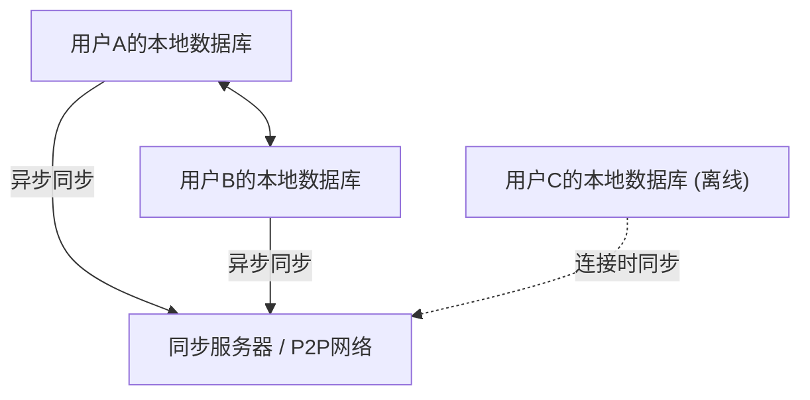
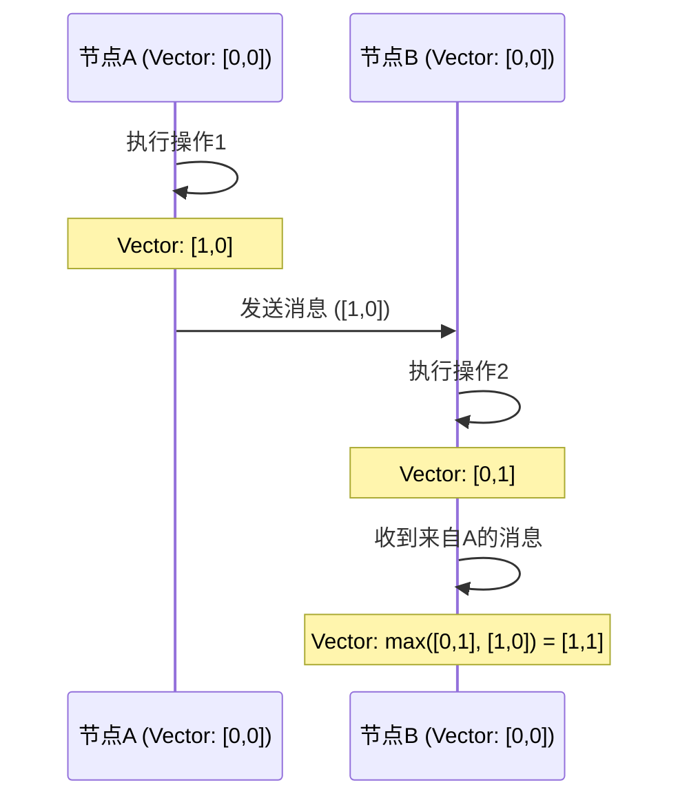

# CRDT与本地优先：离线也能协同编辑的机制

在现代软件开发中，“本地优先（Local-First）”范式正受到广泛关注。传统的云优先应用程序以始终在线的互联网环境为前提，在离线状态或网络不稳定的环境下，用户体验会严重受损。解决这一问题的方法是本地优先软件，而支撑其技术基础的是**CRDT（Conflict-free Replicated Data Type：无冲突复制数据类型）**。

本文将深入探讨CRDT的理论背景，与OT（Operational Transformation）的比较，数学证明，逻辑时钟在分布式系统中的作用，以及使用JavaScript的具体实现示例（Yjs、Automerge）。

## 1. 本地优先软件的时代

本地优先软件（Local-First Software）是一种将主要数据和应用程序逻辑保存在用户设备上，并在网络可用时在后台进行无缝同步的架构。这种方法有以下优点：

*   **完全的离线工作**：不依赖网络连接，随时随地都可以继续工作。
*   **低延迟**：数据读写在本地完成，因此不会产生由于云端通信造成的延迟。
*   **隐私与安全**：数据保存在本地，用户可以完全控制自己的数据。
*   **无缝的协同编辑**：离线进行的更改在上线时，会自动合并，不会与其他用户的更改产生冲突。



实现这种“无冲突自动合并”的就是CRDT。在传统方法中，解决同时编辑的冲突非常困难，但CRDT基于数学基础优雅地解决了这个问题。

## 2. 与OT（Operational Transformation）的区别与局限性

在CRDT出现之前，协同编辑（实时协作）的事实标准是**OT（Operational Transformation：操作转换）**。Google Docs和Etherpad等早期的协同编辑系统都采用了这种OT。

### OT的机制
OT是一种将各用户进行的“操作（Operation）”发送到服务器，服务器对这些操作进行转换（Transform）以保持所有客户端状态一致的方法。
例如，如果用户A在索引1插入“X”，同时用户B在索引1插入“Y”，如果直接应用，状态就会产生矛盾。服务器决定这些操作的顺序，并偏移（转换）后应用的操作索引以防止矛盾。

### OT的局限性
OT是一种强大的技术，但它有一个致命的弱点，那就是作为分布式系统的复杂性极高。
*   **中央集权式服务器的必要性**：为了进行操作的排序和转换，不可避免地需要一个中央服务器（单一事实来源，Single Point of Truth）。它不适合完全的P2P（点对点）通信，或者需要稍后合并离线了数天的设备更改等本地优先的用例。
*   **状态爆炸和算法复杂性**：随着操作类型（插入、删除、格式更改等）的增加，操作之间的组合（转换矩阵）会呈爆炸式增长。在所有组合中正确实现和证明转换函数是极其困难的。

相比之下，CRDT不需要中央服务器，并且具有即使以任意顺序应用操作，最终也会收敛到相同状态（强最终一致性，Strong Eventual Consistency）的特性。

## 3. CRDT的基础理论：数学证明与偏序集

CRDT并不是“不发生冲突的数据结构”。它是“即使发生冲突，也能在事先没有达成共识的情况下，自动且确定地解决的数据结构”。为了实现这一点，CRDT利用了数学特性。

CRDT大致分为**CvRDT（Convergent Replicated Data Type：基于状态）**和**CmRDT（Commutative Replicated Data Type：基于操作）**两种。

### CvRDT（基于状态的CRDT）

CvRDT通过网络发送和接收数据结构的“状态本身”，并使用合并函数（Merge Function）将本地状态和接收到的状态进行整合。
为了使这个合并函数正常工作，数据结构的状态集合必须形成一个**偏序集（Partially Ordered Set / Join Semilattice）**，并且合并函数必须满足以下三个数学特性。

1.  **交换律（Commutativity）**: `merge(A, B) = merge(B, A)`
    *   无论以何种顺序合并状态A和状态B，结果都是相同的。
2.  **结合律（Associativity）**: `merge(merge(A, B), C) = merge(A, merge(B, C))`
    *   在合并三个或更多状态时，无论从哪个组合先开始合并，结果都是相同的。
3.  **幂等性（Idempotence）**: `merge(A, A) = A`
    *   无论多次合并相同状态，结果都不会改变（能够抵抗网络中的重复发送）。

**示例：只增计数器（Grow-Only Counter / G-Counter）**
最简单的CvRDT之一是只能增加的计数器。每个节点都保存其自身的ID和计数值的对（向量）。
状态A: `[Node1: 2, Node2: 1]`
状态B: `[Node1: 2, Node2: 3, Node3: 1]`
合并函数针对每个节点的ID采用最大值（`max()`函数满足交换律、结合律和幂等性）。
结果: `[Node1: 2, Node2: 3, Node3: 1]`

### CmRDT（基于操作的CRDT）

CmRDT将“操作（Operation）”广播到网络，而不是状态。它通过将接收到的操作应用到本地状态来进行同步。
为了使CmRDT成立，网络层必须满足以下条件，或者需要在数据结构方面予以保证。

1.  **操作的可交换性（Commutativity）**: 对于任意两个并行的操作 `op1` 和 `op2`，无论应用顺序如何，结果必须相同。
2.  **精确一次（Exactly-Once）保证**: 保证所有的操作准确地传送一次。但是，通过赋予操作幂等性，也可以在至少一次（At-Least-Once，有重复）的传送情况下工作。
3.  **因果顺序（Causal Ordering）保证**: 如果操作A是操作B的原因，那么在所有的副本中，A必须先于B应用。

CmRDT的优点是通信量小（因为只发送操作的差异），但它依赖于保证因果顺序的消息传递基础设施（如后文所述的Vector Clock等）。

## 4. 分布式系统的时钟：逻辑时钟的重要性

在CRDT中，特别是在协同编辑中的文本排序或CmRDT中因果顺序的保证上，准确把握“何时，执行了哪个操作”是极其重要的。
然而，在分布式系统中，让各设备的物理时钟（Wall-clock time）完全同步是不可能的（即使使用NTP也可能会有几毫秒到几秒的偏差）。

为了解决这个问题，使用的是记录“事件先后关系（因果关系）”的**逻辑时钟（Logical Clock）**，而不是物理时间。

### Lamport Clock (兰伯特时钟)
这是由Leslie Lamport提出的最基础的逻辑时钟。
每个节点保持一个单一的整数值（计数器），并按以下规则更新：
1.  每次在本地发生事件时，计数器加1。
2.  发送消息时，将当前的计数器值包含在消息中。
3.  接收消息时，将其自身的计数器更新为 `max(自身的计数器, 接收到的计数器) + 1`。

由此可以保证因果关系：“如果事件A是事件B的原因，则A的时钟值 < B的时钟值”。但是，无法通过时钟值反推因果关系（并发发生的事件之间的时钟值大小是无意义的）。

### Vector Clock (向量时钟)
弥补了Lamport Clock的缺点，使得可以判定事件之间完全的因果关系（或并发关系）的就是Vector Clock。
它保存的不是单一的计数器，而是系统中所有节点的计数器的数组（向量）。

虽然它有节点数增加时数据量会膨胀的缺点，但它被广泛应用于版本控制系统（如DynamoDB的冲突检测等）。在最近的CRDT算法中，通过使用Vector Clock的变体，或者在数据结构本身中嵌入因果关系（如CRDT的节点间的指针等），来高效地决定顺序。



## 5. JavaScript中的实践：Yjs与Automerge

不仅仅是理论，实际上利用CRDT进行的开发在近年来变得非常容易。在JavaScript生态系统中，成为CRDT事实标准的有两个库：**Yjs**和**Automerge**。

### Yjs：高速的文本与富文本同步

Yjs在性能上极其出色，官方提供了与ProseMirror、Quill、Monaco Editor等众多编辑器的绑定。如果是要构建文本协同编辑（如Google Docs克隆版），Yjs会是首选。

在Yjs内部，数据被表示为扁平的双向链表，每个元素都有一个唯一的ID（客户端ID和逻辑时钟的组合）。由此实现了元素极速的插入和删除。

**使用Yjs的简单实现示例 (Node.js/浏览器)**

```javascript
import * as Y from 'yjs'

// 初始化文档
const doc1 = new Y.Doc()
const doc2 = new Y.Doc()

// 创建共享的文本类型
const text1 = doc1.getText('myText')
const text2 = doc2.getText('myText')

// 用户1插入文本
text1.insert(0, 'Hello ')
console.log('User 1 text:', text1.toString()) // "Hello "

// 状态同步（通常通过WebRTC或WebSocket进行）
// 获取doc1的更改差异（Update）
const updateFromDoc1 = Y.encodeStateAsUpdate(doc1)

// 将更改应用（合并）到用户2的文档中
Y.applyUpdate(doc2, updateFromDoc1)
console.log('User 2 text:', text2.toString()) // "Hello "

// 因同时编辑产生冲突与自动解决
// 用户1和用户2在离线状态下同时进行编辑
text1.insert(6, 'World')
text2.insert(6, 'CRDT')

// 执行同步
const update1 = Y.encodeStateAsUpdate(doc1)
const update2 = Y.encodeStateAsUpdate(doc2)
Y.applyUpdate(doc2, update1)
Y.applyUpdate(doc1, update2)

// 两个节点都会收敛到完全相同的最终状态（强最终一致性）
console.log('Merged User 1 text:', text1.toString()) // "Hello WorldCRDT" 或 "Hello CRDTWorld"
console.log('Merged User 2 text:', text2.toString()) // "Hello WorldCRDT" 或 "Hello CRDTWorld" (与User 1完全一致)
```

Yjs的强大之处在于，即使将这种差异（Update）持久化（保存到IndexedDB等），或者通过P2P网络以任意顺序、在任意时间发送给其他客户端，也能在数学上保证最终状态始终是一致的。

### Automerge：基于JSON的通用状态同步

Automerge是一个专门用于同步类JSON对象结构（嵌套对象、数组、文本）的CRDT库。它与React等前端框架的兼容性很好，适合将整个应用程序的状态（State）进行本地优先化。

Automerge提供不可变（Immutable）的状态管理，由于像Redux那样保留了所有的状态历史记录，因此还可以实现像Git一样的“变更历史时间旅行”和“分支与合并”等高级功能。

**使用Automerge进行JSON对象同步的示例**

```javascript
import * as Automerge from '@automerge/automerge'

// 初始化文档
let doc1 = Automerge.init()

// 对文档的更改（以不可变方式返回新文档）
doc1 = Automerge.change(doc1, 'Initialize todo list', doc => {
  doc.todos = []
  doc.todos.push({ title: 'Buy milk', done: false })
})

// 克隆文档（假设复制到了其他设备）
let doc2 = Automerge.clone(doc1)

// 离线状态下的同时编辑
doc1 = Automerge.change(doc1, 'Mark as done', doc => {
  doc.todos[0].done = true
})

doc2 = Automerge.change(doc2, 'Add another task', doc => {
  doc.todos.push({ title: 'Read a book', done: false })
})

// 恢复在线时的合并
let finalDoc = Automerge.merge(doc1, doc2)

console.log(JSON.stringify(finalDoc.todos, null, 2))
/* 输出结果（两边的更改无冲突地整合在一起）:
[
  {
    "title": "Buy milk",
    "done": true
  },
  {
    "title": "Read a book",
    "done": false
  }
]
*/
```

## 6. 总结与未来展望

CRDT是实现本地优先软件的犹如魔法般的技术。它将我们从中央集权式服务器造成的复杂的冲突解决（OT）中解放出来，并提供了与P2P和边缘计算具有极高亲和力的架构。

另一方面，CRDT也存在一些挑战。
*   **内存和存储的膨胀**：因为需要持续保留更改历史和已删除的元素（Tombstone），文档大小会随着时间的推移而膨胀（关于垃圾回收技术的研究正在进行中）。
*   **非预期的合并结果**：如字符串的交错插入，即使在数学上正确收敛，有时也会生成对人类来说意义不明的字符串。

不过，随着Yjs和Automerge等库的成熟，针对这些挑战的实用权宜之计也正在建立。Figma、Linear、Notion等将用户体验追求到极致的现代应用程序，已经引入了本地优先架构和CRDT的概念。

未来，随着“本地优先”作为Web应用程序的标准架构逐渐确立，CRDT必将成为所有开发者都应该学习的必备范式。
