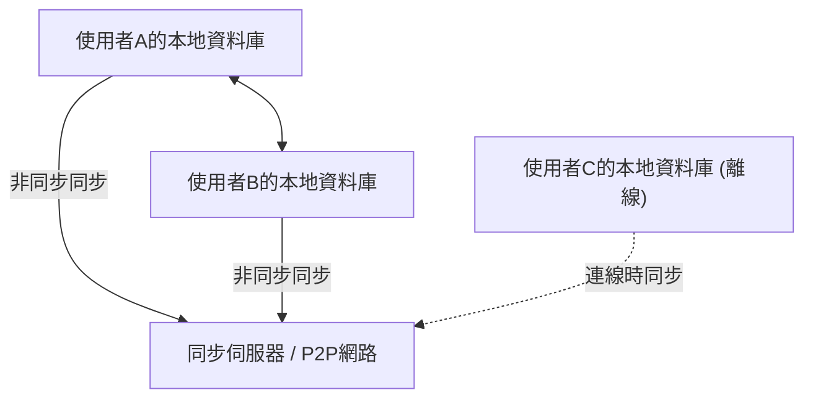
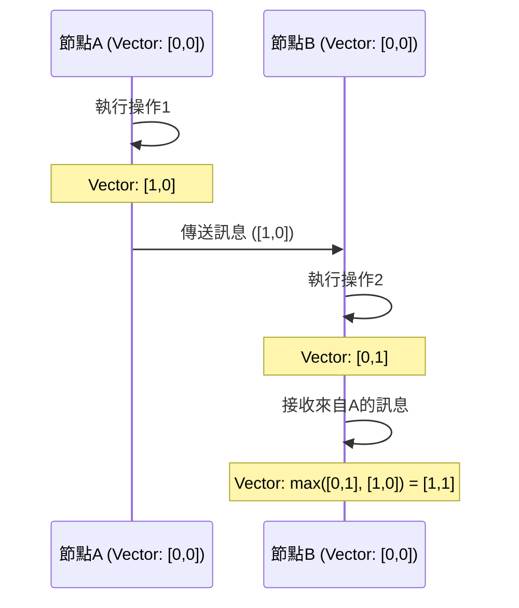

# CRDT與本地優先：離線也能共同編輯的機制

在現代軟體開發中，「本地優先（Local-First）」這個典範正受到極大的關注。傳統的雲端優先應用程式以隨時連線的網際網路環境為前提，面臨著在離線狀態或網路不穩定的環境下，使用者體驗會大幅受損的問題。解決這個問題的方法就是本地優先軟體，而支撐其技術根基的便是**CRDT（Conflict-free Replicated Data Type：無衝突複製資料型別）**。

本文將從CRDT的理論背景開始，與OT（Operational Transformation）進行比較、介紹數學證明、邏輯時鐘在分散式系統中的作用，以及使用JavaScript的具體實作範例（Yjs、Automerge），進行深入的探討與解說。

## 1. 本地優先軟體的時代

本地優先軟體（Local-First Software）是一種架構，將主要資料和應用程式邏輯保存在使用者的裝置上，並在網路連線可用時於背景進行無縫同步。這種方法具有以下優點：

*   **離線時的完整運作**: 不依賴網路連線，可以隨時隨地繼續工作。
*   **低延遲**: 因為資料讀寫完全在本地完成，所以不會發生與雲端通訊造成的延遲。
*   **隱私與安全性**: 因為資料儲存在本地，所以使用者自己可以完全控制資料。
*   **無縫的共同編輯**: 在離線時所做的變更，會在連線上線時自動與其他使用者的變更合併，且不會發生衝突。



實現這種「無衝突自動合併」的就是CRDT。在傳統方法中，解決同時編輯的衝突極其困難，但CRDT基於數學基礎優雅地解決了這個問題。

## 2. 與OT (Operational Transformation) 的差異和極限

在CRDT出現之前，共同編輯（即時協作）的事實標準是**OT（Operational Transformation：操作轉換）**。Google Docs和Etherpad等早期的共同編輯系統都採用了這種OT。

### OT的機制
OT是將每個使用者執行的「操作（Operation）」傳送到伺服器，伺服器轉換（Transform）這些操作，以在所有客戶端保持狀態一致的方法。
例如，如果使用者A在索引1插入「X」，同時使用者B在索引1插入「Y」，直接套用會導致狀態矛盾。伺服器決定這些操作的順序，並將後來套用的操作的索引錯開（轉換），從而防止矛盾。

### OT的極限
OT雖然是一項強大的技術，但其作為分散式系統的複雜性極高，這是個致命的弱點。
*   **中央集權伺服器的必要性**: 必須要有負責排序和轉換操作的中央伺服器（單一事實來源，Single Point of Truth）。它不適合完全的P2P（對等網路）通訊，或事後合併離線數天裝置之變更這類本地優先的使用情境。
*   **狀態爆炸與演算法的複雜性**: 隨著操作種類（插入、刪除、格式變更等）的增加，操作之間的組合（轉換矩陣）會爆炸性地增加。要在所有組合中正確實作並證明轉換函數是極其困難的。

相比之下，CRDT不需要中央伺服器，並且具有即使以任何順序套用操作，最終也會收斂到相同狀態（強最終一致性，Strong Eventual Consistency）的特性。

## 3. CRDT的基礎理論：數學證明與半序集

CRDT並非「不發生衝突的資料結構」，而是「即使發生衝突，也能在沒有事先協議的情況下自動且確定性地解決的資料結構」。為了實現這一點，CRDT利用了數學特性。

CRDT大致分為**CvRDT（Convergent Replicated Data Type：基於狀態）**和**CmRDT（Commutative Replicated Data Type：基於操作）**兩種。

### CvRDT（基於狀態的CRDT）

CvRDT透過網路傳送和接收資料結構的「狀態本身」，並使用合併函數（Merge Function）來整合本地狀態和接收到的狀態。
為了讓這個合併函數正確運作，資料結構狀態的集合必須形成一個**半序集（Partially Ordered Set / Join Semilattice）**，且合併函數必須滿足以下三個數學特性：

1.  **交換律（Commutativity）**: `merge(A, B) = merge(B, A)`
    *   無論以什麼順序合併狀態A和狀態B，結果都是一樣的。
2.  **結合律（Associativity）**: `merge(merge(A, B), C) = merge(A, merge(B, C))`
    *   合併3個以上的狀態時，無論從哪個組合先開始合併，結果都是一樣的。
3.  **冪等性（Idempotence）**: `merge(A, A) = A`
    *   將相同的狀態合併任意次，結果都不會改變（可承受網路的重複傳送）。

**範例：Grow-Only Counter (G-Counter)**
最簡單的CvRDT之一是只增不減的計數器。每個節點保留自己的ID和計數值的配對（向量）。
狀態A: `[Node1: 2, Node2: 1]`
狀態B: `[Node1: 2, Node2: 3, Node3: 1]`
合併函數針對每個節點的ID採用最大值（`max()`函數滿足交換律、結合律和冪等性）。
結果: `[Node1: 2, Node2: 3, Node3: 1]`

### CmRDT（基於操作的CRDT）

CmRDT廣播到網路上的不是狀態，而是「操作（Operation）」。藉由將接收到的操作套用到本地狀態來進行同步。
為了讓CmRDT成立，網路層必須滿足以下條件，或者必須在資料結構端確保：

1.  **操作的可交換性（Commutativity）**: 對於任意兩個並行的操作 `op1` 和 `op2`，無論順序如何，套用結果都必須相同。
2.  **保證精確一次（Exactly-Once）**: 所有的操作都精確地被傳遞一次。不過，藉由賦予操作冪等性，也可以在至少一次（At-Least-Once，有重複）的傳遞中運作。
3.  **保證因果順序（Causal Ordering）**: 如果操作A是操作B的原因，那麼在所有的副本中，A都必須比B先被套用。

CmRDT的優點是通訊量小（因為只傳送操作的差異），但它依賴保證因果順序的訊息傳遞基礎設施（如後述的Vector Clock等）。

## 4. 分散式系統的時鐘：邏輯時鐘的重要性

在CRDT中，特別是在共同編輯時的文字排序，或是CmRDT中保證因果順序方面，準確掌握「何時、執行了什麼操作」是極為重要的。
然而，在分散式系統中，要完全同步各個裝置的實體時鐘（Wall-clock time）是不可能的（即使使用NTP也可能產生幾毫秒到幾秒的誤差）。

為了解決這個問題，使用的是記錄「事件前後關係（因果關係）」的**邏輯時鐘（Logical Clock）**，而不是實體時間。

### Lamport Clock (藍波特時鐘)
這是由Leslie Lamport發明的最基本的邏輯時鐘。
每個節點保持一個單一的整數值（計數器），並根據以下規則進行更新：
1.  每當本地發生事件時，計數器加1。
2.  傳送訊息時，將當前的計數器值包含在訊息中。
3.  接收到訊息時，將自己的計數器更新為 `max(自己的計數器, 接收到的計數器) + 1`。

如此一來，就能保證「如果事件A是事件B的原因，那麼A的時鐘值 < B的時鐘值」的因果關係。但是，無法從時鐘值反推因果關係（平行發生之事件間的時鐘值大小是沒有意義的）。

### Vector Clock (向量時鐘)
Vector Clock彌補了Lamport Clock的弱點，使得能夠判定事件間完整的因果關係（或平行關係）。
它保存的不是單一的計數器，而是系統內所有節點計數器的陣列（向量）。

雖然有著節點數增加會導致資料大小膨脹的缺點，但它廣泛用於版本控制系統（例如DynamoDB的衝突檢測等）。在近期的CRDT演算法中，透過Vector Clock的變體，或者將因果關係嵌入資料結構本身（例如CRDT節點間的指標等），來有效率地決定順序。



## 5. 於JavaScript的實踐：Yjs與Automerge

不僅是理論，近年來實際利用CRDT的開發變得非常容易。在JavaScript生態系中，成為CRDT事實標準的兩個函式庫是**Yjs**和**Automerge**。

### Yjs: 高速的純文字・富文本同步

Yjs在效能上極為優異，且官方提供了與ProseMirror、Quill、Monaco Editor等眾多編輯器的綁定。如果要建構文字的共同編輯（如Google Docs克隆等），Yjs會是首選。

在Yjs內部，資料被表示為扁平的雙向鏈結串列，每個元素都擁有一個唯一的ID（客戶端ID與邏輯時鐘的配對）。這使得元素的插入與刪除能夠極快地進行。

**使用Yjs的簡單實作範例 (Node.js/瀏覽器)**

```javascript
import * as Y from 'yjs'

// 初始化文件
const doc1 = new Y.Doc()
const doc2 = new Y.Doc()

// 建立要共享的文字類型
const text1 = doc1.getText('myText')
const text2 = doc2.getText('myText')

// 使用者1插入文字
text1.insert(0, 'Hello ')
console.log('User 1 text:', text1.toString()) // "Hello "

// 狀態的同步（通常透過WebRTC或WebSocket進行）
// 取得doc1的變更差異（Update）
const updateFromDoc1 = Y.encodeStateAsUpdate(doc1)

// 將變更套用（合併）到使用者2的文件
Y.applyUpdate(doc2, updateFromDoc1)
console.log('User 2 text:', text2.toString()) // "Hello "

// 因同時編輯產生衝突與自動解決
// 使用者1與使用者2在離線狀態下同時編輯
text1.insert(6, 'World')
text2.insert(6, 'CRDT')

// 執行同步
const update1 = Y.encodeStateAsUpdate(doc1)
const update2 = Y.encodeStateAsUpdate(doc2)
Y.applyUpdate(doc2, update1)
Y.applyUpdate(doc1, update2)

// 兩個節點最終會收斂到完全相同的最終狀態（強最終一致性）
console.log('Merged User 1 text:', text1.toString()) // "Hello WorldCRDT" 或 "Hello CRDTWorld"
console.log('Merged User 2 text:', text2.toString()) // "Hello WorldCRDT" 或 "Hello CRDTWorld" (與User 1完全一致)
```

Yjs的強大之處在於，即使將這個差異（Update）持久化（儲存到IndexedDB等），或透過P2P網路以任意順序、任意時間點傳送給另一個客戶端，數學上也能保證最終狀態永遠一致。

### Automerge: 基於JSON的通用狀態同步

Automerge是一個專門用於同步類似JSON的物件結構（巢狀物件、陣列、文字）的CRDT函式庫。它與React等前端框架有很好的相容性，適合將整個應用程式的狀態（State）在地優先化。

Automerge提供不可變（Immutable）的狀態管理，並像Redux一樣保留所有的狀態歷史紀錄，因此也能實作出如Git般的「變更紀錄時間旅行」或「分支的建立與合併」等進階功能。

**使用Automerge的JSON物件同步範例**

```javascript
import * as Automerge from '@automerge/automerge'

// 初始化文件
let doc1 = Automerge.init()

// 對文件的變更（以不可變的方式回傳新文件）
doc1 = Automerge.change(doc1, 'Initialize todo list', doc => {
  doc.todos = []
  doc.todos.push({ title: 'Buy milk', done: false })
})

// 複製文件（假設複製到了另一個裝置）
let doc2 = Automerge.clone(doc1)

// 離線狀態下的同時編輯
doc1 = Automerge.change(doc1, 'Mark as done', doc => {
  doc.todos[0].done = true
})

doc2 = Automerge.change(doc2, 'Add another task', doc => {
  doc.todos.push({ title: 'Read a book', done: false })
})

// 恢復連線時的合併
let finalDoc = Automerge.merge(doc1, doc2)

console.log(JSON.stringify(finalDoc.todos, null, 2))
/* 輸出結果（雙方的變更會無衝突地整合）:
[
  {
    "title": "Buy milk",
    "done": true
  },
  {
    "title": "Read a book",
    "done": false
  }
]
*/
```

## 6. 總結與未來展望

CRDT是實現本地優先軟體般魔法的技術。它將我們從仰賴中央集權伺服器進行複雜衝突解決（OT）中解放出來，並提供了與P2P和邊緣運算親和力極高的架構。

另一方面，CRDT也存在一些挑戰。
*   **記憶體與儲存空間的膨脹**: 因為必須持續保留變更歷史紀錄和被刪除的元素（Tombstone），文件的大小會隨著時間膨脹（垃圾回收技術的研究正在進行中）。
*   **非預期的合併結果**: 例如字串的交錯（Interleave）等，即使在數學上能正確收斂，有時也會產生人類無法理解的字串。

然而，隨著Yjs和Automerge等函式庫的成熟，針對這些挑戰的實用應對方案也正在整備中。Figma、Linear、Notion等追求極致使用者體驗的現代應用程式，已經引入了本地優先的架構與CRDT的概念。

今後，隨著「本地優先」成為Web應用程式標準架構並逐漸普及，CRDT將會成為所有開發者都必須學習的重要典範。
