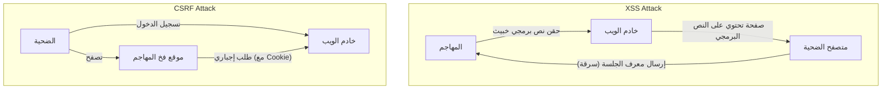

## مقدمة

في تطبيقات الويب الحديثة، لا يعد الأمان مجرد ميزة إضافية، بل هو أحد أهم العناصر التي تشكل أساس النظام. من بين هذه العناصر، تعد **XSS (Cross-Site Scripting)** و **CSRF (Cross-Site Request Forgery)** ثغرات أمنية خطيرة لها تاريخ طويل ولا تزال تكتشف في العديد من تطبيقات الويب. غالبا ما يتم الخلط بينهما، لكن آلية الهجوم واستراتيجيات الدفاع ضدهما مختلفة جذريا.

في هذه المقالة، سنكشف عن الاختلافات الجوهرية بين XSS و CSRF، وكيف يستغل المهاجمون هذه الثغرات، وسنشرح بالتفصيل مع التطور التاريخي استراتيجيات الدفاع الحديثة التي يجب على المطورين تنفيذها.

---

## 1. العمق في XSS (Cross-Site Scripting)

XSS هي تقنية هجوم يقوم فيها المهاجم بحقن نصوص برمجية خبيثة (غالبا JavaScript) في صفحة ويب، ويجعل هذه النصوص تعمل في متصفحات المستخدمين الآخرين الذين يزورون تلك الصفحة. يكمن جوهر هذا الهجوم في "تفسير البيانات غير الموثوقة ككود قابل للتنفيذ دون الخضوع لمعالجة مناسبة".

### 3 أنواع رئيسية لـ XSS

يصنف XSS بشكل رئيسي إلى ثلاثة أنواع بناء على كيفية حقن النصوص البرمجية الخبيثة وتنفيذها في التطبيق.

#### 1. Stored XSS (XSS المخزن)
يعد Stored XSS أخطر أنواع XSS. يتم حفظ (تخزين) النصوص البرمجية الخبيثة المرسلة من قبل المهاجم بشكل دائم على جانب الخادم، مثل قاعدة البيانات أو نظام الملفات. لاحقا، عندما يزور مستخدم شرعي صفحة تحتوي على تلك البيانات، يتم إرسال النص البرمجي المخزن إلى المتصفح وتنفيذه.
*   **أماكن الحدوث النموذجية:** أقسام التعليقات، لوحات الرسائل، ملفات تعريف المستخدمين، ميزات المراجعة، وغيرها.
*   **التهديد:** نطاق التأثير واسع جدا، وقد يقع جميع المستخدمين الذين يفتحون الصفحة ضحية له.

#### 2. Reflected XSS (XSS المنعكس)
يحدث Reflected XSS عندما يتم إرسال نصوص برمجية خبيثة كجزء من الطلب (مثل معلمات URL أو بيانات النماذج) دون حفظها على الخادم، وتكون مضمنة كما هي "منعكسة" في استجابة الخادم.
*   **أماكن الحدوث النموذجية:** صفحات نتائج البحث، عرض رسائل الخطأ، تمرير البيانات بين الخطوات، وغيرها.
*   **طريقة الهجوم:** يكمل المهاجمون الهجوم عن طريق جعل المستخدمين ينقرون على عنوان URL يحتوي على معلمات خبيثة (باستخدام رسائل التصيد الاحتيالي أو وسائل التواصل الاجتماعي).

#### 3. DOM-based XSS
يحدث DOM-based XSS عندما تتعامل JavaScript على جانب العميل (في المتصفح) مع DOM (Document Object Model) بشكل غير صحيح، دون المرور عبر معالجة جانب الخادم.
*   **الآلية:** يحدث عندما يقرأ JavaScript في التطبيق بيانات من مصادر يمكن للمهاجم التحكم فيها مثل `window.location` أو `document.referrer` ويمررها مباشرة إلى نقاط تنفيذ خطيرة (Sinks) مثل `innerHTML` أو `eval()`.
*   **التهديد:** غالبا ما لا يترك أثرا في سجلات الخادم، مما يجعل من الصعب اكتشافه بواسطة WAF (Web Application Firewall) وغيره.

### الأضرار الناتجة عن XSS وأساليب تنفيذ النصوص داخل السياق

بمجرد نجاح XSS، يتم تنفيذ نصوص المهاجم في متصفح المستخدم بنفس الأصل (الصلاحية) مثل موقع الويب نفسه. يؤدي هذا إلى أضرار جسيمة كما يلي:

1.  **اختطاف الجلسة (Session Hijacking):** الوصول إلى `document.cookie` لسرقة معرف الجلسة وإرساله إلى خادم المهاجم. يتيح ذلك للمهاجم انتحال شخصية المستخدم والسيطرة على الحساب.
2.  **تنفيذ عمليات غير مصرح بها:** تنفيذ أي عملية في التطبيق (مثل تغيير كلمة المرور، تحويل الأموال، إرسال رسائل) في الخلفية بصلاحيات المستخدم.
3.  **التصيد الاحتيالي (Phishing):** رسم نموذج تسجيل دخول مزيف على DOM لسرقة بيانات اعتماد المستخدم مباشرة.
4.  **توزيع البرامج الضارة:** إعادة توجيه متصفح المستخدم إلى مجموعة استغلال (Exploit Kit) وإصابة جهاز الكمبيوتر ببرامج ضارة.

### استراتيجيات الدفاع الحديثة ضد XSS

لمنع XSS، لا غنى عن نهج الدفاع المتعمق (Defense in Depth).

#### 1. الهروب وفقا للسياق (Output Encoding)
أهم وأبسط إجراء مضاد هو عملية الهروب (التشفير) لتحويل إدخال المستخدم إلى سلاسل غير ضارة عند إخراجها إلى صفحة الويب. الشيء المهم هو اختيار طريقة الهروب المناسبة بناء على **السياق الذي يتم إخراج البيانات فيه (نص HTML، سمات HTML، داخل JavaScript، داخل CSS، داخل URL، إلخ)**. تقوم العديد من أطر عمل الويب الحديثة (React، Vue، Angular، إلخ) بالهروب من HTML افتراضيا، ولكن لا يزال الحذر مطلوبا.

#### 2. إدخال CSP (Content Security Policy)
CSP هو آلية دفاع قوية جدا ضد XSS، حيث يحدد قائمة بيضاء للموارد التي يسمح المتصفح بتحميلها وتنفيذها باستخدام ترويسة HTTP.
```http
Content-Security-Policy: default-src 'self'; script-src 'self' https://trusted.cdn.com;
```
بفضل هذا، حتى لو تمكن المهاجم من حقن نص برمجي مضمن `<script>alert(1)</script>`، فسيتم حظر تنفيذه بواسطة CSP.

#### 3. استخدام سمة HttpOnly للـ Cookie
من خلال إضافة سمة `HttpOnly` إلى الـ Cookie التي تخزن معرفات الجلسة وغيرها، لن تتمكن JavaScript (مثل `document.cookie`) من الوصول إلى تلك الـ Cookie. هذا لا يمنع حدوث XSS بحد ذاته، ولكنه إجراء تخفيف مهم يقلل بشكل كبير من خطر اختطاف الجلسة بسبب XSS.

---

## 2. جوهر CSRF (Cross-Site Request Forgery)

CSRF هو هجوم يوجه فيه المهاجم المستخدم إلى موقع فخ، ويجبره على إرسال طلب غير مقصود إلى موقع ويب آخر قام المستخدم بتسجيل الدخول إليه (مصدق عليه) بالفعل.

الفرق الحاسم هو أن XSS "يجعل المتصفح ينفذ نصوصا غير مصرح بها"، بينما CSRF "يستغل السلوك القياسي للمتصفح (الإرسال التلقائي للـ Cookie) لإرسال طلبات غير مصرح بها".

### آلية CSRF: استغلال "الإرسال التلقائي للـ Cookie"

عندما يرسل المتصفح طلبا إلى نطاق معين، فإنه يقوم تلقائيا بإرفاق الـ Cookie المرتبطة بذلك النطاق (مثل Cookie الجلسة) في الترويسة وإرسالها. هذا ينطبق حتى لو كان الطلب من علامة صورة أو نموذج موجود في نطاق آخر (موقع المهاجم).

**سيناريو الهجوم:**
1.  يسجل المستخدم الدخول إلى موقع البنك (`bank.example.com`) ويتلقى Cookie الجلسة.
2.  يتصفح المستخدم موقع فخ المهاجم (`attacker.example.com`) في علامة تبويب أخرى.
3.  يحتوي موقع الفخ على نموذج مخفي ونص برمجي للإرسال التلقائي كما يلي:
    ```html
    <form action="https://bank.example.com/transfer" method="POST" id="csrf-form">
        <input type="hidden" name="toAccount" value="ATTACKER_ACCOUNT">
        <input type="hidden" name="amount" value="1000000">
    </form>
    <script>document.getElementById('csrf-form').submit();</script>
    ```
4.  يرسل المتصفح طلب POST إلى `bank.example.com`. في هذا الوقت، **يتم إرفاق Cookie الجلسة لموقع البنك تلقائيا.**
5.  نظرا لأن الطلب يحتوي على Cookie الجلسة الشرعية، يعالجه خادم البنك كطلب من مستخدم شرعي، ويتم تنفيذ التحويل غير المصرح به.

### التطور التاريخي وأحدث الممارسات للدفاع ضد CSRF

لمنع CSRF، من الضروري التحقق مما إذا كان الطلب "قد تم إرساله من الصفحة الشرعية المقصودة".

#### 1. رموز CSRF (Anti-CSRF Tokens): دفاع تقليدي وموثوق
أكثر تدابير الدفاع أمانا والمستخدمة على نطاق واسع منذ فترة طويلة هو رمز CSRF (نمط Synchronizer Token Pattern).
*   يقوم الخادم بإنشاء رمز عشوائي غير متوقع لكل جلسة، ويحفظه على جانب الخادم (مثل داخل الجلسة).
*   يتم تضمين هذا الرمز كحقل مخفي (hidden) في نموذج HTML المرسل إلى العميل.
*   عند إرسال النموذج، يقارن الخادم الرمز المرسل مع الرمز المحفوظ على الخادم، ويعالج الطلب فقط إذا تطابقا.
حتى لو تمكن المهاجم من إجبار المستخدم على إرسال طلب من موقع الفخ، فإنه لا يستطيع قراءة الصفحة المستهدفة للحصول على الرمز الصحيح (بسبب Same-Origin Policy)، وبالتالي يفشل الهجوم.

#### 2. نمط Double Submit Cookie
إنها تقنية تستخدم غالبا في واجهات برمجة التطبيقات (APIs) التي لا تحتفظ بحالة (الجلسة) على جانب الخادم.
*   يولد الخادم رمزا عشوائيا ويرسله إلى العميل كـ Cookie.
*   تقرأ JavaScript الخاصة بالعميل قيمة تلك الـ Cookie، وتعينها في ترويسة الطلب (مثال: `X-CSRF-Token`) وترسلها.
*   يتحقق الخادم مما إذا كانت قيمة الرمز في الـ Cookie تتطابق مع قيمة الرمز في الترويسة.
يمكن للمهاجم جعل الـ Cookie ترسل تلقائيا، لكنه لا يستطيع استخدام JavaScript لقراءة Cookie لنطاق مختلف وتعيينها في الترويسة، وبالتالي يمكن منعه.

#### 3. سمة SameSite للـ Cookie: دفاع قوي من المتصفحات الحديثة
في السنوات الأخيرة، الإجراء الدفاعي القوي والموصى به بشدة هو سمة `SameSite` للـ Cookie. تتحكم هذه السمة في سلوك إرسال الـ Cookie أثناء الطلبات عبر المواقع.

*   `SameSite=Strict`: لن يتم إرسال الـ Cookie في أي طلب عبر المواقع، بما في ذلك التنقل في المستوى الأعلى مثل النقر فوق الروابط. إنه الخيار الأكثر أمانا، ولكنه قد يؤثر على تجربة المستخدم (UX)، مثل عدم الحفاظ على حالة تسجيل الدخول من الروابط الموجودة على مواقع أخرى.
*   `SameSite=Lax`: لن يتم إرسال الـ Cookie للطلبات عبر المواقع مثل تحميل الصور أو طلبات POST، ولكن سيتم إرسالها للتنقل في المستوى الأعلى من خلال النقر فوق الروابط (طلبات GET). هذا هو السلوك الافتراضي الحالي للعديد من المتصفحات. يمكن لهذا منع معظم هجمات CSRF الناتجة عن إرسال نماذج POST الخبيثة.
*   `SameSite=None`: سيتم إرسال الـ Cookie دائما، حتى للطلبات عبر المواقع. (يجب تحديده دائما مع سمة `Secure`).

من خلال تعيين سمة SameSite بشكل مناسب، يمكن حظر السبب الجذري لـ CSRF (الإرسال التلقائي للـ Cookie) على مستوى المتصفح.

---

## العلاقة المتبادلة بين XSS و CSRF والخلاصة

يوضح المخطط التالي الفرق في مسار الهجوم.



XSS و CSRF هما ثغرتان مختلفتان، ولكن **إذا كان XSS موجودا، فسيتم إبطال معظم إجراءات مكافحة CSRF**. وذلك لأن النصوص البرمجية المنفذة عن طريق XSS تعمل داخل الصفحة الشرعية، لذلك من الممكن قراءة رموز CSRF وإرسال طلبات من نفس الأصل.

لذلك، لضمان أمان تطبيقات الويب، يلزم بناء أساس قوي من خلال احتواء XSS تماما أولا (عن طريق الهروب المناسب و CSP)، ثم تنفيذ إجراءات مكافحة CSRF (مثل SameSite Cookie ورموز CSRF).

من المهم للمطورين عدم الثقة المفرطة في ميزات الأمان التي توفرها أطر العمل، وفهم الآلية الجوهرية لهذه الثغرات، وتصميم الدفاعات في الطبقات المناسبة.
