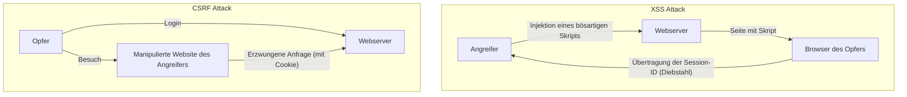

## Einführung

In modernen Webanwendungen ist Sicherheit nicht nur ein zusätzliches Feature, sondern eines der wichtigsten Elemente, das die Grundlage des Systems bildet. Darunter sind **XSS (Cross-Site Scripting)** und **CSRF (Cross-Site Request Forgery)** schwerwiegende Schwachstellen, die eine lange Geschichte haben und immer noch in vielen Webanwendungen gefunden werden. Diese werden oft verwechselt, aber die Mechanismen der Angriffe und die Abwehrmaßnahmen dagegen sind grundlegend verschieden.

In diesem Artikel werden wir die wesentlichen Unterschiede zwischen XSS und CSRF aufklären, im Detail erläutern, wie Angreifer diese Schwachstellen ausnutzen, und die modernen Abwehrmaßnahmen, die Entwickler implementieren sollten, zusammen mit ihrer historischen Entwicklung erklären.

---

## 1. Die Tiefe von XSS (Cross-Site Scripting)

XSS ist eine Angriffsmethode, bei der ein Angreifer ein bösartiges Skript (hauptsächlich JavaScript) in eine Webseite injiziert und dieses Skript im Browser anderer Benutzer ausführen lässt, die diese Seite betrachten. Der Kern dieses Angriffs liegt darin, dass "nicht vertrauenswürdige Daten ohne angemessene Verarbeitung als ausführbarer Code interpretiert werden".

### 3 Haupttypen von XSS

XSS wird grob in drei Typen unterteilt, je nachdem, wie das bösartige Skript in die Anwendung injiziert und ausgeführt wird.

#### 1. Stored XSS (Gespeichertes XSS)
Stored XSS ist die gefährlichste Art von XSS. Das vom Angreifer gesendete bösartige Skript wird dauerhaft auf der Serverseite, wie z.B. in einer Datenbank oder einem Dateisystem, gespeichert (akkumuliert). Wenn dann ein legitimer Benutzer eine Seite mit diesen Daten betrachtet, wird das gespeicherte Skript an den Browser gesendet und ausgeführt.
*   **Typische Orte des Auftretens:** Kommentarbereiche, Foren, Benutzerprofile, Bewertungsfunktionen usw.
*   **Bedrohung:** Der Wirkungsbereich ist sehr groß und alle Benutzer, die die Seite öffnen, können Opfer werden.

#### 2. Reflected XSS (Reflektiertes XSS)
Reflected XSS tritt auf, wenn ein bösartiges Skript als Teil einer Anfrage (wie URL-Parameter oder Formulardaten) gesendet wird, ohne auf dem Server gespeichert zu werden, und dann in die Antwort vom Server unverändert "reflektiert" wird.
*   **Typische Orte des Auftretens:** Suchergebnisseiten, Anzeige von Fehlermeldungen, Datenübergabe zwischen Schritten usw.
*   **Angriffsmethode:** Der Angreifer bringt den Benutzer dazu, auf eine URL mit bösartigen Parametern zu klicken (über Phishing-E-Mails oder soziale Netzwerke), um den Angriff durchzuführen.

#### 3. DOM-based XSS
DOM-based XSS tritt auf, wenn clientseitiges (im Browser ausgeführtes) JavaScript das DOM (Document Object Model) unsachgemäß manipuliert, ohne über die serverseitige Verarbeitung zu gehen.
*   **Mechanismus:** Tritt auf, wenn das JavaScript der Anwendung Daten aus Quellen liest, die vom Angreifer kontrolliert werden können, wie `window.location` oder `document.referrer`, und diese direkt an gefährliche Senken (Ausführungspunkte) wie `innerHTML` oder `eval()` weitergibt.
*   **Bedrohung:** Es bleibt oft nicht in Server-Protokollen und kann von einer WAF (Web Application Firewall) nur schwer erkannt werden.

### Schäden durch XSS und Methoden der Skriptausführung im Kontext

Wenn XSS erfolgreich ist, wird das Skript des Angreifers im Browser des Benutzers unter demselben Ursprung (Rechten) wie die Website ausgeführt. Dies führt zu schwerwiegenden Schäden wie:

1.  **Session Hijacking:** Zugriff auf `document.cookie`, um die Session-ID zu stehlen und an den Server des Angreifers zu senden. Dadurch kann der Angreifer sich als der Benutzer ausgeben und das Konto übernehmen.
2.  **Ausführung unbefugter Aktionen:** Beliebige Aktionen innerhalb der Anwendung (Passwortänderung, Geldüberweisung, Nachrichtenversand usw.) im Hintergrund mit den Rechten des Benutzers ausführen lassen.
3.  **Phishing:** Rendern eines gefälschten Anmeldeformulars im DOM, um direkt die Anmeldeinformationen des Benutzers zu stehlen.
4.  **Verbreitung von Malware:** Den Browser des Benutzers zu einem Exploit-Kit umleiten und den PC mit Malware infizieren.

### Moderne Verteidigungsmaßnahmen gegen XSS

Um XSS zu verhindern, ist ein mehrstufiger Verteidigungsansatz (Defense in Depth) unerlässlich.

#### 1. Kontextbezogenes Escaping (Output Encoding)
Die grundlegendste und wichtigste Maßnahme ist das Escaping (Encoding), das Benutzereingaben in harmlose Zeichenfolgen umwandelt, wenn sie auf einer Webseite ausgegeben werden. Wichtig ist, die geeignete Escaping-Methode abhängig vom **Kontext (HTML-Text, HTML-Attribute, in JavaScript, in CSS, in URLs usw.)**, in dem die Daten ausgegeben werden, auszuwählen. Viele moderne Web-Frameworks (React, Vue, Angular usw.) führen standardmäßig HTML-Escaping durch, aber dennoch ist Vorsicht geboten.

#### 2. Einführung von CSP (Content Security Policy)
CSP ist ein sehr starker Abwehrmechanismus gegen XSS, der eine Whitelist der Ressourcen definiert, die der Browser laden und ausführen darf, über HTTP-Header.
```http
Content-Security-Policy: default-src 'self'; script-src 'self' https://trusted.cdn.com;
```
Dadurch wird selbst dann, wenn ein Angreifer erfolgreich ein Inline-Skript wie `<script>alert(1)</script>` injiziert, die Ausführung durch CSP blockiert.

#### 3. Nutzung des HttpOnly Cookie-Attributs
Durch das Hinzufügen des `HttpOnly`-Attributs zu Cookies, die Session-IDs etc. speichern, können diese Cookies nicht mehr aus JavaScript (z.B. `document.cookie`) aufgerufen werden. Dies verhindert nicht das Auftreten von XSS an sich, ist aber eine wichtige Schadensbegrenzungsmaßnahme, die das Risiko von Session Hijacking durch XSS erheblich verringert.

---

## 2. Das Wesen von CSRF (Cross-Site Request Forgery)

CSRF ist ein Angriff, bei dem ein Angreifer einen Benutzer auf eine manipulierte Website lockt und diesen zwingt, unbeabsichtigt eine Anfrage an eine andere Website zu senden, bei der der Benutzer bereits authentifiziert (eingeloggt) ist.

Während XSS "bösartige Skripte im Browser ausführt", unterscheidet sich CSRF grundlegend darin, dass es "das Standardverhalten des Browsers (das automatische Senden von Cookies) ausnutzt, um unautorisierte Anfragen zu senden".

### CSRF-Mechanismus: Die Ausnutzung des "automatischen Sendens von Cookies"

Wenn ein Browser eine Anfrage an eine Domain sendet, hängt er automatisch die mit dieser Domain verbundenen Cookies (wie z.B. Session-Cookies) an den Header an. Dies gilt auch für Anfragen von Bild-Tags oder Formularen, die auf einer anderen Domain (der Website des Angreifers) platziert sind.

**Angriffsszenario:**
1.  Der Benutzer loggt sich auf der Bank-Website (`bank.example.com`) ein und erhält ein Session-Cookie.
2.  Der Benutzer besucht in einem anderen Tab die manipulierte Website des Angreifers (`attacker.example.com`).
3.  Die manipulierte Website enthält ein verstecktes Formular und ein Skript zur automatischen Übermittlung, wie im Folgenden dargestellt:
    ```html
    <form action="https://bank.example.com/transfer" method="POST" id="csrf-form">
        <input type="hidden" name="toAccount" value="ATTACKER_ACCOUNT">
        <input type="hidden" name="amount" value="1000000">
    </form>
    <script>document.getElementById('csrf-form').submit();</script>
    ```
4.  Der Browser sendet eine POST-Anfrage an `bank.example.com`. Zu diesem Zeitpunkt **wird das Session-Cookie der Bank-Website automatisch angehängt.**
5.  Da ein gültiges Session-Cookie enthalten ist, verarbeitet der Bank-Server die Anfrage als von einem legitimen Benutzer kommend und führt die illegale Überweisung durch.

### Historische Entwicklung und neueste Praktiken der Verteidigungsmaßnahmen gegen CSRF

Um CSRF zu verhindern, muss überprüft werden, ob eine Anfrage "von der beabsichtigten, legitimen Seite gesendet wurde".

#### 1. CSRF-Token (Anti-CSRF Tokens) : Traditionelle und zuverlässige Verteidigung
Die älteste und am weitesten verbreitete zuverlässige Verteidigungsmaßnahme ist das CSRF-Token (Synchronizer Token Pattern).
*   Der Server generiert pro Session ein unvorhersehbares zufälliges Token und speichert es auf der Serverseite (z.B. in der Session).
*   Dieses Token wird als hidden-Feld in das an den Client gesendete HTML-Formular eingebettet.
*   Beim Absenden des Formulars vergleicht der Server das gesendete Token mit dem serverseitig gespeicherten Token und verarbeitet die Anfrage nur bei Übereinstimmung.
Obwohl der Angreifer eine Anfrage von seiner manipulierten Website auslösen kann, schlägt der Angriff fehl, da er die Zielseite nicht lesen und das korrekte Token nicht abrufen kann (aufgrund der Same-Origin Policy).

#### 2. Double Submit Cookie Pattern
Eine Methode, die oft in zustandslosen APIs (ohne Session auf der Serverseite) verwendet wird.
*   Der Server generiert ein zufälliges Token und sendet es als Cookie an den Client.
*   Das JavaScript des Clients liest den Wert dieses Cookies und setzt ihn im Anfrage-Header (z.B. `X-CSRF-Token`), bevor es gesendet wird.
*   Der Server überprüft, ob der Token-Wert im Cookie mit dem Token-Wert im Header übereinstimmt.
Der Angreifer kann zwar das automatische Senden des Cookies erzwingen, aber er kann das Cookie einer anderen Domain nicht mit JavaScript lesen, um es im Header zu setzen, wodurch der Angriff verhindert wird.

#### 3. SameSite Cookie-Attribut : Starke Verteidigung durch moderne Browser
In den letzten Jahren ist die am meisten empfohlene starke Verteidigungsmaßnahme das `SameSite`-Attribut von Cookies. Dies steuert das Verhalten beim Senden von Cookies bei Cross-Site-Anfragen.

*   `SameSite=Strict`: Cookies werden bei keinen Cross-Site-Anfragen gesendet, einschließlich Top-Level-Navigationen wie dem Klicken auf Links. Es ist am sichersten, kann sich aber auf die UX auswirken, wie z.B. das Nicht-Aufrechterhalten des Login-Status über Links von anderen Websites.
*   `SameSite=Lax`: Cookies werden bei Cross-Site-Anfragen wie dem Laden von Bildern oder POST-Anfragen nicht gesendet, aber bei Top-Level-Navigationen durch Klicks auf Links (GET-Anfragen). Dies ist das aktuelle Standardverhalten vieler Browser. Dadurch kann der Großteil von CSRF durch böswillige POST-Formular-Übermittlungen verhindert werden.
*   `SameSite=None`: Cookies werden auch bei Cross-Site-Anfragen immer gesendet. (Muss immer in Kombination mit dem `Secure`-Attribut angegeben werden).

Durch das richtige Setzen des SameSite-Attributs kann die grundlegende Ursache von CSRF (das automatische Senden von Cookies) auf Browser-Ebene blockiert werden.

---

## Korrelation zwischen XSS und CSRF und Zusammenfassung

Das folgende Diagramm zeigt die Unterschiede im Ablauf der Angriffe.



XSS und CSRF sind unterschiedliche Schwachstellen, aber **wenn XSS vorhanden ist, werden die meisten CSRF-Gegenmaßnahmen wirkungslos**. Dies liegt daran, dass das durch XSS ausgeführte Skript innerhalb einer legitimen Seite läuft, wodurch es möglich ist, CSRF-Tokens zu lesen oder Anfragen vom selben Ursprung zu senden.

Daher ist es zur Gewährleistung der Sicherheit einer Webanwendung erforderlich, eine starke Grundlage zu schaffen, indem zunächst XSS gründlich eingedämmt wird (durch angemessenes Escaping und CSP) und anschließend CSRF-Gegenmaßnahmen (SameSite-Cookies und CSRF-Tokens) implementiert werden.

Es ist wichtig, dass Entwickler sich nicht blind auf die von Frameworks bereitgestellten Sicherheitsfunktionen verlassen, sondern die wesentlichen Mechanismen dieser Schwachstellen verstehen und auf der entsprechenden Ebene eine geeignete Verteidigung entwerfen.
