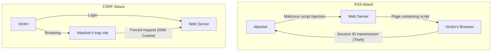

## Introduction

In modern web applications, security is not just an add-on feature, but one of the most important elements that form the foundation of the system. Among them, **XSS (Cross-Site Scripting)** and **CSRF (Cross-Site Request Forgery)** are serious vulnerabilities that have a long history and are still found in many web applications. They are often confused, but their attack mechanisms and the defense measures against them are fundamentally different.

In this article, we will unravel the essential differences between XSS and CSRF, detail how attackers exploit these vulnerabilities, and explain the modern defense measures that developers should implement, along with their historical evolution.

---

## 1. The Depths of XSS (Cross-Site Scripting)

XSS is an attack technique in which an attacker injects malicious scripts (mainly JavaScript) into a web page and has them executed on the browsers of other users who view that page. The essence of this attack lies in "untrusted data being interpreted as executable code without going through appropriate processing."

### Three Major Types of XSS

XSS is broadly classified into three types depending on how the malicious script is injected and executed in the application.

#### 1. Stored XSS (Persistent XSS)
Stored XSS is the most dangerous type of XSS. A malicious script sent by an attacker is permanently stored (accumulated) on the server side, such as in a database or file system. Later, when a legitimate user views a page containing that data, the stored script is sent to the browser and executed.
*   **Typical occurrences:** Comment sections, bulletin boards, user profiles, review features, etc.
*   **Threat:** The scope of impact is very wide, and all users who open the page can be victimized.

#### 2. Reflected XSS (Non-Persistent XSS)
Reflected XSS occurs when a malicious script is not stored on the server, but is sent as part of a request (such as URL parameters or form data) and is included "reflected" as is in the response from the server.
*   **Typical occurrences:** Search result pages, error message displays, data passing between steps, etc.
*   **Attack method:** The attacker completes the attack by tricking the user into clicking a URL containing malicious parameters (using phishing emails or SNS).

#### 3. DOM-based XSS
DOM-based XSS occurs when client-side (in-browser) JavaScript improperly manipulates the DOM (Document Object Model) without going through server-side processing.
*   **Mechanism:** It occurs when application JavaScript reads data from attacker-controllable sources like `window.location` or `document.referrer`, and passes it directly to dangerous sinks (execution points) like `innerHTML` or `eval()`.
*   **Threat:** It often does not leave a trace in server logs and can be difficult for WAFs (Web Application Firewalls) to detect.

### Damage Caused by XSS and In-Context Script Execution Techniques

When XSS succeeds, the attacker's script executes on the user's browser with the same origin (privileges) as the website. This results in severe damage such as the following:

1.  **Session Hijacking:** Accessing `document.cookie` to steal the session ID and sending it to the attacker's server. This allows the attacker to impersonate the user and hijack their account.
2.  **Execution of Unauthorized Operations:** Having arbitrary operations within the application (password changes, money transfers, message sending, etc.) executed in the background with the user's privileges.
3.  **Phishing:** Rendering a fake login form on the DOM to steal the user's credentials directly.
4.  **Malware Distribution:** Redirecting the user's browser to an exploit kit and infecting the PC with malware.

### Modern Defenses Against XSS

To prevent XSS, a Defense in Depth approach is essential.

#### 1. Context-Aware Escaping (Output Encoding)
The most basic and important countermeasure is escaping (encoding) processing that converts user input into harmless strings when outputting it to a web page. The important thing is to select the appropriate escaping method according to the **context where the data is output (HTML body, HTML attributes, inside JavaScript, inside CSS, inside URLs, etc.)**. Many modern web frameworks (React, Vue, Angular, etc.) perform HTML escaping by default, but caution is still required.

#### 2. Introduction of CSP (Content Security Policy)
CSP is an extremely powerful defense mechanism against XSS, defining a whitelist of resources that the browser is allowed to load and execute via HTTP headers.
```http
Content-Security-Policy: default-src 'self'; script-src 'self' https://trusted.cdn.com;
```
As a result, even if an attacker manages to inject an inline script `<script>alert(1)</script>`, its execution will be blocked by CSP.

#### 3. Utilizing the HttpOnly Cookie Attribute
By adding the `HttpOnly` attribute to Cookies that store session IDs and the like, they can no longer be accessed from JavaScript (e.g., `document.cookie`). While this does not prevent XSS itself from occurring, it is an important mitigation that significantly reduces the risk of session hijacking via XSS.

---

## 2. The Essence of CSRF (Cross-Site Request Forgery)

CSRF is an attack in which an attacker lures a user to a trap site and forces them to send an unintended request to another website where the user is already authenticated (logged in).

While XSS is "executing unauthorized scripts within the browser," CSRF is fundamentally different in that it is "exploiting the standard behavior of the browser (automatic transmission of Cookies) to send unauthorized requests."

### CSRF Mechanism: Exploiting "Automatic Transmission of Cookies"

When a browser sends a request to a certain domain, it automatically attaches Cookies (such as session Cookies) associated with that domain to the header and sends them. This applies even to requests from image tags or forms placed on different domains (attacker's sites).

**Attack Scenario:**
1.  The user logs in to a bank site (`bank.example.com`) and receives a session Cookie.
2.  The user browses an attacker's trap site (`attacker.example.com`) in another tab.
3.  The trap site contains a hidden form and an auto-submit script like the following:
    ```html
    <form action="https://bank.example.com/transfer" method="POST" id="csrf-form">
        <input type="hidden" name="toAccount" value="ATTACKER_ACCOUNT">
        <input type="hidden" name="amount" value="1000000">
    </form>
    <script>document.getElementById('csrf-form').submit();</script>
    ```
4.  The browser sends a POST request to `bank.example.com`. At this time, **the session Cookie for the bank site is automatically attached.**
5.  Since the request contains a valid session Cookie, the bank server processes it as a request from a legitimate user, and an unauthorized money transfer is executed.

### Historical Evolution of Defenses Against CSRF and Latest Practices

To prevent CSRF, it is necessary to verify whether the request "was sent from an intended, legitimate page."

#### 1. CSRF Tokens (Anti-CSRF Tokens): Traditional and Reliable Defense
The most reliable defense that has been widely used for a long time is the CSRF token (Synchronizer Token Pattern).
*   The server generates an unpredictable random token for each session and stores it on the server side (in the session, etc.).
*   This token is embedded as a hidden field in the HTML form sent to the client.
*   Upon form submission, the server compares the token sent with the token stored on the server side, and processes the request only if they match.
While attackers can force requests from trap sites, they cannot read the target site's page to obtain the correct token (due to the Same-Origin Policy), so the attack fails.

#### 2. Double Submit Cookie Pattern
This is a method often used in APIs that do not maintain state (sessions) on the server side.
*   The server generates a random token and sends it to the client as a Cookie.
*   The client's JavaScript reads the value of that Cookie, sets it in the request header (e.g., `X-CSRF-Token`), and sends it.
*   The server verifies whether the token value in the Cookie matches the token value in the header.
Attackers can cause Cookies to be sent automatically, but they cannot read Cookies from other domains with JavaScript to set them in headers, so this can be prevented.

#### 3. SameSite Cookie Attribute: Powerful Defense by Modern Browsers
In recent years, the most recommended powerful defense is the `SameSite` attribute of Cookies. This controls the transmission behavior of Cookies during cross-site requests.

*   `SameSite=Strict`: Cookies are not sent for any cross-site requests, including top-level navigations such as link clicks. It is the safest, but it may affect UX, such as not maintaining the login state when clicking links from other sites.
*   `SameSite=Lax`: Cookies are not sent for cross-site requests like image loading or POST requests, but they are sent for top-level navigations via link clicks (GET requests). This is the default behavior in many current browsers. This prevents the majority of CSRF attacks via malicious POST form submissions.
*   `SameSite=None`: Cookies are always sent even in cross-site requests. (Must always be specified together with the `Secure` attribute).

By appropriately setting the SameSite attribute, you can block the root cause of CSRF (automatic transmission of Cookies) at the browser level.

---

## Correlation Between XSS and CSRF and Summary

The following diagram illustrates the difference in attack flows.



XSS and CSRF are different vulnerabilities, but **if XSS is present, most CSRF countermeasures are invalidated**. This is because scripts executed via XSS run within legitimate pages, making it possible to read CSRF tokens or send requests from the same origin.

Therefore, to ensure the security of web applications, it is required to build a strong foundation by first thoroughly containing XSS (appropriate escaping and CSP), and then implementing CSRF countermeasures (SameSite Cookies and CSRF tokens).

It is important for developers not to place overconfidence in the security features provided by frameworks, but to understand the essential mechanisms of these vulnerabilities and design defenses at appropriate layers.
