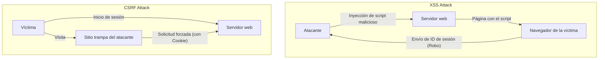

## Introducción

En las aplicaciones web modernas, la seguridad no es solo una función adicional, sino uno de los elementos más importantes que forman la base del sistema. Entre ellas, **XSS (Cross-Site Scripting)** y **CSRF (Cross-Site Request Forgery)** son vulnerabilidades graves con una larga historia y que aún se descubren en muchas aplicaciones web. A menudo se confunden, pero tanto sus mecanismos de ataque como las defensas contra ellas son fundamentalmente diferentes.

En este artículo, desentrañaremos las diferencias esenciales entre XSS y CSRF, detallando cómo los atacantes explotan estas vulnerabilidades y las defensas modernas que los desarrolladores deben implementar, intercalando su evolución histórica.

---

## 1. Las profundidades de XSS (Cross-Site Scripting)

XSS es una técnica de ataque en la que un atacante inyecta un script malicioso (principalmente JavaScript) en una página web y hace que se ejecute en el navegador de otros usuarios que visitan esa página. La esencia de este ataque radica en que "datos no confiables se interpretan como código ejecutable sin pasar por un procesamiento adecuado".

### Los 3 tipos principales de XSS

XSS se clasifica en tres tipos principales, dependiendo de cómo se inyecta y ejecuta el script malicioso en la aplicación.

#### 1. Stored XSS (XSS Almacenado)
Stored XSS es el tipo más peligroso de XSS. El script malicioso enviado por el atacante se guarda (almacena) de forma permanente en el lado del servidor, como en una base de datos o sistema de archivos. Luego, cuando un usuario legítimo ve una página que contiene esos datos, el script almacenado se envía al navegador y se ejecuta.
*   **Lugares típicos de ocurrencia:** Secciones de comentarios, foros, perfiles de usuario, funciones de reseñas, etc.
*   **Amenaza:** El alcance del impacto es muy amplio, y todos los usuarios que abren la página pueden ser víctimas.

#### 2. Reflected XSS (XSS Reflejado)
Reflected XSS ocurre cuando un script malicioso no se guarda en el servidor, sino que se envía como parte de una solicitud (como parámetros de URL o datos de formulario) y se incluye tal cual ("reflejado") en la respuesta del servidor.
*   **Lugares típicos de ocurrencia:** Páginas de resultados de búsqueda, visualización de mensajes de error, paso de datos entre etapas, etc.
*   **Técnica de ataque:** El atacante hace que el ataque tenga éxito engañando al usuario para que haga clic en una URL que contiene parámetros maliciosos (utilizando correos de phishing o redes sociales).

#### 3. DOM-based XSS
DOM-based XSS ocurre sin pasar por el procesamiento del lado del servidor, cuando el JavaScript del lado del cliente (en el navegador) manipula de forma inadecuada el DOM (Document Object Model).
*   **Mecanismo:** Ocurre cuando el JavaScript de la aplicación lee datos de fuentes controlables por el atacante, como `window.location` o `document.referrer`, y los pasa directamente a sumideros peligrosos (puntos de ejecución) como `innerHTML` o `eval()`.
*   **Amenaza:** A menudo no deja rastro en los registros del servidor y puede ser difícil de detectar mediante WAF (Web Application Firewall) u otros.

### Daños por XSS y tácticas de ejecución de scripts en contexto

Cuando XSS tiene éxito, el script del atacante se ejecuta en el navegador del usuario con el mismo origen (permisos) que el sitio web. Esto resulta en los siguientes daños graves:

1.  **Secuestro de sesión (Session Hijacking):** Accede a `document.cookie` para robar el ID de sesión y lo envía al servidor del atacante. Esto permite al atacante suplantar al usuario y apoderarse de la cuenta.
2.  **Ejecución de operaciones no autorizadas:** Ejecuta en segundo plano cualquier operación dentro de la aplicación (cambio de contraseña, transferencia de dinero, envío de mensajes, etc.) con los privilegios del usuario.
3.  **Phishing:** Dibuja un formulario de inicio de sesión falso en el DOM y roba las credenciales de autenticación del usuario directamente.
4.  **Distribución de malware:** Redirige el navegador del usuario a un exploit kit para infectar el PC con malware.

### Defensas modernas contra XSS

Para prevenir XSS, un enfoque de defensa en profundidad (Defense in Depth) es indispensable.

#### 1. Procesamiento de escape según el contexto (Output Encoding)
La medida más básica e importante es el proceso de escape (codificación), que convierte la entrada del usuario en cadenas inofensivas al mostrarla en una página web. Lo importante es seleccionar el método de escape adecuado según el **contexto donde se emiten los datos (cuerpo HTML, atributos HTML, dentro de JavaScript, dentro de CSS, dentro de URL, etc.)**. Muchos marcos de trabajo web modernos (React, Vue, Angular, etc.) realizan escape HTML por defecto, pero aún así se requiere precaución.

#### 2. Introducción de CSP (Content Security Policy)
CSP es un mecanismo de defensa muy poderoso contra XSS, que define una lista blanca de recursos cuyo navegador tiene permitido cargar y ejecutar mediante encabezados HTTP.
```http
Content-Security-Policy: default-src 'self'; script-src 'self' https://trusted.cdn.com;
```
Con esto, incluso si un atacante logra inyectar un script en línea `<script>alert(1)</script>`, el CSP bloqueará su ejecución.

#### 3. Uso del atributo HttpOnly en Cookies
Al agregar el atributo `HttpOnly` a la Cookie que almacena el ID de sesión, etc., el JavaScript (ej. `document.cookie`) ya no podrá acceder a esa Cookie. Esto no evita que ocurra el XSS en sí, pero es una medida de mitigación importante que reduce significativamente el riesgo de secuestro de sesión por XSS.

---

## 2. La esencia de CSRF (Cross-Site Request Forgery)

CSRF es un ataque en el que un atacante atrae a un usuario a un sitio trampa y lo obliga a enviar solicitudes no deseadas a otro sitio web en el que el usuario ya está autenticado (ha iniciado sesión).

Mientras que XSS "ejecuta scripts maliciosos dentro del navegador", CSRF es fundamentalmente diferente en el sentido de que "abusa del comportamiento estándar del navegador (el envío automático de Cookies) para forzar el envío de solicitudes maliciosas".

### El mecanismo de CSRF: Abuso del "envío automático de Cookies"

Cuando el navegador envía una solicitud a un dominio determinado, agrega automáticamente al encabezado y envía las Cookies asociadas a ese dominio (como Cookies de sesión). Esto es cierto incluso para solicitudes de etiquetas de imágenes o formularios ubicados en un dominio diferente (el sitio del atacante).

**Escenario de ataque:**
1.  El usuario inicia sesión en el sitio del banco (`bank.example.com`) y recibe una Cookie de sesión.
2.  El usuario ve el sitio trampa del atacante (`attacker.example.com`) en otra pestaña.
3.  El sitio trampa tiene configurado el siguiente formulario oculto y script de envío automático.
    ```html
    <form action="https://bank.example.com/transfer" method="POST" id="csrf-form">
        <input type="hidden" name="toAccount" value="ATTACKER_ACCOUNT">
        <input type="hidden" name="amount" value="1000000">
    </form>
    <script>document.getElementById('csrf-form').submit();</script>
    ```
4.  El navegador envía una solicitud POST a `bank.example.com`. En este momento, **la Cookie de sesión del sitio del banco se adjunta automáticamente.**
5.  El servidor del banco procesa la solicitud como si proviniera de un usuario legítimo porque contiene la Cookie de sesión legítima, y se ejecuta la transferencia no autorizada.

### Evolución histórica de las defensas contra CSRF y prácticas más recientes

Para prevenir CSRF, es necesario verificar si la solicitud "fue enviada desde una página legítima prevista".

#### 1. Tokens CSRF (Anti-CSRF Tokens): Defensa tradicional y segura
La defensa segura más antigua y ampliamente utilizada es el token CSRF (Synchronizer Token Pattern).
*   El servidor genera un token aleatorio e impredecible para cada sesión y lo guarda en el lado del servidor (como en la sesión).
*   Este token se incrusta como un campo oculto (hidden) en el formulario HTML que se envía al cliente.
*   Al enviar el formulario, el servidor compara el token enviado con el token guardado en el servidor y procesa la solicitud solo si coinciden.
Aunque el atacante puede forzar el envío de una solicitud desde el sitio trampa, no puede leer la página del sitio objetivo para obtener el token correcto (debido a la política del mismo origen, Same-Origin Policy), por lo que el ataque fracasa.

#### 2. Patrón Double Submit Cookie
Es una técnica frecuentemente utilizada en APIs y otros donde el servidor no mantiene un estado (sesión).
*   El servidor genera un token aleatorio y lo envía al cliente como una Cookie.
*   El JavaScript del cliente lee el valor de esa Cookie y lo establece en el encabezado de la solicitud (ej. `X-CSRF-Token`) para enviarlo.
*   El servidor verifica si el valor del token en la Cookie y el valor del token en el encabezado coinciden.
El atacante puede hacer que la Cookie se envíe automáticamente, pero no puede leer la Cookie de otro dominio con JavaScript para establecerla en el encabezado, lo que previene el ataque.

#### 3. Atributo SameSite Cookie: Potente defensa de los navegadores modernos
En los últimos años, la defensa potente más recomendada es el atributo `SameSite` de la Cookie. Esto controla el comportamiento de envío de Cookies durante las solicitudes entre sitios (cross-site requests).

*   `SameSite=Strict`: Las Cookies no se envían en ninguna solicitud entre sitios, incluida la navegación de nivel superior, como al hacer clic en enlaces. Es el más seguro, pero puede afectar la experiencia del usuario (UX), ya que el estado de inicio de sesión no se mantiene al usar enlaces de otros sitios.
*   `SameSite=Lax`: Las Cookies no se envían en solicitudes entre sitios como la carga de imágenes o solicitudes POST, pero sí se envían en la navegación de nivel superior provocada por clics en enlaces (solicitudes GET). Es el comportamiento predeterminado en muchos navegadores actuales. Con esto, se puede prevenir la mayor parte del CSRF causado por el envío de formularios POST maliciosos.
*   `SameSite=None`: Las Cookies siempre se envían, incluso en solicitudes entre sitios. (Siempre se debe especificar junto con el atributo `Secure`).

Al configurar correctamente el atributo SameSite, se puede bloquear la causa fundamental de CSRF (el envío automático de Cookies) a nivel del navegador.

---

## Correlación entre XSS y CSRF y conclusión

El siguiente diagrama muestra la diferencia en el flujo de los ataques.



XSS y CSRF son vulnerabilidades diferentes, pero **si existe XSS, la mayoría de las medidas contra CSRF se vuelven ineficaces**. Esto se debe a que el script ejecutado por XSS se está ejecutando dentro de la página legítima, lo que le permite leer tokens CSRF y enviar solicitudes desde el mismo origen.

Por lo tanto, para garantizar la seguridad de una aplicación web, primero se debe contener el XSS de manera exhaustiva (escape adecuado y CSP), y sobre esa base, implementar las defensas contra CSRF (Cookies SameSite y tokens CSRF), lo que requiere la construcción de una base sólida.

Es importante que los desarrolladores no confíen ciegamente en las funciones de seguridad que proporcionan los marcos de trabajo, sino que comprendan el mecanismo esencial de estas vulnerabilidades y diseñen defensas en las capas adecuadas.
