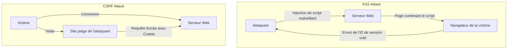

## Introduction

Dans les applications Web modernes, la sécurité n'est pas simplement une fonctionnalité supplémentaire, mais l'un des éléments les plus importants qui forment la base du système. Parmi elles, **XSS (Cross-Site Scripting)** et **CSRF (Cross-Site Request Forgery)** sont des vulnérabilités graves qui ont une longue histoire et qui sont encore découvertes dans de nombreuses applications Web. Bien qu'elles soient souvent confondues, leurs mécanismes d'attaque et leurs mesures de défense sont fondamentalement différents.

Dans cet article, nous clarifierons la différence essentielle entre XSS et CSRF, comment les attaquants exploitent ces vulnérabilités, et détaillerons les mesures de défense modernes que les développeurs doivent implémenter, tout en intégrant l'évolution historique.

---

## 1. Au cœur du XSS (Cross-Site Scripting)

Le XSS est une technique d'attaque où un attaquant injecte un script malveillant (principalement du JavaScript) dans une page Web et le fait exécuter sur les navigateurs d'autres utilisateurs qui visitent cette page. L'essence de cette attaque réside dans le fait que "des données non fiables sont interprétées comme du code exécutable sans passer par un traitement approprié".

### Les 3 principaux types de XSS

Le XSS est largement classé en 3 types selon la manière dont le script malveillant est injecté et exécuté dans l'application.

#### 1. Stored XSS (XSS stocké)
Le Stored XSS est le type de XSS le plus dangereux. Le script malveillant envoyé par l'attaquant est stocké (enregistré) de manière permanente du côté serveur, comme dans une base de données ou un système de fichiers. Ensuite, lorsqu'un utilisateur légitime consulte la page contenant ces données, le script enregistré est envoyé au navigateur et exécuté.
*   **Emplacements typiques :** Sections de commentaires, forums, profils d'utilisateurs, fonctionnalités d'évaluation, etc.
*   **Menaces :** L'étendue de l'impact est très large, et tous les utilisateurs qui ouvrent la page peuvent en être victimes.

#### 2. Reflected XSS (XSS réfléchi)
Le Reflected XSS se produit lorsque le script malveillant n'est pas stocké sur le serveur, mais est envoyé dans le cadre de la requête (comme les paramètres d'URL ou les données de formulaire) et est "réfléchi" tel quel dans la réponse du serveur.
*   **Emplacements typiques :** Pages de résultats de recherche, affichage de messages d'erreur, transmission de données entre les étapes, etc.
*   **Méthode d'attaque :** L'attaquant fait cliquer l'utilisateur sur une URL contenant des paramètres malveillants (en utilisant des e-mails de phishing ou des réseaux sociaux) pour accomplir l'attaque.

#### 3. DOM-based XSS
Le DOM-based XSS se produit sans passer par le traitement côté serveur, lorsque le JavaScript côté client (sur le navigateur) manipule de manière inappropriée le DOM (Document Object Model).
*   **Mécanisme :** Se produit lorsque le JavaScript de l'application lit des données à partir de sources contrôlables par l'attaquant telles que `window.location` ou `document.referrer`, et les passe directement à des points d'exécution dangereux (sinks) comme `innerHTML` ou `eval()`.
*   **Menaces :** Il ne laisse souvent aucune trace dans les journaux du serveur, ce qui le rend parfois difficile à détecter par des WAF (Web Application Firewall) et autres.

### Dommages causés par le XSS et méthodes d'exécution de scripts en contexte

Lorsqu'un XSS réussit, le script de l'attaquant s'exécute sur le navigateur de l'utilisateur avec la même origine (privilèges) que le site Web. Cela entraîne les dommages graves suivants :

1.  **Détournement de session (Session Hijacking) :** Accède à `document.cookie` pour voler l'ID de session et l'envoie au serveur de l'attaquant. Cela permet à l'attaquant d'usurper l'identité de l'utilisateur et de prendre le contrôle de son compte.
2.  **Exécution d'opérations non autorisées :** Fait exécuter en arrière-plan n'importe quelle opération dans l'application (changement de mot de passe, transfert d'argent, envoi de messages, etc.) avec les privilèges de l'utilisateur.
3.  **Hameçonnage (Phishing) :** Dessine un faux formulaire de connexion sur le DOM pour voler directement les informations d'authentification de l'utilisateur.
4.  **Distribution de logiciels malveillants :** Redirige le navigateur de l'utilisateur vers un kit d'exploitation (exploit kit) et infecte le PC avec des logiciels malveillants.

### Mesures de défense modernes contre le XSS

Pour prévenir le XSS, une approche de défense en profondeur (Defense in Depth) est indispensable.

#### 1. Traitement d'échappement selon le contexte (Output Encoding)
La mesure la plus fondamentale et importante est le processus d'échappement (encodage) qui convertit les entrées de l'utilisateur en chaînes inoffensives lors de leur affichage sur une page Web. Ce qui est important, c'est de choisir la méthode d'échappement appropriée en fonction du **contexte où les données sont affichées (corps HTML, attributs HTML, dans du JavaScript, dans du CSS, dans une URL, etc.)**. De nombreux frameworks Web modernes (React, Vue, Angular, etc.) effectuent un échappement HTML par défaut, mais la prudence reste de mise.

#### 2. Introduction de la CSP (Content Security Policy)
La CSP est un mécanisme de défense très puissant contre le XSS, définissant une liste blanche de ressources que le navigateur est autorisé à charger et exécuter, via les en-têtes HTTP.
```http
Content-Security-Policy: default-src 'self'; script-src 'self' https://trusted.cdn.com;
```
Ainsi, même si un attaquant réussit à injecter un script en ligne `<script>alert(1)</script>`, son exécution sera bloquée par la CSP.

#### 3. Utilisation de l'attribut de Cookie HttpOnly
En ajoutant l'attribut `HttpOnly` aux cookies qui stockent des éléments comme les ID de session, il devient impossible pour le JavaScript (ex: `document.cookie`) d'accéder à ce cookie. Cela n'empêche pas l'occurrence du XSS lui-même, mais c'est une mesure d'atténuation importante qui réduit considérablement le risque de détournement de session par le XSS.

---

## 2. L'essence du CSRF (Cross-Site Request Forgery)

Le CSRF est une attaque où un attaquant dirige un utilisateur vers un site piège, forçant l'utilisateur à envoyer des requêtes involontaires à un autre site Web sur lequel il est déjà authentifié (connecté).

Alors que le XSS "fait exécuter un script non autorisé dans le navigateur", le CSRF est fondamentalement différent en ce qu'il "exploite le comportement standard du navigateur (envoi automatique de cookies) pour envoyer une requête non autorisée".

### Le mécanisme du CSRF : L'exploitation de "l'envoi automatique de cookies"

Lorsqu'un navigateur envoie une requête à un certain domaine, il attache automatiquement les cookies associés à ce domaine (comme les cookies de session) dans l'en-tête et les envoie. Cela s'applique même s'il s'agit d'une requête provenant d'une balise d'image ou d'un formulaire placé sur un autre domaine (le site de l'attaquant).

**Scénario d'attaque :**
1.  L'utilisateur se connecte au site de la banque (`bank.example.com`) et reçoit un cookie de session.
2.  L'utilisateur visite le site piège de l'attaquant (`attacker.example.com`) dans un autre onglet.
3.  Le site piège est configuré avec un formulaire caché et un script d'envoi automatique comme suit :
    ```html
    <form action="https://bank.example.com/transfer" method="POST" id="csrf-form">
        <input type="hidden" name="toAccount" value="ATTACKER_ACCOUNT">
        <input type="hidden" name="amount" value="1000000">
    </form>
    <script>document.getElementById('csrf-form').submit();</script>
    ```
4.  Le navigateur envoie une requête POST à `bank.example.com`. À ce moment-là, **le cookie de session du site de la banque est automatiquement joint.**
5.  Le serveur de la banque traite cela comme une requête d'un utilisateur légitime puisqu'il contient un cookie de session valide, et le transfert de fonds non autorisé est exécuté.

### Évolution historique des mesures de défense contre le CSRF et meilleures pratiques actuelles

Pour prévenir le CSRF, il est nécessaire de vérifier si la requête "a été envoyée depuis la page légitime prévue".

#### 1. Jetons CSRF (Anti-CSRF Tokens) : Une défense traditionnelle et fiable
La mesure de défense la plus ancienne, la plus largement utilisée et fiable est le jeton CSRF (Synchronizer Token Pattern).
*   Le serveur génère un jeton aléatoire et imprévisible pour chaque session et le stocke côté serveur (dans la session, etc.).
*   Ce jeton est intégré en tant que champ caché dans le formulaire HTML envoyé au client.
*   Lors de la soumission du formulaire, le serveur compare le jeton envoyé avec le jeton stocké côté serveur et traite la requête uniquement s'ils correspondent.
Bien qu'un attaquant puisse forcer l'envoi d'une requête depuis le site piège, il ne peut pas lire la page du site cible pour obtenir le jeton correct (en raison de la Same-Origin Policy), ce qui fait échouer l'attaque.

#### 2. Le modèle Double Submit Cookie
C'est une technique souvent utilisée dans les API qui ne conservent pas d'état (session) côté serveur.
*   Le serveur génère un jeton aléatoire et l'envoie au client sous forme de cookie.
*   Le JavaScript du client lit la valeur de ce cookie et la définit dans l'en-tête de la requête (ex: `X-CSRF-Token`) avant de l'envoyer.
*   Le serveur vérifie si la valeur du jeton dans le cookie et la valeur du jeton dans l'en-tête correspondent.
Bien qu'un attaquant puisse provoquer l'envoi automatique du cookie, il ne peut pas lire le cookie d'un autre domaine avec JavaScript pour le définir dans l'en-tête, ce qui permet de s'en protéger.

#### 3. Attribut de Cookie SameSite : Une défense puissante par les navigateurs modernes
Ces dernières années, la mesure de défense puissante la plus recommandée est l'attribut `SameSite` des cookies. Il contrôle le comportement d'envoi des cookies lors de requêtes intersites (cross-site).

*   `SameSite=Strict`: Les cookies ne sont envoyés dans aucune requête cross-site, y compris les navigations de niveau supérieur comme les clics sur des liens. C'est le plus sûr, mais cela peut affecter l'expérience utilisateur (UX), car l'état de connexion n'est pas maintenu lors du suivi de liens depuis d'autres sites.
*   `SameSite=Lax`: Les cookies ne sont pas envoyés dans les requêtes cross-site comme le chargement d'images ou les requêtes POST, mais sont envoyés dans les navigations de niveau supérieur via les clics sur des liens (requêtes GET). C'est le comportement par défaut de nombreux navigateurs actuels. Cela empêche la majorité des CSRF causés par des soumissions de formulaires POST malveillants.
*   `SameSite=None`: Les cookies sont toujours envoyés, même dans les requêtes cross-site. (Doit toujours être spécifié en conjonction avec l'attribut `Secure`).

En définissant de manière appropriée l'attribut SameSite, la cause fondamentale du CSRF (l'envoi automatique de cookies) peut être bloquée au niveau du navigateur.

---

## Corrélation entre XSS et CSRF et conclusion

Le diagramme suivant montre la différence dans le flux des attaques.



Le XSS et le CSRF sont des vulnérabilités différentes, mais **si le XSS est présent, la plupart des mesures contre le CSRF sont invalidées**. En effet, les scripts exécutés via le XSS fonctionnent à l'intérieur de la page légitime, ce qui leur permet de lire les jetons CSRF ou d'envoyer des requêtes depuis la même origine.

Par conséquent, pour garantir la sécurité d'une application Web, il est nécessaire de construire une base solide en neutralisant d'abord complètement le XSS (échappement approprié et CSP), puis en implémentant les mesures contre le CSRF (Cookie SameSite et jetons CSRF).

Il est important que les développeurs ne fassent pas aveuglément confiance aux fonctionnalités de sécurité fournies par les frameworks, mais comprennent les mécanismes essentiels de ces vulnérabilités et conçoivent des défenses aux niveaux appropriés.
