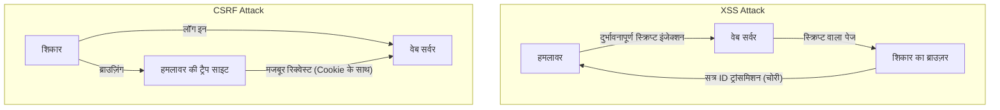

## परिचय

आधुनिक वेब एप्लिकेशनों में, सुरक्षा केवल एक अतिरिक्त सुविधा नहीं है, बल्कि सिस्टम की नींव बनाने वाले सबसे महत्वपूर्ण तत्वों में से एक है। इनमें, **XSS (Cross-Site Scripting)** और **CSRF (Cross-Site Request Forgery)** पुरानी होने के बावजूद गंभीर भेद्यताएं हैं जो आज भी कई वेब एप्लिकेशनों में पाई जाती हैं। अक्सर इन्हें मिला दिया जाता है, लेकिन इनके हमले का तंत्र और उनके खिलाफ बचाव के उपाय मौलिक रूप से भिन्न होते हैं।

इस लेख में, हम XSS और CSRF के बीच के मौलिक अंतर को स्पष्ट करेंगे, हमलावर इन भेद्यताओं का फायदा कैसे उठाते हैं, और डेवलपर्स को कौन से आधुनिक सुरक्षा उपाय लागू करने चाहिए, इसकी विस्तृत व्याख्या ऐतिहासिक परिवर्तनों के साथ करेंगे।

---

## 1. XSS (Cross-Site Scripting) की गहराई

XSS एक हमला करने की तकनीक है जहां हमलावर किसी वेब पेज में दुर्भावनापूर्ण स्क्रिप्ट (मुख्य रूप से JavaScript) इंजेक्ट करता है, जिसे उस पेज को देखने वाले अन्य उपयोगकर्ताओं के ब्राउज़र पर निष्पादित किया जाता है। इस हमले का सार यह है कि "अविश्वसनीय डेटा को बिना उचित प्रक्रिया के निष्पादन योग्य कोड के रूप में व्याख्यायित किया जाता है"।

### XSS के 3 प्रमुख प्रकार

XSS को मुख्य रूप से 3 प्रकारों में वर्गीकृत किया जाता है, इस आधार पर कि दुर्भावनापूर्ण स्क्रिप्ट को एप्लिकेशन में कैसे इंजेक्ट और निष्पादित किया जाता है।

#### 1. Stored XSS (संचित XSS)
Stored XSS सबसे खतरनाक प्रकार का XSS है। हमलावर द्वारा भेजी गई दुर्भावनापूर्ण स्क्रिप्ट सर्वर साइड जैसे डेटाबेस या फाइल सिस्टम में स्थायी रूप से सहेजी (संचित) जाती है। बाद में, যখন कोई वैध उपयोगकर्ता उस डेटा वाले पेज को देखता है, तो सहेजी गई स्क्रिप्ट ब्राउज़र को भेजी जाती है और निष्पादित हो जाती है।
*   **सामान्य घटना स्थल:** टिप्पणी अनुभाग, बुलेटिन बोर्ड, उपयोगकर्ता प्रोफाइल, समीक्षा सुविधाएँ आदि।
*   **खतरा:** प्रभाव का दायरा बहुत व्यापक है, और पेज खोलने वाले सभी उपयोगकर्ताओं के शिकार होने की संभावना होती है।

#### 2. Reflected XSS (परावर्तित XSS)
Reflected XSS तब होता है जब दुर्भावनापूर्ण स्क्रिप्ट सर्वर पर सहेजे बिना रिक्वेस्ट के हिस्से (जैसे URL पैरामीटर या फॉर्म डेटा) के रूप में भेजी जाती है, और सर्वर की प्रतिक्रिया में सीधे "परावर्तित" होकर शामिल होती है।
*   **सामान्य घटना स्थल:** खोज परिणाम पेज, त्रुटि संदेश का प्रदर्शन, चरणों के बीच डेटा पास करना आदि।
*   **हमले की तकनीक:** हमलावर उपयोगकर्ताओं को दुर्भावनापूर्ण पैरामीटर वाले URL पर क्लिक करवाकर (फिशिंग ईमेल या SNS का उपयोग करके) हमला करता है।

#### 3. DOM-based XSS
DOM-based XSS सर्वर-साइड प्रोसेसिंग से गुजरे बिना तब होता है जब क्लाइंट-साइड (ब्राउज़र पर) JavaScript अनुचित तरीके से DOM (Document Object Model) में हेरफेर करता है।
*   **तंत्र:** यह तब होता है जब एप्लिकेशन का JavaScript हमलावर द्वारा नियंत्रित स्रोतों जैसे `window.location` या `document.referrer` से डेटा पढ़ता है, और इसे सीधे खतरनाक सिंक (निष्पादन बिंदु) जैसे `innerHTML` या `eval()` को पास कर देता है।
*   **खतरा:** यह अक्सर सर्वर लॉग में नहीं रहता है, जिससे WAF (Web Application Firewall) आदि द्वारा इसका पता लगाना मुश्किल हो सकता है।

### XSS द्वारा नुकसान और संदर्भ में स्क्रिप्ट निष्पादन की तरकीबें

जब XSS सफल हो जाता है, तो हमलावर की स्क्रिप्ट उपयोगकर्ता के ब्राउज़र पर उसी वेबसाइट के मूल (अधिकार) के साथ निष्पादित होती है। इसके परिणामस्वरूप निम्नलिखित गंभीर नुकसान होते हैं:

1.  **सत्र अपहरण (Session Hijacking):** `document.cookie` तक पहुंच कर सत्र ID चुरा ली जाती है और हमलावर के सर्वर पर भेज दी जाती है। इससे हमलावर उपयोगकर्ता का रूप धारण करके अकाउंट पर कब्जा कर सकता है।
2.  **अनधिकृत कार्यों का निष्पादन:** उपयोगकर्ता के अधिकार के साथ, एप्लिकेशन के भीतर कोई भी मनमाना कार्य (पासवर्ड बदलना, पैसे भेजना, संदेश भेजना आदि) बैकग्राउंड में निष्पादित किया जाता है।
3.  **फिशिंग (Phishing):** DOM पर एक नकली लॉगिन फॉर्म बनाकर उपयोगकर्ता की प्रमाणीकरण जानकारी सीधे चुरा ली जाती है।
4.  **मैलवेयर वितरण:** उपयोगकर्ता के ब्राउज़र को एक्सप्लॉइट किट पर रीडायरेक्ट करके पीसी को मैलवेयर से संक्रमित किया जाता है।

### XSS के खिलाफ आधुनिक सुरक्षा उपाय

XSS को रोकने के लिए, बहु-स्तरीय रक्षा (Defense in Depth) दृष्टिकोण आवश्यक है।

#### 1. संदर्भ-विशिष्ट एस्केप प्रोसेसिंग (Output Encoding)
सबसे बुनियादी और महत्वपूर्ण उपाय उपयोगकर्ताओं के इनपुट को वेब पेज पर आउटपुट करते समय हानिरहित स्ट्रिंग्स में बदलने की एस्केप (एनकोडिंग) प्रक्रिया है। महत्वपूर्ण बात यह है कि डेटा आउटपुट होने वाले **संदर्भ (HTML बॉडी, HTML विशेषता, JavaScript के भीतर, CSS के भीतर, URL के भीतर आदि)** के आधार पर उचित एस्केप विधि का चयन किया जाए। आधुनिक वेब फ्रेमवर्क (React, Vue, Angular आदि) डिफ़ॉल्ट रूप से HTML को एस्केप करते हैं, लेकिन फिर भी सावधानी बरतने की आवश्यकता है।

#### 2. CSP (Content Security Policy) का परिचय
CSP, XSS के खिलाफ एक बहुत ही शक्तिशाली रक्षा तंत्र है, जो उन संसाधनों की एक श्वेतसूची को HTTP हेडर में परिभाषित करता है जिन्हें ब्राउज़र लोड और निष्पादित करने की अनुमति देता है।
```http
Content-Security-Policy: default-src 'self'; script-src 'self' https://trusted.cdn.com;
```
इससे, भले ही कोई हमलावर इनलाइन स्क्रिप्ट `<script>alert(1)</script>` को इंजेक्ट करने में सफल हो जाए, CSP द्वारा इसका निष्पादन रोक दिया जाएगा।

#### 3. HttpOnly Cookie विशेषता का उपयोग
सत्र ID आदि को संग्रहीत करने वाली Cookie में `HttpOnly` विशेषता जोड़कर, JavaScript (जैसे `document.cookie`) से उस Cookie तक पहुंच को रोका जा सकता है। यह XSS की घटना को स्वयं नहीं रोकता है, लेकिन यह एक महत्वपूर्ण शमन उपाय है जो XSS के कारण सत्र अपहरण के जोखिम को काफी कम कर देता है।

---

## 2. CSRF (Cross-Site Request Forgery) का सार

CSRF एक हमला है जहां एक हमलावर उपयोगकर्ता को एक ट्रैप साइट पर ले जाता है और उसे किसी अन्य वेबसाइट पर अनजाने में एक रिक्वेस्ट भेजने के लिए मजबूर करता है जहां उपयोगकर्ता पहले से ही प्रमाणित (लॉग इन) है।

जहां XSS "ब्राउज़र के भीतर दुर्भावनापूर्ण स्क्रिप्ट को निष्पादित करता है", वहीं CSRF "ब्राउज़र के मानक व्यवहार (Cookie का स्वचालित ट्रांसमिशन) का फायदा उठाकर दुर्भावनापूर्ण रिक्वेस्ट भेजता है"। यह एक महत्वपूर्ण अंतर है।

### CSRF का तंत्र: "Cookie का स्वचालित ट्रांसमिशन" का दुरुपयोग

जब कोई ब्राउज़र किसी डोमेन पर रिक्वेस्ट भेजता है, तो वह स्वचालित रूप से उस डोमेन से जुड़ी Cookie (सत्र Cookie आदि) को हेडर में संलग्न करके भेजता है। यह तब भी लागू होता है जब रिक्वेस्ट किसी अन्य डोमेन (हमलावर की साइट) पर स्थित छवि टैग या फॉर्म से आती है।

**हमले का परिदृश्य:**
1.  उपयोगकर्ता बैंक साइट (`bank.example.com`) में लॉग इन करता है और एक सत्र Cookie प्राप्त करता है।
2.  उपयोगकर्ता एक अलग टैब में हमलावर की ट्रैप साइट (`attacker.example.com`) देखता है।
3.  ट्रैप साइट में निम्नलिखित जैसा एक छिपा हुआ फॉर्म और एक स्वचालित ट्रांसमिशन स्क्रिप्ट है:
    ```html
    <form action="https://bank.example.com/transfer" method="POST" id="csrf-form">
        <input type="hidden" name="toAccount" value="ATTACKER_ACCOUNT">
        <input type="hidden" name="amount" value="1000000">
    </form>
    <script>document.getElementById('csrf-form').submit();</script>
    ```
4.  ब्राउज़र `bank.example.com` पर एक POST रिक्वेस्ट भेजता है। इस समय, **बैंक साइट की सत्र Cookie स्वचालित रूप से संलग्न हो जाती है।**
5.  चूंकि एक वैध सत्र Cookie शामिल है, बैंक सर्वर इसे एक वैध उपयोगकर्ता के अनुरोध के रूप में संसाधित करता है, और अनधिकृत धन हस्तांतरण निष्पादित हो जाता है।

### CSRF के खिलाफ सुरक्षा उपायों का ऐतिहासिक विकास और नवीनतम प्रथाएं

CSRF को रोकने के लिए, यह सत्यापित करना आवश्यक है कि क्या रिक्वेस्ट "किसी इच्छित वैध पेज से भेजी गई थी"।

#### 1. CSRF टोकन (Anti-CSRF Tokens): पारंपरिक और विश्वसनीय बचाव
CSRF टोकन (Synchronizer Token Pattern) सबसे पुराना और सबसे व्यापक रूप से इस्तेमाल किया जाने वाला विश्वसनीय बचाव है।
*   सर्वर प्रत्येक सत्र के लिए एक अप्रत्याशित यादृच्छिक टोकन उत्पन्न करता है और इसे सर्वर साइड (जैसे सत्र) पर सहेजता है।
*   यह टोकन क्लाइंट को भेजे गए HTML फॉर्म के भीतर एक छिपे हुए (hidden) क्षेत्र के रूप में एम्बेड किया जाता है।
*   फॉर्म सबमिट करते समय, सर्वर भेजे गए टोकन की तुलना सर्वर साइड पर सहेजे गए टोकन से करता है और दोनों के मेल खाने पर ही रिक्वेस्ट को प्रोसेस करता है।
भले ही हमलावर ट्रैप साइट से रिक्वेस्ट भेज सकें, लेकिन वे लक्ष्य साइट के पेज को पढ़कर सही टोकन प्राप्त नहीं कर सकते (Same-Origin Policy के कारण), इसलिए हमला विफल हो जाता है।

#### 2. Double Submit Cookie पैटर्न
यह अक्सर उन API में उपयोग की जाने वाली तकनीक है जिनकी सर्वर साइड पर स्थिति (सत्र) नहीं होती है।
*   सर्वर एक यादृच्छिक टोकन उत्पन्न करता है और इसे Cookie के रूप में क्लाइंट को भेजता है।
*   क्लाइंट का JavaScript उस Cookie के मान को पढ़ता है और उसे भेजते समय रिक्वेस्ट हेडर (उदाहरण के लिए: `X-CSRF-Token`) में सेट करता है।
*   सर्वर सत्यापित करता है internal सर्वर सत्यापित करता है कि Cookie में टोकन का मान और हेडर में टोकन का मान मेल खाता है या नहीं।
हालांकि हमलावर Cookie को स्वचालित रूप से भेज सकते हैं, लेकिन वे JavaScript का उपयोग करके किसी अन्य डोमेन की Cookie को नहीं पढ़ सकते हैं और उसे हेडर में सेट नहीं कर सकते हैं, जिससे इसे रोका जा सकता है।

#### 3. SameSite Cookie विशेषता: आधुनिक ब्राउज़रों द्वारा मजबूत सुरक्षा
हाल के वर्षों में, Cookie की `SameSite` विशेषता सबसे अनुशंसित मजबूत सुरक्षा उपाय है। यह क्रॉस-साइट रिक्वेस्ट के दौरान Cookie भेजने के व्यवहार को नियंत्रित करता है।

*   `SameSite=Strict`: किसी भी क्रॉस-साइट रिक्वेस्ट में Cookie नहीं भेजी जाएगी, जिसमें लिंक क्लिक जैसे शीर्ष-स्तरीय नेविगेशन शामिल हैं। यह सबसे सुरक्षित है, लेकिन इसका UX पर प्रभाव पड़ सकता है, जैसे कि किसी अन्य साइट के लिंक से लॉगिन स्थिति को बनाए नहीं रखना।
*   `SameSite=Lax`: छवियों को लोड करने या POST रिक्वेस्ट जैसे क्रॉस-साइट रिक्वेस्ट में Cookie नहीं भेजी जाती है, लेकिन इसे लिंक क्लिक (GET रिक्वेस्ट) के माध्यम से शीर्ष-स्तरीय नेविगेशन के लिए भेजा जाता है। यह वर्तमान में कई ब्राउज़रों का डिफ़ॉल्ट व्यवहार है। यह दुर्भावनापूर्ण POST फॉर्म सबमिशन के कारण होने वाले अधिकांश CSRF को रोक सकता है।
*   `SameSite=None`: क्रॉस-साइट रिक्वेस्ट के लिए भी Cookie हमेशा भेजी जाती है। (इसे हमेशा `Secure` विशेषता के साथ निर्दिष्ट किया जाना चाहिए)।

SameSite विशेषता को उचित रूप से सेट करके, CSRF के मूल कारण (Cookie का स्वचालित ट्रांसमिशन) को ब्राउज़र स्तर पर ब्लॉक किया जा सकता है।

---

## XSS और CSRF के बीच संबंध और निष्कर्ष

नीचे दिया गया आरेख हमलों के प्रवाह में अंतर को दर्शाता है।



हालाँकि XSS और CSRF अलग-अलग भेद्यताएं हैं, **यदि XSS मौजूद है, तो अधिकांश CSRF सुरक्षा उपाय अप्रभावी हो जाते हैं**। ऐसा इसलिए है क्योंकि XSS द्वारा निष्पादित स्क्रिप्ट एक वैध पेज के भीतर चल रही है, जिससे CSRF टोकन को पढ़ना और उसी मूल (origin) से रिक्वेस्ट भेजना संभव हो जाता है।

इसलिए, वेब एप्लिकेशन की सुरक्षा सुनिश्चित करने के लिए, एक मजबूत नींव बनाना आवश्यक है: पहले XSS को पूरी तरह से ब्लॉक करना (उचित एस्केपिंग और CSP), और फिर CSRF काउंटरमेजर (SameSite Cookie और CSRF टोकन) को लागू करना।

डेवलपर्स के लिए यह महत्वपूर्ण है कि वे फ्रेमवर्क द्वारा प्रदान की जाने वाली सुरक्षा सुविधाओं पर अत्यधिक भरोसा न करें, बल्कि इन भेद्यताओं के मौलिक तंत्र को समझें और उचित स्तरों पर रक्षा डिजाइन करें।
