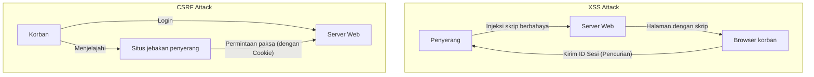

## Pendahuluan

Dalam aplikasi Web modern, keamanan bukan sekadar fitur tambahan, melainkan salah satu elemen paling penting yang membentuk fondasi sistem. Di antara masalah keamanan tersebut, **XSS (Cross-Site Scripting)** dan **CSRF (Cross-Site Request Forgery)** adalah kerentanan serius dengan sejarah panjang yang masih sering ditemukan pada banyak aplikasi web saat ini. Keduanya sering kali membingungkan, padahal mekanisme serangan maupun langkah pertahanannya pada dasarnya berbeda.

Dalam artikel ini, kami akan mengungkap perbedaan mendasar antara XSS dan CSRF, menjelaskan bagaimana penyerang mengeksploitasi kerentanan ini, dan merinci langkah pertahanan modern yang harus diterapkan oleh pengembang, beserta perubahan sejarahnya.

---

## 1. Menyelami XSS (Cross-Site Scripting)

XSS adalah metode serangan di mana penyerang menyuntikkan skrip berbahaya (biasanya JavaScript) ke dalam halaman Web dan mengeksekusinya di browser pengguna lain yang melihat halaman tersebut. Inti dari serangan ini adalah "data tidak tepercaya yang diinterpretasikan sebagai kode yang dapat dieksekusi tanpa pemrosesan yang tepat".

### 3 Jenis Utama XSS

XSS dapat dikategorikan ke dalam tiga jenis utama berdasarkan bagaimana skrip berbahaya disuntikkan ke dalam aplikasi dan dieksekusi.

#### 1. Stored XSS (XSS Tersimpan)
Stored XSS merupakan tipe XSS yang paling berbahaya. Skrip berbahaya yang dikirim oleh penyerang disimpan secara permanen di sisi server, seperti di database atau sistem file. Selanjutnya, ketika pengguna yang sah melihat halaman yang memuat data tersebut, skrip yang tersimpan akan dikirim ke browser dan dieksekusi.
*   **Lokasi umum terjadinya:** Kolom komentar, papan buletin, profil pengguna, fitur ulasan, dll.
*   **Ancaman:** Area dampaknya sangat luas, dan semua pengguna yang membuka halaman dapat menjadi korban.

#### 2. Reflected XSS (XSS Terpantul)
Reflected XSS terjadi ketika skrip berbahaya tidak disimpan di server, melainkan dikirim sebagai bagian dari permintaan (seperti parameter URL atau data formulir) dan "dipantulkan" kembali ke dalam respons dari server sebagaimana adanya.
*   **Lokasi umum terjadinya:** Halaman hasil pencarian, tampilan pesan kesalahan, transfer data antar langkah, dll.
*   **Metode serangan:** Penyerang membuat korban mengeklik URL yang mengandung parameter berbahaya (menggunakan email phishing atau media sosial) agar serangan berhasil.

#### 3. DOM-based XSS
DOM-based XSS terjadi tanpa melalui pemrosesan sisi server, saat JavaScript di sisi klien (di browser) memanipulasi DOM (Document Object Model) secara tidak benar.
*   **Mekanisme:** Ini terjadi ketika JavaScript dalam aplikasi membaca data dari sumber yang dapat dikontrol oleh penyerang, seperti `window.location` atau `document.referrer`, dan meneruskannya langsung ke sink (titik eksekusi) berbahaya seperti `innerHTML` atau `eval()`.
*   **Ancaman:** Seringkali tidak tertinggal di log server, sehingga mungkin sulit dideteksi oleh WAF (Web Application Firewall).

### Kerusakan Akibat XSS dan Taktik Eksekusi Skrip Dalam Konteks

Jika XSS berhasil, skrip penyerang akan dijalankan di browser pengguna dengan origin (hak istimewa) yang sama dengan situs web tersebut. Hal ini menyebabkan kerusakan parah seperti berikut:

1.  **Pembajakan Sesi (Session Hijacking):** Mengakses `document.cookie` untuk mencuri ID sesi dan mengirimkannya ke server penyerang. Hal ini memungkinkan penyerang menyamar sebagai pengguna dan mengambil alih akun.
2.  **Mengeksekusi Operasi Tanpa Izin:** Menjalankan operasi sewenang-wenang dalam aplikasi (mengubah kata sandi, mentransfer uang, mengirim pesan, dll.) di latar belakang dengan hak istimewa pengguna.
3.  **Phishing:** Menggambar formulir login palsu di DOM untuk mencuri informasi autentikasi pengguna secara langsung.
4.  **Distribusi Malware:** Mengalihkan browser pengguna ke exploit kit untuk menginfeksi PC dengan malware.

### Langkah Pertahanan Modern Terhadap XSS

Untuk mencegah XSS, pendekatan pertahanan berlapis (Defense in Depth) sangat penting.

#### 1. Proses Escape Sesuai Konteks (Output Encoding)
Langkah yang paling dasar dan penting adalah proses escape (encoding) yang mengubah input pengguna menjadi string yang tidak berbahaya saat menampilkannya di halaman web. Hal yang penting adalah memilih metode escape yang sesuai dengan **konteks (teks HTML, atribut HTML, di dalam JavaScript, di dalam CSS, di dalam URL, dll.)** tempat data tersebut dikeluarkan. Banyak framework web modern (React, Vue, Angular, dll.) melakukan HTML escape secara default, namun kehati-hatian tetap diperlukan.

#### 2. Implementasi CSP (Content Security Policy)
CSP adalah mekanisme pertahanan yang sangat kuat terhadap XSS yang menggunakan header HTTP untuk menentukan daftar putih (whitelist) sumber daya yang diizinkan untuk dimuat dan dijalankan oleh browser.
```http
Content-Security-Policy: default-src 'self'; script-src 'self' https://trusted.cdn.com;
```
Dengan ini, bahkan jika penyerang berhasil menyuntikkan skrip sebaris `<script>alert(1)</script>`, eksekusinya akan diblokir oleh CSP.

#### 3. Pemanfaatan Atribut HttpOnly Cookie
Dengan menambahkan atribut `HttpOnly` ke Cookie yang menyimpan ID sesi, Cookie tersebut tidak dapat diakses dari JavaScript (misalnya, `document.cookie`). Walaupun hal ini tidak mencegah terjadinya XSS itu sendiri, ini merupakan langkah mitigasi penting yang secara drastis mengurangi risiko pembajakan sesi karena XSS.

---

## 2. Esensi CSRF (Cross-Site Request Forgery)

CSRF adalah serangan di mana penyerang memancing pengguna ke situs jebakan, dan memaksa mereka untuk mengirimkan permintaan yang tidak diinginkan ke situs web lain tempat pengguna tersebut sudah diautentikasi (login).

Perbedaan utamanya adalah XSS "mengeksekusi skrip berbahaya di dalam browser", sementara CSRF "menyalahgunakan perilaku standar browser (pengiriman otomatis Cookie) untuk mengirim permintaan palsu".

### Mekanisme CSRF: Penyalahgunaan "Pengiriman Otomatis Cookie"

Ketika browser mengirim permintaan ke sebuah domain, browser secara otomatis melampirkan Cookie (seperti Cookie sesi) yang terkait dengan domain tersebut ke header dan mengirimkannya. Ini juga berlaku untuk permintaan yang berasal dari tag gambar atau formulir yang ditempatkan di domain lain (situs penyerang).

**Skenario Serangan:**
1.  Pengguna login ke situs bank (`bank.example.com`) dan menerima Cookie sesi.
2.  Pengguna membuka situs jebakan penyerang (`attacker.example.com`) di tab lain.
3.  Situs jebakan dilengkapi dengan formulir tersembunyi dan skrip pengiriman otomatis seperti berikut:
    ```html
    <form action="https://bank.example.com/transfer" method="POST" id="csrf-form">
        <input type="hidden" name="toAccount" value="ATTACKER_ACCOUNT">
        <input type="hidden" name="amount" value="1000000">
    </form>
    <script>document.getElementById('csrf-form').submit();</script>
    ```
4.  Browser mengirim permintaan POST ke `bank.example.com`. Pada saat ini, **Cookie sesi situs bank ditambahkan secara otomatis.**
5.  Karena permintaan tersebut berisi Cookie sesi yang sah, server bank memprosesnya sebagai permintaan dari pengguna yang sah, dan transfer uang ilegal dieksekusi.

### Perjalanan Sejarah Langkah Pertahanan CSRF dan Praktik Terbaru

Untuk mencegah CSRF, Anda perlu memverifikasi apakah permintaan "dikirim dari halaman sah yang dimaksudkan".

#### 1. Token CSRF (Anti-CSRF Tokens): Pertahanan Tradisional dan Andal
Langkah pertahanan yang paling tua dan paling banyak digunakan adalah Token CSRF (Synchronizer Token Pattern).
*   Server membuat token acak yang tidak dapat diprediksi untuk setiap sesi dan menyimpannya di sisi server (seperti dalam sesi).
*   Token ini disematkan sebagai kolom tersembunyi (hidden field) di dalam formulir HTML yang dikirim ke klien.
*   Saat mengirimkan formulir, server membandingkan token yang dikirim dengan token yang disimpan di server, dan memproses permintaan hanya jika keduanya cocok.
Penyerang dapat mengirim permintaan dari situs jebakan, tetapi tidak dapat membaca halaman situs target untuk mendapatkan token yang benar (karena Same-Origin Policy), sehingga serangan gagal.

#### 2. Pola Double Submit Cookie
Ini adalah teknik yang sering digunakan di API tanpa status (stateless) di sisi server.
*   Server membuat token acak dan mengirimkannya ke klien sebagai Cookie.
*   JavaScript di klien membaca nilai Cookie tersebut dan meletakkannya di header permintaan (misalnya, `X-CSRF-Token`) sebelum dikirim.
*   Server memverifikasi apakah nilai token di dalam Cookie dan nilai token di dalam header sama.
Penyerang bisa saja mengirim Cookie secara otomatis, tetapi tidak dapat menggunakan JavaScript untuk membaca Cookie dari domain lain dan menyetelnya di header, sehingga hal ini dapat dicegah.

#### 3. Atribut SameSite Cookie: Pertahanan Kuat oleh Browser Modern
Dalam beberapa tahun terakhir, langkah pertahanan paling direkomendasikan dan kuat adalah atribut `SameSite` untuk Cookie. Ini mengontrol perilaku pengiriman Cookie saat permintaan lintas situs.

*   `SameSite=Strict`: Cookie tidak dikirim dalam permintaan lintas situs apa pun, termasuk navigasi tingkat atas (top-level navigation) seperti klik tautan. Ini adalah yang paling aman, tetapi dapat memengaruhi UX karena status login tidak akan dipertahankan saat mengikuti tautan dari situs lain.
*   `SameSite=Lax`: Cookie tidak dikirim pada permintaan lintas situs seperti memuat gambar atau permintaan POST, namun dikirim pada navigasi tingkat atas akibat klik tautan (permintaan GET). Ini adalah perilaku default dari banyak browser saat ini. Hal ini dapat mencegah sebagian besar CSRF akibat pengiriman formulir POST berbahaya.
*   `SameSite=None`: Cookie selalu dikirim, bahkan pada permintaan lintas situs. (Harus selalu ditentukan bersama dengan atribut `Secure`).

Dengan menyetel atribut SameSite secara tepat, Anda dapat memblokir akar penyebab CSRF (pengiriman otomatis Cookie) di tingkat browser.

---

## Korelasi Antara XSS dan CSRF serta Ringkasan

Diagram berikut menunjukkan perbedaan dalam alur serangan.



XSS dan CSRF adalah kerentanan yang berbeda, tetapi **jika XSS ada, sebagian besar perlindungan CSRF menjadi tidak valid**. Hal ini karena skrip yang dieksekusi melalui XSS berjalan di dalam halaman yang sah, sehingga memungkinkan skrip untuk membaca token CSRF atau mengirim permintaan dari origin (asal) yang sama.

Oleh karena itu, untuk memastikan keamanan aplikasi web, diperlukan pembangunan fondasi yang kuat dengan pertama-tama membendung XSS secara menyeluruh (escaping yang tepat dan CSP), lalu menerapkan pertahanan CSRF (SameSite Cookie dan token CSRF).

Penting bagi pengembang untuk tidak terlalu percaya pada fitur keamanan yang disediakan oleh framework, melainkan memahami mekanisme mendasar dari kerentanan ini dan merancang pertahanan pada lapisan yang tepat.
