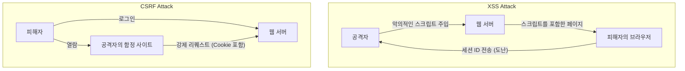

## 시작하며

현대 웹 애플리케이션에서 보안은 단순한 추가 기능이 아니라 시스템의 기반을 이루는 가장 중요한 요소 중 하나입니다. 그 중에서도 **XSS (Cross-Site Scripting)**와 **CSRF (Cross-Site Request Forgery)**는 역사가 오래되었고 여전히 많은 웹 애플리케이션에서 발견되는 심각한 취약점입니다. 이들은 종종 혼동되기 쉽지만, 공격의 메커니즘도 그에 대한 방어책도 근본적으로 다릅니다.

이 글에서는 XSS와 CSRF의 본질적인 차이를 밝히고, 공격자가 어떻게 이러한 취약점을 악용하는지, 그리고 개발자가 구현해야 할 모던 방어책에 대해 역사적인 변천과 함께 자세히 해설합니다.

---

## 1. XSS (Cross-Site Scripting)의 심층

XSS는 공격자가 웹 페이지에 악의적인 스크립트(주로 JavaScript)를 주입하고, 해당 페이지를 열람한 다른 사용자의 브라우저에서 그 스크립트를 실행시키는 공격 기법입니다. 이 공격의 본질은 "신뢰할 수 없는 데이터가 적절한 처리를 거치지 않고 실행 가능한 코드로 해석되어 버리는 것"에 있습니다.

### XSS의 3가지 주요 유형

XSS는 악의적인 스크립트가 어떻게 애플리케이션에 주입되고 실행되는지에 따라 크게 3가지 유형으로 분류됩니다.

#### 1. Stored XSS (저장형 XSS)
Stored XSS는 가장 위험한 유형의 XSS입니다. 공격자가 전송한 악의적인 스크립트가 데이터베이스나 파일 시스템 등 서버 측에 영구적으로 저장(축적)됩니다. 그 후, 정상적인 사용자가 해당 데이터를 포함한 페이지를 열람할 때 저장되어 있던 스크립트가 브라우저로 전송되어 실행됩니다.
*   **전형적인 발생 위치:** 댓글란, 게시판, 사용자 프로필, 리뷰 기능 등.
*   **위협:** 영향 범위가 매우 넓으며, 페이지를 연 모든 사용자가 피해를 입을 가능성이 있습니다.

#### 2. Reflected XSS (반사형 XSS)
Reflected XSS는 악의적인 스크립트가 서버에 저장되지 않고 리퀘스트의 일부(URL 파라미터나 폼 데이터 등)로 전송되어, 서버로부터의 리스폰스에 그대로 "반사"되어 포함됨으로써 발생합니다.
*   **전형적인 발생 위치:** 검색 결과 페이지, 에러 메시지 표시, 단계 간의 데이터 전달 등.
*   **공격 기법:** 공격자는 악의적인 파라미터가 포함된 URL을 사용자가 클릭하게 함(피싱 메일이나 SNS 이용)으로써 공격을 성립시킵니다.

#### 3. DOM-based XSS
DOM-based XSS는 서버 측의 처리를 거치지 않고, 클라이언트 사이드(브라우저 상)의 JavaScript가 DOM (Document Object Model)을 부적절하게 조작함으로써 발생합니다.
*   **메커니즘:** 애플리케이션의 JavaScript가 `window.location`이나 `document.referrer` 등 공격자가 제어할 수 있는 소스에서 데이터를 읽어와, 그것을 `innerHTML`이나 `eval()` 등 위험한 싱크(실행 포인트)에 직접 전달해 버림으로써 발생합니다.
*   **위협:** 서버의 로그에 남지 않는 경우가 많아, WAF (Web Application Firewall) 등에 의한 탐지가 어려울 수 있습니다.

### XSS로 인한 피해와 컨텍스트 내 스크립트 실행 수법

XSS가 성공하면, 공격자의 스크립트는 사용자의 브라우저에서 해당 웹 사이트와 동일한 오리진(권한)으로 실행됩니다. 이로 인해 다음과 같은 심각한 피해가 발생합니다.

1.  **세션 하이재킹:** `document.cookie`에 접근하여 세션 ID를 훔쳐 공격자의 서버로 전송합니다. 이로 인해 공격자는 사용자로 위장하여 계정을 탈취할 수 있습니다.
2.  **부정 조작 실행:** 사용자의 권한으로 애플리케이션 내의 임의의 조작(비밀번호 변경, 송금, 메시지 전송 등)을 백그라운드에서 실행시킵니다.
3.  **피싱:** 가짜 로그인 폼을 DOM 상에 그려 사용자의 인증 정보를 직접 훔칩니다.
4.  **멀웨어 배포:** 사용자의 브라우저를 익스플로잇 킷으로 리다이렉트시켜 PC를 멀웨어에 감염시킵니다.

### XSS에 대한 모던 방어책

XSS를 방지하기 위해서는 심층 방어 (Defense in Depth) 접근 방식이 필수적입니다.

#### 1. 컨텍스트에 따른 이스케이프 처리 (Output Encoding)
가장 기본적이고 중요한 대책은 사용자로부터의 입력을 웹 페이지에 출력할 때 무해한 문자열로 변환하는 이스케이프(인코딩) 처리입니다. 중요한 것은 데이터가 출력되는 **컨텍스트(HTML 본문, HTML 속성, JavaScript 내부, CSS 내부, URL 내부 등)**에 따라 적절한 이스케이프 방식을 선택하는 것입니다. 현대의 많은 웹 프레임워크(React, Vue, Angular 등)는 기본적으로 HTML 이스케이프를 수행하지만, 그래도 주의가 필요합니다.

#### 2. CSP (Content Security Policy) 도입
CSP는 XSS에 대한 매우 강력한 방어 메커니즘으로, 브라우저가 로드 및 실행을 허용하는 리소스의 화이트리스트를 HTTP 헤더로 정의합니다.
```http
Content-Security-Policy: default-src 'self'; script-src 'self' https://trusted.cdn.com;
```
이로 인해 가령 공격자가 인라인 스크립트 `<script>alert(1)</script>`를 주입할 수 있었다 하더라도, CSP에 의해 실행이 차단됩니다.

#### 3. HttpOnly Cookie 속성 활용
세션 ID 등을 저장하는 Cookie에 `HttpOnly` 속성을 부여함으로써, JavaScript(예: `document.cookie`)에서 해당 Cookie에 접근할 수 없게 됩니다. 이는 XSS 자체의 발생을 막는 것은 아니지만, XSS로 인한 세션 하이재킹의 위험을 대폭 낮추는 중요한 완화책입니다.

---

## 2. CSRF (Cross-Site Request Forgery)의 본질

CSRF는 공격자가 사용자를 함정 사이트로 유도하고, 그 사용자가 이미 인증(로그인)되어 있는 다른 웹 사이트에 대해 의도치 않은 요청을 강제로 전송하게 만드는 공격입니다.

XSS가 "브라우저 내에서 부정 스크립트를 실행시키는 것"에 비해, CSRF는 "브라우저의 표준적인 동작(Cookie의 자동 전송)을 악용하여 부정 요청을 전송시키는 것"이라는 점이 결정적으로 다릅니다.

### CSRF의 메커니즘: "Cookie의 자동 전송" 악용

브라우저는 어떤 도메인에 대한 요청을 전송할 때, 그 도메인에 연결된 Cookie(세션 Cookie 등)를 자동으로 헤더에 부여하여 전송합니다. 이는 다른 도메인(공격자의 사이트)에 위치한 이미지 태그나 폼으로부터의 요청이더라도 마찬가지입니다.

**공격 시나리오:**
1.  사용자가 은행 사이트 (`bank.example.com`)에 로그인하고 세션 Cookie를 받습니다.
2.  사용자가 다른 탭에서 공격자의 함정 사이트 (`attacker.example.com`)를 열람합니다.
3.  함정 사이트에는 다음과 같은 숨김 폼과 자동 전송 스크립트가 장치되어 있습니다.
    ```html
    <form action="https://bank.example.com/transfer" method="POST" id="csrf-form">
        <input type="hidden" name="toAccount" value="ATTACKER_ACCOUNT">
        <input type="hidden" name="amount" value="1000000">
    </form>
    <script>document.getElementById('csrf-form').submit();</script>
    ```
4.  브라우저는 `bank.example.com`으로 POST 요청을 전송합니다. 이때 **은행 사이트의 세션 Cookie가 자동으로 부여됩니다.**
5.  은행 서버는 정상적인 세션 Cookie가 포함되어 있으므로 정당한 사용자로부터의 요청으로 처리하고, 부정 송금이 실행됩니다.

### CSRF에 대한 방어책의 역사적 변천과 최신 프랙티스

CSRF를 방지하기 위해서는 리퀘스트가 "의도한 정당한 페이지에서 전송된 것인지"를 검증해야 합니다.

#### 1. CSRF 토큰 (Anti-CSRF Tokens): 전통적이고 확실한 방어
가장 오래전부터 널리 사용되고 있는 확실한 방어책은 CSRF 토큰(Synchronizer Token Pattern)입니다.
*   서버는 세션마다 예측 불가능한 랜덤한 토큰을 생성하여 서버 측(세션 등)에 저장합니다.
*   클라이언트에게 전송하는 HTML 폼 내에 이 토큰을 hidden 필드로 임베드합니다.
*   폼 전송 시, 서버는 보내온 토큰과 서버 측에 저장된 토큰을 비교하여, 일치하는 경우에만 요청을 처리합니다.
공격자는 함정 사이트에서 리퀘스트를 전송시킬 수는 있지만, 대상 사이트의 페이지를 읽어 올바른 토큰을 취득하는 것은 불가능(Same-Origin Policy에 의해)하므로 공격은 실패합니다.

#### 2. Double Submit Cookie 패턴
서버 측에서 상태(세션)를 갖지 않는 API 등에서 자주 사용되는 기법입니다.
*   서버는 랜덤한 토큰을 생성하여 Cookie로 클라이언트에게 전송합니다.
*   클라이언트의 JavaScript는 그 Cookie의 값을 읽어 리퀘스트 헤더(예: `X-CSRF-Token`)에 설정하여 전송합니다.
*   서버는 Cookie 내의 토큰 값과 헤더 내의 토큰 값이 일치하는지를 검증합니다.
공격자는 Cookie를 자동 전송시킬 수는 있지만, JavaScript로 다른 도메인의 Cookie를 읽어 헤더에 설정할 수는 없기 때문에 방지할 수 있습니다.

#### 3. SameSite Cookie 속성: 모던 브라우저에 의한 강력한 방어
최근 가장 권장되는 강력한 방어책이 Cookie의 `SameSite` 속성입니다. 이는 크로스 사이트 리퀘스트 시의 Cookie 전송 동작을 제어하는 것입니다.

*   `SameSite=Strict`: 링크 클릭 등의 톱 레벨 내비게이션을 포함해, 어떠한 크로스 사이트 리퀘스트에서도 Cookie는 전송되지 않습니다. 가장 안전하지만, 다른 사이트에서의 링크로 로그인 상태가 유지되지 않는 등 UX에 영향을 줄 가능성이 있습니다.
*   `SameSite=Lax`: 이미지 로딩이나 POST 요청 등의 크로스 사이트 리퀘스트에서는 Cookie가 전송되지 않지만, 링크 클릭(GET 요청)에 의한 톱 레벨 내비게이션에서는 전송됩니다. 현재 많은 브라우저의 기본 동작입니다. 이를 통해 악의적인 POST 폼 전송에 의한 CSRF의 대부분을 방지할 수 있습니다.
*   `SameSite=None`: 크로스 사이트 리퀘스트에서도 항상 Cookie가 전송됩니다. (반드시 `Secure` 속성과 세트로 지정해야 합니다).

SameSite 속성을 적절히 설정함으로써, 브라우저 레벨에서 CSRF의 근본적인 원인(Cookie의 자동 전송)을 차단할 수 있습니다.

---

## XSS와 CSRF의 상관관계와 요약

다음 그림은 공격 흐름의 차이를 보여줍니다.



XSS와 CSRF는 서로 다른 취약점이지만, **XSS가 존재하는 경우 대부분의 CSRF 대책은 무력화됩니다**. 왜냐하면 XSS에 의해 실행된 스크립트는 정상적인 페이지 내에서 동작하고 있기 때문에, CSRF 토큰을 읽어내거나 동일한 오리진에서 요청을 전송하는 것이 가능하기 때문입니다.

따라서 웹 애플리케이션의 보안을 담보하기 위해서는, 먼저 XSS를 철저히 봉쇄하고(적절한 이스케이프와 CSP), 그 위에 CSRF 대책(SameSite Cookie와 CSRF 토큰)을 구현하는 견고한 기반 구축이 요구됩니다.

개발자는 프레임워크가 제공하는 보안 기능을 과신하지 말고, 이러한 취약점들의 본질적인 메커니즘을 이해하고 적절한 계층에서의 방어를 설계하는 것이 중요합니다.
