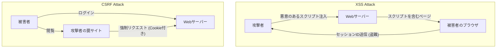

## はじめに

現代のWebアプリケーションにおいて、セキュリティは単なる追加機能ではなく、システムの基盤を成す最も重要な要素の一つです。その中でも、**XSS (Cross-Site Scripting)** と **CSRF (Cross-Site Request Forgery)** は、歴史が古く、かつ未だに多くのWebアプリケーションで発見される深刻な脆弱性です。これらはしばしば混同されがちですが、攻撃のメカニズムも、それに対する防御策も根本的に異なります。

この記事では、XSSとCSRFの本質的な違いを解き明かし、攻撃者がどのようにこれらの脆弱性を悪用するのか、そして開発者が実装すべきモダンな防御策について、歴史的な変遷を交えながら詳細に解説します。

---

## 1. XSS (Cross-Site Scripting) の深層

XSSは、攻撃者がWebページに悪意のあるスクリプト（主にJavaScript）を注入し、そのページを閲覧した他のユーザーのブラウザ上でそのスクリプトを実行させる攻撃手法です。この攻撃の本質は、「信頼されていないデータが、適切な処理を経ずに実行可能なコードとして解釈されてしまうこと」にあります。

### XSSの3つの主要なタイプ

XSSは、悪意のあるスクリプトがどのようにアプリケーションに注入され、実行されるかによって、大きく3つのタイプに分類されます。

#### 1. Stored XSS (蓄積型XSS)
Stored XSSは、最も危険なタイプのXSSです。攻撃者が送信した悪意のあるスクリプトが、データベースやファイルシステムなどのサーバー側に永続的に保存（蓄積）されます。その後、正規のユーザーがそのデータを含むページを閲覧した際に、保存されていたスクリプトがブラウザに送信され、実行されます。
*   **典型的な発生箇所:** コメント欄、掲示板、ユーザープロフィール、レビュー機能など。
*   **脅威:** 影響範囲が非常に広く、ページを開いたすべてのユーザーが被害に遭う可能性があります。

#### 2. Reflected XSS (反射型XSS)
Reflected XSSは、悪意のあるスクリプトがサーバーに保存されることなく、リクエストの一部（URLパラメータやフォームデータなど）として送信され、サーバーからのレスポンスにそのまま「反射」して含まれることで発生します。
*   **典型的な発生箇所:** 検索結果ページ、エラーメッセージの表示、ステップ間のデータ受け渡しなど。
*   **攻撃手法:** 攻撃者は、悪意のあるパラメータを含むURLをユーザーにクリックさせる（フィッシングメールやSNSを利用）ことで攻撃を成立させます。

#### 3. DOM-based XSS
DOM-based XSSは、サーバー側の処理を経由せず、クライアントサイド（ブラウザ上）のJavaScriptがDOM (Document Object Model) を不適切に操作することで発生します。
*   **メカニズム:** アプリケーションのJavaScriptが、`window.location` や `document.referrer` などの攻撃者が制御可能なソースからデータを読み取り、それを `innerHTML` や `eval()` などの危険なシンク（実行ポイント）に直接渡してしまうことで発生します。
*   **脅威:** サーバーのログに残らないことが多く、WAF (Web Application Firewall) などによる検知が困難な場合があります。

### XSSによる被害とコンテキスト内スクリプト実行の手口

XSSが成功すると、攻撃者のスクリプトはユーザーのブラウザ上で、そのWebサイトと同じオリジン（権限）で実行されます。これにより、以下のような深刻な被害が生じます。

1.  **セッションハイジャック:** `document.cookie` にアクセスしてセッションIDを盗み出し、攻撃者のサーバーに送信します。これにより、攻撃者はユーザーになりすましてアカウントを乗っ取ることができます。
2.  **不正な操作の実行:** ユーザーの権限で、アプリケーション内の任意の操作（パスワード変更、送金、メッセージ送信など）をバックグラウンドで実行させます。
3.  **フィッシング:** 偽のログインフォームをDOM上に描画し、ユーザーの認証情報を直接盗み出します。
4.  **マルウェアの配布:** ユーザーのブラウザをエクスプロイトキットにリダイレクトさせ、PCをマルウェアに感染させます。

### XSSに対するモダンな防御策

XSSを防ぐためには、多層防御 (Defense in Depth) のアプローチが不可欠です。

#### 1. コンテキストに応じたエスケープ処理 (Output Encoding)
最も基本的かつ重要な対策は、ユーザーからの入力をWebページに出力する際に、無害な文字列に変換するエスケープ（エンコーディング）処理です。重要なのは、データが出力される**コンテキスト（HTML本文、HTML属性、JavaScript内、CSS内、URL内など）** に応じて、適切なエスケープ方式を選択することです。現代の多くのWebフレームワーク（React, Vue, Angularなど）は、デフォルトでHTMLエスケープを行いますが、それでも注意が必要です。

#### 2. CSP (Content Security Policy) の導入
CSPは、XSSに対する非常に強力な防御メカニズムであり、ブラウザが読み込み・実行を許可するリソースのホワイトリストをHTTPヘッダーで定義します。
```http
Content-Security-Policy: default-src 'self'; script-src 'self' https://trusted.cdn.com;
```
これにより、仮に攻撃者がインラインスクリプト `<script>alert(1)</script>` を注入できたとしても、CSPによって実行がブロックされます。

#### 3. HttpOnly Cookie属性の活用
セッションIDなどを格納するCookieに `HttpOnly` 属性を付与することで、JavaScript (例: `document.cookie`) からそのCookieにアクセスできなくなります。これはXSS自体の発生を防ぐものではありませんが、XSSによるセッションハイジャックのリスクを大幅に低減させる重要な緩和策です。

---

## 2. CSRF (Cross-Site Request Forgery) の本質

CSRFは、攻撃者がユーザーを罠サイトに誘導し、そのユーザーがすでに認証（ログイン）している別のWebサイトに対して、意図しないリクエストを強制的に送信させる攻撃です。

XSSが「ブラウザ内で不正なスクリプトを実行させる」のに対し、CSRFは「ブラウザの標準的な動作（Cookieの自動送信）を悪用して不正なリクエストを送信させる」という点が決定的に異なります。

### CSRFのメカニズム：「Cookieの自動送信」の悪用

ブラウザは、あるドメインに対するリクエストを送信する際、そのドメインに関連付けられたCookie（セッションCookieなど）を自動的にヘッダーに付与して送信します。これは、別ドメイン（攻撃者のサイト）に置かれた画像タグやフォームからのリクエストであっても同様です。

**攻撃のシナリオ:**
1.  ユーザーが銀行サイト (`bank.example.com`) にログインし、セッションCookieを受け取ります。
2.  ユーザーが別のタブで攻撃者の罠サイト (`attacker.example.com`) を閲覧します。
3.  罠サイトには、以下のような隠しフォームと自動送信スクリプトが仕掛けられています。
    ```html
    <form action="https://bank.example.com/transfer" method="POST" id="csrf-form">
        <input type="hidden" name="toAccount" value="ATTACKER_ACCOUNT">
        <input type="hidden" name="amount" value="1000000">
    </form>
    <script>document.getElementById('csrf-form').submit();</script>
    ```
4.  ブラウザは `bank.example.com` へのPOSTリクエストを送信します。この時、**銀行サイトのセッションCookieが自動的に付与されます。**
5.  銀行サーバーは、正規のセッションCookieが含まれているため、正当なユーザーからのリクエストとして処理し、不正な送金が実行されます。

### CSRFに対する防御策の歴史的変遷と最新プラクティス

CSRFを防ぐためには、リクエストが「意図した正当なページから送信されたものか」を検証する必要があります。

#### 1. CSRFトークン (Anti-CSRF Tokens) : 伝統的かつ確実な防御
最も古くから広く使われている確実な防御策は、CSRFトークン（Synchronizer Token Pattern）です。
*   サーバーは、セッションごとに予測不可能なランダムなトークンを生成し、サーバー側（セッションなど）に保存します。
*   クライアントに送信するHTMLフォーム内に、このトークンをhiddenフィールドとして埋め込みます。
*   フォーム送信時、サーバーは送られてきたトークンとサーバー側に保存されているトークンを比較し、一致した場合のみリクエストを処理します。
攻撃者は罠サイトからリクエストを送信させることはできても、対象サイトのページを読み取って正しいトークンを取得することはできない（Same-Origin Policyにより）ため、攻撃は失敗します。

#### 2. Double Submit Cookie パターン
サーバー側で状態（セッション）を持たないAPIなどでよく用いられる手法です。
*   サーバーはランダムなトークンを生成し、Cookieとしてクライアントに送信します。
*   クライアントのJavaScriptは、そのCookieの値を読み取り、リクエストヘッダー（例: `X-CSRF-Token`）にセットして送信します。
*   サーバーは、Cookie内のトークン値とヘッダー内のトークン値が一致するかを検証します。
攻撃者はCookieを自動送信させることはできますが、JavaScriptで別ドメインのCookieを読み取ってヘッダーにセットすることはできないため、防ぐことができます。

#### 3. SameSite Cookie属性 : モダンブラウザによる強力な防御
近年、最も推奨される強力な防御策がCookieの `SameSite` 属性です。これは、クロスサイトリクエスト時のCookieの送信挙動を制御するものです。

*   `SameSite=Strict`: リンククリックなどのトップレベルナビゲーションを含め、いかなるクロスサイトリクエストでもCookieは送信されません。最も安全ですが、別サイトからのリンクでログイン状態が維持されないなど、UXに影響を与える可能性があります。
*   `SameSite=Lax`: 画像の読み込みやPOSTリクエストなどのクロスサイトリクエストではCookieは送信されませんが、リンククリック（GETリクエスト）によるトップレベルナビゲーションでは送信されます。現在の多くのブラウザのデフォルトの挙動です。これにより、悪意のあるPOSTフォーム送信によるCSRFの大部分を防ぐことができます。
*   `SameSite=None`: クロスサイトリクエストでも常にCookieが送信されます。（必ず `Secure` 属性とセットで指定する必要があります）。

SameSite属性を適切に設定することで、ブラウザレベルでCSRFの根本的な原因（Cookieの自動送信）をブロックすることができます。

---

## XSSとCSRFの相関関係とまとめ

以下の図は、攻撃の流れの違いを示しています。



XSSとCSRFは異なる脆弱性ですが、**XSSが存在する場合、ほとんどのCSRF対策は無効化されます**。なぜなら、XSSによって実行されたスクリプトは、正規のページ内で動いているため、CSRFトークンを読み取ったり、同じオリジンからリクエストを送信したりすることが可能だからです。

したがって、Webアプリケーションのセキュリティを担保するためには、まずXSSを徹底的に封じ込め（適切なエスケープとCSP）、その上でCSRF対策（SameSite CookieとCSRFトークン）を実装するという、強固な基盤構築が求められます。

開発者は、フレームワークが提供するセキュリティ機能を過信せず、これらの脆弱性の本質的なメカニズムを理解し、適切な層での防御を設計することが重要です。
