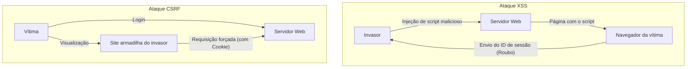

## Introdução

Em aplicações Web modernas, a segurança não é apenas uma funcionalidade adicional, mas um dos elementos mais importantes que formam a base do sistema. Entre eles, **XSS (Cross-Site Scripting)** e **CSRF (Cross-Site Request Forgery)** são vulnerabilidades graves com um longo histórico e que ainda são encontradas em muitas aplicações Web. Eles são frequentemente confundidos, mas tanto seus mecanismos de ataque quanto as medidas de defesa contra eles são fundamentalmente diferentes.

Neste artigo, desvendaremos as diferenças essenciais entre XSS e CSRF, como os invasores exploram essas vulnerabilidades e as defesas modernas que os desenvolvedores devem implementar, com explicações detalhadas incluindo a evolução histórica.

---

## 1. As profundezas do XSS (Cross-Site Scripting)

O XSS é um método de ataque onde um invasor injeta scripts maliciosos (principalmente JavaScript) em uma página Web, fazendo com que o script seja executado nos navegadores de outros usuários que visitam essa página. A essência deste ataque reside no fato de que "dados não confiáveis são interpretados como código executável sem passar por processamento adequado".

### 3 tipos principais de XSS

O XSS é amplamente classificado em três tipos, dependendo de como o script malicioso é injetado e executado na aplicação.

#### 1. Stored XSS (XSS Armazenado)
O Stored XSS é o tipo mais perigoso de XSS. O script malicioso enviado pelo invasor é salvo de forma permanente (armazenado) no lado do servidor, como em um banco de dados ou sistema de arquivos. Posteriormente, quando um usuário legítimo visualiza a página que contém esses dados, o script armazenado é enviado ao navegador e executado.
*   **Locais típicos de ocorrência:** Seções de comentários, fóruns de discussão, perfis de usuários, recursos de avaliação, etc.
*   **Ameaça:** O escopo do impacto é muito amplo, e todos os usuários que abrirem a página podem ser vítimas.

#### 2. Reflected XSS (XSS Refletido)
O Reflected XSS ocorre quando um script malicioso não é salvo no servidor, mas é enviado como parte de uma requisição (como parâmetros de URL ou dados de formulário) e é incluído "refletido" como está na resposta do servidor.
*   **Locais típicos de ocorrência:** Páginas de resultados de busca, exibição de mensagens de erro, transferência de dados entre etapas, etc.
*   **Método de ataque:** Os invasores realizam o ataque fazendo com que os usuários cliquem em URLs que contêm parâmetros maliciosos (usando e-mails de phishing ou redes sociais).

#### 3. DOM-based XSS
O DOM-based XSS não passa pelo processamento do lado do servidor, mas ocorre quando o JavaScript no lado do cliente (no navegador) manipula indevidamente o DOM (Document Object Model).
*   **Mecanismo:** Ocorre quando o JavaScript da aplicação lê dados de fontes que o invasor pode controlar, como `window.location` ou `document.referrer`, e os passa diretamente para pontos de execução (sinks) perigosos, como `innerHTML` ou `eval()`.
*   **Ameaça:** Muitas vezes não deixa rastros nos logs do servidor, tornando difícil a detecção por WAFs (Web Application Firewalls) e afins.

### Danos causados pelo XSS e técnicas de execução de scripts em contexto

Quando o XSS é bem-sucedido, o script do invasor é executado no navegador do usuário com a mesma origem (privilégios) do site. Isso leva aos seguintes danos graves:

1.  **Sequestro de Sessão (Session Hijacking):** Acessa `document.cookie` para roubar o ID da sessão e enviá-lo ao servidor do invasor. Isso permite que o invasor assuma a identidade do usuário e roube sua conta.
2.  **Execução de ações não autorizadas:** Faz com que qualquer operação dentro da aplicação (mudança de senha, transferência de dinheiro, envio de mensagens, etc.) seja executada em segundo plano com as permissões do usuário.
3.  **Phishing:** Renderiza um formulário de login falso no DOM para roubar as credenciais do usuário diretamente.
4.  **Distribuição de malware:** Redireciona o navegador do usuário para kits de exploração, infectando o PC com malware.

### Defesas modernas contra XSS

Para prevenir o XSS, uma abordagem de Defesa em Profundidade (Defense in Depth) é essencial.

#### 1. Tratamento de escape (Output Encoding) de acordo com o contexto
A medida mais fundamental e importante é o processamento de escape (codificação) que converte a entrada do usuário em strings inofensivas ao emiti-la em uma página da Web. O importante é escolher o método de escape apropriado de acordo com o **contexto (corpo HTML, atributos HTML, dentro de JavaScript, dentro de CSS, dentro de URL, etc.)** onde os dados são gerados. Muitos frameworks da web modernos (React, Vue, Angular, etc.) realizam escape de HTML por padrão, mas ainda requerem atenção.

#### 2. Introdução de CSP (Content Security Policy)
O CSP é um mecanismo de defesa muito poderoso contra XSS, definindo no cabeçalho HTTP uma lista branca (whitelist) de recursos que o navegador está autorizado a carregar e executar.
```http
Content-Security-Policy: default-src 'self'; script-src 'self' https://trusted.cdn.com;
```
Com isso, mesmo que um invasor consiga injetar um script inline `<script>alert(1)</script>`, sua execução será bloqueada pelo CSP.

#### 3. Utilização do atributo Cookie HttpOnly
Ao adicionar o atributo `HttpOnly` a cookies que armazenam IDs de sessão, etc., esses cookies não poderão ser acessados a partir do JavaScript (ex: `document.cookie`). Isso não impede que o XSS em si ocorra, mas é uma medida de mitigação importante que reduz significativamente o risco de sequestro de sessão por meio de XSS.

---

## 2. A essência do CSRF (Cross-Site Request Forgery)

CSRF é um ataque no qual um invasor induz um usuário a visitar um site armadilha, forçando-o a enviar requisições não intencionais a outro site onde o usuário já está autenticado (logado).

Enquanto o XSS "executa scripts maliciosos dentro do navegador", o CSRF é fundamentalmente diferente no sentido de que "explora o comportamento padrão do navegador (envio automático de cookies) para enviar requisições maliciosas".

### Mecanismo do CSRF: Exploração do "envio automático de cookies"

Quando um navegador envia uma requisição a um determinado domínio, ele adiciona automaticamente os cookies associados a esse domínio (como cookies de sessão) ao cabeçalho. Isso é verdade mesmo para requisições de tags de imagem ou formulários localizados em outro domínio (o site do invasor).

**Cenário de ataque:**
1.  O usuário faz login no site do banco (`bank.example.com`) e recebe um cookie de sessão.
2.  O usuário navega para o site armadilha do invasor (`attacker.example.com`) em outra guia.
3.  O site armadilha possui um formulário oculto e um script de envio automático configurado como este:
    ```html
    <form action="https://bank.example.com/transfer" method="POST" id="csrf-form">
        <input type="hidden" name="toAccount" value="ATTACKER_ACCOUNT">
        <input type="hidden" name="amount" value="1000000">
    </form>
    <script>document.getElementById('csrf-form').submit();</script>
    ```
4.  O navegador envia uma requisição POST para `bank.example.com`. Neste momento, **o cookie de sessão do site do banco é adicionado automaticamente.**
5.  O servidor do banco o processa como uma solicitação de um usuário legítimo, pois contém um cookie de sessão válido, e a transferência fraudulenta é executada.

### Evolução histórica das defesas contra CSRF e práticas mais recentes

Para evitar o CSRF, é necessário verificar se a requisição "foi enviada da página legítima pretendida".

#### 1. Tokens CSRF (Anti-CSRF Tokens): Defesa tradicional e confiável
A defesa mais confiável e amplamente utilizada há mais tempo é o Token CSRF (Padrão Synchronizer Token).
*   O servidor gera um token aleatório e imprevisível para cada sessão e o salva no lado do servidor (como na sessão).
*   Incorpore este token como um campo oculto (hidden) no formulário HTML enviado ao cliente.
*   Ao enviar o formulário, o servidor compara o token enviado com o token armazenado no servidor e processa a solicitação apenas se eles corresponderem.
Os invasores podem forçar o envio de requisições a partir do site armadilha, mas não podem ler a página do site de destino para obter o token correto (devido à Política de Mesma Origem (Same-Origin Policy)), portanto, o ataque falha.

#### 2. Padrão Double Submit Cookie
Esta é uma técnica frequentemente usada em APIs que não possuem estado (sessões) no lado do servidor.
*   O servidor gera um token aleatório e o envia ao cliente como um cookie.
*   O JavaScript do cliente lê o valor desse cookie e o define no cabeçalho da requisição (ex: `X-CSRF-Token`) para enviá-lo.
*   O servidor verifica se o valor do token no cookie e o valor do token no cabeçalho correspondem.
Os invasores podem forçar o envio automático de cookies, mas não podem usar JavaScript para ler os cookies de outro domínio e defini-los no cabeçalho, assim isso pode ser prevenido.

#### 3. Atributo SameSite Cookie: Defesa poderosa por navegadores modernos
Nos últimos anos, a defesa mais poderosa e recomendada é o atributo `SameSite` do cookie. Ele controla o comportamento de envio de cookies durante requisições de origem cruzada (cross-site).

*   `SameSite=Strict`: O cookie não será enviado em nenhuma requisição de origem cruzada, incluindo navegações de nível superior, como cliques em links. É o mais seguro, mas pode afetar a experiência do usuário (UX), como não manter o status de login ao clicar em um link de outro site.
*   `SameSite=Lax`: Os cookies não são enviados em requisições de origem cruzada, como carregamento de imagens ou requisições POST, mas são enviados em navegações de nível superior por meio de cliques em links (requisições GET). É o comportamento padrão em muitos navegadores atuais. Isso pode evitar a maioria das vulnerabilidades CSRF por envios de formulários POST maliciosos.
*   `SameSite=None`: O cookie sempre será enviado, mesmo em requisições de origem cruzada. (Deve ser sempre especificado em conjunto com o atributo `Secure`).

Ao configurar adequadamente o atributo SameSite, a causa raiz do CSRF (envio automático de cookies) pode ser bloqueada no nível do navegador.

---

## Correlação entre XSS e CSRF e Resumo

A figura abaixo mostra a diferença no fluxo de ataques.



XSS e CSRF são vulnerabilidades diferentes, mas **se o XSS existir, a maioria das defesas contra CSRF será invalidada**. Isso porque os scripts executados por XSS estão sendo executados em páginas legítimas, tornando possível ler tokens CSRF e enviar requisições da mesma origem.

Portanto, para garantir a segurança de uma aplicação Web, é necessária a construção de uma base sólida: primeiro, conter completamente o XSS (com escapes adequados e CSP), e então implementar as defesas contra CSRF (Cookies SameSite e tokens CSRF).

É importante que os desenvolvedores não confiem cegamente nos recursos de segurança fornecidos por frameworks, mas que entendam os mecanismos essenciais dessas vulnerabilidades e projetem a defesa em camadas adequadas.
