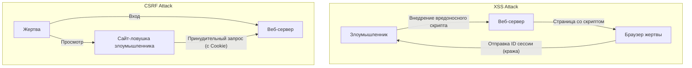

## Введение

В современных веб-приложениях безопасность — это не просто дополнительная функция, а один из самых важных элементов, составляющих основу системы. Среди них **XSS (Межсайтовый скриптинг - Cross-Site Scripting)** и **CSRF (Подделка межсайтовых запросов - Cross-Site Request Forgery)** — серьезные уязвимости с давней историей, которые до сих пор обнаруживаются во многих веб-приложениях. Их часто путают, но механизмы атак и меры защиты от них принципиально отличаются.

В этой статье мы раскроем фундаментальные различия между XSS и CSRF, подробно рассмотрим, как злоумышленники эксплуатируют эти уязвимости, и какие современные меры защиты должны внедрять разработчики, с учетом исторического контекста.

---

## 1. Глубокое погружение в XSS (Cross-Site Scripting)

XSS — это метод атаки, при котором злоумышленник внедряет вредоносный скрипт (в основном JavaScript) на веб-страницу, заставляя этот скрипт выполняться в браузерах других пользователей, просматривающих эту страницу. Суть этой атаки заключается в том, что «ненадежные данные интерпретируются как исполняемый код без надлежащей обработки».

### 3 основных типа XSS

XSS в целом делится на три типа в зависимости от того, как вредоносный скрипт внедряется в приложение и выполняется.

#### 1. Stored XSS (Хранимый XSS)
Stored XSS является наиболее опасным типом XSS. Вредоносный скрипт, отправленный злоумышленником, постоянно сохраняется (накапливается) на стороне сервера, например, в базе данных или файловой системе. Затем, когда обычный пользователь просматривает страницу, содержащую эти данные, сохраненный скрипт отправляется в его браузер и выполняется.
*   **Типичные места возникновения:** Разделы комментариев, доски объявлений, профили пользователей, функции отзывов и т. д.
*   **Угроза:** Масштаб воздействия очень широк, и потенциальными жертвами могут стать все пользователи, открывшие страницу.

#### 2. Reflected XSS (Отраженный XSS)
Reflected XSS возникает, когда вредоносный скрипт отправляется как часть запроса (например, параметры URL или данные формы) без сохранения на сервере, и «отражается» обратно в ответе от сервера в неизменном виде.
*   **Типичные места возникновения:** Страницы результатов поиска, отображение сообщений об ошибках, передача данных между шагами и т. д.
*   **Метод атаки:** Злоумышленник осуществляет атаку, заставляя пользователя кликнуть по URL, содержащему вредоносные параметры (используя фишинговые электронные письма или социальные сети).

#### 3. DOM-based XSS
DOM-based XSS возникает, когда JavaScript на стороне клиента (в браузере) ненадлежащим образом манипулирует DOM (Document Object Model), не проходя через обработку на стороне сервера.
*   **Механизм:** Возникает, когда JavaScript приложения считывает данные из источников, контролируемых злоумышленником, таких как `window.location` или `document.referrer`, и передает их напрямую в опасные точки выполнения (стоки), такие как `innerHTML` или `eval()`.
*   **Угроза:** Часто не оставляет следов в журналах сервера и может быть трудно обнаружить с помощью WAF (Web Application Firewall) и т. п.

### Ущерб от XSS и методы выполнения скриптов в контексте

В случае успешного XSS скрипт злоумышленника выполняется в браузере пользователя с тем же источником (привилегиями), что и сам веб-сайт. Это приводит к следующим серьезным последствиям:

1.  **Перехват сеанса:** Получение доступа к `document.cookie` для кражи идентификатора сеанса и его отправки на сервер злоумышленника. Это позволяет злоумышленнику выдать себя за пользователя и перехватить контроль над аккаунтом.
2.  **Выполнение несанкционированных операций:** Выполнение произвольных операций в приложении (изменение пароля, денежный перевод, отправка сообщений и т. д.) в фоновом режиме от имени пользователя.
3.  **Фишинг:** Отрисовка поддельной формы входа в DOM и прямая кража учетных данных пользователя.
4.  **Распространение вредоносного ПО:** Перенаправление браузера пользователя на набор эксплойтов, заражая компьютер вредоносным ПО.

### Современные меры защиты от XSS

Для предотвращения XSS необходим подход глубокоэшелонированной защиты (Defense in Depth).

#### 1. Экранирование в зависимости от контекста (Output Encoding)
Самой базовой и важной мерой является экранирование (кодирование) ввода пользователя, преобразующее его в безопасные строки перед выводом на веб-страницу. Важно выбрать правильный метод экранирования в зависимости от **контекста вывода данных (тело HTML, атрибуты HTML, внутри JavaScript, внутри CSS, внутри URL и т. д.)**. Многие современные веб-фреймворки (React, Vue, Angular и т. д.) выполняют HTML-экранирование по умолчанию, но осторожность по-прежнему необходима.

#### 2. Внедрение CSP (Content Security Policy)
CSP — это очень мощный механизм защиты от XSS, определяющий в HTTP-заголовке белый список ресурсов, которые браузеру разрешено загружать и выполнять.
```http
Content-Security-Policy: default-src 'self'; script-src 'self' https://trusted.cdn.com;
```
Таким образом, даже если злоумышленнику удастся внедрить встроенный скрипт `<script>alert(1)</script>`, его выполнение будет заблокировано CSP.

#### 3. Использование атрибута HttpOnly для Cookie
Добавление атрибута `HttpOnly` к файлам cookie, в которых хранятся идентификаторы сеансов, предотвращает доступ к ним из JavaScript (например, `document.cookie`). Хотя это не предотвращает само возникновение XSS, это важная мера смягчения последствий, значительно снижающая риск перехвата сеанса через XSS.

---

## 2. Суть CSRF (Cross-Site Request Forgery)

CSRF — это атака, при которой злоумышленник заманивает пользователя на поддельный сайт и заставляет его отправить непреднамеренный запрос к другому веб-сайту, на котором пользователь уже аутентифицирован (вошел в систему).

Главное отличие заключается в том, что в то время как XSS заставляет "выполняться вредоносный скрипт внутри браузера", CSRF злоупотребляет "стандартным поведением браузера (автоматической отправкой файлов cookie) для отправки несанкционированного запроса".

### Механизм CSRF: злоупотребление "автоматической отправкой файлов cookie"

Когда браузер отправляет запрос к определенному домену, он автоматически прикрепляет в заголовок файлы cookie, связанные с этим доменом (например, сеансовые файлы cookie). Это происходит даже в том случае, если запрос исходит от тега изображения или формы, размещенной на другом домене (сайте злоумышленника).

**Сценарий атаки:**
1.  Пользователь входит на сайт банка (`bank.example.com`) и получает сеансовый файл cookie.
2.  Пользователь в другой вкладке просматривает сайт-ловушку злоумышленника (`attacker.example.com`).
3.  На сайте-ловушке размещена скрытая форма и скрипт для автоматической отправки, как показано ниже.
    ```html
    <form action="https://bank.example.com/transfer" method="POST" id="csrf-form">
        <input type="hidden" name="toAccount" value="ATTACKER_ACCOUNT">
        <input type="hidden" name="amount" value="1000000">
    </form>
    <script>document.getElementById('csrf-form').submit();</script>
    ```
4.  Браузер отправляет POST-запрос на `bank.example.com`. В этот момент **автоматически прикрепляется сеансовый файл cookie сайта банка.**
5.  Поскольку запрос содержит действительный сеансовый файл cookie, сервер банка обрабатывает его как запрос от законного пользователя, и выполняется несанкционированный перевод средств.

### Историческое развитие мер защиты от CSRF и современные практики

Чтобы предотвратить CSRF, необходимо проверить, "был ли запрос отправлен с предполагаемой, законной страницы".

#### 1. CSRF-токены (Anti-CSRF Tokens): Традиционная и надежная защита
Самая старая и широко используемая надежная мера защиты — это CSRF-токены (Паттерн токена синхронизации - Synchronizer Token Pattern).
*   Сервер генерирует непредсказуемый случайный токен для каждой сессии и сохраняет его на стороне сервера (например, в сессии).
*   Токен внедряется как скрытое поле в HTML-форму, отправляемую клиенту.
*   При отправке формы сервер сравнивает полученный токен с токеном, сохраненным на сервере, и обрабатывает запрос только в случае их совпадения.
Хотя злоумышленник может заставить отправить запрос с сайта-ловушки, он не может прочитать страницу целевого сайта для получения правильного токена (из-за политики одного источника - Same-Origin Policy), поэтому атака не удается.

#### 2. Паттерн Double Submit Cookie
Этот метод часто используется в API, которые не сохраняют состояние (сессии) на стороне сервера.
*   Сервер генерирует случайный токен и отправляет его клиенту в виде файла cookie.
*   JavaScript на клиенте считывает значение этого файла cookie и устанавливает его в заголовок запроса (например, `X-CSRF-Token`) перед отправкой.
*   Сервер проверяет, совпадает ли значение токена в файле cookie со значением токена в заголовке.
Злоумышленник может заставить файлы cookie отправляться автоматически, но он не может использовать JavaScript для чтения файлов cookie другого домена и установки их в заголовок, что позволяет предотвратить атаку.

#### 3. Атрибут SameSite для Cookie: Мощная защита от современных браузеров
В последние годы наиболее рекомендуемой и мощной мерой защиты является атрибут `SameSite` для файлов cookie. Он контролирует поведение отправки файлов cookie при межсайтовых запросах.

*   `SameSite=Strict`: Файлы cookie не отправляются ни при каких межсайтовых запросах, включая навигацию верхнего уровня, такую ​​как клики по ссылкам. Это наиболее безопасно, но может повлиять на UX, например, не сохраняя статус входа при переходе по ссылке с другого сайта.
*   `SameSite=Lax`: Файлы cookie не отправляются при межсайтовых запросах, таких как загрузка изображений или POST-запросы, но отправляются при навигации верхнего уровня путем клика по ссылке (GET-запрос). В настоящее время это поведение по умолчанию во многих браузерах. Это может предотвратить большинство атак CSRF через отправку вредоносных POST-форм.
*   `SameSite=None`: Файлы cookie всегда отправляются даже при межсайтовых запросах. (Обязательно должен указываться вместе с атрибутом `Secure`).

Путем правильной настройки атрибута SameSite основная причина CSRF (автоматическая отправка файлов cookie) может быть заблокирована на уровне браузера.

---

## Взаимосвязь между XSS и CSRF и заключение

На диаграмме ниже показана разница в ходе атак.



Хотя XSS и CSRF являются разными уязвимостями, **если существует XSS, большинство мер защиты от CSRF становятся недействительными**. Это связано с тем, что скрипт, выполняемый через XSS, работает на законной странице и, следовательно, может считывать CSRF-токены и отправлять запросы из того же источника.

Поэтому для обеспечения безопасности веб-приложений требуется построить прочный фундамент, сначала полностью изолировав XSS (путем надлежащего экранирования и CSP), а затем внедрив меры защиты от CSRF (SameSite Cookie и CSRF-токены).

Разработчикам важно не полагаться чрезмерно на функции безопасности, предоставляемые фреймворками, понимать фундаментальные механизмы этих уязвимостей и проектировать защиту на соответствующих уровнях.
