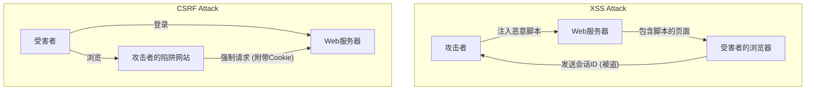

## 引言

在现代Web应用程序中，安全性不再仅仅是一个附加功能，而是构成系统基础的最重要元素之一。其中，**XSS (Cross-Site Scripting，跨站脚本攻击)** 和 **CSRF (Cross-Site Request Forgery，跨站请求伪造)** 是历史悠久且至今仍在许多Web应用程序中被发现的严重漏洞。这二者经常被混淆，但它们的攻击机制以及相应的防御策略在根本上是不同的。

本文将揭示XSS和CSRF的本质区别，详细阐述攻击者是如何恶意利用这些漏洞的，并结合历史演变，讲解开发者应当实现的现代防御策略。

---

## 1. 深入XSS (Cross-Site Scripting)

XSS是攻击者在Web页面中注入恶意脚本（主要是JavaScript），并让浏览该页面的其他用户的浏览器执行该脚本的一种攻击手法。这种攻击的本质在于：“未经验证的数据未经适当处理，就被解析为可执行的代码”。

### XSS的三种主要类型

根据恶意脚本是如何被注入到应用程序中并执行的，XSS大致可以分为三种类型。

#### 1. Stored XSS (存储型XSS)
存储型XSS是最危险的XSS类型。攻击者发送的恶意脚本会被永久地保存（存储）在服务器端，如数据库或文件系统中。随后，当合法用户浏览包含该数据的页面时，保存的脚本就会被发送到浏览器并执行。
*   **典型发生位置:** 评论区、留言板、用户个人资料、评论功能等。
*   **威胁:** 影响范围非常广，所有打开页面的用户都可能成为受害者。

#### 2. Reflected XSS (反射型XSS)
反射型XSS发生在恶意脚本没有被保存在服务器上，而是作为请求的一部分（如URL参数或表单数据）发送，并直接“反射”包含在来自服务器的响应中。
*   **典型发生位置:** 搜索结果页面、错误信息的显示、步骤之间的数据传递等。
*   **攻击手法:** 攻击者通过诱导用户点击包含恶意参数的URL（利用钓鱼邮件或社交网络）来实现攻击。

#### 3. DOM-based XSS (基于DOM的XSS)
基于DOM的XSS不经过服务器端的处理，而是由于客户端（浏览器上）的JavaScript不当地操作了DOM (Document Object Model) 而产生的。
*   **机制:** 应用程序的JavaScript从攻击者可控的源（如 `window.location` 或 `document.referrer`）读取数据，并将其直接传递给 `innerHTML` 或 `eval()` 等危险的执行点（Sink），从而引发该漏洞。
*   **威胁:** 往往不会留在服务器的日志中，有时WAF (Web Application Firewall) 等设备也难以检测。

### XSS造成的危害与上下文脚本执行的手段

一旦XSS攻击成功，攻击者的脚本就会在用户的浏览器上，以与该网站相同的源（权限）执行。这将导致以下严重的危害：

1.  **会话劫持 (Session Hijacking):** 通过访问 `document.cookie` 窃取会话ID，并将其发送到攻击者的服务器。借此，攻击者可以伪装成用户接管账户。
2.  **执行未授权操作:** 利用用户的权限，在后台执行应用程序内的任意操作（更改密码、转账、发送消息等）。
3.  **网络钓鱼:** 在DOM上渲染虚假的登录表单，直接窃取用户的身份验证信息。
4.  **分发恶意软件:** 将用户的浏览器重定向到漏洞利用工具包，使PC感染恶意软件。

### 针对XSS的现代防御策略

为了防止XSS，必须采用纵深防御 (Defense in Depth) 的方法。

#### 1. 根据上下文进行转义处理 (Output Encoding)
最基本且最重要的对策是在将用户的输入输出到Web页面时，进行转义（编码）处理，将其转换为无害的字符串。关键在于，必须根据数据输出的**上下文（HTML正文、HTML属性、JavaScript内、CSS内、URL内等）**，选择适当的转义方式。虽然现代许多Web框架（React、Vue、Angular等）默认进行HTML转义，但仍需保持警惕。

#### 2. 引入CSP (Content Security Policy)
CSP是针对XSS的一种非常强大的防御机制，它通过HTTP请求头定义了浏览器允许加载和执行的资源的白名单。
```http
Content-Security-Policy: default-src 'self'; script-src 'self' https://trusted.cdn.com;
```
这样一来，即使攻击者成功注入了内联脚本 `<script>alert(1)</script>`，CSP也会阻止其执行。

#### 3. 利用HttpOnly Cookie属性
通过为存储会话ID等的Cookie添加 `HttpOnly` 属性，JavaScript (例如: `document.cookie`) 就无法访问该Cookie。这虽然不能防止XSS本身的发生，但它是一个大大降低因XSS导致会话劫持风险的重要缓解措施。

---

## 2. CSRF (Cross-Site Request Forgery) 的本质

CSRF是攻击者诱导用户访问陷阱网站，并强制该用户对已经身份验证（登录）的另一个Web网站发送意外请求的攻击。

XSS是“在浏览器内执行恶意脚本”，而CSRF则是“滥用浏览器的标准行为（自动发送Cookie）来发送恶意请求”，这是二者的决定性区别。

### CSRF的机制：“自动发送Cookie”的滥用

当浏览器向某个域名发送请求时，会自动在请求头中附带与该域名关联的Cookie（如会话Cookie）并发送。即使是放置在其他域名（攻击者的网站）上的图片标签或表单发出的请求，也是如此。

**攻击场景:**
1.  用户登录银行网站 (`bank.example.com`)，并接收到会话Cookie。
2.  用户在另一个标签页中浏览了攻击者的陷阱网站 (`attacker.example.com`)。
3.  陷阱网站中设置了如下的隐藏表单和自动发送脚本。
    ```html
    <form action="https://bank.example.com/transfer" method="POST" id="csrf-form">
        <input type="hidden" name="toAccount" value="ATTACKER_ACCOUNT">
        <input type="hidden" name="amount" value="1000000">
    </form>
    <script>document.getElementById('csrf-form').submit();</script>
    ```
4.  浏览器向 `bank.example.com` 发送POST请求。此时，**银行网站的会话Cookie会被自动附带。**
5.  由于包含合法的会话Cookie，银行服务器将其作为来自合法用户的请求进行处理，从而执行了非法的转账。

### 针对CSRF的防御策略的历史演变与最新实践

为了防止CSRF，必须验证请求“是否是从意图正确的合法页面发出的”。

#### 1. CSRF Token (Anti-CSRF Tokens): 传统且可靠的防御
最古老且被广泛使用的可靠防御策略是CSRF Token (Synchronizer Token Pattern)。
*   服务器为每个会话生成一个不可预测的随机Token，并保存在服务器端（如会话中）。
*   在发送给客户端的HTML表单中，将此Token作为隐藏字段嵌入。
*   提交表单时，服务器将发送来的Token与保存在服务器端的Token进行比较，只有在一致的情况下才处理请求。
虽然攻击者可以从陷阱网站触发请求，但无法读取目标网站的页面来获取正确的Token（由于同源策略 Same-Origin Policy），因此攻击将会失败。

#### 2. Double Submit Cookie 模式
这是一种常用于服务器端不保持状态（无会话）的API等的手法。
*   服务器生成一个随机Token，并作为Cookie发送给客户端。
*   客户端的JavaScript读取该Cookie的值，并将其设置在请求头（例如: `X-CSRF-Token`）中发送。
*   服务器验证Cookie中的Token值与请求头中的Token值是否一致。
虽然攻击者可以让Cookie自动发送，但由于无法用JavaScript读取其他域名的Cookie并将其设置在请求头中，因此可以防止此类攻击。

#### 3. SameSite Cookie属性 : 现代浏览器的强大防御
近年来，最受推荐的强大防御策略是Cookie的 `SameSite` 属性。它用于控制跨站请求时Cookie的发送行为。

*   `SameSite=Strict`: 包括点击链接等顶层导航在内，在任何跨站请求中都不会发送Cookie。这是最安全的，但可能会影响UX，例如从其他网站的链接跳转过来时无法保持登录状态。
*   `SameSite=Lax`: 在加载图片或发送POST请求等跨站请求时不会发送Cookie，但在通过点击链接（GET请求）进行的顶层导航中会发送。这是当前许多浏览器的默认行为。这可以防止大部分通过恶意POST表单提交发起的CSRF攻击。
*   `SameSite=None`: 即使在跨站请求中也总是发送Cookie。（必须与 `Secure` 属性一起指定）。

通过正确设置SameSite属性，可以在浏览器级别拦截CSRF的根本原因（自动发送Cookie）。

---

## XSS与CSRF的关联与总结

下图展示了攻击流程的区别。



XSS和CSRF是不同的漏洞，但是**如果存在XSS，几乎所有的CSRF对策都会失效**。因为通过XSS执行的脚本是在合法页面内运行的，所以可以读取CSRF Token，或者从同源发送请求。

因此，为了确保Web应用程序的安全，首先必须彻底封堵XSS（适当的转义和CSP），然后在此基础上实现CSRF对策（SameSite Cookie和CSRF Token），从而构建坚固的防御基础。

对于开发者来说，重要的是不要过分依赖框架提供的安全功能，而是要理解这些漏洞的本质机制，并在适当的层级设计防御。
