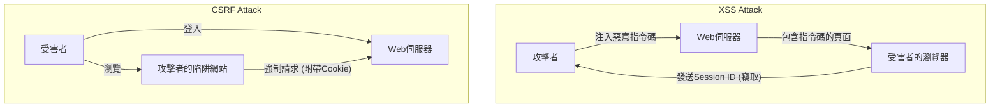

## 前言

在現代的Web應用程式中，安全性不僅僅是附加功能，而是構成系統基礎的最重要元素之一。其中，**XSS (跨站指令碼攻擊, Cross-Site Scripting)** 和 **CSRF (跨站請求偽造, Cross-Site Request Forgery)** 是歷史悠久，且至今仍在這許多Web應用程式中被發現的嚴重漏洞。它們經常被混淆，但攻擊的機制以及對應的防禦策略卻有著根本上的不同。

在本文中，我們將釐清XSS與CSRF的本質區別，詳細解說攻擊者如何惡意利用這些漏洞，以及開發者應實作的現代防禦策略，並穿插歷史演進來進行深入探討。

---

## 1. 深入探討 XSS (Cross-Site Scripting)

XSS是一種攻擊手法，攻擊者會將惡意的指令碼（主要是JavaScript）注入到Web頁面中，並在瀏覽該頁面的其他使用者瀏覽器上執行該指令碼。這種攻擊的本質在於「未受信任的資料在沒有經過適當處理的情況下，被解析為可執行的程式碼」。

### XSS的三種主要類型

根據惡意指令碼如何被注入應用程式並執行，XSS大致可以分為三種類型。

#### 1. Stored XSS (儲存型XSS)
Stored XSS 是最危險的 XSS 類型。攻擊者發送的惡意指令碼會被永久保存（儲存）在資料庫或檔案系統等伺服器端。之後，當一般使用者瀏覽包含該資料的頁面時，儲存的指令碼就會被傳送到瀏覽器並執行。
*   **典型發生位置：** 留言板、討論區、使用者個人資料、評論功能等。
*   **威脅：** 影響範圍非常廣泛，所有開啟該頁面的使用者都有可能受害。

#### 2. Reflected XSS (反射型XSS)
Reflected XSS的發生是因為惡意指令碼沒有被儲存在伺服器端，而是作為請求的一部分（如URL參數或表單資料等）被發送，並直接在伺服器的回應中「反射」出來。
*   **典型發生位置：** 搜尋結果頁面、錯誤訊息顯示、步驟間的資料傳遞等。
*   **攻擊手法：** 攻擊者透過誘使使用者點擊包含惡意參數的URL（利用釣魚郵件或社群媒體），來達成攻擊。

#### 3. DOM-based XSS
DOM-based XSS 不經過伺服器端的處理，而是由於客戶端（瀏覽器上）的 JavaScript 不當地操作了 DOM (Document Object Model) 而發生。
*   **機制：** 當應用程式的 JavaScript 從 `window.location` 或 `document.referrer` 等攻擊者可控的來源讀取資料，並直接將其傳遞給 `innerHTML` 或 `eval()` 等危險的接收點（執行點）時就會發生。
*   **威脅：** 通常不會留在伺服器的日誌中，可能難以被 WAF (Web Application Firewall) 等設備偵測到。

### XSS的危害與在環境脈絡下執行指令碼的手法

如果 XSS 攻擊成功，攻擊者的指令碼將會在使用者的瀏覽器上，以與該網站相同的來源（權限）執行。這將導致以下嚴重的危害：

1.  **Session Hijacking (工作階段劫持)：** 存取 `document.cookie` 竊取 Session ID，並發送至攻擊者的伺服器。藉此，攻擊者可以偽裝成使用者並接管帳號。
2.  **執行未經授權的操作：** 以使用者的權限，在背景執行應用程式內的任意操作（如修改密碼、匯款、發送訊息等）。
3.  **網路釣魚：** 在 DOM 上繪製假的登入表單，直接竊取使用者的驗證資訊。
4.  **散佈惡意軟體：** 將使用者的瀏覽器重新導向到漏洞利用套件 (Exploit Kit)，使電腦感染惡意軟體。

### 針對 XSS 的現代防禦策略

為了防止 XSS 攻擊，採用深度防禦 (Defense in Depth) 的方法是不可或缺的。

#### 1. 根據上下文的跳脫處理 (Output Encoding)
最基本也是最重要的對策，就是在將使用者的輸入輸出到網頁時，進行轉換為無害字串的跳脫（編碼）處理。重點在於，必須根據資料輸出的**上下文（HTML 本文、HTML 屬性、JavaScript 內、CSS 內、URL 內等）**，選擇適當的跳脫方式。現代許多的 Web 框架（如 React, Vue, Angular 等）預設都會進行 HTML 跳脫，但仍需要多加留意。

#### 2. 導入 CSP (Content Security Policy)
CSP 是一種針對 XSS 非常強大的防禦機制，它在 HTTP 標頭中定義了瀏覽器允許載入及執行的資源白名單。
```http
Content-Security-Policy: default-src 'self'; script-src 'self' https://trusted.cdn.com;
```
藉此，即使攻擊者成功注入了內嵌指令碼 `<script>alert(1)</script>`，也會被 CSP 阻擋而無法執行。

#### 3. 善用 HttpOnly Cookie 屬性
為儲存 Session ID 等資訊的 Cookie 加上 `HttpOnly` 屬性後，就無法透過 JavaScript（例如：`document.cookie`）存取該 Cookie。雖然這無法防止 XSS 本身的發生，但它是大幅降低因 XSS 導致的 Session Hijacking 風險的重要緩解措施。

---

## 2. 深入探討 CSRF (Cross-Site Request Forgery) 

CSRF 是一種攻擊手法，攻擊者會將使用者誘導至陷阱網站，並強制使用者對其已驗證（登入）的其他 Web 網站發送非預期的請求。

相較於 XSS 是「在瀏覽器內執行未經授權的指令碼」，CSRF 則是「惡意利用瀏覽器的標準行為（自動發送 Cookie）來發送未經授權的請求」，這兩者有著決定性的差異。

### CSRF 的機制：惡意利用「自動發送 Cookie」

當瀏覽器向某個網域發送請求時，會自動將與該網域關聯的 Cookie（如 Session Cookie 等）附加到標頭中並發送。即使是來自不同網域（攻擊者的網站）上放置的圖片標籤或表單的請求，情況也是一樣。

**攻擊情境：**
1.  使用者登入銀行網站 (`bank.example.com`) 並取得 Session Cookie。
2.  使用者在另一個分頁瀏覽了攻擊者的陷阱網站 (`attacker.example.com`)。
3.  陷阱網站中被植入了以下隱藏表單和自動發送指令碼。
    ```html
    <form action="https://bank.example.com/transfer" method="POST" id="csrf-form">
        <input type="hidden" name="toAccount" value="ATTACKER_ACCOUNT">
        <input type="hidden" name="amount" value="1000000">
    </form>
    <script>document.getElementById('csrf-form').submit();</script>
    ```
4.  瀏覽器向 `bank.example.com` 發送 POST 請求。此時，**會自動附加上銀行網站的 Session Cookie。**
5.  銀行伺服器因為接收到了合法的 Session Cookie，會將其視為來自合法使用者的請求進行處理，從而執行了未經授權的匯款。

### 針對 CSRF 防禦策略的歷史演進與最新實務

為了防止 CSRF，必須驗證請求是否「從預期的合法頁面發出」。

#### 1. CSRF Token (Anti-CSRF Tokens)：傳統且可靠的防禦
最古老且被廣泛使用的可靠防禦措施是 CSRF Token (Synchronizer Token Pattern)。
*   伺服器會為每個 Session 產生無法預測的隨機 Token，並保存在伺服器端（如 Session 中）。
*   在發送給客戶端的 HTML 表單中，將此 Token 作為隱藏 (hidden) 欄位嵌入。
*   表單提交時，伺服器會比對送來的 Token 和保存在伺服器端的 Token，只有在一致的情況下才會處理該請求。
雖然攻擊者可以從陷阱網站發送請求，但因為無法讀取目標網站的頁面來取得正確的 Token（受限於同源政策 Same-Origin Policy），因此攻擊會失敗。

#### 2. Double Submit Cookie 模式
這是在伺服器端不保持狀態 (Session) 的 API 等常見的手法。
*   伺服器產生隨機 Token，並作為 Cookie 發送給客戶端。
*   客戶端的 JavaScript 讀取該 Cookie 的值，並將其設定在請求標頭（例如：`X-CSRF-Token`）中發送。
*   伺服器會驗證 Cookie 中的 Token 值與標頭中的 Token 值是否一致。
雖然攻擊者可以讓 Cookie 自動發送，但無法透過 JavaScript 讀取其他網域的 Cookie 並設定到標頭中，因此可以防止攻擊。

#### 3. SameSite Cookie 屬性：現代瀏覽器的強大防禦
近年來，最受推崇的強大防禦策略是 Cookie 的 `SameSite` 屬性。它用來控制跨站請求時發送 Cookie 的行為。

*   `SameSite=Strict`：包含點擊連結等頂層導航在內，在任何跨站請求中都不會發送 Cookie。雖然這是最安全的，但可能會影響使用者體驗 (UX)，例如從其他網站連結過來時無法保持登入狀態。
*   `SameSite=Lax`：在載入圖片或 POST 請求等跨站請求中不會發送 Cookie，但在透過點擊連結（GET 請求）進行頂層導航時會發送。這是目前許多瀏覽器預設的行為。這可以防止大部分由惡意 POST 表單提交所引起的 CSRF 攻擊。
*   `SameSite=None`：即使是跨站請求也始終會發送 Cookie。（必須與 `Secure` 屬性一起指定）。

透過適當設定 SameSite 屬性，可以在瀏覽器層級阻擋 CSRF 的根本原因（Cookie 的自動發送）。

---

## XSS與CSRF的關聯性與總結

下圖顯示了攻擊流程的差異。



儘管 XSS 和 CSRF 是不同的漏洞，但**如果存在 XSS，幾乎所有的 CSRF 措施都會失效**。因為透過 XSS 執行的指令碼是在合法的頁面內運作，所以它可以讀取 CSRF Token，或者從同一個來源發送請求。

因此，為了確保 Web 應用程式的安全性，首先必須徹底防堵 XSS（適當的跳脫處理和 CSP），然後再實作 CSRF 對策（SameSite Cookie 和 CSRF Token），這需要建立強固的基礎。

開發者不應過度依賴框架提供的安全功能，理解這些漏洞的本質機制，並在適當的層級設計防禦策略是非常重要的。
