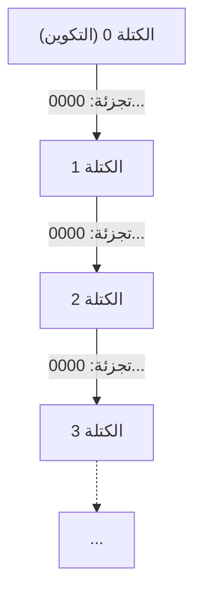
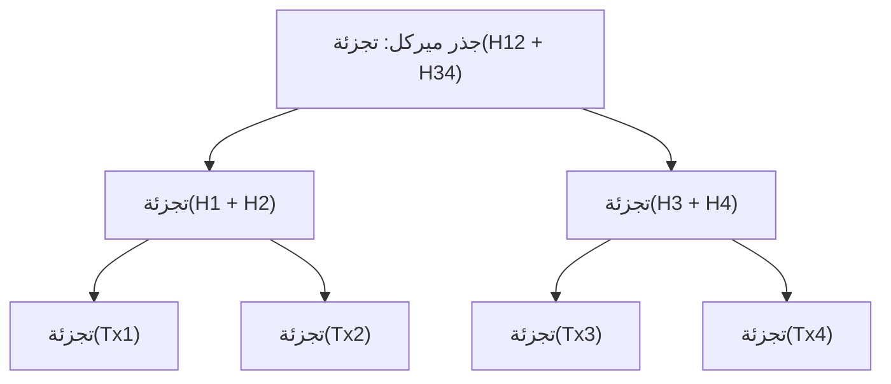
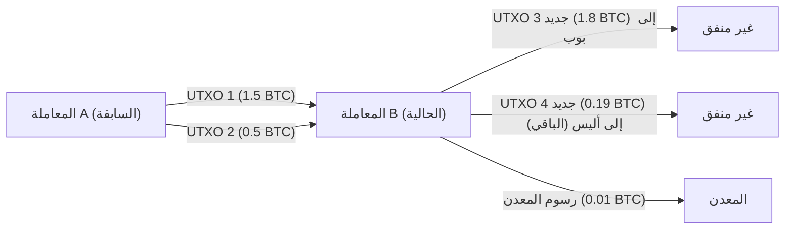

# العملات المشفرة والبيتكوين: تاريخها، أساسها الرياضي، ومستقبلها

في المجتمع الحديث، لا يمر يوم دون سماع مصطلحات مثل "العملات المشفرة (Cryptocurrency)" و"البيتكوين (Bitcoin)". ومع ذلك، قلة قليلة من الناس يفهمون حقًا الآليات التقنية والرياضية وراءها. في هذه المقالة، سنشرح بالتفصيل الهائل كيف ظهرت العملات المشفرة، والأسس الرياضية التي بنيت عليها، والتحديات والإمكانيات التي تحملها للمستقبل.

## 1. مقدمة: ما هي العملات المشفرة؟

العملات المشفرة هي نوع من العملات الرقمية التي تستخدم نظرية التشفير لضمان أمان المعاملات والتحكم في إصدار وحدات جديدة. على عكس العملات الورقية التقليدية (Fiat Money) التي يتم إصدارها وإدارتها من قبل مؤسسة واحدة موثوقة وهي البنك المركزي، تعمل العملات المشفرة على شبكة **لامركزية (Decentralized)** بدون مدير مركزي.

### مقارنة بين العملات الورقية والأنظمة اللامركزية

العملات الورقية هي نتاج "الثقة". إنها تقوم على ضمان الحكومة لقيمتها. ومع ذلك، فإن هذا النظام لديه بعض نقاط الضعف المحتملة:
- **مخاطر التضخم**: يمكن للبنك المركزي التلاعب بعرض النقود وفقًا للسياسة، وبالتالي فإن طباعة النقود الورقية المفرطة تؤدي إلى تدهور القيمة.
- **نقطة الفشل الفردية (SPOF)**: إذا تعطل نظام المؤسسة المالية، فستتوقف المعاملات.
- **احتمالية الرقابة**: هناك دائمًا خطر تجميد حسابات أفراد أو منظمات معينة.

في المقابل، تهدف العملات المشفرة إلى نظام "عديم الثقة (Trustless)". أي أنه نظام تُضمن فيه صحة المعاملات من خلال المتانة الرياضية والتشفيرية للنظام نفسه، دون الحاجة إلى الثقة في شخص معين.

## 2. تاريخ العملات المشفرة: من السايبربانك إلى ساتوشي ناكاموتو

لم يولد البيتكوين كطفرة مفاجئة. وراء ذلك تاريخ يمتد لعقود من علم التشفير وحركة أيديولوجية للمهندسين الذين يقدرون الخصوصية.

### أيديولوجية السايبربانك (Cypherpunks)

من الثمانينيات إلى التسعينيات، تم تشكيل مجتمع من مهندسي التشفير والناشطين يسمى "السايبربانك (Cypherpunks)". لقد استهدفوا حماية الخصوصية الفردية ومواجهة مراقبة الدولة والرقابة باستخدام تقنية التشفير القوية.

ولدت العديد من الأفكار التي تشكل حجر الأساس للبيتكوين من هذا المجتمع، مثل "eCash" التي ابتكرها ديفيد تشاوم (David Chaum)، و "Hashcash" بواسطة آدم باك (Adam Back)، و "Bit gold" بواسطة نيك زابو (Nick Szabo). ومع ذلك، لم تتمكن هذه الأفكار من حل "مشكلة الإنفاق المزدوج (Double-spending problem)" بالكامل بدون مدير مركزي.

### الأزمة المالية لعام 2008 وميلاد البيتكوين

في عام 2008، حدثت أزمة مالية عالمية أثارها انهيار ليمان براذرز. في 31 أكتوبر من ذلك العام، عندما بلغ عدم الثقة في النظام المالي الحالي ذروته، نشر شخص (أو مجموعة) مجهول يُدعى "ساتوشي ناكاموتو (Satoshi Nakamoto)" ورقة بحثية في قائمة بريدية لعلم التشفير.

كان العنوان "Bitcoin: A Peer-to-Peer Electronic Cash System" (البيتكوين: نظام نقد إلكتروني من ند لند). أظهرت هذه الورقة المكونة من 9 صفحات كيفية حل مشكلة الإنفاق المزدوج التي واجهتها محاولات النقود الإلكترونية السابقة بطريقة لامركزية بالكامل باستخدام آلية تسمى **إثبات العمل (Proof of Work: PoW)** .

### كتلة التكوين (Genesis Block)

في 3 يناير 2009، بدأت شبكة البيتكوين في العمل. الكتلة الأولى التي تم تعدينها تسمى "كتلة التكوين (الكتلة 0)". تم نقش الرسالة التالية على هذه الكتلة بواسطة ساتوشي ناكاموتو:

> "The Times 03/Jan/2009 Chancellor on brink of second bailout for banks"
> (صحيفة التايمز 3 يناير 2009: المستشار على شفا خطة إنقاذ ثانية للبنوك)

كان هذا عنوانًا رئيسيًا في الصحيفة البريطانية "The Times" في ذلك الوقت، وهو يمثل سخرية لاذعة من خطط الإنقاذ المالي للبنك المركزي، ويخدم في الوقت نفسه كطابع زمني لنظام البيتكوين الذي سيبقى إلى الأبد.

## 3. بنية البلوكتشين

التقنية الأساسية التي تدعم البيتكوين هي "البلوكتشين (Blockchain)". البلوكتشين هو شكل من أشكال تقنية دفتر الأستاذ الموزع (Distributed Ledger Technology: DLT)، حيث يتم تجميع البيانات في وحدات تسمى "كتل"، والتي ترتبط هيكليًا معًا مثل سلسلة باستخدام التشفير.

### هيكل الكتلة

تتكون الكتلة الواحدة بشكل أساسي من "رأس الكتلة (Block Header)" و "بيانات المعاملة (Transaction Data)".

يحتوي رأس الكتلة على المعلومات التالية:
1. **الإصدار (Version)**: إصدار البرنامج
2. **تجزئة الكتلة السابقة (Previous Block Hash)**: القيمة المجزأة لرأس الكتلة السابقة مباشرة
3. **جذر ميركل (Merkle Root)**: قيمة التجزئة التي تلخص جميع المعاملات المتضمنة في الكتلة
4. **الطابع الزمني (Timestamp)**: الوقت الذي تم فيه إنشاء الكتلة
5. **الهدف لمستوى الصعوبة (Difficulty Target, Bits)**: قيمة تشير إلى صعوبة إثبات العمل
6. **رقم الاستخدام مرة واحدة (Nonce)**: رقم عشوائي يتم تغييره أثناء التعدين للعثور على قيمة تجزئة تلبي الشروط

### شجرة ميركل (Merkle Trees)

في البلوكتشين، يتم استخدام بنية بيانات تسمى **شجرة ميركل (Merkle Tree)** للكشف عن التلاعب بالبيانات بكفاءة مع الحفاظ على حجم الكتلة منخفضًا. شجرة ميركل هي نوع من الأشجار الثنائية، حيث تحتوي العقد الطرفية على قيمة التجزئة لكل معاملة، وتكون العقدة الأم هي نتيجة تسلسل قيم التجزئة للعقد الفرعية وإعادة تجزئتها.

إذا تم تغيير بيانات المعاملة ولو قليلاً، فستتغير تجزئة العقدة الطرفية الخاصة بها، وستصبح قيمة جذر ميركل مختلفة تمامًا كرد فعل متسلسل. وهذا يجعل من الممكن الكشف على الفور عن أي تلاعب، حتى لو كان واحدًا فقط، من بين كمية هائلة من بيانات المعاملات.

## 4. الأساس الرياضي والتشفيري

تدعم الأساسات الرياضية المتقدمة متانة البيتكوين. هنا، سنتعمق في وظائف التجزئة، وتشفير المفتاح العام، وتشفير المنحنى الإهليلجي التي تشكل نواتها.

### SHA-256 (خوارزمية التجزئة الآمنة 256 بت)

وظيفة التجزئة التشفيرية الأكثر استخدامًا في البيتكوين هي **SHA-256** . وظيفة التجزئة هي دالة أحادية الاتجاه تأخذ بيانات بأي طول كمدخلات وتخرج بيانات بطول ثابت (256 بت في حالة SHA-256).

يجب أن تستوفي دالة التجزئة $H$ الخصائص التالية:
1. **مقاومة الصورة الأولية (Pre-image resistance)**: من الصعب حسابيًا إيجاد مدخل $x$ بحيث يكون $H(x) = h$ لقيمة تجزئة معينة $h$.
2. **مقاومة الصورة الأولية الثانية (Second pre-image resistance)**: لمدخل معين $x_1$، من الصعب العثور على مدخل آخر $x_2$ بحيث يكون $H(x_1) = H(x_2)$.
3. **مقاومة الاصطدام (Collision resistance)**: من الصعب العثور على أي مدخلين $x_1, x_2$ بحيث يكون $H(x_1) = H(x_2)$.

في البيتكوين، يتم تطبيق SHA-256 مرتين في عمليات مثل حساب تجزئة الكتلة أو إنشاء عناوين من المفاتيح العامة (يُطلق على هذا `SHA256(SHA256(x))`، أو Hash256).

### تشفير المفتاح العام (Public Key Cryptography) والتوقيع الرقمي

يتم إثبات ملكية العملات المشفرة من خلال زوج من المفتاح الخاص (Private Key) والمفتاح العام (Public Key).
- **المفتاح الخاص** $k$: عدد صحيح 256 بت يتم إنشاؤه عشوائيًا. يجب ألا يُعرف للآخرين أبدًا.
- **المفتاح العام** $K$: مفتاح يتم حسابه من المفتاح الخاص باستخدام دالة أحادية الاتجاه. يتم نشره على الشبكة.

عندما ترسل أليس البيتكوين إلى بوب، تستخدم أليس مفتاحها الخاص لإنشاء **توقيع رقمي (Digital Signature)** لبيانات المعاملة. يمكن للمشاركين في الشبكة استخدام مفتاح أليس العام للتحقق مما إذا كان هذا التوقيع صالحًا (ما إذا كانت أليس قد أنشأته حقًا باستخدام مفتاحها الخاص).

### تشفير المنحنى الإهليلجي (Elliptic Curve Cryptography: ECC) و secp256k1

بالنسبة لإنشاء المفتاح العام للبيتكوين والتوقيع الرقمي، يتم استخدام **تشفير المنحنى الإهليلجي (ECC)** بدلاً من تشفير RSA. يتمتع ECC بميزة القدرة على توفير مستوى أمان مكافئ بطول مفتاح أقصر بكثير مقارنة بـ RSA.

تسمى معلمات المنحنى الإهليلجي المحددة المستخدمة في البيتكوين **secp256k1** . يتم تعريف هذا المنحنى على الحقل المحدود $\mathbb{F}_p$، ويتم تمثيله بالمعادلة التالية:

$$
y^2 \equiv x^3 + 7 \pmod{p}
$$

هنا، $p$ هو عدد أولي كبير جدًا:
$$
p = 2^{256} - 2^{32} - 2^{9} - 2^{8} - 2^{7} - 2^{6} - 2^{4} - 1
$$

المفتاح الخاص $k$ هو رقم عشوائي يتراوح من $1$ إلى $n-1$ ($n$ هو ترتيب المنحنى). يتم الحصول على المفتاح العام $K$ عن طريق ضرب نقطة الأساس (Generator Point) $G$ على المنحنى عدديًا بعدد مرات المفتاح الخاص.

$$
K = k \cdot G
$$

يمكن إجراء هذا الحساب بكفاءة عن طريق تكرار إضافة النقاط (Point Addition) ومضاعفة النقاط (Point Doubling) على المنحنى الإهليلجي. ومع ذلك، على العكس من ذلك، فإن الحساب العكسي للمفتاح الخاص $k$ من المفتاح العام $K$ ونقطة الأساس $G$ يمثل مشكلة صعبة للغاية من الناحية الحسابية وتسمى **مشكلة اللوغاريتم المنفصل للمنحنى الإهليلجي (Elliptic Curve Discrete Logarithm Problem: ECDLP)** ، وهذا يشكل أساس أمان العملات المشفرة.

### خوارزمية التوقيع الرقمي للمنحنى الإهليلجي (ECDSA)

يتم استخدام **ECDSA** لتوقيع المعاملات. عملية التوقيع عندما تكون الرسالة (تجزئة المعاملة) هي $z$ هي كما يلي:

1. اختر عددًا صحيحًا عشوائيًا $k_e$ (مفتاح مؤقت) من $1$ إلى $n-1$.
2. احسب النقطة على المنحنى $(x_1, y_1) = k_e \cdot G$.
3. احسب $r = x_1 \pmod{n}$. إذا كان $r = 0$، فارجع إلى الخطوة 1.
4. احسب $s = k_e^{-1} (z + r \cdot k) \pmod{n}$. إذا كان $s = 0$، فارجع إلى الخطوة 1.
5. التوقيع سيكون الزوج $(r, s)$.

في عملية التحقق، يتم إجراء الحساب التالي باستخدام المفتاح العام $K$ والتوقيع $(r, s)$:

1. $u_1 = z \cdot s^{-1} \pmod{n}$
2. $u_2 = r \cdot s^{-1} \pmod{n}$
3. احسب النقطة $(x_2, y_2) = u_1 \cdot G + u_2 \cdot K$.
4. إذا كان $r \equiv x_2 \pmod{n}$، فيُعتبر التوقيع صالحًا.

## 5. خوارزمية الإجماع وإثبات العمل (PoW)

في شبكة لامركزية، الآلية التي يتفق من خلالها الجميع على نفس حالة دفتر الأستاذ هي خوارزمية الإجماع.

### مشكلة الجنرالات البيزنطيين ([Byzantine Generals](https://kenji.blog/ar/p/byzantine-generals-problem-consensus/) Problem)

"مشكلة الجنرالات البيزنطيين" هي مشكلة كلاسيكية في الحوسبة الموزعة. يقوم العديد من الجنرالات بمحاصرة مدينة معادية، ويجب أن يتفقوا على الهجوم أو التراجع، ولكن قد يكون هناك خونة بين الجنرالات يرسلون رسائل مزيفة. المشكلة هي كيفية التوصل إلى اتفاق صحيح مع الجنرالات المخلصين فقط في ظل هذه الظروف.

نجح البيتكوين عمليًا في حل هذه المشكلة من خلال الجمع بين **إثبات العمل (PoW)** و **قاعدة السلسلة الأطول (Longest Chain Rule)** .

### رياضيات التعدين ورقم الاستخدام مرة واحدة (Nonce)

يشير "العمل (Work)" في PoW إلى منافسة حسابية للعثور على قيمة تجزئة تلبي شروطًا معينة. يستمر المعدنون في البحث عن قيمة لـ Nonce بحيث تكون القيمة المجزأة لرأس الكتلة أصغر من **الهدف (Target)** الذي تحدده الشبكة.

$$
\text{SHA256}(\text{SHA256}(\text{رأس\_الكتلة})) < \text{الهدف}
$$

نظرًا لأن مخرجات وظيفة التجزئة تبدو عشوائية تمامًا، فلا توجد خوارزمية فعالة للعثور على Nonce الذي يلبي الشروط. الطريقة الوحيدة هي هجوم القوة الغاشمة (Brute-force)، حيث يتم تغيير قيمة Nonce بشكل متكرر وإعادة حساب التجزئة.

كلما كانت قيمة الهدف أصغر، انخفض احتمال العثور على تجزئة تلبي الشروط. إذا كان الهدف يمثل قيمة تتطلب $k$ أصفار بادئة، فإن متوسط عدد الحسابات المطلوبة للعثور على هذه الكتلة سيكون $2^k$ مرة. هذا الاستثمار الهائل لطاقة الحوسبة هو ما يجعل من المستحيل التلاعب بالسجلات السابقة للبلوكتشين.

### تعديل الصعوبة (Difficulty Adjustment)

تم تصميم شبكة البيتكوين بحيث يتم إنشاء كتلة واحدة كل حوالي 10 دقائق. ومع ذلك، فإن قوة الحوسبة (معدل التجزئة) للشبكة بأكملها تتقلب باستمرار. لذلك، كل 2016 كتلة (حوالي أسبوعين)، يتم تعديل قيمة الهدف تلقائيًا بناءً على الفاصل الزمني لإنشاء الكتل السابقة.

$$
\text{الهدف\_الجديد} = \text{الهدف\_القديم} \times \frac{\text{الوقت\_الفعلي\_لآخر\_2016\_كتلة}}{\text{20160\_دقيقة}}
$$

إذا زاد معدل التجزئة، يصبح الهدف أصغر (تزداد الصعوبة)، وإذا انخفض معدل التجزئة، يصبح الهدف أكبر (تنخفض الصعوبة).

## 6. المعاملات ونموذج UTXO

لا تعتمد معاملات البيتكوين آلية مثل أرصدة الحسابات المصرفية (النموذج القائم على الحساب)، بل تتبنى نموذجًا يسمى **UTXO (مخرجات المعاملات غير المنفقة)** .

### المدخلات والمخرجات

لا يوجد كيان مادي يسمى "عملة" في البيتكوين. ما يوجد فقط هو سلسلة من UTXOs تم إنشاؤها من المعاملات السابقة. تستهلك كل معاملة UTXO موجود كـ "مدخل (Input)" وتنتج UTXO جديدًا كـ "مخرج (Output)".

لنفترض أن أليس تريد إرسال 1.8 BTC إلى بوب. تحدد أليس اثنين من UTXOs تملكهما، 1.5 BTC و 0.5 BTC (إجمالي 2.0 BTC)، كمدخلات، وتنشئ مخرجًا بقيمة 1.8 BTC موجهًا إلى بوب. من الـ 0.2 BTC المتبقية، يصبح 0.19 BTC مخرجًا كباقي (Change) موجهًا إلى عنوان جديد خاص بأليس، والفرق البالغ 0.01 BTC يذهب كرسوم (Fee) للمعدن الذي عالج المعاملة.

$$
\sum \text{المدخلات} = \sum \text{المخرجات} + \text{رسوم\_المعاملة}
$$

نظرًا لأن نموذج UTXO هذا يتمتع باستقلالية عالية في المعاملات، فمن السهل معالجته بشكل متوازٍ، وهو متفوق أيضًا من منظور الخصوصية (القدرة على استخدام عنوان جديد للباقي في كل مرة).

## 7. المستقبل ومشاكل قابلية التوسع

البيتكوين هو نظام متين وآمن للغاية، ولكن في المقابل يواجه تحديًا كبيرًا في قابلية التوسع (مدى قابلية توسيع قدرة المعالجة). يمكن لشبكة البيتكوين الحالية معالجة حوالي 7 معاملات فقط في الثانية (7 TPS). هذا بطيء جدًا مقارنة بعشرات الآلاف من TPS على شبكة Visa.

### الشوكات (Forks): الشوكة المرنة والشوكة الصلبة

عند ترقية بروتوكول البلوكتشين، قد يحدث حدث يسمى "الشوكة (التفرع)".
- **الشوكة المرنة (Soft Fork)**: ترقية متوافقة مع الإصدارات السابقة. حتى العقد ذات القواعد القديمة ستعتبر الكتل ذات القواعد الجديدة صالحة (مثل: تقديم SegWit).
- **الشوكة الصلبة (Hard Fork)**: ترقية غير متوافقة مع الإصدارات السابقة. نظرًا لرفض العقد القديمة لكتل القواعد الجديدة، يمكن أن تنقسم الشبكة تمامًا إلى قسمين (مثل: ولادة Bitcoin Cash).

### شبكة البرق (Lightning Network)

من الأساليب الواعدة لحل مشكلة قابلية التوسع شبكة البرق، وهي حل من **الطبقة الثانية (Layer 2)** .

في شبكة البرق، يفتح المشاركون "قنوات دفع (Payment Channel)" خارج البلوكتشين (خارج السلسلة). ضمن القناة، طالما أن كلا الطرفين متفقان، يمكن تبادل الأموال على الفور وبشكل شبه مجاني لعدد غير محدود من المرات دون تسجيل المعاملات في البلوكتشين. يتم تسجيل المعاملة في البلوكتشين (الطبقة 1) فقط عند التسوية النهائية للرصيد.

### مقارنة مع إثبات الحصة (PoS)

التحدي الرئيسي الآخر في PoW هو الاستهلاك الهائل للطاقة بسبب التعدين. كتدبير مضاد لهذه المشكلة البيئية، انتقلت الإيثيريوم وغيرها إلى خوارزمية إجماع أخرى تسمى **إثبات الحصة (Proof of Stake: PoS)** .

في PoS، يتم تخصيص حق إنشاء الكتلة التالية (المدقق) احتماليًا بناءً على كمية العملة المشفرة المحتفظ بها (الحصة) وفترة الاحتفاظ بها، وليس على قوة الحوسبة (معدل التجزئة). هذا يقلل من استهلاك الطاقة بنسبة تزيد عن 99٪، ولكن هناك أيضًا انتقادات بأنه "قد يكون نظامًا يصبح فيه الأغنياء أكثر ثراءً" أو "قد تتضرر اللامركزية الكاملة". بغض النظر عن مدى الانتقادات، يستمر البيتكوين في التمسك بفلسفة PoW المتمثلة في "ضمان الأمان المادي من خلال استهلاك الطاقة".

## 8. أعماق نظرية التشفير: الإثباتات الرياضية وقوة البروتوكول

وراء SHA-256 وتشفير المنحنى الإهليلجي (ECC) الموضح في الفصول السابقة، هناك نموذجان: أمان نظرية المعلومات والأمان الحسابي. تعتمد العملات المشفرة الحديثة، بما في ذلك البيتكوين، بشكل أساسي على الأمان الحسابي (Computational Security).

### الأمان الحسابي ومشكلة اللوغاريتم المنفصل

الأمان الحسابي هو أمان يعتمد على فرضية أنه "من المستحيل عمليًا فك تشفير شيفرة معينة لأنها تتطلب وقتًا أطول من عمر الكون وموارد حسابية فلكية".

دعونا نعيد التأكيد على مشكلة اللوغاريتم المنفصل للمنحنى الإهليلجي (ECDLP)، التي تضمن أمان تشفير المفتاح العام للبيتكوين، باستخدام الصيغ الرياضية.
إنها مشكلة العثور على عدد صحيح غير معروف $k$ يلبي $Q = kP$، حيث تقع النقطتان $P$ و $Q$ على المنحنى الإهليلجي $E(\mathbb{F}_p)$.
عند استخدام كمبيوتر كلاسيكي، فإن التعقيد الحسابي لأفضل خوارزمية (مثل طريقة $\rho$ لبولارد) لحل هذه المشكلة هو $\mathcal{O}(\sqrt{p})$.
في secp256k1 الخاص بالبيتكوين، $p \approx 2^{256}$، لذلك يتطلب فك التشفير حوالي $2^{128}$ عملية. هذا مقدار من الحساب سيستغرق تريليونات المرات من عمر الكون (حوالي 13.8 مليار سنة) حتى لو تم تعبئة جميع أجهزة الكمبيوتر الموجودة حاليًا على الأرض.

### تهديد أجهزة الكمبيوتر الكمومية وتشفير ما بعد الكم

ومع ذلك، هناك مصدر قلق كبير واحد بشأن الأمان الحسابي. إنه صعود **أجهزة الكمبيوتر الكمومية (Quantum Computer)** .
أثبتت "خوارزمية شور ([Shor's Algorithm](https://kenji.blog/ar/p/quantum-computing-shors-algorithm/))"، التي نشرها بيتر شور (Peter Shor) في عام 1994، رياضيًا أنه باستخدام أجهزة الكمبيوتر الكمومية، يمكن حل مشكلة التحليل إلى العوامل الأولية (أساس تشفير RSA) ومشكلة اللوغاريتم المنفصل (أساس ECC) في وقت كثير الحدود $\mathcal{O}(n^3)$.

إذا تم الانتهاء من جهاز كمبيوتر كمومي عملي واسع النطاق يمتلك كيوبتات كافية (Qubits) ومعدل خطأ منخفض، فسيكون هناك خطر يتمثل في إمكانية حساب المفتاح الخاص عكسيًا من المفتاح العام للبيتكوين.
الإجراءات الدفاعية لشبكة البيتكوين ضد هذا هي كما يلي:

1. **حماية وظائف التجزئة**: عنوان البيتكوين ليس المفتاح العام نفسه، بل هو تطبيق لوظائف التجزئة SHA-256 و RIPEMD-160 على المفتاح العام. حتى مع استخدام أجهزة الكمبيوتر الكمومية، يظل الحساب العكسي لوظائف التجزئة صعبًا (حتى باستخدام خوارزمية جروفر، التعقيد الحسابي هو $\mathcal{O}(\sqrt{N})$). لذلك، حتى تقوم بإجراء معاملة وكشف مفتاحك العام للشبكة، يمكن القول إن محتويات العنوان آمنة حتى ضد أجهزة الكمبيوتر الكمومية.
2. **الانتقال إلى تشفير ما بعد الكم (Post-Quantum Cryptography: PQC)**: قبل أن تصبح أجهزة الكمبيوتر الكمومية قابلة للتطبيق عمليًا، تجري مناقشات حول تنفيذ شوكة صلبة في بروتوكول البيتكوين والانتقال إلى خوارزميات توقيع جديدة يصعب على أجهزة الكمبيوتر الكمومية فك تشفيرها، مثل التشفير القائم على الشبكة (Lattice-based cryptography) أو تشفير كثير الحدود متعدد المتغيرات (Multivariate polynomial cryptography)، والتي يتم اختيارها بواسطة NIST (المعهد الوطني للمعايير والتكنولوجيا في الولايات المتحدة).

## 9. طوبولوجيا الشبكة وتفاصيل بروتوكول P2P

لم يتم بناء شبكة البيتكوين كمجرد مجموعة من الخوادم والعملاء، بل كشبكة **ند لند (Peer-to-Peer: P2P)** كاملة.

### أنواع العقد وأدوارها

تسمى أجهزة الكمبيوتر المشاركة في الشبكة "العقد (Node)". هناك عدة أنواع من العقد، ولكل منها دور مختلف.

- **العقدة الكاملة (Full Node)**: عقدة تقوم بتنزيل والتحقق من جميع بيانات البلوكتشين (مئات الجيجابايت أو أكثر)، من كتلة التكوين إلى أحدث كتلة. للتحقق بشكل مستقل من صحة المعاملات ووجود أي إنفاق مزدوج، فهي تشكل أساس أمان الشبكة.
- **عقدة SPV (التحقق المبسط من الدفع)**: عقدة خفيفة الوزن تقوم بتنزيل رؤوس الكتل فقط، وليس البلوكتشين بأكمله. يتم استخدامه بشكل أساسي لمحافظ الهواتف الذكية. يمكنها تأكيد ما إذا كانت معاملاتها الخاصة مدرجة في الكتلة (التحقق من مسار ميركل)، ولكن ليس لديها نفس قدرة التحقق التي تتمتع بها العقدة الكاملة.
- **عقدة التعدين (Mining Node)**: عقدة تقوم بإجراء حسابات PoW وتنشئ كتلًا جديدة. حاليًا، تلعب مجموعات عملاقة تسمى "مجمعات التعدين"، التي تجمع أجهزة التعدين المخصصة المعروفة باسم ASIC (الدوائر المتكاملة الخاصة بالتطبيقات)، هذا الدور.

### عملية انتشار المعاملة (Gossip Protocol)

عندما يقوم مستخدم (أليس) بإنشاء معاملة لإرسال البيتكوين، كيف تنتشر هذه البيانات في جميع أنحاء العالم؟

1. ترسل محفظة (عقدة) أليس بيانات المعاملة إلى عدد قليل من الأقران (العقد المجاورة) المتصلة بها.
2. يتحقق كل نظير يتلقى المعاملة مما إذا كانت المعاملة تتبع القواعد الصحيحة (ما إذا كان هناك رصيد كافٍ، وما إذا كان التوقيع صحيحًا، وما إذا كان التنسيق صحيحًا، وما إلى ذلك).
3. في حالة نجاح التحقق، فإنه يحفظ المعاملة في **تجمع الذاكرة الخاص به (Mempool)** ويعيد توجيهها إلى عقد مجاورة أخرى (بروتوكول القيل والقال / Gossip Protocol).
4. إذا كانت معاملة غير صالحة، يتم تجاهلها ولا يتم نقلها.

نتيجة لذلك، تصل المعاملات الصالحة إلى Mempool الخاص بالعقد في جميع أنحاء العالم في غضون ثوانٍ قليلة. يختار المعدنون المعاملات ذات الرسوم العالية (Fee) من Mempool هذا ويعطونها الأولوية لتعبئتها في الكتل الجديدة.

## 10. اقتصاديات البلوكتشين: نظرية اللعبة وتصميم الحوافز

إن أعظم إنجاز لساتوشي ناكاموتو لم يكن فقط حل اللغز التشفيري، بل بناء **تصميم حوافز (Incentive Design)** مثالي بحيث "يؤدي السلوك الأناني للأفراد والمنظمات في النهاية إلى تعزيز أمان الشبكة بأكملها".

### مكافأة الكتلة والتنصيف (Halving)

السبب الذي يجعل المعدنين ينفقون كميات هائلة من الكهرباء والاستثمارات في الأجهزة لتعدين الكتل هو وجود مكافأة اقتصادية. عندما ينجح المعدنون في إنشاء كتلة جديدة، فإنهم يتلقون عملات بيتكوين تم إصدارها حديثًا من خلال معاملة خاصة تسمى **معاملة كوين بيس (Coinbase Transaction)** .

يتم تحديد الحد الأقصى لإجمالي عدد عملات البيتكوين الصادرة برمجيًا بـ **21 مليون عملة** . بالإضافة إلى ذلك، هناك آلية مضمنة تسمى **التنصيف (Halving)** ، حيث تنخفض مكافأة التعدين لكل كتلة إلى النصف كل 210,000 كتلة (حوالي 4 سنوات).

- 2009~: 50 BTC
- 2012~: 25 BTC
- 2016~: 12.5 BTC
- 2020~: 6.25 BTC
- 2024~: 3.125 BTC

يحاكي نموذج عرض النقود الانكماشي هذا تعدين الذهب ويمثل نقيضًا لـ "التضخم الناجم عن الطباعة اللانهائية" الذي تعاني منه العملات الورقية.

### تحليل نظرية اللعبة لهجوم 51٪ (51% Attack)

يعتبر **هجوم 51٪** أكبر تهديد للبلوكتشين. إذا سيطر كيان واحد ضار على أغلبية (51٪ أو أكثر) قوة الحوسبة (معدل التجزئة) للشبكة بأكملها، فسيصبح ما يلي ممكنًا:

1. إلغاء المعاملات السابقة الخاصة به (الإنفاق المزدوج)
2. رفض الموافقة على معاملات محددة (الرقابة)

ومع ذلك، من منظور نظرية اللعبة، فإن تنفيذ هجوم 51٪ على شبكة البيتكوين واسعة النطاق الحالية غير منطقي للغاية.
حتى لو أنفق المهاجم تكلفة هائلة (مئات الملايين من الدولارات على الأجهزة والكهرباء الهائلة) للسيطرة على غالبية الشبكة، في اللحظة التي ينجح فيها الهجوم، ستُفقد الثقة في البيتكوين وسينهار السعر. ستصبح عملات البيتكوين التي حصل عليها المهاجم بلا قيمة أيضًا. لذلك، تم إنشاء توازن ناش: **"بدلاً من مهاجمة النظام، من المربح اقتصاديًا استخدام قوة الحوسبة الهائلة هذه للتعدين (اتباع القواعد الشرعية) والحصول على مكافآت"** .

## 11. الخلاصة: شكل المستقبل الجديد الذي تفتحه العملات المشفرة

في هذه المقالة، قمنا بتحليل الآليات الرياضية والتقنية والاقتصادية وراء البيتكوين والعملات المشفرة بشكل شامل.

للوهلة الأولى، تبدو تقنية البلوكتشين وكأنها كتلة معقدة من الرياضيات والأكواد، ولكن جوهرها ليس سوى **"نظام جديد لتشكيل الإجماع للبشرية لا يعتمد على السلطة، بل يعتمد على الرياضيات وقوانين الفيزياء كأساس للثقة"** .

لقد انهار النظام المالي الذي نستخدمه يوميًا كأمر مسلم به عدة مرات عبر تاريخه الطويل، وفي كل مرة كان يتم ترقيعه. الحل الذي قدمه ساتوشي ناكاموتو ليس مثاليًا بأي حال من الأحوال. هناك عدد لا يحصى من العقبات التي يجب التغلب عليها، مثل مشاكل قابلية التوسع، والمشاكل البيئية، واللوائح التنظيمية والقانونية من قبل الدول.

ومع ذلك، فإن مفهوم "النظام اللامركزي عديم الثقة" الذي تم إطلاقه بمجرد فتح صندوق باندورا، يستمر في التطور دون أي عودة إلى الوراء. لا يزال من غير المعروف لأي شخص ما إذا كان البيتكوين سيستقر كمجرد ذهب رقمي، أو سيرتقي إلى شبكة دفع عالمية حقيقية من خلال تطوير تقنيات الطبقة الثانية. الشيء الوحيد المؤكد هو أن المستقبل لن يشكله قلة في السلطة، بل إجماع العقد، والمطورين، والمستخدمين في جميع أنحاء العالم المشاركين في الشبكة.

## الملحق: موارد ومراجع للتعلم الأعمق

لأولئك الذين قرأوا هذه المقالة ويريدون معرفة المزيد عن تقنية البلوكتشين ونظرية التشفير، إليك بعض الموارد الموصى بها.

### الأوراق الأصلية التي يجب قراءتها (Whitepapers)
- **Bitcoin: A Peer-to-Peer Electronic Cash System** (Satoshi Nakamoto, 2008)
  - ورقة تاريخية كانت بداية كل شيء. في 9 صفحات فقط، تم وصف التصميم الأساسي لدفتر الأستاذ الموزع الذي يجمع بين PoW والحوافز وشجرة ميركل بشكل مثالي.
- **Ethereum: A Secure Decentralised Generalised Transaction Ledger** (Gavin Wood, 2014)
  - الورقة الصفراء للإيثيريوم. بالمقارنة مع نموذج UTXO للبيتكوين، أعادت تعريف البلوكتشين كآلة حالة قائمة على الحساب قادرة على تنفيذ عقود ذكية كاملة حسب تورينج (Turing-complete).

### أساسيات نظرية التشفير والرياضيات
لفهم البلوكتشين حقًا، المعرفة بأمن المعلومات والرياضيات التطبيقية ضرورية. نوصي بتعلم المجالات التالية:
1. **الجبر المجرد (المجموعات والحلقات والحقول)**: على وجه الخصوص، لا مفر من مفهوم الحقل المحدود (Galois Field) لفهم تشفير المنحنى الإهليلجي.
2. **نظرية التعقيد الحسابي**: مفاهيم مثل مشكلة P مقابل NP، والاختزال في الوقت كثير الحدود مهمة لفهم معنى "أمان" التشفير.
3. **نظرية اللعبة**: توفر إطارًا لنمذجة تصميم الحوافز للمشاركين رياضيًا، مثل توازن ناش ومشكلة الجنرالات البيزنطيين.

> **Warning: إخلاء مسؤولية بخصوص الاستثمار**
> تم إنشاء هذه المقالة لغرض شرح التقنية الأساسية للعملات المشفرة وتاريخها وهيكلها الرياضي، ولا توصي أو تحث على الاستثمار في أي عملة مشفرة. أسعار العملات المشفرة شديدة التقلب، وينطوي الاستثمار على مخاطر كبيرة بما في ذلك فقدان رأس المال.

إن الاستكشاف التقني للبلوكتشين هو حدود المعرفة حيث تتقاطع علوم الكمبيوتر والاقتصاد وعلم الاجتماع. من خلال قراءة الأكواد، وإعداد عقدة بنفسك، ومحاولة إنشاء معاملات على شبكة اختبار، ستتمكن من الشعور بالإمكانات الحقيقية لهذه التقنية وحدودها بشكل مباشر.
