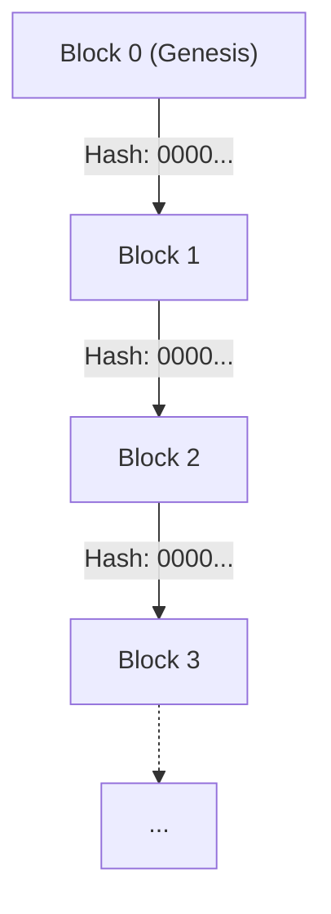
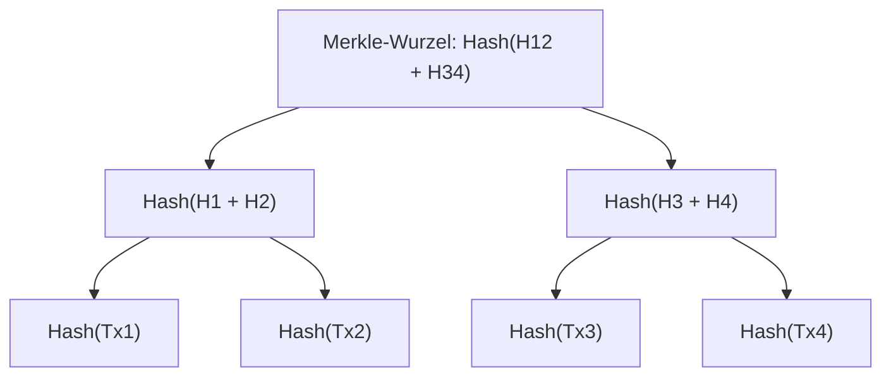
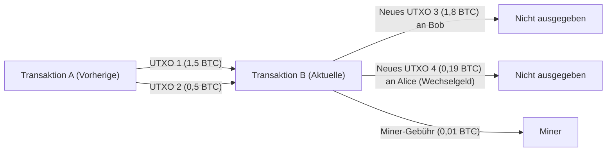

# Kryptowährungen und Bitcoin: Geschichte, mathematische Grundlagen und Zukunft

In der heutigen Gesellschaft vergeht kaum ein Tag, an dem man nicht die Worte "Kryptowährung (Cryptocurrency)" oder "Bitcoin" hört. Dennoch verstehen nur sehr wenige Menschen die technischen und mathematischen Mechanismen, die sich dahinter verbergen. Dieser Artikel erklärt ausführlich, wie Kryptowährungen entstanden sind, auf welchen mathematischen Grundlagen sie basieren und welche Herausforderungen sowie Potenziale sie für die Zukunft bergen.

## 1. Einleitung: Was sind Kryptowährungen?

Kryptowährungen sind eine Form digitaler Währungen, die Kryptografie nutzen, um die Sicherheit von Transaktionen zu gewährleisten und die Ausgabe neuer Einheiten zu steuern. Während traditionelle Fiat-Währungen (Fiat Money) von einer einzigen vertrauenswürdigen Institution, der Zentralbank, ausgegeben und verwaltet werden, laufen Kryptowährungen auf einem **dezentralisierten (Decentralized)** Netzwerk ohne zentrale Verwaltungsstelle.

### Vergleich von Fiat-Währungen und dezentralisierten Systemen

Fiat-Währungen sind ein Produkt des "Vertrauens". Sie funktionieren dadurch, dass die Autorität der Regierung ihren Wert garantiert. Dieses System hat jedoch einige potenzielle Schwächen.
- **Inflationsrisiko**: Da Zentralbanken die Geldmenge entsprechend ihrer Politik manipulieren können, führt das übermäßige Drucken von Banknoten zu einer Verwässerung des Wertes.
- **Single Point of Failure (SPOF)**: Wenn die Systeme von Finanzinstituten ausfallen, kommen die Transaktionen zum Erliegen.
- **Möglichkeit der Zensur**: Es besteht stets das Risiko, dass die Konten bestimmter Personen oder Organisationen eingefroren werden.

Im Gegensatz dazu streben Kryptowährungen nach einem "vertrauenslosen (trustless)" System. Das bedeutet, dass die Richtigkeit von Transaktionen durch die mathematische und kryptografische Robustheit des Systems selbst garantiert wird, ohne dass man jemandem vertrauen muss.

## 2. Die Geschichte der Kryptowährungen: Von den Cypherpunks bis Satoshi Nakamoto

Bitcoin entstand nicht wie eine plötzliche Mutation. Vor seinem Hintergrund standen eine jahrzehntelange Geschichte der Kryptografie sowie die ideologische Bewegung von Technologieexperten, die Wert auf Privatsphäre legten.

### Die Ideologie der Cypherpunks

Zwischen den 1980er und 1990er Jahren bildete sich eine Gemeinschaft von Kryptografen und Aktivisten, die "Cypherpunks" genannt wurden. Sie zielten darauf ab, mithilfe starker Kryptografie die Privatsphäre des Einzelnen zu schützen und der staatlichen Überwachung und Zensur entgegenzuwirken.

Zahlreiche Ideen, die den Grundstein für Bitcoin legten, wie "eCash" von David Chaum, "Hashcash" von Adam Back und "Bit gold" von Nick Szabo, stammten aus dieser Gemeinschaft. Diese konnten jedoch das Problem der doppelten Ausgaben (Double-spending problem) nicht vollständig ohne eine zentrale Verwaltungsstelle lösen.

### Die Finanzkrise von 2008 und die Geburt von Bitcoin

Im Jahr 2008 kam es zu einer globalen Finanzkrise, die durch den Zusammenbruch von Lehman Brothers ausgelöst wurde. Am 31. Oktober desselben Jahres, als das Misstrauen gegenüber dem bestehenden Finanzsystem seinen Höhepunkt erreichte, postete eine anonyme Person (oder Gruppe) unter dem Namen "Satoshi Nakamoto" ein Whitepaper auf einer Kryptografie-Mailingliste.

Der Titel lautete "Bitcoin: A Peer-to-Peer Electronic Cash System" (Bitcoin: Ein Peer-to-Peer-E-Geld-System). Dieses neunseitige Whitepaper zeigte, wie das Problem der doppelten Ausgaben bei früheren Versuchen mit elektronischem Geld mithilfe eines Mechanismus namens **Proof of Work ([PoW](https://kenji.blog/de/p/blockchain-technology-smart-contract-distributed-ledger/))** vollständig dezentralisiert gelöst werden konnte.

### Der Genesis-Block

Am 3. Januar 2009 nahm das Bitcoin-Netzwerk den Betrieb auf. Der erste geminte Block wird als "Genesis-Block" (Block 0) bezeichnet. In diesen Block hatte Satoshi Nakamoto die folgende Nachricht eingraviert:

> "The Times 03/Jan/2009 Chancellor on brink of second bailout for banks"
> (The Times 3. Januar 2009 Finanzminister am Rande eines zweiten Rettungspakets für Banken)

Dies war eine Schlagzeile aus der britischen Zeitung "The Times" und diente nicht nur als scharfe Ironie gegen die finanziellen Rettungsmaßnahmen der Zentralbank, sondern auch als Zeitstempel für Bitcoin als ein System, das ewig bestehen würde.

## 3. Die Architektur der [Blockchain](https://kenji.blog/de/p/blockchain-technology-smart-contract-distributed-ledger/)

Die Kerntechnologie, die Bitcoin unterstützt, ist die "Blockchain". Die Blockchain ist eine Form der Distributed-Ledger-Technologie (DLT), bei der Daten in Einheiten namens "Blöcken" gebündelt und kryptografisch wie eine Kette miteinander verbunden werden.

### Die Struktur eines Blocks

Ein einzelner Block besteht im Wesentlichen aus einem "Block-Header" und "Transaktionsdaten" (Transaction Data).

Der Block-Header enthält die folgenden Informationen:
1. **Version**: Die Softwareversion
2. **Vorheriger Block-Hash (Previous Block Hash)**: Der Hash-Wert des Headers des unmittelbar vorhergehenden Blocks
3. **Merkle-Wurzel (Merkle Root)**: Ein Hash-Wert, der alle im Block enthaltenen Transaktionen zusammenfasst
4. **Zeitstempel (Timestamp)**: Der Zeitpunkt, an dem der Block erstellt wurde
5. **Schwierigkeitsziel (Difficulty Target, Bits)**: Ein Wert, der den Schwierigkeitsgrad des Proof of Work angibt
6. **Nonce**: Eine beliebige Zahl, die beim Mining geändert wird, um einen Hash-Wert zu finden, der die Bedingungen erfüllt

### Merkle-Bäume (Merkle Trees)

In der [Blockchain](https://kenji.blog/de/p/blockchain-technology-smart-contract-distributed-ledger/) wird eine Datenstruktur namens **Merkle-Baum (Merkle Tree)** verwendet, um die Blockgröße klein zu halten und Datenmanipulationen effizient zu erkennen. Ein Merkle-Baum ist eine Art Binärbaum, bei dem die Blattknoten die Hash-Werte jeder Transaktion enthalten, und die Elternknoten entstehen, indem die Hash-Werte ihrer Kindknoten verkettet und erneut gehasht werden.

Wenn Transaktionsdaten auch nur geringfügig geändert werden, ändert sich der Hash des Blattknotens, und folglich wird der Wert der Merkle-Wurzel ein völlig anderer. Dies macht es möglich, eine einzige Manipulation aus einer riesigen Menge von Transaktionsdaten sofort zu erkennen.

## 4. Mathematische und kryptografische Grundlagen

Die Robustheit von Bitcoin wird durch fortschrittliche mathematische Grundlagen unterstützt. In diesem Abschnitt tauchen wir tief in die Hash-Funktionen, die Public-Key-Kryptografie und die elliptische Kurvenkryptografie ein, die den Kern ausmachen.

### SHA-256 (Secure Hash Algorithm 256-bit)

Die am häufigsten in Bitcoin verwendete kryptografische Hash-Funktion ist **SHA-256**. Eine Hash-Funktion ist eine Einwegfunktion, die Daten beliebiger Länge als Eingabe nimmt und Daten fester Länge (bei SHA-256 sind das 256 Bit) ausgibt.

Eine Hash-Funktion $H$ muss die folgenden Eigenschaften erfüllen:
1. **Urbildresistenz (Pre-image resistance)**: Es muss rechnerisch unmöglich sein, aus einem gegebenen Hash-Wert $h$ eine Eingabe $x$ zu finden, für die $H(x) = h$ gilt.
2. **Schwache Kollisionsresistenz (Second pre-image resistance)**: Es muss rechnerisch unmöglich sein, für eine gegebene Eingabe $x_1$ eine andere Eingabe $x_2$ zu finden, sodass $H(x_1) = H(x_2)$ gilt.
3. **Starke Kollisionsresistenz (Collision resistance)**: Es muss rechnerisch unmöglich sein, zwei beliebige Eingaben $x_1$ und $x_2$ zu finden, sodass $H(x_1) = H(x_2)$ gilt.

Bei Bitcoin wird SHA-256 doppelt angewendet, zum Beispiel bei der Berechnung von Block-Hashes oder der Generierung von Adressen aus öffentlichen Schlüsseln (dies wird `SHA256(SHA256(x))` oder Hash256 genannt).

### Public-Key-Kryptografie (Asymmetrische Kryptosysteme) und digitale Signaturen

Der Besitz von Kryptowährungen wird durch ein Paar aus einem privaten Schlüssel (Private Key) und einem öffentlichen Schlüssel ([Public Key](https://kenji.blog/de/p/modern-cryptography-public-key-hash-signature/)) bewiesen.
- **Privater Schlüssel** $k$: Eine zufällig generierte 256-Bit-Ganzzahl. Er darf niemals anderen bekannt gegeben werden.
- **Öffentlicher Schlüssel** $K$: Ein Schlüssel, der aus dem privaten Schlüssel mithilfe einer Einwegfunktion berechnet wird. Er wird im Netzwerk veröffentlicht.

Wenn Alice Bitcoins an Bob sendet, erstellt Alice eine **digitale Signatur ([Digital Signature](https://kenji.blog/de/p/modern-cryptography-public-key-hash-signature/))** für die Transaktionsdaten mit ihrem eigenen privaten Schlüssel. Die Netzwerkteilnehmer können Alices öffentlichen Schlüssel verwenden, um zu überprüfen, ob die Signatur gültig ist (ob sie wirklich von Alice mit ihrem privaten Schlüssel erstellt wurde).

### Elliptische Kurvenkryptografie (Elliptic Curve [Cryptography](https://kenji.blog/de/p/modern-cryptography-public-key-hash-signature/): ECC) und secp256k1

Für die Erstellung öffentlicher Schlüssel und digitale Signaturen bei Bitcoin wird nicht die [RSA](https://kenji.blog/de/p/modern-cryptography-public-key-hash-signature/)-Kryptografie, sondern die **elliptische Kurvenkryptografie (ECC)** verwendet. ECC bietet den Vorteil, bei deutlich kürzerer Schlüssellänge ein vergleichbares Sicherheitsniveau wie RSA zu bieten.

Die spezifischen Parameter der bei Bitcoin verwendeten elliptischen Kurve werden **secp256k1** genannt. Diese Kurve ist über einem endlichen Körper $\mathbb{F}_p$ definiert und wird durch die folgende Gleichung dargestellt:

$$
y^2 \equiv x^3 + 7 \pmod{p}
$$

Hierbei ist $p$ eine sehr große Primzahl:
$$
p = 2^{256} - 2^{32} - 2^{9} - 2^{8} - 2^{7} - 2^{6} - 2^{4} - 1
$$

Der private Schlüssel $k$ ist eine Zufallszahl im Bereich von $1$ bis $n-1$ (wobei $n$ die Ordnung der Kurve ist). Der öffentliche Schlüssel $K$ wird durch skalare Multiplikation eines bestimmten Basispunktes (Generator Point) $G$ auf der Kurve mit dem privaten Schlüssel berechnet.

$$
K = k \cdot G
$$

Diese Berechnung kann effizient durch wiederholte Punktaddition (Point Addition) und Punktverdopplung (Point Doubling) auf der elliptischen Kurve durchgeführt werden. Die umgekehrte Berechnung des privaten Schlüssels $k$ aus dem öffentlichen Schlüssel $K$ und dem Basispunkt $G$ ist jedoch ein rechnerisch extrem schwieriges Problem, das als **Elliptische-Kurven-Diskreter-Logarithmus-Problem (Elliptic Curve Discrete Logarithm Problem: ECDLP)** bezeichnet wird. Dies bildet den Kern der Sicherheit von Kryptowährungen.

### ECDSA (Elliptic Curve Digital Signature Algorithm)

Für das Signieren von Transaktionen wird **ECDSA** verwendet. Wenn die Nachricht (der Hash der Transaktion) $z$ ist, verläuft der Signaturprozess wie folgt:

1. Wähle eine zufällige Ganzzahl $k_e$ (Ephemeral Key) zwischen $1$ und $n-1$.
2. Berechne den Punkt auf der Kurve $(x_1, y_1) = k_e \cdot G$.
3. Berechne $r = x_1 \pmod{n}$. Wenn $r = 0$, kehre zu Schritt 1 zurück.
4. Berechne $s = k_e^{-1} (z + r \cdot k) \pmod{n}$. Wenn $s = 0$, kehre zu Schritt 1 zurück.
5. Die Signatur ist das Paar $(r, s)$.

Beim Verifizierungsprozess wird mit dem öffentlichen Schlüssel $K$ und der Signatur $(r, s)$ folgende Berechnung durchgeführt:

1. $u_1 = z \cdot s^{-1} \pmod{n}$
2. $u_2 = r \cdot s^{-1} \pmod{n}$
3. Berechne den Punkt $(x_2, y_2) = u_1 \cdot G + u_2 \cdot K$.
4. Wenn $r \equiv x_2 \pmod{n}$, gilt die Signatur als gültig.

## 5. Konsensalgorithmen und Proof of Work ([PoW](https://kenji.blog/de/p/blockchain-technology-smart-contract-distributed-ledger/))

In dezentralisierten Netzwerken ist ein Konsensalgorithmus der Mechanismus, durch den sich alle auf denselben Status des Ledgers einigen.

### Problem der byzantinischen Generäle ([Byzantine Generals](https://kenji.blog/de/p/byzantine-generals-problem-consensus/) Problem)

Ein klassisches Problem im Distributed Computing ist das "Problem der byzantinischen Generäle". Mehrere Generäle belagern eine feindliche Stadt und müssen sich auf Angriff oder Rückzug einigen. Einige der Generäle könnten jedoch Verräter sein und falsche Nachrichten senden. Die Frage ist, wie die loyalen Generäle unter diesen Umständen eine korrekte Übereinkunft erzielen können.

Bitcoin hat dieses Problem durch die Kombination von **Proof of Work ([PoW](https://kenji.blog/de/p/blockchain-technology-smart-contract-distributed-ledger/))** und der **Regel der längsten Kette (Longest Chain Rule)** praktisch gelöst.

### Die Mathematik des Mining und die Nonce

Die "Arbeit (Work)" beim PoW bezeichnet den Rechenwettbewerb, um einen Hash-Wert zu finden, der bestimmte Bedingungen erfüllt. Miner suchen ununterbrochen nach einem Nonce-Wert, bei dem der Hash-Wert des Block-Headers kleiner als ein vom Netzwerk festgelegtes **Ziel (Target)** ist.

$$
\text{SHA256}(\text{SHA256}(\text{Block\_Header})) < \text{Ziel}
$$

Da die Ausgabe einer Hash-Funktion völlig zufällig erscheint, gibt es keinen effizienten Algorithmus, um eine Nonce zu finden, die die Bedingung erfüllt. Die einzige Methode ist ein Brute-Force-Angriff, bei dem der Nonce-Wert unentwegt geändert und die Hash-Berechnung wiederholt wird.

Je kleiner der Zielwert ist, desto geringer ist die Wahrscheinlichkeit, einen Hash zu finden, der die Bedingung erfüllt. Wenn das Ziel einen Wert erfordert, der mit $k$ Nullen beginnt, beträgt die durchschnittliche Anzahl an Berechnungen, um diesen Block zu finden, $2^k$. Dieser massive Einsatz von Rechenenergie macht es unmöglich, die vergangenen Aufzeichnungen der [Blockchain](https://kenji.blog/de/p/blockchain-technology-smart-contract-distributed-ledger/) zu manipulieren.

### Schwierigkeitsanpassung (Difficulty Adjustment)

Das Bitcoin-Netzwerk ist so konzipiert, dass etwa alle 10 Minuten ein Block generiert wird. Die gesamte Rechenleistung (Hashrate) des Netzwerks schwankt jedoch ständig. Daher wird der Zielwert alle 2016 Blöcke (etwa zwei Wochen) basierend auf dem bisherigen Intervall der Blockgenerierung automatisch angepasst.

$$
\text{Neues\_Ziel} = \text{Altes\_Ziel} \times \frac{\text{Tatsächliche\_Zeit\_der\_letzten\_2016\_Blöcke}}{\text{20160\_Minuten}}
$$

Wenn die Hashrate steigt, wird das Ziel kleiner (die Schwierigkeit steigt); wenn die Hashrate sinkt, wird das Ziel größer (die Schwierigkeit sinkt).

## 6. Transaktionen und das UTXO-Modell

Transaktionen in Bitcoin verwenden nicht das gleiche System wie Bankkontensalden (kontobasiertes Modell), sondern nutzen das Modell **UTXO (Unspent Transaction Output: nicht ausgegebene Transaktionsausgaben)**.

### Eingaben und Ausgaben (Inputs and Outputs)

Es gibt bei Bitcoin kein physisches "Münz"-Objekt. Was existiert, ist lediglich eine Kette von UTXOs, die durch frühere Transaktionen generiert wurden. Jede Transaktion konsumiert bestehende UTXOs als "Eingaben (Inputs)" und generiert neue UTXOs als "Ausgaben (Outputs)".

Angenommen, Alice möchte 1,8 BTC an Bob senden. Alice gibt zwei UTXOs, die sie besitzt (1,5 BTC und 0,5 BTC, also insgesamt 2,0 BTC), als Eingaben an und erstellt eine Ausgabe von 1,8 BTC für Bob. Von den verbleibenden 0,2 BTC werden 0,19 BTC als Wechselgeld (Change) an Alices eigene neue Adresse als Ausgabe zurückgeleitet, und die restlichen 0,01 BTC gehen als Gebühr (Fee) an den Miner, der die Transaktion verarbeitet hat.

$$
\sum \text{Eingaben} = \sum \text{Ausgaben} + \text{Transaktionsgebühr}
$$

Dieses UTXO-Modell eignet sich aufgrund der hohen Unabhängigkeit der Transaktionen gut für die Parallelverarbeitung und bietet auch hinsichtlich des Datenschutzes Vorteile (da jedes Mal eine neue Wechselgeldadresse verwendet werden kann).

## 7. Die Zukunft und das Skalierbarkeitsproblem

Bitcoin ist ein extrem robustes und sicheres System, aber der Preis dafür ist ein großes Problem bei der Skalierbarkeit (Erweiterbarkeit der Verarbeitungskapazität). Das aktuelle Bitcoin-Netzwerk kann nur etwa 7 Transaktionen pro Sekunde (7 TPS) verarbeiten. Dies ist im Vergleich zu den zehntausenden TPS des Visa-Netzwerks sehr langsam.

### Forks: Soft Forks und Hard Forks

Beim Upgrade des [Blockchain](https://kenji.blog/de/p/blockchain-technology-smart-contract-distributed-ledger/)-Protokolls kann ein als "Fork (Abspaltung)" bezeichnetes Ereignis auftreten.
- **Soft Fork**: Ein abwärtskompatibles Upgrade. Auch Knoten mit alten Regeln betrachten Blöcke mit neuen Regeln als gültig (z.B. die Einführung von SegWit).
- **Hard Fork**: Ein nicht abwärtskompatibles Upgrade. Blöcke mit neuen Regeln werden von alten Knoten abgelehnt, was dazu führen kann, dass sich das Netzwerk komplett in zwei teilt (z.B. die Entstehung von Bitcoin Cash).

### Lightning Network

Ein vielversprechender Ansatz zur Lösung des Skalierbarkeitsproblems ist das Lightning Network, eine **Layer-2 (Layer 2)**-Lösung.

Im Lightning Network eröffnen die Teilnehmer "Zahlungskanäle (Payment Channels)" außerhalb der Blockchain (off-chain). Innerhalb des Kanals können Gelder in Sekundenbruchteilen und fast kostenlos beliebig oft hin- und hergeschickt werden, ohne Transaktionen in der Blockchain aufzuzeichnen, solange beide Parteien zustimmen. Erst bei der endgültigen Abrechnung der Salden wird eine Transaktion auf der Blockchain (Layer 1) aufgezeichnet.

### Vergleich mit Proof of Stake ([PoS](https://kenji.blog/de/p/blockchain-technology-smart-contract-distributed-ledger/))

Ein weiteres großes Problem von [PoW](https://kenji.blog/de/p/blockchain-technology-smart-contract-distributed-ledger/) ist der enorme Stromverbrauch beim Mining. Um diesem Umweltproblem zu begegnen, sind Netzwerke wie Ethereum zu einem anderen Konsensalgorithmus namens **Proof of Stake (PoS)** übergegangen.

Bei PoS wird das Recht zur Generierung des nächsten Blocks (Validatoren) nicht aufgrund von Rechenleistung (Hashrate), sondern probabilistisch basierend auf der Menge der gehaltenen Kryptowährungen (Stake) und der Haltedauer zugewiesen. Dies reduziert den Stromverbrauch um mehr als 99%, doch es gibt auch Kritik, dass es "ein System ist, das die Reichen noch reicher macht" und "die vollständige Dezentralisierung beeinträchtigt". Ungeachtet der Kritik hält Bitcoin an der PoW-Philosophie der "physischen Sicherheitsgarantie durch Energieverbrauch" fest.

## 8. Die Abgründe der Kryptografie: Mathematische Beweise und die Robustheit des Protokolls

Hinter SHA-256 und der elliptischen Kurvenkryptografie (ECC), die in den vorherigen Kapiteln erklärt wurden, stehen zwei Paradigmen: informationstheoretische Sicherheit und rechentechnische Sicherheit. Moderne Kryptowährungen wie Bitcoin verlassen sich hauptsächlich auf die rechentechnische Sicherheit (Computational Security).

### Rechentechnische Sicherheit und das Problem des diskreten Logarithmus

Rechentechnische Sicherheit ist Sicherheit basierend auf der Prämisse, dass "das Knacken einer Verschlüsselung mehr Zeit als das Alter des Universums und astronomische Rechenressourcen erfordert, wodurch es praktisch unmöglich zu knacken ist".

Lassen Sie uns das Elliptische-Kurven-Diskreter-Logarithmus-Problem (ECDLP), das die Sicherheit von Bitcoins Public-Key-Kryptografie garantiert, anhand von Formeln nochmals überprüfen.
Gegeben sind die Punkte $P$ und $Q$ auf der elliptischen Kurve $E(\mathbb{F}_p)$. Es gilt, die unbekannte Ganzzahl $k$ zu finden, die $Q = kP$ erfüllt.
Bei Verwendung klassischer Computer beträgt die Rechenkomplexität der besten Algorithmen zur Lösung dieses Problems (wie Pollards $\rho$-Methode) $\mathcal{O}(\sqrt{p})$.
Bei Bitcoins secp256k1 ist $p \approx 2^{256}$, daher erfordert das Knacken etwa $2^{128}$ Operationen. Selbst wenn man alle heutigen Computer auf der Erde zusammenfasst, würde diese Rechenmenge Billionen Mal länger dauern als das Alter des Universums (ca. 13,8 Milliarden Jahre).

### Die Bedrohung durch Quantencomputer und Post-Quanten-Kryptografie

Es gibt jedoch ein großes Bedenken hinsichtlich der rechentechnischen Sicherheit: den Aufstieg von **Quantencomputern (Quantum Computers)**.
"[Shor's Algorithm](https://kenji.blog/de/p/quantum-computing-shors-algorithm/)us", 1994 von Peter Shor veröffentlicht, bewies mathematisch, dass ein Quantencomputer Probleme wie die Primfaktorzerlegung (die Basis von [RSA](https://kenji.blog/de/p/modern-cryptography-public-key-hash-signature/)) und das Problem des diskreten Logarithmus (die Basis von ECC) in Polynomialzeit $\mathcal{O}(n^3)$ lösen kann.

Wenn praktische und große Quantencomputer mit genügend Qubits und niedrigen Fehlerraten entwickelt werden, besteht das Risiko, dass der private Schlüssel aus dem öffentlichen Schlüssel von Bitcoin zurückgerechnet werden kann.
Die Verteidigungsmaßnahmen des Bitcoin-Netzwerks dagegen sind wie folgt:

1. **Schutz durch Hash-Funktionen**: Eine Bitcoin-Adresse ist nicht der öffentliche Schlüssel selbst, sondern das Ergebnis der Anwendung der Hash-Funktionen SHA-256 und RIPEMD-160 auf den öffentlichen Schlüssel. Selbst mit Quantencomputern bleibt die Rückrechnung einer Hash-Funktion (sogar mit Grovers Algorithmus beträgt die Komplexität $\mathcal{O}(\sqrt{N})$) schwierig. Daher gilt der Inhalt einer Adresse als quantensicher, bis eine Transaktion durchgeführt und der öffentliche Schlüssel dem Netzwerk offengelegt wird.
2. **Übergang zur Post-Quanten-Kryptografie (Post-Quantum [Cryptography](https://kenji.blog/de/p/modern-cryptography-public-key-hash-signature/): PQC)**: Es wird diskutiert, das Bitcoin-Protokoll vor der praktischen Anwendung von Quantencomputern zu "hard forken" und zu neuen Signaturalgorithmen überzugehen, die selbst für Quantencomputer schwer zu knacken sind, wie z.B. gitterbasierte Kryptografie (Lattice-based cryptography) oder multivariate polynomische Kryptografie (Multivariate polynomial cryptography), die vom NIST (National Institute of Standards and Technology) ausgewählt werden.

## 9. Netzwerk-Topologie und Details des [P2P](https://kenji.blog/de/p/webrtc-realtime-communication-p2p/)-Protokolls

Das Bitcoin-Netzwerk ist nicht nur eine Ansammlung von Servern und Clients, sondern als vollständig **Peer-to-Peer (P2P)** Netzwerk aufgebaut.

### Arten von Knoten und ihre Rollen

Die Computer, die am Netzwerk teilnehmen, werden "Knoten (Nodes)" genannt. Es gibt verschiedene Arten von Knoten mit jeweils unterschiedlichen Rollen.

- **Vollständiger Knoten (Full Node)**: Ein Knoten, der sämtliche [Blockchain](https://kenji.blog/de/p/blockchain-technology-smart-contract-distributed-ledger/)-Daten (Hunderte von GB) vom Genesis-Block bis zum neuesten Block herunterlädt und verifiziert. Er übernimmt den Kern der Netzwerksicherheit, da er unabhängig die Gültigkeit von Transaktionen und das Vorliegen von Double-Spending überprüft.
- **SPV-Knoten (Simplified Payment Verification Node)**: Ein leichtgewichtiger Knoten, der nur Block-Header statt der gesamten Blockchain herunterlädt. Er wird hauptsächlich in Wallets für Smartphones verwendet. Er kann überprüfen, ob seine eigenen Transaktionen in einem Block enthalten sind (Verifizierung des Merkle-Pfades), hat aber nicht die Verifizierungskapazität eines Full Nodes.
- **Mining-Knoten (Mining Node)**: Ein Knoten, der [PoW](https://kenji.blog/de/p/blockchain-technology-smart-contract-distributed-ledger/)-Berechnungen durchführt und neue Blöcke generiert. Heutzutage übernehmen riesige "Mining-Pools", in denen dedizierte Mining-Hardware, sogenannte ASICs (Application Specific Integrated Circuits), gebündelt sind, diese Rolle.

### Der Verbreitungsprozess von Transaktionen (Gossip-Protokoll)

Wenn ein Benutzer (Alice) eine Transaktion erstellt, um Bitcoin zu senden, wie breiten sich diese Daten über die ganze Welt aus?

1. Alices Wallet (Knoten) sendet die Transaktionsdaten an einige verbundene Peers (benachbarte Knoten).
2. Jeder Peer, der die Transaktion empfängt, überprüft, ob sie den korrekten Regeln entspricht (ob ausreichendes Guthaben vorhanden ist, ob die Signatur korrekt ist, ob das Format stimmt usw.).
3. Bei erfolgreicher Verifizierung speichert er die Transaktion in seinem eigenen **Mempool** und leitet sie an weitere benachbarte Knoten weiter (Gossip-Protokoll).
4. Wenn es eine ungültige Transaktion ist, wird sie verworfen und nicht weitergeleitet.

Dadurch gelangen gültige Transaktionen innerhalb von Sekunden in die Mempools von Knoten weltweit. Miner wählen bevorzugt Transaktionen mit hohen Gebühren (Fees) aus diesem Mempool aus und packen sie in neue Blöcke.

## 10. Die Ökonomie der Blockchain: Spieltheorie und Incentive-Design

Die größte Leistung von Satoshi Nakamoto bestand nicht nur darin, ein kryptografisches Puzzle zu lösen, sondern ein perfektes **Incentive-Design** zu schaffen, bei dem "das eigennützige Verhalten von Menschen und Organisationen letztlich die Sicherheit des gesamten Netzwerks erhöht".

### Blockbelohnung und Halving

Der Grund, warum Miner massiv in Strom und Hardware investieren, um Blöcke zu schürfen, ist, dass es eine wirtschaftliche Belohnung gibt. Wenn ein Miner erfolgreich einen neuen Block generiert, erhält er neu ausgegebene Bitcoins durch eine spezielle Transaktion namens **Coinbase-Transaktion (Coinbase Transaction)**.

Die Gesamtausgabemenge von Bitcoin ist algorithmisch auf **21 Millionen Münzen** begrenzt. Darüber hinaus ist ein Mechanismus namens **Halving** eingebaut, bei dem die Mining-Belohnung pro Block alle 210.000 Blöcke (etwa alle 4 Jahre) halbiert wird.

- ab 2009: 50 BTC
- ab 2012: 25 BTC
- ab 2016: 12,5 BTC
- ab 2020: 6,25 BTC
- ab 2024: 3,125 BTC

Dieses disinflationäre Geldmengenmodell imitiert das Schürfen von Gold und stellt eine Antithese zu der Inflation dar, die bei Fiat-Währungen durch unendliches Gelddrucken entsteht.

### Spieltheoretische Analyse des 51%-Angriffs (51% Attack)

Die größte Bedrohung für die Blockchain ist der **51%-Angriff**. Wenn ein einzelner böswilliger Akteur die Mehrheit (51% oder mehr) der Rechenleistung (Hashrate) des gesamten Netzwerks kontrolliert, wird Folgendes möglich:

1. Seine eigenen vergangenen Transaktionen rückgängig machen (Double-Spending)
2. Die Genehmigung bestimmter Transaktionen ablehnen (Zensur)

Aus spieltheoretischer Sicht ist es jedoch extrem irrational, einen 51%-Angriff im heutigen massiven Bitcoin-Netzwerk durchzuführen.
Selbst wenn jemand unter enormen Kosten (Milliarden für Hardware und gewaltiger Stromverbrauch) die Mehrheit des Netzwerks übernimmt, würde in dem Moment, in dem der Angriff erfolgreich ist, das Vertrauen in Bitcoin zerstört und der Preis würde einbrechen. Die Bitcoins, die der Angreifer erlangt hat, würden ebenfalls wertlos werden. Daher herrscht ein Nash-Gleichgewicht: **"Es ist weitaus profitabler, diese enorme Rechenleistung für das Mining (das Befolgen der legitimen Regeln) zu nutzen, um Belohnungen zu verdienen, als das System anzugreifen."**

## 11. Fazit: Die neue Zukunft, die von Kryptowährungen geformt wird

In diesem Artikel haben wir die mathematischen, technischen und ökonomischen Mechanismen hinter Bitcoin und Kryptowährungen gründlich seziert.

Obwohl die Blockchain-Technologie auf den ersten Blick wie ein komplexer Haufen aus Mathematik und Code aussieht, ist ihre Essenz nichts anderes als **"ein neues Konsensbildungssystem für die Menschheit, das nicht auf Autorität beruht, sondern Mathematik und physikalische Gesetze als Grundlage des Vertrauens nutzt."**

Das Finanzsystem, das wir jeden Tag als selbstverständlich nutzen, ist im Laufe seiner langen Geschichte unzählige Male gescheitert und wurde jedes Mal nur notdürftig geflickt. Die von Satoshi Nakamoto präsentierte Lösung ist keineswegs perfekt. Es gibt unzählige Hürden zu überwinden, wie Skalierbarkeitsprobleme, Umweltaspekte sowie staatliche Regulierungen und Gesetzgebungen.

Das Konzept eines "vertrauenslosen, dezentralisierten Systems", das einmal aus der Büchse der Pandora befreit wurde, entwickelt sich jedoch ohne Rückkehr weiter. Ob Bitcoin sich einfach als digitales Gold etablieren wird oder sich durch die Entwicklung von Layer-2-Technologien zu einem echten globalen Zahlungsnetzwerk erheben wird, bleibt abzuwarten. Nur eines ist sicher: Es sind nicht einige wenige Machthaber, die diese Zukunft formen, sondern der kollektive Wille der Knoten, Entwickler und Nutzer weltweit, die an diesem Netzwerk teilnehmen.

## Anhang: Ressourcen und Referenzen für vertiefendes Lernen

Für diejenigen, die nach dem Lesen dieses Artikels tiefer in die Blockchain-Technologie und Kryptografie eintauchen möchten, stellen wir einige empfohlene Ressourcen vor.

### Lesenswerte Original-Whitepapers
- **Bitcoin: A Peer-to-Peer Electronic Cash System** (Satoshi Nakamoto, 2008)
  - Das monumentale Whitepaper, mit dem alles begann. In nur 9 Seiten wird das grundlegende Design eines [Distributed Ledger](https://kenji.blog/de/p/blockchain-technology-smart-contract-distributed-ledger/)s, das PoW, Anreize und Merkle-Bäume kombiniert, in perfekter Form beschrieben.
- **Ethereum: A Secure Decentralised Generalised Transaction Ledger** (Gavin Wood, 2014)
  - Das Yellow Paper von Ethereum. Es definierte die Blockchain neu als kontobasierte [Zustand](https://kenji.blog/de/p/state-management-history-redux-context-recoil-zustand/)smaschine, die Turing-vollständige [Smart Contract](https://kenji.blog/de/p/blockchain-technology-smart-contract-distributed-ledger/)s ausführen kann, im Gegensatz zu Bitcoins UTXO-Modell.

### Grundlagen der Kryptografie und Mathematik
Um die Blockchain wirklich zu verstehen, sind Kenntnisse in Informationssicherheit und angewandter Mathematik unerlässlich. Wir empfehlen das Studium der folgenden Bereiche:
1. **Abstrakte Algebra (Gruppen, Ringe, Körper)**: Insbesondere das Konzept der endlichen Körper (Galois-Körper) ist unvermeidlich, um die elliptische Kurvenkryptografie zu verstehen.
2. **Komplexitätstheorie**: Konzepte wie das P-vs-NP-Problem und die Reduktion in Polynomialzeit sind wichtig, um zu verstehen, was "Sicherheit" in der Kryptografie bedeutet.
3. **Spieltheorie**: Bietet Rahmenbedingungen zur mathematischen Modellierung des Incentive-Designs der Teilnehmer, wie das Nash-Gleichgewicht oder das Problem der byzantinischen Generäle.

> **Warning: Haftungsausschluss zu Investitionen**
> Dieser Artikel wurde zu dem Zweck verfasst, die zugrundeliegende Technologie von Kryptowährungen sowie deren Geschichte und mathematische Struktur zu erklären, und stellt keine Empfehlung oder Aufforderung zur Investition in irgendwelche Kryptowährungen dar. Die Preise von Kryptowährungen sind extrem volatil, und Investitionen bergen erhebliche Risiken, einschließlich des Verlusts des eingesetzten Kapitals.

Die technische Erforschung der Blockchain ist eine intellektuelle Grenze an der Schnittstelle von Informatik, Wirtschaft und Soziologie. Indem Sie Code lesen, Ihren eigenen Knoten einrichten und versuchen, Transaktionen im Testnetz zu generieren, werden Sie das wahre Potenzial und die Grenzen dieser Technologie aus erster Hand erfahren.
