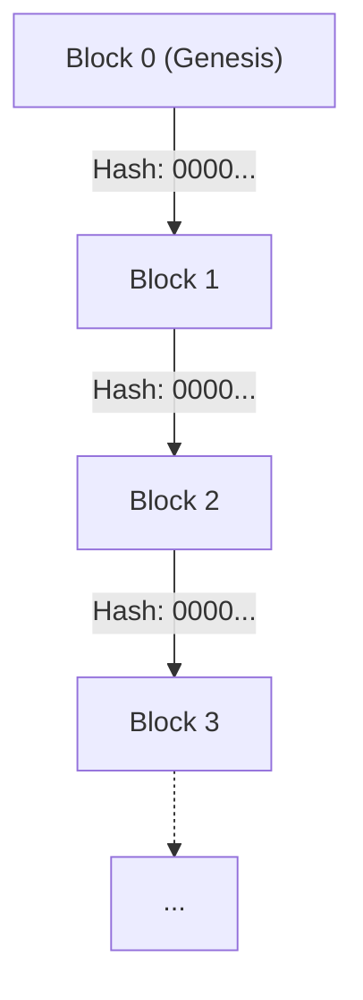
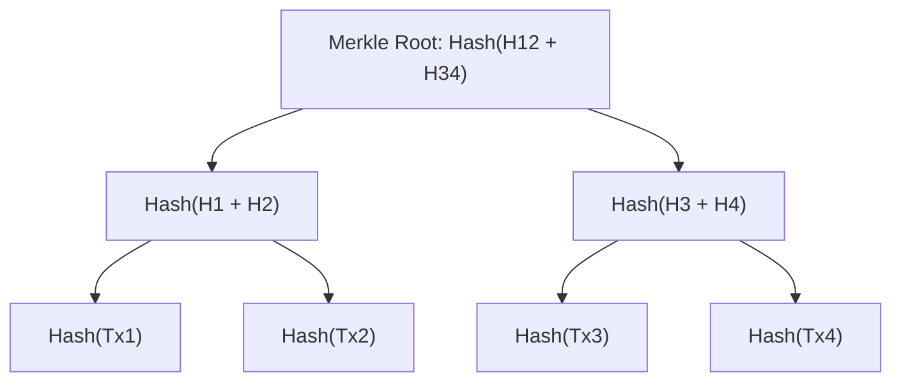
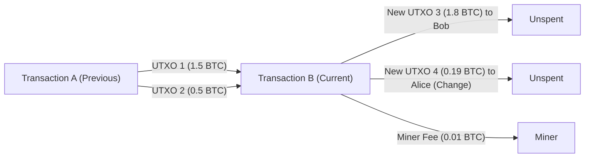

# Cryptocurrency and Bitcoin: Their History, Mathematical Foundations, and Future

In modern society, not a day goes by without hearing words like "Cryptocurrency" or "Bitcoin". However, very few people truly understand the technical and mathematical mechanisms behind them. In this article, we will explain in overwhelming detail how cryptocurrencies were born, what mathematical foundations they are built upon, and what challenges and possibilities they hold for the future.

## 1. Introduction: What is Cryptocurrency?

Cryptocurrency is a type of digital currency that uses cryptographic theory to secure transactions and control the creation of new units. While traditional fiat money is issued and managed by a single trusted entity like a central bank, cryptocurrency operates on a **decentralized** network with no central administrator.

### Comparison between Fiat Currency and Decentralized Systems

Fiat currency is a product of "trust". It works because the authority of the government guarantees its value. However, this system has several potential weaknesses.
- **Inflation Risk**: Because central banks can manipulate the money supply according to policy, excessive printing of banknotes leads to dilution of value.
- **Single Point of Failure (SPOF)**: If a financial institution's system goes down, transactions stop.
- **Possibility of Censorship**: There is always a risk that the accounts of specific individuals or organizations could be frozen.

In contrast, cryptocurrency aimed for a "trustless" system. In other words, it is a mechanism where the legitimacy of transactions is guaranteed by the mathematical and cryptographic robustness of the system itself, without having to trust any specific person.

## 2. History of Cryptocurrency: From Cypherpunks to Satoshi Nakamoto

Bitcoin was not born as a sudden mutation. Behind it lay decades of cryptographic history and an ideological movement of engineers who valued privacy.

### The Ideology of Cypherpunks

From the 1980s to the 1990s, a community of cryptographic engineers and activists called "Cypherpunks" was formed. They aimed to protect personal privacy using strong cryptographic technology and resist state surveillance and censorship.

Many ideas that laid the foundation for Bitcoin emerged from this community, such as David Chaum's "eCash", Adam Back's "Hashcash", and Nick Szabo's "Bit gold". However, none of these completely solved the "Double-spending problem" without a central administrator.

### The 2008 Financial Crisis and the Birth of Bitcoin

In 2008, a global financial crisis triggered by the collapse of Lehman Brothers occurred. In October of that year, when distrust in the existing financial system reached its peak, an anonymous person (or group) calling themselves "Satoshi Nakamoto" posted a paper to a cryptography mailing list.

The title was "Bitcoin: A Peer-to-Peer Electronic Cash System". This 9-page paper demonstrated how to solve the double-spending problem that had plagued previous attempts at electronic money in a completely decentralized manner using a mechanism called **Proof of Work (PoW)**.

### Genesis Block

On January 3, 2009, the Bitcoin network began operating. The first block mined is called the "Genesis Block (Block 0)". In this block, the following message was embedded by Satoshi Nakamoto:

> "The Times 03/Jan/2009 Chancellor on brink of second bailout for banks"

This was a headline from the British newspaper "The Times" at the time. It served as a strong irony against the financial bailout by the central bank, as well as a timestamp for a system meant to last forever.

## 3. Blockchain Architecture

The core technology that supports Bitcoin is the "Blockchain". Blockchain is a form of Distributed Ledger Technology (DLT) where data is grouped into units called "blocks", which are cryptographically linked together like a chain.

### Block Structure

A single block is broadly composed of a "Block Header" and "Transaction Data".

The Block Header includes the following information:
1. **Version**: Software version
2. **Previous Block Hash**: The hashed value of the previous block's header
3. **Merkle Root**: A hash value summarizing all transactions included in the block
4. **Timestamp**: The time the block was generated
5. **Difficulty Target (Bits)**: A value indicating the difficulty of Proof of Work
6. **Nonce**: An arbitrary number changed to find a hash value that meets the conditions during mining

### Merkle Trees

In a blockchain, a data structure called a **Merkle Tree** is used to efficiently detect data tampering while keeping the block size down. A Merkle Tree is a type of binary tree where the leaf nodes contain the hash values of each transaction, and parent nodes are created by concatenating and hashing the hash values of their child nodes.

If transaction data is altered even slightly, the hash of that leaf node changes, causing a chain reaction that completely alters the value of the Merkle Root. This makes it possible to instantly detect if there is even a single tampering among a vast amount of transaction data.

## 4. Mathematical and Cryptographic Foundations

Bitcoin's robustness is supported by advanced mathematical foundations. Here, we delve deeply into hash functions, public-key cryptography, and elliptic curve cryptography, which form its core.

### SHA-256 (Secure Hash Algorithm 256-bit)

The cryptographic hash function most frequently used in Bitcoin is **SHA-256**. A hash function is a one-way function that takes data of any length as input and outputs fixed-length data (256 bits in the case of SHA-256).

A hash function $$H$$ must satisfy the following properties:
1. **Pre-image resistance**: Given a hash value $$h$$, it must be computationally difficult to find an input $$x$$ such that $$H(x) = h$$.
2. **Second pre-image resistance**: Given an input $$x_1$$, it must be computationally difficult to find another input $$x_2$$ such that $$H(x_1) = H(x_2)$$.
3. **Collision resistance**: It must be computationally difficult to find any two inputs $$x_1, x_2$$ such that $$H(x_1) = H(x_2)$$.

In Bitcoin, SHA-256 is applied twice (this is called `SHA256(SHA256(x))`, or Hash256) in processes such as calculating block hashes and generating addresses from public keys.

### Public Key Cryptography and Digital Signatures

Ownership of cryptocurrency is proven by a pair of keys: a Private Key and a Public Key.
- **Private Key** $$k$$: A randomly generated 256-bit integer. It must never be known to anyone else.
- **Public Key** $$K$$: A key calculated from the private key using a one-way function. It is published on the network.

When Alice sends Bitcoin to Bob, Alice uses her private key to create a **Digital Signature** for the transaction data. Network participants can use Alice's public key to verify whether the signature is valid (whether Alice truly created it using her private key).

### Elliptic Curve Cryptography (ECC) and secp256k1

For Bitcoin's public key generation and digital signatures, **Elliptic Curve Cryptography (ECC)** is adopted instead of RSA encryption. ECC has the advantage of providing an equivalent level of security with a much shorter key length compared to RSA.

The specific elliptic curve parameters used in Bitcoin are called **secp256k1**. This curve is defined over a finite field $$\mathbb{F}_p$$ and is represented by the following equation:

$$
y^2 \equiv x^3 + 7 \pmod{p}
$$

Here, $$p$$ is a very large prime number:
$$
p = 2^{256} - 2^{32} - 2^{9} - 2^{8} - 2^{7} - 2^{6} - 2^{4} - 1
$$

The private key $$k$$ is a random number in the range from $$1$$ to $$n-1$$ ($$n$$ is the order of the curve). The public key $$K$$ is obtained by performing scalar multiplication on a certain Generator Point $$G$$ on the curve by the number of times specified by the private key.

$$
K = k \cdot G
$$

This calculation can be performed efficiently by repeating Point Addition and Point Doubling on the elliptic curve. However, calculating the private key $$k$$ backwards from the public key $$K$$ and the Generator Point $$G$$ is an extremely computationally difficult problem known as the **Elliptic Curve Discrete Logarithm Problem (ECDLP)**, which forms the foundation of cryptocurrency security.

### ECDSA (Elliptic Curve Digital Signature Algorithm)

**ECDSA** is used to sign transactions. The signature process when the message (transaction hash) is $$z$$ is as follows:

1. Select a random integer $$k_e$$ (ephemeral key) from $$1$$ to $$n-1$$.
2. Calculate the point $$(x_1, y_1) = k_e \cdot G$$ on the curve.
3. Calculate $$r = x_1 \pmod{n}$$. If $$r = 0$$, return to step 1.
4. Calculate $$s = k_e^{-1} (z + r \cdot k) \pmod{n}$$. If $$s = 0$$, return to step 1.
5. The signature is the pair $$(r, s)$$.

In the verification process, the following calculations are performed using the public key $$K$$ and the signature $$(r, s)$$:

1. $$u_1 = z \cdot s^{-1} \pmod{n}$$
2. $$u_2 = r \cdot s^{-1} \pmod{n}$$
3. Calculate the point $$(x_2, y_2) = u_1 \cdot G + u_2 \cdot K$$.
4. If $$r \equiv x_2 \pmod{n}$$, the signature is considered valid.

## 5. Consensus Algorithms and Proof of Work (PoW)

In a decentralized network, the consensus algorithm is the mechanism by which everyone agrees on the state of the same ledger.

### Byzantine Generals Problem

A classic problem in distributed computing is the "Byzantine Generals Problem". Multiple generals are besieging an enemy city and must agree on whether to attack or retreat, but there may be traitors among the generals who might send fake messages. The problem is how to reach a correct consensus with only honest generals under such circumstances.

Bitcoin practically solved this problem by combining **Proof of Work (PoW)** and the **Longest Chain Rule**.

### The Mathematics of Mining and Nonce

"Work" in PoW refers to a computational race to find a hash value that meets a specific condition. Miners continue to search for a value for the Nonce such that the hash value of the block header becomes smaller than the **Target** set by the network.

$$
\text{SHA256}(\text{SHA256}(\text{Block\_Header})) < \text{Target}
$$

Because the output of a hash function appears completely random, there is no efficient algorithm to find a nonce that meets the condition. The only way is to use a brute-force attack, changing the value of the nonce and repeating the hash calculation.

The smaller the target value, the lower the probability of finding a hash that meets the condition. If the target requires $$k$$ leading zeros, the average number of calculations required to find that block is $$2^k$$. This massive investment of computational energy makes it impossible to tamper with past records on the blockchain.

### Difficulty Adjustment

The Bitcoin network is designed so that a block is generated approximately every 10 minutes. However, the overall computing power (hash rate) of the network constantly fluctuates. Therefore, the target value is automatically adjusted every 2,016 blocks (about 2 weeks) based on the block generation intervals in the past.

$$
\text{New\_Target} = \text{Old\_Target} \times \frac{\text{Actual\_Time\_of\_Last\_2016\_Blocks}}{\text{20160\_Minutes}}
$$

If the hash rate increases, the target becomes smaller (difficulty increases), and if the hash rate decreases, the target becomes larger (difficulty decreases).

## 6. Transactions and the UTXO Model

Bitcoin transactions do not use a mechanism like bank account balances (account-based model), but rather adopt a model called **UTXO (Unspent Transaction Output)**.

### Inputs and Outputs

The physical entity of a Bitcoin "coin" does not exist. What exists is only a chain of UTXOs created by past transactions. Each transaction consumes existing UTXOs as "Inputs" and generates new UTXOs as "Outputs".

Suppose Alice wants to send 1.8 BTC to Bob. Alice specifies two UTXOs she owns, 1.5 BTC and 0.5 BTC (total 2.0 BTC), as inputs, and creates an output of 1.8 BTC addressed to Bob. Of the remaining 0.2 BTC, 0.19 BTC becomes an output addressed to Alice's new address as change, and the difference of 0.01 BTC becomes the fee for the miner who processed the transaction.

$$
\sum \text{Inputs} = \sum \text{Outputs} + \text{Transaction\_Fee}
$$

This UTXO model is easy to process in parallel because transactions are highly independent, and it is also superior from a privacy perspective (a new change address can be used every time).

## 7. The Future and Scalability Issues

Bitcoin is an extremely robust and secure system, but at the cost of significant challenges regarding scalability (extensibility of processing capacity). The current Bitcoin network can only process about 7 transactions per second (7 TPS). This is extremely slow compared to the tens of thousands of TPS of the Visa network.

### Forks: Soft Forks and Hard Forks

When upgrading the blockchain protocol, an event called a "fork" may occur.
- **Soft Fork**: A backward-compatible upgrade. Nodes following older rules still consider blocks following the new rules to be valid (e.g., the introduction of SegWit).
- **Hard Fork**: A non-backward-compatible upgrade. Blocks following the new rules are rejected by older nodes, potentially splitting the network completely into two (e.g., the birth of Bitcoin Cash).

### Lightning Network

A promising approach to solving scalability issues is the **Layer 2** solution known as the Lightning Network.

In the Lightning Network, participants open a "Payment Channel" off the blockchain (off-chain). Within the channel, as long as both parties agree, funds can be exchanged instantly and almost for free an unlimited number of times without recording transactions on the blockchain. Transactions are recorded on the blockchain (Layer 1) only when the final balance is settled.

### Comparison with Proof of Stake (PoS)

Another major challenge with PoW is the massive power consumption from mining. As a countermeasure to this environmental issue, networks like Ethereum have transitioned to another consensus algorithm called **Proof of Stake (PoS)**.

In PoS, the right to generate the next block (validators) is probabilistically assigned based on the amount of cryptocurrency held (stake) and the holding period, rather than computing power (hash rate). This reduces power consumption by over 99%, but there are also criticisms such as "isn't it a system where the rich get richer?" or "might it compromise true decentralization?". No matter how much it is criticized, Bitcoin continues to adhere to the philosophy of PoW: "securing physical security through the consumption of energy."

## 8. The Abyss of Cryptographic Theory: Mathematical Proofs and Protocol Robustness

Behind SHA-256 and Elliptic Curve Cryptography (ECC) explained in the previous chapters, there are two paradigms: information-theoretic security and computational security. Modern cryptocurrencies, including Bitcoin, primarily rely on Computational Security.

### Computational Security and the Discrete Logarithm Problem

Computational security is a security premise based on the idea that "breaking a certain cipher would require more time than the lifespan of the universe and astronomical computational resources, making it practically unbreakable."

Let's review the Elliptic Curve Discrete Logarithm Problem (ECDLP), which guarantees the security of Bitcoin's public-key cryptography, using mathematical formulas.
The problem is to find an unknown integer $$k$$ that satisfies $$Q = kP$$, given points $$P$$ and $$Q$$ on an elliptic curve $$E(\mathbb{F}_p)$$.
Using a classical computer, the computational complexity of the best algorithms to solve this problem (such as Pollard's $$\rho$$ algorithm) is $$\mathcal{O}(\sqrt{p})$$.
In Bitcoin's secp256k1, $$p \approx 2^{256}$$, so cracking it would require about $$2^{128}$$ operations. This is an amount of calculation that would take trillions of times longer than the age of the universe (about 13.8 billion years), even if all computers currently on Earth were mobilized.

### The Threat of Quantum Computers and Post-Quantum Cryptography

However, there is one major concern regarding computational security. That is the rise of **Quantum Computers**.
"Shor's Algorithm", published by Peter Shor in 1994, mathematically proved that if a quantum computer is used, problems such as the prime factorization problem (the foundation of RSA cryptography) and the discrete logarithm problem (the foundation of ECC) can be solved in polynomial time $$\mathcal{O}(n^3)$$.

If a practical, large-scale quantum computer with sufficient Qubits and a low error rate is completed, there will be a risk that private keys could be reverse-engineered from Bitcoin public keys.
The Bitcoin network's defense measures against this are as follows:

1. **Protection of Hash Functions**: A Bitcoin address is not the public key itself, but the result of applying the SHA-256 and RIPEMD-160 hash functions to the public key. Even using a quantum computer, reversing a hash function (even using Grover's algorithm, the computational complexity is $$\mathcal{O}(\sqrt{N})$$) remains difficult. Therefore, until a transaction is made and the public key is exposed to the network, the contents of the address can be considered safe even from quantum computers.
2. **Transition to Post-Quantum Cryptography (PQC)**: There is discussion about hard forking the Bitcoin protocol before quantum computers become practical to transition to new signature algorithms that are difficult even for quantum computers to crack, such as lattice-based cryptography or multivariate polynomial cryptography, which are being selected by NIST (National Institute of Standards and Technology).

## 9. Network Topology and P2P Protocol Details

The Bitcoin network is not just a collection of servers and clients, but is constructed as a complete **Peer-to-Peer (P2P)** network.

### Node Types and Roles

Computers participating in the network are called "Nodes". There are several types of nodes, each with a different role.

- **Full Node**: A node that downloads and verifies all blockchain data (over hundreds of GB) from the Genesis Block to the latest block. They are the backbone of network security, independently checking the validity of transactions and looking for double spending.
- **SPV Node (Simplified Payment Verification Node)**: A lightweight node that downloads only block headers rather than the entire blockchain. It is mainly used in smartphone wallets. It can verify whether its own transactions are included in a block (verifying the Merkle Path), but it does not have the verification capability of a full node.
- **Mining Node**: A node that performs PoW calculations and generates new blocks. Today, huge "mining pools," which bundle specialized mining hardware called ASICs (Application Specific Integrated Circuits), take on this role.

### Transaction Propagation Process (Gossip Protocol)

When a user (Alice) creates a transaction to send Bitcoin, how does that data spread around the world?

1. Alice's wallet (node) sends the transaction data to several connected peers (adjacent nodes).
2. Each peer that receives the transaction verifies whether it follows the correct rules (e.g., whether there is sufficient balance, whether the signature is correct, whether the format is valid).
3. If the verification is successful, the node saves the transaction in its own **Mempool** and forwards it to other adjacent nodes (Gossip Protocol).
4. If it is an invalid transaction, it is discarded and not forwarded.

As a result, valid transactions reach the Mempools of nodes worldwide within a few seconds. Miners preferentially select transactions with high fees from this Mempool and pack them into a new block.

## 10. The Economics of Blockchain: Game Theory and Incentive Design

Satoshi Nakamoto's greatest achievement was not just solving a cryptographic puzzle, but constructing a perfect **Incentive Design** where "the selfish actions of humans and organizations ultimately enhance the security of the entire network".

### Block Rewards and Halving

The reason miners make massive investments in electricity and hardware to mine blocks is because of the economic rewards. When a miner successfully generates a new block, they receive newly issued Bitcoins through a special transaction called a **Coinbase Transaction**.

The total supply of Bitcoin is capped at **21 million coins** by programming. Additionally, there is a built-in mechanism called **Halving**, where the mining reward per block is cut in half every 210,000 blocks (about 4 years).

- 2009~: 50 BTC
- 2012~: 25 BTC
- 2016~: 12.5 BTC
- 2020~: 6.25 BTC
- 2024~: 3.125 BTC

This disinflationary money supply model mimics the mining of gold and serves as an antithesis to the "inflation through infinite printing" that plagues fiat currencies.

### Game-Theoretic Analysis of a 51% Attack

The biggest threat to a blockchain is known as a **51% Attack**. If a single malicious entity were to control more than half (51% or more) of the network's overall computing power (hash rate), the following would become possible:

1. Reversing their own past transactions (double spending)
2. Refusing to approve specific transactions (censorship)

However, from the perspective of game theory, executing a 51% attack on the current large-scale Bitcoin network is extremely irrational.
Even if an attacker spent massive amounts of money (hundreds of billions of yen in hardware and massive electricity) to control a majority of the network, the moment the attack succeeded, trust in Bitcoin would collapse and its price would plummet. The Bitcoins acquired by the attacker would also become worthless. Thus, a Nash equilibrium has been established where **"rather than attacking the system, using that massive computing power for mining (following the legitimate rules) to earn rewards yields far greater economic benefits"**.

## 11. Conclusion: The New Future Shaped by Cryptocurrency

In this article, we thoroughly dissected the mathematical, technical, and economic mechanisms behind Bitcoin and cryptocurrencies.

While blockchain technology may seem like a complex mass of math and code at first glance, its essence is nothing less than **"a new consensus-building system for humanity that does not rely on authority, but takes mathematics and the laws of physics as the basis for trust."**

The financial system we use every day has collapsed time and again throughout its long history, and has undergone patchwork fixes each time. The solution presented by Satoshi Nakamoto is by no means perfect. There are countless hurdles to overcome, including scalability issues, environmental concerns, and national regulations and legal frameworks.

However, once unleashed from Pandora's box, the concept of a "trustless decentralized system" continues to evolve with no turning back. Whether Bitcoin will settle simply as digital gold, or whether it will be elevated into a true global payment network through the development of Layer 2 technologies, the outcome remains unknown. The only certain thing is that its future will be shaped not by a few authorities, but by the collective will of nodes, developers, and users worldwide participating in the network.

## Appendix: Resources and References for Deeper Learning

For those who wish to learn more deeply about blockchain technology and cryptographic theory after reading this article, here are some recommended resources.

### Must-Read Whitepapers
- **Bitcoin: A Peer-to-Peer Electronic Cash System** (Satoshi Nakamoto, 2008)
  - The monumental paper that started it all. In just 9 pages, the basic design of a distributed ledger combining PoW, incentives, and Merkle Trees is perfectly described.
- **Ethereum: A Secure Decentralised Generalised Transaction Ledger** (Gavin Wood, 2014)
  - Ethereum's Yellow Paper. It redefined the blockchain as an account-based state machine capable of executing Turing-complete smart contracts, in contrast to Bitcoin's UTXO model.

### Fundamentals of Cryptographic Theory and Mathematics
To truly understand the blockchain, knowledge of information security and applied mathematics is essential. We recommend studying the following fields:
1. **Abstract Algebra (Groups, Rings, Fields)**: In particular, the concept of finite fields (Galois Fields) is unavoidable when understanding elliptic curve cryptography.
2. **Computational Complexity Theory**: Concepts such as the P versus NP problem and polynomial-time reductions are important for understanding what cryptographic "security" means.
3. **Game Theory**: Provides a framework for mathematically modeling the incentive design of participants, such as Nash equilibria and the Byzantine Generals Problem.

> **Warning: Investment Disclaimer**
> This article was created for the purpose of explaining the underlying technology, history, and mathematical structure of cryptocurrencies, and does not recommend or solicit investment in any cryptocurrency. The prices of cryptocurrencies are extremely volatile, and investing carries significant risks, including the loss of principal.

The technical exploration of blockchain is an intellectual frontier where computer science, economics, and sociology intersect. By reading code, setting up a node yourself, and trying to generate transactions on a testnet, you will be able to feel the true potential and limits of this technology firsthand.
