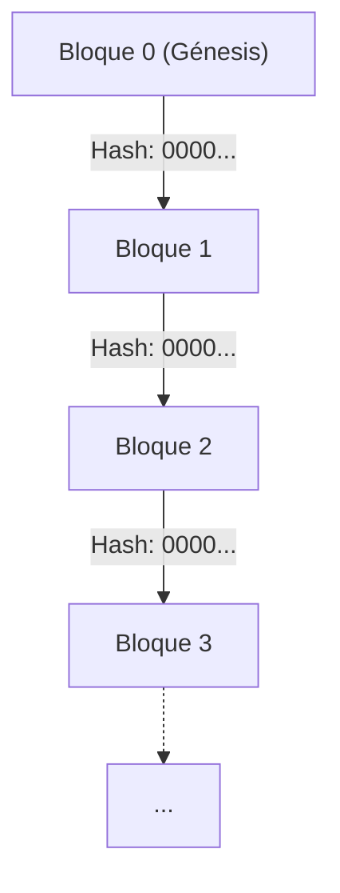
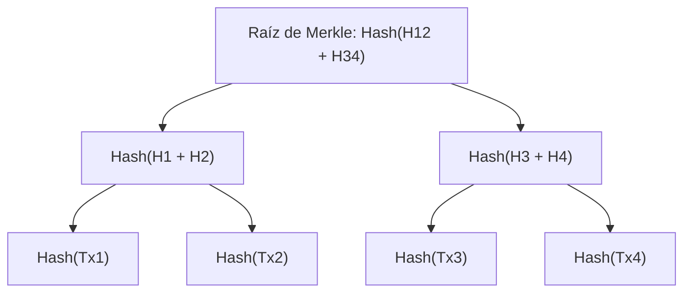
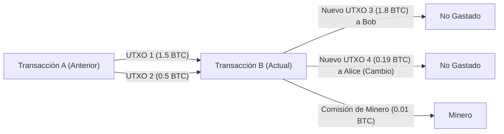

# Criptomonedas y Bitcoin: Su Historia, Fundamentos Matemáticos y Futuro

En la sociedad moderna, no hay un día en el que no escuchemos las palabras "Criptomoneda" o "Bitcoin". Sin embargo, muy pocas personas comprenden verdaderamente los mecanismos técnicos y matemáticos detrás de ellas. En este artículo, explicaremos con asombroso detalle cómo nacieron las criptomonedas, sobre qué fundamentos matemáticos se construyen y qué desafíos y posibilidades encierran para el futuro.

## 1. Introducción: ¿Qué son las Criptomonedas?

Una criptomoneda es un tipo de moneda digital que utiliza teoría criptográfica para garantizar la seguridad de las transacciones y controlar la emisión de nuevas unidades. Mientras que el dinero fiduciario tradicional (Fiat Money) es emitido y gestionado por una única autoridad confiable, como un banco central, las criptomonedas operan en una red **descentralizada (Decentralized)** sin un administrador central.

### Contraste entre el Dinero Fiduciario y los Sistemas Descentralizados

El dinero fiduciario es producto de la "confianza". Se basa en la autoridad del gobierno que garantiza su valor. Sin embargo, este sistema tiene varias debilidades subyacentes.
- **Riesgo de inflación**: Dado que el banco central puede manipular la oferta de dinero de acuerdo con las políticas, la impresión excesiva de billetes conduce a la dilución del valor.
- **Punto único de fallo (SPOF)**: Si el sistema de las instituciones financieras colapsa, las transacciones se detienen.
- **Posibilidad de censura**: Siempre existe el riesgo de que las cuentas de individuos u organizaciones específicas sean congeladas.

Por el contrario, las criptomonedas apuntaron a ser un sistema "sin confianza" (Trustless). En otras palabras, es un mecanismo donde no tienes que confiar en nadie en particular; la validez de la transacción está garantizada por la robustez matemática y criptográfica del sistema mismo.

## 2. Historia de las Criptomonedas: De los Cypherpunks a Satoshi Nakamoto

Bitcoin no nació como una mutación repentina. Detrás de él, hubo décadas de historia criptográfica y un movimiento ideológico de tecnólogos que valoraban la privacidad.

### La Ideología de los Cypherpunks

Desde los años 80 hasta los 90, se formó una comunidad de criptógrafos y activistas conocidos como "Cypherpunks". Su objetivo era utilizar tecnología criptográfica sólida para proteger la privacidad individual y contrarrestar la vigilancia y censura estatales.

De esta comunidad surgieron numerosas ideas que sentarían las bases para Bitcoin, como "eCash", concebido por David Chaum, "Hashcash" de Adam Back y "Bit gold" de Nick Szabo. Sin embargo, estos no lograron resolver completamente el "problema del doble gasto" (Double-spending problem) sin un administrador central.

### La Crisis Financiera de 2008 y el Nacimiento de Bitcoin

En 2008, estalló una crisis financiera mundial provocada por el colapso de Lehman Brothers. El 31 de octubre del mismo año, cuando la desconfianza en el sistema financiero existente había alcanzado su punto máximo, una persona (o grupo) anónima bajo el nombre de "Satoshi Nakamoto" publicó un artículo en una lista de correo de criptografía.

El título era "Bitcoin: A Peer-to-Peer Electronic Cash System" (Bitcoin: Un Sistema de Efectivo Electrónico Peer-to-Peer). Este documento de 9 páginas mostraba cómo resolver el problema del doble gasto que había plagado intentos anteriores de dinero electrónico de una manera completamente descentralizada utilizando un mecanismo llamado **Prueba de Trabajo (Proof of Work: [PoW](https://kenji.blog/es/p/blockchain-technology-smart-contract-distributed-ledger/))**.

### El Bloque Génesis (Genesis Block)

El 3 de enero de 2009, la red de Bitcoin comenzó a operar. El primer bloque minado se llama "Bloque Génesis" (Bloque 0). En este bloque, Satoshi Nakamoto grabó el siguiente mensaje:

> "The Times 03/Jan/2009 Chancellor on brink of second bailout for banks"
> (The Times 3 de enero de 2009 El Canciller al borde del segundo rescate a los bancos)

Este era el titular del periódico británico "The Times" de la época, y servía como una fuerte ironía hacia las medidas de rescate financiero por parte del banco central, al tiempo que actuaba como una marca de tiempo para que Bitcoin permaneciera eternamente como sistema.

## 3. Arquitectura [Blockchain](https://kenji.blog/es/p/blockchain-technology-smart-contract-distributed-ledger/)

La tecnología central que soporta Bitcoin es la "Cadena de bloques" (Blockchain). Blockchain es una forma de Tecnología de Libro Mayor Distribuido ([Distributed Ledger](https://kenji.blog/es/p/blockchain-technology-smart-contract-distributed-ledger/) Technology: DLT), que tiene una estructura donde los datos se agrupan en unidades llamadas "bloques" y están vinculados criptográficamente como una cadena.

### Estructura de un Bloque

Un bloque se compone principalmente de una "Cabecera de bloque" (Block Header) y "Datos de transacción" ([Transaction](https://kenji.blog/es/p/rdbms-transaction-acid-isolation-level-lock/) Data).

La cabecera de bloque contiene la siguiente información:
1. **Versión (Version)**: Versión del software.
2. **Hash del bloque anterior (Previous Block Hash)**: El valor hash de la cabecera del bloque inmediatamente anterior.
3. **Raíz de Merkle (Merkle Root)**: Un valor hash que resume todas las transacciones incluidas en el bloque.
4. **Marca de tiempo (Timestamp)**: La hora a la que se generó el bloque.
5. **Objetivo de dificultad (Difficulty Target, Bits)**: Un valor que indica la dificultad de la Prueba de Trabajo.
6. **Nonce**: Un número arbitrario que se cambia para encontrar un valor hash que cumpla con la condición durante la minería.

### Árboles de Merkle (Merkle Trees)

En blockchain, se utiliza una estructura de datos llamada **Árbol de Merkle (Merkle [Tree](https://kenji.blog/es/p/tree-graph-data-structures-search-dfs-bfs-dijkstra/))** para detectar eficientemente la manipulación de datos mientras se mantiene bajo el tamaño del bloque. El Árbol de Merkle es un tipo de árbol binario donde los nodos hoja contienen el valor hash de cada transacción, y los nodos padre son los valores hash concatenados de sus nodos hijos, aplicándoseles hash nuevamente.

Si los datos de una transacción se alteran aunque sea un poco, el hash de su nodo hoja cambia, lo que causa una reacción en cadena que resulta en un valor completamente diferente para la raíz de Merkle. Esto hace posible detectar instantáneamente si hay incluso una sola alteración entre cantidades masivas de datos de transacciones.

## 4. Fundamentos Matemáticos y Criptográficos

La robustez de Bitcoin está respaldada por una base matemática avanzada. Aquí profundizaremos en las funciones hash, la criptografía de clave pública y la criptografía de curva elíptica que forman su núcleo.

### SHA-256 (Secure Hash Algorithm 256-bit)

La función hash criptográfica más frecuentemente utilizada en Bitcoin es **SHA-256**. Una función hash es una función unidireccional que toma datos de longitud arbitraria como entrada y produce datos de longitud fija (256 bits en el caso de SHA-256) como salida.

La función hash $H$ debe satisfacer las siguientes propiedades:
1. **Resistencia a la preimagen (Pre-image resistance)**: Dado un valor hash $h$, es computacionalmente difícil encontrar una entrada $x$ tal que $H(x) = h$.
2. **Segunda resistencia a la preimagen (Second pre-image resistance)**: Dada una entrada $x_1$, es difícil encontrar otra entrada $x_2$ tal que $H(x_1) = H(x_2)$.
3. **Resistencia a colisiones (Collision resistance)**: Es difícil encontrar dos entradas arbitrarias $x_1, x_2$ tal que $H(x_1) = H(x_2)$.

En Bitcoin, SHA-256 se aplica doblemente en procesos como el cálculo de hashes de bloques y la generación de direcciones a partir de claves públicas (esto se llama `SHA256(SHA256(x))` o Hash256).

### Criptografía de Clave Pública ([Public Key](https://kenji.blog/es/p/modern-cryptography-public-key-hash-signature/) [Cryptography](https://kenji.blog/es/p/modern-cryptography-public-key-hash-signature/)) y Firmas Digitales

La propiedad de una criptomoneda se demuestra mediante un par de clave privada (Private Key) y clave pública (Public Key).
- **Clave privada** $k$: Un número entero de 256 bits generado aleatoriamente. Nunca debe ser conocido por otros.
- **Clave pública** $K$: Una clave calculada a partir de la clave privada utilizando una función unidireccional. Se publica en la red.

Cuando Alice envía Bitcoin a Bob, Alice usa su clave privada para crear una **firma digital ([Digital Signature](https://kenji.blog/es/p/modern-cryptography-public-key-hash-signature/))** para los datos de la transacción. Los participantes de la red pueden usar la clave pública de Alice para verificar si la firma es válida (si realmente fue creada por Alice usando su clave privada).

### Criptografía de Curva Elíptica (Elliptic Curve Cryptography: ECC) y secp256k1

Para la generación de claves públicas de Bitcoin y firmas digitales, se emplea **criptografía de curva elíptica (ECC)** en lugar del cifrado [RSA](https://kenji.blog/es/p/modern-cryptography-public-key-hash-signature/). ECC tiene la ventaja de proporcionar niveles de seguridad equivalentes con tamaños de clave mucho más cortos en comparación con RSA.

Los parámetros específicos de la curva elíptica utilizada en Bitcoin se llaman **secp256k1**. Esta curva está definida sobre un campo finito $\mathbb{F}_p$ y se expresa mediante la siguiente ecuación:

$$
y^2 \equiv x^3 + 7 \pmod{p}
$$

Donde $p$ es un número primo muy grande:
$$
p = 2^{256} - 2^{32} - 2^{9} - 2^{8} - 2^{7} - 2^{6} - 2^{4} - 1
$$

La clave privada $k$ es un número aleatorio en el rango de $1$ a $n-1$ ($n$ es el orden de la curva). La clave pública $K$ se obtiene mediante la multiplicación escalar de un punto base (Generator Point) $G$ en la curva por el número de veces de la clave privada.

$$
K = k \cdot G
$$

Este cálculo se puede realizar de manera eficiente repitiendo la suma de puntos (Point Addition) y la duplicación de puntos (Point Doubling) en la curva elíptica. Sin embargo, a la inversa, calcular la clave privada $k$ a partir de la clave pública $K$ y el punto base $G$ es un problema computacionalmente extremadamente difícil llamado el **Problema del Logaritmo Discreto de Curva Elíptica (Elliptic Curve Discrete Logarithm Problem: ECDLP)**, que forma el núcleo de la seguridad de las criptomonedas.

### ECDSA (Elliptic Curve Digital Signature Algorithm)

**ECDSA** se utiliza para firmar transacciones. Cuando el mensaje (hash de la transacción) es $z$, el proceso de firma es el siguiente:

1. Seleccionar un número entero aleatorio $k_e$ (clave efímera) entre $1$ y $n-1$.
2. Calcular el punto en la curva $(x_1, y_1) = k_e \cdot G$.
3. Calcular $r = x_1 \pmod{n}$. Si $r = 0$, volver al paso 1.
4. Calcular $s = k_e^{-1} (z + r \cdot k) \pmod{n}$. Si $s = 0$, volver al paso 1.
5. La firma es el par $(r, s)$.

En el proceso de verificación, se realizan los siguientes cálculos usando la clave pública $K$ y la firma $(r, s)$:

1. $u_1 = z \cdot s^{-1} \pmod{n}$
2. $u_2 = r \cdot s^{-1} \pmod{n}$
3. Calcular el punto $(x_2, y_2) = u_1 \cdot G + u_2 \cdot K$.
4. Si $r \equiv x_2 \pmod{n}$, la firma se considera válida.

## 5. Algoritmo de Consenso y Prueba de Trabajo ([PoW](https://kenji.blog/es/p/blockchain-technology-smart-contract-distributed-ledger/))

En una red descentralizada, un algoritmo de consenso es el mecanismo para que todos acuerden el mismo estado del libro mayor.

### Problema de los Generales Bizantinos ([Byzantine Generals](https://kenji.blog/es/p/byzantine-generals-problem-consensus/) Problem)

El "Problema de los Generales Bizantinos" es un problema clásico en la computación distribuida. Múltiples generales están asediando una ciudad enemiga y deben acordar si atacar o retirarse. Sin embargo, puede haber traidores entre los generales que envían mensajes falsos. El problema es cómo los generales honestos pueden llegar a un acuerdo correcto en tal situación.

Bitcoin resolvió prácticamente este problema combinando la **Prueba de Trabajo ([PoW](https://kenji.blog/es/p/blockchain-technology-smart-contract-distributed-ledger/))** y la **Regla de la Cadena Más Larga (Longest Chain Rule)**.

### Matemáticas de la Minería y Nonce

En PoW, "Trabajo" (Work) se refiere a la competencia de cálculo para encontrar un valor hash que cumpla con ciertas condiciones. Los mineros buscan continuamente un valor "Nonce" tal que el valor hash de la cabecera del bloque sea menor que un **Objetivo (Target)** establecido por la red.

$$
\text{SHA256}(\text{SHA256}(\text{Cabecera\_del\_Bloque})) < \text{Objetivo}
$$

Dado que la salida de una función hash parece completamente aleatoria, no hay un algoritmo eficiente para encontrar un nonce que cumpla con las condiciones. La única forma es un ataque de fuerza bruta (Brute-force) alterando implacablemente el valor del nonce y repitiendo el cálculo del hash.

Cuanto menor sea el valor del objetivo, menor será la probabilidad de encontrar un hash que cumpla con las condiciones. Si el objetivo es un valor que requiere $k$ ceros a la izquierda, el número medio de cálculos necesarios para encontrar ese bloque es de $2^k$ veces. Es esta entrada de energía de cálculo masiva lo que hace imposible alterar registros pasados en la cadena de bloques.

### Ajuste de Dificultad (Difficulty Adjustment)

La red de Bitcoin está diseñada para generar un bloque aproximadamente cada 10 minutos. Sin embargo, la potencia computacional (tasa de hash) de toda la red fluctúa constantemente. Por lo tanto, cada 2016 bloques (aproximadamente 2 semanas), el valor del objetivo se ajusta automáticamente basándose en el intervalo de generación de bloques pasados.

$$
\text{Nuevo\_Objetivo} = \text{Viejo\_Objetivo} \times \frac{\text{Tiempo\_Real\_de\_los\_Últimos\_2016\_Bloques}}{\text{20160\_Minutos}}
$$

Si la tasa de hash aumenta, el objetivo se vuelve más pequeño (aumento de dificultad); si la tasa de hash disminuye, el objetivo se vuelve más grande (disminución de dificultad).

## 6. Transacciones y el Modelo UTXO

Las transacciones de Bitcoin no utilizan un mecanismo similar a los saldos de cuentas bancarias (modelo basado en cuentas), sino que adoptan el modelo **UTXO (Unspent [Transaction](https://kenji.blog/es/p/rdbms-transaction-acid-isolation-level-lock/) Output: Salida de Transacción No Gastada)**.

### Entradas y Salidas

No existe una entidad física llamada "moneda" en Bitcoin. Lo único que existe es una cadena de UTXOs creados por transacciones pasadas. Cada transacción consume UTXOs existentes como "entradas" (Inputs) y genera nuevos UTXOs como "salidas" (Outputs).

Supongamos que Alice quiere enviar 1.8 BTC a Bob. Alice designa dos UTXOs que posee, 1.5 BTC y 0.5 BTC (un total de 2.0 BTC), como entradas y crea una salida de 1.8 BTC para Bob. De los 0.2 BTC restantes, 0.19 BTC se convierte en una salida para la nueva dirección de Alice como cambio (Change), y la diferencia de 0.01 BTC se convierte en la comisión (Fee) para el minero que procesó la transacción.

$$
\sum \text{Entradas} = \sum \text{Salidas} + \text{Comisión\_de\_Transacción}
$$

Este modelo UTXO es altamente independiente para cada transacción, lo que facilita el procesamiento en paralelo y también es superior desde una perspectiva de privacidad (se puede usar una nueva dirección de cambio cada vez).

## 7. Futuro y el Problema de Escalabilidad

Bitcoin es un sistema extremadamente robusto y seguro, pero a cambio enfrenta desafíos importantes de escalabilidad (capacidad de expansión del procesamiento). La red actual de Bitcoin solo puede procesar aproximadamente 7 transacciones por segundo (7 TPS). Esto es extremadamente lento en comparación con las decenas de miles de TPS de la red Visa.

### Bifurcaciones (Forks): Soft Fork y Hard Fork

Al actualizar el protocolo blockchain, puede ocurrir un evento llamado "bifurcación" (Fork).
- **Bifurcación suave (Soft Fork)**: Una actualización retrocompatible. Incluso los nodos con las reglas antiguas consideran válidos los bloques con las nuevas reglas (Ej. Introducción de SegWit).
- **Bifurcación dura (Hard Fork)**: Una actualización que no es retrocompatible. Los bloques con las nuevas reglas son rechazados por los nodos antiguos, por lo que la red puede dividirse completamente en dos (Ej. El nacimiento de Bitcoin Cash).

### Lightning Network

Un enfoque prometedor para resolver el problema de escalabilidad es Lightning Network, una solución de **Capa 2 (Layer 2)**.

En Lightning Network, los participantes abren "Canales de Pago" (Payment Channels) fuera de la cadena de bloques (fuera de la cadena). Dentro del canal, siempre que ambas partes estén de acuerdo, los fondos se pueden intercambiar de forma instantánea, casi sin costo y en innumerables ocasiones sin registrar la transacción en la cadena de bloques. Solo en la liquidación del saldo final se registra la transacción en la cadena de bloques (Capa 1).

### Comparación con Prueba de Participación ([PoS](https://kenji.blog/es/p/blockchain-technology-smart-contract-distributed-ledger/))

Otro gran desafío de [PoW](https://kenji.blog/es/p/blockchain-technology-smart-contract-distributed-ledger/) es el enorme consumo de energía de la minería. Como contramedida a este problema ambiental, Ethereum y otros han migrado a otro algoritmo de consenso llamado **Prueba de Participación (Proof of Stake: PoS)**.

En PoS, el derecho a generar el siguiente bloque (validador) se asigna probabilísticamente en función de la cantidad de criptomoneda retenida (participación) y el período de retención, en lugar de la potencia computacional (tasa de hash). Esto reduce el consumo de energía en más del 99%, pero existen críticas de que "es un sistema donde los ricos se hacen más ricos" y de que "la descentralización completa podría verse comprometida". Sin embargo, independientemente de cuánto sea criticado, Bitcoin continúa adhiriéndose a la filosofía PoW de "seguridad física a través del consumo de energía".

## 8. El Abismo de la Teoría Criptográfica: Demostraciones Matemáticas y Robustez del Protocolo

Detrás de SHA-256 y la criptografía de curva elíptica (ECC) explicadas en los capítulos anteriores, hay dos paradigmas: seguridad de la información teórica y seguridad computacional. Las criptomonedas modernas, incluido Bitcoin, se basan principalmente en la seguridad computacional (Computational Security).

### Seguridad Computacional y el Problema del Logaritmo Discreto

La seguridad computacional es la seguridad basada en la premisa de que "descifrar una cierta criptografía requiere una cantidad astronómica de recursos informáticos y más tiempo que la vida del universo, por lo que es prácticamente indescifrable".

Reafirmemos en forma de fórmula el problema del logaritmo discreto de curva elíptica (ECDLP) que garantiza la seguridad de la criptografía de clave pública de Bitcoin.
El problema es encontrar el número entero desconocido $k$ que satisface $Q = kP$, donde los puntos $P$ y $Q$ están en la curva elíptica $E(\mathbb{F}_p)$.
Utilizando computadoras clásicas, la complejidad temporal del mejor algoritmo para resolver este problema (como el algoritmo $\rho$ de Pollard) es $\mathcal{O}(\sqrt{p})$.
Dado que $p \approx 2^{256}$ en secp256k1 de Bitcoin, el descifrado requiere alrededor de $2^{128}$ operaciones. Esta es una cantidad de cálculo que tomaría trillones de veces más que la vida útil del universo (aproximadamente 13.8 mil millones de años), incluso si todas las computadoras de la tierra hoy en día se movilizaran.

### La Amenaza de las Computadoras Cuánticas y la Criptografía Poscúantica

Sin embargo, hay una gran preocupación con la seguridad computacional. Ese es el surgimiento de las **computadoras cuánticas (Quantum Computers)**.
En 1994, Peter Shor publicó el "[Algoritmo de Shor](https://kenji.blog/es/p/quantum-computing-shors-algorithm/)" (Shor's Algorithm), que demostró matemáticamente que las computadoras cuánticas pueden resolver el problema de factorización de enteros (la base del cifrado [RSA](https://kenji.blog/es/p/modern-cryptography-public-key-hash-signature/)) y el problema del logaritmo discreto (la base de ECC) en tiempo polinomial $\mathcal{O}(n^3)$.

Si se completan computadoras cuánticas prácticas a gran escala con suficientes qubits y bajas tasas de error, existe el riesgo de que la clave privada pueda ser calculada inversamente a partir de la clave pública de Bitcoin.
Las medidas de defensa de la red de Bitcoin contra esto son las siguientes:

1. **Protección de funciones hash**: Una dirección de Bitcoin no es la clave pública en sí, sino el resultado de aplicar las funciones hash SHA-256 y RIPEMD-160 a la clave pública. Incluso utilizando computadoras cuánticas, invertir una función hash (incluso con el algoritmo de Grover, la complejidad es $\mathcal{O}(\sqrt{N})$) sigue siendo difícil. Por lo tanto, hasta que se realice una transacción y la clave pública se exponga a la red, el contenido de la dirección se considera seguro incluso contra computadoras cuánticas.
2. **Migración a Criptografía Poscúantica (Post-Quantum [Cryptography](https://kenji.blog/es/p/modern-cryptography-public-key-hash-signature/): PQC)**: Se está discutiendo realizar una bifurcación dura en el protocolo de Bitcoin antes de que las computadoras cuánticas se vuelvan prácticas, con el fin de migrar a nuevos algoritmos de firma que sean difíciles de descifrar incluso para las computadoras cuánticas, como la criptografía basada en retículos (Lattice-based cryptography) y la criptografía polinómica multivariable (Multivariate polynomial cryptography) seleccionadas por el NIST (Instituto Nacional de Estándares y Tecnología de EE. UU.).

## 9. Topología de Red y Detalles del Protocolo [P2P](https://kenji.blog/es/p/webrtc-realtime-communication-p2p/)

La red de Bitcoin no es solo una colección de servidores y clientes, sino que está construida como una red **Peer-to-Peer (P2P)** completa.

### Tipos y Funciones de los Nodos

Las computadoras que participan en la red se llaman "Nodos" (Nodes). Hay varios tipos de nodos, cada uno con roles diferentes.

- **Nodo Completo (Full Node)**: Un nodo que descarga y verifica todos los datos de la cadena de bloques (cientos de GB o más) desde el bloque génesis hasta el último bloque. Es la columna vertebral de la seguridad de la red porque verifica de forma independiente la validez de las transacciones y la presencia del doble gasto.
- **Nodo SPV (Simplified Payment Verification Node)**: Un nodo ligero que descarga solo las cabeceras de los bloques en lugar de toda la cadena de bloques. Se utiliza principalmente en billeteras de teléfonos inteligentes. Puede verificar si sus propias transacciones están incluidas en un bloque (verificación de ruta de Merkle), pero carece de las capacidades de verificación de un nodo completo.
- **Nodo Minero (Mining Node)**: Un nodo que realiza cálculos de [PoW](https://kenji.blog/es/p/blockchain-technology-smart-contract-distributed-ledger/) y genera nuevos bloques. Hoy en día, enormes "grupos de minería" (Mining pools) que agrupan hardware dedicado a la minería llamado ASIC (Application Specific Integrated Circuit) asumen este papel.

### Proceso de Propagación de Transacciones (Gossip Protocol)

Cuando un usuario (Alice) crea una transacción para enviar Bitcoin, ¿cómo se difunden esos datos a nivel mundial?

1. La billetera (nodo) de Alice envía los datos de la transacción a algunos pares (nodos adyacentes) conectados a ella.
2. Cada par que recibe la transacción verifica si sigue las reglas correctas (si hay saldo suficiente, si la firma es correcta, si el formato coincide, etc.).
3. Si la verificación es exitosa, guarda esa transacción en su propia **mempool (Memory Pool)** y la reenvía a otros nodos adyacentes (Protocolo de Chismes / Gossip Protocol).
4. Si la transacción es inválida, se descarta y no se reenvía.

De esta manera, las transacciones válidas se extienden a las mempools de los nodos en todo el mundo en cuestión de segundos. Los mineros priorizan las transacciones con comisiones altas (Fees) de esta mempool y las empaquetan en nuevos bloques.

## 10. Economía de [Blockchain](https://kenji.blog/es/p/blockchain-technology-smart-contract-distributed-ledger/): Teoría de Juegos y Diseño de Incentivos

El mayor logro de Satoshi Nakamoto no fue solo resolver el rompecabezas criptográfico, sino también construir un **diseño de incentivos (Incentive Design)** perfecto donde "las acciones egoístas de individuos y organizaciones, en última instancia, aumentan la seguridad de toda la red".

### Recompensa de Bloque y Halving (Reducción a la Mitad)

La razón por la cual los mineros extraen bloques incluso invirtiendo enormes cantidades de electricidad y hardware es que existe una recompensa económica. Cuando un minero genera con éxito un nuevo bloque, recibe Bitcoins recién emitidos a través de una transacción especial llamada **transacción coinbase (Coinbase [Transaction](https://kenji.blog/es/p/rdbms-transaction-acid-isolation-level-lock/))**.

La emisión total de Bitcoin está limitada programáticamente a **21 millones de monedas**. Además, se incorpora un mecanismo de **reducción a la mitad (Halving)** en el que la recompensa minera por bloque se reduce a la mitad cada 210,000 bloques (aproximadamente cada 4 años).

- 2009~: 50 BTC
- 2012~: 25 BTC
- 2016~: 12.5 BTC
- 2020~: 6.25 BTC
- 2024~: 3.125 BTC

Este modelo de oferta monetaria desinflacionaria imita la minería de oro y sirve como antítesis de la "inflación a través de la impresión infinita" que aflige a las monedas fiduciarias.

### Análisis Teórico de Juegos del Ataque del 51% (51% Attack)

La mayor amenaza para una cadena de bloques es el **ataque del 51%**. Si una sola entidad maliciosa controla más de la mitad (51% o más) del poder computacional (tasa de hash) de toda la red, puede hacer lo siguiente:

1. Revertir sus propias transacciones pasadas (doble gasto).
2. Rechazar la aprobación de transacciones específicas (censura).

Sin embargo, desde la perspectiva de la teoría de juegos, lanzar un ataque del 51% en la actual red masiva de Bitcoin es extremadamente irracional.
Incluso si uno invierte costos enormes (miles de millones de dólares en hardware y electricidad masiva) para dominar la mayoría de la red, en el momento en que el ataque tenga éxito, se perderá la confianza en Bitcoin y el precio se desplomará. Dado que los Bitcoins adquiridos por el atacante también perderían su valor, se ha establecido un equilibrio de Nash que indica: **"Es mucho más beneficioso económicamente usar ese enorme poder de cálculo para minar (siguiendo reglas legítimas) y ganar recompensas que atacar el sistema"**.

## 11. Conclusión: La Nueva Forma del Futuro Abierta por las Criptomonedas

En este artículo, hemos analizado exhaustivamente los mecanismos matemáticos, técnicos y económicos detrás de Bitcoin y las criptomonedas.

A primera vista, la tecnología blockchain puede parecer una masa compleja de matemáticas y código, pero su esencia no es otra que **"un nuevo sistema de consenso para la humanidad que se basa en las matemáticas y las leyes de la física como base de la confianza, sin depender de la autoridad"**.

El sistema financiero que utilizamos como algo habitual todos los días ha colapsado muchas veces a lo largo de su larga historia, y en cada ocasión se ha corregido con parches. La solución propuesta por Satoshi Nakamoto no es de ninguna manera perfecta. Existen innumerables obstáculos por superar, como los problemas de escalabilidad, los problemas ambientales y las regulaciones nacionales junto con el marco legal.

Sin embargo, el concepto de un "sistema descentralizado sin confianza", una vez liberado de la caja de Pandora, ha continuado evolucionando sin vuelta atrás. Si Bitcoin se establecerá como mero oro digital, o si se sublimará en una verdadera red de pagos global a través del desarrollo de la tecnología de Capa 2, su final es aún desconocido para cualquiera. Lo único que es seguro es que el futuro no será moldeado por unos pocos en el poder, sino por el consenso de todos los nodos, desarrolladores y usuarios de todo el mundo que participan en la red.

## Apéndice: Recursos y Referencias para un Aprendizaje Profundo

Para aquellos que leyeron este artículo y desean aprender más profundamente sobre la tecnología blockchain y la teoría criptográfica, a continuación se presentan algunos recursos recomendados.

### Artículos Originales de Lectura Obligatoria (Whitepapers)
- **Bitcoin: A Peer-to-Peer Electronic Cash System** (Satoshi Nakamoto, 2008)
  - El documento monumental donde todo comenzó. En solo 9 páginas, el diseño básico de un libro mayor distribuido que combina PoW, incentivos y árboles de Merkle se describe perfectamente.
- **Ethereum: A Secure Decentralised Generalised Transaction Ledger** (Gavin Wood, 2014)
  - El Yellow Paper de Ethereum. Redefinió la cadena de bloques como una máquina de estado basada en cuentas capaz de ejecutar contratos inteligentes Turing-completos, en contraste con el modelo UTXO de Bitcoin.

### Fundamentos de Criptografía y Matemáticas
Para comprender verdaderamente la cadena de bloques, es esencial el conocimiento de la seguridad de la información y las matemáticas aplicadas. Se recomienda estudiar los siguientes campos:
1. **Álgebra Abstracta (Grupos, Anillos, Campos)**: Particularmente, el concepto de campos finitos (Galois Field) es inevitable para comprender la criptografía de curva elíptica.
2. **Teoría de la Complejidad Computacional**: Conceptos como el problema de P frente a NP y la reducción de tiempo polinomial son importantes para comprender qué significa la "seguridad" de la criptografía.
3. **Teoría de Juegos**: Proporciona un marco para modelar matemáticamente el diseño de incentivos para los participantes, como el Equilibrio de Nash y el Problema de los Generales Bizantinos.

> **Warning: Descargo de responsabilidad sobre la inversión**
> Este artículo fue creado con el propósito de explicar la tecnología subyacente de las criptomonedas, así como su historia y estructura matemática, y no recomienda ni solicita inversión en ninguna criptomoneda. El precio de las criptomonedas es extremadamente volátil y la inversión conlleva riesgos significativos, incluida la pérdida del capital.

La exploración tecnológica de blockchain es una frontera de conocimiento donde se cruzan las ciencias de la computación, la economía y la sociología. Al leer el código, configurar tu propio nodo y crear transacciones en la red de prueba (testnet), podrás sentir verdaderamente el verdadero potencial y las limitaciones de esta tecnología de primera mano.
