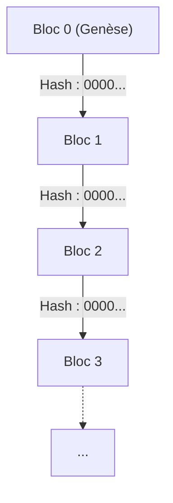
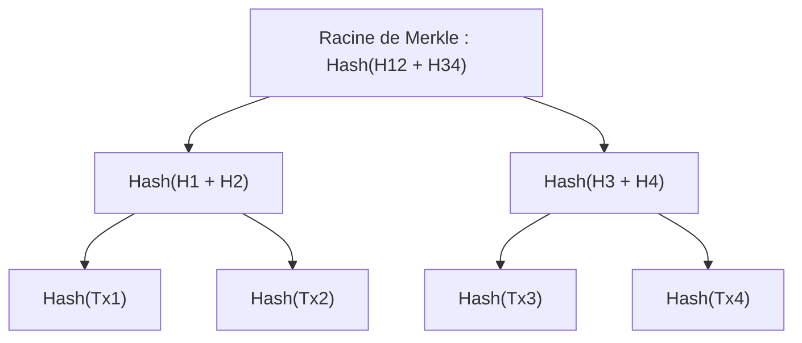
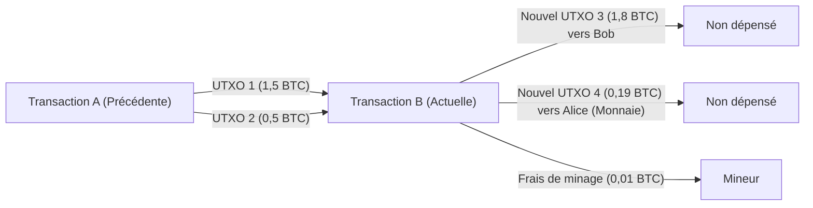

# Cryptomonnaie et Bitcoin : leur histoire, fondements mathématiques et avenir

Dans la société moderne, il ne se passe pas un jour sans que l'on entende les mots « cryptomonnaie » ou « Bitcoin ». Cependant, très peu de personnes comprennent véritablement les mécanismes techniques et mathématiques qui se cachent derrière eux. Cet article explique de manière exhaustive comment les cryptomonnaies sont nées, sur quelles bases mathématiques elles reposent, et quels sont leurs défis et possibilités pour l'avenir.

## 1. Introduction : Qu'est-ce que la cryptomonnaie ?

La cryptomonnaie est un type de monnaie numérique qui utilise la cryptographie pour garantir la sécurité des transactions et contrôler la création de nouvelles unités. Contrairement à la monnaie fiduciaire (Fiat Money) traditionnelle, qui est émise et gérée par une seule institution de confiance telle qu'une banque centrale, la cryptomonnaie fonctionne sur un réseau **décentralisé (Decentralized)** sans administrateur central.

### Contraste entre monnaie fiduciaire et système décentralisé

La monnaie fiduciaire est le produit de la « confiance ». Elle fonctionne parce qu'une autorité, le gouvernement, garantit sa valeur. Cependant, ce système présente quelques faiblesses potentielles.
- **Risque d'inflation** : Étant donné que la banque centrale peut manipuler l'offre de monnaie en fonction de sa politique, l'impression excessive de billets de banque entraîne une dilution de la valeur.
- **Point de défaillance unique (SPOF)** : Si le système d'une institution financière tombe en panne, les transactions sont interrompues.
- **Possibilité de censure** : Il existe toujours un risque que les comptes d'individus ou d'organisations spécifiques soient gelés.

En revanche, les cryptomonnaies visaient un système « sans confiance (Trustless) ». En d'autres termes, il s'agit d'un mécanisme dans lequel la validité d'une transaction est garantie par la robustesse mathématique et cryptographique du système lui-même, sans avoir à faire confiance à qui que ce soit de spécifique.

## 2. L'histoire des cryptomonnaies : des Cypherpunks à Satoshi Nakamoto

Le Bitcoin n'est pas né comme une mutation soudaine. Derrière lui, se cachent des décennies d'histoire de la cryptographie et un mouvement idéologique de technologues qui valorisent la vie privée.

### L'idéologie des Cypherpunks

Des années 1980 aux années 1990, une communauté de cryptographes et d'activistes appelés « Cypherpunks » a été formée. Ils visaient à utiliser des techniques cryptographiques fortes pour protéger la vie privée des individus et contrer la surveillance et la censure de l'État.

De nombreuses idées qui allaient constituer les fondements du Bitcoin ont émergé de cette communauté, telles que « eCash » inventé par David Chaum, « Hashcash » d'Adam Back et « Bit gold » de Nick Szabo. Cependant, elles n'ont pas réussi à résoudre complètement le « problème de la double dépense (Double-spending problem) » sans administrateur central.

### La crise financière de 2008 et la naissance du Bitcoin

En 2008, la crise financière mondiale déclenchée par l'effondrement de Lehman Brothers a eu lieu. Le 31 octobre de la même année, alors que la méfiance à l'égard du système financier existant atteignait son paroxysme, une personne (ou un groupe) anonyme utilisant le pseudonyme de « Satoshi Nakamoto » a publié un article sur une liste de diffusion de cryptographie.

Le titre était « Bitcoin: A Peer-to-Peer Electronic Cash System » (Bitcoin : Un système d'argent électronique de pair à pair). Ce document de 9 pages montrait comment résoudre le problème de la double dépense, auquel les précédentes tentatives de monnaie électronique avaient été confrontées, d'une manière complètement décentralisée à l'aide d'un mécanisme appelé **Preuve de travail (Proof of Work : PoW)** .

### Le bloc de genèse (Genesis Block)

Le 3 janvier 2009, le réseau Bitcoin a été lancé. Le premier bloc miné est appelé le « bloc de genèse (bloc 0) ». Ce bloc contenait le message suivant inscrit par Satoshi Nakamoto :

> "The Times 03/Jan/2009 Chancellor on brink of second bailout for banks"
> (The Times 3 janvier 2009 Le Chancelier sur le point de renflouer les banques pour la deuxième fois)

Il s'agissait d'un gros titre du journal britannique *The Times* de l'époque, et en plus d'être une forte ironie à l'égard des mesures de sauvetage financier des banques centrales, cela sert de rôle d'horodatage en tant que système dans lequel le Bitcoin subsistera pour toujours.

## 3. L'architecture de la blockchain

La technologie centrale qui soutient le Bitcoin est la « blockchain (Blockchain) ». La blockchain est une forme de technologie de registre distribué (Distributed Ledger Technology : DLT), qui a une structure dans laquelle les données sont regroupées en unités appelées « blocs », et ils sont cryptographiquement connectés comme une chaîne.

### Structure du bloc

Un bloc est grossièrement divisé en un « en-tête de bloc (Block Header) » et des « données de transaction (Transaction Data) ».

L'en-tête de bloc contient les informations suivantes :
1. **Version (Version)** : La version du logiciel
2. **Hachage du bloc précédent (Previous Block Hash)** : La valeur de hachage de l'en-tête du bloc immédiatement précédent
3. **Racine de Merkle (Merkle Root)** : Une valeur de hachage résumant toutes les transactions incluses dans le bloc
4. **Horodatage (Timestamp)** : L'heure à laquelle le bloc a été généré
5. **Cible de difficulté (Difficulty Target, Bits)** : Une valeur indiquant la difficulté de la preuve de travail
6. **Nonce (Nonce)** : Un nombre arbitraire modifié pour trouver une valeur de hachage satisfaisant aux conditions lors du minage

### Arbres de Merkle (Merkle Trees)

Dans la blockchain, une structure de données appelée **arbre de Merkle (Merkle Tree)** est utilisée pour détecter efficacement la falsification des données tout en gardant la taille du bloc petite. Un arbre de Merkle est un type d'arbre binaire où les nœuds feuilles contiennent la valeur de hachage de chaque transaction, et les nœuds parents sont créés en concaténant les valeurs de hachage de leurs nœuds enfants et en les hachant à nouveau.

Si les données de transaction sont modifiées même légèrement, le hachage du nœud feuille changera, et la valeur de la racine de Merkle changera complètement en réaction en chaîne. Cela permet de détecter immédiatement même une seule falsification parmi une énorme quantité de données de transaction.

## 4. Fondements mathématiques et cryptographiques

La robustesse du Bitcoin est soutenue par des bases mathématiques avancées. Ici, nous approfondirons les fonctions de hachage, la cryptographie à clé publique et la cryptographie sur les courbes elliptiques qui en constituent le cœur.

### SHA-256 (Secure Hash Algorithm 256-bit)

La fonction de hachage cryptographique la plus fréquemment utilisée dans le Bitcoin est **SHA-256** . Une fonction de hachage est une fonction unidirectionnelle qui prend des données de n'importe quelle longueur en entrée et produit des données d'une longueur fixe (256 bits dans le cas de SHA-256) en sortie.

Une fonction de hachage $H$ doit satisfaire aux propriétés suivantes :
1. **Unidirectionnalité (Résistance à la préimage)** : Étant donné une valeur de hachage $h$, il est informatiquement difficile de trouver une entrée $x$ telle que $H(x) = h$.
2. **Faible résistance aux collisions (Résistance à la seconde préimage)** : Étant donné une entrée $x_1$, il est difficile de trouver une autre entrée $x_2$ telle que $H(x_1) = H(x_2)$.
3. **Forte résistance aux collisions (Résistance aux collisions)** : Il est difficile de trouver deux entrées arbitraires $x_1, x_2$ telles que $H(x_1) = H(x_2)$.

Dans le Bitcoin, SHA-256 est appliqué deux fois dans le processus de calcul du hachage de bloc ou de génération d'une adresse à partir d'une clé publique (ceci est appelé `SHA256(SHA256(x))`, ou Hash256).

### Cryptographie à clé publique (Public Key Cryptography) et signature numérique

La propriété de la cryptomonnaie est prouvée par une paire d'une clé privée (Private Key) et d'une clé publique (Public Key).
- **Clé privée** $k$ : Un entier de 256 bits généré aléatoirement. Elle ne doit jamais être connue de quiconque d'autre.
- **Clé publique** $K$ : Une clé calculée à partir de la clé privée à l'aide d'une fonction unidirectionnelle. Elle est publiée sur le réseau.

Lorsqu'Alice envoie du Bitcoin à Bob, Alice utilise sa propre clé privée pour créer une **signature numérique (Digital Signature)** pour les données de transaction. Les participants au réseau peuvent utiliser la clé publique d'Alice pour vérifier si la signature est valide (si Alice l'a vraiment créée à l'aide de la clé privée).

### Cryptographie sur les courbes elliptiques (Elliptic Curve Cryptography : ECC) et secp256k1

La **cryptographie sur les courbes elliptiques (ECC)** est adoptée pour la génération de clés publiques et les signatures numériques du Bitcoin, plutôt que le cryptage RSA. L'ECC a l'avantage de fournir un niveau de sécurité équivalent avec une longueur de clé beaucoup plus courte que le RSA.

Les paramètres de la courbe elliptique spécifique utilisée dans le Bitcoin sont appelés **secp256k1** . Cette courbe est définie sur un corps fini $\mathbb{F}_p$ et est représentée par l'équation suivante :

$$
y^2 \equiv x^3 + 7 \pmod{p}
$$

Ici, $p$ est un nombre premier très grand.
$$
p = 2^{256} - 2^{32} - 2^{9} - 2^{8} - 2^{7} - 2^{6} - 2^{4} - 1
$$

La clé privée $k$ est un nombre aléatoire compris entre $1$ et $n-1$ ($n$ est l'ordre de la courbe). La clé publique $K$ est obtenue par multiplication scalaire d'un certain point de base (Point Générateur) $G$ sur la courbe par le nombre de fois de la clé privée.

$$
K = k \cdot G
$$

Ce calcul peut être effectué efficacement en répétant l'addition de points (Point Addition) et le doublement de points (Point Doubling) sur la courbe elliptique. Cependant, calculer à l'inverse la clé privée $k$ à partir de la clé publique $K$ et du point de base $G$ est un problème extrêmement difficile informatiquement appelé le **problème du logarithme discret sur courbe elliptique (Elliptic Curve Discrete Logarithm Problem : ECDLP)** , et c'est le fondement de la sécurité des cryptomonnaies.

### ECDSA (Elliptic Curve Digital Signature Algorithm)

**ECDSA** est utilisé pour la signature des transactions. Le processus de signature lorsque le message (hachage de la transaction) est $z$ est le suivant :

1. Choisir un entier aléatoire $k_e$ (clé éphémère) compris entre $1$ et $n-1$.
2. Calculer le point sur la courbe $(x_1, y_1) = k_e \cdot G$.
3. Calculer $r = x_1 \pmod{n}$. Si $r = 0$, retourner à l'étape 1.
4. Calculer $s = k_e^{-1} (z + r \cdot k) \pmod{n}$. Si $s = 0$, retourner à l'étape 1.
5. La signature est la paire $(r, s)$.

Dans le processus de vérification, le calcul suivant est effectué à l'aide de la clé publique $K$ et de la signature $(r, s)$.

1. $u_1 = z \cdot s^{-1} \pmod{n}$
2. $u_2 = r \cdot s^{-1} \pmod{n}$
3. Calculer le point $(x_2, y_2) = u_1 \cdot G + u_2 \cdot K$.
4. Si $r \equiv x_2 \pmod{n}$, la signature est considérée comme valide.

## 5. Algorithme de consensus et Preuve de travail (PoW)

Le mécanisme permettant à chacun de s'accorder sur le même état du registre dans un réseau décentralisé est l'algorithme de consensus.

### Le problème des généraux byzantins (Byzantine Generals Problem)

Un problème classique de l'informatique distribuée est le « problème des généraux byzantins ». Plusieurs généraux assiègent une ville ennemie et doivent convenir d'attaquer ou de battre en retraite, mais il peut y avoir des traîtres parmi les généraux qui envoient de faux messages. Sous une telle situation, la question est de savoir comment les généraux honnêtes peuvent parvenir à eux seuls à un accord correct.

Le Bitcoin a pratiquement résolu ce problème en combinant la **Preuve de travail (PoW)** et la **règle de la chaîne la plus longue (Longest Chain Rule)** .

### Mathématiques du minage et Nonce

Le « travail (Work) » dans le PoW fait référence à une compétition de calcul pour trouver une valeur de hachage qui satisfait à une condition spécifique. Les mineurs continuent de chercher une valeur de nonce de sorte que la valeur de hachage de l'en-tête du bloc soit inférieure à la **cible (Target)** définie par le réseau.

$$
\text{SHA256}(\text{SHA256}(\text{En-tête\_de\_Bloc})) < \text{Cible}
$$

Étant donné que la sortie d'une fonction de hachage semble complètement aléatoire, il n'existe pas d'algorithme efficace pour trouver un nonce qui satisfait à la condition. La seule méthode est une attaque par force brute (Brute-force) où la valeur du nonce est modifiée et le calcul du hachage est répété.

Plus la valeur cible est petite, plus la probabilité de trouver un hachage satisfaisant à la condition est faible. Si la cible est une valeur qui nécessite $k$ zéros au début, le nombre moyen de calculs nécessaires pour trouver ce bloc est de $2^k$ fois. L'investissement de cette énorme quantité d'énergie de calcul est ce qui rend impossible la falsification des enregistrements passés de la blockchain.

### Ajustement de la difficulté (Difficulty Adjustment)

Le réseau Bitcoin est conçu pour qu'un bloc soit généré environ toutes les 10 minutes. Cependant, la puissance de calcul (taux de hachage) de l'ensemble du réseau fluctue constamment. Par conséquent, tous les 2016 blocs (environ deux semaines), la valeur de la cible est automatiquement ajustée en fonction de l'intervalle de génération de blocs passé.

$$
\text{Nouvelle\_Cible} = \text{Ancienne\_Cible} \times \frac{\text{Temps\_Réel\_Des\_Derniers\_2016\_Blocs}}{\text{20160\_Minutes}}
$$

Si le taux de hachage augmente, la cible devient plus petite (la difficulté augmente), et si le taux de hachage diminue, la cible devient plus grande (la difficulté diminue).

## 6. Transactions et modèle UTXO

Les transactions Bitcoin n'adoptent pas un mécanisme tel que les soldes de comptes bancaires (modèle basé sur les comptes), mais un modèle appelé **UTXO (Unspent Transaction Output : Sortie de transaction non dépensée)** .

### Entrées et sorties

Il n'y a pas d'entité telle qu'une « pièce » de Bitcoin. Il n'existe que des chaînes d'UTXO créées par les transactions passées. Chaque transaction consomme des UTXO existants comme « entrées (Inputs) » et génère de nouveaux UTXO comme « sorties (Outputs) ».

Supposons qu'Alice veuille envoyer 1,8 BTC à Bob. Alice spécifie deux UTXO (totalisant 2,0 BTC) de 1,5 BTC et 0,5 BTC qu'elle détient en tant qu'entrées, et crée une sortie de 1,8 BTC adressée à Bob. Sur les 0,2 BTC restants, 0,19 BTC devient une sortie vers la propre nouvelle adresse d'Alice en tant que monnaie (Change), et la différence de 0,01 BTC devient les frais (Fee) pour le mineur qui a traité la transaction.

$$
\sum \text{Entrées} = \sum \text{Sorties} + \text{Frais\_de\_Transaction}
$$

Ce modèle UTXO est facile à traiter en parallèle car les transactions sont hautement indépendantes, et il est également excellent du point de vue de la confidentialité (une nouvelle adresse de monnaie peut être utilisée à chaque fois).

## 7. Avenir et problème d'évolutivité

Bien que le Bitcoin soit un système extrêmement robuste et sécurisé, il est confronté à un défi majeur en matière d'évolutivité (scalabilité) de sa capacité de traitement en contrepartie. Le réseau Bitcoin actuel ne peut traiter qu'environ 7 transactions par seconde (7 TPS). C'est très lent comparé aux dizaines de milliers de TPS du réseau Visa.

### Fourches (Forks) : Soft fork et hard fork

Lors de la mise à niveau du protocole blockchain, un événement appelé « fork (bifurcation) » peut se produire.
- **Soft Fork** : Une mise à niveau rétrocompatible. Même les nœuds avec les anciennes règles considèrent les blocs avec les nouvelles règles comme valides (par exemple : l'introduction de SegWit).
- **Hard Fork** : Une mise à niveau non rétrocompatible. Les blocs avec les nouvelles règles sont rejetés par les anciens nœuds, ce qui peut diviser complètement le réseau en deux (par exemple : la naissance de Bitcoin Cash).

### Lightning Network

Une approche prometteuse pour résoudre le problème d'évolutivité est le Lightning Network, qui est une solution de **couche 2 (Layer 2)** .

Dans le Lightning Network, les participants ouvrent des « canaux de paiement (Payment Channels) » en dehors de la blockchain (off-chain). À l'intérieur du canal, tant que les deux parties sont d'accord, elles peuvent échanger des fonds instantanément et presque gratuitement autant de fois qu'elles le souhaitent, sans enregistrer les transactions sur la blockchain. Ce n'est qu'au moment du règlement du solde final qu'une transaction est enregistrée sur la blockchain (Couche 1).

### Comparaison avec la Preuve d'enjeu (PoS)

Un autre problème majeur du PoW est l'énorme consommation d'énergie due au minage. En réponse à ce problème environnemental, Ethereum et d'autres sont passés à un autre algorithme de consensus appelé **Preuve d'enjeu (Proof of Stake : PoS)** .

Dans le PoS, le droit de générer le bloc suivant (validateur) est attribué de manière probabiliste non pas en fonction de la puissance de calcul (taux de hachage), mais en fonction du montant de cryptomonnaie détenu (enjeu) et de la période de détention. Cela réduit la consommation d'énergie de plus de 99 %, mais il y a des critiques selon lesquelles « n'est-ce pas un système où les riches s'enrichissent ? » ou « la décentralisation complète ne sera-t-elle pas compromise ? ». Le Bitcoin, peu importe à quel point il est critiqué, continue de maintenir la philosophie du PoW de « sécurité physique garantie par la consommation d'énergie ».

## 8. Les abysses de la cryptographie : preuves mathématiques et robustesse des protocoles

Derrière SHA-256 et la cryptographie sur les courbes elliptiques (ECC) expliqués dans les chapitres précédents, se trouvent deux paradigmes : la sécurité théorique de l'information et la sécurité calculatoire. Le Bitcoin et les autres cryptomonnaies modernes s'appuient principalement sur la sécurité calculatoire (Computational Security).

### Sécurité calculatoire et problème du logarithme discret

La sécurité calculatoire est basée sur le principe selon lequel « le décryptage d'un certain cryptogramme nécessite plus de temps que la durée de vie de l'univers et des ressources informatiques astronomiques, il est donc pratiquement indécryptable ».

Réexaminons avec une formule mathématique le problème du logarithme discret sur courbe elliptique (ECDLP), qui garantit la sécurité de la cryptographie à clé publique du Bitcoin.
C'est le problème de trouver un entier inconnu $k$ qui satisfait $Q = kP$, sachant que les points $P$ et $Q$ sont sur la courbe elliptique $E(\mathbb{F}_p)$.
Si un ordinateur classique est utilisé, la complexité de calcul du meilleur algorithme pour résoudre ce problème (comme la méthode $\rho$ de Pollard) est $\mathcal{O}(\sqrt{p})$.
Dans secp256k1 de Bitcoin, $p \approx 2^{256}$, donc environ $2^{128}$ opérations sont nécessaires pour le décryptage. Il s'agit d'une quantité de calcul qui prendrait des billions de fois la durée de vie de l'univers (environ 13,8 milliards d'années) même si tous les ordinateurs sur terre étaient mobilisés aujourd'hui.

### La menace des ordinateurs quantiques et la cryptographie post-quantique

Cependant, il existe une préoccupation majeure concernant la sécurité calculatoire. C'est l'essor des **ordinateurs quantiques (Quantum Computers)** .
L'algorithme de Shor, publié par Peter Shor en 1994, a prouvé mathématiquement qu'un ordinateur quantique pourrait résoudre le problème de factorisation en nombres premiers (le fondement du chiffrement RSA) et le problème du logarithme discret (le fondement de l'ECC) en temps polynomial $\mathcal{O}(n^3)$.

Si un ordinateur quantique à grande échelle et pratique avec un nombre suffisant de qubits (Qubits) et un faible taux d'erreur est achevé, il y a un risque que la clé privée puisse être calculée à rebours à partir de la clé publique du Bitcoin.
Les mesures défensives du réseau Bitcoin contre cela sont les suivantes.

1. **Protection par fonction de hachage** : L'adresse Bitcoin n'est pas la clé publique elle-même, mais les fonctions de hachage SHA-256 et RIPEMD-160 appliquées à la clé publique. Même avec un ordinateur quantique, l'inversion d'une fonction de hachage (même avec l'algorithme de Grover, la complexité de calcul est de $\mathcal{O}(\sqrt{N})$) reste difficile. Par conséquent, jusqu'à ce qu'une transaction soit effectuée et que la clé publique soit exposée au réseau, le contenu de l'adresse peut être considéré comme sûr même contre les ordinateurs quantiques.
2. **Transition vers la cryptographie post-quantique (Post-Quantum Cryptography : PQC)** : Il est discuté qu'avant que les ordinateurs quantiques ne deviennent d'usage pratique, le protocole Bitcoin fera l'objet d'un hard fork pour passer à de nouveaux algorithmes de signature difficiles à déchiffrer même pour les ordinateurs quantiques, tels que la cryptographie basée sur les réseaux (Lattice-based cryptography) ou la cryptographie polynomiale multivariée (Multivariate polynomial cryptography) sélectionnées par le NIST (National Institute of Standards and Technology).

## 9. Topologie du réseau et détails du protocole P2P

Le réseau Bitcoin n'est pas simplement une collection de serveurs et de clients, mais est construit comme un réseau **pair à pair (Peer-to-Peer : P2P)** complet.

### Types et rôles des nœuds

Les ordinateurs participant au réseau sont appelés « nœuds (Nodes) ». Il existe plusieurs types de nœuds, chacun ayant des rôles différents.

- **Nœud complet (Full Node)** : Un nœud qui télécharge et vérifie toutes les données de la blockchain (plusieurs centaines de Go ou plus) du bloc de genèse au dernier bloc. Ils sont au cœur de la sécurité du réseau, car ils vérifient de manière indépendante la validité des transactions et la présence de doubles dépenses.
- **Nœud SPV (Simplified Payment Verification Node)** : Un nœud léger qui télécharge uniquement l'en-tête de bloc, et non la blockchain entière. Il est principalement utilisé dans les portefeuilles pour smartphones. Il peut vérifier si ses propres transactions sont incluses dans un bloc (vérification du chemin de Merkle), mais n'a pas la même capacité de vérification qu'un nœud complet.
- **Nœud de minage (Mining Node)** : Un nœud qui effectue le calcul de PoW et génère de nouveaux blocs. Actuellement, d'énormes « pools de minage », qui regroupent des matériels de minage spécialisés appelés ASIC (Application Specific Integrated Circuit), assument ce rôle.

### Processus de propagation des transactions (Gossip Protocol)

Lorsqu'un utilisateur (Alice) crée une transaction pour envoyer du Bitcoin, comment ces données se propagent-elles dans le monde ?

1. Le portefeuille (nœud) d'Alice envoie les données de transaction à plusieurs de ses pairs connectés (nœuds adjacents).
2. Chaque pair qui reçoit la transaction vérifie si elle suit les règles correctes (solde suffisant, signature correcte, format correct, etc.).
3. Si la vérification réussit, il enregistre la transaction dans son propre **pool de mémoire (Mempool)** et la transfère à d'autres nœuds adjacents (Gossip Protocol / protocole de potins).
4. Si la transaction est invalide, elle est rejetée et n'est pas transférée.

En conséquence, les transactions valides se propagent au Mempool des nœuds du monde entier en quelques secondes. Les mineurs sélectionnent en priorité les transactions avec des frais (Fee) élevés dans ce Mempool et les intègrent dans un nouveau bloc.

## 10. L'économie de la blockchain : théorie des jeux et conception des incitations

La plus grande réalisation de Satoshi Nakamoto n'est pas seulement d'avoir résolu l'énigme cryptographique, mais d'avoir construit une **conception des incitations (Incentive Design)** parfaite où « le comportement égoïste des humains et des organisations améliore en fin de compte la sécurité de l'ensemble du réseau ».

### Récompense de bloc et réduction de moitié (Halving)

La raison pour laquelle les mineurs investissent d'énormes quantités d'électricité et de matériel pour miner des blocs est qu'il y a une récompense financière. Lorsqu'un mineur réussit à générer un nouveau bloc, il reçoit des Bitcoins nouvellement émis via une transaction spéciale appelée **transaction coinbase (Coinbase Transaction)** .

L'émission totale de Bitcoin est plafonnée à **21 millions de pièces** par le programme. Il intègre également un mécanisme appelé **réduction de moitié (Halving)** , où la récompense de minage par bloc est divisée par deux tous les 210 000 blocs (environ 4 ans).

- 2009 ~ : 50 BTC
- 2012 ~ : 25 BTC
- 2016 ~ : 12,5 BTC
- 2020 ~ : 6,25 BTC
- 2024 ~ : 3,125 BTC

Ce modèle d'offre de monnaie désinflationniste imite l'extraction de l'or et sert d'antithèse à l'« inflation due à l'impression illimitée » à laquelle les monnaies fiduciaires sont confrontées.

### Analyse de la théorie des jeux de l'attaque des 51 % (51% Attack)

La plus grande menace pour la blockchain est **l'attaque des 51 %** . Si un acteur malveillant unique contrôle la majorité (51 % ou plus) de la puissance de calcul du réseau global (taux de hachage), les choses suivantes deviennent possibles.

1. Annuler ses propres transactions passées (double dépense)
2. Refuser d'approuver des transactions spécifiques (censure)

Cependant, du point de vue de la théorie des jeux, il est extrêmement irrationnel de mener une attaque des 51 % sur le réseau Bitcoin à grande échelle actuel.
Même s'ils dépensent un coût énorme (des centaines de milliards de yens de matériel et une électricité colossale) pour contrôler la majorité du réseau, au moment où l'attaque réussit, la confiance dans le Bitcoin sera perdue et son prix s'effondrera. Étant donné que les Bitcoins obtenus par l'attaquant perdraient également toute valeur, un équilibre de Nash est établi où **« il est beaucoup plus rentable économiquement d'utiliser cette énorme puissance de calcul pour le minage (en suivant les règles légitimes) et gagner des récompenses plutôt que d'attaquer le système »** .

## 11. Conclusion : La nouvelle forme de l'avenir ouverte par les cryptomonnaies

Dans cet article, nous avons disséqué en profondeur les mécanismes mathématiques, techniques et économiques derrière le Bitcoin et les cryptomonnaies.

À première vue, la technologie de la blockchain semble être une masse de mathématiques et de code complexes, mais son essence n'est rien de moins qu'**« un nouveau système de consensus de l'humanité qui ne dépend pas de l'autorité, mais repose sur les mathématiques et les lois physiques comme base de confiance »** .

Le système financier que nous tenons pour acquis dans notre vie quotidienne a fait faillite à maintes reprises au cours de sa longue histoire, et a répété des corrections de fortune à chaque fois. La solution proposée par Satoshi Nakamoto n'est en aucun cas parfaite. Il existe d'innombrables obstacles à surmonter, tels que les problèmes d'évolutivité, les problèmes environnementaux et les réglementations gouvernementales.

Cependant, une fois libéré de la boîte de Pandore, le concept de « système décentralisé sans confiance » continue d'évoluer sans aucun retour en arrière. Que le Bitcoin s'établisse comme un simple or numérique, ou qu'il soit sublimé en un véritable réseau de paiement mondial grâce au développement de la technologie de couche 2, la fin est encore inconnue de tous. La seule chose certaine est que cet avenir ne sera pas façonné par quelques personnes au pouvoir, mais par le consensus de tous les nœuds, développeurs et utilisateurs du monde entier participant au réseau.

## Annexe : Ressources et références pour un apprentissage plus approfondi

Pour ceux qui ont lu cet article et souhaitent en savoir plus sur la technologie blockchain et la cryptographie, voici quelques ressources recommandées.

### Articles originaux incontournables (Whitepapers)
- **Bitcoin: A Peer-to-Peer Electronic Cash System** (Satoshi Nakamoto, 2008)
  - Le document monumental par lequel tout a commencé. En seulement 9 pages, la conception de base d'un registre distribué combinant PoW, incitations et arbres de Merkle est parfaitement décrite.
- **Ethereum: A Secure Decentralised Generalised Transaction Ledger** (Gavin Wood, 2014)
  - Le Yellow Paper d'Ethereum. Contrairement au modèle UTXO du Bitcoin, il redéfinit la blockchain comme une machine à états basée sur les comptes capable d'exécuter des contrats intelligents Turing complets.

### Fondements de la cryptographie et des mathématiques
Pour véritablement comprendre la blockchain, une connaissance de la sécurité de l'information et des mathématiques appliquées est indispensable. Il est recommandé d'étudier les domaines suivants.
1. **Algèbre abstraite (Groupes, Anneaux, Corps)** : Le concept de corps fini (Galois Field) en particulier est incontournable pour comprendre la cryptographie sur les courbes elliptiques.
2. **Théorie de la complexité** : Des concepts tels que le problème P contre NP et les réductions en temps polynomial sont importants pour comprendre ce que signifie la « sécurité » en cryptographie.
3. **Théorie des jeux** : Fournit un cadre pour modéliser mathématiquement la conception des incitations des participants, comme l'équilibre de Nash et le problème des généraux byzantins.

> **Avertissement : Avis de non-responsabilité concernant l'investissement**
> Cet article a été créé dans le but d'expliquer la technologie sous-jacente des cryptomonnaies, ainsi que leur histoire et leur structure mathématique, et ne recommande ni ne sollicite d'investissement dans des cryptomonnaies quelles qu'elles soient. Le prix des cryptomonnaies est extrêmement volatil, et l'investissement comporte des risques importants, y compris la perte du capital.

L'exploration technique de la blockchain est une frontière de la connaissance où se croisent l'informatique, l'économie et la sociologie. En lisant le code, en lançant vous-même un nœud et en générant des transactions sur le réseau de test, vous pourrez ressentir par vous-même le véritable potentiel de cette technologie et ses limites.
