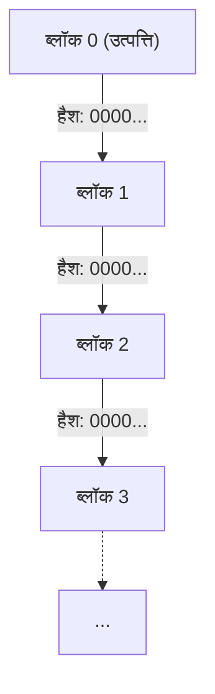
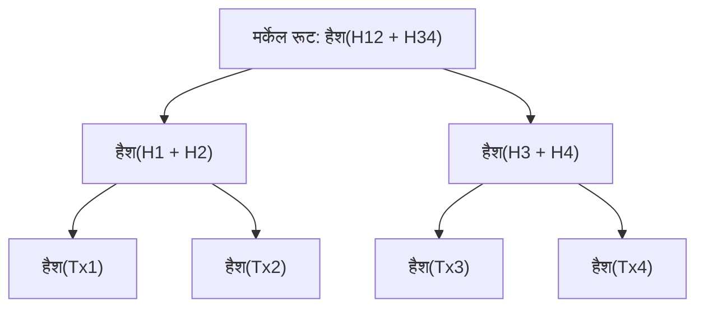
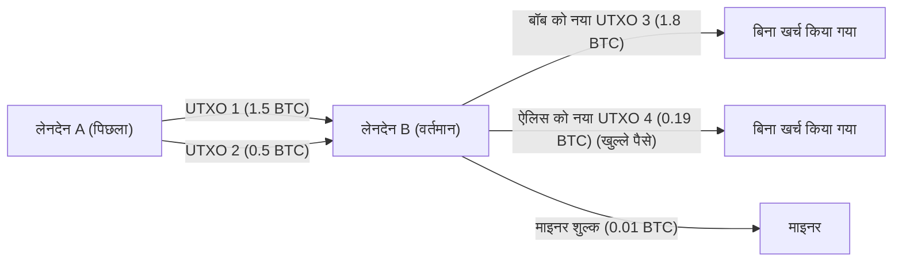

# क्रिप्टोकरेंसी और बिटकॉइन: इसका इतिहास, गणितीय आधार और भविष्य

आधुनिक समाज में, ऐसा कोई दिन नहीं जाता जब हम "क्रिप्टोकरेंसी (Cryptocurrency)" या "बिटकॉइन (Bitcoin)" शब्द न सुनें। हालांकि, बहुत कम लोग इसके पीछे के तकनीकी और गणितीय तंत्र को वास्तव में समझते हैं। इस लेख में, हम अत्यंत विस्तार से यह बताएंगे कि क्रिप्टोकरेंसी कैसे अस्तित्व में आई, यह किस तरह के गणितीय आधार पर बनी है, और भविष्य के लिए इसमें क्या चुनौतियाँ और संभावनाएं छिपी हैं।

## 1. प्रस्तावना: क्रिप्टोकरेंसी क्या है?

क्रिप्टोकरेंसी एक प्रकार की डिजिटल मुद्रा है जो लेन-देन की सुरक्षा सुनिश्चित करने और नई इकाइयों को जारी करने को नियंत्रित करने के लिए क्रिप्टोग्राफी (cryptography) का उपयोग करती है। जबकि पारंपरिक फिएट मुद्राएं (Fiat Money) एक ही विश्वसनीय संस्था, जैसे केंद्रीय बैंक, द्वारा जारी और प्रबंधित की जाती हैं, क्रिप्टोकरेंसी बिना किसी केंद्रीय प्रशासक के **विकेंद्रीकृत (Decentralized)** नेटवर्क पर काम करती है।

### फिएट मुद्रा और विकेंद्रीकृत प्रणाली की तुलना

फिएट मुद्रा "विश्वास" की उपज है। यह इस तथ्य पर आधारित है कि सरकार जैसा कोई प्राधिकारी इसके मूल्य की गारंटी देता है। हालांकि, इस प्रणाली में कुछ संभावित कमजोरियां हैं।
- **मुद्रास्फीति जोखिम (Inflation Risk)** : चूंकि केंद्रीय बैंक अपनी नीतियों के अनुसार मुद्रा आपूर्ति में हेरफेर कर सकते हैं, अत्यधिक कागजी मुद्रा छापने से मूल्य का ह्रास होता है।
- **विफलता का एकल बिंदु (SPOF)** : यदि किसी वित्तीय संस्थान का सिस्टम डाउन हो जाता है, तो लेन-देन रुक जाते हैं।
- **सेंसरशिप की संभावना** : हमेशा यह जोखिम होता है कि किसी विशिष्ट व्यक्ति या संगठन के खाते फ्रीज (freeze) हो सकते हैं।

इसके विपरीत, क्रिप्टोकरेंसी का उद्देश्य एक "ट्रस्टलेस (Trustless)" प्रणाली बनना था। दूसरे शब्दों में, यह एक ऐसी प्रणाली है जहां किसी विशेष व्यक्ति पर भरोसा किए बिना, प्रणाली की गणितीय और क्रिप्टोग्राफिक मजबूती द्वारा लेन-देन की वैधता की गारंटी दी जाती है।

## 2. क्रिप्टोकरेंसी का इतिहास: साइफरपंक (Cypherpunks) से सातोशी नाकामोटो (Satoshi Nakamoto) तक

बिटकॉइन अचानक किसी म्यूटेशन (mutation) की तरह पैदा नहीं हुआ था। इसके पीछे दशकों के क्रिप्टोग्राफी के इतिहास और निजता को महत्व देने वाले तकनीकी विशेषज्ञों के वैचारिक आंदोलन का हाथ था।

### साइफरपंक (Cypherpunks) की विचारधारा

1980 और 1990 के दशक में, "साइफरपंक" नामक क्रिप्टोग्राफरों और कार्यकर्ताओं का एक समुदाय बना था। उनका उद्देश्य मजबूत क्रिप्टोग्राफिक तकनीकों का उपयोग करके व्यक्तिगत निजता की रक्षा करना और राज्य की निगरानी और सेंसरशिप का विरोध करना था।

डेविड चाउम (David Chaum) द्वारा आविष्कार किया गया "eCash", एडम बैक (Adam Back) का "Hashcash", और निक स्जाबो (Nick Szabo) का "Bit gold" जैसे बिटकॉइन की नींव रखने वाले कई विचार इसी समुदाय से आए थे। हालांकि, वे बिना किसी केंद्रीय प्रशासक के "डबल-स्पेंडिंग समस्या (Double-spending problem)" को पूरी तरह से हल नहीं कर सके थे।

### 2008 का वित्तीय संकट और बिटकॉइन का जन्म

2008 में, लेहमैन ब्रदर्स (Lehman Brothers) के पतन से शुरू हुआ एक वैश्विक वित्तीय संकट उत्पन्न हुआ। उसी वर्ष 31 अक्टूबर को, जब मौजूदा वित्तीय प्रणाली में अविश्वास अपने चरम पर था, "सातोशी नाकामोटो (Satoshi Nakamoto)" नाम के एक गुमनाम व्यक्ति (या समूह) ने एक क्रिप्टोग्राफी मेलिंग सूची में एक पेपर पोस्ट किया।

शीर्षक था "Bitcoin: A Peer-to-Peer Electronic Cash System" (बिटकॉइन: एक P2P इलेक्ट्रॉनिक नकद प्रणाली)। 9-पृष्ठों के इस पेपर में यह दर्शाया गया था कि पिछले इलेक्ट्रॉनिक धन प्रयासों को परेशान करने वाली डबल-स्पेंडिंग समस्या को **प्रूफ-ऑफ़-वर्क (Proof of Work: PoW)** नामक तंत्र का उपयोग करके पूरी तरह से विकेंद्रीकृत तरीके से कैसे हल किया जा सकता है।

### उत्पत्ति ब्लॉक (Genesis Block)

3 जनवरी 2009 को, बिटकॉइन नेटवर्क का संचालन शुरू हुआ। खनन किया गया पहला ब्लॉक "जेनेसिस ब्लॉक (Genesis Block - ब्लॉक 0)" कहलाता है। इस ब्लॉक में सातोशी नाकामोटो द्वारा निम्नलिखित संदेश अंकित किया गया था:

> "The Times 03/Jan/2009 Chancellor on brink of second bailout for banks"
> (द टाइम्स 3 जनवरी 2009 चांसलर बैंकों के लिए दूसरे बेलआउट के कगार पर)

यह उस समय के ब्रिटिश समाचार पत्र "The Times" की एक हेडलाइन थी। यह केंद्रीय बैंकों के वित्तीय बेलआउट पर एक कड़ा व्यंग्य होने के साथ-साथ, एक ऐसी प्रणाली के लिए टाइमस्टैम्प (timestamp) के रूप में कार्य करता है जो हमेशा के लिए रहेगी।

## 3. ब्लॉकचेन आर्किटेक्चर (Blockchain Architecture)

बिटकॉइन को शक्ति प्रदान करने वाली मुख्य तकनीक "ब्लॉकचेन (Blockchain)" है। ब्लॉकचेन, डिस्ट्रिब्यूटेड लेजर टेक्नोलॉजी (Distributed Ledger Technology: DLT) का एक रूप है, जहां डेटा को "ब्लॉक" नामक इकाइयों में समूहीकृत किया जाता है और वे क्रिप्टोग्राफिक रूप से एक श्रृंखला (chain) की तरह एक साथ जुड़े होते हैं।

### ब्लॉक की संरचना

एक ब्लॉक में मुख्य रूप से एक "ब्लॉक हेडर (Block Header)" और "ट्रांजैक्शन डेटा (Transaction Data)" होता है।

ब्लॉक हेडर में निम्नलिखित जानकारी शामिल होती है:
1. **संस्करण (Version)** : सॉफ्टवेयर संस्करण
2. **पिछले ब्लॉक का हैश (Previous Block Hash)** : पिछले ब्लॉक के हेडर का हैश मान
3. **मर्केल रूट (Merkle Root)** : ब्लॉक में शामिल सभी लेन-देन का संक्षेपित हैश मान
4. **टाइमस्टैम्प (Timestamp)** : वह समय जब ब्लॉक उत्पन्न हुआ था
5. **कठिनाई लक्ष्य (Difficulty Target, Bits)** : प्रूफ-ऑफ़-वर्क की कठिनाई को दर्शाने वाला मान
6. **नॉन्स (Nonce)** : एक स्वैच्छिक संख्या जिसे खनन के दौरान शर्तों को पूरा करने वाले हैश मान को खोजने के लिए बदला जाता है

### मर्केल ट्री (Merkle Trees)

ब्लॉकचेन में, ब्लॉक आकार को सीमित रखने और डेटा से छेड़छाड़ का कुशलतापूर्वक पता लगाने के लिए **मर्केल ट्री (Merkle Tree)** नामक डेटा संरचना का उपयोग किया जाता है। मर्केल ट्री एक प्रकार का बाइनरी ट्री (binary tree) है जहां लीफ नोड्स (leaf nodes) में प्रत्येक लेन-देन का हैश मान होता है, और पेरेंट नोड्स (parent nodes) चाइल्ड नोड्स (child nodes) के हैश मानों को जोड़कर फिर से हैश किए गए मान होते हैं।

यदि लेन-देन डेटा को थोड़ा भी बदल दिया जाता है, तो उस लीफ नोड का हैश बदल जाता है, और श्रृंखला प्रतिक्रिया (chain reaction) के माध्यम से मर्केल रूट का मान भी पूरी तरह से अलग हो जाएगा। इससे विपुल लेन-देन डेटा में से एक भी बदलाव का तुरंत पता लगाना संभव हो जाता है।

## 4. गणितीय और क्रिप्टोग्राफिक आधार

बिटकॉइन की मजबूती एक अत्यधिक उन्नत गणितीय आधार द्वारा समर्थित है। यहां, हम इसके मूल में मौजूद हैश फ़ंक्शन, सार्वजनिक-कुंजी क्रिप्टोग्राफी और एलाप्टिक कर्व क्रिप्टोग्राफी (elliptic curve cryptography) के बारे में गहराई से जानेंगे।

### SHA-256 (Secure Hash Algorithm 256-bit)

बिटकॉइन में सबसे अधिक उपयोग किया जाने वाला क्रिप्टोग्राफिक हैश फ़ंक्शन **SHA-256** है। एक हैश फ़ंक्शन एक वन-वे फ़ंक्शन (one-way function) है जो किसी भी लंबाई के डेटा को इनपुट के रूप में लेता है और एक निश्चित-लंबाई (SHA-256 के मामले में 256 बिट्स) का डेटा आउटपुट करता है।

हैश फ़ंक्शन $H$ को निम्नलिखित गुणों को पूरा करना होगा:
1. **वन-वे (Pre-image resistance)** : दिए गए हैश मान $h$ से, ऐसा इनपुट $x$ ज्ञात करना कम्प्यूटेशनल रूप से कठिन है जहाँ $H(x) = h$।
2. **कमजोर टकराव प्रतिरोध (Second pre-image resistance)** : दिए गए इनपुट $x_1$ के लिए, कोई अन्य इनपुट $x_2$ खोजना कठिन है जहाँ $H(x_1) = H(x_2)$ हो।
3. **मजबूत टकराव प्रतिरोध (Collision resistance)** : कोई भी दो इनपुट $x_1, x_2$ खोजना कठिन है जहाँ $H(x_1) = H(x_2)$ हो।

बिटकॉइन में, ब्लॉक हैश की गणना करने और सार्वजनिक कुंजियों से पते उत्पन्न करने जैसी प्रक्रियाओं में SHA-256 को दो बार लागू किया जाता है (इसे `SHA256(SHA256(x))` या Hash256 कहा जाता है)।

### सार्वजनिक-कुंजी क्रिप्टोग्राफी (Public Key Cryptography) और डिजिटल हस्ताक्षर

क्रिप्टोकरेंसी का स्वामित्व निजी कुंजी (Private Key) और सार्वजनिक कुंजी (Public Key) की एक जोड़ी द्वारा सिद्ध किया जाता है।
- **निजी कुंजी (Private Key)** $k$ : बेतरतीब ढंग से उत्पन्न 256-बिट पूर्णांक। इसे कभी भी किसी और को पता नहीं होना चाहिए।
- **सार्वजनिक कुंजी (Public Key)** $K$ : वन-वे फ़ंक्शन का उपयोग करके निजी कुंजी से गणना की गई कुंजी। इसे नेटवर्क पर प्रकाशित किया जाता है।

जब ऐलिस (Alice) बॉब (Bob) को बिटकॉइन भेजती है, तो ऐलिस लेन-देन डेटा के लिए एक **डिजिटल हस्ताक्षर (Digital Signature)** बनाने के लिए अपनी निजी कुंजी का उपयोग करती है। नेटवर्क के भागीदार ऐलिस की सार्वजनिक कुंजी का उपयोग करके यह सत्यापित कर सकते हैं कि क्या वह हस्ताक्षर वैध है (यानी, क्या यह वास्तव में ऐलिस द्वारा उसकी निजी कुंजी का उपयोग करके बनाया गया था)।

### एलाप्टिक कर्व क्रिप्टोग्राफी (Elliptic Curve Cryptography: ECC) और secp256k1

बिटकॉइन में सार्वजनिक कुंजी निर्माण और डिजिटल हस्ताक्षर के लिए RSA एन्क्रिप्शन के बजाय **एलाप्टिक कर्व क्रिप्टोग्राफी (ECC)** का उपयोग किया जाता है। ECC का यह लाभ है कि यह RSA की तुलना में बहुत छोटी कुंजी लंबाई के साथ समकक्ष सुरक्षा स्तर प्रदान कर सकता है।

बिटकॉइन में उपयोग किए जाने वाले विशिष्ट एलाप्टिक कर्व पैरामीटर्स को **secp256k1** कहा जाता है। यह वक्र एक परिमित क्षेत्र (finite field) $\mathbb{F}_p$ पर परिभाषित किया गया है और इसे निम्नलिखित समीकरण द्वारा व्यक्त किया जाता है:

$$
y^2 \equiv x^3 + 7 \pmod{p}
$$

यहाँ, $p$ एक बहुत बड़ी अभाज्य संख्या (prime number) है:
$$
p = 2^{256} - 2^{32} - 2^{9} - 2^{8} - 2^{7} - 2^{6} - 2^{4} - 1
$$

निजी कुंजी $k$, $1$ और $n-1$ के बीच एक यादृच्छिक संख्या (random number) है ($n$ वक्र का क्रम है)। सार्वजनिक कुंजी $K$, वक्र पर एक बेस बिंदु (Generator Point) $G$ को निजी कुंजी की संख्या के बराबर स्केलर गुणा (scalar multiplication) करके प्राप्त की जाती है।

$$
K = k \cdot G
$$

यह गणना एलाप्टिक कर्व पर बिंदुओं को जोड़ने (Point Addition) और दोगुना करने (Point Doubling) को दोहराकर कुशलतापूर्वक की जा सकती है। हालांकि, सार्वजनिक कुंजी $K$ और बेस बिंदु $G$ से निजी कुंजी $k$ को वापस गणना करना कम्प्यूटेशनल रूप से अत्यंत कठिन है, जिसे **एलाप्टिक कर्व डिस्क्रीट लॉगरिथम समस्या (Elliptic Curve Discrete Logarithm Problem: ECDLP)** कहा जाता है, और यही क्रिप्टोकरेंसी सुरक्षा का मूल है।

### ECDSA (Elliptic Curve Digital Signature Algorithm)

लेन-देन पर हस्ताक्षर करने के लिए **ECDSA** का उपयोग किया जाता है। जब संदेश (लेन-देन का हैश) $z$ हो, तो हस्ताक्षर प्रक्रिया इस प्रकार है:

1. $1$ से $n-1$ के बीच एक यादृच्छिक पूर्णांक $k_e$ (क्षणभंगुर कुंजी / ephemeral key) चुनें।
2. वक्र पर बिंदु $(x_1, y_1) = k_e \cdot G$ की गणना करें।
3. $r = x_1 \pmod{n}$ की गणना करें। यदि $r = 0$ है, तो चरण 1 पर वापस जाएँ।
4. $s = k_e^{-1} (z + r \cdot k) \pmod{n}$ की गणना करें। यदि $s = 0$ है, तो चरण 1 पर वापस जाएँ।
5. हस्ताक्षर $(r, s)$ की एक जोड़ी बन जाता है।

सत्यापन प्रक्रिया में, सार्वजनिक कुंजी $K$ और हस्ताक्षर $(r, s)$ का उपयोग करके निम्नलिखित गणनाएँ की जाती हैं:

1. $u_1 = z \cdot s^{-1} \pmod{n}$
2. $u_2 = r \cdot s^{-1} \pmod{n}$
3. बिंदु $(x_2, y_2) = u_1 \cdot G + u_2 \cdot K$ की गणना करें।
4. यदि $r \equiv x_2 \pmod{n}$ है, तो हस्ताक्षर को वैध माना जाता है।

## 5. सर्वसम्मति एल्गोरिथ्म (Consensus Algorithm) और प्रूफ-ऑफ़-वर्क (PoW)

एक विकेंद्रीकृत नेटवर्क में, हर किसी को लेजर (ledger) की स्थिति पर सहमत कराने का तंत्र सर्वसम्मति एल्गोरिथ्म (consensus algorithm) है।

### बीजान्टिन जनरल्स की समस्या (Byzantine Generals Problem)

डिस्ट्रिब्यूटेड कंप्यूटिंग (distributed computing) में एक क्लासिक समस्या "बीजान्टिन जनरल्स की समस्या" है। कई जनरलों ने दुश्मन के शहर को घेर लिया है और उन्हें हमला करने या पीछे हटने पर सहमत होना चाहिए, लेकिन जनरलों के बीच देशद्रोही हो सकते हैं जो झूठे संदेश भेज सकते हैं। यह समस्या इस बारे में है कि ऐसी स्थिति में केवल ईमानदार जनरलों द्वारा सही समझौता कैसे किया जा सकता है।

बिटकॉइन ने **प्रूफ-ऑफ़-वर्क (PoW)** और **सबसे लंबी श्रृंखला के नियम (Longest Chain Rule)** को मिलाकर व्यावहारिक रूप से इस समस्या को हल किया है।

### माइनिंग का गणित और नॉन्स (Nonce)

PoW में "कार्य (Work)" एक विशिष्ट शर्त को पूरा करने वाले हैश मान को खोजने के लिए एक कम्प्यूटेशनल प्रतियोगिता को संदर्भित करता है। माइनर्स (Miners) नॉन्स (Nonce) के एक ऐसे मान की तलाश करते हैं जिससे ब्लॉक हेडर का हैश मान नेटवर्क द्वारा निर्धारित **लक्ष्य (Target)** से छोटा हो जाए।

$$
\text{SHA256}(\text{SHA256}(\text{ब्लॉक\_हेडर})) < \text{लक्ष्य}
$$

चूंकि हैश फ़ंक्शन का आउटपुट पूरी तरह से यादृच्छिक (random) दिखता है, इसलिए शर्त को पूरा करने वाले नॉन्स को खोजने के लिए कोई कुशल एल्गोरिथ्म नहीं है। एक ही तरीका है कि लगातार नॉन्स मान को बदला जाए और हैश की गणना की जाए (ब्रूट-फोर्स / Brute-force)।

लक्ष्य का मान जितना छोटा होगा, शर्त को पूरा करने वाला हैश खोजने की संभावना उतनी ही कम होगी। यदि लक्ष्य ऐसा मान है जिसके शुरुआत में $k$ शून्य (zeros) आवश्यक हैं, तो उस ब्लॉक को खोजने के लिए आवश्यक औसत गणनाओं की संख्या $2^k$ होगी। यह विशाल कम्प्यूटेशनल ऊर्जा का निवेश ही है जो ब्लॉकचेन के पिछले रिकॉर्ड के साथ छेड़छाड़ करना असंभव बनाता है।

### कठिनाई समायोजन (Difficulty Adjustment)

बिटकॉइन नेटवर्क को इस तरह से डिज़ाइन किया गया है कि लगभग हर 10 मिनट में एक ब्लॉक उत्पन्न होता है। हालांकि, पूरे नेटवर्क की कम्प्यूटेशनल शक्ति (हैश रेट) लगातार उतार-चढ़ाव करती है। इसलिए, हर 2016 ब्लॉक (लगभग 2 सप्ताह) में, पिछले ब्लॉक जनरेशन अंतराल के आधार पर लक्ष्य का मान स्वचालित रूप से समायोजित किया जाता है।

$$
\text{नया\_लक्ष्य} = \text{पुराना\_लक्ष्य} \times \frac{\text{पिछले\_2016\_ब्लॉक\_का\_वास्तविक\_समय}}{\text{20160\_मिनट}}
$$

यदि हैश रेट बढ़ता है, तो लक्ष्य छोटा हो जाता है (कठिनाई बढ़ जाती है), और यदि हैश रेट गिरता है, तो लक्ष्य बड़ा हो जाता है (कठिनाई कम हो जाती है)।

## 6. ट्रांजैक्शन और UTXO मॉडल

बिटकॉइन लेन-देन बैंक खाते के शेष राशि (खाता-आधारित मॉडल) जैसे तंत्र का उपयोग नहीं करते हैं, बल्कि **UTXO (Unspent Transaction Output: खर्च न किया गया लेन-देन आउटपुट)** मॉडल को अपनाते हैं।

### इनपुट और आउटपुट

बिटकॉइन में "सिक्के (coin)" जैसी कोई भौतिक इकाई मौजूद नहीं है। जो मौजूद है वह केवल पिछले लेन-देन द्वारा बनाए गए UTXOs की श्रृंखला है। प्रत्येक लेन-देन मौजूदा UTXOs का उपभोग "इनपुट" के रूप में करता है और "आउटपुट" के रूप में नए UTXOs उत्पन्न करता है।

मान लीजिए ऐलिस, बॉब को 1.8 BTC भेजना चाहती है। ऐलिस अपने पास मौजूद 1.5 BTC और 0.5 BTC (कुल 2.0 BTC) के 2 UTXOs को इनपुट के रूप में निर्दिष्ट करती है, और बॉब को 1.8 BTC का आउटपुट बनाती है। शेष 0.2 BTC में से, 0.19 BTC ऐलिस के अपने नए पते पर 'चेंज (Change)' के रूप में आउटपुट हो जाता है, और 0.01 BTC का अंतर लेन-देन को प्रोसेस करने वाले माइनर के लिए 'शुल्क (Fee)' बन जाता है।

$$
\sum \text{इनपुट} = \sum \text{आउटपुट} + \text{लेनदेन\_शुल्क}
$$

यह UTXO मॉडल लेन-देन की उच्च स्वतंत्रता के कारण समानांतर प्रसंस्करण (parallel processing) की सुविधा देता है, और यह निजता के दृष्टिकोण से भी उत्कृष्ट है (क्योंकि आप हर बार एक नए चेंज पते का उपयोग कर सकते हैं)।

## 7. भविष्य और स्केलेबिलिटी (Scalability) समस्या

बिटकॉइन एक अत्यंत मजबूत और सुरक्षित प्रणाली है, लेकिन इसके परिणामस्वरूप इसे अपनी स्केलेबिलिटी (प्रसंस्करण क्षमता की मापनीयता) में बड़ी चुनौतियों का सामना करना पड़ता है। वर्तमान बिटकॉइन नेटवर्क प्रति सेकंड केवल लगभग 7 लेन-देन (7 TPS) संसाधित कर सकता है। यह वीज़ा (Visa) नेटवर्क के हजारों TPS की तुलना में बहुत धीमा है।

### फोर्क्स (Forks): सॉफ्ट फोर्क और हार्ड फोर्क

ब्लॉकचेन प्रोटोकॉल को अपग्रेड करते समय, "फोर्क (विभाजन)" नामक एक घटना घटित हो सकती है।
- **सॉफ्ट फोर्क (Soft Fork)** : बैकवर्ड-कम्पैटिबल अपग्रेड। पुराने नियमों वाले नोड्स अभी भी नए नियमों के ब्लॉक को वैध मानते हैं (जैसे: SegWit का परिचय)।
- **हार्ड फोर्क (Hard Fork)** : एक अपग्रेड जो बैकवर्ड-कम्पैटिबल नहीं है। नए नियमों वाले ब्लॉक पुराने नोड्स द्वारा अस्वीकार कर दिए जाते हैं, जिससे नेटवर्क पूरी तरह से दो हिस्सों में बंट सकता है (जैसे: Bitcoin Cash का जन्म)।

### लाइटनिंग नेटवर्क (Lightning Network)

स्केलेबिलिटी समस्या को हल करने के लिए एक प्रमुख दृष्टिकोण लाइटनिंग नेटवर्क है, जो एक **लेयर 2 (Layer 2)** समाधान है।

लाइटनिंग नेटवर्क में, प्रतिभागी एक-दूसरे के साथ ब्लॉकचेन के बाहर (ऑफ-चेन) "पेमेंट चैनल (Payment Channel)" खोलते हैं। चैनल के भीतर, जब तक दोनों पक्ष सहमत हों, तब तक ब्लॉकचेन पर लेन-देन दर्ज किए बिना तुरंत और लगभग मुफ्त में धन का आदान-प्रदान किया जा सकता है। केवल अंतिम शेष राशि के निपटान के समय, लेन-देन ब्लॉकचेन (लेयर 1) पर दर्ज किया जाता है।

### प्रूफ-ऑफ़-स्टेक (PoS) के साथ तुलना

PoW की एक और बड़ी चुनौती खनन द्वारा की जाने वाली भारी बिजली की खपत है। इस पर्यावरणीय समस्या के समाधान के रूप में, इथेरियम (Ethereum) जैसी प्रणालियाँ **प्रूफ-ऑफ़-स्टेक (Proof of Stake: PoS)** नामक एक अन्य सर्वसम्मति एल्गोरिथ्म पर स्थानांतरित हो गई हैं।

PoS में, कम्प्यूटेशनल पावर (हैश रेट) के बजाय, आयोजित क्रिप्टोकरेंसी (स्टेक) की मात्रा और होल्डिंग अवधि के आधार पर अगले ब्लॉक (वैलिडेटर) को बनाने का अधिकार संभावित रूप से सौंपा जाता है। हालांकि इससे बिजली की खपत 99% से अधिक कम हो जाती है, लेकिन यह आलोचना भी है कि "क्या यह ऐसी व्यवस्था नहीं है जहां अमीर और अमीर बन जाते हैं?" और "क्या यह पूर्ण विकेंद्रीकरण को कम नहीं करता?"। चाहे कितनी भी आलोचना क्यों न हो, बिटकॉइन PoW के "ऊर्जा का उपभोग करके भौतिक सुरक्षा सुनिश्चित करने" के दर्शन पर दृढ़ता से टिका हुआ है।

## 8. क्रिप्टोग्राफी की गहराई: गणितीय प्रमाण और प्रोटोकॉल की मजबूती

पिछले अध्यायों में चर्चा किए गए SHA-256 और एलाप्टिक कर्व क्रिप्टोग्राफी (ECC) के पीछे, सूचना-सैद्धांतिक सुरक्षा और कम्प्यूटेशनल सुरक्षा के दो प्रतिमान (paradigms) मौजूद हैं। बिटकॉइन सहित आधुनिक क्रिप्टोकरेंसी मुख्य रूप से कम्प्यूटेशनल सुरक्षा (Computational Security) पर निर्भर करती हैं।

### कम्प्यूटेशनल सुरक्षा और डिस्क्रीट लॉगरिथम समस्या

कम्प्यूटेशनल सुरक्षा उस आधार पर आधारित सुरक्षा है कि "किसी दिए गए सिफर (cipher) को डिक्रिप्ट करने के लिए ब्रह्मांड के जीवनकाल से अधिक समय और खगोलीय कम्प्यूटेशनल संसाधनों की आवश्यकता होगी, जिससे यह व्यावहारिक रूप से डिक्रिप्ट करने में असंभव हो जाता है।"

आइए एलाप्टिक कर्व डिस्क्रीट लॉगरिथम समस्या (ECDLP) को गणितीय रूप से फिर से जाँचें जो बिटकॉइन की सार्वजनिक-कुंजी क्रिप्टोग्राफी की सुरक्षा की गारंटी देता है।
यह एक अज्ञात पूर्णांक $k$ को खोजने की समस्या है जहां बिंदु $P$ और $Q$, एलाप्टिक कर्व $E(\mathbb{F}_p)$ पर हैं और $Q = kP$ को संतुष्ट करते हैं।
एक क्लासिकल कंप्यूटर का उपयोग करते समय, इस समस्या को हल करने के लिए सबसे अच्छे एल्गोरिथ्म (जैसे कि पोलार्ड की $\rho$ विधि) की जटिलता $\mathcal{O}(\sqrt{p})$ होती है।
बिटकॉइन के secp256k1 में, चूँकि $p \approx 2^{256}$ है, डिक्रिप्शन के लिए लगभग $2^{128}$ गणनाओं की आवश्यकता होती है। यह इतनी अधिक कम्प्यूटेशनल मात्रा है कि भले ही आप वर्तमान में पृथ्वी पर मौजूद सभी कंप्यूटरों को जोड़ लें, इसमें ब्रह्मांड के जीवनकाल (लगभग 13.8 अरब वर्ष) के ट्रिलियन गुना अधिक समय लगेगा।

### क्वांटम कंप्यूटर का खतरा और क्वांटम-प्रतिरोधी क्रिप्टोग्राफी

हालाँकि, कम्प्यूटेशनल सुरक्षा के साथ एक बड़ी चिंता जुड़ी है। वह है **क्वांटम कंप्यूटर (Quantum Computer)** का उदय।
1994 में पीटर शोर (Peter Shor) द्वारा प्रकाशित "शोर का एल्गोरिथ्म ([Shor's Algorithm](https://kenji.blog/hi/p/quantum-computing-shors-algorithm/))" ने गणितीय रूप से साबित कर दिया कि एक क्वांटम कंप्यूटर का उपयोग करके, प्राइम फैक्टराइजेशन समस्या (प्राइम फैक्टराइजेशन - RSA एन्क्रिप्शन का आधार) और डिस्क्रीट लॉगरिथम समस्या (ECC का आधार) को बहुपद समय (polynomial time) $\mathcal{O}(n^3)$ में हल किया जा सकता है।

यदि पर्याप्त क्यूबिट्स (Qubits) और कम त्रुटि दर वाला एक व्यावहारिक बड़े पैमाने का क्वांटम कंप्यूटर पूरा हो जाता है, तो बिटकॉइन की सार्वजनिक कुंजी से निजी कुंजी को वापस प्राप्त करने का जोखिम उत्पन्न हो सकता है।
इसके खिलाफ बिटकॉइन नेटवर्क के सुरक्षा उपाय इस प्रकार हैं:

1. **हैश फ़ंक्शन की सुरक्षा** : एक बिटकॉइन पता केवल सार्वजनिक कुंजी नहीं है, बल्कि सार्वजनिक कुंजी पर लागू SHA-256 और RIPEMD-160 हैश फ़ंक्शन का परिणाम है। यहां तक कि क्वांटम कंप्यूटर का उपयोग करते हुए, हैश फ़ंक्शन का उल्टा अनुमान लगाना (भले ही ग्रोवर (Grover) के एल्गोरिथ्म का उपयोग किया जाए, जटिलता $\mathcal{O}(\sqrt{N})$ है) अभी भी मुश्किल है। इसलिए, जब तक कोई लेन-देन नहीं किया जाता है और सार्वजनिक कुंजी को नेटवर्क में उजागर नहीं किया जाता है, तब तक पते की सामग्री क्वांटम कंप्यूटरों के खिलाफ भी सुरक्षित मानी जाती है।
2. **क्वांटम-प्रतिरोधी क्रिप्टोग्राफी (Post-Quantum Cryptography: PQC) में संक्रमण** : क्वांटम कंप्यूटरों के व्यावहारिक होने से पहले, बिटकॉइन प्रोटोकॉल को हार्ड फोर्क (hard fork) के माध्यम से अपग्रेड करने की चर्चा हो रही है। यह NIST (अमेरिकी राष्ट्रीय मानक और प्रौद्योगिकी संस्थान) द्वारा चयनित लैटिस-आधारित क्रिप्टोग्राफी (Lattice-based cryptography) या मल्टीवेरिएट पॉलीनोमियल क्रिप्टोग्राफी (Multivariate polynomial cryptography) जैसे नए हस्ताक्षर एल्गोरिदम पर स्थानांतरित होगा, जिसे क्वांटम कंप्यूटरों द्वारा भी क्रैक करना मुश्किल है।

## 9. नेटवर्क टोपोलॉजी और P2P प्रोटोकॉल विवरण

बिटकॉइन नेटवर्क केवल सर्वर और क्लाइंट का संग्रह नहीं है, बल्कि इसे पूरी तरह से **पीयर-टू-पीयर (Peer-to-Peer: P2P)** नेटवर्क के रूप में बनाया गया है।

### नोड्स के प्रकार और भूमिकाएँ

नेटवर्क में भाग लेने वाले कंप्यूटरों को "नोड (Node)" कहा जाता है। नोड्स कई प्रकार के होते हैं, और प्रत्येक की अलग-अलग भूमिका होती है।

- **पूर्ण नोड (Full Node)** : एक नोड जो जेनेसिस ब्लॉक से लेकर नवीनतम ब्लॉक तक सभी ब्लॉकचेन डेटा (सैकड़ों GB या अधिक) को डाउनलोड और सत्यापित करता है। यह नेटवर्क की सुरक्षा का मूल आधार है क्योंकि यह स्वतंत्र रूप से लेन-देन की वैधता और डबल-स्पेंडिंग की अनुपस्थिति की जांच करता है।
- **SPV नोड (Simplified Payment Verification Node)** : एक हल्का नोड जो पूरे ब्लॉकचेन के बजाय केवल ब्लॉक हेडर डाउनलोड करता है। यह मुख्य रूप से स्मार्टफोन वॉलेट आदि के लिए उपयोग किया जाता है। यह पुष्टि कर सकता है कि उसका अपना लेन-देन एक ब्लॉक में शामिल है (मर्केल पथ का सत्यापन), लेकिन इसमें पूर्ण नोड के समान सत्यापन क्षमताएं नहीं हैं।
- **माइनिंग नोड (Mining Node)** : एक नोड जो PoW गणना करता है और नए ब्लॉक बनाता है। वर्तमान में, ASIC (Application Specific Integrated Circuit) नामक समर्पित माइनिंग हार्डवेयर से युक्त विशाल "माइनिंग पूल (Mining Pool)" यह भूमिका निभाते हैं।

### लेन-देन प्रसार प्रक्रिया (Gossip Protocol)

जब कोई उपयोगकर्ता (ऐलिस) बिटकॉइन भेजने के लिए कोई लेन-देन बनाता है, तो वह डेटा पूरी दुनिया में कैसे फैलता है?

1. ऐलिस का वॉलेट (नोड) लेन-देन डेटा को कई जुड़े हुए साथियों (पड़ोसी नोड्स) को भेजता है।
2. लेन-देन प्राप्त करने वाला प्रत्येक पीयर यह सत्यापित करता है कि लेन-देन सही नियमों का पालन करता है या नहीं (जैसे क्या पर्याप्त शेष राशि है, क्या हस्ताक्षर सही है, क्या प्रारूप सही है, आदि)।
3. यदि सत्यापन सफल होता है, तो वह लेन-देन को अपने **मेमोरी पूल (Mempool)** में सहेजता है और इसे अन्य पड़ोसी नोड्स को अग्रेषित करता है (गोसिप प्रोटोकॉल / Gossip Protocol)।
4. यदि यह एक अवैध लेन-देन है, तो इसे छोड़ दिया जाता है और आगे नहीं भेजा जाता है।

इस तरह, एक वैध लेन-देन कुछ ही सेकंड में दुनिया भर के नोड्स के मेमपूल (Mempool) में फैल जाता है। माइनर्स (Miners) इस मेमपूल से उच्चतम शुल्क (Fee) वाले लेन-देन को चुनते हैं और उन्हें एक नए ब्लॉक में पैक करते हैं।

## 10. ब्लॉकचेन अर्थशास्त्र: गेम थ्योरी (Game Theory) और इंसेंटिव डिज़ाइन (Incentive Design)

सातोशी नाकामोटो की सबसे बड़ी उपलब्धि केवल क्रिप्टोग्राफिक पहेली को सुलझाना नहीं था, बल्कि एक दोषरहित **प्रोत्साहन डिजाइन (Incentive Design)** बनाना था जहां "मनुष्यों और संगठनों के स्वार्थी कार्य अंततः पूरे नेटवर्क की सुरक्षा बढ़ाते हैं।"

### ब्लॉक इनाम और हॉविंग (Halving)

जिस कारण माइनर्स ब्लॉक को खदान (mine) करने के लिए इतनी बड़ी मात्रा में बिजली और हार्डवेयर निवेश का उपयोग करते हैं, वह आर्थिक इनाम है। जब एक माइनर सफलतापूर्वक एक नया ब्लॉक बनाता है, तो उन्हें **कॉइनबेस ट्रांजैक्शन (Coinbase Transaction)** नामक एक विशेष लेन-देन के माध्यम से नया जारी किया गया बिटकॉइन प्राप्त होता है।

बिटकॉइन की कुल आपूर्ति (Total Supply) को प्रोग्रामिंग द्वारा **2.1 करोड़** सिक्कों पर सीमित (capped) किया गया है। इसके अलावा, इसमें **हॉविंग (Halving)** नामक एक तंत्र अंतर्निहित है, जहां प्रति ब्लॉक माइनिंग इनाम हर 2,10,000 ब्लॉक (लगभग 4 वर्ष) के बाद आधा हो जाता है।

- 2009~: 50 BTC
- 2012~: 25 BTC
- 2016~: 12.5 BTC
- 2020~: 6.25 BTC
- 2024~: 3.125 BTC

यह अपस्फीतिकारी (disinflationary) मुद्रा आपूर्ति मॉडल सोने के खनन (gold mining) का अनुकरण करता है, और फिएट मुद्रा से जुड़ी "अनंत मुद्रण के माध्यम से मुद्रास्फीति (inflation)" के लिए एक एंटीथिसिस (विरोध) के रूप में कार्य करता है।

### 51% अटैक (51% Attack) का गेम-थ्योरेटिक विश्लेषण

ब्लॉकचेन के लिए सबसे बड़ा खतरा **51% अटैक** माना जाता है। यदि एक दुर्भावनापूर्ण एकल इकाई संपूर्ण नेटवर्क की कम्प्यूटेशनल शक्ति (हैश रेट) के आधे से अधिक (51% या अधिक) को नियंत्रित करती है, तो निम्नलिखित कार्य संभव हो जाते हैं:

1. अपने स्वयं के पिछले लेन-देन को रद्द करना (डबल-स्पेंडिंग)।
2. विशिष्ट लेन-देन के अनुमोदन को अस्वीकार करना (सेंसरशिप)।

हालांकि, गेम थ्योरी (Game Theory) के नजरिए से देखें तो मौजूदा बड़े पैमाने के बिटकॉइन नेटवर्क में 51% हमला करना बेहद अतार्किक है।
भले ही नेटवर्क के बहुमत को नियंत्रित करने के लिए भारी लागत (अरबों डॉलर का हार्डवेयर और भारी बिजली) खर्च की जाए, जिस क्षण यह हमला सफल होगा, बिटकॉइन में विश्वास खत्म हो जाएगा, और कीमत गिर जाएगी। हमलावर द्वारा प्राप्त किए गए बिटकॉइन भी मूल्यहीन हो जाएंगे। इसलिए, एक नैश इक्विलिब्रियम (Nash Equilibrium) स्थापित होता है: **"सिस्टम पर हमला करने के बजाय, उस विशाल कम्प्यूटेशनल शक्ति का उपयोग माइनिंग (सही नियमों का पालन करने) में करके इनाम प्राप्त करना आर्थिक रूप से कहीं अधिक लाभदायक है।"**

## 11. निष्कर्ष: क्रिप्टोकरेंसी द्वारा आकार दिया जाने वाला भविष्य

इस लेख में, हमने बिटकॉइन और क्रिप्टोकरेंसी के पीछे के गणितीय, तकनीकी और आर्थिक तंत्र का गहन विश्लेषण किया।

पहली नज़र में, ब्लॉकचेन तकनीक गणित और कोड का एक जटिल द्रव्यमान लग सकती है, लेकिन इसका सार है **"अधिकार पर भरोसा किए बिना गणित और भौतिकी के नियमों पर आधारित, मानवता के लिए एक नई सर्वसम्मति-निर्माण प्रणाली"**।

जिस वित्तीय प्रणाली का हम हर दिन उपयोग करते हैं, वह अपने लंबे इतिहास में अनगिनत बार विफल रही है, और हर बार इसमें पैचवर्क सुधार किए गए हैं। सातोशी नाकामोटो द्वारा प्रस्तुत किया गया समाधान किसी भी तरह से परिपूर्ण नहीं है। स्केलेबिलिटी के मुद्दे, पर्यावरण संबंधी चिंताएं, और राज्य द्वारा विनियमन और कानून जैसी अनगिनत बाधाएं दूर करनी हैं।

हालाँकि, एक बार भानुमती के पिटारे (Pandora's box) से मुक्त होने के बाद, "ट्रस्टलेस विकेंद्रीकृत प्रणाली (trustless decentralized system)" की अवधारणा बिना पीछे मुड़े विकसित होती जा रही है। क्या बिटकॉइन केवल डिजिटल गोल्ड (Digital Gold) के रूप में स्थापित हो जाएगा, या यह लेयर 2 तकनीक के विकास के माध्यम से एक सच्चे वैश्विक भुगतान नेटवर्क (global payment network) में बदल जाएगा, यह अभी तक किसी को नहीं पता है। केवल एक ही बात निश्चित है कि इसके भविष्य को कुछ सत्ता में बैठे लोग आकार नहीं देंगे, बल्कि नेटवर्क में भाग लेने वाले दुनिया भर के नोड्स, डेवलपर्स और उपयोगकर्ताओं की सामूहिक इच्छा ही इसका भविष्य तय करेगी।

## परिशिष्ट: गहन अध्ययन के लिए संसाधन और संदर्भ

यदि आप इस लेख को पढ़ने के बाद ब्लॉकचेन तकनीक और क्रिप्टोग्राफी के बारे में अधिक गहराई से जानना चाहते हैं, तो यहां कुछ अनुशंसित संसाधन दिए गए हैं।

### अवश्य पढ़े जाने वाले मूल पेपर (Whitepapers)
- **Bitcoin: A Peer-to-Peer Electronic Cash System** (Satoshi Nakamoto, 2008)
  - वह स्मारकीय पेपर जहां से यह सब शुरू हुआ। केवल 9 पृष्ठों में, PoW, इंसेंटिव (प्रोत्साहन) और मर्केल ट्री (Merkle Tree) को मिलाकर एक डिस्ट्रिब्यूटेड लेजर (distributed ledger) का मूल डिज़ाइन पूरी तरह से वर्णित किया गया है।
- **Ethereum: A Secure Decentralised Generalised Transaction Ledger** (Gavin Wood, 2014)
  - इथेरियम का येलो पेपर (Yellow Paper)। इसने बिटकॉइन के UTXO मॉडल के विपरीत ब्लॉकचेन को ट्यूरिंग-कम्प्लीट (Turing-complete) स्मार्ट कॉन्ट्रैक्ट्स (smart contracts) चलाने में सक्षम एक खाता-आधारित (account-based) स्टेट मशीन के रूप में फिर से परिभाषित किया।

### क्रिप्टोग्राफी और गणित के मूल सिद्धांत
ब्लॉकचेन को सही मायने में समझने के लिए सूचना सुरक्षा और अनुप्रयुक्त गणित (applied mathematics) का ज्ञान आवश्यक है। हम निम्नलिखित क्षेत्रों का अध्ययन करने की सलाह देते हैं:
1. **अमूर्त बीजगणित (Abstract Algebra: Group, Ring, Field)** : विशेष रूप से, परिमित क्षेत्र (Galois Field) की अवधारणा एलाप्टिक कर्व क्रिप्टोग्राफी (Elliptic Curve Cryptography) को समझने के लिए अपरिहार्य है।
2. **कम्प्यूटेशनल जटिलता सिद्धांत (Computational Complexity Theory)** : एन्क्रिप्शन के लिए "सुरक्षा (security)" का क्या अर्थ है, यह समझने के लिए P बनाम NP समस्या, पॉलीनोमियल टाइम रिडक्शन आदि अवधारणाएं महत्वपूर्ण हैं।
3. **गेम थ्योरी (Game theory)** : यह नैश इक्विलिब्रियम (Nash Equilibrium) और बीजान्टिन जनरल्स समस्या (Byzantine Generals Problem) जैसे प्रतिभागियों के प्रोत्साहन डिज़ाइन (incentive design) को गणितीय रूप से मॉडल करने के लिए एक ढांचा प्रदान करता है।

> **Warning: निवेश संबंधी अस्वीकरण**
> यह लेख क्रिप्टोकरेंसी की अंतर्निहित तकनीक और इसके ऐतिहासिक/गणितीय संरचना की व्याख्या करने के उद्देश्य से बनाया गया है, और किसी भी क्रिप्टोकरेंसी में निवेश की अनुशंसा या आग्रह नहीं करता है। क्रिप्टोकरेंसी की कीमत अत्यधिक अस्थिर (volatile) होती है और निवेश करने में बड़े जोखिम शामिल होते हैं, जिसमें मूल धन का नुकसान भी शामिल है।

ब्लॉकचेन की तकनीकी खोज कंप्यूटर विज्ञान, अर्थशास्त्र और समाजशास्त्र के चौराहे पर ज्ञान का एक नया फ्रंटियर (frontier) है। कोड पढ़कर, अपना खुद का नोड सेट करके, और टेस्टनेट (testnet) पर लेन-देन करके, आप इस तकनीक की वास्तविक क्षमता और इसकी सीमाओं का प्रत्यक्ष अनुभव प्राप्त कर सकेंगे।
