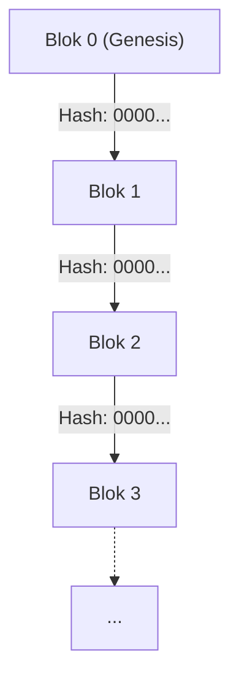
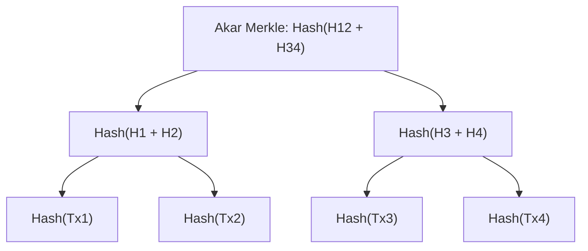
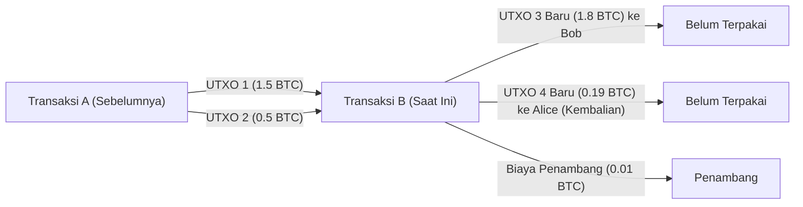

# Aset Kripto dan Bitcoin: Sejarah, Dasar Matematis, dan Masa Depan

Dalam masyarakat modern, hampir tidak ada hari tanpa mendengar kata "Aset Kripto (Cryptocurrency)" atau "Bitcoin". Namun, hanya sedikit orang yang benar-benar memahami mekanisme teknis dan matematis di baliknya. Dalam artikel ini, kita akan membahas dengan sangat rinci bagaimana aset kripto lahir, dasar matematika apa yang menopangnya, serta tantangan dan potensi apa yang disimpannya untuk masa depan.

## 1. Pendahuluan: Apa itu Aset Kripto?

Aset kripto adalah jenis mata uang digital yang menggunakan teori kriptografi untuk memastikan keamanan transaksi dan mengontrol penerbitan unit baru. Berkebalikan dengan mata uang fiat tradisional (Fiat Money) yang diterbitkan dan dikelola oleh otoritas tunggal yang tepercaya seperti bank sentral, aset kripto beroperasi pada jaringan **terdesentralisasi (Decentralized)** tanpa pengelola pusat.

### Perbandingan antara Mata Uang Fiat dan Sistem Terdesentralisasi

Mata uang fiat adalah produk dari "kepercayaan". Ini didasarkan pada jaminan nilainya oleh otoritas seperti pemerintah. Namun, sistem ini memiliki beberapa potensi kelemahan.
- **Risiko Inflasi**: Karena bank sentral dapat memanipulasi jumlah uang beredar sesuai dengan kebijakan, mencetak uang kertas yang berlebihan akan menyebabkan penurunan nilai.
- **Titik Kegagalan Tunggal (SPOF)**: Jika sistem lembaga keuangan mati, transaksi akan berhenti.
- **Kemungkinan Penyensoran**: Selalu ada risiko bahwa rekening individu atau organisasi tertentu dapat dibekukan.

Sebagai tanggapan, aset kripto bertujuan untuk menjadi sistem yang "Tanpa Kepercayaan (Trustless)". Artinya, ini adalah sistem di mana validitas transaksi dijamin oleh ketahanan matematis dan kriptografis dari sistem itu sendiri, tanpa harus memercayai siapa pun secara khusus.

## 2. Sejarah Aset Kripto: Dari Cypherpunks hingga Satoshi Nakamoto

Bitcoin tidak lahir secara tiba-tiba. Di balik kemunculannya, terdapat sejarah puluhan tahun di bidang kriptografi dan gerakan ideologis dari para teknolog yang menjunjung tinggi privasi.

### Ideologi Cypherpunks

Sejak tahun 1980-an hingga 1990-an, sebuah komunitas teknolog dan aktivis kripto yang disebut "Cypherpunks" terbentuk. Mereka bertujuan untuk melindungi privasi individu menggunakan teknologi kriptografi yang kuat dan melawan pengawasan serta penyensoran dari negara.

Banyak gagasan yang menjadi fondasi Bitcoin lahir dari komunitas ini, seperti "eCash" yang dirancang oleh David Chaum, "Hashcash" oleh Adam Back, dan "Bit gold" oleh Nick Szabo. Namun, ide-ide ini belum berhasil sepenuhnya menyelesaikan "masalah pengeluaran ganda (Double-spending problem)" tanpa pengelola pusat.

### Krisis Keuangan 2008 dan Lahirnya Bitcoin

Pada tahun 2008, terjadi krisis keuangan global yang dipicu oleh kebangkrutan Lehman Brothers. Ketidakpercayaan terhadap sistem keuangan yang ada mencapai puncaknya pada tahun yang sama, tepatnya pada tanggal 31 Oktober, ketika seseorang (atau kelompok) anonim dengan nama "Satoshi Nakamoto" mengunggah sebuah makalah ke milis kriptografi.

Judulnya adalah 『Bitcoin: A Peer-to-Peer Electronic Cash System』 (Bitcoin: Sistem Uang Tunai Elektronik P2P). Makalah setebal 9 halaman ini menunjukkan cara menyelesaikan masalah pengeluaran ganda yang dialami oleh upaya uang elektronik sebelumnya, dengan cara yang sepenuhnya terdesentralisasi menggunakan mekanisme **Proof of Work (PoW)**.

### Blok Genesis (Genesis Block)

Pada tanggal 3 Januari 2009, jaringan Bitcoin mulai beroperasi. Blok pertama yang ditambang disebut "Blok Genesis (Blok 0)". Di dalam blok ini, pesan berikut diukir oleh Satoshi Nakamoto:

> "The Times 03/Jan/2009 Chancellor on brink of second bailout for banks"
> (The Times 03/Jan/2009 Menteri Keuangan di ambang dana talangan kedua untuk bank)

Ini adalah tajuk utama surat kabar Inggris 『The Times』 pada saat itu, yang berfungsi sebagai ironi yang kuat terhadap kebijakan dana talangan keuangan oleh bank sentral, dan juga berfungsi sebagai stempel waktu untuk membuktikan bahwa sistem Bitcoin akan bertahan selamanya.

## 3. Arsitektur Blockchain

Teknologi inti yang mendukung Bitcoin adalah "Blockchain". Blockchain adalah bentuk dari Teknologi Buku Besar Terdistribusi (Distributed Ledger Technology: DLT), di mana data dikelompokkan ke dalam unit-unit yang disebut "blok", yang saling terhubung secara kriptografis menyerupai rantai (chain).

### Struktur Blok

Satu blok secara garis besar terdiri dari "Header Blok (Block Header)" dan "Data Transaksi (Transaction Data)".

Header blok berisi informasi berikut:
1. **Versi (Version)**: Versi perangkat lunak
2. **Hash Blok Sebelumnya (Previous Block Hash)**: Nilai hash dari header blok sebelumnya
3. **Akar Merkle (Merkle Root)**: Nilai hash ringkasan dari semua transaksi yang termasuk dalam blok
4. **Stempel Waktu (Timestamp)**: Waktu saat blok dihasilkan
5. **Target Kesulitan (Difficulty Target, Bits)**: Nilai yang menunjukkan tingkat kesulitan Proof of Work
6. **Nonce**: Angka arbitrer yang diubah-ubah untuk menemukan nilai hash yang memenuhi kondisi selama penambangan

### Pohon Merkle (Merkle Trees)

Di blockchain, **Pohon Merkle (Merkle Tree)** digunakan sebagai struktur data untuk secara efisien mendeteksi gangguan data sambil menjaga ukuran blok tetap kecil. Pohon Merkle adalah sejenis pohon biner, di mana nilai hash dari setiap transaksi ditempatkan di simpul daun (leaf nodes), dan simpul induk (parent nodes) adalah hash ulang dari gabungan nilai hash simpul anaknya.

Jika data transaksi diubah sedikit saja, hash simpul daunnya akan berubah, yang pada gilirannya akan mengubah nilai akar Merkle menjadi sesuatu yang sama sekali berbeda. Hal ini memungkinkan pendeteksian instan dari pemalsuan apa pun, sekecil apa pun, di antara data transaksi yang sangat besar.

## 4. Dasar Matematis dan Kriptografis

Ketahanan Bitcoin didukung oleh fondasi matematika tingkat lanjut. Di sini, kita akan mendalami fungsi hash, kriptografi kunci publik, dan kriptografi kurva eliptik yang menjadi intinya.

### SHA-256 (Secure Hash Algorithm 256-bit)

Fungsi hash kriptografis yang paling sering digunakan dalam Bitcoin adalah **SHA-256**. Fungsi hash adalah fungsi satu arah yang mengambil input data dengan panjang arbitrer dan menghasilkan output data dengan panjang tetap (256 bit untuk SHA-256).

Fungsi hash $$H$$ harus memenuhi sifat-sifat berikut:
1. **Satu Arah (Pre-image resistance)**: Secara komputasi sulit untuk menemukan input $$x$$ sedemikian rupa sehingga $$H(x) = h$$ dari nilai hash $$h$$ yang diberikan.
2. **Ketahanan Tabrakan Lemah (Second pre-image resistance)**: Secara komputasi sulit untuk menemukan input lain $$x_2$$ sedemikian rupa sehingga $$H(x_1) = H(x_2)$$ untuk input yang diberikan $$x_1$$.
3. **Ketahanan Tabrakan Kuat (Collision resistance)**: Secara komputasi sulit untuk menemukan dua input sembarang $$x_1, x_2$$ sedemikian rupa sehingga $$H(x_1) = H(x_2)$$.

Dalam Bitcoin, SHA-256 diterapkan dua kali dalam proses seperti menghitung hash blok dan membuat alamat dari kunci publik (ini disebut `SHA256(SHA256(x))` atau Hash256).

### Kriptografi Kunci Publik (Public Key Cryptography) dan Tanda Tangan Digital

Kepemilikan aset kripto dibuktikan oleh pasangan Kunci Privat (Private Key) dan Kunci Publik (Public Key).
- **Kunci Privat** $$k$$: Bilangan bulat 256-bit yang dihasilkan secara acak. Tidak boleh diketahui oleh siapa pun.
- **Kunci Publik** $$K$$: Kunci yang dihitung dari kunci privat menggunakan fungsi satu arah. Kunci ini dipublikasikan ke jaringan.

Ketika Alice mentransfer Bitcoin ke Bob, Alice menggunakan kunci privatnya untuk membuat **Tanda Tangan Digital (Digital Signature)** pada data transaksi. Peserta jaringan dapat memverifikasi validitas tanda tangan (apakah Alice benar-benar membuatnya menggunakan kunci privatnya) menggunakan kunci publik Alice.

### Kriptografi Kurva Eliptik (Elliptic Curve Cryptography: ECC) dan secp256k1

Bitcoin menggunakan **Kriptografi Kurva Eliptik (ECC)** alih-alih kriptografi RSA untuk menghasilkan kunci publik dan tanda tangan digital. ECC memiliki keuntungan menawarkan tingkat keamanan yang setara dengan RSA namun dengan panjang kunci yang jauh lebih pendek.

Parameter kurva eliptik tertentu yang digunakan dalam Bitcoin disebut **secp256k1**. Kurva ini didefinisikan di atas medan berhingga (finite field) $$\mathbb{F}_p$$ dan diwakili oleh persamaan berikut:

$$
y^2 \equiv x^3 + 7 \pmod{p}
$$

Di mana $$p$$ adalah bilangan prima yang sangat besar.
$$
p = 2^{256} - 2^{32} - 2^{9} - 2^{8} - 2^{7} - 2^{6} - 2^{4} - 1
$$

Kunci privat $$k$$ adalah angka acak dalam rentang dari $$1$$ hingga $$n-1$$ (di mana $$n$$ adalah orde kurva). Kunci publik $$K$$ diperoleh dengan mengalikan skalar titik acuan (Generator Point) $$G$$ pada kurva dengan kunci privat.

$$
K = k \cdot G
$$

Perhitungan ini dapat dilakukan secara efisien dengan mengulang Penambahan Titik (Point Addition) dan Penggandaan Titik (Point Doubling) pada kurva eliptik. Namun, perhitungan mundur untuk mencari kunci privat $$k$$ dari kunci publik $$K$$ dan titik acuan $$G$$ secara komputasi sangat sulit. Ini dikenal sebagai **Masalah Logaritma Diskrit Kurva Eliptik (Elliptic Curve Discrete Logarithm Problem: ECDLP)**, yang membentuk fondasi keamanan aset kripto.

### ECDSA (Elliptic Curve Digital Signature Algorithm)

**ECDSA** digunakan untuk menandatangani transaksi. Proses penandatanganan dengan pesan (hash dari transaksi) $$z$$ adalah sebagai berikut:

1. Pilih bilangan bulat acak $$k_e$$ (kunci efemeral) dari $$1$$ hingga $$n-1$$.
2. Hitung titik pada kurva $$(x_1, y_1) = k_e \cdot G$$.
3. Hitung $$r = x_1 \pmod{n}$$. Jika $$r = 0$$, kembali ke langkah 1.
4. Hitung $$s = k_e^{-1} (z + r \cdot k) \pmod{n}$$. Jika $$s = 0$$, kembali ke langkah 1.
5. Tanda tangannya adalah pasangan $$(r, s)$$.

Dalam proses verifikasi, perhitungan berikut dilakukan menggunakan kunci publik $$K$$ dan tanda tangan $$(r, s)$$.

1. $$u_1 = z \cdot s^{-1} \pmod{n}$$
2. $$u_2 = r \cdot s^{-1} \pmod{n}$$
3. Hitung titik $$(x_2, y_2) = u_1 \cdot G + u_2 \cdot K$$.
4. Jika $$r \equiv x_2 \pmod{n}$$, maka tanda tangan dianggap valid.

## 5. Algoritma Konsensus dan Proof of Work (PoW)

Dalam jaringan terdesentralisasi, mekanisme untuk membuat semua orang menyetujui status buku besar yang sama disebut algoritma konsensus.

### Masalah Jenderal Bizantium (Byzantine Generals Problem)

Sebagai masalah klasik dalam komputasi terdistribusi, ada "Masalah Jenderal Bizantium". Beberapa jenderal mengepung kota musuh dan harus mencapai konsensus apakah akan menyerang atau mundur, tetapi mungkin ada pengkhianat di antara para jenderal yang mengirim pesan palsu. Masalahnya adalah bagaimana mencapai konsensus yang benar hanya di antara jenderal yang jujur dalam situasi seperti itu.

Bitcoin secara praktis memecahkan masalah ini dengan menggabungkan **Proof of Work (PoW)** dan **Aturan Rantai Terpanjang (Longest Chain Rule)**.

### Matematika Penambangan dan Nonce

"Pekerjaan (Work)" dalam PoW mengacu pada persaingan komputasi untuk menemukan nilai hash yang memenuhi kondisi tertentu. Penambang (Miners) terus mencari nilai Nonce yang akan membuat nilai hash dari header blok lebih kecil dari **Target** yang ditentukan oleh jaringan.

$$
\text{SHA256}(\text{SHA256}(\text{Header\_Blok})) < \text{Target}
$$

Karena keluaran fungsi hash tampak sepenuhnya acak, tidak ada algoritma yang efisien untuk menemukan nonce yang memenuhi kondisi tersebut. Satu-satunya metode adalah dengan melakukan serangan brute-force, yaitu mengulang perhitungan hash dengan terus-menerus mengubah nilai nonce.

Semakin kecil nilai target, semakin rendah kemungkinan menemukan hash yang memenuhi kondisi. Jika target mengharuskan $$k$$ angka nol di awal, jumlah rata-rata perhitungan yang diperlukan untuk menemukan blok tersebut adalah $$2^k$$. Alokasi energi komputasi yang sangat besar inilah yang membuat catatan masa lalu pada blockchain tidak mungkin dipalsukan.

### Penyesuaian Kesulitan (Difficulty Adjustment)

Jaringan Bitcoin dirancang sedemikian rupa sehingga satu blok dihasilkan kira-kira setiap 10 menit. Namun, total daya komputasi (hashrate) jaringan terus berfluktuasi. Oleh karena itu, nilai target secara otomatis disesuaikan setiap 2016 blok (sekitar 2 minggu) berdasarkan interval pembuatan blok di masa lalu.

$$
\text{Target\_Baru} = \text{Target\_Lama} \times \frac{\text{Waktu\_Aktual\_dari\_2016\_Blok\_Terakhir}}{\text{20160\_Menit}}
$$

Jika hashrate meningkat, target menjadi lebih kecil (kesulitan meningkat), dan jika hashrate menurun, target menjadi lebih besar (kesulitan menurun).

## 6. Model Transaksi dan UTXO

Transaksi Bitcoin tidak menggunakan mekanisme seperti saldo rekening bank (model berbasis akun), melainkan mengadopsi model **UTXO (Unspent Transaction Output: Output Transaksi Belum Terpakai)**.

### Input dan Output

Di Bitcoin, entitas fisik "koin" itu sendiri tidak ada. Yang ada hanyalah rantai UTXO yang dibuat oleh transaksi sebelumnya. Setiap transaksi mengkonsumsi UTXO yang ada sebagai "Input" dan menghasilkan UTXO baru sebagai "Output".

Misalkan Alice ingin mengirim 1,8 BTC kepada Bob. Alice menentukan 2 UTXO miliknya sebesar 1,5 BTC dan 0,5 BTC (total 2,0 BTC) sebagai input, dan membuat output sebesar 1,8 BTC kepada Bob. Dari sisa 0,2 BTC, 0,19 BTC menjadi output untuk alamat baru Alice sebagai kembalian (Change), dan selisih sebesar 0,01 BTC menjadi biaya (Fee) untuk penambang yang memproses transaksi.

$$
\sum \text{Input} = \sum \text{Output} + \text{Biaya\_Transaksi}
$$

Model UTXO ini mudah untuk diproses secara paralel karena transaksi memiliki tingkat independensi yang tinggi, dan juga sangat baik dari perspektif privasi (karena alamat kembalian baru dapat digunakan setiap saat).

## 7. Masalah Masa Depan dan Skalabilitas

Bitcoin adalah sistem yang sangat kuat dan aman, tetapi konsekuensinya adalah memiliki masalah besar dalam skalabilitas (kemampuan perluasan kapasitas pemrosesan). Jaringan Bitcoin saat ini hanya dapat memproses sekitar 7 transaksi per detik (7 TPS). Ini sangat lambat dibandingkan dengan jaringan Visa yang mencapai puluhan ribu TPS.

### Fork: Soft Fork dan Hard Fork

Ketika memperbarui protokol blockchain, peristiwa yang disebut "Fork (percabangan)" dapat terjadi.
- **Soft Fork**: Pembaruan yang kompatibel ke belakang (backward-compatible). Node dengan aturan lama masih menganggap blok dengan aturan baru sebagai valid (contoh: penerapan SegWit).
- **Hard Fork**: Pembaruan yang tidak kompatibel ke belakang. Node lama akan menolak blok dengan aturan baru, sehingga berpotensi membelah jaringan menjadi dua bagian yang terpisah (contoh: lahirnya Bitcoin Cash).

### Jaringan Lightning (Lightning Network)

Pendekatan menjanjikan untuk memecahkan masalah skalabilitas adalah Lightning Network, yang merupakan solusi **Layer 2 (Layer 2)**.

Dalam Lightning Network, para peserta membuka "Saluran Pembayaran (Payment Channel)" di luar blockchain (off-chain). Di dalam saluran tersebut, selama kedua belah pihak setuju, dana dapat ditransfer dalam sekejap dan hampir gratis berkali-kali tanpa harus mencatat transaksi di blockchain. Transaksi hanya dicatat di blockchain (Layer 1) pada saat penyelesaian akhir saldo.

### Perbandingan dengan Proof of Stake (PoS)

Masalah besar lain dengan PoW adalah konsumsi listrik yang sangat besar untuk penambangan. Sebagai solusi terhadap masalah lingkungan ini, Ethereum dan beberapa lainnya telah beralih ke algoritma konsensus yang berbeda yang disebut **Proof of Stake (PoS)**.

Dalam PoS, hak (validator) untuk menghasilkan blok berikutnya dialokasikan secara probabilistik berdasarkan jumlah aset kripto yang dimiliki (stake) dan durasi kepemilikan, bukan berdasarkan kekuatan komputasi (hashrate). Ini mengurangi konsumsi listrik lebih dari 99%, tetapi ada juga kritik bahwa ini adalah "sistem di mana orang kaya menjadi semakin kaya" atau bahwa "desentralisasi yang sebenarnya dapat terganggu". Bitcoin, tidak peduli seberapa banyak dikritik, terus mempertahankan filosofi PoW, yaitu "jaminan keamanan fisik melalui konsumsi energi".

## 8. Kedalaman Teori Kriptografi: Pembuktian Matematis dan Ketahanan Protokol

Di balik SHA-256 dan Kriptografi Kurva Eliptik (ECC) yang dijelaskan di bab-bab sebelumnya, terdapat dua paradigma: keamanan berbasis teori informasi dan keamanan komputasional. Aset kripto modern seperti Bitcoin pada dasarnya mengandalkan Keamanan Komputasional (Computational Security).

### Keamanan Komputasional dan Masalah Logaritma Diskrit

Keamanan komputasional adalah keamanan yang didasarkan pada premis bahwa "dibutuhkan waktu lebih lama dari umur alam semesta dan sumber daya komputasi yang astronomis untuk memecahkan sandi, sehingga secara praktis mustahil untuk dipecahkan".

Mari kita konfirmasi kembali dengan rumus matematika Masalah Logaritma Diskrit Kurva Eliptik (ECDLP) yang menjamin keamanan kriptografi kunci publik Bitcoin.
Misalkan Titik $$P$$ dan $$Q$$ berada pada kurva eliptik $$E(\mathbb{F}_p)$$, dan pertanyaannya adalah menemukan bilangan bulat tak diketahui $$k$$ yang memenuhi $$Q = kP$$.
Jika menggunakan komputer klasik, kompleksitas komputasi dari algoritma terbaik untuk menyelesaikan masalah ini (seperti algoritma $$\rho$$ Pollard) adalah $$\mathcal{O}(\sqrt{p})$$.
Dalam secp256k1 Bitcoin, karena $$p \approx 2^{256}$$, dekripsi membutuhkan sekitar $$2^{128}$$ operasi. Ini adalah jumlah komputasi yang akan memakan waktu triliunan kali umur alam semesta (sekitar 13,8 miliar tahun) bahkan jika seluruh komputer di bumi saat ini dikerahkan.

### Ancaman Komputer Kuantum dan Kriptografi Tahan Kuantum

Namun, ada satu kekhawatiran besar mengenai keamanan komputasional. Yaitu munculnya **Komputer Kuantum (Quantum Computer)**.
"Algoritma Shor (Shor's Algorithm)" yang diterbitkan oleh Peter Shor pada tahun 1994, secara matematis membuktikan bahwa jika komputer kuantum digunakan, masalah faktorisasi prima (dasar dari enkripsi RSA) dan masalah logaritma diskrit (dasar ECC) dapat diselesaikan dalam waktu polinomial $$\mathcal{O}(n^3)$$.

Jika komputer kuantum skala besar yang praktis dengan Qubit (Qubits) yang cukup dan tingkat kesalahan yang rendah berhasil dikembangkan, ada risiko bahwa kunci privat dapat dihitung mundur dari kunci publik Bitcoin.
Langkah-langkah pertahanan jaringan Bitcoin terhadap hal ini adalah sebagai berikut:

1. **Perlindungan Fungsi Hash**: Alamat Bitcoin bukanlah kunci publik itu sendiri, melainkan hasil dari penerapan fungsi hash SHA-256 dan RIPEMD-160 ke kunci publik. Bahkan dengan komputer kuantum, menghitung mundur fungsi hash (bahkan menggunakan algoritma Grover, kompleksitas komputasinya adalah $$\mathcal{O}(\sqrt{N})$$) masih sulit. Oleh karena itu, alamat tersebut aman terhadap komputer kuantum hingga transaksi dilakukan dan kunci publik diekspos ke jaringan.
2. **Transisi ke Kriptografi Pasca-Kuantum (Post-Quantum Cryptography: PQC)**: Sebelum komputer kuantum digunakan secara praktis, ada diskusi untuk melakukan hard fork pada protokol Bitcoin untuk beralih ke algoritma tanda tangan baru yang sulit dipecahkan bahkan oleh komputer kuantum, seperti kriptografi berbasis kisi (Lattice-based cryptography) atau kriptografi polinomial multivariat (Multivariate polynomial cryptography) yang dipilih oleh NIST (Institut Nasional Standar dan Teknologi AS).

## 9. Topologi Jaringan dan Detail Protokol P2P

Jaringan Bitcoin bukanlah sekadar kumpulan server dan klien, melainkan dibangun sebagai jaringan **Peer-to-Peer (P2P)** yang utuh.

### Jenis dan Peran Node

Komputer yang berpartisipasi dalam jaringan disebut "Node". Ada beberapa jenis node, masing-masing dengan peran yang berbeda.

- **Full Node**: Node yang mengunduh dan memverifikasi semua data blockchain (ratusan GB atau lebih) dari Blok Genesis hingga blok terbaru. Node ini secara independen memeriksa validitas transaksi dan ada tidaknya pengeluaran ganda, sehingga memainkan peran inti dalam keamanan jaringan.
- **Node SPV (Simplified Payment Verification Node)**: Node ringan yang hanya mengunduh header blok, bukan keseluruhan blockchain. Terutama digunakan dalam dompet untuk ponsel cerdas. Node ini dapat memeriksa apakah transaksinya sendiri termasuk dalam blok (verifikasi jalur Merkle), tetapi tidak memiliki kemampuan verifikasi setingkat Full Node.
- **Node Penambangan (Mining Node)**: Node yang melakukan perhitungan PoW dan menghasilkan blok baru. Saat ini, "kolam penambangan (mining pool)" besar yang menyatukan perangkat keras khusus penambangan yang disebut ASIC (Application Specific Integrated Circuit) memainkan peran ini.

### Proses Propagasi Transaksi (Gossip Protocol)

Ketika seorang pengguna (Alice) membuat transaksi untuk mengirim Bitcoin, bagaimana data tersebut menyebar ke seluruh dunia?

1. Dompet (node) Alice mengirimkan data transaksi ke beberapa rekan (node yang berdekatan) yang terhubung dengannya.
2. Setiap rekan yang menerima transaksi memverifikasi apakah transaksi tersebut mengikuti aturan yang benar (apakah ada saldo yang cukup, apakah tanda tangannya benar, apakah formatnya sesuai, dll.).
3. Jika verifikasi berhasil, node menyimpan transaksi tersebut di **Mempool (Memory Pool)** miliknya, dan kemudian meneruskannya ke node terdekat lainnya (Protokol Gosip / Gossip Protocol).
4. Transaksi yang tidak valid akan dibuang dan tidak diteruskan.

Dengan ini, transaksi yang valid akan didistribusikan ke Mempool di seluruh node di seluruh dunia dalam hitungan detik. Penambang memprioritaskan pemilihan transaksi dengan biaya (Fee) tinggi dari Mempool ini dan mengemasnya ke dalam blok baru.

## 10. Ekonomi Blockchain: Teori Permainan dan Desain Insentif

Pencapaian terbesar Satoshi Nakamoto bukanlah hanya memecahkan teka-teki kriptografi, melainkan membangun **Desain Insentif (Incentive Design)** yang sempurna di mana "tindakan egois dari individu dan organisasi pada akhirnya meningkatkan keamanan seluruh jaringan".

### Hadiah Blok dan Halving

Alasan penambang menambang blok meskipun harus menginvestasikan perangkat keras dan listrik dalam jumlah besar adalah karena adanya imbalan ekonomi. Ketika penambang berhasil membuat blok baru, mereka menerima Bitcoin yang baru dicetak melalui transaksi khusus yang disebut **Transaksi Coinbase (Coinbase Transaction)**.

Total penerbitan Bitcoin dibatasi hingga **21 juta koin** oleh program. Selain itu, ada mekanisme yang disebut **Halving** di mana hadiah penambangan per blok dibagi dua setiap 210.000 blok (sekitar 4 tahun).

- Dari tahun 2009: 50 BTC
- Dari tahun 2012: 25 BTC
- Dari tahun 2016: 12,5 BTC
- Dari tahun 2020: 6,25 BTC
- Dari tahun 2024: 3,125 BTC

Model pasokan mata uang disinflasi ini meniru penambangan emas, dan merupakan antitesis terhadap "inflasi akibat pencetakan uang tak terbatas" yang mengganggu mata uang fiat.

### Analisis Teori Permainan dari Serangan 51% (51% Attack)

Ancaman terbesar terhadap blockchain adalah **Serangan 51% (51% Attack)**. Jika satu entitas jahat mengendalikan mayoritas (51% atau lebih) dari total daya komputasi jaringan (hashrate), hal-hal berikut menjadi mungkin:

1. Membatalkan transaksi mereka sendiri di masa lalu (Pengeluaran ganda / Double-spending)
2. Menolak menyetujui transaksi tertentu (Penyensoran)

Namun, dari sudut pandang teori permainan, sangat tidak rasional untuk melakukan serangan 51% pada jaringan Bitcoin skala besar saat ini.
Bahkan jika mereka menghabiskan biaya yang sangat besar (ratusan miliar yen untuk perangkat keras dan listrik dalam jumlah besar) untuk mengendalikan mayoritas jaringan, begitu serangan itu berhasil, kepercayaan pada Bitcoin akan hilang dan harganya akan anjlok. Karena Bitcoin yang diperoleh penyerang juga akan menjadi tidak berharga, tercapai Keseimbangan Nash (Nash Equilibrium) di mana **"jauh lebih menguntungkan secara ekonomi untuk menggunakan kekuatan komputasi yang besar itu untuk menambang (mengikuti aturan yang sah) dan mendapatkan hadiah, daripada menyerang sistem."**

## 11. Kesimpulan: Bentuk Masa Depan Baru yang Dibuka oleh Aset Kripto

Dalam artikel ini, kita telah membedah secara menyeluruh mekanisme matematis, teknis, dan ekonomi di balik Bitcoin dan aset kripto.

Sepintas, teknologi blockchain mungkin terlihat seperti sekumpulan matematika dan kode yang rumit, namun esensinya tidak lain adalah **"sistem pembangunan konsensus manusia yang baru, yang tidak bergantung pada otoritas, dan mendasarkan kepercayaan pada matematika dan hukum fisika"**.

Sistem keuangan yang biasa kita gunakan setiap hari telah runtuh berulang kali sepanjang sejarahnya yang panjang, dan setiap saat hanya ditambal dengan perbaikan sementara. Solusi yang disajikan oleh Satoshi Nakamoto sama sekali tidak sempurna. Ada banyak rintangan yang harus diatasi, seperti masalah skalabilitas, masalah lingkungan, serta regulasi dan kerangka hukum oleh negara.

Namun, konsep "sistem terdesentralisasi tanpa kepercayaan", setelah dilepaskan dari kotak Pandora, terus berkembang tanpa bisa mundur. Apakah Bitcoin hanya akan mapan sebagai emas digital, atau akan disublimasikan menjadi jaringan pembayaran global yang sesungguhnya melalui pengembangan teknologi Layer 2, belum ada yang tahu akhir ceritanya. Satu-satunya hal yang pasti adalah bahwa masa depannya tidak dibentuk oleh segelintir penguasa, tetapi oleh konsensus semua node, pengembang, dan pengguna di seluruh dunia yang berpartisipasi dalam jaringan.

## Lampiran: Sumber Daya dan Referensi untuk Pembelajaran Lebih Lanjut

Bagi mereka yang membaca artikel ini dan ingin mempelajari lebih dalam tentang teknologi blockchain dan teori kriptografi, berikut adalah beberapa sumber yang direkomendasikan.

### Makalah Asli Wajib Baca (Whitepapers)
- **Bitcoin: A Peer-to-Peer Electronic Cash System** (Satoshi Nakamoto, 2008)
  - Makalah monumental yang memulai segalanya. Hanya dalam 9 halaman, desain dasar buku besar terdistribusi yang menggabungkan PoW, insentif, dan pohon Merkle dijelaskan dengan sempurna.
- **Ethereum: A Secure Decentralised Generalised Transaction Ledger** (Gavin Wood, 2014)
  - Yellow Paper Ethereum. Mendefinisikan ulang blockchain menjadi mesin status berbasis akun yang mampu menjalankan kontrak pintar yang Turing-complete, sebagai tanggapan terhadap model UTXO Bitcoin.

### Dasar-dasar Kriptografi dan Matematika
Untuk benar-benar memahami blockchain, pengetahuan tentang keamanan informasi dan matematika terapan sangatlah penting. Sangat disarankan untuk mempelajari bidang-bidang berikut.
1. **Aljabar Abstrak (Grup, Cincin, Medan)**: Khususnya, konsep medan berhingga (Galois Field) tidak dapat dihindari saat memahami kriptografi kurva eliptik.
2. **Teori Kompleksitas Komputasi**: Konsep seperti masalah P versus NP dan reduksi waktu polinomial penting untuk memahami apa yang dimaksud dengan "keamanan" dalam kriptografi.
3. **Teori Permainan**: Menyediakan kerangka kerja untuk memodelkan desain insentif peserta secara matematis, seperti keseimbangan Nash dan Masalah Jenderal Bizantium.

> **Warning: Penafian Investasi**
> Artikel ini dibuat untuk tujuan menjelaskan teknologi dasar aset kripto serta sejarah dan struktur matematisnya, dan tidak merekomendasikan atau meminta investasi dalam aset kripto mana pun. Harga aset kripto sangat fluktuatif, dan berinvestasi membawa risiko besar termasuk hilangnya pokok investasi.

Eksplorasi teknis dari blockchain adalah perbatasan pengetahuan di mana ilmu komputer, ekonomi, dan sosiologi bersinggungan. Dengan membaca kode, menjalankan node sendiri, dan mencoba membuat transaksi di testnet, Anda akan dapat merasakan potensi sebenarnya dan batasan teknologi ini secara langsung.
