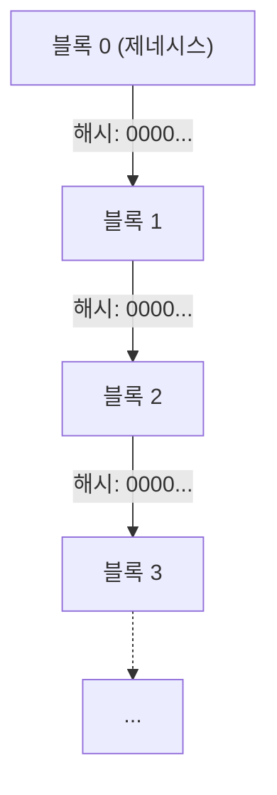
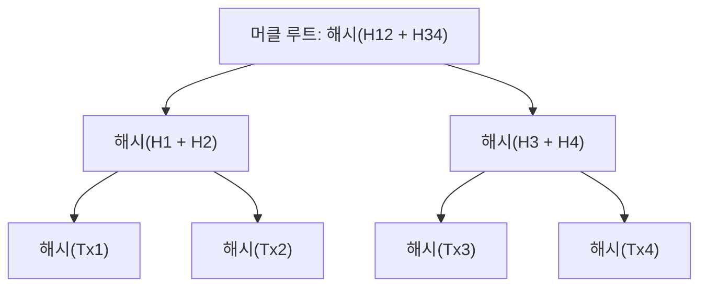
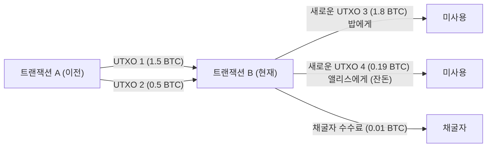

# 암호화폐와 비트코인: 그 역사, 수리적 기반, 그리고 미래

현대 사회에서 '암호화폐(Cryptocurrency)'나 '비트코인(Bitcoin)'이라는 단어를 듣지 않는 날이 없습니다. 하지만 그 이면에 있는 기술적, 수리적 메커니즘을 진정으로 이해하는 사람은 극소수에 불과합니다. 본 기사에서는 암호화폐가 어떻게 탄생했고, 어떤 수학적 기반 위에 성립되어 있으며, 미래를 향해 어떤 과제와 가능성을 품고 있는지를 압도적으로 자세히 해설합니다.

## 1. 서론: 암호화폐란 무엇인가?

암호화폐는 암호 이론을 사용하여 거래의 안전성을 확보하고, 새로운 단위의 발행을 통제하는 디지털 통화의 일종입니다. 전통적인 법정통화(Fiat Money)가 중앙은행이라는 단일 신뢰 기관에 의해 발행 및 관리되는 반면, 암호화폐는 중앙 관리자가 없는 **분산형(Decentralized)** 네트워크 위에서 가동됩니다.

### 법정통화와 분산형 시스템의 대비

법정통화는 '신용'의 산물입니다. 정부라는 권위가 그 가치를 보증함으로써 성립됩니다. 하지만 이 시스템에는 몇 가지 잠재적인 약점이 있습니다.
- **인플레이션 리스크**: 중앙은행은 정책에 따라 통화 공급량을 조작할 수 있으므로, 과도한 지폐 발행은 가치 희석을 초래합니다.
- **단일 장애점(SPOF)**: 금융기관의 시스템이 다운되면 거래는 정지됩니다.
- **검열의 가능성**: 특정 개인이나 조직의 계좌가 동결될 위험이 항상 존재합니다.

이에 반해, 암호화폐는 '무신뢰(Trustless)' 시스템을 지향했습니다. 즉, 특정 누군가를 신뢰하지 않아도 시스템 자체의 수학적·암호학적 견고함에 의해 거래의 정당성이 보증되는 구조입니다.

## 2. 암호화폐의 역사: 사이퍼펑크에서 사토시 나카모토까지

비트코인은 돌연변이처럼 탄생한 것이 아닙니다. 그 배경에는 수십 년에 걸친 암호학의 역사와 프라이버시를 중시하는 기술자들의 사상적 운동이 있었습니다.

### 사이퍼펑크(Cypherpunks)의 사상

1980년대부터 1990년대에 걸쳐 '사이퍼펑크'라 불리는 암호 기술자 및 활동가들의 커뮤니티가 형성되었습니다. 이들은 강력한 암호 기술을 이용해 개인의 프라이버시를 보호하고, 국가의 감시와 검열에 대항하는 것을 목표로 했습니다.

데이비드 차움(David Chaum)이 고안한 'eCash'나 아담 백(Adam Back)의 'Hashcash', 그리고 닉 재보(Nick Szabo)의 'Bit gold' 등 비트코인의 초석이 되는 수많은 아이디어들이 이 커뮤니티에서 탄생했습니다. 하지만 이것들은 '이중 지불 문제(Double-spending problem)'를 중앙 관리자 없이 완벽하게 해결하지는 못했습니다.

### 2008년의 금융위기와 비트코인의 탄생

2008년, 리먼 브라더스의 파산으로 촉발된 전 세계적인 금융위기가 발생했습니다. 기존 금융 시스템에 대한 불신이 극에 달했던 같은 해 10월 31일, '사토시 나카모토(Satoshi Nakamoto)'라고 자칭하는 익명의 인물(또는 그룹)이 암호학 메일링 리스트에 한 편의 논문을 게시했습니다.

제목은 『Bitcoin: A Peer-to-Peer Electronic Cash System』(비트코인: P2P 전자 화폐 시스템). 이 9페이지짜리 논문은 지금까지의 전자 화폐 시도들이 안고 있던 이중 지불 문제를 **작업 증명(Proof of Work: PoW)** 이라는 방식을 사용하여 완전히 분산화된 형태로 해결하는 방법을 제시하고 있었습니다.

### 제네시스 블록(Genesis Block)

2009년 1월 3일, 비트코인 네트워크가 가동을 시작했습니다. 최초로 채굴된 블록은 '제네시스 블록(블록 0)'이라고 불립니다. 이 블록에는 사토시 나카모토에 의해 다음과 같은 메시지가 새겨져 있었습니다.

> "The Times 03/Jan/2009 Chancellor on brink of second bailout for banks"
> (타임스 2009년 1월 3일 재무장관, 은행들에 대한 두 번째 구제금융 직전)

이것은 당시 영국의 신문 『The Times』의 헤드라인으로, 중앙은행의 금융 구제책에 대한 강렬한 풍자인 동시에 비트코인이 영원히 지속될 시스템으로서의 타임스탬프 역할을 하고 있습니다.

## 3. 블록체인의 아키텍처

비트코인을 지탱하는 핵심 기술이 '블록체인(Blockchain)'입니다. 블록체인은 분산 원장 기술(Distributed Ledger Technology: DLT)의 한 형태로, 데이터가 '블록'이라는 단위로 묶이고 그것들이 암호학적으로 체인(사슬)처럼 연결된 구조를 하고 있습니다.

### 블록의 구조

하나의 블록은 크게 '블록 헤더(Block Header)'와 '트랜잭션 데이터(Transaction Data)'로 구성되어 있습니다.

블록 헤더에는 다음 정보가 포함됩니다.
1. **버전(Version)**: 소프트웨어의 버전
2. **이전 블록의 해시(Previous Block Hash)**: 직전 블록의 헤더를 해시화한 값
3. **머클 루트(Merkle Root)**: 블록에 포함된 모든 트랜잭션을 요약한 해시값
4. **타임스탬프(Timestamp)**: 블록이 생성된 시간
5. **난이도 타겟(Difficulty Target, Bits)**: 작업 증명의 난이도를 나타내는 값
6. **논스(Nonce)**: 채굴 시 조건을 만족하는 해시값을 찾기 위해 변경되는 임의의 수치

### 머클 트리(Merkle Trees)

블록체인에서는 블록 크기를 억제하면서 데이터의 위변조를 효율적으로 탐지하기 위해 **머클 트리(Merkle Tree)** 라는 데이터 구조를 이용합니다. 머클 트리는 이진 트리의 일종으로, 리프 노드에 각 트랜잭션의 해시값이 들어가고, 부모 노드는 자식 노드의 해시값을 연결하여 다시 해시화한 것이 됩니다.

트랜잭션의 데이터가 조금이라도 변경되면 해당 리프 노드의 해시가 바뀌고, 연쇄적으로 머클 루트의 값도 완전히 다른 것이 됩니다. 이를 통해 방대한 트랜잭션 데이터 중에서 단 하나라도 위변조가 있다면 즉각적으로 감지하는 것이 가능해집니다.

## 4. 수리적·암호학적 기반

비트코인의 견고함은 고도의 수학적 기반에 의해 지탱됩니다. 여기서는 그 핵심을 이루는 해시 함수, 공개키 암호, 그리고 타원곡선 암호에 대해 깊이 파헤쳐 봅니다.

### SHA-256(Secure Hash Algorithm 256-bit)

비트코인에서 가장 빈번하게 사용되는 암호학적 해시 함수가 **SHA-256** 입니다. 해시 함수는 임의의 길이의 데이터를 입력으로 받아, 고정된 길이(SHA-256의 경우 256비트)의 데이터를 출력하는 일방향 함수입니다.

해시 함수 $H$ 는 다음 성질을 만족해야 합니다.
1. **역상 저항성(Pre-image resistance)**: 주어진 해시값 $h$ 로부터 $H(x) = h$ 가 되는 입력 $x$ 를 구하는 것이 계산적으로 어려울 것.
2. **제2 역상 저항성(Second pre-image resistance)**: 주어진 입력 $x_1$ 에 대해 $H(x_1) = H(x_2)$ 가 되는 다른 입력 $x_2$ 를 찾는 것이 어려울 것.
3. **충돌 저항성(Collision resistance)**: $H(x_1) = H(x_2)$ 가 되는 임의의 두 입력 $x_1, x_2$ 를 찾는 것이 어려울 것.

비트코인에서는 블록 해시 계산이나 공개키로부터 주소를 생성하는 과정 등에서 SHA-256이 이중으로 적용됩니다(이를 `SHA256(SHA256(x))` 또는 Hash256이라고 부릅니다).

### 공개키 암호(Public Key Cryptography)와 디지털 서명

암호화폐의 소유권은 개인키(Private Key)와 공개키(Public Key) 쌍에 의해 증명됩니다.
- **개인키** $k$: 무작위로 생성된 256비트 정수. 절대로 타인에게 알려져서는 안 됩니다.
- **공개키** $K$: 개인키로부터 일방향 함수를 사용해 계산되는 키. 네트워크 상에 공개됩니다.

앨리스가 밥에게 비트코인을 송금할 경우, 앨리스는 자신의 개인키를 사용하여 트랜잭션 데이터에 대해 **디지털 서명(Digital Signature)** 을 생성합니다. 네트워크의 참여자들은 앨리스의 공개키를 사용하여 그 서명이 정당한 것인지(정말로 앨리스가 개인키를 사용해 생성한 것인지)를 검증할 수 있습니다.

### 타원곡선 암호(Elliptic Curve Cryptography: ECC)와 secp256k1

비트코인의 공개키 생성 및 디지털 서명에는 RSA 암호가 아닌 **타원곡선 암호(ECC)** 가 채택되었습니다. ECC는 RSA에 비해 훨씬 짧은 키 길이로 동등한 보안 수준을 제공할 수 있다는 장점이 있습니다.

비트코인에서 사용되는 특정 타원곡선의 파라미터는 **secp256k1** 이라고 불립니다. 이 곡선은 유한체 $\mathbb{F}_p$ 위에서 정의되며, 다음 방정식으로 표현됩니다.

$$
y^2 \equiv x^3 + 7 \pmod{p}
$$

여기서 $p$ 는 매우 큰 소수입니다.
$$
p = 2^{256} - 2^{32} - 2^{9} - 2^{8} - 2^{7} - 2^{6} - 2^{4} - 1
$$

개인키 $k$ 는 $1$ 부터 $n-1$ 범위의 난수입니다($n$ 은 곡선의 위수). 공개키 $K$ 는 곡선상의 어떤 기준점(Generator Point) $G$ 를 개인키 횟수만큼 스칼라 곱셈을 하여 얻어집니다.

$$
K = k \cdot G
$$

이 계산은 타원곡선상의 점 덧셈(Point Addition)과 2배 연산(Point Doubling)을 반복함으로써 효율적으로 수행할 수 있습니다. 하지만 반대로 공개키 $K$ 와 기준점 $G$ 로부터 개인키 $k$ 를 역산하는 것은 **타원곡선 이산대수 문제(Elliptic Curve Discrete Logarithm Problem: ECDLP)** 라고 불리는 계산적으로 극히 어려운 문제이며, 이것이 암호화폐 보안의 근간을 이룹니다.

### ECDSA(Elliptic Curve Digital Signature Algorithm)

트랜잭션의 서명에는 **ECDSA** 가 사용됩니다. 메시지(트랜잭션의 해시)를 $z$ 라고 할 때의 서명 과정은 다음과 같습니다.

1. $1$ 부터 $n-1$ 의 무작위 정수 $k_e$ (임시 키)를 선택한다.
2. 곡선상의 점 $(x_1, y_1) = k_e \cdot G$ 를 계산한다.
3. $r = x_1 \pmod{n}$ 을 계산한다. 만약 $r = 0$ 이면 1단계로 돌아간다.
4. $s = k_e^{-1} (z + r \cdot k) \pmod{n}$ 을 계산한다. 만약 $s = 0$ 이면 1단계로 돌아간다.
5. 서명은 $(r, s)$ 의 쌍이 된다.

검증 과정에서는 공개키 $K$ 와 서명 $(r, s)$ 를 사용하여 다음 계산을 수행합니다.

1. $u_1 = z \cdot s^{-1} \pmod{n}$
2. $u_2 = r \cdot s^{-1} \pmod{n}$
3. 점 $(x_2, y_2) = u_1 \cdot G + u_2 \cdot K$ 를 계산한다.
4. $r \equiv x_2 \pmod{n}$ 이면, 서명은 정당한 것으로 간주된다.

## 5. 합의 알고리즘과 작업 증명(PoW)

분산형 네트워크에서 모두가 동일한 원장 상태에 합의하기 위한 메커니즘이 합의 알고리즘입니다.

### 비잔틴 장군 문제(Byzantine Generals Problem)

분산 컴퓨팅의 고전적인 문제로서 '비잔틴 장군 문제'가 있습니다. 여러 명의 장군이 적의 도시를 포위하고 있으며 공격할지 퇴각할지 의견을 일치시켜야 하지만, 장군 중에는 배신자가 섞여 있어 가짜 메시지를 보낼 가능성이 있습니다. 이런 상황에서 어떻게 정직한 장군들만으로 올바른 합의에 도달할 수 있는가 하는 문제입니다.

비트코인은 **작업 증명(PoW)** 과 **가장 긴 체인의 규칙(Longest Chain Rule)** 을 결합함으로써 이 문제를 실질적으로 해결했습니다.

### 채굴의 수리와 논스(Nonce)

PoW에서의 '작업(Work)'이란 특정 조건을 만족하는 해시값을 찾기 위한 계산 경쟁을 의미합니다. 마이너(채굴자)는 블록 헤더의 해시값이 네트워크에 의해 정해진 **타겟(Target)** 보다 작아지도록 하는 논스(Nonce) 값을 계속해서 찾습니다.

$$
\text{SHA256}(\text{SHA256}(\text{블록\_헤더})) < \text{타겟}
$$

해시 함수의 출력은 완전히 무작위로 보이기 때문에 조건을 만족하는 논스를 찾기 위한 효율적인 알고리즘은 존재하지 않습니다. 오로지 논스 값을 변경하며 해시 계산을 반복하는 무차별 대입 공격(Brute-force)밖에 방법이 없는 것입니다.

타겟 값이 작을수록 조건을 만족하는 해시를 찾을 확률은 낮아집니다. 만약 타겟이 선두에 $k$ 개의 0을 요구하는 값이라면, 그 블록을 찾는 데 필요한 평균 계산 횟수는 $2^k$ 번이 됩니다. 이 막대한 계산 에너지의 투입이야말로 블록체인의 과거 기록을 위변조하는 것을 불가능하게 만듭니다.

### 난이도 조정(Difficulty Adjustment)

비트코인 네트워크는 약 10분에 1개의 블록이 생성되도록 설계되어 있습니다. 하지만 네트워크 전체의 계산 능력(해시레이트)은 항상 변동합니다. 그래서 2016 블록(약 2주)마다 과거의 블록 생성 간격을 바탕으로 타겟 값이 자동으로 조정됩니다.

$$
\text{새로운\_타겟} = \text{이전\_타겟} \times \frac{\text{마지막\_2016개\_블록의\_실제\_시간}}{\text{20160\_분}}
$$

해시레이트가 올라가면 타겟은 작아지고(난이도 상승), 해시레이트가 내려가면 타겟은 커집니다(난이도 하락).

## 6. 트랜잭션과 UTXO 모델

비트코인의 트랜잭션은 은행 계좌 잔고(계정 기반 모델)와 같은 구조가 아니라 **UTXO(Unspent Transaction Output: 미사용 트랜잭션 출력값)** 라는 모델을 채택하고 있습니다.

### 인풋과 아웃풋

비트코인의 '코인'이라는 실체는 존재하지 않습니다. 존재하는 것은 과거 트랜잭션에서 생성된 UTXO의 연쇄뿐입니다. 각 트랜잭션은 기존의 UTXO를 '인풋(입력)'으로 소비하고 새로운 UTXO를 '아웃풋(출력)'으로 생성합니다.

앨리스가 밥에게 1.8 BTC를 보내고 싶다고 가정해 봅시다. 앨리스는 자신이 보유한 1.5 BTC와 0.5 BTC 두 개의 UTXO(총 2.0 BTC)를 인풋으로 지정하고 밥에게 가는 1.8 BTC의 아웃풋을 만듭니다. 남은 0.2 BTC 중 0.19 BTC는 잔돈(Change)으로서 앨리스 자신의 새로운 주소로 향하는 아웃풋이 되고, 차액인 0.01 BTC는 트랜잭션을 처리한 채굴자에게 가는 수수료(Fee)가 됩니다.

$$
\sum \text{입력} = \sum \text{출력} + \text{트랜잭션\_수수료}
$$

이 UTXO 모델은 트랜잭션의 독립성이 높아 병렬 처리가 쉽고, 또한 프라이버시 관점(매번 새로운 잔돈 주소를 사용할 수 있음)에서도 우수합니다.

## 7. 미래와 확장성 문제

비트코인은 극히 견고하고 안전한 시스템이지만 그 대가로 확장성(처리 능력의 확장성)에 큰 과제를 안고 있습니다. 현재의 비트코인 네트워크는 1초에 약 7건의 트랜잭션(7 TPS)밖에 처리하지 못합니다. 이는 Visa 네트워크의 수만 TPS에 비하면 매우 느린 속도입니다.

### 포크(Forks): 소프트 포크와 하드 포크

블록체인 프로토콜을 업그레이드할 때 '포크(분기)'라고 불리는 현상이 발생할 수 있습니다.
- **소프트 포크(Soft Fork)**: 하위 호환성이 있는 업그레이드. 이전 규칙의 노드라도 새로운 규칙의 블록을 유효한 것으로 간주합니다(예: SegWit 도입).
- **하드 포크(Hard Fork)**: 하위 호환성이 없는 업그레이드. 새로운 규칙의 블록은 이전 노드에서 거부되므로 네트워크가 완전히 두 개로 분열될 가능성이 있습니다(예: Bitcoin Cash의 탄생).

### 라이트닝 네트워크(Lightning Network)

확장성 문제를 해결하기 위한 유력한 접근법이 **레이어 2(Layer 2)** 솔루션인 라이트닝 네트워크입니다.

라이트닝 네트워크에서는 참여자끼리 블록체인 외부(오프체인)에 '페이먼트 채널(Payment Channel)'을 개설합니다. 채널 내에서는 양측이 동의하는 한 블록체인에 트랜잭션을 기록하지 않고 순식간에, 그리고 거의 무료로 몇 번이든 자금을 주고받을 수 있습니다. 최종적인 잔고 정산 시에만 블록체인(레이어 1)에 트랜잭션을 기록합니다.

### Proof of Stake(PoS)와의 비교

PoW의 또 다른 큰 과제는 채굴로 인한 막대한 전력 소비입니다. 이 환경 문제에 대한 대책으로 Ethereum 등은 **지분 증명(Proof of Stake: PoS)** 이라는 다른 합의 알고리즘으로 전환했습니다.

PoS에서는 계산 능력(해시레이트)이 아니라 보유하고 있는 암호화폐의 양(지분)과 보유 기간에 따라 다음 블록을 생성할 권리(검증자)가 확률적으로 할당됩니다. 이로써 전력 소비는 99% 이상 감소하지만 "부자가 더 부자가 되는 시스템 아닌가", "완전한 분산화가 훼손되는 것 아닌가" 하는 비판도 존재합니다. 비트코인은 아무리 비판받더라도 '에너지를 소비하여 물리적인 보안을 담보한다'는 PoW의 철학을 굳건히 유지하고 있습니다.

## 8. 암호 이론의 심연: 수학적 증명과 프로토콜의 견고함

앞 장까지 설명한 SHA-256이나 타원곡선 암호(ECC)의 이면에는 정보 이론적 안전성과 계산적 안전성이라는 두 가지 패러다임이 존재합니다. 비트코인을 비롯한 현대의 암호화폐는 주로 계산적 안전성(Computational Security)에 의존하고 있습니다.

### 계산적 안전성과 이산대수 문제

계산적 안전성이란 '어떤 암호를 해독하기 위해서는 우주의 수명보다 긴 시간과 천문학적인 계산 자원이 필요하기 때문에 실질적으로 해독이 불가능하다'는 전제에 기반한 보안입니다.

비트코인의 공개키 암호의 안전성을 담보하는 타원곡선 이산대수 문제(ECDLP)를 수식으로 다시 확인해 보겠습니다.
점 $P$ 와 $Q$ 가 타원곡선 $E(\mathbb{F}_p)$ 상에 있고, $Q = kP$ 를 만족하는 미지의 정수 $k$ 를 구하는 문제입니다.
고전적인 컴퓨터를 사용할 경우, 이 문제를 풀기 위한 최선의 알고리즘(Pollard의 $\rho$ 알고리즘 등)의 계산량은 $\mathcal{O}(\sqrt{p})$ 가 됩니다.
비트코인의 secp256k1에서는 $p \approx 2^{256}$ 이므로 해독에는 약 $2^{128}$ 번의 연산이 필요합니다. 이는 현재 지구상의 모든 컴퓨터를 동원하더라도 우주의 수명(약 138억 년)의 몇조 배에 달하는 시간이 걸리는 계산량입니다.

### 양자 컴퓨터의 위협과 양자 내성 암호

하지만 계산적 안전성에는 하나의 큰 우려가 있습니다. 바로 **양자 컴퓨터(Quantum Computer)** 의 대두입니다.
1994년 피터 쇼어(Peter Shor)가 발표한 '쇼어의 알고리즘(Shor's Algorithm)'은 양자 컴퓨터를 사용하면 소인수 분해 문제(RSA 암호의 기초)나 이산대수 문제(ECC의 기초)를 다항식 시간 $\mathcal{O}(n^3)$ 안에 풀 수 있다는 것을 수학적으로 증명했습니다.

만약 충분한 양자 비트(Qubits)와 낮은 오류율을 가진 실용적인 대규모 양자 컴퓨터가 완성된다면, 비트코인의 공개키로부터 개인키가 역산될 위험이 발생합니다.
이에 대한 비트코인 네트워크의 방어책은 다음과 같습니다.

1. **해시 함수의 보호**: 비트코인 주소는 공개키 자체가 아니라 공개키에 SHA-256과 RIPEMD-160이라는 해시 함수를 적용한 것입니다. 양자 컴퓨터를 사용해도 해시 함수의 역산(그로버의 알고리즘을 사용한다 해도 계산량은 $\mathcal{O}(\sqrt{N})$ )은 여전히 어렵습니다. 따라서 트랜잭션을 수행하여 공개키를 네트워크에 노출시키기 전까지는 주소의 내용은 양자 컴퓨터에 대해서도 안전하다고 할 수 있습니다.
2. **양자 내성 암호(Post-Quantum Cryptography: PQC)로의 전환**: 양자 컴퓨터가 실용화되기 전에 비트코인의 프로토콜을 하드 포크하여, NIST(미국 국립표준기술연구소)가 선정하는 격자 기반 암호(Lattice-based cryptography)나 다변수 다항식 암호(Multivariate polynomial cryptography) 같은 양자 컴퓨터로도 해독이 어려운 새로운 서명 알고리즘으로 전환하는 것이 논의되고 있습니다.

## 9. 네트워크 토폴로지와 P2P 프로토콜의 상세

비트코인 네트워크는 단순한 서버와 클라이언트의 집합체가 아니라 완벽한 **피어 투 피어(Peer-to-Peer: P2P)** 네트워크로 구축되어 있습니다.

### 노드의 종류와 역할

네트워크에 참여하는 컴퓨터는 '노드(Node)'라고 불립니다. 노드에는 여러 종류가 있으며 각각 역할이 다릅니다.

- **풀 노드(Full Node)**: 제네시스 블록부터 최신 블록에 이르기까지 모든 블록체인 데이터(수백 GB 이상)를 다운로드하고 검증하는 노드입니다. 트랜잭션의 정당성이나 이중 지불 여부를 독립적으로 검사하기 때문에 네트워크 보안의 근간을 담당합니다.
- **SPV 노드(Simplified Payment Verification Node)**: 블록체인 전체가 아니라 블록 헤더만을 다운로드하는 경량 노드입니다. 주로 스마트폰용 지갑 등에서 사용됩니다. 자신의 트랜잭션이 블록에 포함되어 있는지(머클 경로 검증)는 확인할 수 있지만 풀 노드만큼의 검증 능력은 없습니다.
- **채굴 노드(Mining Node)**: PoW의 계산을 수행하여 새로운 블록을 생성하는 노드입니다. 현재는 ASIC(Application Specific Integrated Circuit)이라 불리는 채굴 전용 하드웨어를 묶은 거대한 '마이닝 풀'이 이 역할을 맡고 있습니다.

### 트랜잭션 전파 과정(Gossip Protocol)

어떤 사용자(앨리스)가 비트코인을 송금하는 트랜잭션을 생성했을 때, 그 데이터는 어떻게 전 세계로 퍼져나갈까요?

1. 앨리스의 지갑(노드)은 연결되어 있는 몇 개의 피어(인접 노드)에게 트랜잭션 데이터를 전송합니다.
2. 트랜잭션을 받은 각 피어는 그 트랜잭션이 올바른 규칙(충분한 잔고가 있는지, 서명이 올바른지, 형식이 맞는지 등)을 따르고 있는지 검증합니다.
3. 검증에 성공할 경우 해당 트랜잭션을 자신의 **메모리 풀(Mempool)** 에 저장하고, 다시 다른 인접 노드로 전달합니다(고십 프로토콜 / Gossip Protocol).
4. 부정한 트랜잭션이라면 폐기되고 전달되지 않습니다.

이를 통해 유효한 트랜잭션은 몇 초 만에 전 세계 노드의 Mempool로 퍼지게 됩니다. 채굴자는 이 Mempool 중에서 수수료(Fee)가 높은 트랜잭션을 우선적으로 골라내어 새로운 블록에 채워 넣습니다.

## 10. 블록체인의 경제학: 게임 이론과 인센티브 설계

사토시 나카모토의 가장 큰 공적은 암호학적인 퍼즐을 푼 것뿐만이 아니라, '인간이나 조직의 이기적인 행동이 결과적으로 네트워크 전체의 보안을 높인다'는 완벽한 **인센티브 설계(Incentive Design)** 를 구축했다는 데 있습니다.

### 블록 보상과 반감기(Halving)

채굴자가 막대한 전력과 하드웨어 투자를 하면서까지 블록을 채굴하는 이유는 경제적인 보상이 있기 때문입니다. 채굴자가 새로운 블록 생성에 성공하면, **코인베이스 트랜잭션(Coinbase Transaction)** 이라고 불리는 특수한 트랜잭션을 통해 새롭게 발행된 비트코인을 받게 됩니다.

비트코인의 총 발행량은 프로그램에 의해 **2,100만 개** 로 상한이 설정되어 있습니다. 또한 1블록당 채굴 보상은 210,000블록(약 4년)마다 절반이 되는 **반감기(Halving)** 메커니즘이 내장되어 있습니다.

- 2009년~: 50 BTC
- 2012년~: 25 BTC
- 2016년~: 12.5 BTC
- 2020년~: 6.25 BTC
- 2024년~: 3.125 BTC

이러한 디스인플레이션적인 통화 공급 모델은 금(Gold) 채굴을 모방한 것이며, 법정통화가 안고 있는 '무한한 화폐 발행으로 인한 인플레이션'에 대한 안티테제가 되고 있습니다.

### 51% 공격(51% Attack)의 게임 이론적 분석

블록체인의 가장 큰 위협으로 **51% 공격** 이 꼽힙니다. 만약 악의적인 단일 사업자가 네트워크 전체 계산 능력(해시레이트)의 과반수(51% 이상)를 지배할 경우, 다음의 일들이 가능해집니다.

1. 자신의 과거 거래를 취소한다(이중 지불)
2. 특정 트랜잭션의 승인을 거부한다(검열)

하지만 게임 이론의 관점에서 보면 현재의 대규모 비트코인 네트워크에서 51% 공격을 감행하는 것은 지극히 비합리적입니다.
막대한 비용(수천억 원 규모의 하드웨어와 막대한 전력)을 들여 네트워크의 과반수를 지배했다 하더라도, 그 공격이 성공하는 순간 비트코인의 신뢰는 실추되고 가격은 폭락합니다. 공격자가 손에 넣은 비트코인도 무가치해지기 때문에, **"시스템을 공격하는 것보다 그 거대한 계산 능력을 채굴(정당한 규칙을 따르는 것)에 사용하여 보상을 얻는 편이 훨씬 경제적 이익이 크다"** 라는 내시 균형이 성립되어 있는 것입니다.

## 11. 요약: 암호화폐가 여는 새로운 미래의 형태

본 기사에서는 비트코인과 암호화폐의 이면에 있는 수리적, 기술적 그리고 경제학적인 구조를 철저하게 해부해 보았습니다.

얼핏 보면 복잡한 수학과 코드 덩어리로 보이는 블록체인 기술이지만, 그 본질은 **"권위에 의존하지 않고 수학과 물리 법칙을 신뢰의 근거로 삼는, 인류의 새로운 합의 형성 시스템"** 에 다름 아닙니다.

우리가 매일 당연하다는 듯이 사용하고 있는 금융 시스템은 긴 역사 속에서 몇 번이나 파탄 났고 그때마다 미봉책으로 수정을 거듭해 왔습니다. 사토시 나카모토가 제시한 해답은 결코 완벽하지 않습니다. 확장성의 문제, 환경 문제, 그리고 국가에 의한 규제와 법 정비 등 넘어야 할 장애물은 무수히 존재합니다.

하지만 일단 판도라의 상자에서 풀려난 '무신뢰 기반 분산형 시스템'이라는 개념은 더 이상 되돌아가는 일 없이 진화를 계속하고 있습니다. 비트코인이 단순한 디지털 골드로 정착할지, 아니면 레이어 2 기술의 발전으로 진정한 글로벌 페이먼트 네트워크로 승화할지, 그 결말은 아직 아무도 모릅니다. 단 하나 확실한 것은 그 미래를 형성하는 것은 일부 권력자가 아니라 네트워크에 참여하는 전 세계의 노드, 개발자, 그리고 사용자들의 총의라는 것입니다.

## 부록: 더 깊은 학습을 위한 리소스와 참고문헌

이 기사를 읽고 더 나아가 블록체인 기술이나 암호 이론에 대해 깊이 배우고 싶은 분들을 위해 권장되는 리소스 몇 가지를 소개합니다.

### 필독 원논문(Whitepapers)
- **Bitcoin: A Peer-to-Peer Electronic Cash System** (Satoshi Nakamoto, 2008)
  - 모든 것의 시작이 된 기념비적 논문. 불과 9페이지 안에 PoW, 인센티브, 머클 트리를 결합한 분산 원장의 기본 설계가 완벽한 형태로 기술되어 있습니다.
- **Ethereum: A Secure Decentralised Generalised Transaction Ledger** (Gavin Wood, 2014)
  - 이더리움의 옐로우 페이퍼. 비트코인의 UTXO 모델에 대비하여 튜링 완전한 스마트 컨트랙트를 실행할 수 있는 계정 기반의 상태 머신으로서 블록체인을 재정의했습니다.

### 암호 이론과 수학의 기초
블록체인을 진정으로 이해하기 위해서는 정보 보안과 응용 수학의 지식이 필수적입니다. 다음 분야를 학습하는 것을 권장합니다.
1. **추상대수학(군·환·체)**: 특히 유한체(Galois Field)의 개념은 타원곡선 암호를 이해하는 데 있어 피할 수 없습니다.
2. **계산 복잡도 이론**: P 대 NP 문제, 다항식 시간 환원 등의 개념은 암호의 '안전성'이 무엇을 의미하는지 이해하기 위해 중요합니다.
3. **게임 이론**: 내시 균형이나 비잔틴 장군 문제 등 참여자의 인센티브 설계를 수리적으로 모델링하기 위한 틀을 제공합니다.

> **Warning: 투자에 관한 면책 조항**
> 본 기사는 암호화폐의 기반 기술 및 그 역사·수리적 구조에 대해 해설할 목적으로 작성되었으며, 어떠한 암호화폐 투자를 권장하거나 권유하는 것이 아닙니다. 암호화폐의 가격은 매우 변동성이 높으며 투자에는 원금 손실을 포함한 큰 위험이 따릅니다.

블록체인의 기술적 탐구는 컴퓨터 과학, 경제학, 사회학이 교차하는 지식의 프론티어입니다. 코드를 읽고, 스스로 노드를 띄우고, 테스트넷에서 트랜잭션을 생성해 봄으로써 이 기술의 진정한 가능성과 그 한계를 피부로 느낄 수 있을 것입니다.
