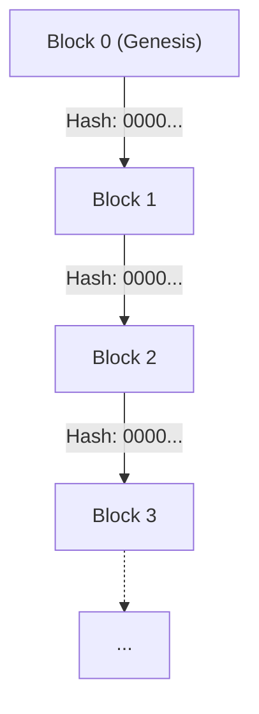
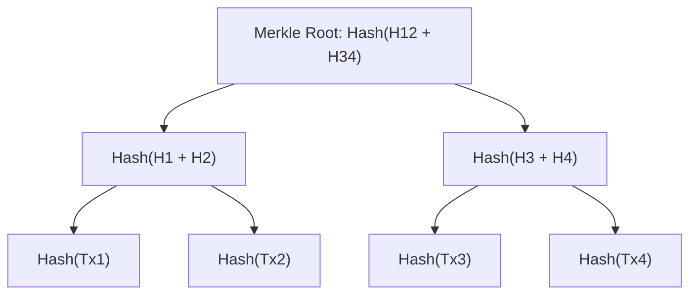
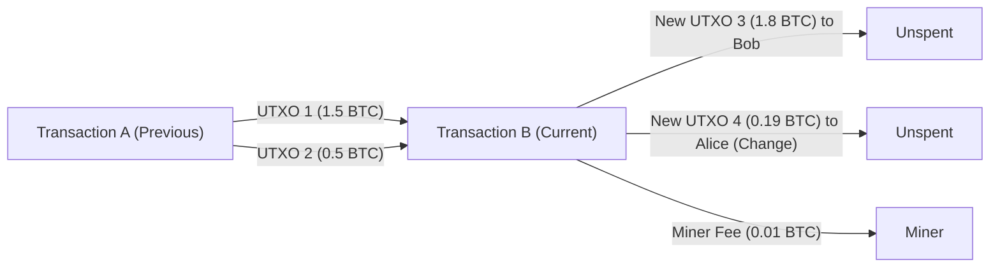

# 暗号資産とビットコイン：その歴史、数理的基盤、そして未来

現代社会において、「暗号資産（Cryptocurrency）」や「ビットコイン（Bitcoin）」という言葉を耳にしない日はありません。しかし、その背後にある技術的、数理的なメカニズムを真に理解している人はごくわずかです。本記事では、暗号資産がいかにして生まれ、どのような数学的基盤の上に成り立ち、そして未来に向けてどのような課題と可能性を秘めているのかを、圧倒的な詳しさで解説します。

## 1. 序論：暗号資産とは何か？

暗号資産は、暗号理論を用いて取引の安全性を確保し、新たな単位の発行を制御するデジタル通貨の一種です。伝統的な法定通貨（Fiat Money）が中央銀行という単一の信頼できる機関によって発行・管理されるのに対し、暗号資産は中央管理者のいない **分散型（Decentralized）** ネットワーク上で稼働します。

### 法定通貨と分散型システムの対比

法定通貨は「信用」の産物です。政府という権威がその価値を保証することで成り立っています。しかし、このシステムにはいくつかの潜在的な弱点があります。
- **インフレーションリスク**: 中央銀行は政策に応じて通貨供給量を操作できるため、過度な紙幣の増刷は価値の希損を招きます。
- **単一障害点（SPOF）**: 金融機関のシステムがダウンすれば、取引は停止します。
- **検閲の可能性**: 特定の個人や組織の口座が凍結されるリスクが常に存在します。

これに対し、暗号資産は「トラストレス（Trustless）」なシステムを目指しました。つまり、特定の誰かを信用しなくても、システムそのものの数学的・暗号学的な堅牢さによって、取引の正当性が保証される仕組みです。

## 2. 暗号資産の歴史：サイファーパンクからサトシ・ナカモトまで

ビットコインは突然変異のように生まれたわけではありません。その背景には、数十年にわたる暗号学の歴史と、プライバシーを重んじる技術者たちの思想的運動がありました。

### サイファーパンク（Cypherpunks）の思想

1980年代から1990年代にかけて、「サイファーパンク」と呼ばれる暗号技術者や活動家たちのコミュニティが形成されました。彼らは、強力な暗号技術を用いて個人のプライバシーを守り、国家の監視や検閲に対抗することを目指していました。

デイヴィッド・チャウム（David Chaum）が考案した「eCash」や、アダム・バック（Adam Back）による「Hashcash」、そしてニック・サボ（Nick Szabo）の「Bit gold」など、ビットコインの礎となる数々のアイデアがこのコミュニティから生まれました。しかし、これらは「二重支払い問題（Double-spending problem）」を完全に中央管理者なしで解決するには至りませんでした。

### 2008年の金融危機とビットコインの誕生

2008年、リーマン・ブラザーズの破綻に端を発する世界的な金融危機が発生しました。既存の金融システムに対する不信感が頂点に達していた同年10月31日、「サトシ・ナカモト（Satoshi Nakamoto）」と名乗る匿名の人物（またはグループ）が、暗号学のメーリングリストに一本の論文を投稿しました。

タイトルは『Bitcoin: A Peer-to-Peer Electronic Cash System』（ビットコイン：[P2P](https://kenji.blog/p/webrtc-realtime-communication-p2p/)電子マネーシステム）。この9ページの論文は、これまでの電子マネーの試みが抱えていた二重支払い問題を、 **プルーフ・オブ・ワーク（Proof of Work: [PoW](https://kenji.blog/p/blockchain-technology-smart-contract-distributed-ledger/)）** という仕組みを使って完全に分散化された形で解決する方法を示していました。

### ジェネシスブ[ロック](https://kenji.blog/p/rdbms-transaction-acid-isolation-level-lock/)（Genesis Block）

2009年1月3日、ビットコインのネットワークが稼働を開始しました。最初に採掘されたブロックは「ジェネシスブロック（ブロック0）」と呼ばれます。このブロックには、サトシ・ナカモトによって次のようなメッセージが刻まれていました。

> "The Times 03/Jan/2009 Chancellor on brink of second bailout for banks"
> （タイムズ紙 2009年1月3日 財務大臣、銀行に対する2度目の救済措置の瀬戸際）

これは、当時のイギリスの新聞『The Times』の見出しであり、中央銀行による金融救済策に対する強烈な皮肉であるとともに、ビットコインが永遠に残り続けるシステムとしてのタイムスタンプの役割を果たしています。

## 3. [ブロックチェーン](https://kenji.blog/p/blockchain-technology-smart-contract-distributed-ledger/)のアーキテクチャ

ビットコインを支える中核技術が「ブ[ロック](https://kenji.blog/p/rdbms-transaction-acid-isolation-level-lock/)チェーン（[Blockchain](https://kenji.blog/p/blockchain-technology-smart-contract-distributed-ledger/)）」です。ブ[ロック](https://kenji.blog/p/rdbms-transaction-acid-isolation-level-lock/)チェーンは、分散型台帳技術（[Distributed Ledger](https://kenji.blog/p/blockchain-technology-smart-contract-distributed-ledger/) Technology: DLT）のひとつの形態であり、データが「ブ[ロック](https://kenji.blog/p/rdbms-transaction-acid-isolation-level-lock/)」と呼ばれる単位でまとめられ、それらが暗号学的にチェーン（鎖）のようにつながった構造をしています。

### ブ[ロック](https://kenji.blog/p/rdbms-transaction-acid-isolation-level-lock/)の構造

ひとつのブロックは、大きく分けて「ブロックヘッダ（Block Header）」と「[トランザクション](https://kenji.blog/p/rdbms-transaction-acid-isolation-level-lock/)データ（[Transaction](https://kenji.blog/p/rdbms-transaction-acid-isolation-level-lock/) Data）」から構成されています。

ブロックヘッダには以下の情報が含まれます。
1. **バージョン（Version）**: ソフトウェアのバージョン
2. **前のブロックのハッシュ（Previous Block Hash）**: 直前のブロックのヘッダをハッシュ化した値
3. **マークルルート（Merkle Root）**: ブロックに含まれる全トランザクションを要約したハッシュ値
4. **タイムスタンプ（Timestamp）**: ブロックが生成された時間
5. **難易度ターゲット（Difficulty Target, Bits）**: プルーフ・オブ・ワークの難易度を示す値
6. **ナンス（Nonce）**: マイニング時に条件を満たすハッシュ値を見つけるために変更される任意の数値

### マークルツリー（Merkle Trees）

[ブロックチェーン](https://kenji.blog/p/blockchain-technology-smart-contract-distributed-ledger/)では、ブ[ロック](https://kenji.blog/p/rdbms-transaction-acid-isolation-level-lock/)サイズを抑えつつ、データの改ざんを効率的に検出するために **マークルツリー（Merkle [Tree](https://kenji.blog/p/tree-graph-data-structures-search-dfs-bfs-dijkstra/)）** というデータ構造を利用します。マークルツリーは二分木の一種で、葉ノードに各[トランザクション](https://kenji.blog/p/rdbms-transaction-acid-isolation-level-lock/)のハッシュ値が入り、親ノードは子ノードのハッシュ値を連結して再度ハッシュ化したものになります。

[トランザクション](https://kenji.blog/p/rdbms-transaction-acid-isolation-level-lock/)のデータが少しでも変更されると、その葉ノードのハッシュが変わり、連鎖的にマークルルートの値も全く違うものになります。これにより、膨大なトランザクションデータの中から、一つでも改ざんがあれば即座に検知することが可能になります。

## 4. 数理的・暗号学的基盤

ビットコインの堅牢性は、高度な数学的基盤に支えられています。ここでは、その中核をなすハッシュ関数、[公開鍵](https://kenji.blog/p/modern-cryptography-public-key-hash-signature/)暗号、および楕円曲線暗号について深く掘り下げます。

### SHA-256（Secure Hash Algorithm 256-bit）

ビットコインで最も頻繁に用いられる暗号学的ハッシュ関数が **SHA-256** です。ハッシュ関数は、任意の長さのデータを入力とし、固定長（SHA-256の場合は256ビット）のデータを出力する一方向関数です。

ハッシュ関数 $H$ は、以下の性質を満たさなければなりません。
1. **一方向性（Pre-image resistance）**: 与えられたハッシュ値 $h$ から、$H(x) = h$ となるような入力 $x$ を求めることが計算量的に困難であること。
2. **弱衝突耐性（Second pre-image resistance）**: 与えられた入力 $x_1$ に対して、$H(x_1) = H(x_2)$ となるような別の入力 $x_2$ を見つけることが困難であること。
3. **強衝突耐性（Collision resistance）**: $H(x_1) = H(x_2)$ となるような任意の2つの入力 $x_1, x_2$ を見つけることが困難であること。

ビットコインでは、ブ[ロック](https://kenji.blog/p/rdbms-transaction-acid-isolation-level-lock/)ハッシュの計算や、公開鍵から[アドレス](https://kenji.blog/p/c-language-pointers-memory-management-stack-heap/)を生成するプロセスなどでSHA-256が二重に適用されます（これを `SHA256(SHA256(x))`、またはHash256と呼びます）。

### [公開鍵](https://kenji.blog/p/modern-cryptography-public-key-hash-signature/)暗号（[Public Key](https://kenji.blog/p/modern-cryptography-public-key-hash-signature/) [Cryptography](https://kenji.blog/p/modern-cryptography-public-key-hash-signature/)）とデジタル署名

暗号資産の所有権は、秘密鍵（Private Key）と公開鍵（Public Key）のペアによって証明されます。
- **秘密鍵** $k$: ランダムに生成された256ビットの整数。絶対に他人に知られてはなりません。
- **公開鍵** $K$: 秘密鍵から一方向関数を用いて計算される鍵。ネットワーク上に公開されます。

アリスがボブにビットコインを送金する場合、アリスは自身の秘密鍵を使って[トランザクション](https://kenji.blog/p/rdbms-transaction-acid-isolation-level-lock/)データに対して **デジタル署名（[Digital Signature](https://kenji.blog/p/modern-cryptography-public-key-hash-signature/)）** を作成します。ネットワークの参加者は、アリスの公開鍵を使ってその署名が正当なものか（本当にアリスが秘密鍵を使って作成したものか）を検証することができます。

### 楕円曲線暗号（Elliptic Curve Cryptography: ECC）と secp256k1

ビットコインの公開鍵生成およびデジタル署名には、[RSA](https://kenji.blog/p/modern-cryptography-public-key-hash-signature/)暗号ではなく **楕円曲線暗号（ECC）** が採用されています。ECCは、RSAに比べてはるかに短い鍵長で同等のセキュリティレベルを提供できるという利点があります。

ビットコインで用いられる特定の楕円曲線のパラメータは **secp256k1** と呼ばれます。この曲線は有限体 $\mathbb{F}_p$ 上で定義され、次の方程式で表されます。

$$
y^2 \equiv x^3 + 7 \pmod{p}
$$

ここで、$p$ は非常に大きな素数です。
$$
p = 2^{256} - 2^{32} - 2^{9} - 2^{8} - 2^{7} - 2^{6} - 2^{4} - 1
$$

秘密鍵 $k$ は、$1$ から $n-1$ の範囲の乱数です（$n$ は曲線の位数）。公開鍵 $K$ は、曲線上のある基準点（Generator Point） $G$ を秘密鍵の回数だけスカラー倍算することで得られます。

$$
K = k \cdot G
$$

この計算は、楕円曲線上の点の加算（Point Addition）と2倍算（Point Doubling）を繰り返すことで効率的に行えます。しかし、逆に公開鍵 $K$ と基準点 $G$ から秘密鍵 $k$ を逆算することは、**楕円曲線離散対数問題（Elliptic Curve Discrete Logarithm Problem: ECDLP）** と呼ばれる計算量的に極めて困難な問題であり、これが暗号資産のセキュリティの根幹をなしています。

### ECDSA（Elliptic Curve Digital Signature Algorithm）

[トランザクション](https://kenji.blog/p/rdbms-transaction-acid-isolation-level-lock/)の署名には **ECDSA** が用いられます。メッセージ（トランザクションのハッシュ）を $z$ としたときの署名プロセスは以下の通りです。

1. $1$ から $n-1$ のランダムな整数 $k_e$ （エフェメラル鍵）を選択する。
2. 曲線上の点 $(x_1, y_1) = k_e \cdot G$ を計算する。
3. $r = x_1 \pmod{n}$ を計算する。もし $r = 0$ ならステップ1に戻る。
4. $s = k_e^{-1} (z + r \cdot k) \pmod{n}$ を計算する。もし $s = 0$ ならステップ1に戻る。
5. 署名は $(r, s)$ のペアとなる。

検証プロセスでは、公開鍵 $K$ と署名 $(r, s)$ を用いて以下の計算を行います。

1. $u_1 = z \cdot s^{-1} \pmod{n}$
2. $u_2 = r \cdot s^{-1} \pmod{n}$
3. 点 $(x_2, y_2) = u_1 \cdot G + u_2 \cdot K$ を計算する。
4. $r \equiv x_2 \pmod{n}$ であれば、署名は正当であるとみなされる。

## 5. [コンセンサスアルゴリズム](https://kenji.blog/p/byzantine-generals-problem-consensus/)とプルーフ・オブ・ワーク（[PoW](https://kenji.blog/p/blockchain-technology-smart-contract-distributed-ledger/)）

分散型ネットワークにおいて、全員が同じ台帳の状態に合意するための仕組みがコンセンサスアルゴリズムです。

### [ビザンチン将軍](https://kenji.blog/p/byzantine-generals-problem-consensus/)問題（[Byzantine Generals](https://kenji.blog/p/byzantine-generals-problem-consensus/) Problem）

分散コンピューティングにおける古典的な問題として「ビザンチン将軍問題」があります。複数の将軍が敵の都市を包囲しており、攻撃か撤退かで意見を一致させなければなりませんが、将軍の中には裏切り者がいて偽のメッセージを送る可能性があります。このような状況下で、いかにして誠実な将軍たちだけで正しい合意に達することができるかという問題です。

ビットコインは、**プルーフ・オブ・ワーク（[PoW](https://kenji.blog/p/blockchain-technology-smart-contract-distributed-ledger/)）** と **最長チェーンのルール（Longest Chain Rule）** を組み合わせることで、この問題を実質的に解決しました。

### マイニングの数理とナンス（Nonce）

PoWにおける「作業（Work）」とは、特定の条件を満たすハッシュ値を見つけるための計算競争を指します。マイナー（採掘者）は、ブ[ロック](https://kenji.blog/p/rdbms-transaction-acid-isolation-level-lock/)ヘッダのハッシュ値が、ネットワークによって定められた **ターゲット（Target）** よりも小さくなるようなナンス（Nonce）の値を探し続けます。

$$
\text{SHA256}(\text{SHA256}(\text{Block\_Header})) < \text{Target}
$$

ハッシュ関数の出力は完全にランダムに見えるため、条件を満たすナンスを見つけるための効率的なアルゴリズムは存在しません。ひたすらナンスの値を変更してハッシュ計算を繰り返す総当たり攻撃（Brute-force）しか方法がないのです。

ターゲットの値が小さいほど、条件を満たすハッシュを見つける確率は低くなります。もしターゲットが先頭に $k$ 個のゼロを要求するような値であれば、そのブロックを見つけるのに必要な平均計算回数は $2^k$ 回となります。この膨大な計算エネルギーの投下こそが、[ブロックチェーン](https://kenji.blog/p/blockchain-technology-smart-contract-distributed-ledger/)の過去の記録を改ざんすることを不可能にしています。

### 難易度調整（Difficulty Adjustment）

ビットコインネットワークは、約10分に1つのブ[ロック](https://kenji.blog/p/rdbms-transaction-acid-isolation-level-lock/)が生成されるように設計されています。しかし、ネットワーク全体の計算能力（ハッシュレート）は常に変動します。そこで、2016ブロック（約2週間）ごとに、過去のブロック生成間隔を基にしてターゲットの値が自動的に調整されます。

$$
\text{New\_Target} = \text{Old\_Target} \times \frac{\text{Actual\_Time\_of\_Last\_2016\_Blocks}}{\text{20160\_Minutes}}
$$

ハッシュレートが上がればターゲットは小さくなり（難易度上昇）、ハッシュレートが下がればターゲットは大きくなります（難易度低下）。

## 6. [トランザクション](https://kenji.blog/p/rdbms-transaction-acid-isolation-level-lock/)とUTXOモデル

ビットコインのトランザクションは、銀行の口座残高（アカウントベース・モデル）のような仕組みではなく、**UTXO（Unspent [Transaction](https://kenji.blog/p/rdbms-transaction-acid-isolation-level-lock/) Output：未使用トランザクションアウトプット）** というモデルを採用しています。

### インプットとアウトプット

ビットコインの「コイン」という実体は存在しません。存在するのは、過去のトランザクションで作付されたUTXOの連鎖だけです。各トランザクションは、既存のUTXOを「インプット（入力）」として消費し、新たなUTXOを「アウトプット（出力）」として生成します。

アリスがボブに1.8 BTCを送りたいとします。アリスは自身が保有する1.5 BTCと0.5 BTCの2つのUTXO（合計2.0 BTC）をインプットとして指定し、ボブ宛てに1.8 BTCのアウトプットを作成します。残りの0.2 BTCのうち、0.19 BTCはお釣り（Change）としてアリス自身の新しい[アドレス](https://kenji.blog/p/c-language-pointers-memory-management-stack-heap/)宛てのアウトプットとなり、差額の0.01 BTCは[トランザクション](https://kenji.blog/p/rdbms-transaction-acid-isolation-level-lock/)を処理したマイナーへの手数料（Fee）となります。

$$
\sum \text{Inputs} = \sum \text{Outputs} + \text{[Transaction](https://kenji.blog/p/rdbms-transaction-acid-isolation-level-lock/)\_Fee}
$$

このUTXOモデルは、トランザクションの独立性が高いため並列処理がしやすく、またプライバシーの観点（毎回新しいお釣り[アドレス](https://kenji.blog/p/c-language-pointers-memory-management-stack-heap/)を使うことができる）でも優れています。

## 7. 未来とスケーラビリティ問題

ビットコインは極めて堅牢で安全なシステムですが、その代償としてスケーラビリティ（処理能力の拡張性）に大きな課題を抱えています。現在のビットコインネットワークは、1秒間に約7件のトランザクション（7 TPS）しか処理できません。これは、Visaネットワークの数万TPSに比べると非常に低速です。

### フォーク（Forks）：ソフトフォークとハードフォーク

[ブロックチェーン](https://kenji.blog/p/blockchain-technology-smart-contract-distributed-ledger/)のプロトコルをアップグレードする際、「フォーク（分岐）」と呼ばれる事象が発生することがあります。
- **ソフトフォーク（Soft Fork）**: 後方互換性のあるアップグレード。古いルールのノードでも、新しいルールのブ[ロック](https://kenji.blog/p/rdbms-transaction-acid-isolation-level-lock/)を有効とみなします（例：SegWitの導入）。
- **ハードフォーク（Hard Fork）**: 後方互換性のないアップグレード。新しいルールのブロックは古いノードには拒否されるため、ネットワークが完全に2つに分裂する可能性があります（例：Bitcoin Cashの誕生）。

### ライトニングネットワーク（Lightning Network）

スケーラビリティ問題を解決するための有力なアプローチが、**レイヤー2（Layer 2）** ソリューションであるライトニングネットワークです。

ライトニングネットワークでは、参加者同士がブロックチェーン外（オフチェーン）で「ペイメントチャネル（Payment Channel）」を開設します。チャネル内では、双方が納得する限り、ブロックチェーンに[トランザクション](https://kenji.blog/p/rdbms-transaction-acid-isolation-level-lock/)を記録することなく、一瞬で、かつほぼ無料で何度でも資金のやり取りが可能です。最終的な残高の精算時のみ、ブロックチェーン（レイヤー1）にトランザクションを記録します。

### Proof of Stake（[PoS](https://kenji.blog/p/blockchain-technology-smart-contract-distributed-ledger/)）との比較

[PoW](https://kenji.blog/p/blockchain-technology-smart-contract-distributed-ledger/)のもう一つの大きな課題は、マイニングによる莫大な電力消費です。この環境問題への対策として、Ethereumなどは **プルーフ・オブ・ステーク（Proof of Stake: PoS）** という別の[コンセンサスアルゴリズム](https://kenji.blog/p/byzantine-generals-problem-consensus/)に移行しました。

[PoS](https://kenji.blog/p/blockchain-technology-smart-contract-distributed-ledger/)では、計算能力（ハッシュレート）ではなく、保有している暗号資産の量（ステーク）と保有期間に応じて、次のブ[ロック](https://kenji.blog/p/rdbms-transaction-acid-isolation-level-lock/)を生成する権利（バリデータ）が確率的に割り当てられます。これにより電力消費は99%以上削減されますが、「お金持ちがよりお金持ちになるシステムではないか」「完全な分散化が損なわれるのではないか」という批判も存在します。ビットコインは、どれほど批判されようとも、「エネルギーを消費することによる物理的なセキュリティ担保」という[PoW](https://kenji.blog/p/blockchain-technology-smart-contract-distributed-ledger/)の哲学を堅持し続けています。

## 8. 暗号理論の深淵：数学的証明とプロトコルの堅牢性

前章までで解説したSHA-256や楕円曲線暗号（ECC）の背後には、[情報理論](https://kenji.blog/p/information-theory-shannon-entropy/)的安全性と計算量的安全性という二つのパラダイムが存在します。ビットコインをはじめとする現代の暗号資産は、主に計算量的安全性（Computational Security）に依存しています。

### 計算量的安全性と離散対数問題

計算量的安全性とは、「ある暗号を解読するためには、宇宙の寿命よりも長い時間と天文学的な計算資源が必要であるため、実質的に解読不可能である」という前提に基づくセキュリティです。

ビットコインの[公開鍵](https://kenji.blog/p/modern-cryptography-public-key-hash-signature/)暗号の安全性を担保する楕円曲線離散対数問題（ECDLP）を数式で再確認しましょう。
点 $P$ と $Q$ が楕円曲線 $E(\mathbb{F}_p)$ 上にあり、$Q = kP$ を満たす未知の整数 $k$ を求める問題です。
古典的なコンピュータを用いた場合、この問題を解くための最良のアルゴリズム（Pollardの $\rho$ 法など）の計算量は $\mathcal{O}(\sqrt{p})$ となります。
ビットコインの secp256k1 では $p \approx 2^{256}$ であるため、解読には約 $2^{128}$ 回の演算が必要です。これは現在の地球上のすべてのコンピュータを動員しても、宇宙の寿命（約138億年）の何兆倍もの時間がかかる計算量です。

### [量子コンピュータ](https://kenji.blog/p/quantum-computing-shors-algorithm/)の脅威と耐量子暗号

しかし、計算量的安全性には一つの大きな懸念があります。それが **量子コンピュータ（Quantum Computer）** の台頭です。
1994年にピーター・ショア（Peter Shor）が発表した「[ショアのアルゴリズム](https://kenji.blog/p/quantum-computing-shors-algorithm/)（[Shor's Algorithm](https://kenji.blog/p/quantum-computing-shors-algorithm/)）」は、量子コンピュータを用いれば、素因数分解問題（[RSA](https://kenji.blog/p/modern-cryptography-public-key-hash-signature/)暗号の基礎）や離散対数問題（ECCの基礎）を多項式時間 $\mathcal{O}(n^3)$ で解くことができることを数学的に証明しました。

もし、十分な量子ビット（Qubits）と低いエラー率を持つ実用的な大規模量子コンピュータが完成すれば、ビットコインの[公開鍵](https://kenji.blog/p/modern-cryptography-public-key-hash-signature/)から秘密鍵が逆算されるリスクが生じます。
これに対するビットコインネットワークの防衛策は以下の通りです。

1. **ハッシュ関数の保護**: ビットコイン[アドレス](https://kenji.blog/p/c-language-pointers-memory-management-stack-heap/)は公開鍵そのものではなく、公開鍵にSHA-256とRIPEMD-160というハッシュ関数を適用したものです。量子コンピュータを使っても、ハッシュ関数の逆算（グローバーのアルゴリズムを用いたとしても計算量は $\mathcal{O}(\sqrt{N})$）は依然として困難です。そのため、[トランザクション](https://kenji.blog/p/rdbms-transaction-acid-isolation-level-lock/)を行って公開鍵をネットワークにさらすまでは、[アドレス](https://kenji.blog/p/c-language-pointers-memory-management-stack-heap/)の中身は量子コンピュータに対しても安全と言えます。
2. **耐量子暗号（Post-Quantum [Cryptography](https://kenji.blog/p/modern-cryptography-public-key-hash-signature/): PQC）への移行**: 量子コンピュータが実用化される前に、ビットコインのプロトコルをハードフォークさせ、NIST（米国国立標準技術研究所）が選定する格子ベース暗号（Lattice-based cryptography）や多変数多項式暗号（Multivariate polynomial cryptography）といった、量子コンピュータでも解読が困難な新しい署名アルゴリズムに移行することが議論されています。

## 9. ネットワーク・トポロジーと[P2P](https://kenji.blog/p/webrtc-realtime-communication-p2p/)プロトコルの詳細

ビットコインネットワークは、単なるサーバーとクライアントの集合体ではなく、完全な **ピア・ツー・ピア（Peer-to-Peer: P2P）** ネットワークとして構築されています。

### ノードの種類と役割

ネットワークに参加するコンピュータは「ノード（Node）」と呼ばれます。ノードにはいくつか種類があり、それぞれ役割が異なります。

- **フルノード（Full Node）**: ジェネシスブ[ロック](https://kenji.blog/p/rdbms-transaction-acid-isolation-level-lock/)から最新のブロックに至るまで、すべての[ブロックチェーン](https://kenji.blog/p/blockchain-technology-smart-contract-distributed-ledger/)データ（数百GB以上）をダウンロードし、検証するノードです。[トランザクション](https://kenji.blog/p/rdbms-transaction-acid-isolation-level-lock/)の正当性や二重支払いの有無を独立してチェックするため、ネットワークのセキュリティの根幹を担います。
- **SPVノード（Simplified Payment Verification Node）**: ブ[ロック](https://kenji.blog/p/rdbms-transaction-acid-isolation-level-lock/)チェーン全体ではなく、ブロックヘッダのみをダウンロードする軽量ノードです。主にスマートフォン用のウォレットなどで使われます。自身のトランザクションがブロックに含まれているか（マークルパスの検証）は確認できますが、フルノードほどの検証能力はありません。
- **マイニングノード（Mining Node）**: [PoW](https://kenji.blog/p/blockchain-technology-smart-contract-distributed-ledger/)の計算を行い、新しいブ[ロック](https://kenji.blog/p/rdbms-transaction-acid-isolation-level-lock/)を生成するノードです。現在では、ASIC（Application Specific Integrated Circuit）と呼ばれるマイニング専用のハードウェアを束ねた巨大な「マイニングプール」がこの役割を担っています。

### [トランザクション](https://kenji.blog/p/rdbms-transaction-acid-isolation-level-lock/)の伝播プロセス（Gossip Protocol）

あるユーザー（アリス）がビットコインを送金するトランザクションを作成した際、そのデータはどのように世界中に広がるのでしょうか。

1. アリスのウォレット（ノード）は、接続されている数個のピア（隣接ノード）に対してトランザクションデータを送信します。
2. トランザクションを受け取った各ピアは、そのトランザクションが正しいルール（十分な残高があるか、署名が正しいか、書式が合っているか等）に従っているかを検証します。
3. 検証に成功した場合、そのトランザクションを自身の **メモリプール（Mempool）** に保存し、さらに別の隣接ノードへと転送します（Gossip Protocol / ゴシッププロトコル）。
4. 不正なトランザクションであれば破棄され、転送されません。

これにより、有効なトランザクションは数秒のうちに世界中のノードのMempoolに行き渡ります。マイナーは、このMempoolの中から手数料（Fee）の高いトランザクションを優先的に選び出し、新しいブロックに詰め込みます。

## 10. ブロックチェーンの経済学：ゲーム理論とインセンティブ設計

サトシ・ナカモトの最大の功績は、暗号学的なパズルを解いたことだけではなく、「人間や組織の利己的な行動が、結果的にネットワーク全体のセキュリティを高める」という完璧な **インセンティブ設計（Incentive Design）** を構築したことにあります。

### ブロック報酬と半減期（Halving）

マイナーが膨大な電力とハードウェア投資を行ってまでブロックを採掘する理由は、経済的な報酬があるからです。マイナーが新しいブロックの生成に成功すると、**コインベーストランザクション（Coinbase [Transaction](https://kenji.blog/p/rdbms-transaction-acid-isolation-level-lock/)）** と呼ばれる特殊なトランザクションを通じて、新たに発行されたビットコインを受け取ります。

ビットコインの総発行枚数はプログラムによって **2,100万枚** に上限が設定されています。また、1ブロックあたりのマイニング報酬は、210,000ブロック（約4年）ごとに半分になる **半減期（Halving）** というメカニズムが組み込まれています。

- 2009年〜: 50 BTC
- 2012年〜: 25 BTC
- 2016年〜: 12.5 BTC
- 2020年〜: 6.25 BTC
- 2024年〜: 3.125 BTC

このディスインフレーション的な通貨供給モデルは、金（ゴールド）の採掘を模倣したものであり、法定通貨が抱える「無限の増刷によるインフレ」に対するアンチテーゼとなっています。

### 51%攻撃（51% Attack）のゲーム理論的分析

ブロックチェーンの最大の脅威として **51%攻撃** が挙げられます。もし悪意のある単一の事業者が、ネットワーク全体の計算能力（ハッシュレート）の過半数（51%以上）を支配した場合、以下のことが可能になります。

1. 自身の過去の取引を取り消す（二重支払い）
2. 特定のトランザクションの承認を拒否する（検閲）

しかし、ゲーム理論の観点から見ると、現在の大規模なビットコインネットワークで51%攻撃を行うことは極めて非合理的です。
莫大なコスト（数千億円規模のハードウェアと莫大な電力）をかけてネットワークの過半数を支配したとしても、その攻撃が成功した瞬間にビットコインの信頼は失墜し、価格は暴落します。攻撃者が手に入れたビットコインも無価値になるため、**「システムを攻撃するよりも、その巨大な計算能力をマイニング（正当なルールに従うこと）に使って報酬を得たほうが、はるかに経済的利益が大きい」** というナッシュ均衡が成立しているのです。

## 11. まとめ：暗号資産が拓く新しい未来のカタチ

本記事では、ビットコインと暗号資産の裏側にある数理的、技術的、そして経済学的な仕組みを徹底的に解剖しました。

一見すると複雑な数学とコードの塊に見えるブロックチェーン技術ですが、その本質は **「権威に依存せず、数学と物理法則を信頼の根拠とする、人類の新しい合意形成システム」** にほかなりません。

私たちが日々当たり前のように使っている金融システムは、長い歴史の中で幾度となく破綻し、その度にパッチワーク的な修正を繰り返してきました。サトシ・ナカモトが提示した解は、決して完璧ではありません。スケーラビリティの問題、環境問題、そして国家による規制と法整備など、越えるべきハードルは無数に存在します。

しかし、ひとたびパンドラの箱から解き放たれた「トラストレスな分散型システム」という概念は、もはや後戻りすることなく進化を続けています。ビットコインが単なるデジタル・ゴールドとして定着するのか、それともレイヤー2技術の発展により真のグローバル・ペイメントネットワークへと昇華するのか、その結末は未だ誰にも分かりません。ただ一つ確かなことは、その未来を形作るのは一部の権力者ではなく、ネットワークに参加する世界中のノード、開発者、そしてユーザーの総意であるということです。

## 付録：より深い学習のためのリソースと参考文献

この記事を読んで、さらにブロックチェーン技術や暗号理論について深く学びたい方のために、推奨されるリソースをいくつか紹介します。

### 必読の原論文（Whitepapers）
- **Bitcoin: A Peer-to-Peer Electronic Cash System** (Satoshi Nakamoto, 2008)
  - すべての始まりとなった記念碑的論文。わずか9ページの中に、PoW、インセンティブ、マークルツリーを組み合わせた分散型台帳の基本設計が完璧な形で記述されています。
- **Ethereum: A Secure Decentralised Generalised Transaction Ledger** (Gavin Wood, 2014)
  - イーサリアムのYellow Paper。ビットコインのUTXOモデルに対して、チューリング完全な[スマートコントラクト](https://kenji.blog/p/blockchain-technology-smart-contract-distributed-ledger/)を実行可能なアカウントベースのステートマシンとしてブ[ロック](https://kenji.blog/p/rdbms-transaction-acid-isolation-level-lock/)チェーンを再定義しました。

### 暗号理論と数学の基礎
ブロックチェーンを真に理解するためには、情報セキュリティと応用数学の知識が不可欠です。以下の分野を学習することをお勧めします。
1. **抽象代数学（群・環・体）**: 特に有限体（Galois Field）の概念は、楕円曲線暗号を理解する上で避けて通れません。
2. **計算量理論**: [P対NP](https://kenji.blog/p/p-vs-np-problem/)問題、多項式時間還元などの概念は、暗号の「安全性」が何を意味するのかを理解するために重要です。
3. **ゲーム理論**: ナッシュ均衡や[ビザンチン将軍](https://kenji.blog/p/byzantine-generals-problem-consensus/)問題など、参加者のインセンティブ設計を数理的にモデル化するための枠組みを提供します。

> **Warning: 投資に関する免責事項**
> 本記事は、暗号資産の基盤技術およびその歴史・数理的構造について解説する目的で作成されており、いかなる暗号資産への投資を推奨、勧誘するものではありません。暗号資産の価格は極めてボラティリティが高く、投資には元本割れを含む大きなリスクが伴います。

[ブロックチェーン](https://kenji.blog/p/blockchain-technology-smart-contract-distributed-ledger/)の技術的探求は、コンピュータサイエンス、経済学、社会学が交差する知のフロンティアです。コードを読み、自身でノードを立ち上げ、テストネットで[トランザクション](https://kenji.blog/p/rdbms-transaction-acid-isolation-level-lock/)を生成してみることで、この技術の真の可能性とその限界を肌で感じることができるでしょう。
