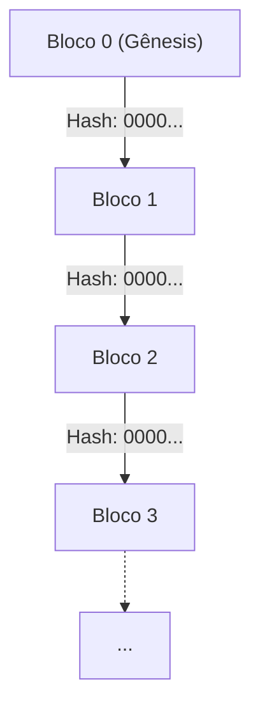
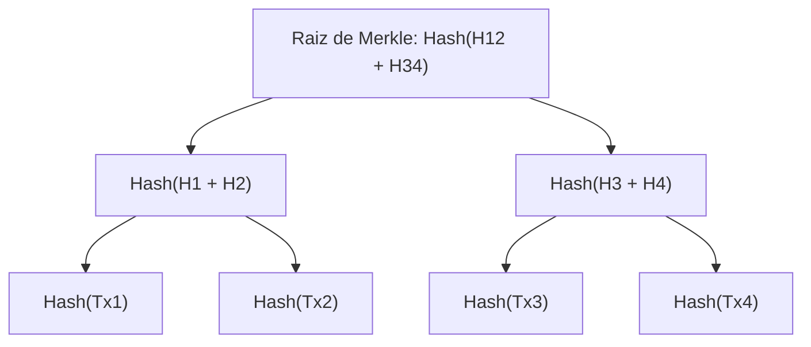
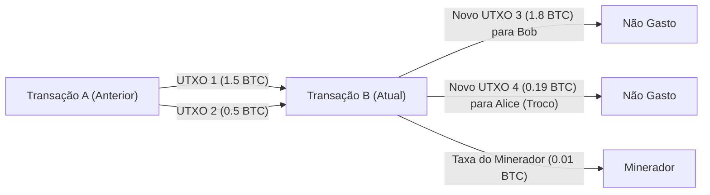

# Criptomoedas e Bitcoin: História, Fundamentos Matemáticos e o Futuro

Na sociedade moderna, não há um dia em que não ouçamos as palavras "Criptomoedas" (Cryptocurrency) ou "Bitcoin". No entanto, muito poucas pessoas realmente entendem os mecanismos técnicos e matemáticos por trás delas. Neste artigo, explicaremos com detalhes impressionantes como as criptomoedas nasceram, sobre quais fundamentos matemáticos elas são construídas e quais desafios e possibilidades elas guardam para o futuro.

## 1. Introdução: O que são criptomoedas?

Criptomoedas são um tipo de moeda digital que usa teoria criptográfica para garantir a segurança das transações e controlar a emissão de novas unidades. Enquanto a moeda fiduciária tradicional (Fiat Money) é emitida e gerenciada por uma única instituição confiável chamada banco central, as criptomoedas operam em uma rede **descentralizada (Decentralized)** sem um administrador central.

### Contraste entre Moeda Fiduciária e Sistemas Descentralizados

A moeda fiduciária é um produto da "confiança". Baseia-se na autoridade do governo que garante o seu valor. No entanto, este sistema tem algumas fraquezas inerentes.
- **Risco de inflação**: Como o banco central pode manipular a oferta de moeda de acordo com a política, a impressão excessiva de papel-moeda leva à diluição do valor.
- **Ponto único de falha (SPOF)**: Se o sistema da instituição financeira cair, as transações são interrompidas.
- **Possibilidade de censura**: Há sempre o risco de que as contas de indivíduos ou organizações específicas sejam congeladas.

Em contraste, as criptomoedas visavam um sistema "Trustless" (sem necessidade de confiança). Ou seja, é um mecanismo em que a validade das transações é garantida pela robustez matemática e criptográfica do próprio sistema, sem a necessidade de confiar em alguém específico.

## 2. A História das Criptomoedas: Dos Cypherpunks a Satoshi Nakamoto

O Bitcoin não nasceu como uma mutação repentina. Por trás dele, houve décadas de história criptográfica e um movimento ideológico de tecnólogos que valorizavam a privacidade.

### A Ideologia dos Cypherpunks

Entre as décadas de 1980 e 1990, formou-se uma comunidade de criptógrafos e ativistas chamados "Cypherpunks". Eles visavam usar criptografia forte para proteger a privacidade individual e resistir à vigilância e censura do estado.

O "eCash" idealizado por David Chaum, o "Hashcash" de Adam Back e o "Bit gold" de Nick Szabo foram algumas das muitas ideias que serviram de base para o Bitcoin que nasceram dessa comunidade. No entanto, eles não conseguiram resolver completamente o "Problema do gasto duplo" (Double-spending problem) sem um administrador central.

### A Crise Financeira de 2008 e o Nascimento do Bitcoin

Em 2008, ocorreu a crise financeira global desencadeada pelo colapso do Lehman Brothers. Em 31 de outubro do mesmo ano, quando a desconfiança no sistema financeiro existente atingiu o auge, uma pessoa (ou grupo) anônima sob o pseudônimo de "Satoshi Nakamoto" postou um artigo em uma lista de discussão de criptografia.

O título era "Bitcoin: A Peer-to-Peer Electronic Cash System" (Bitcoin: Um Sistema de Dinheiro Eletrônico P2P). Este artigo de 9 páginas mostrou como resolver o problema do gasto duplo que as tentativas anteriores de dinheiro eletrônico enfrentavam, de uma forma completamente descentralizada, usando um mecanismo chamado **Proof of Work (PoW)**.

### O Bloco Gênesis (Genesis Block)

Em 3 de janeiro de 2009, a rede Bitcoin começou a operar. O primeiro bloco minerado é chamado de "Bloco Gênesis" (Bloco 0). Neste bloco, a seguinte mensagem foi gravada por Satoshi Nakamoto:

> "The Times 03/Jan/2009 Chancellor on brink of second bailout for banks"
> (The Times 3 de janeiro de 2009 Chanceler à beira do segundo resgate para os bancos)

Esta era a manchete do jornal britânico *The Times* da época e, além de ser uma forte ironia sobre os resgates financeiros pelos bancos centrais, também serve como uma marca de tempo (timestamp) para o Bitcoin como um sistema que durará para sempre.

## 3. A Arquitetura da Blockchain

A tecnologia central que sustenta o Bitcoin é a "Blockchain". A Blockchain é uma forma de Tecnologia de Registro Distribuído (Distributed Ledger Technology: DLT), que tem uma estrutura onde os dados são agrupados em unidades chamadas "blocos" e conectados como uma cadeia (chain) de forma criptográfica.

### Estrutura do Bloco

Um bloco é composto principalmente por um "Cabeçalho do Bloco" (Block Header) e "Dados da Transação" (Transaction Data).

O cabeçalho do bloco contém as seguintes informações:
1. **Versão (Version)**: A versão do software
2. **Hash do Bloco Anterior (Previous Block Hash)**: O valor do cabeçalho do bloco anterior transformado em hash
3. **Raiz de Merkle (Merkle Root)**: Um valor de hash que resume todas as transações contidas no bloco
4. **Marca de tempo (Timestamp)**: A hora em que o bloco foi gerado
5. **Alvo de Dificuldade (Difficulty Target, Bits)**: Um valor que indica a dificuldade do Proof of Work
6. **Nonce**: Um número arbitrário que é alterado para encontrar um valor de hash que satisfaça a condição durante a mineração

### Árvores de Merkle (Merkle Trees)

Na blockchain, uma estrutura de dados chamada **Árvore de Merkle (Merkle Tree)** é usada para detectar eficientemente a adulteração de dados, mantendo o tamanho do bloco baixo. A árvore de Merkle é um tipo de árvore binária, onde os nós folhas contêm os valores de hash de cada transação, e os nós pais são os hashes concatenados dos valores de hash dos nós filhos.

Se os dados de uma transação forem alterados por menor que seja, o hash daquele nó folha muda, e em cadeia, o valor da raiz de Merkle também será completamente diferente. Isso permite detectar instantaneamente qualquer adulteração a partir de uma enorme quantidade de dados de transações.

## 4. Fundamentos Matemáticos e Criptográficos

A robustez do Bitcoin é sustentada por bases matemáticas avançadas. Aqui, nos aprofundaremos nas funções de hash, criptografia de chave pública e criptografia de curva elíptica que formam o seu núcleo.

### SHA-256 (Secure Hash Algorithm 256-bit)

A função de hash criptográfica mais frequentemente usada no Bitcoin é a **SHA-256**. Uma função de hash é uma função unidirecional que recebe dados de qualquer tamanho como entrada e gera dados de tamanho fixo (256 bits no caso do SHA-256).

A função de hash $$H$$ deve satisfazer as seguintes propriedades:
1. **Unidirecionalidade (Pre-image resistance)**: Dado um valor de hash $$h$$, é computacionalmente difícil encontrar uma entrada $$x$$ tal que $$H(x) = h$$.
2. **Resistência à segunda pré-imagem (Second pre-image resistance)**: Dada uma entrada $$x_1$$, é difícil encontrar outra entrada $$x_2$$ tal que $$H(x_1) = H(x_2)$$.
3. **Resistência forte à colisão (Collision resistance)**: É difícil encontrar quaisquer duas entradas $$x_1, x_2$$ tais que $$H(x_1) = H(x_2)$$.

No Bitcoin, o SHA-256 é aplicado duplamente em processos como o cálculo de hashes de blocos e a geração de endereços a partir de chaves públicas (isso é chamado de `SHA256(SHA256(x))` ou Hash256).

### Criptografia de Chave Pública (Public Key Cryptography) e Assinaturas Digitais

A propriedade das criptomoedas é provada por um par de Chave Privada (Private Key) e Chave Pública (Public Key).
- **Chave Privada** $$k$$: Um número inteiro de 256 bits gerado aleatoriamente. Absolutamente não deve ser conhecida por outros.
- **Chave Pública** $$K$$: Uma chave calculada a partir da chave privada usando uma função unidirecional. É publicada na rede.

Quando Alice envia Bitcoin para Bob, Alice usa sua chave privada para criar uma **Assinatura Digital (Digital Signature)** para os dados da transação. Os participantes da rede podem usar a chave pública de Alice para verificar se a assinatura é válida (se Alice realmente a criou usando sua chave privada).

### Criptografia de Curva Elíptica (Elliptic Curve Cryptography: ECC) e secp256k1

Para a geração de chaves públicas e assinaturas digitais no Bitcoin, em vez da criptografia RSA, a **Criptografia de Curva Elíptica (ECC)** é adotada. A ECC tem a vantagem de fornecer um nível de segurança equivalente com um tamanho de chave muito menor em comparação com o RSA.

Os parâmetros específicos da curva elíptica usados no Bitcoin são chamados de **secp256k1**. Esta curva é definida sobre um corpo finito $$\mathbb{F}_p$$ e é expressa pela seguinte equação:

$$
y^2 \equiv x^3 + 7 \pmod{p}
$$

Aqui, $$p$$ é um número primo muito grande:
$$
p = 2^{256} - 2^{32} - 2^{9} - 2^{8} - 2^{7} - 2^{6} - 2^{4} - 1
$$

A chave privada $$k$$ é um número aleatório no intervalo de $$1$$ a $$n-1$$ ($$n$$ é a ordem da curva). A chave pública $$K$$ é obtida multiplicando-se por escalar um determinado ponto base (Generator Point) $$G$$ na curva pelo número de vezes da chave privada.

$$
K = k \cdot G
$$

Este cálculo pode ser feito eficientemente repetindo-se a Adição de Pontos (Point Addition) e a Duplicação de Pontos (Point Doubling) na curva elíptica. No entanto, reversamente, calcular a chave privada $$k$$ a partir da chave pública $$K$$ e do ponto base $$G$$ é um problema computacionalmente extremamente difícil chamado de **Problema do Logaritmo Discreto em Curvas Elípticas (Elliptic Curve Discrete Logarithm Problem: ECDLP)**, que constitui o núcleo da segurança das criptomoedas.

### ECDSA (Elliptic Curve Digital Signature Algorithm)

**ECDSA** é usado para assinaturas de transações. O processo de assinatura quando a mensagem (hash da transação) é $$z$$ é o seguinte:

1. Selecionar um número inteiro aleatório $$k_e$$ (chave efêmera) de $$1$$ a $$n-1$$.
2. Calcular o ponto na curva $$(x_1, y_1) = k_e \cdot G$$.
3. Calcular $$r = x_1 \pmod{n}$$. Se $$r = 0$$, retorne ao passo 1.
4. Calcular $$s = k_e^{-1} (z + r \cdot k) \pmod{n}$$. Se $$s = 0$$, retorne ao passo 1.
5. A assinatura será o par $$(r, s)$$.

No processo de verificação, os seguintes cálculos são realizados usando a chave pública $$K$$ e a assinatura $$(r, s)$$:

1. $$u_1 = z \cdot s^{-1} \pmod{n}$$
2. $$u_2 = r \cdot s^{-1} \pmod{n}$$
3. Calcular o ponto $$(x_2, y_2) = u_1 \cdot G + u_2 \cdot K$$.
4. Se $$r \equiv x_2 \pmod{n}$$, a assinatura é considerada válida.

## 5. Algoritmo de Consenso e Proof of Work (PoW)

Em uma rede descentralizada, o mecanismo para que todos concordem com o mesmo estado do registro é o algoritmo de consenso.

### O Problema dos Generais Bizantinos (Byzantine Generals Problem)

Como um problema clássico na computação distribuída, existe o "Problema dos Generais Bizantinos". Vários generais estão sitiando a cidade de um inimigo e devem concordar sobre atacar ou recuar, mas há uma possibilidade de haver traidores entre os generais que enviarão mensagens falsas. O problema é como chegar a um consenso correto com apenas generais honestos sob tais circunstâncias.

O Bitcoin essencialmente resolveu esse problema combinando **Proof of Work (PoW)** com a **Regra da Cadeia Mais Longa (Longest Chain Rule)**.

### A Matemática da Mineração e o Nonce

No PoW, "Trabalho (Work)" refere-se à competição computacional para encontrar um valor de hash que satisfaça condições específicas. Os mineradores (miners) continuam procurando um valor de Nonce tal que o valor de hash do cabeçalho do bloco seja menor que o **Alvo (Target)** definido pela rede.

$$
\text{SHA256}(\text{SHA256}(\text{Cabecalho\_do\_Bloco})) < \text{Alvo}
$$

Como a saída da função de hash parece completamente aleatória, não existe um algoritmo eficiente para encontrar um Nonce que satisfaça a condição. O único método é um ataque de força bruta (Brute-force) alterando repetidamente o valor do Nonce e repetindo o cálculo do hash.

Quanto menor for o valor do alvo, menor será a probabilidade de encontrar um hash que satisfaça a condição. Se o alvo for um valor que exija $$k$$ zeros no início, o número médio de cálculos necessários para encontrar esse bloco será $$2^k$$. É a injeção dessa enorme energia computacional que torna impossível adulterar os registros passados da blockchain.

### Ajuste de Dificuldade (Difficulty Adjustment)

A rede Bitcoin foi projetada para gerar um bloco a cada cerca de 10 minutos. No entanto, o poder computacional total da rede (hashrate) flutua constantemente. Portanto, a cada 2016 blocos (cerca de 2 semanas), o valor do alvo é ajustado automaticamente com base no intervalo de geração dos blocos anteriores.

$$
\text{Novo\_Alvo} = \text{Antigo\_Alvo} \times \frac{\text{Tempo\_Real\_dos\_Ultimos\_2016\_Blocos}}{\text{20160\_Minutos}}
$$

Se a hashrate aumentar, o alvo fica menor (aumento na dificuldade), e se a hashrate diminuir, o alvo fica maior (diminuição na dificuldade).

## 6. Transações e o Modelo UTXO

As transações do Bitcoin não adotam um mecanismo semelhante ao saldo de uma conta bancária (modelo baseado em contas), mas sim um modelo chamado **UTXO (Unspent Transaction Output: Saída de Transação Não Gasta)**.

### Entradas e Saídas (Inputs e Outputs)

A entidade da "moeda" no Bitcoin não existe. O que existe é apenas uma cadeia de UTXOs criados por transações passadas. Cada transação consome um UTXO existente como "Entrada (Input)" e gera um novo UTXO como "Saída (Output)".

Suponha que Alice queira enviar 1.8 BTC para Bob. Alice especifica dois UTXOs que ela possui de 1.5 BTC e 0.5 BTC (um total de 2.0 BTC) como entradas e cria uma saída de 1.8 BTC endereçada a Bob. Dos 0.2 BTC restantes, 0.19 BTC tornam-se uma saída endereçada ao novo endereço da própria Alice como troco (Change), e a diferença de 0.01 BTC torna-se uma taxa (Fee) para o minerador que processou a transação.

$$
\sum \text{Entradas} = \sum \text{Saidas} + \text{Taxa\_da\_Transacao}
$$

Este modelo UTXO tem uma alta independência nas transações, facilitando o processamento paralelo e também é superior do ponto de vista da privacidade (pois é possível usar um novo endereço de troco todas as vezes).

## 7. O Futuro e o Problema de Escalabilidade

O Bitcoin é um sistema extremamente robusto e seguro, mas em troca disso, tem um grande problema de escalabilidade (expansibilidade da capacidade de processamento). A atual rede Bitcoin só pode processar cerca de 7 transações por segundo (7 TPS). Isso é muito lento em comparação com as dezenas de milhares de TPS da rede Visa.

### Forks (Bifurcações): Soft Forks e Hard Forks

Ao atualizar o protocolo da blockchain, pode ocorrer um evento chamado "Fork" (Bifurcação).
- **Soft Fork**: Uma atualização compatível com versões anteriores. Mesmo nós com regras antigas considerarão válidos os blocos com regras novas (ex: a introdução do SegWit).
- **Hard Fork**: Uma atualização não compatível com versões anteriores. Blocos com regras novas serão rejeitados por nós antigos, então a rede pode se dividir completamente em duas (ex: o nascimento do Bitcoin Cash).

### Lightning Network

Uma abordagem promissora para resolver o problema de escalabilidade é a Lightning Network, que é uma solução de **Camada 2 (Layer 2)**.

Na Lightning Network, os participantes abrem "Canais de Pagamento" (Payment Channels) fora da blockchain (off-chain). Dentro do canal, desde que ambas as partes concordem, os fundos podem ser transferidos instantaneamente e de forma quase gratuita, quantas vezes quiserem, sem registrar a transação na blockchain. Apenas durante o acerto final de contas, a transação é registrada na blockchain (Camada 1).

### Comparação com o Proof of Stake (PoS)

Outro grande problema do PoW é o enorme consumo de eletricidade causado pela mineração. Como contramedida a este problema ambiental, criptomoedas como o Ethereum migraram para um algoritmo de consenso diferente chamado **Proof of Stake (PoS)**.

No PoS, em vez do poder computacional (hashrate), o direito de gerar o próximo bloco (como validador) é atribuído probabilisticamente de acordo com a quantidade de criptomoeda mantida (stake) e o tempo que foi mantida. Embora isso reduza o consumo de eletricidade em mais de 99%, também há críticas de que seja "um sistema onde os ricos ficam mais ricos" ou "se a descentralização completa não será comprometida". O Bitcoin, por mais criticado que seja, continua a manter a filosofia do PoW da "garantia da segurança física pelo consumo de energia".

## 8. O Abismo da Teoria Criptográfica: Provas Matemáticas e Robustez do Protocolo

Por trás do SHA-256 e da Criptografia de Curva Elíptica (ECC) explicados nos capítulos anteriores, existem dois paradigmas: segurança teórica da informação e segurança computacional. As criptomoedas modernas, incluindo o Bitcoin, dependem principalmente da Segurança Computacional (Computational Security).

### Segurança Computacional e o Problema do Logaritmo Discreto

A segurança computacional é a segurança baseada na premissa de que "para decifrar uma certa criptografia, seria necessário mais tempo do que a vida do universo e recursos computacionais astronômicos, portanto é praticamente indecifrável".

Vamos reconfirmar o Problema do Logaritmo Discreto em Curvas Elípticas (ECDLP) que garante a segurança da criptografia de chave pública do Bitcoin com uma fórmula.
O problema é encontrar o inteiro desconhecido $$k$$ que satisfaça $$Q = kP$$, onde os pontos $$P$$ e $$Q$$ estão em uma curva elíptica $$E(\mathbb{F}_p)$$.
Quando se utiliza um computador clássico, a complexidade de tempo do melhor algoritmo para resolver esse problema (como o método $$\rho$$ de Pollard) é $$\mathcal{O}(\sqrt{p})$$.
Na secp256k1 do Bitcoin, como $$p \approx 2^{256}$$, são necessárias cerca de $$2^{128}$$ operações para decifrá-la. Esta é uma quantidade de cálculos que levaria trilhões de vezes mais do que a vida do universo (cerca de 13,8 bilhões de anos), mesmo que todos os computadores na Terra hoje fossem mobilizados.

### A Ameaça dos Computadores Quânticos e a Criptografia Pós-Quântica

No entanto, há uma grande preocupação com a segurança computacional. Essa é a ascensão dos **Computadores Quânticos (Quantum Computers)**.
O "Algoritmo de Shor" (Shor's Algorithm), publicado por Peter Shor em 1994, provou matematicamente que o uso de computadores quânticos pode resolver o problema de fatoração de primos (a base da criptografia RSA) e o problema do logaritmo discreto (a base da ECC) em tempo polinomial $$\mathcal{O}(n^3)$$.

Se for concluído um computador quântico prático em larga escala com Qubits suficientes e baixa taxa de erro, haverá o risco de que chaves privadas sejam calculadas retroativamente a partir das chaves públicas do Bitcoin.
As defesas da rede Bitcoin contra isso são as seguintes:

1. **Proteção de Funções de Hash**: Um endereço Bitcoin não é a própria chave pública, mas o resultado da aplicação das funções de hash SHA-256 e RIPEMD-160 à chave pública. Mesmo com um computador quântico, o cálculo inverso da função de hash (mesmo usando o algoritmo de Grover, a complexidade é $$\mathcal{O}(\sqrt{N})$$) continua sendo difícil. Portanto, até que uma transação seja feita e a chave pública seja exposta à rede, o conteúdo do endereço é considerado seguro mesmo contra computadores quânticos.
2. **Transição para Criptografia Pós-Quântica (Post-Quantum Cryptography: PQC)**: Antes que os computadores quânticos sejam colocados em uso prático, o protocolo do Bitcoin seria bifurcado (hard fork) e discutido para mudar para um novo algoritmo de assinatura que seja difícil de ser decifrado por computadores quânticos, como a criptografia baseada em reticulados (Lattice-based cryptography) ou criptografia polinomial multivariável (Multivariate polynomial cryptography) selecionadas pelo NIST (Instituto Nacional de Padrões e Tecnologia dos EUA).

## 9. Topologia de Rede e Detalhes do Protocolo P2P

A rede Bitcoin não é um mero conjunto de servidores e clientes, mas é construída como uma rede **Peer-to-Peer (P2P)** completa.

### Tipos e Papéis dos Nós

Os computadores que participam da rede são chamados de "Nós" (Nodes). Existem vários tipos de nós, cada um com papéis diferentes.

- **Nó Completo (Full Node)**: É um nó que faz o download de todos os dados da blockchain (mais de centenas de GB), desde o bloco Gênesis até o bloco mais recente, e os verifica. Como ele verifica a validade das transações e a presença de gasto duplo de forma independente, ele desempenha o papel central da segurança da rede.
- **Nó SPV (Simplified Payment Verification Node)**: É um nó leve que baixa apenas o cabeçalho do bloco, e não a blockchain inteira. É usado principalmente em carteiras para smartphones, etc. Embora possa confirmar se sua própria transação está incluída em um bloco (verificação do caminho de Merkle), não possui a capacidade de verificação de um nó completo.
- **Nó de Mineração (Mining Node)**: É o nó que executa os cálculos de PoW e gera novos blocos. Hoje em dia, enormes "Piscinas de Mineração" (Mining Pools), que agrupam hardware dedicado à mineração chamado ASIC (Application Specific Integrated Circuit), desempenham esse papel.

### Processo de Propagação de Transações (Gossip Protocol)

Quando um usuário (Alice) cria uma transação para enviar Bitcoin, como esses dados se espalham pelo mundo?

1. A carteira (nó) da Alice transmite os dados da transação para vários peers conectados a ela (nós adjacentes).
2. Cada peer que recebe a transação verifica se a transação segue as regras corretas (se há saldo suficiente, se a assinatura está correta, se o formato está correto, etc.).
3. Se a verificação for bem-sucedida, a transação é salva no próprio **Mempool** (Pool de Memória) do peer, e depois encaminhada para outros nós adjacentes (Gossip Protocol / Protocolo de Fofoca).
4. Transações inválidas são descartadas e não são encaminhadas.

Com isso, transações válidas se espalham para os Mempools dos nós em todo o mundo em questão de segundos. Os mineradores priorizam e selecionam do Mempool as transações com taxas (Fee) mais altas e as agrupam em novos blocos.

## 10. Economia da Blockchain: Teoria dos Jogos e Design de Incentivos

A maior conquista de Satoshi Nakamoto não foi apenas resolver os quebra-cabeças criptográficos, mas também construir um perfeito **Design de Incentivos (Incentive Design)** em que "o comportamento egoísta de indivíduos e organizações resulta no aumento da segurança de toda a rede".

### Recompensa de Bloco e Halving (Redução pela Metade)

A razão pela qual os mineradores mineram blocos fazendo grandes investimentos em eletricidade e hardware é que existe uma recompensa econômica. Quando um minerador consegue gerar um novo bloco, ele recebe bitcoins recém-emitidos através de uma transação especial chamada **Transação Coinbase (Coinbase Transaction)**.

O limite de fornecimento total de Bitcoin é programado para **21 milhões de moedas**. Além disso, há um mecanismo chamado **Halving (Redução pela metade)** no qual a recompensa de mineração por bloco é reduzida pela metade a cada 210.000 blocos (aproximadamente 4 anos).

- 2009~: 50 BTC
- 2012~: 25 BTC
- 2016~: 12.5 BTC
- 2020~: 6.25 BTC
- 2024~: 3.125 BTC

Este modelo de suprimento de moeda desinflacionário é uma imitação da mineração de ouro e serve como uma antítese à "inflação causada pela impressão infinita de dinheiro" das moedas fiduciárias.

### Análise da Teoria dos Jogos sobre o Ataque de 51% (51% Attack)

A maior ameaça a uma blockchain é o **Ataque de 51%**. Se uma única entidade maliciosa controlar a maioria (51% ou mais) do poder de computação (hashrate) da rede como um todo, o seguinte se torna possível:

1. Reverter suas transações passadas (gasto duplo)
2. Recusar a aprovação de transações específicas (censura)

No entanto, do ponto de vista da teoria dos jogos, realizar um ataque de 51% na atual rede Bitcoin de grande escala é extremamente irracional.
Mesmo que um invasor assuma o controle da maior parte da rede com custos enormes (centenas de bilhões de ienes em hardware e uma enorme quantidade de eletricidade), no momento em que o ataque for bem-sucedido, a confiança no Bitcoin será perdida e o preço entrará em colapso. O Bitcoin obtido pelo invasor também se tornará inútil, portanto, há um Equilíbrio de Nash de que **"É muito mais benéfico financeiramente usar esse enorme poder de computação para minerar (seguir as regras corretas) e obter recompensas do que atacar o sistema"**.

## 11. Conclusão: O Novo Formato de Futuro Aberto pelas Criptomoedas

Neste artigo, dissecamos minuciosamente os mecanismos matemáticos, técnicos e econômicos por trás do Bitcoin e das criptomoedas.

Embora a tecnologia blockchain possa parecer à primeira vista uma massa de matemática complexa e códigos, sua essência não é outra senão **"um novo sistema de construção de consenso da humanidade que não depende de autoridades, mas confia na matemática e nas leis da física"**.

O sistema financeiro que nós utilizamos todos os dias como algo natural falhou inúmeras vezes em sua longa história e repetidamente sofreu correções improvisadas (remendos). A solução apresentada por Satoshi Nakamoto não é de forma alguma perfeita. Problemas de escalabilidade, problemas ambientais e regulamentos estatais, os obstáculos a serem superados são inumeráveis.

No entanto, o conceito de "sistema descentralizado trustless" (sem confiança), uma vez liberado da caixa de Pandora, continua a evoluir sem volta. Quer o Bitcoin se estabeleça simplesmente como um ouro digital ou seja elevado a uma verdadeira rede de pagamento global através do desenvolvimento de tecnologias de Camada 2 (Layer 2), ninguém sabe ainda qual será o resultado. A única coisa certa é que esse futuro não será moldado por alguns poderosos, mas sim pelo consenso geral dos nós, desenvolvedores e usuários do mundo todo que participam da rede.

## Apêndice: Recursos e Referências para Estudos Mais Profundos

Para aqueles que leram este artigo e desejam aprender mais profundamente sobre a tecnologia blockchain e a teoria criptográfica, apresentamos alguns recursos recomendados.

### Artigos Originais de Leitura Obrigatória (Whitepapers)
- **Bitcoin: A Peer-to-Peer Electronic Cash System** (Satoshi Nakamoto, 2008)
  - Um artigo monumental onde tudo começou. Em apenas 9 páginas, o design básico de um registro distribuído que combina PoW, incentivos e árvores de Merkle é perfeitamente descrito.
- **Ethereum: A Secure Decentralised Generalised Transaction Ledger** (Gavin Wood, 2014)
  - O Yellow Paper do Ethereum. Em contraste com o modelo UTXO do Bitcoin, redefiniu a blockchain como uma máquina de estado baseada em contas capaz de executar contratos inteligentes Turing completos.

### Fundamentos de Teoria Criptográfica e Matemática
Para compreender verdadeiramente a blockchain, o conhecimento de segurança da informação e matemática aplicada é indispensável. Recomendamos o estudo das seguintes áreas:
1. **Álgebra Abstrata (Grupos, Anéis, Corpos)**: Em particular, o conceito de corpos finitos (Galois Field) é inevitável para a compreensão da criptografia de curva elíptica.
2. **Teoria da Complexidade Computacional**: Conceitos como P versus NP e redução em tempo polinomial são importantes para entender o que significa a "segurança" da criptografia.
3. **Teoria dos Jogos**: O Equilíbrio de Nash e o Problema dos Generais Bizantinos fornecem um quadro para a modelagem matemática do design de incentivos para os participantes.

> **Aviso: Isenção de Responsabilidade sobre Investimentos**
> Este artigo foi criado com o propósito de explicar a tecnologia subjacente das criptomoedas e sua estrutura matemática e histórica, e não tem a intenção de recomendar ou solicitar o investimento em quaisquer criptomoedas. O preço das criptomoedas é extremamente volátil e o investimento acarreta riscos significativos, incluindo a perda do principal (capital).

A exploração técnica da blockchain é uma fronteira do conhecimento onde a ciência da computação, a economia e a sociologia se cruzam. Ao ler o código, lançar seu próprio nó e tentar gerar transações na rede de teste (testnet), você será capaz de sentir o verdadeiro potencial e os limites dessa tecnologia em sua própria pele.
