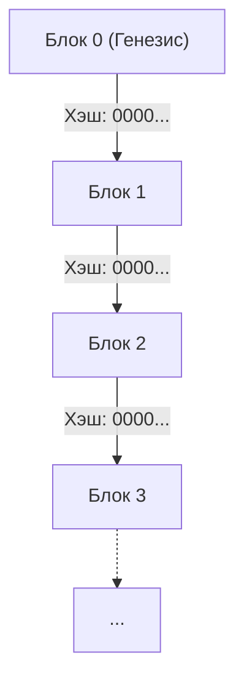
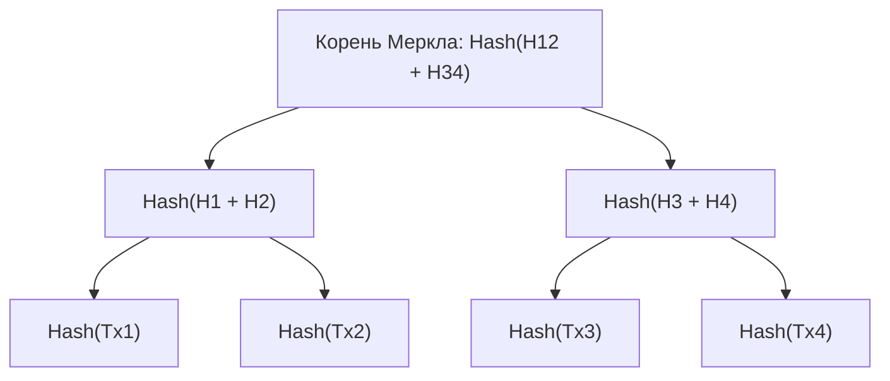
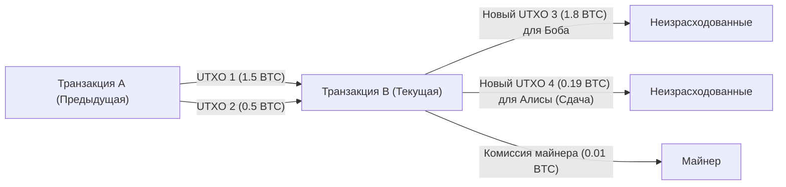

# Криптовалюта и Биткойн: их история, математические основы и будущее

В современном обществе не проходит и дня, чтобы мы не слышали слова «криптовалюта» (Cryptocurrency) или «Биткойн» (Bitcoin). Однако лишь немногие действительно понимают технические и математические механизмы, лежащие в их основе. В этой статье мы с максимальной подробностью расскажем о том, как появились криптовалюты, на какой математической базе они строятся, а также какие проблемы и перспективы их ждут в будущем.

## 1. Введение: Что такое криптовалюта?

Криптовалюта — это вид цифровой валюты, который использует криптографию для обеспечения безопасности транзакций и контроля за выпуском новых единиц. В то время как традиционные фиатные деньги (Fiat Money) выпускаются и управляются единым доверенным органом, например центральным банком, криптовалюты работают в **децентрализованной (Decentralized)** сети без центрального администратора.

### Сравнение фиатных денег и децентрализованных систем

Фиатные деньги — это продукт «доверия». Их ценность гарантируется авторитетом государства. Однако у этой системы есть несколько потенциальных уязвимостей.
- **Риск инфляции**: Центральные банки могут манипулировать объемом денежной массы в зависимости от своей политики, поэтому чрезмерная эмиссия банкнот приводит к обесцениванию.
- **Единая точка отказа (SPOF)**: Если система финансового учреждения выходит из строя, транзакции останавливаются.
- **Вероятность цензуры**: Всегда существует риск заморозки счетов определенных лиц или организаций.

В противовес этому криптовалюты стремились создать систему «без доверия» (Trustless). Это означает, что правильность транзакций гарантируется самой математической и криптографической надежностью системы, без необходимости доверять кому-либо.

## 2. История криптовалют: от шифропанков до Сатоши Накамото

Биткойн появился не как внезапная мутация. За ним стоят десятилетия истории криптографии и идеологического движения инженеров, ценящих конфиденциальность.

### Идеология шифропанков (Cypherpunks)

В 1980-х и 1990-х годах сформировалось сообщество криптографов и активистов, которых называли «шифропанками». Их целью было использование сильной криптографии для защиты частной жизни людей и противостояния государственной слежке и цензуре.

Множество идей, ставших фундаментом Биткойна, родились именно в этом сообществе: «eCash», придуманный Дэвидом Чаумом (David Chaum), «Hashcash» Адама Бэка (Adam Back) и «Bit gold» Ника Сабо (Nick Szabo). Тем не менее, им не удалось решить «проблему двойного расходования» (Double-spending problem) полностью без участия центрального администратора.

### Финансовый кризис 2008 года и рождение Биткойна

В 2008 году начался глобальный финансовый кризис, отправной точкой которого стало банкротство Lehman Brothers. В октябре того же года, когда недоверие к существующей финансовой системе достигло пика, анонимное лицо (или группа), назвавшееся «Сатоши Накамото (Satoshi Nakamoto)», опубликовало статью в криптографическом списке рассылки.

Она называлась «Bitcoin: A Peer-to-Peer Electronic Cash System» (Биткойн: Одноранговая электронная денежная система). В этом 9-страничном документе описывалось, как можно решить проблему двойного расходования, от которой страдали предыдущие попытки создания электронных денег, с помощью полностью децентрализованного механизма **доказательства выполнения работы (Proof of Work: PoW)** .

### Генезис-блок (Genesis Block)

3 января 2009 года сеть Биткойна начала свою работу. Самый первый добытый блок называется «Генезис-блок (Блок 0)». В этом блоке Сатоши Накамото оставил следующее сообщение:

> "The Times 03/Jan/2009 Chancellor on brink of second bailout for banks"
> (Газета The Times 3 января 2009 года Канцлер на грани второго спасения банков)

Это был заголовок британской газеты The Times, который служил одновременно жесткой иронией в адрес мер центральных банков по спасению финансовой системы и отметкой времени (таймстемпом) для системы, которая должна была остаться навсегда.

## 3. Архитектура блокчейна

Ключевой технологией, лежащей в основе Биткойна, является «блокчейн» (Blockchain). Блокчейн — это одна из форм технологии распределенного реестра (Distributed Ledger Technology: DLT), в которой данные объединяются в блоки, криптографически связанные друг с другом наподобие цепи.

### Структура блока

Каждый блок условно состоит из «заголовка блока» (Block Header) и «данных транзакций» (Transaction Data).

Заголовок блока содержит следующую информацию:
1. **Версия (Version)**: Версия программного обеспечения.
2. **Хэш предыдущего блока (Previous Block Hash)**: Хэшированное значение заголовка непосредственно предшествующего блока.
3. **Корень Меркла (Merkle Root)**: Итоговое хэш-значение всех транзакций, включенных в блок.
4. **Временная метка (Timestamp)**: Время создания блока.
5. **Цель сложности (Difficulty Target, Bits)**: Значение, указывающее на сложность доказательства выполнения работы (PoW).
6. **Одноразовый номер (Nonce)**: Произвольное число, которое изменяется во время майнинга, чтобы найти хэш-значение, удовлетворяющее условию.

### Деревья Меркла (Merkle Trees)

Блокчейн использует структуру данных под названием **дерево Меркла (Merkle Tree)** для эффективного обнаружения подделки данных при сохранении небольшого размера блока. Дерево Меркла — это тип двоичного дерева, в котором листовые узлы содержат хэш-значения каждой транзакции, а родительские узлы представляют собой хэшированные объединения хэш-значений своих дочерних узлов.

Даже малейшее изменение данных транзакции изменит хэш ее листового узла, что по цепочке приведет к совершенно иному значению корня Меркла. Это позволяет мгновенно обнаружить даже одно изменение среди огромного объема данных транзакций.

## 4. Математические и криптографические основы

Надежность Биткойна обеспечивается передовой математической базой. В этом разделе мы подробно рассмотрим ее основные компоненты: хэш-функции, криптографию с открытым ключом и криптографию на эллиптических кривых.

### SHA-256 (Secure Hash Algorithm 256-bit)

Наиболее часто используемая в Биткойне криптографическая хэш-функция — это **SHA-256** . Хэш-функция — это односторонняя функция, которая принимает данные произвольной длины и выдает данные фиксированной длины (256 бит в случае SHA-256).

Хэш-функция $H$ должна отвечать следующим свойствам:
1. **Необратимость (Pre-image resistance)**: По заданному хэш-значению $h$ вычислительно трудно найти такой вход $x$, что $H(x) = h$.
2. **Стойкость к коллизиям второго рода (Second pre-image resistance)**: Для заданного входа $x_1$ трудно найти другой вход $x_2$, для которого $H(x_1) = H(x_2)$.
3. **Стойкость к коллизиям первого рода (Collision resistance)**: Трудно найти любые два разных входа $x_1, x_2$, такие что $H(x_1) = H(x_2)$.

В Биткойне алгоритм SHA-256 применяется дважды при вычислении хэша блока или в процессе генерации адреса из открытого ключа (это называется `SHA256(SHA256(x))` или Hash256).

### Криптография с открытым ключом (Public Key Cryptography) и цифровые подписи

Владение криптовалютой доказывается парой ключей: закрытым ключом (Private Key) и открытым ключом (Public Key).
- **Закрытый ключ** $k$: Случайно сгенерированное 256-битное целое число. Никто другой не должен знать его.
- **Открытый ключ** $K$: Ключ, вычисленный из закрытого ключа с помощью односторонней функции. Он публикуется в сети.

Когда Алиса отправляет биткойны Бобу, она использует свой закрытый ключ для создания **цифровой подписи (Digital Signature)** к данным транзакции. Участники сети могут использовать открытый ключ Алисы, чтобы проверить подлинность этой подписи (действительно ли она была создана Алисой с использованием ее закрытого ключа).

### Криптография на эллиптических кривых (Elliptic Curve Cryptography: ECC) и secp256k1

Вместо RSA-криптографии для генерации открытого ключа Биткойна и создания цифровых подписей применяется **криптография на эллиптических кривых (ECC)** . Преимущество ECC в том, что она обеспечивает тот же уровень безопасности при гораздо меньшей длине ключа по сравнению с RSA.

Параметры конкретной эллиптической кривой, используемой в Биткойне, называются **secp256k1** . Эта кривая определена над конечным полем $\mathbb{F}_p$ и описывается следующим уравнением:

$$
y^2 \equiv x^3 + 7 \pmod{p}
$$

Где $p$ — это очень большое простое число:
$$
p = 2^{256} - 2^{32} - 2^{9} - 2^{8} - 2^{7} - 2^{6} - 2^{4} - 1
$$

Закрытый ключ $k$ — это случайное число в диапазоне от $1$ до $n-1$ (где $n$ — порядок кривой). Открытый ключ $K$ получается путем скалярного умножения базовой точки (Generator Point) $G$ на кривой на значение закрытого ключа.

$$
K = k \cdot G
$$

Это вычисление можно эффективно выполнить путем повторного сложения точек (Point Addition) и удвоения точек (Point Doubling) на эллиптической кривой. Однако обратная операция — вычисление закрытого ключа $k$ на основе открытого ключа $K$ и базовой точки $G$ — представляет собой вычислительно чрезвычайно сложную задачу, известную как **проблема дискретного логарифмирования на эллиптической кривой (Elliptic Curve Discrete Logarithm Problem: ECDLP)** . Именно на этом строится безопасность криптовалют.

### ECDSA (Elliptic Curve Digital Signature Algorithm)

Для подписи транзакций используется **ECDSA** . Процесс подписания сообщения (хэша транзакции), обозначенного как $z$, выглядит следующим образом:

1. Выбрать случайное целое число $k_e$ (эфемеральный ключ) от $1$ до $n-1$.
2. Вычислить точку на кривой $(x_1, y_1) = k_e \cdot G$.
3. Вычислить $r = x_1 \pmod{n}$. Если $r = 0$, вернуться к шагу 1.
4. Вычислить $s = k_e^{-1} (z + r \cdot k) \pmod{n}$. Если $s = 0$, вернуться к шагу 1.
5. Подписью является пара $(r, s)$.

В процессе проверки открытый ключ $K$ и подпись $(r, s)$ используются для выполнения следующих вычислений:

1. $u_1 = z \cdot s^{-1} \pmod{n}$
2. $u_2 = r \cdot s^{-1} \pmod{n}$
3. Вычислить точку $(x_2, y_2) = u_1 \cdot G + u_2 \cdot K$.
4. Если $r \equiv x_2 \pmod{n}$, подпись считается действительной.

## 5. Алгоритмы консенсуса и доказательство выполнения работы (PoW)

В децентрализованных сетях алгоритм консенсуса — это механизм, позволяющий всем участникам согласовывать состояние одного и того же реестра.

### Задача византийских генералов (Byzantine Generals Problem)

Классической проблемой распределенных вычислений является «Задача византийских генералов». Несколько генералов осаждают вражеский город, и им необходимо прийти к согласию относительно того, атаковать или отступать, но среди них могут быть предатели, отправляющие ложные сообщения. Вопрос заключается в том, как честные генералы могут достичь правильного консенсуса в таких условиях.

Биткойн практически решил эту проблему, объединив **доказательство выполнения работы (PoW)** с **правилом самой длинной цепи (Longest Chain Rule)** .

### Математика майнинга и одноразовый номер (Nonce)

«Работа» (Work) в PoW означает вычислительное соревнование по поиску хэш-значения, удовлетворяющего определенным условиям. Майнеры непрерывно перебирают значения одноразового номера (Nonce), чтобы хэш-значение заголовка блока оказалось меньше **цели (Target)** , установленной сетью.

$$
\text{SHA256}(\text{SHA256}(\text{Заголовок\_блока})) < \text{Цель}
$$

Поскольку выходные данные хэш-функции выглядят совершенно случайными, не существует эффективного алгоритма для поиска одноразового номера, удовлетворяющего условию. Единственный способ — атака полным перебором (Brute-force): постоянно изменять значение Nonce и повторять вычисление хэша.

Чем меньше значение цели, тем ниже вероятность найти подходящий хэш. Если цель требует, чтобы в начале хэша стояло $k$ нулей, среднее количество вычислений для нахождения такого блока составит $2^k$ раз. Именно эти колоссальные затраты вычислительной энергии делают невозможным изменение прошлых записей в блокчейне.

### Корректировка сложности (Difficulty Adjustment)

Сеть Биткойна спроектирована так, чтобы новый блок генерировался примерно каждые 10 минут. Однако вычислительная мощность всей сети (хэшрейт) постоянно меняется. Поэтому каждые 2016 блоков (около 2 недель) целевое значение автоматически корректируется на основе интервалов создания предыдущих блоков.

$$
\text{Новая\_цель} = \text{Старая\_цель} \times \frac{\text{Фактическое\_время\_последних\_2016\_блоков}}{\text{20160\_минут}}
$$

Если хэшрейт растет, цель становится меньше (сложность повышается); если хэшрейт падает, цель увеличивается (сложность снижается).

## 6. Транзакции и модель UTXO

В отличие от системы банковских счетов (Account-based model), транзакции в Биткойне используют модель **UTXO (Unspent Transaction Output: Неизрасходованный выход транзакции)** .

### Входы и выходы

Физически «монет» Биткойна не существует. Существует только цепочка UTXO, созданных в прошлых транзакциях. Каждая транзакция потребляет существующие UTXO в качестве «входов» (Inputs) и создает новые UTXO в качестве «выходов» (Outputs).

Предположим, Алиса хочет отправить Бобу 1.8 BTC. Алиса указывает два принадлежащих ей UTXO в размере 1.5 BTC и 0.5 BTC (в сумме 2.0 BTC) в качестве входов и создает выход на 1.8 BTC, адресованный Бобу. Из оставшихся 0.2 BTC сумма в 0.19 BTC становится новым выходом, направленным на новый адрес самой Алисы в качестве сдачи (Change), а разница в 0.01 BTC — это комиссия (Fee) майнеру, обработавшему транзакцию.

$$
\sum \text{Входы} = \sum \text{Выходы} + \text{Комиссия\_за\_транзакцию}
$$

Модель UTXO обладает высокой независимостью транзакций, что облегчает параллельную обработку, а также превосходит другие модели с точки зрения конфиденциальности (поскольку для сдачи каждый раз можно использовать новый адрес).

## 7. Будущее и проблемы масштабируемости

Несмотря на высочайшую надежность и безопасность Биткойна, он сталкивается с серьезной проблемой масштабируемости (возможности расширения пропускной способности). В настоящее время сеть Биткойна может обрабатывать всего около 7 транзакций в секунду (7 TPS). Это невероятно медленно по сравнению с десятками тысяч TPS в сети Visa.

### Форки (Forks): софт-форки и хард-форки

При модернизации протокола блокчейна может произойти событие, называемое «форком» (разветвлением).
- **Софт-форк (Soft Fork)**: Обновление с обратной совместимостью. Узлы со старыми правилами считают блоки с новыми правилами действительными (например, внедрение SegWit).
- **Хард-форк (Hard Fork)**: Обновление без обратной совместимости. Блоки по новым правилам отвергаются старыми узлами, что может привести к полному разделению сети на две части (например, рождение Bitcoin Cash).

### Lightning Network

Мощным подходом к решению проблемы масштабируемости является Lightning Network, решение **второго уровня (Layer 2)** .

В Lightning Network участники открывают «платежные каналы» (Payment Channels) вне блокчейна (off-chain). Внутри канала, пока обе стороны согласны, средства могут переводиться мгновенно, почти бесплатно и сколько угодно раз без записи транзакций в блокчейн. В блокчейн (Уровень 1) транзакция записывается только при окончательном расчете остатков.

### Сравнение с Proof of Stake (PoS)

Еще одной серьезной проблемой PoW является колоссальное потребление электроэнергии при майнинге. В качестве решения этой экологической проблемы такие сети, как Ethereum, перешли на другой алгоритм консенсуса — **доказательство доли владения (Proof of Stake: PoS)** .

В PoS право генерировать следующий блок (роль валидатора) распределяется вероятностно в зависимости от количества удерживаемой криптовалюты (доли) и срока удержания, а не вычислительной мощности (хэшрейта). Это снижает энергопотребление более чем на 99%, но вызывает критику за то, что это система, в которой «богатые становятся еще богаче», а также опасения относительно возможной потери истинной децентрализации. Несмотря на любую критику, Биткойн твердо придерживается философии PoW: «гарантия физической безопасности за счет потребления энергии».

## 8. Глубины криптографии: математические доказательства и надежность протокола

За рассмотренными в предыдущих главах алгоритмами SHA-256 и криптографией на эллиптических кривых (ECC) стоят две парадигмы безопасности: теоретико-информационная и вычислительная. Современные криптовалюты, включая Биткойн, в основном полагаются на вычислительную безопасность (Computational Security).

### Вычислительная безопасность и проблема дискретного логарифма

Вычислительная безопасность строится на предположении, что «для взлома шифра потребуется время, превышающее возраст Вселенной, и астрономические вычислительные ресурсы, что делает его практически не поддающимся взлому».

Давайте еще раз рассмотрим проблему дискретного логарифмирования на эллиптической кривой (ECDLP), гарантирующую безопасность открытого ключа Биткойна, с помощью математических формул.
Даны точки $P$ и $Q$ на эллиптической кривой $E(\mathbb{F}_p)$. Задача состоит в поиске неизвестного целого числа $k$, удовлетворяющего условию $Q = kP$.
При использовании классических компьютеров вычислительная сложность лучших алгоритмов для решения этой задачи (таких как метод $\rho$ Полларда) составляет $\mathcal{O}(\sqrt{p})$.
Поскольку в secp256k1 Биткойна $p \approx 2^{256}$, для взлома потребуется около $2^{128}$ операций. Такое количество вычислений займет в триллионы раз больше времени, чем возраст Вселенной (около 13.8 миллиарда лет), даже если объединить все современные компьютеры на Земле.

### Угроза квантовых компьютеров и постквантовая криптография

Тем не менее у вычислительной безопасности есть одна серьезная уязвимость — это развитие **квантовых компьютеров (Quantum Computers)** .
«Алгоритм Шора» ([Shor's Algorithm](https://kenji.blog/ru/p/quantum-computing-shors-algorithm/)), предложенный Питером Шором в 1994 году, математически доказал, что квантовый компьютер способен решить задачу факторизации целых чисел (основу RSA) и проблему дискретного логарифма (основу ECC) за полиномиальное время $\mathcal{O}(n^3)$.

Если будет создан практичный крупномасштабный квантовый компьютер с достаточным количеством кубитов и низким уровнем ошибок, возникнет риск обратного вычисления закрытого ключа из открытого ключа Биткойна.
Меры защиты сети Биткойна от этой угрозы включают следующее:

1. **Защита хэш-функцией**: Биткойн-адрес — это не сам открытый ключ, а результат применения к нему хэш-функций SHA-256 и RIPEMD-160. Даже с помощью квантовых компьютеров обратить хэш-функцию (используя алгоритм Гровера, сложность составит $\mathcal{O}(\sqrt{N})$) по-прежнему будет невероятно сложно. Следовательно, пока вы не совершите транзакцию и не раскроете свой открытый ключ сети, содержимое адреса остается в безопасности даже от квантовых атак.
2. **Переход на постквантовую криптографию (Post-Quantum Cryptography: PQC)**: Обсуждается вариант, при котором до того, как квантовые компьютеры станут практичными, протокол Биткойна пройдет через хард-форк для перехода на новые алгоритмы подписи, устойчивые к квантовому взлому. Среди кандидатов — криптография на решетках (Lattice-based cryptography) или криптография на многочленах от многих переменных (Multivariate polynomial cryptography), которые стандартизируются NIST (Национальным институтом стандартов и технологий США).

## 9. Топология сети и детали протокола P2P

Сеть Биткойна построена не как простая совокупность серверов и клиентов, а как полноценная **одноранговая (Peer-to-Peer: P2P)** сеть.

### Типы узлов и их роли

Компьютеры, участвующие в сети, называются «узлами» (Nodes). Существует несколько типов узлов с разными ролями:

- **Полный узел (Full Node)**: Загружает и проверяет все данные блокчейна (сотни ГБ и более) от генезис-блока до самого последнего блока. Они формируют основу безопасности сети, поскольку независимо проверяют действительность транзакций и предотвращают двойное расходование.
- **Узел SPV (Simplified Payment Verification Node)**: Легкий узел, загружающий только заголовки блоков вместо всего блокчейна. В основном используется в мобильных кошельках. Он может проверить, включена ли его транзакция в блок (проверка пути Меркла), но не обладает возможностями полной проверки полного узла.
- **Узел майнинга (Mining Node)**: Выполняет вычисления PoW для генерации новых блоков. В настоящее время эту роль играют гигантские «майнинговые пулы», объединяющие специализированное оборудование для майнинга, называемое ASIC (Application Specific Integrated Circuit).

### Процесс распространения транзакций (Gossip Protocol)

Когда пользователь (Алиса) создает транзакцию для отправки биткойнов, как эти данные распространяются по всему миру?

1. Кошелек Алисы (узел) отправляет данные транзакции нескольким подключенным пирам (соседним узлам).
2. Каждый узел, получающий транзакцию, проверяет, соответствует ли она правилам (достаточно ли средств, верна ли подпись, правильный ли формат и т.д.).
3. В случае успешной проверки узел сохраняет транзакцию в своем **мемпуле (Mempool)** и передает ее другим соседним узлам (протокол сплетен / Gossip Protocol).
4. Недействительные транзакции отбрасываются и не пересылаются.

Благодаря этому механизму действительная транзакция достигает мемпулов узлов по всему миру за считанные секунды. Майнеры выбирают из этого мемпула транзакции с высокими комиссиями (Fee) и включают их в новые блоки.

## 10. Экономика блокчейна: теория игр и проектирование стимулов

Главное достижение Сатоши Накамото заключается не только в решении криптографических головоломок, но и в создании идеального **дизайна стимулов (Incentive Design)** , при котором эгоистичное поведение людей и организаций в конечном итоге повышает безопасность всей сети.

### Награда за блок и халвинг (Halving)

Причина, по которой майнеры готовы тратить огромные средства на электроэнергию и оборудование для добычи блоков, заключается в экономическом вознаграждении. Когда майнер успешно генерирует новый блок, он получает вновь выпущенные биткойны через специальную транзакцию, называемую **Coinbase Transaction**.

Общее количество выпущенных биткойнов программно ограничено **21 миллионом** монет. Кроме того, каждые 210 000 блоков (примерно 4 года) действует механизм **халвинга (Halving)** , при котором вознаграждение за майнинг одного блока уменьшается вдвое.

- С 2009 года: 50 BTC
- С 2012 года: 25 BTC
- С 2016 года: 12.5 BTC
- С 2020 года: 6.25 BTC
- С 2024 года: 3.125 BTC

Эта дезинфляционная модель предложения валюты имитирует добычу золота и выступает как антитеза проблеме бесконечной эмиссии фиатных валют.

### Теоретико-игровой анализ атаки 51% (51% Attack)

Самой большой угрозой для блокчейна считается **атака 51%**. Если единственный злоумышленник возьмет под контроль более половины (51% или больше) вычислительной мощности (хэшрейта) всей сети, он сможет:

1. Отменить свои прошлые транзакции (двойное расходование).
2. Блокировать подтверждение определенных транзакций (цензура).

Однако с точки зрения теории игр реализация атаки 51% в современной масштабной сети Биткойна крайне иррациональна.
Даже если злоумышленник потратит огромные ресурсы (миллиарды долларов на оборудование и колоссальную электроэнергию), чтобы подчинить себе большую часть сети, в момент успеха атаки доверие к Биткойну рухнет, и его цена обвалится. Полученные злоумышленником биткойны также обесценятся. Таким образом, действует равновесие Нэша: **«Использовать колоссальные вычислительные мощности для честного майнинга и получения наград приносит гораздо больше экономической выгоды, чем атака на систему»** .

## 11. Заключение: Новая форма будущего, открываемая криптовалютами

В этой статье мы детально разобрали математические, технические и экономические механизмы, скрытые за Биткойном и криптовалютами.

На первый взгляд, технология блокчейна может показаться лишь сложным набором математики и кода, но ее истинная сущность — это **«новая система достижения консенсуса для человечества, не зависящая от авторитетов и опирающаяся на доверие к математике и законам физики»** .

Финансовая система, которой мы пользуемся каждый день, на протяжении истории неоднократно рушилась, и каждый раз мы латали ее «заплатками». Решение, предложенное Сатоши Накамото, далеко не идеально. Перед нами стоит множество препятствий, которые необходимо преодолеть: проблема масштабируемости, экологические проблемы, а также государственное регулирование и правовое обеспечение.

Однако концепция «децентрализованной системы без доверия» вырвалась из ящика Пандоры и продолжает эволюционировать без возможности возврата назад. Станет ли Биткойн просто цифровым золотом или благодаря технологиям второго уровня превратится в истинную глобальную платежную сеть — ответ на этот вопрос до сих пор неизвестен. Ясно лишь одно: это будущее будут формировать не избранные власть имущие, а консенсус узлов, разработчиков и пользователей со всего мира.

## Приложение: Ресурсы и литература для углубленного изучения

Для тех, кто после прочтения этой статьи хочет глубже погрузиться в технологию блокчейна и криптографию, мы предлагаем несколько рекомендуемых ресурсов.

### Обязательные к прочтению первоисточники (Whitepapers)
- **Bitcoin: A Peer-to-Peer Electronic Cash System** (Satoshi Nakamoto, 2008)
  - Исторический документ, с которого всё началось. Всего на 9 страницах идеально описана базовая архитектура распределенного реестра, объединяющая PoW, стимулы и деревья Меркла.
- **Ethereum: A Secure Decentralised Generalised Transaction Ledger** (Gavin Wood, 2014)
  - Yellow Paper Эфириума. В отличие от модели UTXO Биткойна, этот документ переопределил блокчейн как машину состояний на основе счетов (Account-based), способную выполнять полные по Тьюрингу смарт-контракты.

### Основы криптографии и математики
Для истинного понимания блокчейна необходимы знания в области информационной безопасности и прикладной математики. Мы рекомендуем изучить следующие направления:
1. **Абстрактная алгебра (Группы, кольца, поля)**: В частности, понимание концепции конечных полей (Полей Галуа) необходимо для изучения криптографии на эллиптических кривых.
2. **Теория вычислительной сложности**: Понятия равенства классов P и NP, полиномиального сводимости важны для понимания того, что означает «безопасность» криптографии.
3. **Теория игр**: Равновесие Нэша и задача византийских генералов предоставляют математическую основу для моделирования механизмов стимулирования участников.

> **Warning: Отказ от ответственности по вопросам инвестиций**
> Данная статья создана с целью объяснения базовых технологий криптовалют, их истории и математической структуры, и не является рекомендацией или призывом к инвестированию в какие-либо криптовалюты. Цены на криптовалюты подвержены чрезвычайно высокой волатильности, и инвестиции сопряжены со значительными рисками, включая возможную потерю капитала.

Технологическое исследование блокчейна — это интеллектуальный фронтир на стыке информатики, экономики и социологии. Читая исходный код, запуская собственный узел и создавая транзакции в тестовой сети, вы сможете на собственном опыте ощутить истинный потенциал и ограничения этой технологии.
