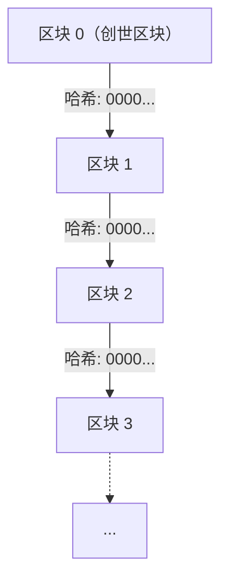
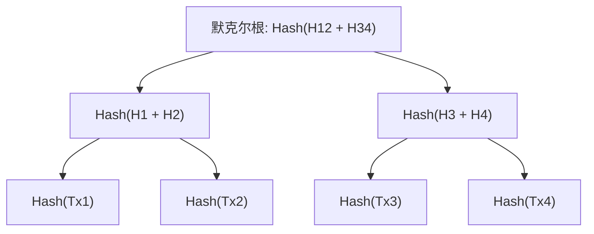
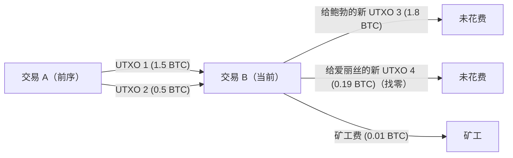

# 加密资产与比特币：其历史、数学基础以及未来

在现代社会中，我们几乎每天都能听到“加密资产（Cryptocurrency）”或“比特币（Bitcoin）”这些词。然而，真正理解其背后技术与数学机制的人却寥寥无几。本文将以极其详尽的篇幅，为您解析加密资产是如何诞生的，建立在怎样的数学基础之上，以及它在面向未来时蕴藏着怎样的挑战与可能性。

## 1. 导论：什么是加密资产？

加密资产是一种利用密码学理论来确保交易安全并控制新单位发行的数字货币。传统的法定货币（Fiat Money）由中央银行这一单一的可信机构发行和管理，而加密资产则运行在没有中央管理者的 **去中心化（Decentralized）** 网络上。

### 法定货币与去中心化系统的对比

法定货币是“信用”的产物。它依赖于政府权威对其价值的背书而成立。然而，这个系统存在一些潜在的弱点。
- **通货膨胀风险** ：中央银行可以根据政策操纵货币供应量，过度印钞会导致货币贬值。
- **单点故障（SPOF）** ：如果金融机构的系统宕机，交易就会停止。
- **审查的可能性** ：始终存在特定个人或组织的账户被冻结的风险。

相比之下，加密资产旨在建立一个“无需信任（Trustless）”的系统。也就是说，即使不信任任何特定的人，也可以通过系统本身的数学与密码学坚固性，来保证交易的合法性。

## 2. 加密资产的历史：从密码朋克到中本聪

比特币并非像突变一样凭空产生。它的背景是长达数十年的密码学历史，以及一群重视隐私的技术人员的思想运动。

### 密码朋克（Cypherpunks）的思想

在 1980 年代到 1990 年代之间，形成了一个被称为“密码朋克”的密码技术人员和活动家社区。他们旨在利用强大的密码技术来保护个人隐私，对抗国家的监视和审查。

大卫·乔姆（David Chaum）发明的“eCash”，亚当·贝克（Adam Back）的“Hashcash”，以及尼克·萨博（Nick Szabo）的“Bit gold”等，许多成为比特币基石的理念都诞生于这个社区。然而，这些系统都未能完全在没有中央管理者的情况下解决“双重支付问题（Double-spending problem）”。

### 2008 年的金融危机与比特币的诞生

2008 年，发生了由雷曼兄弟破产引发的全球性金融危机。就在同年 10 月 31 日，当人们对现有金融系统的不信任感达到顶峰时，一个（或一群）化名为“中本聪（Satoshi Nakamoto）”的匿名人士向密码学邮件列表提交了一篇论文。

这篇论文的标题是《Bitcoin: A Peer-to-Peer Electronic Cash System》（比特币：一种点对点的电子现金系统）。这篇仅有 9 页的论文展示了如何使用 **工作量证明（Proof of Work: [PoW](https://kenji.blog/zh-cn/p/blockchain-technology-smart-contract-distributed-ledger/)）** 机制，以完全去中心化的方式解决以往电子货币尝试中存在的双重支付问题。

### 创世区块（Genesis Block）

2009 年 1 月 3 日，比特币网络开始运行。被挖掘出来的第一个区块被称为“创世区块（区块 0）”。在这个区块中，中本聪刻下了以下信息：

> "The Times 03/Jan/2009 Chancellor on brink of second bailout for banks"
> （泰晤士报 2009 年 1 月 3 日 财政大臣正处于对银行进行第二次紧急救助的边缘）

这是当时英国报纸《The Times》的头条标题，不仅对中央银行的金融救助政策进行了强烈的讽刺，同时也作为比特币作为一个将永远存在的系统的时间戳发挥着作用。

## 3. 区块链的架构

支撑比特币的核心技术是“区块链（[Blockchain](https://kenji.blog/zh-cn/p/blockchain-technology-smart-contract-distributed-ledger/)）”。区块链是分布式账本技术（[Distributed Ledger](https://kenji.blog/zh-cn/p/blockchain-technology-smart-contract-distributed-ledger/) Technology: DLT）的一种形式，数据被打包成称为“区块”的单位，它们像链条一样在密码学上连接在一起。

### 区块的结构

一个区块大致由“区块头（Block Header）”和“交易数据（Transaction Data）”组成。

区块头包含以下信息：
1. **版本（Version）** ：软件的版本
2. **前一区块的哈希（Previous Block Hash）** ：前一个区块头的哈希值
3. **默克尔根（Merkle Root）** ：对区块中包含的所有交易进行摘要的哈希值
4. **时间戳（Timestamp）** ：区块生成的时间
5. **难度目标（Difficulty Target, Bits）** ：表示工作量证明难度的值
6. **随机数（Nonce）** ：在挖矿时为了找到满足条件的哈希值而更改的任意数字

### 默克尔树（Merkle Trees）

在区块链中，为了在控制区块大小的同时高效检测数据篡改，使用了 **默克尔树（Merkle Tree）** 这种数据结构。默克尔树是一种二叉树，叶子节点包含每笔交易的哈希值，父节点则是通过连接子节点的哈希值并再次哈希而生成的。

如果交易数据有哪怕一点点修改，其叶子节点的哈希值就会改变，从而导致默克尔根的值也会发生连锁反应变得完全不同。这样一来，即使在海量的交易数据中，只要有一处篡改也能被立即检测到。

## 4. 数学与密码学基础

比特币的坚固性由高级数学基础支撑。在这里，我们将深入探讨其核心：哈希函数、公钥密码学以及椭圆曲线密码学。

### SHA-256（Secure Hash Algorithm 256-bit）

比特币中最常使用的密码学哈希函数是 **SHA-256** 。哈希函数是一种单向函数，接受任意长度的数据输入，输出固定长度（在 SHA-256 的情况下为 256 位）的数据。

哈希函数 $H$ 必须满足以下性质：
1. **单向性（Pre-image resistance）** ：给定一个哈希值 $h$，在计算上很难找到一个输入 $x$，使得 $H(x) = h$。
2. **弱抗碰撞性（Second pre-image resistance）** ：给定一个输入 $x_1$，很难找到另一个输入 $x_2$，使得 $H(x_1) = H(x_2)$。
3. **强抗碰撞性（Collision resistance）** ：很难找到任意两个不同的输入 $x_1, x_2$，使得 $H(x_1) = H(x_2)$。

在比特币中，SHA-256 在计算区块哈希以及从公钥生成地址的过程中被应用两次（这被称为 `SHA256(SHA256(x))` 或 Hash256）。

### 公钥密码学（[Public Key](https://kenji.blog/zh-cn/p/modern-cryptography-public-key-hash-signature/) [Cryptography](https://kenji.blog/zh-cn/p/modern-cryptography-public-key-hash-signature/)）与数字签名

加密资产的所有权由私钥（Private Key）和公钥（Public Key）对来证明。
- **私钥** $k$：随机生成的 256 位整数。绝对不能让别人知道。
- **公钥** $K$：使用单向函数从私钥计算得出的密钥。在网络上公开。

当爱丽丝向鲍勃发送比特币时，爱丽丝使用她自己的私钥对交易数据创建 **数字签名（[Digital Signature](https://kenji.blog/zh-cn/p/modern-cryptography-public-key-hash-signature/)）** 。网络参与者可以使用爱丽丝的公钥来验证该签名的合法性（是否真的是爱丽丝用私钥创建的）。

### 椭圆曲线密码学（Elliptic Curve Cryptography: ECC）与 secp256k1

比特币在公钥生成和数字签名中采用了 **椭圆曲线密码学（ECC）** ，而不是 [RSA](https://kenji.blog/zh-cn/p/modern-cryptography-public-key-hash-signature/) 密码。ECC 的优势在于它能以比 RSA 短得多的密钥长度提供同等水平的安全性。

比特币中使用的特定椭圆曲线参数被称为 **secp256k1** 。这条曲线定义在有限域 $\mathbb{F}_p$ 上，由以下方程表示：

$$
y^2 \equiv x^3 + 7 \pmod{p}
$$

其中，$p$ 是一个极大的素数：
$$
p = 2^{256} - 2^{32} - 2^{9} - 2^{8} - 2^{7} - 2^{6} - 2^{4} - 1
$$

私钥 $k$ 是范围在 $1$ 到 $n-1$ 之间的随机数（$n$ 是曲线的阶）。公钥 $K$ 是通过将曲线上的一个基准点（Generator Point）$G$ 乘以私钥进行标量乘法而获得的：

$$
K = k \cdot G
$$

这种计算可以通过反复进行椭圆曲线上点的加法（Point Addition）和倍增（Point Doubling）来高效完成。但是，反过来从公钥 $K$ 和基准点 $G$ 推导出私钥 $k$，被称为 **椭圆曲线离散对数问题（Elliptic Curve Discrete Logarithm Problem: ECDLP）** ，这是一个在计算上极其困难的问题，这也是加密资产安全性的基石。

### ECDSA（Elliptic Curve Digital Signature Algorithm）

交易签名使用的是 **ECDSA** 。当消息（交易的哈希值）为 $z$ 时，签名过程如下：

1. 选择一个在 $1$ 到 $n-1$ 之间的随机整数 $k_e$（临时密钥）。
2. 计算曲线上的点 $(x_1, y_1) = k_e \cdot G$。
3. 计算 $r = x_1 \pmod{n}$。如果 $r = 0$，则返回步骤 1。
4. 计算 $s = k_e^{-1} (z + r \cdot k) \pmod{n}$。如果 $s = 0$，则返回步骤 1。
5. 签名即为 $(r, s)$ 对。

在验证过程中，使用公钥 $K$ 和签名 $(r, s)$ 进行以下计算：

1. $u_1 = z \cdot s^{-1} \pmod{n}$
2. $u_2 = r \cdot s^{-1} \pmod{n}$
3. 计算点 $(x_2, y_2) = u_1 \cdot G + u_2 \cdot K$。
4. 如果 $r \equiv x_2 \pmod{n}$，则认为签名是有效的。

## 5. 共识算法与工作量证明（[PoW](https://kenji.blog/zh-cn/p/blockchain-technology-smart-contract-distributed-ledger/)）

在去中心化网络中，让所有人都对相同的账本状态达成一致的机制就是共识算法。

### 拜占庭将军问题（[Byzantine Generals](https://kenji.blog/zh-cn/p/byzantine-generals-problem-consensus/) Problem）

分布式计算中的一个经典问题是“拜占庭将军问题”。多位将军包围了一座敌方城市，他们必须在进攻或撤退上达成一致意见，但将军中可能有叛徒发送虚假信息。在这个问题中，我们要探讨在这样的情况下，忠诚的将军们如何达成正确的共识。

比特币通过将 **工作量证明（[PoW](https://kenji.blog/zh-cn/p/blockchain-technology-smart-contract-distributed-ledger/)）** 与 **最长链规则（Longest Chain Rule）** 相结合，实质上解决了这个问题。

### 挖矿的数学机制与随机数（Nonce）

PoW 中的“工作量（Work）”是指为了寻找满足特定条件的哈希值而进行的计算竞赛。矿工（采矿者）会不断寻找随机数（Nonce）的值，使得区块头的哈希值小于网络规定的 **目标值（Target）** 。

$$
\text{SHA256}(\text{SHA256}(\text{区块\_头})) < \text{目标值}
$$

因为哈希函数的输出看起来完全是随机的，所以不存在高效的算法来寻找满足条件的随机数。唯一的方法就是进行暴力破解攻击（Brute-force），即不断改变随机数的值并重复进行哈希计算。

目标值越小，找到满足条件的哈希值的概率就越低。如果目标值要求开头有 $k$ 个零，那么找到那个区块所需的平均计算次数为 $2^k$ 次。正是这种巨大的计算能量投入，使得篡改区块链历史记录成为不可能。

### 难度调整（Difficulty Adjustment）

比特币网络被设计为大约每 10 分钟生成一个区块。但是，整个网络的计算能力（哈希率）是不断波动的。因此，每 2016 个区块（大约 2 周），网络会根据过去生成区块的时间间隔自动调整目标值。

$$
\text{新\_目标值} = \text{旧\_目标值} \times \frac{\text{过去\_2016\_个区块的\_实际\_时间}}{\text{20160\_分钟}}
$$

如果哈希率上升，目标值就会变小（难度增加）；如果哈希率下降，目标值就会变大（难度降低）。

## 6. 交易与 UTXO 模型

比特币的交易并未采用类似银行账户余额的机制（基于账户的模型），而是采用了 **UTXO（Unspent Transaction Output：未花费的交易输出）** 模型。

### 输入与输出

比特币中不存在名为“硬币”的实体。存在的只是由过去交易产生的 UTXO 链。每笔交易都会消耗现有的 UTXO 作为“输入（Input）”，并生成新的 UTXO 作为“输出（Output）”。

假设爱丽丝想给鲍勃发送 1.8 BTC。爱丽丝指定她所拥有的两个 UTXO（1.5 BTC 和 0.5 BTC，共计 2.0 BTC）作为输入，并创建一个接收方为鲍勃的 1.8 BTC 输出。在剩下的 0.2 BTC 中，0.19 BTC 作为找零（Change）发送给爱丽丝自己的新地址的输出，而 0.01 BTC 的差额则作为处理该笔交易的矿工的手续费（Fee）。

$$
\sum \text{输入} = \sum \text{输出} + \text{交易\_费}
$$

这种 UTXO 模型由于交易的独立性高，因此易于并行处理，并且在隐私方面（每次都可以使用新的找零地址）也具有优势。

## 7. 未来与可扩展性问题

比特币是一个极其坚固和安全的系统，但作为代价，它在可扩展性（处理能力的扩展性）方面存在巨大的问题。目前的比特币网络每秒只能处理约 7 笔交易（7 TPS）。与 Visa 网络的数万 TPS 相比，这极其缓慢。

### 分叉（Forks）：软分叉与硬分叉

当升级区块链协议时，有时会发生被称为“分叉（Fork）”的事件。
- **软分叉（Soft Fork）** ：向后兼容的升级。即使是运行旧规则的节点也会认为新规则的区块是有效的（例如：SegWit 的引入）。
- **硬分叉（Hard Fork）** ：不向后兼容的升级。由于新规则的区块会被旧节点拒绝，网络有完全分裂成两部分的可能（例如：Bitcoin Cash 的诞生）。

### 闪电网络（Lightning Network）

解决可扩展性问题的一个有力的方案是 **第二层（Layer 2）** 解决方案——闪电网络。

在闪电网络中，参与者之间在区块链之外（链下）建立“支付通道（Payment Channel）”。在通道内，只要双方同意，就可以瞬间且几乎免费地进行无数次资金转移，而无需将交易记录在区块链上。只有在最终结算余额时，才会将交易记录到区块链（第一层）上。

### 与权益证明（[PoS](https://kenji.blog/zh-cn/p/blockchain-technology-smart-contract-distributed-ledger/)）的比较

[PoW](https://kenji.blog/zh-cn/p/blockchain-technology-smart-contract-distributed-ledger/) 的另一个巨大挑战是挖矿带来的庞大电力消耗。为了应对这一环境问题，以太坊等项目已经转向了名为 **权益证明（Proof of Stake: PoS）** 的另一种共识算法。

在 PoS 中，决定下一个区块生成权利（验证者）的并非计算能力（哈希率），而是根据所持有的加密资产数量（权益）及其持有时长来概率性地分配。虽然这使电力消耗减少了 99% 以上，但也有批评认为它是一个“富人愈富的系统”，或者“可能会损害完全的去中心化”。无论受到怎样的批评，比特币始终坚持 PoW 的哲学，即“通过消耗能源来提供物理安全性”。

## 8. 密码理论的深渊：数学证明与协议的坚固性

在前面章节中解释的 SHA-256 和椭圆曲线密码学（ECC）背后，存在着信息论安全性与计算复杂度安全性这两种范式。包括比特币在内的现代加密资产，主要依赖于计算复杂度安全性（Computational Security）。

### 计算复杂度安全性与离散对数问题

计算复杂度安全性是基于这样一个前提的安全性：“为了破解某种密码，需要比宇宙寿命更长的时间和天文数字般的计算资源，因此它在现实中是无法破解的。”

让我们用数学公式重温一下确保比特币公钥密码学安全性的椭圆曲线离散对数问题（ECDLP）。
已知点 $P$ 和 $Q$ 在椭圆曲线 $E(\mathbb{F}_p)$ 上，且满足 $Q = kP$，问题是求未知的整数 $k$。
如果使用经典计算机，解决这个问题的最佳算法（如 Pollard 的 $\rho$ 算法）的时间复杂度为 $\mathcal{O}(\sqrt{p})$。
在比特币的 secp256k1 中，由于 $p \approx 2^{256}$，破解大约需要进行 $2^{128}$ 次运算。即使动员目前地球上的所有计算机，所需的计算时间也将是宇宙寿命（约 138 亿年）的数万亿倍。

### 量子计算机的威胁与抗量子密码学

然而，计算复杂度安全性有一个重大隐患，那就是 **量子计算机（Quantum Computer）** 的崛起。
1994 年，彼得·秀尔（Peter Shor）发表了“秀尔算法（[Shor's Algorithm](https://kenji.blog/zh-cn/p/quantum-computing-shors-algorithm/)）”，在数学上证明了如果使用量子计算机，可以在多项式时间 $\mathcal{O}(n^3)$ 内解决质因数分解问题（[RSA](https://kenji.blog/zh-cn/p/modern-cryptography-public-key-hash-signature/) 密码的基础）和离散对数问题（ECC 的基础）。

如果研制出具有足够量子比特（Qubits）和低错误率的实用大规模量子计算机，比特币的私钥就有从公钥被逆向推导出的风险。
针对此，比特币网络的防御策略如下：

1. **哈希函数的保护** ：比特币地址并非公钥本身，而是对公钥应用了 SHA-256 和 RIPEMD-160 哈希函数后生成的值。即使使用量子计算机，逆向推导哈希函数（即使使用格罗弗算法，计算复杂度也是 $\mathcal{O}(\sqrt{N})$）仍然很困难。因此，在进行交易并向网络暴露公钥之前，地址的内容对抗量子计算机可以说是安全的。
2. **向抗量子密码学（Post-Quantum [Cryptography](https://kenji.blog/zh-cn/p/modern-cryptography-public-key-hash-signature/): PQC）过渡** ：目前正在讨论，在量子计算机投入实用之前，通过硬分叉比特币协议，将其过渡到即使是量子计算机也难以破解的新签名算法，例如 NIST（美国国家标准与技术研究院）正在评选的基于格的密码学（Lattice-based cryptography）或多变量多项式密码学（Multivariate polynomial cryptography）。

## 9. 网络拓扑与 [P2P](https://kenji.blog/zh-cn/p/webrtc-realtime-communication-p2p/) 协议详解

比特币网络不仅是服务器与客户端的集合，它被构建为一个完全的 **点对点（Peer-to-Peer: P2P）** 网络。

### 节点的类型与作用

参与网络的计算机被称为“节点（Node）”。节点分为几种类型，各自的作用不同。

- **全节点（Full Node）** ：从创世区块到最新区块，下载并验证所有区块链数据（数百 GB 以上）的节点。因为它们独立检查交易的有效性和是否存在双重支付，全节点承担着网络安全的基础。
- **SPV 节点（Simplified Payment Verification Node）** ：不下载整个区块链，而只下载区块头的轻量级节点。主要用于智能手机上的钱包等。虽然它可以确认自己的交易是否包含在区块中（验证默克尔路径），但没有全节点那样的验证能力。
- **挖矿节点（Mining Node）** ：进行 [PoW](https://kenji.blog/zh-cn/p/blockchain-technology-smart-contract-distributed-ledger/) 计算并生成新区块的节点。目前，将被称为 ASIC（专用集成电路）的挖矿专用硬件组合起来的巨大“矿池”承担着这一角色。

### 交易传播过程（Gossip Protocol）

当某个用户（爱丽丝）创建了一笔发送比特币的交易时，该数据是如何在全世界传播的呢？

1. 爱丽丝的钱包（节点）向连接的几个对等节点（相邻节点）发送交易数据。
2. 收到交易的每个对等节点会验证该交易是否遵循了正确的规则（是否有足够的余额、签名是否正确、格式是否正确等）。
3. 如果验证成功，节点会将该交易保存在自身的 **内存池（Mempool）** 中，然后将其转发给其他相邻节点（Gossip Protocol / 八卦协议）。
4. 如果是无效交易，则会被丢弃并不予转发。

通过这种方式，有效的交易在几秒钟内就会遍布全球节点的 Mempool。矿工会优先从这个 Mempool 中选择手续费（Fee）较高的交易，并将它们打包进新的区块。

## 10. 区块链经济学：博弈论与激励设计

中本聪最大的功绩不仅在于解开了密码学的难题，更在于构建了一个完美的 **激励设计（Incentive Design）** ：“人类和组织的自利行为，最终能够提升整个网络的安全性”。

### 区块奖励与减半（Halving）

矿工们之所以愿意耗费巨大的电力和硬件投资来挖掘区块，是因为存在经济上的回报。当矿工成功生成一个新区块时，他们会通过一种被称为 **创币交易（Coinbase Transaction）** 的特殊交易，接收到新发行的比特币。

比特币的总发行量通过程序被设定了上限，即 **2,100 万枚** 。此外，还内置了 **减半（Halving）** 机制，即每生成 210,000 个区块（大约 4 年），每个区块的挖矿奖励就会减半。

- 2009 年～：50 BTC
- 2012 年～：25 BTC
- 2016 年～：12.5 BTC
- 2020 年～：6.25 BTC
- 2024 年～：3.125 BTC

这种通货紧缩性的货币供应模型模仿了黄金的开采，是对法定货币“因无限印钞而导致通货膨胀”这一现象的反例。

### 51% 攻击（51% Attack）的博弈论分析

区块链的最大威胁是 **51% 攻击** 。如果某个恶意的单一实体控制了整个网络超过半数（51% 以上）的计算能力（哈希率），那么它将能够做到以下几点：

1. 撤销自己过去的交易（双重支付）
2. 拒绝批准特定交易（审查）

然而，从博弈论的角度来看，在目前庞大的比特币网络中发动 51% 攻击是非常不理智的。
即使花费巨额成本（数千亿日元规模的硬件和巨大的电力消耗）控制了网络的大半部分，一旦攻击成功，比特币的信誉就会彻底丧失，价格也会暴跌。攻击者获得的比特币也将变得一文不值。因此，形成了一个纳什均衡： **“与攻击系统相比，将巨大的计算能力用于挖矿（遵循正当规则）以获取奖励，在经济利益上要大得多”** 。

## 11. 总结：加密资产所开拓的未来新形态

在本文中，我们彻底剖析了比特币和加密资产背后的数学、技术和经济学机制。

乍看之下，区块链技术似乎是复杂数学和代码的集合体，但其本质不过是 **“一种不依赖权威，以数学和物理法则为信任基础的人类新共识系统”** 。

我们每天理所当然地使用的金融系统，在漫长的历史中曾多次崩溃，每次崩溃都伴随着修修补补的修复。中本聪提出的解决方案绝不是完美的。可扩展性问题、环境问题、国家监管与立法等，仍有无数的障碍需要跨越。

然而，一旦“无需信任的去中心化系统”这一概念从潘多拉的盒子中被释放出来，它就在不断地向前演进。比特币是会仅仅作为一种数字黄金确立地位，还是会通过第二层技术的发展升华为真正的全球支付网络？结局仍然无人知晓。唯一可以确定的是，塑造其未来的将不是少数掌权者，而是参与网络的全球所有节点、开发者和用户的集体意志。

## 附录：进一步学习的资源与参考文献

对于那些在阅读本文后希望进一步深入学习区块链技术和密码学理论的人，我们推荐以下资源。

### 必读的原始论文（Whitepapers）
- **Bitcoin: A Peer-to-Peer Electronic Cash System** (Satoshi Nakamoto, 2008)
  - 具有里程碑意义的论文，一切的开始。在短短 9 页纸中，完美地描述了结合 PoW、激励机制和默克尔树的分布式账本的基本设计。
- **Ethereum: A Secure Decentralised Generalised Transaction Ledger** (Gavin Wood, 2014)
  - 以太坊黄皮书。相对于比特币的 UTXO 模型，将区块链重新定义为能够执行图灵完备智能合约的基于账户的状态机。

### 密码学与数学基础
为了真正理解区块链，信息安全和应用数学的知识是不可或缺的。建议学习以下领域：
1. **抽象代数（群、环、域）** ：特别是有限域（Galois Field）的概念，对于理解椭圆曲线密码学是绕不开的。
2. **计算复杂度理论** ：诸如 P 对 NP 问题、多项式时间规约等概念，对于理解密码学的“安全性”到底意味着什么非常重要。
3. **博弈论** ：纳什均衡和拜占庭将军问题等，为以数学方式模拟参与者的激励设计提供了框架。

> **Warning: 投资免责声明**
> 本文的目的是为了讲解加密资产的底层技术及其历史和数学结构，不构成任何对加密资产的投资建议或招揽。加密资产的价格波动极大，投资存在包括损失本金在内的重大风险。

探索区块链技术是一次跨越计算机科学、经济学和社会学边界的知识探险。通过阅读代码、自己建立节点、或者在测试网上进行交易，你将能切身感受到这项技术的真正潜力和局限性。
