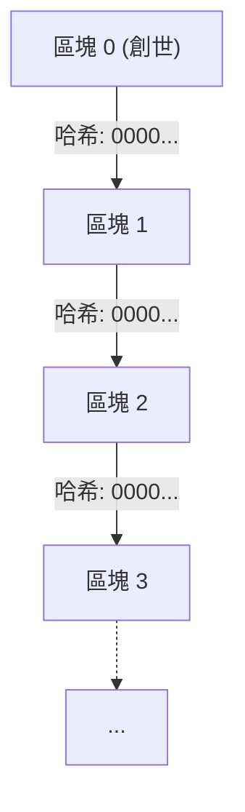
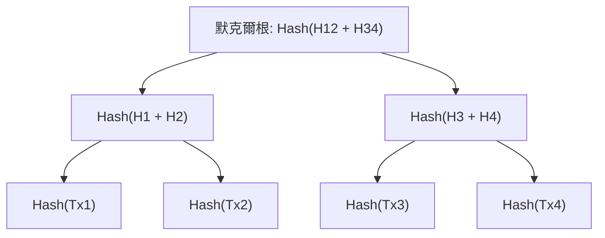
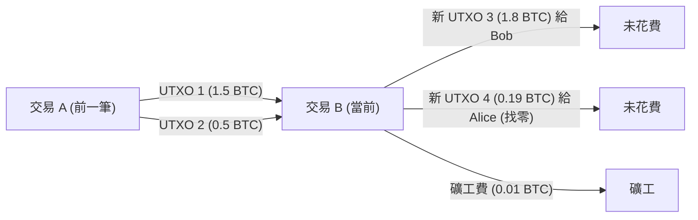

# 加密貨幣與比特幣：其歷史、數學基礎與未來

在現代社會中，幾乎沒有一天不會聽到「加密貨幣（Cryptocurrency）」或「比特幣（Bitcoin）」這兩個詞。然而，真正理解其背後技術與數學機制的人卻寥寥無幾。本文將以壓倒性的詳細程度，解說加密貨幣是如何誕生的、建立在什麼樣的數學基礎之上，以及未來還隱藏著哪些挑戰與可能性。

## 1. 序論：加密貨幣是什麼？

加密貨幣是一種利用密碼學理論來確保交易安全性並控制新單位發行的數位貨幣。相較於傳統的法定貨幣（Fiat Money）是由中央銀行這個單一且可信的機構來發行與管理，加密貨幣則是在沒有中央管理者的 **去中心化（Decentralized）** 網路上運作。

### 法定貨幣與去中心化系統的對比

法定貨幣是「信用」的產物。它建立在政府這個權威保證其價值的基礎上。然而，這個系統存在一些潛在的弱點：
- **通貨膨脹風險**： 中央銀行可以根據政策操作貨幣供給量，因此過度印製鈔票會導致價值稀釋。
- **單點故障（SPOF）**： 如果金融機構的系統當機，交易就會停止。
- **審查的可能性**： 始終存在特定個人或組織的帳戶被凍結的風險。

相較之下，加密貨幣旨在建立一個「無須信任（Trustless）」的系統。也就是說，即使不信任特定的任何人，也能透過系統本身的數學與密碼學穩健性來保證交易的合法性。

## 2. 加密貨幣的歷史：從密碼龐克到中本聰

比特幣並不是像突變一樣憑空出現的。在其背景中，有著數十年的密碼學歷史，以及重視隱私的技術人員們的思想運動。

### 密碼龐克（Cypherpunks）的思想

在 1980 年代到 1990 年代期間，形成了一個被稱為「密碼龐克」的密碼技術人員與活動家社群。他們致力於利用強大的密碼技術來保護個人隱私，並對抗國家的監控與審查。

由 David Chaum 構思的「eCash」、Adam Back 的「Hashcash」，以及 Nick Szabo 的「Bit gold」等，許多成為比特幣基石的想法都誕生於這個社群。然而，這些發明都未能完全在沒有中央管理者的情況下解決「雙重支付問題（Double-spending problem）」。

### 2008 年的金融危機與比特幣的誕生

2008 年，發生了由雷曼兄弟破產引發的全球金融危機。在對現有金融系統的不信任感達到頂點的同年 10 月 31 日，一位化名為「中本聰（Satoshi Nakamoto）」的匿名人士（或團體）在密碼學郵件列表中發布了一篇論文。

標題為《Bitcoin: A Peer-to-Peer Electronic Cash System》（比特幣：一種對等式的電子現金系統）。這篇 9 頁的論文展示了如何利用 **工作量證明（Proof of Work: PoW）** 機制，以完全去中心化的方式解決過去電子貨幣嘗試中所面臨的雙重支付問題。

### 創世區塊（Genesis Block）

2009 年 1 月 3 日，比特幣網路開始運作。第一個被挖掘出來的區塊被稱為「創世區塊（區塊 0）」。在這個區塊中，中本聰刻下了以下訊息：

> "The Times 03/Jan/2009 Chancellor on brink of second bailout for banks"
> （泰晤士報 2009年1月3日 財政大臣處於第二次救助銀行的邊緣）

這是當時英國報紙《泰晤士報》的標題，這不僅是對中央銀行金融救助政策的強烈諷刺，也作為比特幣這個將永遠存在的系統的時間戳記發揮了作用。

## 3. 區塊鏈的架構

支撐比特幣的核心技術是「區塊鏈（Blockchain）」。區塊鏈是分散式帳本技術（Distributed Ledger Technology: DLT）的一種形式，數據被打包成稱為「區塊」的單位，並且它們以密碼學的方式像鏈條一樣連接在一起。

### 區塊的結構

一個區塊主要由「區塊標頭（Block Header）」與「交易數據（Transaction Data）」兩部分組成。

區塊標頭包含以下資訊：
1. **版本（Version）**： 軟體版本
2. **前一個區塊的哈希（Previous Block Hash）**： 前一個區塊標頭的哈希值
3. **默克爾根（Merkle Root）**： 摘要區塊內所有交易的哈希值
4. **時間戳（Timestamp）**： 區塊生成的時間
5. **難度目標（Difficulty Target, Bits）**： 表示工作量證明難度的值
6. **隨機數（Nonce）**： 在挖礦時為了找到滿足條件的哈希值而更改的任意數值

### 默克爾樹（Merkle Trees）

在區塊鏈中，為了在控制區塊大小的同時有效檢測數據篡改，使用了名為 **默克爾樹（Merkle Tree）** 的數據結構。默克爾樹是一種二元樹，葉節點包含每筆交易的哈希值，而父節點則是將子節點的哈希值連接並再次進行哈希計算而得。

如果交易數據有任何微小的改變，該葉節點的哈希值就會改變，進而產生連鎖反應，導致默克爾根的值也完全不同。這使得我們能夠從龐大的交易數據中，只要有任何一處篡改就能立即檢測出來。

## 4. 數學與密碼學基礎

比特幣的穩健性是由高度的數學基礎所支撐的。在這裡，我們將深入探討構成其核心的哈希函數、公開金鑰密碼學以及橢圓曲線密碼學。

### SHA-256（Secure Hash Algorithm 256-bit）

在比特幣中最常被使用的密碼學哈希函數是 **SHA-256**。哈希函數是一種單向函數，它接受任意長度的數據作為輸入，並輸出固定長度（在 SHA-256 的情況下為 256 位元）的數據。

哈希函數 $H$ 必須滿足以下性質：
1. **單向性（Pre-image resistance）**： 給定哈希值 $h$，在計算上很難找到一個輸入 $x$ 使得 $H(x) = h$。
2. **弱抗碰撞性（Second pre-image resistance）**： 給定輸入 $x_1$，很難找到另一個輸入 $x_2$ 使得 $H(x_1) = H(x_2)$。
3. **強抗碰撞性（Collision resistance）**： 很難找到任意兩個輸入 $x_1$ 和 $x_2$ 使得 $H(x_1) = H(x_2)$。

在比特幣中，計算區塊哈希以及從公開金鑰生成地址的過程中，會將 SHA-256 應用兩次（這被稱為 `SHA256(SHA256(x))`，或者 Hash256）。

### 公開金鑰密碼學（Public Key Cryptography）與數位簽章

加密貨幣的所有權是透過私有金鑰（Private Key）與公開金鑰（Public Key）的配對來證明的。
- **私有金鑰** $k$： 隨機生成的 256 位元整數。絕對不能讓其他人知道。
- **公開金鑰** $K$： 從私有金鑰使用單向函數計算出來的金鑰。會在網路上公開。

當愛麗絲要發送比特幣給鮑伯時，愛麗絲會使用她自己的私有金鑰為交易數據建立 **數位簽章（Digital Signature）**。網路參與者可以使用愛麗絲的公開金鑰來驗證該簽章是否合法（是否真的是愛麗絲使用私有金鑰建立的）。

### 橢圓曲線密碼學（Elliptic Curve Cryptography: ECC）與 secp256k1

在比特幣的公開金鑰生成與數位簽章中，採用的不是 RSA 加密，而是 **橢圓曲線密碼學（ECC）**。ECC 的優勢在於能以比 RSA 短得多的金鑰長度提供同等的安全級別。

比特幣中使用的特定橢圓曲線參數被稱為 **secp256k1**。此曲線定義在有限體 $\mathbb{F}_p$ 上，並以下列方程式表示：

$$
y^2 \equiv x^3 + 7 \pmod{p}
$$

這裡，$p$ 是一個非常大的質數：
$$
p = 2^{256} - 2^{32} - 2^{9} - 2^{8} - 2^{7} - 2^{6} - 2^{4} - 1
$$

私有金鑰 $k$ 是範圍在 $1$ 到 $n-1$ 之間的亂數（$n$ 是曲線的階數）。公開金鑰 $K$ 是透過將曲線上的一個基準點（Generator Point） $G$ 進行與私有金鑰次數相同的純量乘法而得。

$$
K = k \cdot G
$$

這項計算可以透過重複進行橢圓曲線上的點加法（Point Addition）與點二倍角（Point Doubling）來有效率地完成。然而，反過來從公開金鑰 $K$ 與基準點 $G$ 反推私有金鑰 $k$，則是一個被稱為 **橢圓曲線離散對數問題（Elliptic Curve Discrete Logarithm Problem: ECDLP）** 在計算上極度困難的問題，而這正是構成加密貨幣安全性的根基。

### ECDSA（Elliptic Curve Digital Signature Algorithm）

交易的簽章使用了 **ECDSA**。假設訊息（交易的哈希值）為 $z$，簽署流程如下：

1. 選擇一個從 $1$ 到 $n-1$ 之間的隨機整數 $k_e$（臨時金鑰）。
2. 計算曲線上的點 $(x_1, y_1) = k_e \cdot G$。
3. 計算 $r = x_1 \pmod{n}$。如果 $r = 0$，則回到步驟 1。
4. 計算 $s = k_e^{-1} (z + r \cdot k) \pmod{n}$。如果 $s = 0$，則回到步驟 1。
5. 簽章即為 $(r, s)$ 的配對。

在驗證流程中，會使用公開金鑰 $K$ 與簽章 $(r, s)$ 進行以下計算：

1. $u_1 = z \cdot s^{-1} \pmod{n}$
2. $u_2 = r \cdot s^{-1} \pmod{n}$
3. 計算點 $(x_2, y_2) = u_1 \cdot G + u_2 \cdot K$。
4. 如果 $r \equiv x_2 \pmod{n}$，則簽章被視為合法的。

## 5. 共識演算法與工作量證明（PoW）

在去中心化網路中，讓所有人對相同帳本狀態達成一致的機制就是共識演算法。

### 拜占庭將軍問題（Byzantine Generals Problem）

分散式計算中一個經典的問題是「拜占庭將軍問題」。多位將軍包圍了一座敵方城市，他們必須在攻擊或撤退上達成一致意見，但將軍中可能會有叛徒發送假訊息。在這種情況下，問題在於如何僅讓誠實的將軍們達成正確的共識。

比特幣透過結合 **工作量證明（PoW）** 與 **最長鏈規則（Longest Chain Rule）**，實質上解決了這個問題。

### 挖礦的數學原理與隨機數（Nonce）

在 PoW 中的「工作（Work）」指的是為尋找滿足特定條件的哈希值而進行的計算競爭。礦工（採礦者）會不斷尋找隨機數（Nonce）的值，使得區塊標頭的哈希值小於網路由此所定的 **目標值（Target）**。

$$
\text{SHA256}(\text{SHA256}(\text{區塊\_標頭})) < \text{目標值}
$$

由於哈希函數的輸出看起來完全是隨機的，因此不存在能有效找到滿足條件隨機數的演算法。唯一的方法就是只能不斷更改隨機數的值並重複進行哈希計算的暴力破解（Brute-force）。

目標值越小，找到滿足條件哈希值的機率就越低。如果目標值是要求開頭有 $k$ 個零的數值，那麼找到該區塊所需的平均計算次數將是 $2^k$ 次。正是這種龐大計算能量的投入，使得篡改區塊鏈過去的記錄變得不可能。

### 難度調整（Difficulty Adjustment）

比特幣網路被設計成大約每 10 分鐘生成一個區塊。然而，整個網路的計算能力（算力）會不斷變動。因此，每隔 2016 個區塊（約 2 週），系統會根據過去的區塊生成間隔自動調整目標值。

$$
\text{新\_目標值} = \text{舊\_目標值} \times \frac{\text{過去\_2016\_個區塊的實際\_時間}}{\text{20160\_分鐘}}
$$

如果算力上升，目標值就會變小（難度上升），如果算力下降，目標值就會變大（難度下降）。

## 6. 交易與 UTXO 模型

比特幣的交易並不是像銀行帳戶餘額（基於帳戶的模型）那樣的機制，而是採用了 **UTXO（Unspent Transaction Output：未花費交易輸出）** 模型。

### 輸入與輸出

比特幣中並不存在實體的「硬幣」。存在的只有過去交易中創建的 UTXO 鏈條。每筆交易都會消耗現有的 UTXO 作為「輸入」，並生成新的 UTXO 作為「輸出」。

假設愛麗絲想發送 1.8 BTC 給鮑伯。愛麗絲會將自己持有的 1.5 BTC 與 0.5 BTC 兩個 UTXO（合計 2.0 BTC）指定為輸入，並為鮑伯創建 1.8 BTC 的輸出。在剩餘的 0.2 BTC 中，0.19 BTC 將作為找零（Change）發送到愛麗絲自己的新地址作為輸出，而差額的 0.01 BTC 則成為處理該交易礦工的手續費（Fee）。

$$
\sum \text{輸入} = \sum \text{輸出} + \text{交易\_手續費}
$$

這種 UTXO 模型由於交易的獨立性很高，因此容易進行平行處理，且在隱私觀點（每次都能使用新的找零地址）上也具有優勢。

## 7. 未來與可擴展性問題

比特幣是一個極度穩健且安全的系統，但作為代價，它在可擴展性（處理能力的擴展性）上面臨著重大挑戰。目前的比特幣網路每秒只能處理約 7 筆交易（7 TPS）。這與 Visa 網路的數萬 TPS 相比非常緩慢。

### 分叉（Forks）：軟分叉與硬分叉

在升級區塊鏈協議時，可能會發生被稱為「分叉」的事件：
- **軟分叉（Soft Fork）**： 具有向後相容性的升級。即使是舊規則的節點，也會將新規則的區塊視為有效（例如：隔離見證 SegWit 的導入）。
- **硬分叉（Hard Fork）**： 沒有向後相容性的升級。由於新規則的區塊會被舊節點拒絕，因此網路可能會完全分裂成兩個（例如：比特幣現金 Bitcoin Cash 的誕生）。

### 閃電網路（Lightning Network）

解決可擴展性問題的一個有力方法是作為 **第二層（Layer 2）** 解決方案的閃電網路。

在閃電網路中，參與者之間會在區塊鏈外（鏈下）開設「支付通道（Payment Channel）」。在通道內，只要雙方同意，就可以在不將交易記錄在區塊鏈上的情況下，瞬間且幾乎免費地進行無數次資金交換。只有在進行最終餘額結算時，才會將交易記錄在區塊鏈（第一層）上。

### 與權益證明（PoS）的比較

PoW 的另一個重大挑戰是挖礦造成的龐大電力消耗。作為對此環境問題的對策，以太坊等已經轉向被稱為 **權益證明（Proof of Stake: PoS）** 的另一種共識演算法。

在 PoS 中，不是根據計算能力（算力），而是根據持有的加密貨幣數量（權益）與持有期間，以機率分配生成下一個區塊的權利（驗證者）。雖然這可以減少 99% 以上的電力消耗，但也存在著「這是否是一個讓富者更富的系統？」、「完全去中心化是否會受到損害？」的批評。而比特幣無論受到多少批評，仍堅持著「透過消耗能源來提供物理安全性保障」的 PoW 哲學。

## 8. 密碼學理論的深淵：數學證明與協議的穩健性

在前幾章中解說的 SHA-256 與橢圓曲線密碼學（ECC）的背後，存在著資訊理論安全性與計算複雜度安全性兩種範式。包括比特幣在內的現代加密貨幣，主要依賴於計算複雜度安全性（Computational Security）。

### 計算複雜度安全性與離散對數問題

計算複雜度安全性是指基於「為了解密某個密碼，需要比宇宙壽命更長的時間以及天文數字般的計算資源，因此實質上無法解密」這一前提的安全性。

讓我們用數學公式再次確認保障比特幣公開金鑰密碼學安全性的橢圓曲線離散對數問題（ECDLP）。
這是一個求未知整數 $k$ 的問題，使得點 $P$ 與 $Q$ 在橢圓曲線 $E(\mathbb{F}_p)$ 上，並滿足 $Q = kP$。
當使用古典電腦時，解決此問題的最佳演算法（如 Pollard 的 $\rho$ 演算法等）的計算複雜度為 $\mathcal{O}(\sqrt{p})$。
在比特幣的 secp256k1 中，因為 $p \approx 2^{256}$，所以解密需要約 $2^{128}$ 次運算。這是即使動員目前地球上所有的電腦，也需要花費宇宙壽命（約 138 億年）數兆倍時間的計算量。

### 量子電腦的威脅與抗量子密碼學

然而，計算複雜度安全性有一個巨大的隱憂。那就是 **量子電腦（Quantum Computer）** 的崛起。
Peter Shor 於 1994 年發表的「Shor 演算法（[Shor's Algorithm](https://kenji.blog/zh-tw/p/quantum-computing-shors-algorithm/)）」在數學上證明了，如果使用量子電腦，就可以在多項式時間 $\mathcal{O}(n^3)$ 內解決質因數分解問題（RSA 加密的基礎）與離散對數問題（ECC 的基礎）。

如果完成具有足夠量子位元（Qubits）且錯誤率低的實用大規模量子電腦，就會產生從比特幣公開金鑰反推私有金鑰的風險。
對此，比特幣網路的防禦對策如下：

1. **哈希函數的保護**： 比特幣地址不是公開金鑰本身，而是將 SHA-256 與 RIPEMD-160 兩種哈希函數應用於公開金鑰的結果。即使使用量子電腦，逆向計算哈希函數（即使使用 Grover 演算法，計算量也為 $\mathcal{O}(\sqrt{N})$）仍然很困難。因此，在進行交易並將公開金鑰暴露給網路之前，地址的內容對於量子電腦來說仍然是安全的。
2. **向抗量子密碼學（Post-Quantum Cryptography: PQC）過渡**： 目前正在討論，在量子電腦實用化之前，對比特幣協議進行硬分叉，轉向 NIST（美國國家標準暨技術研究院）所選定的基於格子的密碼學（Lattice-based cryptography）或多變量多項式密碼學（Multivariate polynomial cryptography）等，即使是量子電腦也難以破解的新簽章演算法。

## 9. 網路拓撲與 P2P 協議的詳細內容

比特幣網路不僅僅是伺服器與客戶端的集合體，而是建構成一個完全的 **對等式（Peer-to-Peer: P2P）** 網路。

### 節點的種類與作用

參與網路的電腦被稱為「節點（Node）」。節點有幾種類型，各自的作用也不同：

- **全節點（Full Node）**： 下載並驗證從創世區塊到最新區塊的所有區塊鏈數據（數百 GB 以上）的節點。因為它獨立檢查交易的合法性與是否存在雙重支付，所以擔負著網路安全的根基。
- **SPV 節點（Simplified Payment Verification Node）**： 這是一種只下載區塊標頭而不下載整個區塊鏈的輕量節點。主要用於智慧型手機的錢包等。它可以確認自身的交易是否包含在區塊中（默克爾路徑的驗證），但沒有全節點那樣的驗證能力。
- **挖礦節點（Mining Node）**： 執行 PoW 計算並生成新區塊的節點。現在，這項任務主要由整合了被稱為 ASIC（特殊應用積體電路）的挖礦專用硬體的巨大「礦池」來承擔。

### 交易的傳播過程（Gossip Protocol）

當某位使用者（愛麗絲）建立了一筆發送比特幣的交易時，該數據是如何傳播到世界各地的呢？

1. 愛麗絲的錢包（節點）會向連接的幾個對等節點（相鄰節點）發送交易數據。
2. 收到交易的各個對等節點會驗證該交易是否遵循了正確的規則（是否有足夠餘額、簽章是否正確、格式是否符合等）。
3. 如果驗證成功，就會將該交易保存在自己的 **記憶體池（Mempool）** 中，並進一步轉發給其他相鄰節點（Gossip Protocol / 八卦協議）。
4. 如果是無效的交易則會被丟棄，不會被轉發。

這樣一來，有效的交易在幾秒鐘內就會遍佈全世界節點的 Mempool。礦工會從這個 Mempool 中優先挑選手續費（Fee）較高的交易，並將其打包進新的區塊中。

## 10. 區塊鏈的經濟學：賽局理論與激勵機制設計

中本聰最大的功績不僅僅是解決了密碼學難題，更在於建立了一個完美的 **激勵機制設計（Incentive Design）**，使得「人類或組織的自利行為，最終能夠提高整個網路的安全性」。

### 區塊獎勵與減半（Halving）

礦工之所以願意投入龐大電力與硬體投資來進行挖礦，是因為有經濟報酬。當礦工成功生成新區塊時，會透過一種稱為 **創幣交易（Coinbase Transaction）** 的特殊交易，接收到新發行的比特幣。

比特幣的總發行量透過程式設定了 **2,100 萬枚** 的上限。此外，還內建了 **減半（Halving）** 機制，每 210,000 個區塊（約 4 年），每個區塊的挖礦獎勵就會減半一次。

- 2009年〜： 50 BTC
- 2012年〜： 25 BTC
- 2016年〜： 12.5 BTC
- 2020年〜： 6.25 BTC
- 2024年〜： 3.125 BTC

這種反通膨的貨幣供給模型是模仿黃金的開採，並成為對法定貨幣所面臨的「無限印鈔導致通膨」的一種抗衡。

### 對 51% 攻擊（51% Attack）的賽局理論分析

作為區塊鏈最大的威脅，首推 **51% 攻擊**。如果單一惡意實體掌握了整個網路過半數（51% 以上）的計算能力（算力），將能做到以下幾點：

1. 取消自己過去的交易（雙重支付）
2. 拒絕承認特定的交易（審查）

然而，從賽局理論的角度來看，在目前大規模的比特幣網路上進行 51% 攻擊是極度不合理的。
即使花費龐大成本（數千億日圓規模的硬體與巨額電力）來掌握網路過半數，在攻擊成功的瞬間，比特幣的信任度也會崩潰，價格將會暴跌。由於攻擊者獲得的比特幣也會變得一文不值，因此形成了一個納許均衡：**「比起攻擊系統，將其龐大的計算能力用於挖礦（遵循正當規則）以獲取報酬，所帶來的經濟利益要大得多。」**

## 11. 總結：加密貨幣所開拓的新未來形態

在本文中，我們徹底解剖了比特幣與加密貨幣背後的數學、技術以及經濟學機制。

區塊鏈技術乍看之下像是複雜數學與程式碼的集合體，但其本質無非是 **「不依賴權威，以數學與物理法則為信任依據，人類全新的共識建立系統」**。

我們每天理所當然使用的金融系統，在漫長歷史中曾屢次崩潰，每次都只能反覆進行拼湊式的修補。中本聰提出的解答絕非完美無缺。可擴展性問題、環境問題，以及國家的監管與法律制定等，有著無數需要克服的障礙。

然而，一旦「無須信任的去中心化系統」這個概念從潘朵拉的盒子中被釋放出來，它就已無法回頭，並將持續進化。比特幣究竟是會成為單純的數位黃金而穩定下來，還是會藉由第二層技術的發展，昇華為真正的全球支付網路，其結局目前無人知曉。但唯一可以確定的是，塑造那個未來的不是少數權力者，而是參與網路的世界各地的節點、開發者以及使用者的共同意志。

## 附錄：供深入學習的資源與參考文獻

為閱讀本文後想進一步深入學習區塊鏈技術或密碼學理論的讀者，我們介紹幾個推薦資源：

### 必讀原典（Whitepapers）
- **Bitcoin: A Peer-to-Peer Electronic Cash System** (Satoshi Nakamoto, 2008)
  - 一切起源的紀念碑式論文。在短短 9 頁中，完美地描述了結合 PoW、激勵機制、默克爾樹的分散式帳本的基本設計。
- **Ethereum: A Secure Decentralised Generalised Transaction Ledger** (Gavin Wood, 2014)
  - 以太坊的黃皮書。相對於比特幣的 UTXO 模型，它將區塊鏈重新定義為一個能夠執行圖靈完備智能合約的基於帳戶的狀態機。

### 密碼學理論與數學基礎
為了真正理解區塊鏈，資訊安全與應用數學的知識是不可或缺的。建議學習以下領域：
1. **抽象代數學（群・環・體）**： 特別是有限體（Galois Field）的概念，在理解橢圓曲線密碼學上是無可避免的。
2. **計算複雜度理論**： P對NP問題、多項式時間歸約等概念，對於理解密碼學中的「安全性」意味著什麼非常重要。
3. **賽局理論**： 納許均衡或拜占庭將軍問題等，為以數學模型化參與者的激勵機制設計提供了框架。

> **Warning: 投資相關免責聲明**
> 本文旨在解說加密貨幣的底層技術及其歷史、數學結構，並非推薦或勸誘對任何加密貨幣進行投資。加密貨幣的價格波動極大，投資伴隨著包括跌破本金在內的巨大風險。

區塊鏈的技術探索，是電腦科學、經濟學、社會學交匯的知識最前線。透過閱讀程式碼、親自架設節點，並嘗試在測試網上生成交易，您將能親身感受到這項技術的真正潛力與其極限。
