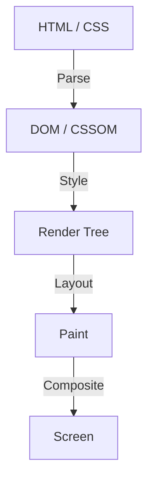

في تاريخ تطوير الواجهات الأمامية للويب، لطالما تطورت CSS كلغة تعريفية. يصف المطورون "كيف يجب أن يبدو"، ويقوم المتصفح بإجراء الحسابات المعقدة خلف الكواليس لرسم وحدات البكسل على الشاشة. نجح هذا التقسيم للعمل في العديد من حالات الاستخدام، لكنه في الوقت نفسه خلق حاجزًا كبيرًا. هذه هي مشكلة أن "خط أنابيب تصيير المتصفح عبارة عن صندوق أسود".

يستغرق الأمر عدة سنوات من اقتراح ميزة CSS جديدة حتى يتم تنفيذها في جميع المتصفحات الرئيسية وتصبح متاحة فعليًا للمطورين. حتى عند محاولة محاكاة الميزات الجديدة باستخدام Polyfill، كانت هناك معضلة تتمثل في أن الأداء ينخفض بشكل كبير عند التعامل مع DOM أو الأنماط بشكل متكرر باستخدام JavaScript.

للتغلب على هذا الحد، وُلد **CSS Houdini (هوديني)**. يوفر هذا المشروع، الذي يحمل اسم ملك الهروب الشهير هاري هوديني، للمطورين مفتاحًا سحريًا للوصول المباشر إلى خط أنابيب تصيير المتصفح.

في هذه المقالة، سنتعمق في أساسيات تصيير المتصفح، ومشاكل الأداء المتعلقة بمعالجة DOM باستخدام JavaScript، وكيف تحل كل واجهة برمجة تطبيقات (API) في CSS Houdini هذه المشاكل لتحقيق أداء ويب من الجيل التالي.

## أساسيات خط أنابيب تصيير المتصفح

لفهم CSS Houdini، يجب أولاً فهم العملية من لحظة استلام المتصفح لـ HTML و CSS حتى رسم وحدات البكسل على الشاشة، أي "خط أنابيب التصيير".

1. **Parse (التحليل)**
   يقوم المتصفح بتحليل HTML لبناء شجرة DOM (نموذج كائن المستند)، وتحليل CSS لبناء شجرة CSSOM (نموذج كائن CSS).
2. **Style (حساب النمط)**
   يجمع بين DOM و CSSOM، ويحسب الأنماط التي يجب تطبيقها على كل عنصر. كنتيجة لذلك، يتم إنشاء شجرة التصيير (Render Tree).
3. **Layout (التخطيط / إعادة التدفق)**
   بناءً على شجرة التصيير، يحسب مكان وضع كل عنصر على الشاشة وحجمه (العرض، الطول، الموضع).
4. **Paint (الرسم / الطلاء)**
   يرسم الخصائص المرئية للعناصر (الألوان، الظلال، النصوص، إلخ) كوحدات بكسل في طبقات.
5. **Composite (التركيب / التجميع)**
   يقوم بتركيب الطبقات المتعددة المرسومة بالترتيب الصحيح، ويخرج الصورة النهائية على الشاشة.

## JavaScript التقليدي وتضارب التخطيط

في الماضي، إذا كنت تريد تنفيذ تصميمات أو رسوم متحركة مخصصة غير موجودة في CSS، كان عليك استخدام JavaScript لتغيير الأنماط المضمنة أو إضافة/إزالة عناصر DOM. ومع ذلك، يحمل هذا مخاطر كبيرة على الأداء.

عند محاولة قراءة خصائص DOM (مثل `offsetWidth` أو `clientHeight`) باستخدام JavaScript، يجب على المتصفح تطبيق تغييرات النمط المعلقة قسرًا وإعادة تشغيل حسابات التخطيط لإرجاع أحدث قيمة. ثم، إذا قمت بتغيير النمط باستخدام JavaScript بعد ذلك مباشرة، يصبح التخطيط غير صالح مرة أخرى.

تُعرف الظاهرة التي يتكرر فيها هذا الأمر عدة مرات خلال إطار واحد (عادةً 16.6 مللي ثانية) باسم **تضارب التخطيط (Layout Thrashing)**. نظرًا لأن حساب التخطيط يضع حملاً كبيرًا على وحدة المعالجة المركزية، فإن حدوث تضارب التخطيط يقلل من معدل الإطارات ويخلق تجربة مستخدم مزعجة ومتشنجة (Jank).

## الثورة التي يجلبها CSS Houdini

CSS Houdini عبارة عن مجموعة من واجهات برمجة التطبيقات (APIs) التي تسمح للمطورين بربط (أو التدخل عبر) JavaScript (وبالتحديد، خيوط خفيفة الوزن تسمى Worklet) في كل خطوة من خطوات خط أنابيب التصيير المذكورة أعلاه (النمط، التخطيط، الرسم، التركيب).

باستخدام Houdini، يمكنك تنفيذ المعالجة في نفس خط الأنابيب مثل CSS الأصلي دون حظر الخيط الرئيسي للمتصفح، مما يسمح لك بتوسيع وظائف CSS مع الحفاظ على أداء مذهل.

### واجهات برمجة التطبيقات الرئيسية التي تشكل Houdini

Houdini ليس واجهة برمجة تطبيقات واحدة، بل مجموعة من المواصفات المتعددة. دعنا نلقي نظرة على بعض من أبرزها.

#### 1. CSS Paint API
لعل Paint API هي الأكثر تقدمًا من حيث الاستخدام العملي حاليًا. يمكن للمطورين استخدام بناء جملة مشابه لـ Canvas API لرسم صور بشكل ديناميكي مثل الخلفيات (`background-image`)، والحدود (`border-image`)، والأقنعة.

كل ما عليك فعله هو تحديد منطق الرسم باستخدام JavaScript (Paint Worklet)، واستدعائه من CSS هكذا `background-image: paint(my-custom-effect);`. إنه فعال للغاية لأن المتصفح يستدعي Worklet تلقائيًا عند الحاجة إلى إعادة الرسم، مثل تغيير حجم النافذة.

#### 2. Typed OM (CSS Typed Object Model)
في CSSOM التقليدي، تم التعامل مع جميع قيم CSS كسلاسل نصية. على سبيل المثال، يمكنك تجميع سلسلة نصية وتعيينها مثل `element.style.width = '100px'`، وسيقوم المتصفح بتحليلها وتحويلها إلى رقم ووحدة.

تسمح لك Typed OM بمعاملة قيم CSS ككائنات JavaScript مكتوبة (typed).
يمكنك كتابتها مثل `element.attributeStyleMap.set('width', CSS.px(100))`، وبما أنه لا توجد حاجة لتحليل السلاسل النصية، فإن الأداء عند معالجة CSS من JavaScript يتحسن بشكل كبير.

#### 3. Properties and Values API
تسمح لك واجهة برمجة التطبيقات هذه بتحديد النوع (بناء الجملة)، والقيمة الأولية، وما إذا كان يتم توريث الخصائص المخصصة لـ CSS (متغيرات CSS).
نظرًا لأن متغيرات CSS التقليدية كانت مجرد استبدال للرموز، كان من الصعب تحريكها (على سبيل المثال، يتغير اللون فجأة بدلاً من التدرج بسلاسة من الأحمر إلى الأزرق).

باستخدام واجهة برمجة التطبيقات هذه، يمكنك إخبار المتصفح أن "هذا المتغير عبارة عن لون" أو "هذا المتغير عبارة عن طول"، مما يتيح رسومًا متحركة سلسة باستخدام الخصائص المخصصة.

#### 4. CSS Layout API
واجهة برمجة تطبيقات قوية تتيح لك إنشاء خوارزمية التخطيط الخاصة بك. بدلاً من الاعتماد على نماذج التخطيط الحالية مثل Flexbox و Grid، ستتمكن من تنفيذ أنظمة تخطيط شبكية معقدة مخصصة أو تخطيطات مثل "Masonry" بسرعة داخل خط أنابيب التخطيط الأصلي للمتصفح.

#### 5. Animation Worklet
واجهة برمجة تطبيقات لإنشاء رسوم متحركة معقدة وعالية الأداء مرتبطة بموضع التمرير أو إدخال المستخدم. نظرًا لأنها تعمل على خيط التركيب (Compositor) بدلاً من الخيط الرئيسي، فإن الرسوم المتحركة ستستمر في العمل بسلاسة (بمعدل 60 إطارًا في الثانية) حتى لو كان الخيط الرئيسي محظورًا بمعالجة ثقيلة.

## الخلاصة: تطوير الواجهات الأمامية بالسحر

يعد CSS Houdini تحولاً في نموذج تطوير الواجهات الأمامية للويب. لم يعد المطورون مضطرين لانتظار بائعي المتصفحات لتنفيذ ميزات CSS الجديدة؛ حيث يمكنهم الآن توسيع وتحديد أجزاء من محرك تصيير المتصفح بأنفسهم.

ونتيجة لذلك، أصبحت التصميمات والرسومات المتحركة المعقدة، التي كانت في الماضي تضحي بالأداء بسبب الاستخدام المكثف لـ JavaScript، ممكنة الآن بسرعة تضاهي الأداء الأصلي. على الرغم من أن جميع واجهات برمجة التطبيقات ليست مدعومة في جميع المتصفحات حتى الآن، إلا أن بعضها مثل Paint API و Typed OM متاح بالفعل للاستخدام في بيئات الإنتاج.

مستقبل CSS لم يعد مجرد انتظار لتطور المتصفحات. لقد حان العصر الذي سيقوم فيه المطورون، مسلحين بعصا هوديني السحرية، بتشكيل المستقبل بأيديهم.
