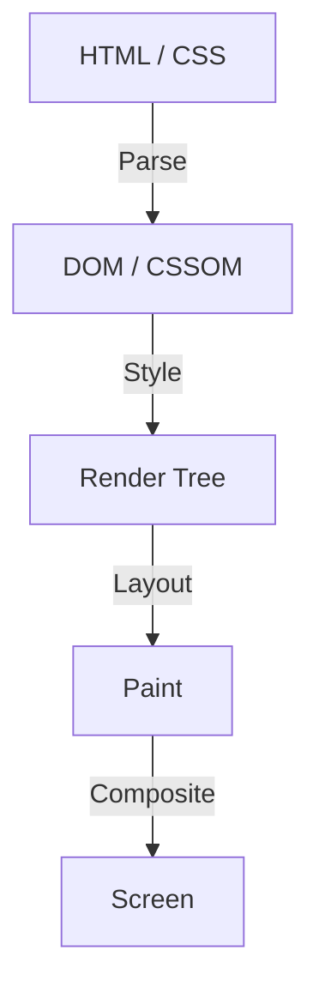

In der Geschichte der Web-Frontend-Entwicklung hat sich CSS immer als deklarative Sprache entwickelt. Entwickler beschreiben, "wie es aussehen soll", und der Browser führt die dahinterliegenden komplexen Berechnungen durch, um Pixel auf dem Bildschirm zu zeichnen. Diese Arbeitsteilung hat in vielen Anwendungsfällen gut funktioniert, aber gleichzeitig eine große Hürde geschaffen: das Problem, dass "die Rendering-Pipeline des Browsers eine Blackbox ist".

Es dauert Jahre, bis eine neue CSS-Funktion vorgeschlagen, in allen gängigen Browsern implementiert und von Entwicklern tatsächlich nutzbar ist. Selbst wenn man versucht, neue Funktionen mit Polyfills zu simulieren, gab es das Dilemma, dass die Leistung drastisch sinkt, wenn man DOM und Stile häufig mit JavaScript manipuliert.

Um diese Grenze zu durchbrechen, wurde **CSS Houdini** ins Leben gerufen. Benannt nach dem berühmten Entfesselungskünstler Harry Houdini, bietet dieses Projekt Entwicklern einen magischen Schlüssel für den direkten Zugriff auf die Rendering-Pipeline des Browsers.

In diesem Artikel werden wir tief in die Grundlagen des Browser-Renderings, die Leistungsprobleme bei der DOM-Manipulation durch JavaScript und die Frage eintauchen, wie die verschiedenen APIs von CSS Houdini diese Probleme lösen, um die Web-Performance der nächsten Generation zu realisieren.

## Grundlagen der Browser-Rendering-Pipeline

Um CSS Houdini zu verstehen, muss man zunächst den Prozess vom Empfang von HTML und CSS durch den Browser bis zum Zeichnen der Pixel auf dem Bildschirm verstehen, nämlich die "Rendering-Pipeline".

1. **Parse (Parsen/Analysieren)**
   Der Browser parst das HTML, um den DOM-Baum (Document Object Model) aufzubauen, und das CSS, um den CSSOM-Baum (CSS Object Model) zu erstellen.
2. **Style (Stilberechnung)**
   DOM und CSSOM werden kombiniert, um zu berechnen, welche Stile auf welche Elemente angewendet werden. Als Ergebnis entsteht der Render Tree (Renderbaum).
3. **Layout (Layout / Reflow)**
   Basierend auf dem Render Tree wird berechnet, wo jedes Element auf dem Bildschirm platziert wird und wie groß es sein wird (Breite, Höhe, Position).
4. **Paint (Malen / Zeichnen)**
   Die visuellen Eigenschaften der Elemente (Farbe, Schatten, Text usw.) werden als Pixel auf Ebenen (Layers) gezeichnet.
5. **Composite (Komposit / Zusammensetzen)**
   Mehrere gezeichnete Ebenen werden in der richtigen Reihenfolge übereinandergelegt und das endgültige Bild auf dem Bildschirm ausgegeben.

## Herkömmliches JavaScript und Layout Thrashing

Wenn Sie bisher ein einzigartiges Design oder eine Animation realisieren wollten, die es in CSS nicht gab, mussten Sie JavaScript verwenden, um Inline-Stile zu ändern oder DOM-Elemente hinzuzufügen/zu entfernen. Dies bringt jedoch erhebliche Leistungsrisiken mit sich.

Wenn Sie versuchen, DOM-Eigenschaften (z. B. `offsetWidth` oder `clientHeight`) mit JavaScript zu lesen, muss der Browser anstehende Stiländerungen erzwingen und das Layout neu berechnen, um den neuesten Wert zurückzugeben. Wenn Sie den Stil unmittelbar danach mit JavaScript ändern, wird das Layout sofort wieder ungültig.

Das Phänomen, bei dem dies während eines einzigen Frames (normalerweise 16,6 ms) immer wieder wiederholt wird, wird als **Layout Thrashing** bezeichnet. Da Layoutberechnungen die CPU stark belasten, sinkt die Bildrate (Framerate), wenn Layout Thrashing auftritt, was zu einer "ruckelnden" (Jank) und unangenehmen Erfahrung für den Benutzer führt.

## Die Revolution durch CSS Houdini

CSS Houdini ist eine Sammlung von APIs, die es Entwicklern ermöglichen, JavaScript (genauer gesagt einen leichtgewichtigen Thread, der Worklet genannt wird) in jeden Schritt der oben erwähnten Rendering-Pipeline (Style, Layout, Paint, Composite) einzuhängen (zu hooken).

Mit Houdini können Sie Prozesse in derselben Pipeline wie natives CSS ausführen, ohne den Haupt-Thread des Browsers zu blockieren. So können Sie die Funktionalität von CSS erweitern und gleichzeitig eine überwältigende Leistung aufrechterhalten.

### Haupt-APIs, aus denen Houdini besteht

Houdini ist nicht eine einzelne API, sondern eine Sammlung mehrerer Spezifikationen. Schauen wir uns einige der wichtigsten an.

#### 1. CSS Paint API
Die wahrscheinlich derzeit am meisten in der Praxis genutzte API ist die Paint API. Entwickler können eine Syntax ähnlich der Canvas-API verwenden, um Bilder für Hintergründe (`background-image`), Ränder (`border-image`), Masken usw. dynamisch zu zeichnen.

Sie definieren die Zeichenlogik in JavaScript (Paint Worklet) und rufen sie einfach aus CSS wie folgt auf: `background-image: paint(my-custom-effect);`. Dies ist äußerst effizient, da der Browser das Worklet automatisch aufruft, wenn ein Neuzeichnen erforderlich ist, z. B. wenn die Fenstergröße geändert wird.

#### 2. Typed OM (CSS Typed Object Model)
Im herkömmlichen CSSOM wurden alle CSS-Werte als Zeichenfolgen (Strings) behandelt. Zum Beispiel konstruierten Sie einen String wie `element.style.width = '100px'` und wiesen ihn zu, und der Browser parste ihn und wandelte ihn in eine Zahl und eine Einheit um.

Typed OM ermöglicht die Behandlung von CSS-Werten als typisierte JavaScript-Objekte.
Sie können etwas schreiben wie `element.attributeStyleMap.set('width', CSS.px(100))`, was das Parsen von Zeichenfolgen überflüssig macht und die Leistung bei der Manipulation von CSS über JavaScript drastisch verbessert.

#### 3. Properties and Values API
Dies ist eine API, mit der Sie Typen (Syntax), Anfangswerte und Vererbungsstatus für benutzerdefinierte CSS-Eigenschaften (CSS-Variablen) definieren können.
Herkömmliche CSS-Variablen waren einfache Token-Ersetzungen, was ihre Animation erschwerte (z. B. wechselte eine Farbe schlagartig, anstatt einen fließenden Übergang von Rot nach Blau zu machen).

Mit dieser API können Sie dem Browser mitteilen: "Diese Variable ist eine Farbe" oder "Diese Variable ist eine Länge", wodurch flüssige Animationen mit benutzerdefinierten Eigenschaften möglich werden.

#### 4. CSS Layout API
Eine leistungsstarke API, mit der Sie Ihre eigenen Layout-Algorithmen erstellen können. Anstatt sich auf bestehende Layout-Modelle wie Flexbox oder Grid zu verlassen, können Sie beispielsweise ein "Masonry-Layout" oder ein eigenes komplexes Rastersystem erstellen, das schnell innerhalb der nativen Layout-Pipeline des Browsers ausgeführt wird.

#### 5. Animation Worklet
Eine API zum Erstellen komplexer, hochperformanter Animationen, die an Scroll-Positionen oder Benutzereingaben gebunden sind. Da sie auf dem Compositor-Thread und nicht auf dem Main-Thread ausgeführt wird, laufen die Animationen flüssig weiter (Aufrechterhaltung von 60 fps), selbst wenn der Main-Thread durch schwere Verarbeitungen blockiert ist.

## Fazit: Frontend-Entwicklung mit Magie in den Händen

CSS Houdini ist ein Paradigmenwechsel in der Web-Frontend-Entwicklung. Entwickler müssen nicht mehr darauf warten, dass Browser-Anbieter neue CSS-Funktionen implementieren, sondern können nun Teile der Rendering-Engine des Browsers selbst erweitern und definieren.

Dadurch können komplexe Designs und Animationen, die früher auf Kosten der Leistung (durch den exzessiven Einsatz von JavaScript) realisiert werden mussten, nun mit nativ-äquivalenter Geschwindigkeit umgesetzt werden. Obwohl noch nicht alle APIs in allen Browsern unterstützt werden, sind einige, wie die Paint API und Typed OM, bereits für den Einsatz in Produktionsumgebungen verfügbar.

Die Zukunft von CSS besteht nicht mehr nur darin, auf die Weiterentwicklung der Browser zu warten. Es ist das Zeitalter angebrochen, in dem Entwickler, bewaffnet mit dem Zauberstab namens Houdini, ihre eigenen Wege gehen können.
