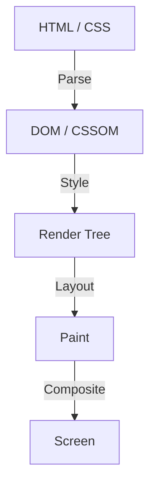

In the history of web frontend development, CSS has always evolved as a declarative language. Developers describe "how it should look," and the browser performs the complex calculations behind the scenes to draw pixels on the screen. This division of labor has worked well for many use cases, but at the same time, it has created a major barrier. That is the problem of "the browser's rendering pipeline being a black box."

It takes years of time from when a new CSS feature is proposed until it is implemented in all major browsers and developers can actually use it. Even when trying to simulate new features using Polyfills, there was a dilemma that frequently manipulating the DOM or styles using JavaScript would significantly degrade performance.

**CSS Houdini** was born to break through this limitation. Named after the famous escape artist Harry Houdini, this project provides developers with a magic key for direct access to the browser's rendering pipeline.

This article delves deeply into the basics of browser rendering, the performance issues of DOM manipulation with JavaScript, and how each API of CSS Houdini solves these problems to achieve next-generation web performance.

## Basics of the Browser's Rendering Pipeline

To understand CSS Houdini, you first need to understand the process from when the browser receives HTML and CSS until it draws pixels on the screen, namely the "rendering pipeline."

1. **Parse**
   The browser parses HTML to construct the DOM (Document Object Model) tree, and parses CSS to construct the CSSOM (CSS Object Model) tree.
2. **Style (Style Calculation)**
   It combines the DOM and CSSOM to calculate which styles are applied to which elements. As a result, the Render Tree is created.
3. **Layout (Layout / Reflow)**
   Based on the Render Tree, it calculates where each element is placed on the screen and how large it will be (width, height, position).
4. **Paint (Paint / Drawing)**
   It draws the visual properties of the elements (colors, shadows, text, etc.) as pixels into layers.
5. **Composite (Composite / Synthesis)**
   It overlays the multiple painted layers in the correct order and outputs the final image to the screen.

## Traditional JavaScript and Layout Thrashing

Until now, if you wanted to achieve unique designs or animations not found in CSS, you had to use JavaScript to change inline styles or add/remove DOM elements. However, this comes with major performance risks.

When you try to read DOM properties (for example, `offsetWidth` or `clientHeight`) with JavaScript, the browser must forcibly apply pending style changes and recalculate the layout to return the latest value. And if you change the style with JavaScript immediately after that, the layout becomes invalid again.

The phenomenon of repeating this many times during a single frame (usually 16.6ms) is called **Layout Thrashing**. Because layout calculations put a heavy load on the CPU, the occurrence of layout thrashing drops the frame rate, resulting in an unpleasant "jank" experience for the user.

## The Revolution Brought by CSS Houdini

CSS Houdini is a set of APIs for developers to hook (intervene) JavaScript (strictly speaking, a lightweight thread called a Worklet) into each step of the aforementioned rendering pipeline (Style, Layout, Paint, Composite).

By using Houdini, you can execute processing on the same pipeline as native CSS without blocking the browser's main thread, allowing you to extend CSS features while maintaining overwhelming performance.

### Major APIs Comprising Houdini

Houdini is not a single API, but a collection of multiple specifications. Let's look at some of the representative ones.

#### 1. CSS Paint API
Perhaps the most practically advanced at present is the Paint API. Developers can dynamically draw images such as backgrounds (`background-image`), borders (`border-image`), and masks using a syntax similar to the Canvas API.

You simply define the drawing logic in JavaScript (Paint Worklet) and call it from CSS like `background-image: paint(my-custom-effect);`. It is extremely efficient because the browser automatically calls the Worklet at the timing when redrawing is necessary, such as when the window is resized.

#### 2. Typed OM (CSS Typed Object Model)
In the traditional CSSOM, all CSS values were treated as strings. For example, by constructing and assigning a string like `element.style.width = '100px'`, the browser parsed it and converted it into a number and unit.

Typed OM allows CSS values to be treated as typed JavaScript objects.
It can be written like `element.attributeStyleMap.set('width', CSS.px(100))`, eliminating the need for string parsing, which dramatically improves performance when manipulating CSS from JavaScript.

#### 3. Properties and Values API
An API that allows you to define the type (syntax), initial value, and whether it inherits for CSS custom properties (CSS variables).
Because traditional CSS variables were merely token replacements, it was difficult to animate them (for example, instead of graduating from red to blue, it would switch instantly).

By using this API, you can tell the browser "this variable is a color" or "this variable is a length," enabling smooth animations using custom properties.

#### 4. CSS Layout API
A powerful API that allows you to create your own layout algorithms. Rather than relying on existing layout models like Flexbox or Grid, you will be able to run, for example, a "Masonry" layout or a proprietary complex grid system at high speed within the browser's native layout pipeline.

#### 5. Animation Worklet
An API for creating complex, high-performance animations linked to scroll positions or user input. Because it runs on the Compositor thread rather than the main thread, the animation will continue to move smoothly (maintaining 60fps) even if the main thread is blocked by heavy processing.

## Conclusion: Frontend Development with Magic

CSS Houdini is a paradigm shift in web frontend development. Developers no longer have to wait for browser vendors to implement new CSS features, and they can extend and define parts of the browser's rendering engine themselves.

As a result, complex designs and animations that once had to sacrifice performance due to heavy JavaScript usage can be realized at native-equivalent speeds. While not all APIs are supported in all browsers yet, some, such as the Paint API and Typed OM, are already available in production environments.

The future of CSS is no longer just waiting for the evolution of browsers. The era has arrived where developers, armed with the magic wand called Houdini, will carve it out with their own hands.
