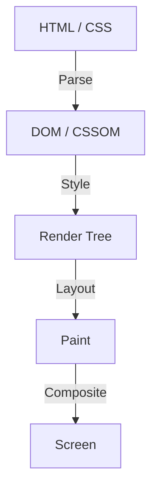

En la historia del desarrollo frontend web, CSS siempre ha evolucionado como un lenguaje declarativo. Los desarrolladores describen "cómo debería verse" y el navegador realiza los cálculos complejos subyacentes para dibujar los píxeles en la pantalla. Esta división del trabajo ha funcionado bien en muchos casos de uso, pero al mismo tiempo ha creado una gran barrera: el problema de que "el canal de renderizado (rendering pipeline) del navegador es una caja negra".

Desde que se propone una nueva función de CSS hasta que se implementa en todos los navegadores principales y los desarrolladores pueden usarla en la práctica, pasan años. Incluso si se intenta simular nuevas características usando polyfills, existía el dilema de que si se manipula frecuentemente el DOM o los estilos mediante JavaScript, el rendimiento se degrada significativamente.

Para romper esta limitación nació **CSS Houdini**. Nombrado en honor al famoso escapista Harry Houdini, este proyecto ofrece a los desarrolladores una llave mágica para acceder directamente al canal de renderizado del navegador.

En este artículo, profundizaremos desde los conceptos básicos del renderizado del navegador, los problemas de rendimiento de la manipulación del DOM mediante JavaScript, hasta cómo cada API de CSS Houdini resuelve estos problemas y logra el rendimiento web de próxima generación.

## Fundamentos del canal de renderizado del navegador

Para entender CSS Houdini, primero es necesario comprender el proceso desde que el navegador recibe el HTML y CSS hasta que dibuja los píxeles en la pantalla, es decir, el "canal de renderizado" (rendering pipeline).

1. **Parse (Análisis)**
   El navegador analiza el HTML para construir el árbol DOM (Document Object Model) y analiza el CSS para construir el árbol CSSOM (CSS Object Model).
2. **Style (Cálculo de estilos)**
   Combina el DOM y el CSSOM para calcular qué estilos se aplican a qué elementos. Como resultado de esto, se crea el árbol de renderizado (Render Tree).
3. **Layout (Diseño / Reflujo)**
   Basado en el árbol de renderizado, calcula dónde se colocará cada elemento en la pantalla y qué tamaño tendrá (ancho, alto, posición).
4. **Paint (Pintado / Dibujado)**
   Dibuja las propiedades visuales de los elementos (color, sombras, texto, etc.) como píxeles en capas.
5. **Composite (Composición / Sintetización)**
   Superpone múltiples capas pintadas en el orden correcto y muestra la imagen final en la pantalla.

## JavaScript tradicional y Layout Thrashing

Hasta ahora, si se deseaba lograr diseños o animaciones únicas que no estaban en CSS, era necesario usar JavaScript para cambiar estilos en línea o agregar/eliminar elementos del DOM. Sin embargo, esto conlleva un gran riesgo de rendimiento.

Cuando se intenta leer las propiedades del DOM (por ejemplo, `offsetWidth` o `clientHeight`) con JavaScript, el navegador debe aplicar por la fuerza los cambios de estilo pendientes y volver a ejecutar el cálculo del diseño para devolver el valor más reciente. Y si se cambian los estilos con JavaScript inmediatamente después, el diseño se invalida de nuevo.

El fenómeno de repetir esto muchas veces en un solo frame (generalmente 16.6 ms) se llama **Layout Thrashing** (Sacudida de diseño). Dado que los cálculos de diseño ejercen una gran carga sobre la CPU, cuando se produce un layout thrashing, la velocidad de fotogramas disminuye, lo que resulta en una experiencia desagradable y "entrecortada" (Jank) para el usuario.

## La revolución que trae CSS Houdini

CSS Houdini es un conjunto de APIs que permite a los desarrolladores enganchar (intervenir) JavaScript (estrictamente hablando, hilos ligeros llamados Worklets) en cada paso del canal de renderizado mencionado anteriormente (Style, Layout, Paint, Composite).

Al usar Houdini, se pueden ejecutar procesos en el mismo canal que el CSS nativo sin bloquear el hilo principal del navegador, lo que permite ampliar la funcionalidad de CSS manteniendo un rendimiento abrumador.

### Las principales APIs que componen Houdini

Houdini no es una API única, sino una colección de múltiples especificaciones. Veamos algunas de las más representativas.

#### 1. CSS Paint API
Probablemente la API más implementada de forma práctica en la actualidad sea la Paint API. Los desarrolladores pueden usar una sintaxis similar a la Canvas API para dibujar dinámicamente imágenes como fondos (`background-image`), bordes (`border-image`), máscaras, etc.

Simplemente se define la lógica de dibujo en JavaScript (Paint Worklet) y se llama desde CSS así: `background-image: paint(my-custom-effect);`. Es extremadamente eficiente porque el navegador llama automáticamente al Worklet cuando se necesita volver a dibujar, como al cambiar el tamaño de la ventana.

#### 2. Typed OM (CSS Typed Object Model)
En el CSSOM tradicional, todos los valores de CSS se trataban como cadenas. Por ejemplo, se construía y asignaba una cadena como `element.style.width = '100px'`, y el navegador la analizaba y la convertía en un número y una unidad.

Typed OM permite que los valores de CSS se traten como objetos JavaScript tipados.
Se puede escribir como `element.attributeStyleMap.set('width', CSS.px(100))`, y al no ser necesario analizar (parsear) cadenas de texto, el rendimiento al manipular CSS desde JavaScript mejora drásticamente.

#### 3. Properties and Values API
Esta API permite definir tipos (sintaxis), valores iniciales y si se hereda o no en las propiedades personalizadas de CSS (variables CSS).
Las variables CSS tradicionales eran simplemente sustitución de tokens, por lo que era difícil animarlas (por ejemplo, en lugar de que un color cambie gradualmente de rojo a azul, cambiaba repentinamente).

Al usar esta API, se puede indicar al navegador que "esta variable es un color" o "esta variable es una longitud", lo que permite animaciones fluidas usando propiedades personalizadas.

#### 4. CSS Layout API
Una potente API que permite crear los propios algoritmos de diseño. En lugar de depender de los modelos de diseño existentes como Flexbox o Grid, permite ejecutar rápidamente, dentro del canal de diseño nativo del navegador, por ejemplo, un "Diseño Masonry (Mampostería)" o sistemas de cuadrícula complejos y personalizados.

#### 5. Animation Worklet
Una API para crear animaciones complejas y de alto rendimiento vinculadas a la posición de desplazamiento o la entrada del usuario. Funciona en el hilo del Compositor (Composición) en lugar del hilo principal, por lo que incluso si el hilo principal está bloqueado por un procesamiento pesado, la animación continuará moviéndose suavemente (manteniendo los 60fps).

## Conclusión: El desarrollo frontend ha obtenido magia

CSS Houdini es un cambio de paradigma en el desarrollo frontend web. Ya no es necesario esperar a que los proveedores de navegadores implementen nuevas características de CSS, y los propios desarrolladores pueden ampliar y definir partes del motor de renderizado del navegador.

Con esto, los diseños complejos y las animaciones que alguna vez requirieron un uso intensivo de JavaScript a expensas del rendimiento, ahora se pueden realizar a una velocidad equivalente a la nativa. Aunque aún no todas las APIs son compatibles con todos los navegadores, algunas, como Paint API y Typed OM, ya están disponibles para su uso en entornos de producción.

El futuro de CSS ya no es simplemente esperar a que evolucionen los navegadores. Ha llegado la era en la que los desarrolladores, armados con la varita mágica de Houdini, forjarán el camino con sus propias manos.
