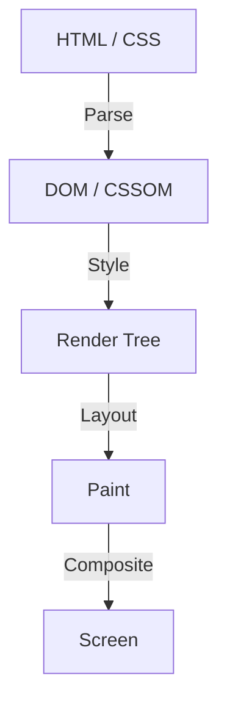

Dans l'histoire du développement web front-end, CSS a toujours évolué en tant que langage déclaratif. Les développeurs décrivent "à quoi cela devrait ressembler", et le navigateur effectue les calculs complexes en arrière-plan pour dessiner les pixels à l'écran. Cette division du travail a bien fonctionné pour de nombreux cas d'utilisation, mais elle a également créé une barrière majeure. Le problème est que "le pipeline de rendu du navigateur est une boîte noire".

Il faut plusieurs années pour qu'une nouvelle fonctionnalité CSS soit proposée, implémentée dans tous les principaux navigateurs et devienne réellement utilisable par les développeurs. Même si l'on essaie de simuler de nouvelles fonctionnalités à l'aide de polyfills, manipuler fréquemment le DOM ou les styles avec JavaScript entraîne un dilemme : les performances se dégradent considérablement.

Pour repousser ces limites, **CSS Houdini** a été créé. Nommé d'après le célèbre roi de l'évasion Harry Houdini, ce projet offre aux développeurs la clé magique pour accéder directement au pipeline de rendu du navigateur.

Dans cet article, nous explorerons en profondeur les bases du rendu des navigateurs, les problèmes de performances liés à la manipulation du DOM par JavaScript, et comment chaque API de CSS Houdini résout ces problèmes pour offrir des performances web de nouvelle génération.

## Les bases du pipeline de rendu du navigateur

Pour comprendre CSS Houdini, il faut d'abord comprendre le processus par lequel un navigateur reçoit le HTML et le CSS, puis dessine les pixels à l'écran : le "pipeline de rendu".

1. **Parse (Analyse)**
   Le navigateur analyse le HTML pour construire l'arbre DOM (Document Object Model) et analyse le CSS pour construire l'arbre CSSOM (CSS Object Model).
2. **Style (Calcul des styles)**
   Il combine le DOM et le CSSOM pour calculer quels styles s'appliquent à quels éléments. Le résultat est l'arbre de rendu (Render Tree).
3. **Layout (Mise en page / Refusion)**
   En se basant sur l'arbre de rendu, il calcule où chaque élément sera placé à l'écran et sa taille (largeur, hauteur, position).
4. **Paint (Peinture / Dessin)**
   Il dessine les propriétés visuelles des éléments (couleurs, ombres, texte, etc.) sous forme de pixels dans des calques.
5. **Composite (Composition / Synthèse)**
   Il superpose les différents calques peints dans le bon ordre pour produire l'image finale à l'écran.

## Le JavaScript traditionnel et le Layout Thrashing (bataille de mise en page)

Auparavant, si vous vouliez réaliser des designs ou des animations uniques qui n'existaient pas en CSS, vous deviez utiliser JavaScript pour modifier les styles en ligne ou ajouter/supprimer des éléments du DOM. Cependant, cela comporte des risques majeurs en matière de performances.

Lorsque JavaScript essaie de lire les propriétés du DOM (par exemple, `offsetWidth` ou `clientHeight`), le navigateur doit forcer l'application des modifications de style en attente et recalculer la mise en page pour renvoyer la valeur la plus récente. Si, immédiatement après, un style est modifié par JavaScript, la mise en page est à nouveau invalidée.

Ce phénomène répété de nombreuses fois en une seule trame (généralement 16,6 ms) s'appelle le **Layout Thrashing**. Comme les calculs de mise en page sollicitent fortement le processeur, le Layout Thrashing fait chuter la fréquence d'images, créant une expérience désagréable de saccade ("Jank") pour l'utilisateur.

## La révolution apportée par CSS Houdini

CSS Houdini est un ensemble d'API qui permet aux développeurs d'intégrer (hook) du JavaScript (strictement parlant, un thread léger appelé Worklet) à chaque étape du pipeline de rendu mentionné précédemment (Style, Layout, Paint, Composite).

Avec Houdini, vous pouvez exécuter des traitements sur le même pipeline que le CSS natif sans bloquer le thread principal du navigateur, ce qui permet d'étendre les fonctionnalités de CSS tout en conservant des performances exceptionnelles.

### Les principales API qui composent Houdini

Houdini n'est pas une API unique, mais un ensemble de plusieurs spécifications. Examinons quelques-unes des plus représentatives.

#### 1. CSS Paint API
La Paint API est probablement celle qui est la plus avancée en termes d'utilisation pratique aujourd'hui. Les développeurs peuvent utiliser une syntaxe similaire à l'API Canvas pour dessiner dynamiquement des images pour les arrière-plans (`background-image`), les bordures (`border-image`), les masques, etc.

Vous définissez la logique de dessin en JavaScript (Paint Worklet) et vous l'appelez simplement depuis le CSS comme ceci : `background-image: paint(my-custom-effect);`. Le navigateur appelle automatiquement le Worklet lorsque le redessin est nécessaire, par exemple lors du redimensionnement de la fenêtre, ce qui est extrêmement efficace.

#### 2. Typed OM (CSS Typed Object Model)
Dans l'ancien CSSOM, toutes les valeurs CSS étaient traitées comme des chaînes de caractères. Par exemple, avec `element.style.width = '100px'`, vous assembliez une chaîne et l'assigniez, puis le navigateur l'analysait pour la convertir en un nombre et une unité.

Typed OM permet de traiter les valeurs CSS comme des objets JavaScript typés.
Vous pouvez écrire `element.attributeStyleMap.set('width', CSS.px(100))`, éliminant ainsi le besoin d'analyser des chaînes de caractères, ce qui améliore considérablement les performances lors de la manipulation du CSS depuis JavaScript.

#### 3. Properties and Values API
C'est une API qui permet de définir le type (syntaxe), la valeur initiale et si elle est héritée pour les propriétés personnalisées CSS (variables CSS).
Les anciennes variables CSS n'étaient que de simples remplacements de jetons, ce qui les rendait difficiles à animer (par exemple, une couleur passerait brutalement du rouge au bleu au lieu d'avoir un dégradé fluide).

Avec cette API, vous pouvez indiquer au navigateur que "cette variable est une couleur" ou "cette variable est une longueur", permettant ainsi des animations fluides utilisant des propriétés personnalisées.

#### 4. CSS Layout API
C'est une API puissante qui vous permet de créer vos propres algorithmes de mise en page. Au lieu de s'appuyer sur des modèles de mise en page existants tels que Flexbox et Grid, vous pouvez exécuter des algorithmes tels qu'une mise en page "Masonry" (en maçonnerie) ou votre propre système de grille complexe à grande vitesse au sein du pipeline de mise en page natif du navigateur.

#### 5. Animation Worklet
C'est une API permettant de créer des animations complexes et performantes liées à la position de défilement ou aux entrées de l'utilisateur. Puisqu'elle fonctionne sur le thread du compositeur (Compositor thread) plutôt que sur le thread principal, les animations continueront de s'exécuter de manière fluide (maintien de 60 fps) même si le thread principal est bloqué par des traitements lourds.

## Conclusion : Le développement front-end doté de magie

CSS Houdini représente un changement de paradigme dans le développement web front-end. Les développeurs n'ont plus à attendre que les fournisseurs de navigateurs implémentent de nouvelles fonctionnalités CSS ; ils peuvent désormais étendre et définir eux-mêmes des parties du moteur de rendu du navigateur.

Cela permet de réaliser des designs et des animations complexes, qui nécessitaient autrefois de sacrifier les performances en raison d'une utilisation intensive de JavaScript, à des vitesses équivalentes au natif. Bien que toutes les API ne soient pas encore prises en charge par tous les navigateurs, certaines, comme Paint API et Typed OM, sont déjà utilisables en environnement de production.

L'avenir de CSS ne se résume plus à attendre l'évolution des navigateurs. L'ère est arrivée où les développeurs, armés de la baguette magique qu'est Houdini, ouvrent leur propre voie.
