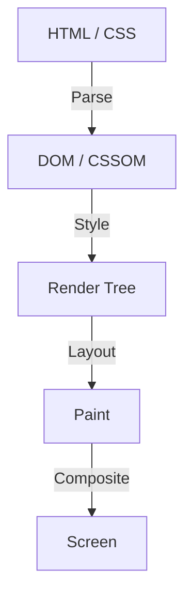

वेब फ्रंट-एंड विकास के इतिहास में, CSS हमेशा एक डिक्लेरेटिव (घोषणात्मक) भाषा के रूप में विकसित हुआ है। डेवलपर्स वर्णन करते हैं कि "यह कैसा दिखना चाहिए", और ब्राउज़र स्क्रीन पर पिक्सेल खींचने के लिए इसके पीछे जटिल गणनाएँ करता है। यह श्रम विभाजन कई उपयोग के मामलों (use cases) में अच्छी तरह से काम कर रहा है, लेकिन साथ ही इसने एक बड़ी बाधा भी पैदा की है। वह समस्या है कि "ब्राउज़र का रेंडरिंग पाइपलाइन एक ब्लैक बॉक्स है"।

नई CSS सुविधाओं के प्रस्तावित होने से लेकर सभी प्रमुख ब्राउज़रों में लागू होने और डेवलपर्स द्वारा वास्तव में उपयोग किए जाने योग्य होने तक कई साल लग जाते हैं। भले ही आप पॉलीफ़िल (Polyfill) का उपयोग करके नई सुविधाओं का अनुकरण (simulate) करने का प्रयास करें, लेकिन यदि आप जावास्क्रिप्ट का उपयोग करके अक्सर DOM और शैलियों (styles) में हेरफेर करते हैं, तो प्रदर्शन में काफी गिरावट आती है। यह एक दुविधा थी।

इस सीमा को तोड़ने के लिए **CSS Houdini (हूडिनी)** का जन्म हुआ। प्रसिद्ध एस्केप आर्टिस्ट हैरी हूडिनी के नाम पर रखा गया यह प्रोजेक्ट डेवलपर्स को ब्राउज़र के रेंडरिंग पाइपलाइन तक सीधे पहुँच के लिए एक जादुई चाबी प्रदान करता है।

इस लेख में, हम ब्राउज़र रेंडरिंग की मूल बातों, जावास्क्रिप्ट का उपयोग करके DOM हेरफेर के प्रदर्शन संबंधी मुद्दों पर गहराई से विचार करेंगे, और यह भी जानेंगे कि CSS Houdini का प्रत्येक API इन समस्याओं को कैसे हल करता है और अगली पीढ़ी के वेब प्रदर्शन को कैसे प्राप्त करता है।

## ब्राउज़र रेंडरिंग पाइपलाइन की मूल बातें

CSS Houdini को समझने के लिए, आपको सबसे पहले ब्राउज़र द्वारा HTML और CSS प्राप्त करने से लेकर स्क्रीन पर पिक्सेल खींचने तक की प्रक्रिया को समझना होगा, यानी "रेंडरिंग पाइपलाइन"।

1. **Parse (पार्सिंग)**
   ब्राउज़र DOM (Document Object Model) ट्री बनाने के लिए HTML को पार्स करता है, और CSSOM (CSS Object Model) ट्री बनाने के लिए CSS को पार्स करता है।
2. **Style (स्टाइल गणना)**
   यह DOM और CSSOM को जोड़ता है और गणना करता है कि किस तत्व पर कौन सी शैली लागू होगी। इसके परिणामस्वरूप एक रेंडर ट्री (Render Tree) बनता है।
3. **Layout (लेआउट / रिफ़्लो)**
   रेंडर ट्री के आधार पर, यह गणना करता है कि प्रत्येक तत्व स्क्रीन पर कहाँ रखा जाएगा और उसका आकार (चौड़ाई, ऊंचाई, स्थिति) क्या होगा।
4. **Paint (पेंट / चित्रण)**
   यह तत्वों के दृश्य गुणों (visual properties जैसे रंग, छाया, पाठ आदि) को लेयर्स पर पिक्सेल के रूप में खींचता है।
5. **Composite (कंपोजिट)**
   पेंट की गई कई परतों को सही क्रम में ओवरले करता है, और स्क्रीन पर अंतिम छवि आउटपुट करता है।

## पारंपरिक जावास्क्रिप्ट और लेआउट थ्रैशिंग

अब तक, यदि आप अद्वितीय डिज़ाइन या एनिमेशन प्राप्त करना चाहते थे जो CSS में नहीं हैं, तो आपको इनलाइन शैलियों को बदलने या DOM तत्वों को जोड़ने/हटाने के लिए जावास्क्रिप्ट का उपयोग करने की आवश्यकता होती थी। हालाँकि, इसके साथ एक बड़ा प्रदर्शन जोखिम जुड़ा है।

जब आप जावास्क्रिप्ट के साथ DOM गुणों (जैसे `offsetWidth` या `clientHeight`) को पढ़ने का प्रयास करते हैं, तो ब्राउज़र को नवीनतम मान वापस करने के लिए लंबित शैली परिवर्तनों को बलपूर्वक लागू करना पड़ता है और लेआउट गणना को फिर से चलाना पड़ता है। और अगर आप इसके तुरंत बाद जावास्क्रिप्ट के साथ शैली बदलते हैं, तो लेआउट फिर से अमान्य हो जाता है।

एक ही फ्रेम (आमतौर पर 16.6ms) के भीतर इस प्रक्रिया को कई बार दोहराने की घटना को **लेआउट थ्रैशिंग (Layout Thrashing)** कहा जाता है। चूंकि लेआउट गणना सीपीयू पर भारी भार डालती है, इसलिए जब लेआउट थ्रैशिंग होती है, तो फ्रेम दर गिर जाती है, जिसके परिणामस्वरूप उपयोगकर्ता के लिए एक "झटकेदार (Jank)" और अप्रिय अनुभव होता है।

## CSS Houdini द्वारा लाई गई क्रांति

CSS Houdini APIs का एक समूह है जो डेवलपर्स को पूर्वोक्त रेंडरिंग पाइपलाइन के प्रत्येक चरण (Style, Layout, Paint, Composite) में जावास्क्रिप्ट (विशेष रूप से, Worklet नामक हल्के धागे) को हुक (हस्तक्षेप) करने की अनुमति देता है।

Houdini का उपयोग करके, आप ब्राउज़र के मुख्य थ्रेड को ब्लॉक किए बिना उसी पाइपलाइन पर प्रोसेसिंग चला सकते हैं जिस पर नेटिव CSS चलता है, जिससे आप अत्यधिक प्रदर्शन बनाए रखते हुए CSS की क्षमताओं का विस्तार कर सकते हैं।

### Houdini को बनाने वाले प्रमुख API

Houdini एक एकल API नहीं है, बल्कि कई विशिष्टताओं का संग्रह है। आइए कुछ विशिष्ट विशिष्टताओं पर नज़र डालें।

#### 1. CSS Paint API
शायद पेंट API वर्तमान में सबसे अधिक उपयोग किया जाने वाला है। डेवलपर्स कैनवास API (Canvas API) के समान सिंटैक्स का उपयोग करके गतिशील रूप से पृष्ठभूमि (`background-image`), सीमाएँ (`border-image`), और मास्क जैसी छवियां खींच सकते हैं।

बस जावास्क्रिप्ट (Paint Worklet) में ड्राइंग लॉजिक को परिभाषित करें और इसे CSS से `background-image: paint(my-custom-effect);` की तरह कॉल करें। यह बेहद कुशल है क्योंकि जब भी फिर से खींचने की आवश्यकता होती है, जैसे कि विंडो का आकार बदलते समय, ब्राउज़र स्वचालित रूप से Worklet को कॉल करता है।

#### 2. Typed OM (CSS Typed Object Model)
पारंपरिक CSSOM में, सभी CSS मानों को स्ट्रिंग्स के रूप में माना जाता था। उदाहरण के लिए, `element.style.width = '100px'` जैसी स्ट्रिंग का निर्माण और असाइनमेंट किया जाता था, और ब्राउज़र इसे पार्स करता था और इसे संख्याओं और इकाइयों में परिवर्तित करता था।

टाइप्ड OM आपको CSS मानों को टाइप किए गए जावास्क्रिप्ट ऑब्जेक्ट्स (typed JavaScript objects) के रूप में मानने की अनुमति देता है।
आप इसे `element.attributeStyleMap.set('width', CSS.px(100))` के रूप में लिख सकते हैं, जो स्ट्रिंग पार्सिंग की आवश्यकता को समाप्त करता है और जावास्क्रिप्ट से CSS में हेरफेर करते समय प्रदर्शन में काफी सुधार करता है।

#### 3. Properties and Values API
यह एक API है जो आपको CSS कस्टम प्रॉपर्टीज (CSS वेरिएबल्स) के लिए प्रकार (सिंटैक्स), प्रारंभिक मान और विरासत (inheritance) की उपस्थिति या अनुपस्थिति को परिभाषित करने की अनुमति देता है।
चूंकि पारंपरिक CSS चर केवल टोकन प्रतिस्थापन थे, इसलिए उन्हें चेतन (animate) करना मुश्किल था (उदाहरण के लिए, रंग लाल से नीले रंग में फीका होने के बजाय अचानक बदल जाता था)।

इस API का उपयोग करके, आप ब्राउज़र को बता सकते हैं कि "यह चर एक रंग है" या "यह चर एक लंबाई है", जो कस्टम गुणों का उपयोग करके चिकनी एनिमेशन (smooth animations) को संभव बनाता है।

#### 4. CSS Layout API
यह एक शक्तिशाली API है जो आपको अपना स्वयं का लेआउट एल्गोरिदम बनाने की अनुमति देता है। फ्लेक्सबॉक्स (Flexbox) और ग्रिड (Grid) जैसे मौजूदा लेआउट मॉडल पर भरोसा करने के बजाय, आप उच्च गति पर ब्राउज़र के मूल लेआउट पाइपलाइन के भीतर "मेसनरी (Masonry)" लेआउट या अपने स्वयं के जटिल ग्रिड सिस्टम जैसे लेआउट चला सकते हैं।

#### 5. Animation Worklet
स्क्रॉल स्थिति और उपयोगकर्ता इनपुट से जुड़े जटिल, उच्च-प्रदर्शन वाले एनिमेशन बनाने के लिए एक API। क्योंकि यह मुख्य थ्रेड के बजाय कंपोजिटर थ्रेड (Compositor thread) पर चलता है, एनिमेशन सुचारू रूप से चलता रहता है (60fps बनाए रखता है) भले ही मुख्य थ्रेड भारी प्रसंस्करण (heavy processing) द्वारा अवरुद्ध हो।

## सारांश: फ्रंट-एंड विकास जिसे जादू मिल गया है

CSS Houdini वेब फ्रंट-एंड विकास में एक आदर्श बदलाव (paradigm shift) है। अब ब्राउज़र विक्रेताओं (vendors) द्वारा नई CSS सुविधाओं को लागू करने की प्रतीक्षा करने की आवश्यकता नहीं है; अब डेवलपर्स स्वयं ब्राउज़र के रेंडरिंग इंजन के कुछ हिस्सों का विस्तार और परिभाषित कर सकते हैं।

यह उन जटिल डिज़ाइनों और एनिमेशन को प्राप्त करना संभव बनाता है जिनके लिए पहले जावास्क्रिप्ट के भारी उपयोग के कारण प्रदर्शन का त्याग करना पड़ता था, अब नेटिव गति के साथ। जबकि सभी API अभी तक सभी ब्राउज़रों में समर्थित नहीं हैं, कुछ, जैसे पेंट API और टाइप्ड OM, पहले से ही उत्पादन (production) वातावरण में उपलब्ध हैं।

CSS का भविष्य अब केवल ब्राउज़रों के विकसित होने की प्रतीक्षा करने के बारे में नहीं है। वह युग आ गया है जहां डेवलपर्स, जिनके हाथों में Houdini जैसी जादू की छड़ी है, अपने स्वयं के मार्ग प्रशस्त करेंगे।
