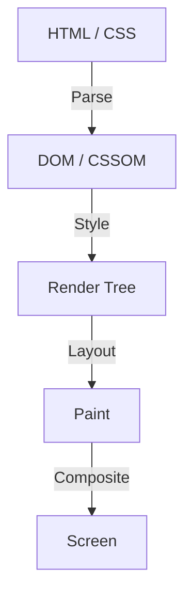

Dalam sejarah pengembangan frontend web, CSS selalu berkembang sebagai bahasa deklaratif. Pengembang mendeskripsikan "bagaimana seharusnya terlihat", dan browser melakukan perhitungan kompleks di balik layar untuk menggambar piksel di layar. Pembagian kerja ini telah berfungsi dengan baik untuk banyak kasus penggunaan, namun pada saat yang sama menciptakan satu dinding besar. Dinding tersebut adalah masalah "pipeline rendering browser yang merupakan kotak hitam".

Diperlukan waktu bertahun-tahun sejak fitur CSS baru diusulkan hingga diimplementasikan di semua browser utama dan benar-benar dapat digunakan oleh pengembang. Bahkan jika kita mencoba menyimulasikan fitur baru menggunakan Polyfill, ada dilema di mana memanipulasi DOM dan gaya secara sering menggunakan JavaScript akan menurunkan performa secara signifikan.

Untuk mendobrak batasan ini, lahirlah **CSS Houdini**. Dinamai dari pesulap pelolos diri terkenal Harry Houdini, proyek ini memberi pengembang kunci ajaib untuk mengakses pipeline rendering browser secara langsung.

Artikel ini akan menggali lebih dalam dari dasar rendering browser, masalah performa manipulasi DOM oleh JavaScript, hingga bagaimana setiap API CSS Houdini memecahkan masalah ini dan mewujudkan performa web generasi berikutnya.

## Dasar-dasar Pipeline Rendering Browser

Untuk memahami CSS Houdini, pertama-tama kita perlu memahami proses dari saat browser menerima HTML dan CSS hingga menggambar piksel di layar, yaitu "pipeline rendering".

1. **Parse (Penguraian)**
   Browser mengurai HTML untuk membangun pohon DOM (Document Object Model), dan mengurai CSS untuk membangun pohon CSSOM (CSS Object Model).
2. **Style (Perhitungan Gaya)**
   Menggabungkan DOM dan CSSOM untuk menghitung gaya apa yang diterapkan pada elemen mana. Hasilnya adalah pembuatan pohon render (Render Tree).
3. **Layout (Tata Letak / Reflow)**
   Berdasarkan pohon render, menghitung di mana setiap elemen akan ditempatkan di layar dan seberapa besar ukurannya (lebar, tinggi, posisi).
4. **Paint (Pengecatan / Penggambaran)**
   Menggambar properti visual elemen (warna, bayangan, teks, dll.) sebagai piksel ke dalam layer.
5. **Composite (Komposisi / Penggabungan)**
   Menumpuk beberapa layer yang telah dicat dalam urutan yang benar dan menampilkan gambar akhir ke layar.

## JavaScript Konvensional dan Layout Thrashing

Sebelumnya, jika kita ingin mewujudkan desain atau animasi unik yang tidak ada di CSS, kita perlu mengubah gaya inline atau menambah/menghapus elemen DOM menggunakan JavaScript. Namun, hal ini membawa risiko besar pada performa.

Saat kita mencoba membaca properti DOM (misalnya `offsetWidth` atau `clientHeight`) menggunakan JavaScript, browser terpaksa harus menerapkan perubahan gaya yang tertunda dan menjalankan ulang perhitungan tata letak untuk mengembalikan nilai terbaru. Kemudian, jika gaya diubah dengan JavaScript segera setelah itu, tata letak akan kembali menjadi tidak valid.

Fenomena mengulangi hal ini berkali-kali dalam 1 frame (biasanya 16.6ms) disebut **Layout Thrashing**. Karena perhitungan tata letak memberikan beban yang besar pada CPU, terjadinya layout thrashing akan menurunkan frame rate, dan menciptakan pengalaman tidak menyenangkan yang "patah-patah (Jank)" bagi pengguna.

## Revolusi yang Dibawa oleh CSS Houdini

CSS Houdini adalah sekumpulan API yang memungkinkan pengembang untuk mengaitkan (mengintervensi) JavaScript (secara khusus, thread ringan yang disebut Worklet) ke setiap langkah pipeline rendering yang disebutkan sebelumnya (Style, Layout, Paint, Composite).

Dengan menggunakan Houdini, proses dapat dieksekusi pada pipeline yang sama dengan CSS native tanpa memblokir thread utama browser. Sehingga, kita dapat memperluas fitur CSS sambil mempertahankan performa yang luar biasa.

### Kumpulan API Utama yang Membentuk Houdini

Houdini bukanlah API tunggal, melainkan kumpulan dari beberapa spesifikasi. Mari kita lihat beberapa yang representatif.

#### 1. CSS Paint API
Mungkin yang paling maju dalam penggunaan praktis saat ini adalah Paint API. Pengembang dapat menggambar gambar seperti latar belakang (`background-image`), batas (`border-image`), dan masker secara dinamis menggunakan sintaks yang mirip dengan Canvas API.

Kita cukup mendefinisikan logika penggambaran dengan JavaScript (Paint Worklet), dan memanggilnya dari CSS seperti `background-image: paint(my-custom-effect);`. Hal ini sangat efisien karena browser memanggil Worklet secara otomatis pada saat penggambaran ulang diperlukan, seperti saat ukuran jendela diubah.

#### 2. Typed OM (CSS Typed Object Model)
Dalam CSSOM konvensional, semua nilai CSS diperlakukan sebagai string. Misalnya, string dirakit dan dimasukkan seperti `element.style.width = '100px'`, lalu browser mengurainya dan mengubahnya menjadi angka dan satuan.

Typed OM memungkinkan penanganan nilai CSS sebagai objek JavaScript yang memiliki tipe.
Ini dapat ditulis seperti `element.attributeStyleMap.set('width', CSS.px(100))`, dan karena penguraian string tidak lagi diperlukan, performa saat memanipulasi CSS dari JavaScript meningkat secara drastis.

#### 3. Properties and Values API
Ini adalah API yang dapat mendefinisikan tipe (sintaksis), nilai awal, dan ada tidaknya pewarisan pada properti kustom CSS (variabel CSS).
Karena variabel CSS konvensional hanyalah penggantian token, sangat sulit untuk menganimasikannya (misalnya, warna berubah secara tiba-tiba alih-alih bergradasi mulus dari merah ke biru).

Dengan menggunakan API ini, kita dapat memberi tahu browser bahwa "variabel ini adalah warna" atau "variabel ini adalah panjang", yang memungkinkan animasi mulus menggunakan properti kustom.

#### 4. CSS Layout API
API kuat yang memungkinkan pembuatan algoritma tata letak sendiri. Alih-alih bergantung pada model tata letak yang ada seperti Flexbox atau Grid, misalnya "Masonry layout (tata letak batu bata)" atau sistem grid kustom yang kompleks, dapat dieksekusi dengan kecepatan tinggi dalam pipeline tata letak native browser.

#### 5. Animation Worklet
API untuk membuat animasi yang kompleks dan berkinerja tinggi, disinkronkan dengan posisi gulir (scroll) atau input pengguna. Karena ini berjalan di thread komposisi (Compositor thread) alih-alih thread utama, animasi akan terus bergerak mulus (mempertahankan 60fps) bahkan jika thread utama terblokir oleh proses yang berat.

## Kesimpulan: Pengembangan Frontend yang Mendapatkan Keajaiban

CSS Houdini adalah pergeseran paradigma dalam pengembangan frontend web. Kita tidak perlu lagi menunggu vendor browser mengimplementasikan fitur CSS baru, melainkan pengembang sendiri yang kini dapat memperluas dan mendefinisikan bagian dari mesin rendering browser.

Dengan ini, desain dan animasi kompleks yang sebelumnya menuntut pengorbanan performa karena penggunaan JavaScript yang berlebihan, kini dapat diwujudkan dengan kecepatan setara native. Meskipun belum semua API didukung oleh seluruh browser, beberapa seperti Paint API dan Typed OM sudah dapat digunakan di lingkungan produksi (production).

Masa depan CSS bukan lagi sekadar menunggu evolusi browser. Era di mana para pengembang, yang dipersenjatai dengan tongkat sihir bernama Houdini, membuka jalan mereka sendiri telah tiba.
