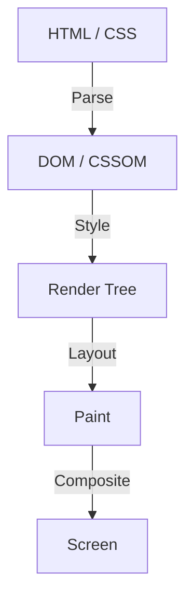

웹 프론트엔드 개발의 역사에 있어서, CSS는 항상 선언적인 언어로 진화해 왔습니다. 개발자가 '어떻게 보여야 하는지'를 기술하고, 브라우저가 그 이면에 있는 복잡한 계산을 수행하여 화면에 픽셀을 그립니다. 이러한 분업은 많은 사용 사례에서 잘 작동해 왔지만, 동시에 하나의 큰 장벽을 만들어 냈습니다. 그것은 '브라우저의 렌더링 파이프라인이 블랙박스이다'라는 문제입니다.

새로운 CSS 기능이 제안되고 나서, 모든 주요 브라우저에 구현되어 개발자가 실제로 사용할 수 있게 되기까지는 수년의 세월이 걸립니다. 폴리필(Polyfill)을 사용하여 새로운 기능을 시뮬레이션하려고 해도, JavaScript를 사용하여 DOM이나 스타일을 빈번하게 조작하면 성능이 현저하게 저하된다는 딜레마가 있었습니다.

이러한 한계를 뛰어넘기 위해 탄생한 것이 **CSS Houdini(후디니)**입니다. 유명한 탈출왕 해리 후디니의 이름을 딴 이 프로젝트는 개발자에게 브라우저의 렌더링 파이프라인에 직접 접근하기 위한 마법의 열쇠를 제공합니다.

본 기사에서는 브라우저 렌더링의 기초부터 JavaScript에 의한 DOM 조작의 성능 문제, 그리고 CSS Houdini의 각 API가 어떻게 이러한 문제를 해결하고 차세대 웹 성능을 실현하는지에 대해 깊이 파헤쳐 봅니다.

## 브라우저의 렌더링 파이프라인 기초

CSS Houdini를 이해하기 위해서는 우선 브라우저가 HTML과 CSS를 받고 나서 화면에 픽셀을 그리기까지의 프로세스, 즉 '렌더링 파이프라인'을 이해할 필요가 있습니다.

1. **Parse(파싱/해석)**
   브라우저는 HTML을 파싱하여 DOM(Document Object Model) 트리를 구축하고, CSS를 파싱하여 CSSOM(CSS Object Model) 트리를 구축합니다.
2. **Style(스타일 계산)**
   DOM과 CSSOM을 결합하여, 어떤 요소에 어떤 스타일이 적용될지를 계산합니다. 그 결과로 렌더 트리(Render Tree)가 생성됩니다.
3. **Layout(레이아웃/리플로우)**
   렌더 트리를 기반으로, 각 요소가 화면상 어디에 배치되고 어느 정도의 크기가 될지(너비, 높이, 위치)를 계산합니다.
4. **Paint(페인트/그리기)**
   요소의 시각적인 속성(색상, 그림자, 텍스트 등)을 픽셀로 레이어에 그립니다.
5. **Composite(컴포지트/합성)**
   페인트된 여러 레이어를 올바른 순서로 겹쳐서 최종적인 이미지를 화면에 출력합니다.

## 기존의 JavaScript와 레이아웃 스래싱

지금까지 CSS에 없는 독자적인 디자인이나 애니메이션을 구현하고 싶을 경우, JavaScript를 사용하여 인라인 스타일을 변경하거나 DOM 요소를 추가·삭제해야 했습니다. 하지만 이는 성능상의 큰 위험을 동반합니다.

JavaScript로 DOM의 속성(예: `offsetWidth`나 `clientHeight`)을 읽으려 하면, 브라우저는 최신 값을 반환하기 위해 보류 중인 스타일 변경을 강제로 적용하고 레이아웃 계산을 재실행해야 합니다. 그리고 그 직후에 JavaScript로 스타일을 변경하면, 다시 레이아웃이 무효화됩니다.

이것을 1프레임(일반적으로 16.6ms) 동안 여러 번 반복하는 현상을 **레이아웃 스래싱(Layout Thrashing)**이라고 부릅니다. 레이아웃 계산은 CPU에 큰 부하를 주기 때문에, 레이아웃 스래싱이 발생하면 프레임 속도가 저하되어 사용자에게 '끊기는(Jank)' 불쾌한 경험이 됩니다.

## CSS Houdini가 가져온 혁명

CSS Houdini는 앞서 언급한 렌더링 파이프라인의 각 단계(Style, Layout, Paint, Composite)에 개발자가 JavaScript(엄밀히 말하면 Worklet이라고 불리는 경량 스레드)를 후킹(개입)시키기 위한 API 그룹입니다.

Houdini를 사용하면 브라우저의 메인 스레드를 차단하지 않고 네이티브 CSS와 동일한 파이프라인 상에서 처리를 실행할 수 있으므로, 압도적인 성능을 유지하면서 CSS 기능을 확장할 수 있습니다.

### Houdini를 구성하는 주요 API 그룹

Houdini는 단일 API가 아니라 여러 사양의 집합체입니다. 대표적인 것들을 몇 가지 살펴보겠습니다.

#### 1. CSS Paint API
아마도 현재 가장 실용화가 진행된 것이 Paint API입니다. 개발자는 Canvas API와 유사한 구문을 사용하여 배경(`background-image`), 테두리(`border-image`), 마스크 등의 이미지를 동적으로 그릴 수 있습니다.

JavaScript(Paint Worklet)로 그리기 로직을 정의하고, CSS에서는 `background-image: paint(my-custom-effect);`와 같이 호출하기만 하면 됩니다. 창 크기 변경 시 등 다시 그리기가 필요한 타이밍에 브라우저가 자동으로 Worklet을 호출하므로 매우 효율적입니다.

#### 2. Typed OM (CSS Typed Object Model)
기존의 CSSOM에서는 CSS 값이 모두 문자열로 처리되었습니다. 예를 들어 `element.style.width = '100px'`와 같이 문자열을 조합하여 대입하면 브라우저는 이를 분석하여 수치와 단위로 변환했습니다.

Typed OM은 CSS 값을 타입이 지정된 JavaScript 객체로 다룰 수 있게 해 줍니다.
`element.attributeStyleMap.set('width', CSS.px(100))`처럼 작성할 수 있어 문자열 파싱이 불필요해지므로 JavaScript에서 CSS를 조작할 때의 성능이 획기적으로 향상됩니다.

#### 3. Properties and Values API
CSS 사용자 지정 속성(CSS 변수)에 타입(구문), 초깃값, 상속 여부를 정의할 수 있는 API입니다.
기존의 CSS 변수는 단순한 토큰 치환이었기 때문에 애니메이션을 적용하기가 어려웠습니다(예를 들어, 색상이 빨간색에서 파란색으로 자연스럽게 변하는 것이 아니라 갑자기 바뀌어 버리는 등).

이 API를 사용하면 '이 변수는 색상이다', '이 변수는 길이이다'라고 브라우저에 알려줄 수 있기 때문에 사용자 지정 속성을 활용한 부드러운 애니메이션이 가능해집니다.

#### 4. CSS Layout API
레이아웃 알고리즘 자체를 직접 만들 수 있는 강력한 API입니다. Flexbox나 Grid와 같은 기존 레이아웃 모델에 의존하지 않고, 예를 들어 'Masonry(벽돌 쌓기) 레이아웃'이나 독자적인 복잡한 그리드 시스템을 브라우저의 네이티브 레이아웃 파이프라인 안에서 고속으로 실행할 수 있게 됩니다.

#### 5. Animation Worklet
스크롤 위치나 사용자 입력에 연동된, 복잡하고 성능이 뛰어난 애니메이션을 만들기 위한 API입니다. 메인 스레드가 아니라 합성(Compositor) 스레드에서 동작하기 때문에, 메인 스레드가 무거운 처리로 차단되어 있어도 애니메이션은 부드럽게 계속 움직입니다(60fps 유지).

## 요약: 마법을 손에 넣은 프론트엔드 개발

CSS Houdini는 웹 프론트엔드 개발의 패러다임 시프트입니다. 브라우저 공급업체가 새로운 CSS 기능을 구현하기를 기다릴 필요가 없어졌고, 개발자 자신이 브라우저 렌더링 엔진의 일부를 확장하고 정의할 수 있게 되었습니다.

이로 인해 과거에는 JavaScript의 남용으로 성능을 희생할 수밖에 없었던 복잡한 디자인이나 애니메이션이 네이티브와 동등한 속도로 실현 가능해집니다. 아직 모든 API가 모든 브라우저에서 지원되는 것은 아니지만, Paint API나 Typed OM 등 일부는 이미 프로덕션 환경에서 이용 가능합니다.

CSS의 미래는 더 이상 브라우저의 진화를 기다리기만 하는 것이 아닙니다. Houdini라는 마법의 지팡이를 손에 쥔 개발자들이 자신의 손으로 직접 개척해 나가는 시대가 도래하고 있는 것입니다.
