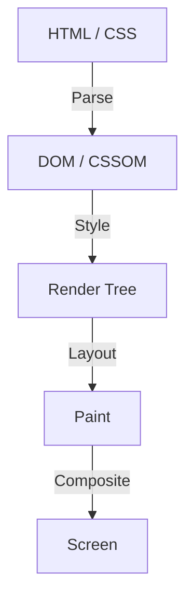

Webフロントエンド開発の歴史において、CSSは常に宣言的な言語として進化してきました。開発者が「どのように見えるべきか」を記述し、ブラウザがその背後にある複雑な計算を行って画面にピクセルを描画する。この分業は多くのユースケースでうまく機能してきましたが、同時に一つの大きな壁を生み出しました。それは「ブラウザのレンダリングパイプラインがブラックボックスである」という問題です。

新しいCSS機能が提案されてから、すべての主要ブラウザで実装され、開発者が実際に使えるようになるまでには数年の歳月がかかります。ポリフィル（Polyfill）を使って新しい機能をシミュレートしようとしても、JavaScriptを使ってDOMやスタイルを頻繁に操作すると、パフォーマンスが著しく低下するというジレンマがありました。

この限界を打ち破るために生まれたのが **CSS Houdini（フーディニ）** です。有名な脱出王ハリー・フーディニの名を冠したこのプロジェクトは、開発者にブラウザのレンダリングパイプラインへ直接アクセスするための魔法の鍵を提供します。

本記事では、ブラウザのレンダリングの基礎から、JavaScriptによるDOM操作のパフォーマンス問題、そしてCSS Houdiniの各APIがどのようにこれらの問題を解決し、次世代のWebパフォーマンスを実現するのかを深く掘り下げます。

## ブラウザのレンダリングパイプラインの基礎

CSS Houdiniを理解するためには、まずブラウザがHTMLとCSSを受け取ってから画面にピクセルを描画するまでのプロセス、すなわち「レンダリングパイプライン」を理解する必要があります。

1. **Parse（解析）**
   ブラウザはHTMLを解析してDOM（Document Object Model）ツリーを構築し、CSSを解析してCSSOM（CSS Object Model）ツリーを構築します。
2. **Style（スタイル計算）**
   DOMとCSSOMを結合し、どの要素にどのスタイルが適用されるかを計算します。この結果としてレンダーツリー（Render Tree）が作成されます。
3. **Layout（レイアウト / リフロー）**
   レンダーツリーに基づいて、各要素が画面上のどこに配置され、どのくらいの大きさになるか（幅、高さ、位置）を計算します。
4. **Paint（ペイント / 描画）**
   要素の視覚的なプロパティ（色、影、テキストなど）をピクセルとしてレイヤーに描画します。
5. **Composite（コンポジット / 合成）**
   ペイントされた複数のレイヤーを正しい順序で重ね合わせ、最終的な画像を画面に出力します。

## 従来のJavaScriptとレイアウトスラッシング

これまで、CSSにない独自のデザインやアニメーションを実現したい場合、JavaScriptを使用してインラインスタイルを変更したり、DOM要素を追加・削除したりする必要がありました。しかし、これはパフォーマンス上の大きなリスクを伴います。

JavaScriptでDOMのプロパティ（例えば `offsetWidth` や `clientHeight`）を読み取ろうとすると、ブラウザは最新の値を返すために、保留中のスタイル変更を強制的に適用し、レイアウト計算を再実行しなければなりません。そして、その直後にJavaScriptでスタイルを変更すると、再びレイアウトが無効になります。

これを1フレーム（通常16.6ms）の間に何度も繰り返す現象を **レイアウトスラッシング（Layout Thrashing）** と呼びます。レイアウト計算はCPUに大きな負荷をかけるため、レイアウトスラッシングが発生するとフレームレートが低下し、ユーザーにとって「カクつく（Jank）」不快な体験となります。

## CSS Houdiniがもたらす革命

CSS Houdiniは、前述のレンダリングパイプラインの各ステップ（Style, Layout, Paint, Composite）に、開発者がJavaScript（厳密にはWorkletと呼ばれる軽量なスレッド）をフック（介入）させるためのAPI群です。

Houdiniを使用すると、ブラウザのメインスレッドをブロックすることなく、ネイティブのCSSと同じパイプライン上で処理を実行できるため、圧倒的なパフォーマンスを維持しながらCSSの機能を拡張できます。

### Houdiniを構成する主要なAPI群

Houdiniは単一のAPIではなく、複数の仕様の集合体です。代表的なものをいくつか見ていきましょう。

#### 1. CSS Paint API
おそらく現在最も実用化が進んでいるのがPaint APIです。開発者はCanvas APIに似た構文を使用して、背景（`background-image`）、境界線（`border-image`）、マスクなどの画像を動的に描画できます。

JavaScript（Paint Worklet）で描画ロジックを定義し、CSSからは `background-image: paint(my-custom-effect);` のように呼び出すだけです。ウィンドウのサイズ変更時など、再描画が必要なタイミングでブラウザが自動的にWorkletを呼び出すため、極めて効率的です。

#### 2. Typed OM (CSS Typed Object Model)
従来のCSSOMでは、CSSの値はすべて文字列として扱われていました。例えば `element.style.width = '100px'` のように文字列を組み立てて代入し、ブラウザはそれを解析して数値と単位に変換していました。

Typed OMは、CSSの値を型付きのJavaScriptオブジェクトとして扱えるようにします。
`element.attributeStyleMap.set('width', CSS.px(100))` のように記述でき、文字列のパースが不要になるため、JavaScriptからCSSを操作する際のパフォーマンスが劇的に向上します。

#### 3. Properties and Values API
CSSのカスタムプロパティ（CSS変数）に型（構文）、初期値、継承の有無を定義できるAPIです。
従来のCSS変数は単なるトークンの置換であったため、アニメーションさせることが困難でした（例えば、色が赤から青へグラデーションするのではなく、パッと切り替わってしまうなど）。

このAPIを使用すると、「この変数は色である」「この変数は長さである」とブラウザに教えることができるため、カスタムプロパティを使ったスムーズなアニメーションが可能になります。

#### 4. CSS Layout API
レイアウトアルゴリズム自体を自作できる強力なAPIです。FlexboxやGridといった既存のレイアウトモデルに頼るのではなく、例えば「Masonry（レンガ積み）レイアウト」や独自の複雑なグリッドシステムを、ブラウザのネイティブレイアウトパイプラインの中で高速に実行できるようになります。

#### 5. Animation Worklet
スクロール位置やユーザーの入力に連動した、複雑でパフォーマンスの高いアニメーションを作成するためのAPIです。メインスレッドではなく、合成（Compositor）スレッドで動作するため、メインスレッドが重い処理でブロックされていても、アニメーションは滑らかに動き続けます（60fpsを維持）。

## まとめ：魔法を手に入れたフロントエンド開発

CSS Houdiniは、Webフロントエンド開発のパラダイムシフトです。ブラウザベンダーが新しいCSS機能を実装するのを待つ必要はなくなり、開発者自身がブラウザのレンダリングエンジンの一部を拡張・定義できるようになりました。

これにより、かつてはJavaScriptの多用によってパフォーマンスを犠牲にせざるを得なかった複雑なデザインやアニメーションが、ネイティブ同等の速度で実現可能になります。まだすべてのAPIが全ブラウザでサポートされているわけではありませんが、Paint APIやTyped OMなど、一部は既にプロダクション環境で利用可能です。

CSSの未来は、もはやブラウザの進化を待つだけのものではありません。Houdiniという魔法の杖を手にした開発者たちが、自らの手で切り拓いていく時代が到来しているのです。
