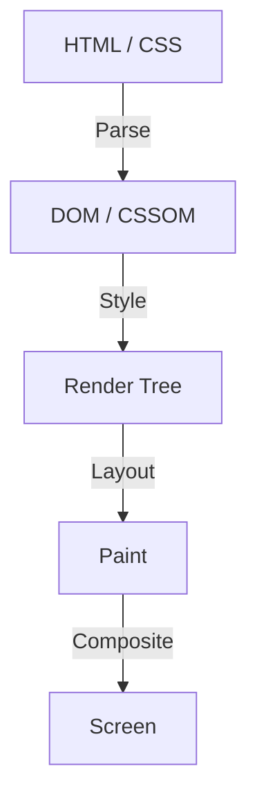

Na história do desenvolvimento frontend web, o CSS sempre evoluiu como uma linguagem declarativa. Os desenvolvedores descrevem "como deve parecer", e o navegador realiza os cálculos complexos por trás para desenhar os pixels na tela. Essa divisão de trabalho tem funcionado bem na maioria dos casos de uso, mas ao mesmo tempo criou uma grande barreira. É o problema de que "o pipeline de renderização do navegador é uma caixa preta".

Leva anos desde o momento em que um novo recurso CSS é proposto até que seja implementado em todos os principais navegadores e os desenvolvedores possam realmente usá-lo. Mesmo se tentarmos simular um novo recurso usando um Polyfill, há o dilema de que manipular DOM ou estilos frequentemente usando JavaScript causa uma degradação significativa de desempenho.

O **CSS Houdini** nasceu para quebrar essa limitação. Este projeto, batizado em homenagem ao famoso rei da fuga Harry Houdini, oferece aos desenvolvedores uma chave mágica para acesso direto ao pipeline de renderização do navegador.

Neste artigo, vamos nos aprofundar nos fundamentos da renderização do navegador, os problemas de desempenho na manipulação do DOM via JavaScript, e como cada API do CSS Houdini resolve esses problemas para entregar um desempenho web de próxima geração.

## Fundamentos do pipeline de renderização do navegador

Para entender o CSS Houdini, primeiro você precisa entender o processo pelo qual o navegador recebe o HTML e CSS e desenha os pixels na tela, ou seja, o "pipeline de renderização".

1. **Parse (Análise)**
   O navegador analisa o HTML para construir a árvore DOM (Document Object Model) e analisa o CSS para construir a árvore CSSOM (CSS Object Model).
2. **Style (Cálculo de estilo)**
   Combina o DOM e o CSSOM e calcula quais estilos se aplicam a quais elementos. O resultado disso é a criação da Render Tree (Árvore de Renderização).
3. **Layout (Layout / Refluxo)**
   Com base na Render Tree, calcula onde cada elemento será posicionado na tela e qual será seu tamanho (largura, altura, posição).
4. **Paint (Pintura / Desenho)**
   Desenha as propriedades visuais do elemento (cores, sombras, texto, etc.) em pixels como camadas.
5. **Composite (Composição / Síntese)**
   Sobrepõe várias camadas pintadas na ordem correta e emite a imagem final na tela.

## O JavaScript tradicional e o Layout Thrashing

Historicamente, se quiséssemos alcançar um design ou animação original não disponível no CSS, tínhamos que usar JavaScript para alterar estilos inline ou adicionar/remover elementos do DOM. No entanto, isso traz um risco significativo de desempenho.

Quando você tenta ler as propriedades do DOM com JavaScript (por exemplo, `offsetWidth` ou `clientHeight`), o navegador deve aplicar obrigatoriamente quaisquer mudanças de estilo pendentes e recalcular o layout para retornar os valores mais recentes. E se você alterar os estilos via JavaScript imediatamente a seguir, o layout torna-se inválido novamente.

Esse fenômeno de repetição várias vezes num único quadro (normalmente 16.6ms) é chamado de **Layout Thrashing (Destruição de Layout)**. Os cálculos de layout colocam uma grande carga na CPU, de modo que a ocorrência de Layout Thrashing diminui a taxa de quadros e cria uma experiência desconfortável com travamentos (Jank) para os usuários.

## A revolução trazida pelo CSS Houdini

O CSS Houdini é um conjunto de APIs que permite aos desenvolvedores "enganchar" (intervir) JavaScript (estritamente falando, uma thread leve chamada Worklet) em cada etapa do pipeline de renderização mencionado acima (Style, Layout, Paint, Composite).

Ao usar o Houdini, você pode estender as funcionalidades do CSS mantendo um desempenho esmagador, pois ele pode executar processamento no mesmo pipeline do CSS nativo, sem bloquear a thread principal do navegador.

### Principais APIs que compõem o Houdini

O Houdini não é uma única API, mas sim uma coleção de várias especificações. Vejamos as mais representativas.

#### 1. CSS Paint API
Talvez a mais avançada na aplicação prática hoje em dia seja a Paint API. Os desenvolvedores podem usar uma sintaxe semelhante à Canvas API para desenhar dinamicamente imagens para o fundo (`background-image`), bordas (`border-image`), máscaras, etc.

Basta definir a lógica de desenho em JavaScript (Paint Worklet) e chamá-la no CSS com algo como `background-image: paint(my-custom-effect);`. É extremamente eficiente, pois o navegador chama o Worklet automaticamente no momento em que é necessário um redesenho, como ao redimensionar a janela.

#### 2. Typed OM (CSS Typed Object Model)
No CSSOM tradicional, todos os valores CSS eram tratados como strings. Por exemplo, você montaria uma string e a atribuiria, como `element.style.width = '100px'`, e o navegador a analisaria e a converteria em um número e uma unidade.

O Typed OM permite tratar valores CSS como objetos JavaScript tipados.
Você pode escrever como `element.attributeStyleMap.set('width', CSS.px(100))` e, como a análise de string não é mais necessária, o desempenho da manipulação de CSS a partir do JavaScript aumenta dramaticamente.

#### 3. Properties and Values API
Uma API que permite definir tipo (sintaxe), valor inicial e capacidade de herança para propriedades personalizadas do CSS (variáveis CSS).
Como as variáveis CSS tradicionais eram meras substituições de tokens, era difícil animá-las (por exemplo, as cores mudariam repentinamente em vez de apresentar um gradiente suave do vermelho para o azul).

Ao usar esta API, você pode dizer ao navegador que "essa variável é uma cor" ou "essa variável é um comprimento", tornando possíveis animações suaves usando propriedades personalizadas.

#### 4. CSS Layout API
Uma API poderosa que permite criar seus próprios algoritmos de layout. Em vez de depender de modelos de layout existentes como Flexbox ou Grid, você pode executar em alta velocidade um layout "Masonry" (alvenaria) ou o seu próprio sistema de grade complexo dentro do pipeline de layout nativo do navegador.

#### 5. Animation Worklet
Uma API para criar animações complexas e de alto desempenho atreladas à posição de rolagem ou às entradas do usuário. Uma vez que opera na thread do Compositor e não na thread principal, a animação continuará a mover-se suavemente (mantendo 60fps) mesmo se a thread principal for bloqueada por um processamento pesado.

## Conclusão: Desenvolvimento frontend ganhando magia

O CSS Houdini é uma mudança de paradigma no desenvolvimento frontend web. Já não precisamos esperar que os fabricantes de navegadores implementem novas funcionalidades CSS, agora os próprios desenvolvedores podem estender e definir partes do motor de renderização do navegador.

Isso possibilita realizar designs e animações complexas à velocidade nativa, que anteriormente nos obrigavam a sacrificar o desempenho devido ao uso intensivo de JavaScript. Embora ainda nem todas as APIs sejam suportadas em todos os navegadores, algumas delas, como a Paint API e o Typed OM, já estão disponíveis em ambientes de produção.

O futuro do CSS não se trata mais de simplesmente esperar pela evolução dos navegadores. Já chegou a era em que os desenvolvedores equipados com a varinha mágica chamada Houdini podem forjar o seu próprio caminho com as próprias mãos.
