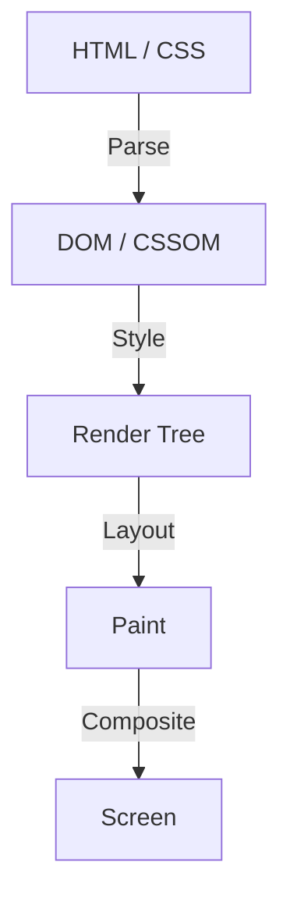

В истории разработки веб-фронтенда CSS всегда развивался как декларативный язык. Разработчики описывают, «как это должно выглядеть», а браузер выполняет сложные вычисления в фоновом режиме, чтобы нарисовать пиксели на экране. Такое разделение труда хорошо работало для многих сценариев использования, но в то же время создало один большой барьер. Это проблема того, что «конвейер рендеринга браузера является черным ящиком».

От момента предложения новой функции CSS до ее реализации во всех основных браузерах и фактической доступности для разработчиков проходят годы. Даже при попытке симулировать новые функции с помощью полифиллов (Polyfill), возникала дилемма: частое манипулирование DOM и стилями с помощью JavaScript приводило к значительному снижению производительности.

Чтобы преодолеть это ограничение, и был создан **CSS Houdini**. Названный в честь знаменитого иллюзиониста Гарри Гудини, этот проект предоставляет разработчикам волшебный ключ для прямого доступа к конвейеру рендеринга браузера.

В этой статье мы глубоко погрузимся в основы рендеринга браузера, проблемы производительности манипуляций с DOM с помощью JavaScript, а также в то, как различные API CSS Houdini решают эти проблемы и обеспечивают производительность веб-приложений следующего поколения.

## Основы конвейера рендеринга браузера

Чтобы понять CSS Houdini, сначала необходимо понять процесс от получения браузером HTML и CSS до отрисовки пикселей на экране, то есть «конвейер рендеринга».

1. **Parse (Синтаксический анализ)**
   Браузер анализирует HTML для построения дерева DOM (Document Object Model) и анализирует CSS для построения дерева CSSOM (CSS Object Model).
2. **Style (Вычисление стилей)**
   Объединяет DOM и CSSOM, вычисляя, какие стили применяются к каким элементам. В результате создается дерево рендеринга (Render Tree).
3. **Layout (Компоновка / Перекомпоновка)**
   На основе дерева рендеринга вычисляется, где будет расположен каждый элемент на экране и какого он будет размера (ширина, высота, позиция).
4. **Paint (Отрисовка)**
   Визуальные свойства элементов (цвета, тени, текст и т. д.) рисуются как пиксели на слоях.
5. **Composite (Композитинг / Объединение)**
   Несколько нарисованных слоев накладываются друг на друга в правильном порядке, выводя окончательное изображение на экран.

## Традиционный JavaScript и Layout Thrashing

Раньше, когда вы хотели реализовать уникальные дизайны или анимации, которых не было в CSS, вам приходилось использовать JavaScript для изменения встроенных стилей или добавления/удаления элементов DOM. Однако это связано со значительными рисками для производительности.

Когда вы пытаетесь прочитать свойства DOM (например, `offsetWidth` или `clientHeight`) с помощью JavaScript, браузер должен принудительно применить все ожидающие изменения стилей и повторно выполнить вычисления макета, чтобы вернуть самое актуальное значение. И если сразу после этого вы измените стиль с помощью JavaScript, макет снова станет недействительным.

Явление, при котором это повторяется многократно в течение одного кадра (обычно 16.6 мс), называется **Layout Thrashing (Пробуксовка макета)**. Поскольку вычисления макета сильно нагружают процессор, возникновение Layout Thrashing приводит к падению частоты кадров, что создает неприятный «дерганый» (Jank) пользовательский опыт.

## Революция, которую приносит CSS Houdini

CSS Houdini — это набор API, который позволяет разработчикам внедрять (hook) JavaScript (строго говоря, легковесные потоки, называемые Worklet) на каждом шаге упомянутого конвейера рендеринга (Style, Layout, Paint, Composite).

Используя Houdini, вы можете выполнять процессы в том же конвейере, что и нативный CSS, не блокируя основной поток браузера, что позволяет расширять функциональность CSS, сохраняя при этом потрясающую производительность.

### Основные API, составляющие Houdini

Houdini — это не один API, а набор из нескольких спецификаций. Давайте рассмотрим некоторые из наиболее важных.

#### 1. CSS Paint API
Возможно, в настоящее время наиболее широко применяемым на практике является Paint API. Разработчики могут использовать синтаксис, похожий на Canvas API, для динамической отрисовки изображений, таких как фон (`background-image`), границы (`border-image`) и маски.

Вы определяете логику отрисовки в JavaScript (Paint Worklet) и просто вызываете ее из CSS как `background-image: paint(my-custom-effect);`. Это чрезвычайно эффективно, поскольку браузер автоматически вызывает Worklet, когда требуется перерисовка, например, при изменении размера окна.

#### 2. Typed OM (CSS Typed Object Model)
В традиционном CSSOM все значения CSS обрабатывались как строки. Например, вы бы собирали и присваивали строку как `element.style.width = '100px'`, а браузер анализировал ее и конвертировал в числа и единицы измерения.

Typed OM позволяет обрабатывать значения CSS как типизированные объекты JavaScript.
Это можно записать как `element.attributeStyleMap.set('width', CSS.px(100))`, устраняя необходимость в парсинге строк и радикально улучшая производительность при манипулировании CSS из JavaScript.

#### 3. Properties and Values API
API, который позволяет определять тип (синтаксис), начальное значение и возможность наследования для пользовательских свойств CSS (переменных CSS).
Традиционные переменные CSS были просто заменой токенов, что делало их анимацию сложной (например, вместо того чтобы плавно переходить от красного цвета к синему, он бы просто резко переключился).

Используя этот API, вы можете сообщить браузеру, что «эта переменная является цветом» или «эта переменная является длиной», что позволяет создавать плавные анимации с использованием пользовательских свойств.

#### 4. CSS Layout API
Мощный API, который позволяет вам создавать собственные алгоритмы компоновки. Вместо того, чтобы полагаться на существующие модели компоновки, такие как Flexbox или Grid, вы можете быстро выполнять, например, «Masonry (кирпичная кладка) layout» или свои собственные сложные системы сеток внутри нативного конвейера компоновки браузера.

#### 5. Animation Worklet
API для создания сложных, высокопроизводительных анимаций, которые синхронизируются с позицией прокрутки или вводом пользователя. Поскольку он работает в потоке композитинга (Compositor thread), а не в основном потоке, анимации продолжают плавно двигаться (сохраняя 60fps), даже если основной поток заблокирован тяжелой обработкой.

## Заключение: Фронтенд-разработка обрела магию

CSS Houdini — это смена парадигмы в разработке веб-фронтенда. Нам больше не нужно ждать, пока поставщики браузеров реализуют новые функции CSS; сами разработчики теперь могут расширять и определять части механизма рендеринга браузера.

В результате сложные дизайны и анимации, которые раньше требовали жертв в производительности из-за интенсивного использования JavaScript, теперь могут быть реализованы на скоростях, эквивалентных нативным. Хотя не все API еще поддерживаются во всех браузерах, некоторые из них, такие как Paint API и Typed OM, уже доступны в производственных средах.

Будущее CSS больше не сводится к простому ожиданию эволюции браузера. Наступила эра, когда разработчики, вооруженные волшебной палочкой под названием Houdini, прокладывают свой собственный путь.
