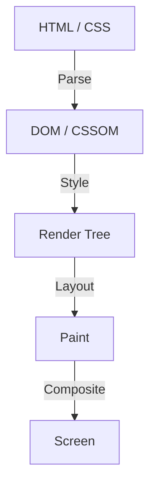

在 Web 前端开发的历史中，CSS 一直作为一种声明式语言在演进。开发者描述“它应该看起来像什么”，浏览器则在后台执行复杂的计算以将像素绘制到屏幕上。这种分工在许多用例中运作良好，但同时也产生了一个巨大的障碍。那就是“浏览器的渲染管线是一个黑盒”的问题。

从一个新的 CSS 特性被提出，到在所有主流浏览器中实现并让开发者能够实际使用，需要数年的时间。即使试图使用 Polyfill 来模拟新功能，通过 JavaScript 频繁操作 DOM 和样式也会导致性能显著下降的困境。

为了打破这个限制，**CSS Houdini** 应运而生。这个以著名脱逃大师哈利·胡迪尼（Harry Houdini）命名的项目，为开发者提供了一把直接访问浏览器渲染管线的魔法钥匙。

在本文中，我们将深入探讨从浏览器渲染基础到 JavaScript DOM 操作的性能问题，以及 CSS Houdini 的各个 API 是如何解决这些问题并实现下一代 Web 性能的。

## 浏览器渲染管线基础

为了理解 CSS Houdini，首先需要了解从浏览器接收 HTML 和 CSS 到在屏幕上绘制像素的过程，即“渲染管线”。

1. **Parse（解析）**
   浏览器解析 HTML 构建 DOM（文档对象模型）树，解析 CSS 构建 CSSOM（CSS 对象模型）树。
2. **Style（样式计算）**
   结合 DOM 和 CSSOM，计算哪些样式应用于哪些元素。此过程的结果是创建渲染树（Render Tree）。
3. **Layout（布局 / 重排）**
   基于渲染树，计算每个元素在屏幕上的位置和大小（宽度、高度、位置）。
4. **Paint（绘制）**
   将元素的视觉属性（颜色、阴影、文本等）作为像素绘制到图层上。
5. **Composite（合成）**
   将绘制的多个图层按正确的顺序叠加，并将最终图像输出到屏幕。

## 传统的 JavaScript 和布局抖动 (Layout Thrashing)

过去，如果你想实现 CSS 中没有的独特设计或动画，你需要使用 JavaScript 来更改内联样式，或者添加/删除 DOM 元素。然而，这伴随着巨大的性能风险。

当你试图用 JavaScript 读取 DOM 属性（例如 `offsetWidth` 或 `clientHeight`）时，浏览器必须强制应用挂起的样式更改并重新运行布局计算，以返回最新值。然后，如果紧接着用 JavaScript 更改样式，布局将再次失效。

在 1 帧（通常为 16.6 毫秒）内多次重复这种现象被称为 **布局抖动（Layout Thrashing）**。由于布局计算会给 CPU 带来巨大负载，发生布局抖动时帧率会下降，给用户带来“卡顿（Jank）”的不良体验。

## CSS Houdini 带来的革命

CSS Houdini 是一组 API，允许开发者使用 JavaScript（严格来说是称为 Worklet 的轻量级线程）介入（Hook）前面提到的渲染管线的各个步骤（Style、Layout、Paint、Composite）。

使用 Houdini，你可以在与原生 CSS 相同的管线上执行处理，而不会阻塞浏览器的主线程，从而在扩展 CSS 功能的同时保持压倒性的性能。

### 构成 Houdini 的主要 API

Houdini 不是单一的 API，而是多个规范的集合。让我们来看看其中一些具有代表性的规范。

#### 1. CSS Paint API
目前投入实际应用最多的可能就是 Paint API。开发者可以使用类似于 Canvas API 的语法动态绘制背景（`background-image`）、边框（`border-image`）、遮罩等图像。

只需在 JavaScript（Paint Worklet）中定义绘制逻辑，然后在 CSS 中像 `background-image: paint(my-custom-effect);` 这样调用即可。在调整窗口大小等需要重新绘制的时候，浏览器会自动调用 Worklet，因此效率极高。

#### 2. Typed OM (CSS Typed Object Model)
在传统的 CSSOM 中，所有 CSS 值都被处理为字符串。例如，你必须像 `element.style.width = '100px'` 那样拼接字符串并赋值，然后浏览器再解析它并将其转换为数字和单位。

Typed OM 允许将 CSS 值作为带类型的 JavaScript 对象处理。
它可以写成 `element.attributeStyleMap.set('width', CSS.px(100))`，从而无需解析字符串，大幅提升了通过 JavaScript 操作 CSS 时的性能。

#### 3. Properties and Values API
这个 API 允许你为 CSS 自定义属性（CSS 变量）定义类型（语法）、初始值和是否继承。
因为传统的 CSS 变量仅仅是令牌（Token）替换，所以很难对它们进行动画处理（例如，颜色不是从红色渐变到蓝色，而是瞬间切换）。

使用这个 API，你可以告诉浏览器“这个变量是一个颜色”、“这个变量是一个长度”，从而使使用自定义属性的平滑动画成为可能。

#### 4. CSS Layout API
一个强大的 API，允许你自己创建布局算法。你不必依赖 Flexbox 或 Grid 等现有的布局模型，而是可以，例如，在浏览器的原生布局管线中高速执行“瀑布流（Masonry）布局”或你自己的复杂网格系统。

#### 5. Animation Worklet
用于创建与滚动位置或用户输入联动的高性能复杂动画的 API。因为它在合成（Compositor）线程而不是主线程上运行，所以即使主线程被繁重的处理阻塞，动画也会继续流畅运行（保持 60fps）。

## 总结：获得魔法的前端开发

CSS Houdini 是 Web 前端开发的一次范式转换。开发者不再需要等待浏览器厂商实现新的 CSS 特性，而是可以自己扩展和定义浏览器渲染引擎的一部分。

这使得以前为了复杂的动画和设计而不得不大量使用 JavaScript 从而牺牲性能的做法成为过去，现在可以以与原生相当的速度实现它们。虽然目前并非所有浏览器都支持所有 API，但 Paint API 和 Typed OM 等部分功能已经可以在生产环境中使用。

CSS 的未来不再只是等待浏览器的演进。手握 Houdini 这根魔杖的开发者们，正在迎来一个由自己亲手开拓的新时代。
